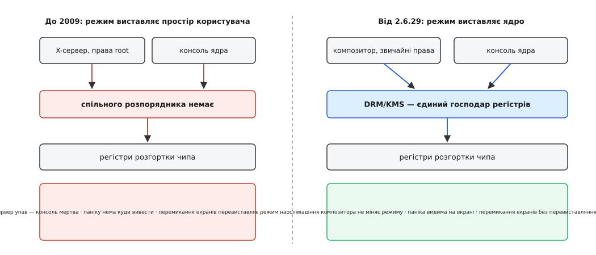

# 📜 Від відеоBIOS до ядра: як виставляння режиму переїхало всередину

Чверть століття роздільність екрана в Unix виставляла звичайна програма з простору користувача — графічний сервер, — і лише 2009 року цю роботу забрало ядро. Переїзд однієї невеликої функції розтягнувся на роки, бо з'ясувалося, що без переписаного керування пам'яттю графічного чипа її просто нікуди переносити.

## Розпорядник, що народився заради малювання, а не заради режиму

Почалося все з іншої задачі. Наприкінці дев'яностих у графічних платах з'явилося тривимірне прискорення, і виникло питання, як програма може малювати на чипі **прямо**, не проганяючи кожен трикутник крізь графічний сервер. Проєкт, що це розв'язував, назвали DRI (*Direct Rendering Infrastructure* — «інфраструктура прямого малювання»); його завела компанія Precision Insight — Єнс Овен (Jens Owen) і Кевін Е. Мартін (Kevin E. Martin), — а гроші давали Silicon Graphics і Red Hat.

Прямий доступ одразу породив свою біду: якщо в чип пише кілька програм водночас, хтось має стежити, щоб вони не затирали одна одну командні черги та не зчитували чужі текстури. Такий арбітр мусить жити в ядрі — бо тільки ядро бачить усі процеси відразу й переживає смерть будь-якого з них. Цю частину написав Рікард Файт (Rickard E. Faith); його документ 1999 року так і звався — «The Direct Rendering Manager: Kernel Support for the Direct Rendering Infrastructure». Перша версія DRM була латкою до ядра Linux для плат 3dfx і їхала **всередині вихідних текстів Mesa**; у головну гілку ядра її взяли того самого 1999 року, у 2.3.18. *(Статус: усталений факт, зафіксований у самому документі Файта та в історії ядра.)*

Варто помітити, чого в цій історії немає. DRM народився як розпорядник **спільного доступу до чипа для малювання**. Про виставляння режиму — про те, скільки пікселів у рядку й з якою частотою бігає розгортка — у ньому не йшлося взагалі. Ця робота лишалася там, де була завжди.

## Чому режим десятиліттями виставляв X-сервер

А була вона в X-сервері, і на те були поважні причини, а не самий лише спадок.

Перша — хронологія: X старший за все, про що тут мова. Коли він з'явився, ядро Unix узагалі не мало наміру знати, що таке відеоплата з роздільностями; екраном був термінал на дроті. Друга причина важливіша. Знання про те, як завести конкретний чип у конкретному режимі, — це не алгоритм, а **гори подробиць**: таблиці дільників частоти, порядок запису в регістри, обхідні шляхи для окремих ревізій кристала. На кожну плату свій том. Тримати ці томи в ядрі ніхто не хотів.

Тому обходилися двома способами, обидва з простору користувача. Простіший — покликати **відеоBIOS** самої плати: у прошивці є процедура `int 10h`, яка вміє виставити режим зі свого списку. Виклик цей — з часів реального режиму x86, тож сервер запускав його або в режимі `vm86`, або через власний емулятор інструкцій, або через ще один шар прошивки. Спосіб другий — програмувати регістри самотужки, за документацією виробника, коли BIOS-івського списку не вистачало.

Обидва вимагали, щоб графічний сервер мав повний доступ до заліза: відображення фізичної пам'яті через `/dev/mem`, дозвіл на порти вводу-виводу. Тому X-сервер роками ходив із правами суперкористувача — і це прийняли як плату за роботу.

> **Що треба знати про доступ до фізичної пам'яті:** [`mmap` кладе у власний адресний простір процесу чужу пам'ять](root:sys-unix/mmap-model) — зокрема й ділянку, за якою стоять регістри пристрою, після чого запис у звичайну змінну стає командою залізу. Саме так сервер і діставався чипа.

Поки на машині був **рівно один** графічний господар, схема трималася. Вона розсипалася від того, що господарів завжди більше одного.

*Змінилася не кількість коду, а те, кому належать регістри. Один господар — і три давні болячки зникають самі.*

## Що на цьому ламалося

Болячки ці описували щоразу тими самими словами, бо кожен користувач Linux бачив їх на власні очі.

**Мертва консоль після падіння сервера.** Сервер лишав чип у стані, який знав лише він сам, — і помирав. Ядро про цей стан не знало нічого: у нього була своя картина світу, застаріла на кілька секунд. Спроба намалювати текстову консоль поверх невідомого стану давала чорний екран або кашу. Найгірше, що саме цієї миті на екрані мало б бути повідомлення, чому все впало.

**Паніка, якої не видно.** Коли падає саме ядро, воно мусить показати останнє повідомлення — і не має права ні на що спиратися, бо процеси вже не працюють. Але виставити режим воно не вміло: цим завідувала програма, яка в цей момент мертва. Тож найважливіший текст у системі роками діставався лише тим, у кого був увіткнутий послідовний кабель.

> **Що треба знати про паніку:** [коли ядро натрапляє на непоправну помилку, воно зупиняє все й друкує стан](root:sys-unix/kernel-oops-panic) — саме той текст, який має потрапити на екран без допомоги жодної програми.

**Блимання при перемиканні екранів.** Перехід між [віртуальними консолями](root:sys-unix/virtual-console) — кількома текстовими екранами ядра на одній клавіатурі — і графічним сеансом означав, що два різні шматки коду по черзі перевиставляють режим із нуля. Звідси й видима пауза з чорнотою та клацанням монітора на кожному `Ctrl+Alt+F1`. Так само й завантаження: заставка прошивки, потім консоль ядра, потім сервер — три перевиставляння підряд, три спалахи.

**Двоє господарів одних регістрів.** Це корінь усіх трьох. Набір регістрів розгортки — узгоджений стан, а не купка незалежних перемикачів; двоє, що пишуть у нього кожен зі свого уявлення про поточну картину, дають не компроміс, а сміття.

## Чому не можна було просто перенести код

Коли 2007 року Джессі Барнс (Jesse Barnes) з Intel виклав першу пропозицію перенести виставляння режиму в ядро, а в грудні того ж року Жером Ґліс (Jérôme Glisse) почав робити те саме для плат ATI, стало видно неприємне. Мало навчити ядро писати в регістри розгортки. Режим без картинки нічого не вартий, а картинка — це буфер у пам'яті чипа. Отже, ядро мусить **розподіляти й тримати цю пам'ять само**: виділяти буфери, знати, які з них зараз під розгорткою, віддавати їх у простір користувача на малювання й забирати назад. А керування пам'яттю графічного чипа на той час було найзаплутанішою частиною драйверів.

Тому черга виявилася такою: спершу керування пам'яттю, і лише потім режим.

Першим приїхав **GEM** (*Graphics Execution Manager* — «розпорядник виконання графіки»), який зробили Кіт Пакард (Keith Packard) та Емма Анголт (Emma Anholt; у публікаціях тих років — Eric Anholt) з Intel, свідомо простішим за наявні спроби й припасованим до свого драйвера `i915`. Його взяли в ядро 2.6.28 у грудні 2008 року.

Другий підхід, **TTM** (*Translation Table Maps* — «таблиці перекладу відображень»), писав Томас Гельстрем (Thomas Hellström) із Tungsten Graphics разом з Еммою Анголт та Дейвом Ейрлі (Dave Airlie) з Red Hat. Він був загальніший — умів возити буфери між оперативною пам'яттю й пам'яттю плати, — і саме за складність його спершу не прийняли. У ядро TTM потрапив аж у вересні 2009 року, у 2.6.31, як передумова для KMS-драйвера Radeon. *(Статус: усталений факт, підтверджений журналами змін ядра.)*

Між цими двома датами й стався переїзд. **KMS** — *Kernel Mode Setting*, «виставляння режиму в ядрі» — увійшов у Linux 2.6.29 у березні 2009 року, разом із підтримкою в драйвері `i915`. Хронологія тут промовиста сама: грудень 2008 — пам'ять для Intel, березень 2009 — режим для Intel, вересень 2009 — загальна пам'ять, і слідом режим для всіх інших.

## Що з цього вийшло

Три давні болячки зникли не тому, що їх полагодили, а тому, що зник їхній спільний корінь. Консоль ядра тепер малює через ті самі структури KMS, тож перемикання між нею й графічним сеансом — це підміна вмісту, а не перевиставляння режиму. Паніка має куди вивестися, бо режим уже стоїть і належить ядру. Падіння композитора лишає екран у робочому стані.

І ще одне, менш очевидне. Коли режим виставляє ядро, графічній програмі більше не потрібні права суперкористувача — вона просить ядро командами через файл пристрою, а ядро вирішує, чи вона зараз має право розпоряджатися екраном. Без цього кроку не з'явився б жоден із композиторів, що працюють від імені звичайного користувача.
