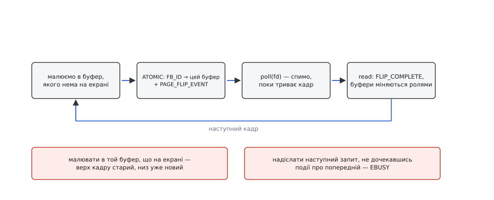

# ⚙️ Двісті рядків на C, які самі виставляють режим і крутять анімацію

Програма нижче бере на себе весь екран без графічного сервера, без бібліотек малювання й без драйвера тривимірної графіки: відкриває `/dev/dri/card0`, вибирає режим, робить два буфери й перемикає їх по вертикальній паузі. Складати її руками варто тому, що модель KMS складається з масок, номерів і властивостей, які легко переказати словами й майже неможливо правильно поєднати з першого разу — кожна помилка тут дає не виняток, а чорний екран.

## Що вона робить

Запускати треба з текстової консолі (`Ctrl+Alt+F3`), бо в графічному сеансі екран уже зайнятий. Програма знаходить під'єднаний монітор, бере його бажаний режим, малює в пам'ять вертикальну смугу, що їде вправо, і десять секунд показує кадри — рівно з тактом панелі. Потім повертає екран консолі.

Збирати так:

```
cc atomic-modeset.c -o atomic-modeset $(pkg-config --cflags --libs libdrm)
```

Чотири шматки коду нижче, складені підряд у тому ж порядку, і є цим файлом.

## Крок 1. Відкрити вузол і попроситися в господарі

Дві дрібниці на початку визначають, чи побачить програма взагалі бодай щось.

Перша: за замовчуванням ядро показує клієнтові стару, доатомарну картину світу — самі лише основні плоскості й жодних властивостей. Це навмисне: старі програми не мають раптом побачити ресурси, яких не розуміють. Тому клієнт мусить оголоситися сам, викликом `drmSetClientCap`. Прапорець `DRM_CLIENT_CAP_ATOMIC` за документацією ядра вмикає й `DRM_CLIENT_CAP_UNIVERSAL_PLANES` — але просити обидва явно не зайве: так одразу видно, на чому саме драйвер відмовив.

Друга: право виставляти режим має рівно один дескриптор на весь пристрій. `drmSetMaster` дасть його лише тоді, коли господаря немає взагалі; з-під працюючого композитора буде відмова, і це не збій програми, а правильна поведінка ядра. У справжніх програмах дескриптор не відкривають самі — його просять у [служби сеансів і місць](topic:sys-unix/logind-sessions-seats), яка знає, чий сеанс зараз активний, і сама передає готовий дескриптор.

І одразу — тонкість, на якій ламаються навіть акуратні: **дві родини викликів libdrm повертають помилку по-різному**. Усе з `xf86drmMode.h` (`drmModeAtomicCommit`, `drmModeAddFB2`, `drmModeCreatePropertyBlob`) віддає **мінус errno** просто значенням, лишаючи глобальний `errno` недоторканим. А `drmIoctl`, `drmSetMaster` і `drmSetClientCap` з `xf86drm.h` поводяться як звичайні системні виклики: `−1` і код у `errno`. Надрукуєте `strerror(errno)` після невдалого `drmModeAtomicCommit` — отримаєте повідомлення від якоїсь давно минулої помилки й шукатимете причину не там.

```c
/* atomic-modeset.c — від вузла пристрою до анімації, без нічого зайвого. */
#define _GNU_SOURCE
#include <stdio.h>
#include <stdlib.h>
#include <string.h>
#include <errno.h>
#include <fcntl.h>
#include <unistd.h>
#include <poll.h>
#include <signal.h>
#include <sys/mman.h>
#include <xf86drm.h>
#include <xf86drmMode.h>
#include <drm_fourcc.h>

static volatile sig_atomic_t stop;
static void on_int(int sig) { (void)sig; stop = 1; }

/* rc усюди тримаємо в одному вигляді — від'ємне −errno. */
static void die(const char *what, int rc)
{
    fprintf(stderr, "%s: %s\n", what, strerror(-rc));
    exit(1);
}

/* Номер властивості за іменем; заразом віддає поточне значення. */
static uint32_t prop_of(int fd, uint32_t obj, uint32_t type,
                        const char *name, uint64_t *value)
{
    drmModeObjectProperties *props = drmModeObjectGetProperties(fd, obj, type);
    uint32_t id = 0;
    if (!props)
        return 0;
    for (uint32_t i = 0; i < props->count_props && !id; i++) {
        drmModePropertyRes *p = drmModeGetProperty(fd, props->props[i]);
        if (!p)
            continue;
        if (!strcmp(p->name, name)) {
            id = p->prop_id;
            if (value)
                *value = props->prop_values[i];
        }
        drmModeFreeProperty(p);
    }
    drmModeFreeObjectProperties(props);
    return id;
}
```

Пошук властивості за іменем виглядає марнотратно — і таким є, якщо робити його щокадру. Але робиться він один раз на старті, і саме він робить програму сумісною наперед: чого ядро не має, того вона просто не знайде й не попросить.

## Крок 2. Скласти ланцюг із масок

Тепер найцікавіше. Треба знайти трійку «роз'єм — CRTC — основна плоскість», яку залізо погодиться з'єднати. Роз'єм знаходиться просто: перебрати всі й узяти той, у якого `connection == DRM_MODE_CONNECTED` і є хоч один режим. Режим беремо той, що позначений `DRM_MODE_TYPE_PREFERRED` — це рідна роздільність панелі, узята з EDID.

А далі — пастка, на яку натикаються всі. Роз'єм несе список кодерів, кодер несе `possible_crtcs`, плоскість несе свою `possible_crtcs`, і обидві ці маски **нумерують не об'єкти, а позиції в масиві** `res->crtcs[]`. Біт номер 1 не означає «CRTC з номером 1» — він означає «той CRTC, що лежить другим у масиві, який щойно віддало ядро». Номер об'єкта треба звідти дістати, а не вгадати.

![Три CRTC у масиві res->crtcs[] з номерами 41, 52, 63; маска possible_crtcs = 0b010 вмикає біт 1, тобто позицію 1, тобто CRTC із номером 52](img/possible-crtcs-mask.svg)

*Маска зберігає індекси, а не номери. Тому позицію треба запам'ятати разом із номером: номер піде у властивості, індекс — у наступні перевірки масок.*

Основна плоскість шукається так само: перебрати всі плоскості, лишити ті, чия маска містить наш індекс, і взяти з них ту, у якої властивість `type` дорівнює `DRM_PLANE_TYPE_PRIMARY`. Саме тут стає видно, навіщо був `UNIVERSAL_PLANES`: без нього ядро не покаже ні цієї властивості, ні половини плоскостей.

```c
struct fb {                       /* буфер: пам'ять, її опис і вікно в неї */
    uint32_t handle, pitch, fb_id;
    uint64_t size;
    uint8_t *map;
};

static int fb_create(int fd, struct fb *b, uint32_t w, uint32_t h)
{
    struct drm_mode_create_dumb creq = { .width = w, .height = h, .bpp = 32 };
    if (drmIoctl(fd, DRM_IOCTL_MODE_CREATE_DUMB, &creq) < 0)
        return -errno;
    b->handle = creq.handle;
    b->pitch  = creq.pitch;
    b->size   = creq.size;

    uint32_t handles[4] = { b->handle }, pitches[4] = { b->pitch }, offsets[4] = { 0 };
    int rc = drmModeAddFB2(fd, w, h, DRM_FORMAT_XRGB8888,
                           handles, pitches, offsets, &b->fb_id, 0);
    if (rc)
        return rc;

    struct drm_mode_map_dumb mreq = { .handle = b->handle };
    if (drmIoctl(fd, DRM_IOCTL_MODE_MAP_DUMB, &mreq) < 0)
        return -errno;
    b->map = mmap(NULL, b->size, PROT_READ | PROT_WRITE, MAP_SHARED, fd, mreq.offset);
    if (b->map == MAP_FAILED)
        return -errno;
    memset(b->map, 0, b->size);
    return 0;
}

/* Смуга їде вправо по градієнту — розрив кадру на такій картинці видно оком. */
static void draw(struct fb *b, uint32_t w, uint32_t h, int frame)
{
    uint32_t bar = (uint32_t)((frame * 8) % w);
    for (uint32_t y = 0; y < h; y++) {
        uint32_t *row = (uint32_t *)(b->map + (size_t)y * b->pitch);
        uint32_t g = y * 255 / h;
        for (uint32_t x = 0; x < w; x++) {
            uint32_t d = (x >= bar) ? x - bar : bar - x;
            row[x] = (d < 40) ? 0x00ffffff
                              : ((x * 255 / w) << 16) | (g << 8) | 0x40;
        }
    }
}
```

## Крок 3. Пам'ять під картинку

`DRM_IOCTL_MODE_CREATE_DUMB` виділяє простий лінійний прямокутник — саме те, чого досить, коли пікселі малює процесор. Ядро віддає ручку буфера, крок рядка й розмір. Крок майже ніколи не дорівнює `ширина × 4`: залізо любить вирівнювання, і адресу рядка треба щоразу рахувати від `pitch`, а не від ширини. Пропущене вирівнювання дає скошену картинку — класичний перший результат.

Далі три різні речі, які легко злити в одну. Ручка — це пам'ять. `ADDFB2` створює з неї **опис** для розгортки: формат `XRGB8888`, крок, зсуви. А `mmap` за псевдозсувом, який віддав `MAP_DUMB`, кладе ту саму пам'ять у [адресний простір процесу](topic:sys-unix/mmap-model), щоб у неї можна було писати звичайним вказівником. Формат `XRGB8888` на машині з молодшим байтом попереду означає, що `uint32_t` виду `0x00RRGGBB` лягає в пам'ять байтами B, G, R, X — тобто звична арифметика `(r << 16) | (g << 8) | b` дає саме те, що очікує залізо.

Буферів два, і причина стара: поки розгортка читає один, малювати треба в інший ([подвійна буферизація](topic:hw-motion/display-double-buffering)).

## Крок 4. Стан як список властивостей

Тепер збирається сам запит. Режим не передається структурою — його спершу кладуть у **блоб** (`drmModeCreatePropertyBlob`), а у властивість `MODE_ID` іде номер цього блоба; щоб вимкнути CRTC, туди пишуть нуль. Решта — прості числа: роз'ємові кажуть, до якого CRTC він тепер належить, CRTC вмикають властивістю `ACTIVE`, а плоскості дають буфер і дві прямокутні області.

Області різні за одиницями, і це ще одна пастка. `CRTC_X/Y/W/H` — цілі пікселі на екрані. `SRC_X/Y/W/H` — координати всередині буфера у форматі **16.16 з фіксованою комою**, тобто зсунуті на 16 біт уліво. Забути зсув означає попросити прямокутник розміром у частку пікселя; ядро чесно відмовить, а причина буде не очевидна.

```c
int main(void)
{
    signal(SIGINT, on_int);

    int fd = open("/dev/dri/card0", O_RDWR | O_CLOEXEC);
    if (fd < 0)
        die("open card0", -errno);
    if (drmSetClientCap(fd, DRM_CLIENT_CAP_UNIVERSAL_PLANES, 1) < 0 ||
        drmSetClientCap(fd, DRM_CLIENT_CAP_ATOMIC, 1) < 0)
        die("драйвер без атомарного інтерфейсу", -errno);
    if (drmSetMaster(fd) < 0)
        die("майстром бути не дали — екран уже зайнятий", -errno);

    drmModeRes *res = drmModeGetResources(fd);
    if (!res)
        die("немає ресурсів KMS", -ENODEV);

    /* під'єднаний роз'єм із режимами */
    drmModeConnector *conn = NULL;
    for (int i = 0; i < res->count_connectors && !conn; i++) {
        drmModeConnector *c = drmModeGetConnector(fd, res->connectors[i]);
        if (c && c->connection == DRM_MODE_CONNECTED && c->count_modes > 0)
            conn = c;
        else
            drmModeFreeConnector(c);
    }
    if (!conn)
        die("жоден монітор не під'єднано", -ENODEV);

    drmModeModeInfo *mode = &conn->modes[0];
    for (int i = 0; i < conn->count_modes; i++)
        if (conn->modes[i].type & DRM_MODE_TYPE_PREFERRED) {
            mode = &conn->modes[i];
            break;
        }

    /* CRTC: маска кодера нумерує ПОЗИЦІЇ в res->crtcs[] */
    uint32_t crtc_id = 0;
    int crtc_idx = -1;
    for (int e = 0; e < conn->count_encoders && !crtc_id; e++) {
        drmModeEncoder *enc = drmModeGetEncoder(fd, conn->encoders[e]);
        if (!enc)
            continue;
        for (int i = 0; i < res->count_crtcs; i++)
            if (enc->possible_crtcs & (1u << i)) {
                crtc_idx = i;
                crtc_id  = res->crtcs[i];
                break;
            }
        drmModeFreeEncoder(enc);
    }
    if (!crtc_id)
        die("для цього роз'єму немає придатного CRTC", -ENODEV);

    /* основна плоскість цього ж CRTC */
    drmModePlaneRes *pres = drmModeGetPlaneResources(fd);
    uint32_t plane_id = 0;
    for (uint32_t i = 0; pres && i < pres->count_planes && !plane_id; i++) {
        drmModePlane *pl = drmModeGetPlane(fd, pres->planes[i]);
        if (!pl)
            continue;
        uint64_t type = 0;
        if ((pl->possible_crtcs & (1u << crtc_idx)) &&
            prop_of(fd, pl->plane_id, DRM_MODE_OBJECT_PLANE, "type", &type) &&
            type == DRM_PLANE_TYPE_PRIMARY)
            plane_id = pl->plane_id;
        drmModeFreePlane(pl);
    }
    if (!plane_id)
        die("основної плоскості для цього CRTC не знайшлося", -ENODEV);

    printf("роз'єм %u → CRTC %u (індекс %d) → плоскість %u, режим %s %ux%u@%u\n",
           conn->connector_id, crtc_id, crtc_idx, plane_id,
           mode->name, mode->hdisplay, mode->vdisplay, mode->vrefresh);

    struct fb b[2];
    int rc;
    for (int i = 0; i < 2; i++)
        if ((rc = fb_create(fd, &b[i], mode->hdisplay, mode->vdisplay)))
            die("буфер", rc);

    uint32_t blob;
    if ((rc = drmModeCreatePropertyBlob(fd, mode, sizeof *mode, &blob)))
        die("блоб режиму", rc);

#define PROP(obj, kind, name) prop_of(fd, (obj), (kind), (name), NULL)
    uint32_t p_fb = PROP(plane_id, DRM_MODE_OBJECT_PLANE, "FB_ID");

    drmModeAtomicReq *req = drmModeAtomicAlloc();
    drmModeAtomicAddProperty(req, conn->connector_id,
        PROP(conn->connector_id, DRM_MODE_OBJECT_CONNECTOR, "CRTC_ID"), crtc_id);
    drmModeAtomicAddProperty(req, crtc_id,
        PROP(crtc_id, DRM_MODE_OBJECT_CRTC, "MODE_ID"), blob);
    drmModeAtomicAddProperty(req, crtc_id,
        PROP(crtc_id, DRM_MODE_OBJECT_CRTC, "ACTIVE"), 1);
    drmModeAtomicAddProperty(req, plane_id, p_fb, b[0].fb_id);
    drmModeAtomicAddProperty(req, plane_id,
        PROP(plane_id, DRM_MODE_OBJECT_PLANE, "CRTC_ID"), crtc_id);
    /* джерело — у буфері, координати 16.16 з фіксованою комою */
    drmModeAtomicAddProperty(req, plane_id,
        PROP(plane_id, DRM_MODE_OBJECT_PLANE, "SRC_X"), 0);
    drmModeAtomicAddProperty(req, plane_id,
        PROP(plane_id, DRM_MODE_OBJECT_PLANE, "SRC_Y"), 0);
    drmModeAtomicAddProperty(req, plane_id,
        PROP(plane_id, DRM_MODE_OBJECT_PLANE, "SRC_W"), (uint64_t)mode->hdisplay << 16);
    drmModeAtomicAddProperty(req, plane_id,
        PROP(plane_id, DRM_MODE_OBJECT_PLANE, "SRC_H"), (uint64_t)mode->vdisplay << 16);
    /* призначення — на екрані, цілі пікселі */
    drmModeAtomicAddProperty(req, plane_id,
        PROP(plane_id, DRM_MODE_OBJECT_PLANE, "CRTC_X"), 0);
    drmModeAtomicAddProperty(req, plane_id,
        PROP(plane_id, DRM_MODE_OBJECT_PLANE, "CRTC_Y"), 0);
    drmModeAtomicAddProperty(req, plane_id,
        PROP(plane_id, DRM_MODE_OBJECT_PLANE, "CRTC_W"), mode->hdisplay);
    drmModeAtomicAddProperty(req, plane_id,
        PROP(plane_id, DRM_MODE_OBJECT_PLANE, "CRTC_H"), mode->vdisplay);

    /* спершу спитати, потім робити */
    rc = drmModeAtomicCommit(fd, req,
             DRM_MODE_ATOMIC_TEST_ONLY | DRM_MODE_ATOMIC_ALLOW_MODESET, NULL);
    if (rc)
        die("таку конфігурацію залізо не тягне", rc);
    rc = drmModeAtomicCommit(fd, req, DRM_MODE_ATOMIC_ALLOW_MODESET, NULL);
    if (rc)
        die("виставити режим не вдалося", rc);
    drmModeAtomicFree(req);
```

> 🔧 **Навіщо це.** Два виклики поспіль із тим самим запитом виглядають зайвиною, але саме `TEST_ONLY` перетворює здогад на знання. Композитор так питає «а чи потягне залізо це відео накладною плоскістю?» — і, діставши «ні», спокійно змішує кадр сам, не блимнувши екраном. Без роздільної перевірки єдиний спосіб дізнатися відповідь — зіпсувати картинку.

## Крок 5. Цикл кадру

Далі все просто, поки не порушено порядок. Малюємо в той буфер, якого зараз немає на екрані. Складаємо крихітний запит — одна властивість, `FB_ID` — і посилаємо його **без** `ALLOW_MODESET`: режим не міняється, отже це чиста підміна адреси, яку ядро зробить у паузі між кадрами. Прапорець `NONBLOCK` повертає керування одразу, `PAGE_FLIP_EVENT` замовляє сповіщення.

Потім чекаємо. Дескриптор `card0` — звичайне джерело подій, тож `poll` над ним стає в один ряд із сокетами й таймерами справжньої програми ([select, poll, epoll](topic:sys-unix/select-poll-epoll)). Прочитане `read` — це потік записів змінної довжини: спільний заголовок `struct drm_event` із типом і довжиною, а за ним тіло. Нас цікавить `DRM_EVENT_FLIP_COMPLETE`, тіло якого — `struct drm_event_vblank` із номером кадру й міткою часу. Перебираючи буфер, довжину треба перевіряти, а не довіряти: нульова довжина в циклі означає вічний цикл.



*Дві помилки випадають просто з порушення цього кола: малювати в буфер, який ще показують, і слати наступний запит, не дочекавшись події про попередній.*

```c
    int front = 0;
    for (int frame = 1; frame <= 600 && !stop; frame++) {
        int back = front ^ 1;
        draw(&b[back], mode->hdisplay, mode->vdisplay, frame);

        req = drmModeAtomicAlloc();
        drmModeAtomicAddProperty(req, plane_id, p_fb, b[back].fb_id);
        rc = drmModeAtomicCommit(fd, req,
                 DRM_MODE_ATOMIC_NONBLOCK | DRM_MODE_PAGE_FLIP_EVENT, NULL);
        drmModeAtomicFree(req);
        if (rc) {
            fprintf(stderr, "кадр %d: %s\n", frame, strerror(-rc));
            break;
        }

        struct pollfd pfd = { .fd = fd, .events = POLLIN };
        if (poll(&pfd, 1, 1000) <= 0)
            break;                       /* EINTR або мовчання — виходимо */

        char buf[256];
        ssize_t n = read(fd, buf, sizeof buf);
        for (ssize_t o = 0; o + (ssize_t)sizeof(struct drm_event) <= n; ) {
            struct drm_event *ev = (struct drm_event *)(buf + o);
            if (ev->length < sizeof(struct drm_event))
                break;                   /* без цього — вічний цикл */
            if (ev->type == DRM_EVENT_FLIP_COMPLETE && frame % 60 == 0) {
                struct drm_event_vblank *fl = (struct drm_event_vblank *)ev;
                printf("кадр апаратури %u, час %u.%06u\n",
                       fl->sequence, fl->tv_sec, fl->tv_usec);
            }
            o += ev->length;
        }
        front = back;
    }

    drmModeDestroyPropertyBlob(fd, blob);
    for (int i = 0; i < 2; i++) {
        munmap(b[i].map, b[i].size);
        drmModeRmFB(fd, b[i].fb_id);
        struct drm_mode_destroy_dumb dreq = { .handle = b[i].handle };
        drmIoctl(fd, DRM_IOCTL_MODE_DESTROY_DUMB, &dreq);
    }
    drmDropMaster(fd);
    close(fd);
    return 0;
}
```

## Де воно ламається

Помилки тут майже не бувають «неправильним результатом» — вони бувають чорним екраном, і тому їх варто знати наперед.

**Чужий майстер.** `drmSetMaster` відмовляє, поки екран тримає композитор. Пропустити цей виклик теж не можна: без привілею ядро відхилить будь-яку зміну стану. Правильна відповідь у справжній програмі — не сперечатися за вузол, а взяти дескриптор від служби сеансів.

**`ALLOW_MODESET` на кожному кадрі.** Прапорець дозволяє ядру перебудувати конвеєр — а це вимкнення й увімкнення виходу, чорнота на десяті частки секунди й повна втрата ритму. У першому запиті він потрібен, у циклі — ні. Якщо кадровий запит раптом почав його вимагати, значить у стані змінилося щось іще, і саме це варто шукати.

**Малювання в буфер, який на екрані.** Розгортка читає пам'ять просто зараз; перезаписаний рядок з'явиться на склі негайно. Верх кадру лишиться старим, низ буде новим — точно той самий розрив, від якого й придумали два буфери.

**`EBUSY` на непідтверджений кадр.** Поки подія про попередню підміну не прочитана, наступний запит із `PAGE_FLIP_EVENT` отримає відмову. Це не збій, а захист: ядро тримає рівно один незавершений перехід на CRTC. Тому `poll` у циклі не для акуратності — без нього програма зупиниться на другому ж кадрі.

**Забуте прибирання.** Поки живий дескриптор, живий і майстер, а з ним і ваш режим на екрані. Ядро прибере все саме при закритті — але тільки якщо процес справді завершився; зависла програма лишає екран собі назавжди. Тому в циклі стоїть перехоплення `SIGINT`: `Ctrl+C` має вести до `DROP_MASTER`, а не в нікуди.

І останнє, чого в цій програмі немає навмисно. Пікселі малює процесор, тож на момент атомарного запиту буфер уже готовий — чекати нема на кого. Щойно малювати почне GPU, з'явиться проміжок між «команду подано» і «кадр дописано», і разом із плоскістю доведеться передавати вхідну огорожу через властивість `IN_FENCE_FD`: [дескриптор, який спрацює, коли автор буфера закінчить](topic:sys-unix/dma-fence-sync). Без неї на екран поїде недомальований кадр — і жоден `TEST_ONLY` про це не попередить, бо помилки в конфігурації тут немає.
