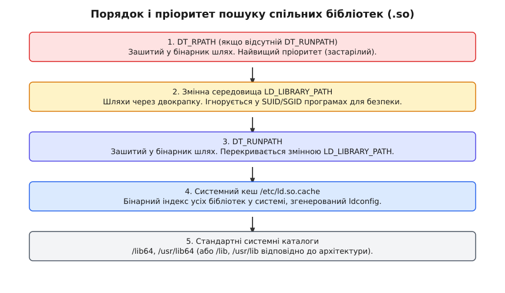
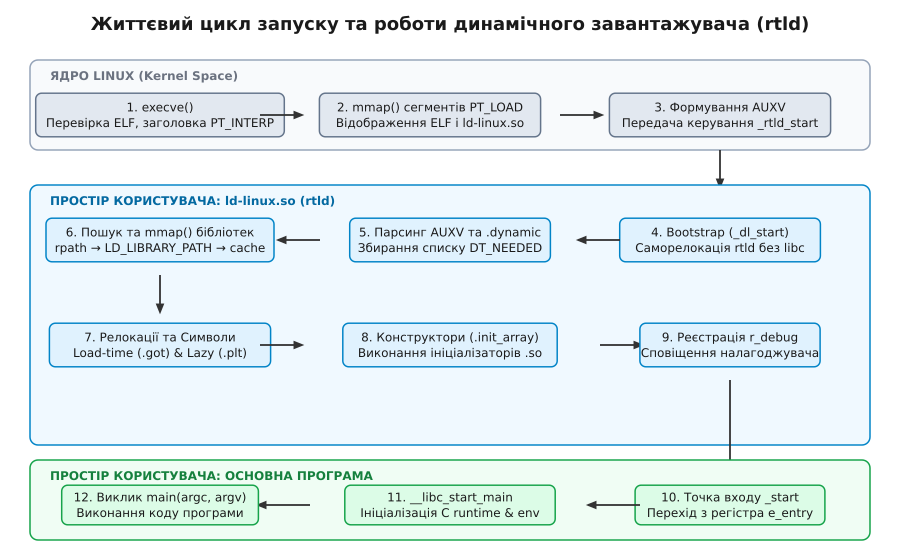

# Динамічний завантажувач і його робота

<preknowlist>
- [Структура та заголовки ELF-файлів](topic:sys-unix/elf-structure) — сегменти PT_INTERP, PT_LOAD, секція .dynamic та таблиці символів.
- [Системний виклик: як програма просить ядро](topic:sys-unix/syscall-mechanics) — механіка execve, виклики mmap і mprotect.
- [Допоміжний вектор auxiliary vector](topic:sys-unix/auxiliary-vector) — передача метаданих ядра через стек юзерспейсу.
</preknowlist>

Коли операційна система виконує системний виклик `execve()`, ядро Linux створює новий процес, відкриває ELF-файл з диска, перевіряє його заголовки та відображає сегменти в пам'ять. Однак якщо згенерований виконуваний файл зібрано з використанням спільних бібліотек (Shared Libraries), ядро не знає, де у віртуальній пам'яті опиняться бібліотечні функції на кшталт `printf` чи `malloc`, і не вміє розв'язувати назви символів у фактичні адреси. Якби ядро намагалося виконувати цей аналіз самостійно для тисяч залежностей у кожній програмі, це перевантажило б простір ядра складним кодом файлового розбору та зіпсованою ізоляцією.

Розв'язанням цієї суперечності є делегування: ядро завантажує у простір користувача спеціальну програму-завантажувач і передає керування їй. У середовищі Linux цією програмою є **динамічний завантажувач** (Dynamic Linker / Loader), який у системі відповідає файлу `/lib64/ld-linux-x86-64.so.2` (або `ld-linux.so` на інших архітектурах). Саме динамічний завантажувач збирає розпорошені модулі з диска, налаштовує їхні зв'язки та готує середовище до виконання `main()`.

## Спеціальний статус та дволикість ld-linux.so

Динамічний завантажувач, відомий у вихідному коді GNU C Library як **rtld** (Run-Time Link-Editor), має унікальну подвійну природу. З одного боку, це розділена бібліотека (Shared Object, `.so`), яку відображають у пам'яті інші процеси. З іншого боку, це повноцінний виконуваний файл.

Якщо запустити завантажувач безпосередньо з термінала як команду:

```bash
/lib64/ld-linux-x86-64.so.2 --list /usr/bin/ls
```

він виконає аналіз залежностей вказаного бінарника `ls` і виведе їх на екран без запуску самого `ls`. Ця дволикість створює складний архітектурний виклик: коли завантажувач тільки починає роботу в новому процесі, він **не має** під рукою готового C runtime середовища. У нього немає налаштованого GOT, немає готових системних викликів через wrappers у `libc.so`, і він не може викликати стандартний `malloc()`, адже сам ще не завантажив `libc.so`.

> 📜 Детальний аналіз того, як динамічне зв'язування еволюціонувало від фіксованих адрес у SunOS 4.0 до сучасного ELF rtld із підтримкою ASLR та RELRO, викладено в матеріалі [📜 Еволюція динамічного завантажувача у Unix та Linux](topic:sys-unix/dynamic-loader/hist-ld-so-evolution.md).

## Етап 1: Ядро та заголовок PT_INTERP

Коли системний виклик `execve()` зчитує ELF-заголовок програми, ядро перевіряє таблицю заголовків програм (Program Headers). У бінарниках із динамічним лінкуванням ядро знаходить заголовок із типом `PT_INTERP`.

Заголовок `PT_INTERP` містить нуль-термінований ASCII-рядок зі шляхом до інтерпретатора. Для 64-бітних Linux-систем це зазвичай `/lib64/ld-linux-x86-64.so.2`.

Отримавши цей шлях, ядро Linux виконує такі кроки:
1. Відкриває файл інтерпретатора та перевіряє його власні ELF-заголовки.
2. За допомогою системного виклику `mmap()` відображає сегменти `PT_LOAD` основного виконуваного файлу у віртуальний адресний простір.
3. За допомогою окремого `mmap()` відображає сегменти `PT_LOAD` самого динамічного завантажувача за довільною вільною адресою (при увімкненому ASLR).
4. Формує на стек-фреймі юзерспейсу **допоміжний вектор (Auxiliary Vector — auxv)**, передаючи вказівники на заголовки програм (`AT_PHDR`), точку входу (`AT_ENTRY`), базову адресу завантажувача (`AT_BASE`) та прапорці безпеки (`AT_SECURE`).
5. Змінює регістр інструкцій процесора (`RIP` на x86_64) так, щоб він вказував не на точку входу програми `e_entry`, а на точку входу динамічного завантажувача (`_rtld_start`).

З цього моменту ядро завершує системний виклик, і виконання починається у просторі користувача всередині коду завантажувача.

## Етап 2: Самозавантаження (Bootstrap та _dl_start)

Точка входу `_rtld_start` (написана мовою асемблера) негайно викликає функцію `_dl_start()`. У цей момент завантажувач опиняється у критично важкій ситуації:
- Його власні змінні та адреси вказують на відносні зміщення, згенеровані компілятором.
- Таблиця GOT завантажувача містить незаповнені адреси.
- Жодна зовнішня бібліотека ще не завантажена.

Процес подолання цього стану називається **Bootstrap (самозавантаження)**.

Завантажувач самостійно зчитує власну секцію `.dynamic`, знаходить таблицю релокацій `DT_RELA` і обходить її. Він шукає релокації типу `R_X86_64_RELATIVE`. Для кожної такої релокації завантажувач бере базову адресу, за якою ядро відобразило `ld.so` у пам'ять (`AT_BASE` з AUXV), і додає її до зміщення вказівника. 

Тільки після того, як `_dl_start` поправляв власну таблицю GOT за допомогою прямого асемблерного циклу (без виклику сторонніх функцій), динамічний завантажувач отримує можливість використовувати глобальні змінні C та викликати власні внутрішні функції.

## Етап 3: Розбір AUXV та ініціалізація структур

Після завершення bootstrap завантажувач зчитує допоміжний вектор `auxv`, переданий ядром через стек. Звідти він витягує важливі параметри:

- `AT_PHDR`: Віртуальна адреса таблиці заголовків програм основного виконуваного файлу.
- `AT_PHNUM`: Кількість заголовків у цій таблиці.
- `AT_ENTRY`: Початкова точка входу самої програми (`_start`), куди треба буде передати керування наприкінці.
- `AT_SECURE`: Прапор, який вказує, чи було процес запущено з підвищенням привілеїв (наприклад, через SUID/SGID).

Завантажувач створює свою головну внутрішню структуру даних — **карту зв'язків (Link Map)**. Перший елемент у цій карті описує сам виконуваний файл. Наступні елементи додаватимуться по мірі відкриття бібліотек.

Далі завантажувач зчитує секцію `.dynamic` виконуваного файлу. Вона являє собою масив структур `Elf64_Dyn`, де кожен запис має тег `d_tag` та значення `d_un`:

:::tabs
```c
typedef struct {
    Elf64_Sxword d_tag;
    union {
        Elf64_Xword d_val;
        Elf64_Addr  d_ptr;
    } d_un;
} Elf64_Dyn;
```
```cpp
// C++ еквівалент оголошення Elf64_Dyn із <elf.h>
struct Elf64_Dyn {
    Elf64_Sxword d_tag;
    union {
        Elf64_Xword d_val;
        Elf64_Addr  d_ptr;
    } d_un;
};
```
:::

Завантажувач шукає записи з тегом `DT_NEEDED`. Кожен такий запис містить зміщення в таблиці рядків (`DT_STRTAB`), яке вказує на ім'я необхідної спільної бібліотеки (наприклад, `libc.so.6` або `libssl.so.3`).

## Етап 4: Пошук та завантаження залежностей (DT_NEEDED)

Отримавши список імен бібліотек з `DT_NEEDED`, динамічний завантажувач має знайти відповідні файли на диску. Оскільки в `DT_NEEDED` зазвичай вказується лише коротке ім'я файлу (`SONAME`), а не абсолютний шлях, завантажувач застосовує чіткий алгоритм пошуку.


*Пріоритети та порядок перевірки каталогів під час пошуку спільних бібліотек*

Пошук відбувається у наступному порядку:

1. **`DT_RPATH`:** Зашитий у бінарник шлях до каталогів (якщо відсутній `DT_RUNPATH`). Це застарілий механізм, який має найвищий пріоритет.
2. **`LD_LIBRARY_PATH`:** Змінна середовища, яка містить список шляхів через двокрапку. **Безпека:** Якщо прапор `AT_SECURE == 1` (SUID/SGID бінарники), завантажувач **повністю ігнорує** `LD_LIBRARY_PATH`, щоб запобігти ін'єкції шкідливого коду.
3. **`DT_RUNPATH`:** Сучасніший замінник `DT_RPATH`. Його головна відмінність у тому, що перевірка `DT_RUNPATH` відбувається **після** `LD_LIBRARY_PATH`, що дозволяє розробникам перекривати шляхи під час налагодження.
4. **Системний кеш `/etc/ld.so.cache`:** Бінарний файл, згенерований утилітою `ldconfig`. Він містить відсортований хеш-індекс, який миттєво зіставляє ім'я бібліотеки (наприклад, `libc.so.6`) із її точним абсолютним шляхом на диску (`/lib64/libc.so.6`).
5. **Стандартні системні каталоги:** `/lib64`, `/usr/lib64` (або `/lib`, `/usr/lib` для 32-бітних систем).

Обійшовши ці джерела, завантажувач відкриває знайдений `.so` файл за допомогою системного виклику `open()`.

### Обхід графа залежностей
Завантаження бібліотек відбувається за допомогою **обходу у ширину (BFS — Breadth-First Search)**. Знайшовши первинну бібліотеку `libA.so`, завантажувач відкриває її ELF-заголовки, читає її власну секцію `.dynamic` і знаходить її власні `DT_NEEDED` залежності (наприклад, `libB.so`).

Завантажувач формує спільне лінійне дерево списку `link_map`. Якщо одна й та сама бібліотека зустрічається у графі залежностей кілька разів, завантажувач помічає її як вже завантажену за допомогою її `dev/ino` (номера inode на диску) і збільшує лічильник посилань.

## Етап 5: Відображення сегментів у пам'ять (mmap)

Для кожного `.so` файлу у списку `link_map` завантажувач зчитує таблицю `Program Headers` і знаходить усі сегменти з типом `PT_LOAD`.

Типовий ELF-модуль має як мінімум два сегменти `PT_LOAD`:
- **Сегмент коду (Text Segment):** Містить інструкції процесора та константи. Права доступу: `PROT_READ | PROT_EXEC`.
- **Сегмент даних (Data Segment):** Містить глобальні змінні, таблиці GOT та `.bss`. Права доступу: `PROT_READ | PROT_WRITE`.

Завантажувач викликає `mmap()` із прапорцем `MAP_PRIVATE`. Для сегмента коду ядро відображає сторінки файлу безпосередньо з диска у сторінковий кеш (Page Cache). Оскільки права на код — лише читання та виконання, ця пам'ять є **спільною** для всіх процесів у операційній системі, які використовують дану бібліотеку. Якщо 100 процесів використовують `libc.so.6`, код бібліотеки зберігається у физичній оперативній пам'яті в єдиному примірнику.

Для сегмента даних прапорець `MAP_PRIVATE` вмикає механізм **копіювання при записі (Copy-On-Write — COW)**. Поки процес лише читає глобальні змінні, він ділить сторінки з іншими. Як тільки процес змінює значення змінної, ядро створює приватну копію цієї сторінки пам'яті лише для даного процесу.

Якщо сегмент має розмір у пам'яті `p_memsz`, який перевищує розмір у файлі `p_filesz`, різниця складає секцію `.bss` (неініціалізовані дані). Завантажувач обнуляє цю різницю за допомогою виклику `memset()` або виділення додаткових анонімних сторінок.

## Етап 6: Релокація, розв'язання символів та версіонування

Після того, як усі бібліотеки відображено в пам'ять, кожна з них знаходиться за власною адресою у віртуальному просторі. Однак інструкції всередині `libA.so`, які викликають функцію з `libB.so`, все ще не знають точної адреси призначення.

Процес перезапису вказівників називається **релокацією**.

### Види релокацій у x86_64

1. **`R_X86_64_RELATIVE`:** Поправка на базову адресу (ASLR). Завантажувач додає базову адресу завантаження бібліотеки до вихідного зміщення.
2. **`R_X86_64_GLOB_DAT`:** Заповнення адреси глобальної змінної у Глобальній таблиці зміщень (GOT).
3. **`R_X86_64_JUMP_SLOT`:** Заповнення адреси функції у таблиці `.got.plt` для викликів через PLT.

### Пошук символів та прискорення через DT_GNU_HASH
Пошук символу за його текстовою назвою у великих бібліотеках (таких як `libc.so`, яка містить понад 2000 експортованих функцій) може сповільнити запуск програми. У ранніх версіях SVR4 ELF використовувалася класична хеш-таблиця `DT_HASH`.

Сучасний завантажувач у Linux використовує вдосконалену структуру **`DT_GNU_HASH`**, яка поєднує:
- **Фільтр Блума (Bloom Filter):** 64-бітний масив масок, який дозволяє відкинути до 99% невдалих пошуків символів за допомогою двох швидких бітових операцій без обходу пам'яті хеш-кошика.
- **Впорядковані хеш-кошики:** Символи з однаковим хеш-значенням згруповано підряд, що покращує локальність кешу процесора.

Завдяки `DT_GNU_HASH` швидкість розв'язання символів під час старту складних програм зросла на 50%.

### Версіонування символів (Symbol Versioning)
Окрім імені символу, сучасний завантажувач перевіряє **версію символу (GNU Symbol Versioning)**. Секції `.gnu.version` та `.gnu.version_r` містять прив'язку функцій до версій ABI бібліотеки (наприклад, `memcpy@GLIBC_2.14`). Якщо програма була скомпільована під `GLIBC_2.14`, завантажувач відхилить старшу версію `GLIBC_2.2.5` з такою самою назвою, запобігаючи несумісності ABI.

Перша бібліотека у списку `link_map`, яка містить символ із відповідним ім'ям та валідною версією, перемагає. Цей механізм уможливлює **перехоплення символів (Symbol Interposition)**: якщо запустити програму з `LD_PRELOAD=./my_malloc.so`, завантажувач знайде функцію `malloc` у вашій бібліотеці першою і прив'яже всі виклики програми до неї, ігноруючи `malloc` у `libc.so`.

### Запізніле зв'язування (Lazy Binding) vs LD_BIND_NOW

За замовчуванням релокація глобальних змінних (`.got`) виконується відразу при запуску програми (Load-time relocation). Однак програма може містити тисячі викликів бібліотечних функцій, більшість з яких ніколи не буде викликано під час конкретного сеансу роботи.

Щоб прискорити старт програм, завантажувач за замовчуванням використовує **запізніле зв'язування (Lazy Binding)** для функцій через комбінацію Таблиці зв'язування процедур (PLT) та GOT:

1. На початку кожний запис у `.got.plt` вказує не на реальну функцію, а назад у PLT на інструкцію резолвера.
2. При першому виклику функції код переходить у PLT, який передає номер символу та вказівник на `link_map` у внутрішній резолвер завантажувача — `_dl_runtime_resolve()`.
3. Функція `_dl_runtime_resolve()` знаходить реальну адресу функції у відповідній `.so` бібліотеці.
4. Завантажувач записує знайдену адресу безпосередньо у відповідну комірку `.got.plt`.
5. Подальші виклики цієї ж функції переходять за адресою з `.got.plt` напряму, без повторного виклику завантажувача.

Якщо встановити змінну середовища `LD_BIND_NOW=1` або зкомпілювати програму з прапорцем `-z now` (Full RELRO), завантажувач відмовляється від lazy binding і знаходить адреси **усіх** функцій відразу під час старту. Це збільшує час запуску, але підвищує безпеку: після завершення завантаження rtld позначає всю таблицю GOT як Read-Only через `mprotect()`.


*Послідовність етапів завантаження програми, виконання релокацій та передачі керування*

> ⚙️ Створення власного спрощеного завантажувача з підтримкою парсингу ELF та виконання `R_X86_64_RELATIVE` релокацій детально розібрано у вставці [⚙️ Створення міні-динамічного завантажувача на C та C++](topic:sys-unix/dynamic-loader/proj-mini-dynamic-loader.md).

## Етап 7: Ініціалізація локальних даних потоку (TLS)

Сучасні багатопотокові програми активно використовують змінні з атрибутом `thread_local` (або `__thread` у C). Для підтримки локальних даних потоків динамічний завантажувач під час старту обробляє сегменти з типом `PT_TLS`.

Завантажувач розраховує загальний розмір блоку шаблону TLS для всіх завантажених модулів і створює вектор динамічного потоку (Dynamic Thread Vector — DTV).

Існує дві моделі TLS, які обробляє завантажувач:
- **Static TLS:** Виділяється для бібліотек, які були завантажені разом із програмою при старті. Шаблон розміщується безпосередньо поруч із блоком контролю потоку (Thread Control Block — TCB), доступ до якого здійснюється через регістр `FS` (на x86_64).
- **Dynamic TLS:** Використовується для бібліотек, які відкриваються пізніше через `dlopen()`. Завантажувач виділяє пам'ять динамічно та оновлює таблицю DTV для кожного потоку при першому зверненні до цієї змінної.

## Етап 8: Виконання ініціалізаторів (.init та .init_array)

Після того, як усі релокації завершено, і кожен модуль у пам'яті отримав правильні адреси, завантажувач має виконати код ініціалізації.

Кожна спільна бібліотека може мати:
- Секцію `.init` (старий механізм ініціалізації).
- Секцію `.init_array` (масив вказівників на функції-конструктори).
- Функції, позначені атрибутом C/C++ `__attribute__((constructor))`.

Порядок виконання ініціалізаторів є **зворотним до порядку залежностей (Reverse Topological Order)**. Якщо програма залежить від `libA.so`, а `libA.so` залежить від `libc.so`, то першим буде виконано конструктор `libc.so`, потім конструктор `libA.so`, і лише після цього — конструктори самого виконуваного файлу.

Це гарантує, що коли конструктор `libA.so` почне виконуватися, стандартна C-бібліотека вже буде повністю готова до роботи.

## Етап 9: Передача керування точці входу програми (_start)

Коли всі ініціалізатори виконано, динамічний завантажувач завершує свою підготовчу роботу.

Він виконує такі підсумкові дії:
1. Записує адресу головної карти зв'язків у внутрішню структуру `r_debug` для налагоджувачів (таких як GDB).
2. Викликає порожню функцію `_dl_debug_state()`, що сповіщає GDB про завершення формування таблиці символів.
3. Очищує регістри процесора, відновлюючи стан стеку до вигляду, підготовленого ядром (`argc`, `argv`, `envp`, `auxv`).
4. Виконує безумовний перехід (`JMP`) на адресу точки входу основної програми (`AT_ENTRY` з AUXV).

Адреса `AT_ENTRY` вказує на функцію `_start` у коді програми (яка додається з об'єктного файлу `crt1.o` C Runtime). Функція `_start` розпаковує `argc` та `argv` зі стеку, вирівнює стек по 16-байтній межі відповідно до System V x86_64 ABI і викликає функцію `__libc_start_main()`.

Функція `__libc_start_main()` з `libc.so.6` реєструє деструктори `atexit()`, викликає глобальні конструктори програми та нарешті здійснює виклик вашої функції `main(argc, argv)`.

---

## Інспекція та практичне простеження завантажувача

Для практичного простеження дій завантажувача системні розробники використовують набір консольних інструментів Linux:

### 1. Перевірка заголовка інтерпретатора через readelf
Утиліта `readelf` дозволяє дізнатися, який саме завантажувач вимагає виконуваний файл:

```bash
readelf -l /usr/bin/ls | grep interpreter
```

Вивід підтверджує наявність інтерпретатора:
`[Requesting program interpreter: /lib64/ld-linux-x86-64.so.2]`

### 2. Трасування системних викликів через strace
За допомогою `strace` можна побачити точний ланцюжок системних викликів, які завантажувач виконує при запуску програми:

```bash
strace -e trace=openat,mmap,mprotect /usr/bin/ls
```

У виводі видно:
- `openat(AT_FDCWD, "/etc/ld.so.cache", O_RDONLY|O_CLOEXEC) = 3` — відкриття кешу завантажувача.
- `mmap(NULL, ..., PROT_READ|PROT_EXEC, MAP_PRIVATE, 3, 0)` — відображення коду `libc.so.6`.
- `mprotect(..., PROT_READ)` — закриття GOT від запису (RELRO).

### 3. Трасування внутрішніх кроків завантажувача через LD_DEBUG
Запуск програми зі змінною `LD_DEBUG=libs` показує покроковий процес обходу залежностей та відкриття модулів у реальному часі.

```bash
LD_DEBUG=libs /usr/bin/true
```

> 🔧 **Навіщо це знати на практиці.**
> Розуміння механізмів динамічного завантажувача є необхідним під час налагодження складних падінь при запуску (наприклад, помилок `symbol lookup error: undefined symbol`), аналізу безпеки бінарників (перевірка захистів Partial/Full RELRO та ASLR за допомогою `checksec`), створення систем перехоплення функцій через `LD_PRELOAD`, а також при розробці плагінних архітектур на базі `dlopen`/`dlsym`.

## Інтерфейси налагодження, аудіту та безпеки rtld

Динамічний завантажувач надає спеціальні інтерфейси як для розробників прикладних програм, так і для системних інструментів.

### Інтерфейс dlfcn та налагодження
Програми можуть завантажувати бібліотеки безпосередньо під час виконання за допомогою API `dlopen()`, `dlsym()` та `dlclose()`. При виклику `dlopen()` завантажувач повторно запускає свій внутрішній конвеєр (BFS пошук, `mmap`, релокація та виконання `.init_array`).

Для взаємодії з GDB завантажувач експортує заголовок `<link.h>` та структури `r_debug` і `link_map`. Налагоджувач ставить breakpoint на функцію `_dl_debug_state()`. Щоразу, коли завантажувач додає новий `.so` файл через `dlopen()` або вилучає його через `dlclose()`, він трапається в цю точку зупину, даючи змогу GDB підхопити нові таблиці символів.

### Підсистема аудіту rtld-audit
Для глибинного моніторингу процесів завантажувач підтримує інтерфейс `LD_AUDIT`. Бібліотека аудиту може реалізувати спеціальні виклики-хуки:
- `la_version()`: Перевірка сумісності версій аудиту.
- `la_objopen()`: Викликається щоразу, коли завантажувач відкриває новий ELF-модуль.
- `la_symbind()`: Перехоплює момент зв'язування символу і дозволяє підмінити адресу функції на льоту.

> 📋 Детальний огляд параметрів `dlopen`, прапорців `RTLD_LAZY`/`RTLD_NOW`/`RTLD_DEEPBIND`, змінних середовища `LD_DEBUG` та внутрішнього ABI `link_map` зібрано у матеріалі [📋 Довідник API dlfcn та внутрішніх структур rtld](topic:sys-unix/dynamic-loader/api-dlfcn-and-rtld-debug.md).

Динамічний завантажувач є непомітним, але центральним зв'язуючим ланцюгом операційної системи Linux. Він перетворює статичний опис ELF-файлів у живий процес у пам'яті, забезпечуючи повторне використання коду, захист пам'яті та гнучкість виконання.
