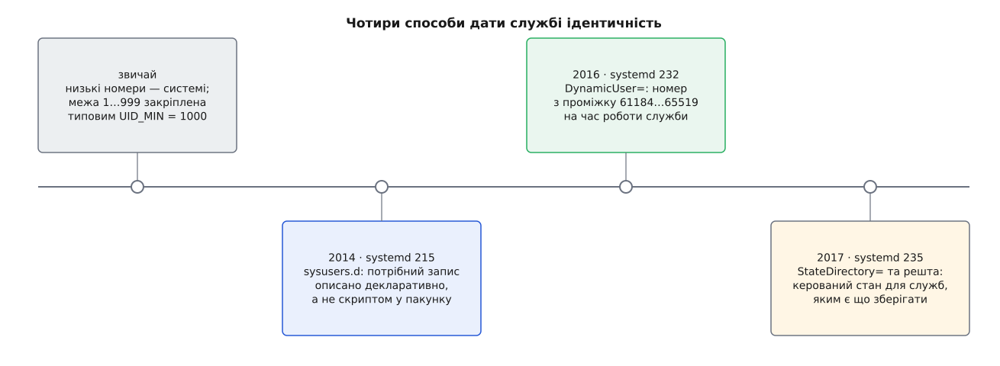

# 📜 Як службам роздавали ідентичності

Звичка заводити кожній службі власний постійний рядок у `/etc/passwd` не була ані задумом, ані стандартом — вона наросла з простої потреби не давати демонові прав `root` і трималася десятиліттями, доки не стало видно її ціну. Нижче — звідки взявся проміжок 1…999, хто й як намагався впорядкувати роздачу цих номерів і чому впорядкування не зачепило самої проблеми.

## Низькі номери — системі

Ядро не знає слова «системний користувач». Для нього [UID — просто число](topic:sys-unix/uid-gid-identity-model), і єдиний номер із особливим значенням — нуль. Усе інше — домовленість людей.

Домовленість зросла з практики: демон не має бути `root`, отже йому потрібна власна ідентичність, а щоб її не сплутати з ідентичністю живої людини, її беруть із протилежного кінця простору номерів — знизу. Далі знадобилося сказати інструментам, де саме проходить межа, і межа стала конфігурацією. У `login.defs`, файлі налаштувань пакета `shadow`, типове `UID_MIN` дорівнює 1000 — це перший номер, який `useradd` видасть людині; типове `SYS_UID_MAX` описане як `UID_MIN − 1`, тобто рівно 999, а `SYS_UID_MIN` — 101 (з довідкової сторінки `login.defs(5)`).

Ось і вся арифметика знаменитого проміжку: 1…999 — не константа ядра й не вимога POSIX, а те, що лишається під межею першого людського номера. Межа ця історично гуляла: різні дистрибутиви ставили її по-різному, і нинішня тисяча — результат зближення практик, а не декрет. Наслідок доволі несподіваний: службових номерів рівно стільки, скільки їх лишили людям, — менше тисячі на всю машину.

*Кожен крок робив опис облікового запису точнішим і відтворюванішим; лише останні два взагалі прибрали з системи постійний номер.*

## Хто роздає ці номери

Тисяча номерів на всі пакунки світу — ресурс, який мусить хтось ділити, і дистрибутиви поділили його самі, кожен по-своєму.

Політика Debian (розділ «Users and Groups» Debian Policy) ріже простір на смуги за способом видачі. Номери 0…99 роздає централізовано сам проєкт, і вони однакові на кожній системі Debian. Номери 100…999 — «динамічно розподілені системні користувачі й групи»: пакунок не називає число, а просить `adduser --system`, і той сам обирає вільний номер із проміжку, заданого в `adduser.conf`. Далі 1000…59999 — люди, а смуга 60000…64999 знову централізована, але записи з неї створюють лише на вимогу — для пакунків, яким справді потрібні незмінні числа.

Fedora розв'язала ту саму задачу «м'яко статично»: пакунок `setup` несе реєстр `uidgid` — список імен із закріпленими за ними номерами, куди пакувальник вписує свою службу, якщо їй потрібне те саме число всюди; решта задовольняється динамічною видачею через `useradd -r`. (Статус: усталена практика проєкту; першоджерело — файл `uidgid` у пакунку `setup`.)

Обидва проєкти лишили місце для статичних чисел не з любові до реєстрів. Число виходить за межі машини щоразу, коли за межі машини виходять файли: резервна копія зберігає власника числом, спільний каталог по мережі передає числом, готовий образ системи несе позначені файли з собою. Якщо на двох машинах той самий номер належить різним службам, файли міняють господаря просто від переїзду. Статична смуга — це домовленість, що для найважливіших імен таких розбіжностей не буде ніде.

Спільне в обох підходах головне: номер належить дистрибутивові, а не пакунку, і видається він **назавжди**.

## sysusers.d: опис замість скрипта

Хоч би хто ділив номери, створював запис усе одно скрипт усередині пакунка: на встановленні виконати `adduser --system`, на видаленні — вирішувати, що з ним робити. Скрипт — це імперативний крок, і він потребує, щоб `/etc` уже існував і був записним.

Саме це припущення й тріснуло першим. У випуску systemd 215 (2014-07-03, за NEWS проєкту) з'явився `systemd-sysusers`. NEWS формулює мотив просто: інструмент створює системних користувачів і групи в `/etc/passwd` та `/etc/group` за статичними декларативними описами в `/usr/lib/sysusers.d/`, і потрібно це, щоб працювали скидання до заводського стану й системи, що вантажаться з порожнім `/etc`.

Зміна тут не косметична. Пакунок більше не **робить** запис — він **описує** потрібний йому запис одним рядком, а створює його система, коли й де завважить за потрібне. Опис лежить у `/usr/lib`, тобто в незмінній частині системи, і його можна перечитати будь-коли; те, що з нього вийшло, лежить у [базі облікових записів](topic:sys-unix/user-database-nss), звідки імена й числа дістає шар NSS. [Докладніше про самі файли `sysusers.d`](topic:sys-unix/sysusers-declarative-accounts) — окрема тема.

## Чого не зачепив жоден із цих способів

Тепер порівняйте всі три способи за однією ознакою: що станеться з номером, коли служба піде.

Централізований статичний номер Debian лишиться назавжди — на те він і статичний. Динамічний `adduser --system` видасть номер один раз і теж лишить його, бо видалити означає ризикнути. Декларація `sysusers.d` зробить створення запису відтворюваним і не потребуватиме записного `/etc` — але створить той самий постійний запис, який після видалення пакунка лишиться в базі рівно з тих самих міркувань.

Усі троє впорядковували **видачу**. Жоден не займався **поверненням**, бо повертати номер немає сенсу, доки в системі лежать файли, позначені цим числом: [права ядро звіряє за числом](topic:sys-unix/permission-bits), а не за іменем, тож повторна видача номера дарує новому власникові чужі файли. Проблема була не в тому, що номери погано роздають, а в тому, що номер прилипає до слідів служби.

## 2016: номер із власним строком життя

Випуск systemd 232 (2016-11-03, за NEWS) додав `DynamicUser=`. Формулювання NEWS варте уваги, бо в ньому вже вся конструкція: номери користувача й групи беруться з проміжку 61184…65519 **на час життя служби**, розв'язати їх в ім'я можна модулем `nss-systemd.so`, який слід увімкнути в `/etc/nsswitch.conf`, а до служби автоматично додаються `PrivateTmp=` й `RemoveIPC=` — щоб усе, що вона захопила, прибиралося на виході, — та `ProtectHome=read-only` з `ProtectSystem=strict`, щоб вона не могла лишити на системі нічого постійного.

Тобто номер відпускають не тому, що хтось повірив у чистоту служби, а тому, що службі відтяли всі способи лишити по собі позначений слід.

Через рік, 6 жовтня 2017 року, Леннарт Поттерінг виклав нотатку «Dynamic Users with systemd», де пояснив задум і прямо зазначив, що механізм у базовому вигляді працює від systemd 232. Того самого дня NEWS датує випуск 235 — і нотатка описує вже його.

## 235: стан, яким керує менеджер

Ціна суворості 232-го була очевидна: служба, якій нема куди писати, — це служба без стану. Збирач метрик, що тримає базу в `/var/lib`, під `DynamicUser=yes` просто не працював, бо каталог у `/var/lib` довелося б комусь створити й комусь позначити — а номер щоразу новий.

Випуск 235 (2017-10-06, за NEWS) додав `StateDirectory=`, `CacheDirectory=`, `LogsDirectory=` й `ConfigurationDirectory=` — рідню давнього `RuntimeDirectory=`, тільки для каталогів під `/var/lib`, `/var/cache`, `/var/log` і `/etc`. NEWS називає дві причини: юніт стає самодостатнім (усе потрібне описано в ньому самому), і система переживає порожні `/etc` та `/var` на завантаженні. Там же сказано пряме: ці налаштування особливо корисні саме з `DynamicUser=yes`, бо дають безпечні, правильно позначені й записні місця для стану всередині пісочниці, у якій така служба інакше замкнена.

Пара замкнулася. Одна половина забирає в служби постійне число, друга віддає їй каталоги, за власника яких відповідає менеджер служб. Ідентичність із коштовності, яку шкода викидати, перетворилася на ресурс зі строком життя — приблизно того ж ґатунку, що й номер процесу.
