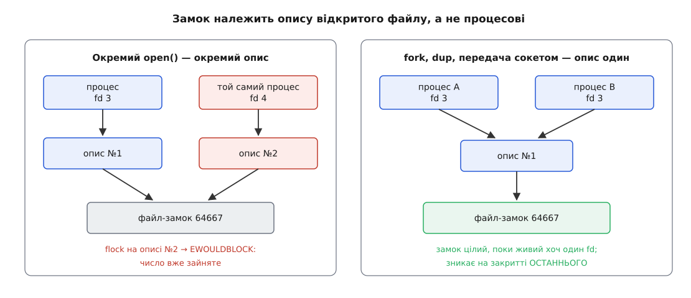

# ⚙️ Тимчасовий UID своїми руками: передбачити число й потримати його за дескриптор

Виділення тимчасового номера вміщається в сотню рядків мовою C, і віддача від цих рядків незвична: програма називає число, яке дістанеться службі, **ще до того, як службу запустили**. Ключ хешування — не таємниця, а стала в джерелах менеджера, тож арифметика однакова на будь-якій машині; лишається взяти число за собою так само, як бере його PID 1, і подивитися, що станеться з другим претендентом.

## Три обов'язки програми

Перший — **перетворити ім'я на число**. Береться `siphash24` від рядка імені зі сталим шістнадцятибайтовим ключем, а результат стискається остачею в проміжок 61184…65519. SipHash тут — [ключований хеш](root:sf-security/keyed-hash-mac), тобто функція від даних і ключа водночас; потрібна від неї єдина властивість — те саме ім'я завжди дає те саме число, а сусідні імена розсипаються по проміжку без помітного ладу.

Сам хеш тут потрібен не для швидкості й не для рівномірності — вільне число можна було б просто шукати від початку проміжку. Потрібна **повторюваність без пам'яті**. Служба, що не зберігає нічого на диску, після перезавантаження машини не має жодної підказки, яке число мала вчора; хеш дає їй те саме число знову, і то без єдиного записаного байта. Тому номер у `ls -l` чи в старому журналі лишається осмисленим, а не міняється щоразу навмання.

Другий — **закріпити число за собою**. Уся зайнятість номера — це відкритий файл `/run/systemd/dynamic-uid/<число>` із виключним `flock`. Ніякого реєстру немає: питання «чи вільне число» — це питання «чи вдасться взяти на цьому файлі замок».

Третій — **лишити в файлі ім'я**. Один рядок усередині перетворює файл на зворотний довідник: за числом можна прочитати, як його звати.

І одна засторога, з якої починаються всі помилки: узявши замок, дескриптор **не закривають**. Закриття — і є звільнення.

Перед замком менеджер ще перевіряє, чи не належить кандидат статичному обліковому запису. Перевірка коштує звернення до бази облікових записів — а такий запит може піти в мережу й зависнути, тому PID 1 не робить його сам, а породжує для цього окремий процес. У нашій програмі це просто два виклики поспіль.

## Код

```c
/* uidlock.c — виділення тимчасового UID тим самим способом, що й systemd.
 *   cc -O2 -Wall -o uidlock uidlock.c
 *   sudo ./uidlock <ім'я>        (каталог замків належить root)
 * Програма тримає число, доки її не вб'ють.                              */

#define _GNU_SOURCE
#include <errno.h>
#include <fcntl.h>
#include <grp.h>
#include <pwd.h>
#include <stdint.h>
#include <stdio.h>
#include <string.h>
#include <sys/file.h>
#include <sys/random.h>
#include <sys/stat.h>
#include <unistd.h>

#define UID_MIN  61184u                    /* 0x0000EF00 */
#define UID_MAX  65519u                    /* 0x0000FFEF */
#define SPAN     (UID_MAX - UID_MIN + 1)   /* 4336 номерів */
#define LOCKDIR  "/run/systemd/dynamic-uid"

/* ── SipHash-2-4, довідкова реалізація ────────────────────────────────── */
#define ROTL(x, b) (((x) << (b)) | ((x) >> (64 - (b))))
#define SIPROUND do {                                             \
        v0 += v1; v1 = ROTL(v1, 13); v1 ^= v0; v0 = ROTL(v0, 32); \
        v2 += v3; v3 = ROTL(v3, 16); v3 ^= v2;                    \
        v0 += v3; v3 = ROTL(v3, 21); v3 ^= v0;                    \
        v2 += v1; v1 = ROTL(v1, 17); v1 ^= v2; v2 = ROTL(v2, 32); \
} while (0)

static uint64_t siphash24(const void *in, size_t len, const uint8_t k[16])
{
    const uint8_t *p = in, *end = p + (len & ~(size_t) 7);
    uint64_t k0 = 0, k1 = 0, m, b = (uint64_t) len << 56;
    uint64_t v0, v1, v2, v3;

    for (int i = 7; i >= 0; i--) {         /* ключ читається молодшим уперед */
        k0 = k0 << 8 | k[i];
        k1 = k1 << 8 | k[8 + i];
    }
    v0 = 0x736f6d6570736575ULL ^ k0;
    v1 = 0x646f72616e646f6dULL ^ k1;
    v2 = 0x6c7967656e657261ULL ^ k0;
    v3 = 0x7465646279746573ULL ^ k1;

    for (; p != end; p += 8) {             /* повні восьмибайтові блоки */
        m = 0;
        for (int i = 7; i >= 0; i--)
            m = m << 8 | p[i];
        v3 ^= m; SIPROUND; SIPROUND; v0 ^= m;
    }
    for (size_t i = len & 7; i-- > 0; )    /* хвіст + довжина у старшому байті */
        b |= (uint64_t) p[i] << (8 * i);

    v3 ^= b; SIPROUND; SIPROUND; v0 ^= b;
    v2 ^= 0xff; SIPROUND; SIPROUND; SIPROUND; SIPROUND;
    return v0 ^ v1 ^ v2 ^ v3;
}

/* Той самий ключ, що зашитий у systemd (src/core/dynamic-user.c). */
static const uint8_t hash_key[16] = {
    0x37, 0x53, 0x7e, 0x31, 0xcf, 0xce, 0x48, 0xf5,
    0x8a, 0xbb, 0x39, 0x57, 0x8d, 0xd9, 0xec, 0x59
};

/* УВАГА: хеш 64-бітний, а остачу беруть від УРІЗАНОГО до 32 біт значення —
   бо в макросі стоїть зведення до uid_t. Без цього зведення число інше.   */
static uid_t uid_from_name(const char *name)
{
    uint64_t h = siphash24(name, strlen(name), hash_key);

    return (uid_t) ((uint32_t) h % SPAN) + UID_MIN;
}

/* Спроба закріпити за собою одне число. Дескриптор замка або -1.          */
static int claim(uid_t uid, const char *name)
{
    char path[64], line[128], holder[128];
    int fd, len;

    if (getpwuid(uid) || getgrgid((gid_t) uid)) {
        fprintf(stderr, "%u: число тримає статичний обліковий запис\n", uid);
        return -1;
    }

    snprintf(path, sizeof path, LOCKDIR "/%u", uid);
    fd = open(path, O_CREAT | O_RDWR | O_NOFOLLOW | O_CLOEXEC | O_NOCTTY, 0600);
    if (fd < 0) {
        perror(path);
        return -1;
    }

    if (flock(fd, LOCK_EX | LOCK_NB) < 0) {          /* зайнято — і ким саме */
        ssize_t n = pread(fd, holder, sizeof holder - 1, 0);

        holder[n > 0 ? n : 0] = '\0';
        holder[strcspn(holder, "\n")] = '\0';
        fprintf(stderr, "%u: замок тримає «%s»\n", uid, n > 0 ? holder : "?");
        close(fd);
        return -1;
    }

    len = snprintf(line, sizeof line, "%s\n", name);   /* зворотний довідник */
    if (pwrite(fd, line, len, 0) != len) {
        perror("pwrite");
        close(fd);
        return -1;
    }
    (void) ftruncate(fd, len);
    return fd;                        /* НЕ закриваємо: закриття зніме замок */
}

int main(int argc, char **argv)
{
    const char *name = argc > 1 ? argv[1] : "uidplay";
    uid_t uid;
    int fd;

    if (mkdir(LOCKDIR, 0755) < 0 && errno != EEXIST) {
        perror(LOCKDIR);
        return 1;
    }

    uid = uid_from_name(name);
    printf("хеш «%s» → %u\n", name, uid);

    fd = claim(uid, name);
    for (unsigned tries = 0; fd < 0 && tries < 100; tries++) {   /* навмання */
        uint32_t r;

        if (getrandom(&r, sizeof r, 0) != (ssize_t) sizeof r)
            return 1;
        uid = r % SPAN + UID_MIN;
        fd = claim(uid, name);
    }
    if (fd < 0) {
        fprintf(stderr, "за сто спроб вільного числа не знайшлося\n");
        return 1;
    }

    printf("узято %u; замок на дескрипторі %d, PID %ld\n",
           uid, fd, (long) getpid());
    printf("вбийте процес — і число звільниться саме\n");
    pause();                          /* тримаємо, доки нас не вб'ють */
    return 0;
}
```

## Чому саме сто спроб

Число сто в циклі виглядає взятим зі стелі, а насправді воно з іншого боку: повний перебір проміжку тут просто не потрібен. Кожна невдала спроба означає відкриття файлу й `flock`, тобто два системні виклики; сто спроб — це стеля витрат, після якої чесніше здатися, ніж мовчки перебирати тисячі номерів. Питання лише в тому, чи не здамося ми зарано.

**Скільки зайнято — і яка ймовірність провалу.** Хай `p` — частка вже зайнятих номерів проміжку; спроби незалежні, тож усі сто мусять влучити в зайняте:

```
проміжок      = 65519 − 61184 + 1 = 4336 номерів
зайнято 100   → p = 100/4336 = 0.0231 → p¹⁰⁰ ≈ 2·10⁻¹⁶⁴
зайнято 1000  → p = 0.2306           → p¹⁰⁰ ≈ 2·10⁻⁶⁴
зайнято 3902  → p = 0.8999           → p¹⁰⁰ ≈ 2.6·10⁻⁵
```

Навіть коли дев'ять десятих проміжку вже роздано, сто спроб промахуються приблизно раз на сорок тисяч запусків. А доти, доки тимчасових служб на машині сотні, а не тисячі, провал невідрізнимий від неможливого. Зате коли він таки стається, це майже напевно означає не невдачу кидка, а справді вичерпаний проміжок — і тоді помилка «немає вільного числа» каже правду.

## Прогін

Перший примірник називає число й лишається жити:

```console
# ./uidlock uidplay
хеш «uidplay» → 64667
узято 64667; замок на дескрипторі 3, PID 8121
вбийте процес — і число звільниться саме
```

У сусідньому вікні видно і сам файл, і замок на ньому. Розмір файлу — рівно вісім байтів, тобто `uidplay\n`:

```console
$ ls -l /run/systemd/dynamic-uid/
-rw------- 1 root root 8  9 сер 12:41 64667
$ sudo cat /run/systemd/dynamic-uid/64667
uidplay
$ sudo grep FLOCK /proc/locks
1: FLOCK  ADVISORY  WRITE 8121 00:18:2461 0 EOF
$ sudo stat -c %i /run/systemd/dynamic-uid/64667
2461
```

> 🔧 **Навіщо це.** Пара `/proc/locks` і `stat -c %i` — єдиний спосіб дізнатися, **хто** тримає число, коли служба не стартує через зайнятий номер. Ядро друкує номер процесу-власника й пару «пристрій:inode»; збігся inode — знайшли винуватця. Ім'я всередині файлу тут не поможе: воно розповідає, чиє число, але не каже, який процес досі не відпустив дескриптор.

Другий примірник із тим самим іменем цілиться в те саме число — і отримує відмову, після чого йде тягнути номери навмання:

```console
# ./uidlock uidplay
хеш «uidplay» → 64667
64667: замок тримає «uidplay»
узято 62590; замок на дескрипторі 3, PID 8140
```

Тепер найголовніше — прибирання, якого ніхто не писав:

```console
$ sudo kill 8121
$ sudo grep FLOCK /proc/locks
1: FLOCK  ADVISORY  WRITE 8140 00:18:3907 0 EOF
$ ls -l /run/systemd/dynamic-uid/64667
-rw------- 1 root root 8  9 сер 12:41 64667
```

Замка на 64667 більше немає — лишився тільки замок другого примірника, на іншому inode. Зверніть увагу на останній рядок: **файл нікуди не подівся**. Замок і файл — різні речі; зник замок, а порожня оболонка з іменем лежить далі й нікому не заважає, бо наступний претендент відкриє її та спокійно перепише. Сам менеджер при охайній зупинці файл ще й видаляє, але покладатися на це не мусить: після падіння PID 1 файли лишаються, і це нічого не ламає.

## Та сама арифметика в живій службі

Тепер убийте обидва примірники й попросіть число в менеджера — для тієї самої назви:

```console
$ sudo systemd-run --unit=uidplay -p DynamicUser=yes sleep 900
Running as unit: uidplay.service
$ ps -o pid,user,args -C sleep
    PID USER     COMMAND
   8207 uidplay  /usr/bin/sleep 900
$ ls -l /run/systemd/dynamic-uid/
-rw------- 1 root root 8  9 сер 12:46 64667
```

Число збіглося з передбаченим, і це не збіг: імені `uidplay` каталог стану не належить, тож підказці з диску взятися нема звідки, а хеш дає одне й те саме. Хешується саме **ім'я облікового запису** — усталено це назва юніта без суфікса, а якщо в юніті стоїть `User=`, то значення звідти.

Ім'я тепер віддає не файл, а сам менеджер — через [шар NSS](root:sys-unix/user-database-nss) і [спільний інтерфейс userdb](root:sys-unix/userdb-varlink), яким джерела облікових записів відповідають на запити:

```console
$ getent passwd 64667
uidplay:x:64667:64667:Dynamic User:/:/usr/sbin/nologin
$ userdbctl user uidplay -j
{
        "userName" : "uidplay",
        "uid" : 64667,
        "gid" : 64667,
        "realName" : "Dynamic User",
        "homeDirectory" : "/",
        "shell" : "/usr/sbin/nologin",
        "locked" : true,
        "service" : "io.systemd.DynamicUser",
        "disposition" : "dynamic"
}
```

І перевірка, заради якої все затівалося:

```console
$ sudo systemctl stop uidplay.service
$ ls /run/systemd/dynamic-uid/
$ getent passwd 64667; echo "код виходу: $?"
код виходу: 2
```

Каталог порожній, у базі нічого немає — число повернулося в обіг цілим.

Тут ховається спостереження, яке варте окремої спроби. Запустіть знову `./uidlock uidplay` — файл `64667` з іменем усередині з'явиться знову, — і спитайте `getent passwd 64667`. Відповіді не буде. Менеджер справді читає ім'я з файлу-замка, але потім звіряє його з власною таблицею в пам'яті: шукає це ім'я серед живих тимчасових записів і перевіряє, що число зійшлося. Не зійшлося — відповідь «немає такого». Отже, файл — лише зворотний бік довідника й доказ зайнятості; істина про пару «ім'я ↔ число» живе в пам'яті PID 1 і вмирає разом з ним.

## Пастки

**Замок зникає на закритті ОСТАННЬОГО дескриптора.** `flock` належить не процесові, а [опису відкритого файлу](root:sys-unix/open-file-description) — тій структурі ядра, яку створює `open` і яку `fork` та `dup` не подвоюють, а лише додають на неї ще одне посилання. Тому нащадок, що успадкував дескриптор, тримає число нарівні з предком, і після смерті предка воно **лишається зайнятим**. Це не вада, а несуча властивість: саме завдяки їй systemd передає дескриптор замка через сокет допоміжним повідомленням, і замок мандрує між процесами, не перериваючись ані на мить.



*Однакові з вигляду дескриптори поводяться протилежно: усе залежить від того, чи стоїть за ними один опис, чи два.*

**`flock` не робить винятку для свого процесу.** Другий `open` того самого файлу — це новий опис, і `flock` на ньому чесно впирається в `EWOULDBLOCK`, навіть якщо перший тримає та сама програма. Для менеджера це принципово: він тримає десятки чисел водночас і мусить питати про кожне однаково, не роблячи знижки на те, що попереднє число взяв сам. [Замки на діапазони через `fcntl`](root:sys-unix/file-locking) тут не годяться саме тому, що належать процесові, а не опису: другий запит із того самого процесу просто вдається, а закриття будь-якого дескриптора цього файлу знімає замок цілком.

**Зведення до 32 біт.** У джерелах остачу беруть від значення, зведеного до `uid_t`, тобто від молодших 32 біт хеша. Пропустіть це зведення — і для `uidplay` вийде 61595 замість 64667: число цілком законне, просто чуже. Помилка не впаде й не проявиться ніяк, окрім розбіжності з менеджером.

**`O_NOFOLLOW` і `0600` — не оздоба.** Програма відкриває файл із правами суперкористувача, тому символьне посилання на місці `64667` перетворило б безневинний запис імені на запис у будь-який файл системи. Прапорець це виключає одразу, замість покладатися на те, що каталог і так `root:root`. Режим `0600` тримає імена служб непрочитаними для сторонніх — тому `cat` вище й вимагає `sudo`, а звичайний користувач дізнається ім'я лише через `getent`, тобто через менеджер.

**`/run` — це `tmpfs`.** [Файлова система в пам'яті](root:sys-unix/pseudo-filesystems) означає, що після перезавантаження каталог порожній сам собою. Покладіть каталог замків у `/var` — і після кожного ввімкнення машина діставатиме повний список зайнятих номерів, яких насправді ніхто не тримає.

**Передбачення — не обіцянка.** Хеш дає лише першого кандидата. Якщо в служби вже є каталог стану, менеджер спершу візьме число з нього, а якщо кандидат зайнятий — піде тягнути номери навмання, і жодної закономірності в результаті вже не буде.
