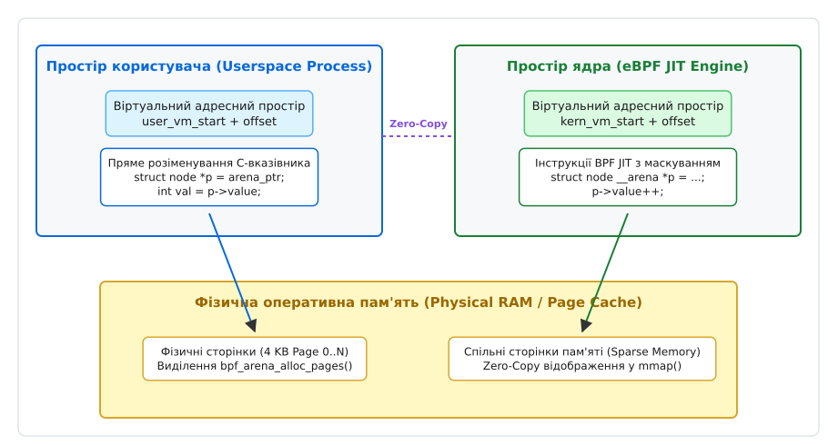
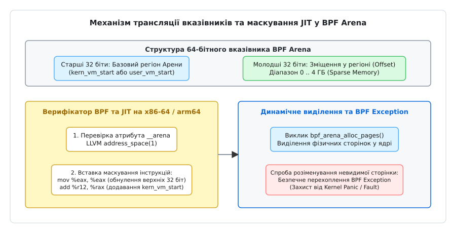

# Спільні регіони памʼяті BPF Arena (Linux 6.8+)

<preknowlist>
- [Віртуальна пам'ять ядра та простору користувача](root:sys-unix/kernel-and-userspace) — розділення адресного простору Linux, захист сторінок та системні виклики.
- [Порівняльний аналіз Ring Buffer та Perf Event Array](root:sys-unix/bpf-ringbuf-vs-perfbuf) — обмін подіями та обмеження традиційних карт eBPF.
- [Обробка сторінкових збоїв (Page Faults)](root:sf-os/page-fault) — виділення фізичної пам'яті за вимогою (on-demand paging) та робота MMU.
- [Механізми трамплінів BPF та kprobes](root:sys-unix/bpf-trampoline-and-fprobe) — низькорівнева інспекція та перехоплення викликів у ядрі.
</preknowlist>

При побудові високонавантажених систем спостережуваності, аналізу мережевого трафіку та захисту в реальному часі на базі розширеного Berkeley Packet Filter (eBPF), обмін складними графами стану між ядром Linux та процесами простору користувача (userspace) впирається у фундаментальний бар'єр: традиційні мапи eBPF (`BPF_MAP_TYPE_HASH`, `BPF_MAP_TYPE_ARRAY`) не дозволяють розіменовувати C-вказівники на пам'ять напряму. Оскільки простір ядра (kernel space) та простір користувача мають жорстко ізольовані віртуальні адресні простори, будь-яка спроба передати C-вказівник `struct node *ptr` призводить до катастрофічної помилки або недійсного звернення, адже адреса об'єкта в ядрі є абсолютно беззмістовною для процесу користувача. Для обходу цього обмеження розробникам доводилося застосовувати виснажливу серіалізацію даних, дублювання буферів через системний виклик `bpf()` або штучне обчислення цілочисельних зміщень (offsets) відносно початку мапи. При обробці 10-гігабітних мережевих потоків чи мільйонів подій трасування на секунду накладні витрати на перемикання контексту процесора (context switches) та трансляцію адрес поглинають до 40% загального обсягу обчислювальних ресурсів CPU. Впроваджений у ядрі Linux 6.8 новий тип мапи — **BPF Arena** (`BPF_MAP_TYPE_ARENA`) — фундаментально змінює цю парадигму, створюючи зарезервований спільний регіон віртуальної пам'яті, де eBPF-програми та демони простору користувача оперують єдиними прямими C-вказівниками у режимі zero-copy.

## 1. Еволюція механізмів обміну даними між ядром та Userspace

Розуміння глибокої архітектурної цінності BPF Arena вимагає детального аналізу еволюційного шляху та обмежень, притаманних попереднім поколінням абстракцій eBPF.

### 1.1 Традиційні BPF Maps та їхній накладний ресурс

З моменту появі розширеного eBPF у ядрі Linux 3.18, базовою одиницею зберігання стану та обміну даними була мапа (BPF Map) — абстракція таблиці ключ-значення під повним управлінням ядра. Для читання чи запису даних традиційно застосовувалися два головні канали:
1. **З боку простору користувача**: виконання системного виклику `bpf(BPF_MAP_LOOKUP_ELEM, &attr)`. Ця операція вимагає повноцінного переходу з користувацького у привілейований режим процесора, перевірки прав доступу, копіювання даних через хелпери ядра `copy_to_user()` та оновлення внутрішніх лічильників мапи.
2. **З боку ядра (eBPF)**: використання хелперів ядра, таких як `bpf_map_lookup_elem(&map, &key)`. Повертаний вказівник є тимчасовим і валідним лише у межах поточного контексту виконання eBPF-програми.

Коли обсяг переданих даних вимірюється мільйонами записів на секунду, накладні витрати на системні виклики `bpf()` перетворюються на головне вузьке місце системи.

### 1.2 Недоліки `mmap()` для класичних типів мап

Для усунення постійних викликів `bpf()` у ядрі Linux 5.5 було додано можливість відображення деяких типів мап (зокрема `BPF_MAP_TYPE_ARRAY`) у простір користувача за допомогою `mmap()` (за наявності прапора `BPF_F_MMAPABLE`). Згодом ядро 5.8 представило спеціалізовану мапу `BPF_MAP_TYPE_RINGBUF` для ефективної передачі потокових подій.

Незважаючи на значне підвищення швидкості читання, ці механізми залишалися концептуально обмеженими:
- **Відсутність транзитивності C-вказівників**: якщо BPF-програма будує складну структуру даних (наприклад, зв'язний список, дерево чи граф), вона не може зберегти вказівник на наступний вузол у пам'яті. Адреса вузла в ядрі не збігається з адресою в userspace.
- **Вимушена індексація замість вказівників**: розробники змушені будувати штучні "віртуальні адреси" як 32-бітні або 64-бітні індекси елементів масиву (`node_idx`). Кожне розіменування перетворюється на обчислення `base_ptr + node_idx * sizeof(node)`.
- **Жорсткі обмеження на динамічну алокацію**: розширення структур вимагає заздалегідь визначених масивів максимального розміру, що призводить до перевитрати оперативної пам'яті.

## 2. Архітектурний фундамент BPF Arena (`BPF_MAP_TYPE_ARENA`)

BPF Arena створює спільну розріджену віртуальну пам'ять (sparse virtual memory region), яка одночасно відображається в адресний простір процесу користувача та в адресний простір виконання eBPF-коду у ядрі.


*Архітектура BPF Arena: спільне відображення розрідженого віртуального адресного простору між ядром та процес користувача через єдину фізичну оперативну пам'ять.*

### 2.1 Концепція 64-бітного розрідженого простору (Sparse Memory)

При створенні мапи типу `BPF_MAP_TYPE_ARENA` ядро Linux не виділяє фізичні сторінки пам'яті одразу. Замість цього воно резервує великий безперервний діапазон віртуальних адрес (зазвичай до 4 ГБ у межах 32-бітного зміщення відносно базової адреси arena).

Коли користувацький процес викликає `mmap()` над файловим дескриптором arena-мапи, ядро налаштовує таблиці сторінок (Page Tables) процесу так, щоб вони вказували на зарезервовану ділянку. Фізичні сторінки пам'яті (Physical RAM pages) виділяються лише за необхідності (on-demand page allocation) — під час першого звернення або через спеціалізований виклик алокатора ядра.

### 2.2 Внутрішня організація MMU та таблиць сторінок ядра

Підсистема управління пам'яттю Linux (Memory Management Subsystem) керує віртуальним адресичним простором через ієрархічні сторінкові таблиці (P4D, PUD, PMD, PTE). При створенні `BPF_MAP_TYPE_ARENA` ядро створює спеціалізовану ділянку віртуальної пам'яті `struct vm_area_struct` (VMA) у процесі користувача з прапорами `VM_SHARED` та `VM_DONTEXPAND`.

У ядрі Linux для арени виділяється паралельний діапазон у віртуальному адресному просторі ядра (`kern_vm_start`), який належить до підсистеми `vmalloc` або спеціального зарезервованого регіону BPF JIT. Коли виділяється фізична сторінка `struct page`, ядро одночасно реєструє її PFN (Page Frame Number) як у PTE сторінкових таблиць процесу користувача, так і в сторінкових таблицях ядра. Завдяки цьому обидві таблиці сторінок посилаються на один і той самий апаратний кадр фізичної оперативної пам'яті.

### 2.3 Абстракція єдиного вказівника (Direct Pointers)

Головний технологічний прорив BPF Arena полягає у тому, що значення вказівника `struct node *ptr` є ідентичним і валідним як для BPF-програми в ядрі, так і для C/C++ коду в просторі користувача.

```
Віртуальний простір Userspace:  [ user_vm_start ] ─── Offset ───> [ Об'єкт в пам'яті ]
                                                                             │ (Ідентична фізична сторінка)
Віртуальний простір Ядра (eBPF): [ kern_vm_start ] ─── Offset ───> [ Об'єкт в пам'яті ]
```

Для досягнення цієї ідентичності ядро гарантує, що молодші 32 біти 64-бітного вказівника описують точне зміщення (offset) всередині арени. Оскільки обидві сторони знають свої базові адреси (`user_vm_start` та `kern_vm_start`), додавання зміщення до відповідної бази дає прямий доступ до однієї й тієї самої фізичної сторінки RAM без жодного копіювання.

Детальний перелік викликів системного API та структур для роботи з ареною міститься у довіднику [Інтерфейс та системні виклики BPF Arena (API Reference)](root:sys-unix/ebpf-arena-shared-memory-region/api-bpf-arena.md).

## 3. Безпека ядра, BPF Verifier та JIT-маскування

Надання eBPF-програмам можливості розіменовувати довільні C-вказівники створює колосальний ризик для стабільності ОС. Без належного контролю помилковий або зловмисний вказівник міг би призвести до читання секретів ядра або катастрофічної помилки Kernel Panic. Для запобігання цьому ядро Linux застосовує трирівневу систему захисту.


*Механізм трансляції вказівників, JIT-маскування інструкцій та безпечної обробки винятків BPF Exception у BPF Arena.*

### 3.1 Кваліфікація адресного простору у LLVM

При компіляції C-коду eBPF за допомогою Clang розробник використовує кваліфікатор `__attribute__((address_space(1)))`, який зазвичай огортається у макрос `__arena`.

```c
#define __arena __attribute__((address_space(1)))

struct tree_node {
    uint64_t key;
    uint64_t value;
    struct tree_node __arena *left;
    struct tree_node __arena *right;
};
```

Цей атрибут інформує компілятор LLVM про те, що даний вказівник належить до специфічного адресного простору Арени. LLVM генерує код, у якому кожна операція завантаження або збереження за цим вказівником позначається як доступ до Арени.

### 3.2 Аналіз BPF Verifier на етапі завантаження

Під час завантаження програми верифікатор BPF перевіряє всі інструкції, які працюють з `address_space(1)`:
1. Перевіряється, що базовий вказівник дійсно отримано з відомого об'єкта `BPF_MAP_TYPE_ARENA`.
2. Перевіряється, що арифметичні операції над вказівником не виходять за межі загального зарезервованого обсягу арени (`max_entries`).
3. Забороняється виконання небезпечних операцій приведення типів до звичайних вказівників ядра без відповідних перевірок.

### 3.3 Апаратне маскування вказівників у JIT-компіляторі

На етапі JIT-компіляції eBPF-байткуду в машинні інструкції целевої архітектури (x86-64 або ARM64) компілятор вставляє захисні машинні інструкції (pointer masking).

На архітектурі x86-64 для інструкцій читання/запису за arena-вказівником генерується наступний машинений код:

```assembly
; Припустимо, %rax містить 64-бітне значення вказівника
mov %eax, %eax        ; Атомно обнуляє старші 32 біти %rax, залишаючи лише 32-бітний offset
add %r12, %rax        ; Додає базову адресу ядра kern_vm_start, що зберігається в регістрі %r12
mov (%rax), %rbx      ; Виконує безпечне читання значення з оперативної пам'яті
```

Завдяки першій інструкції `mov %eax, %eax` навіть якщо BPF-програма спробує сформувати пошкоджену чи шкідливу адресу (наприклад, `0xFFFF888012345678`), старші 32 біти будуть примусово обнулені. Вказівник гарантовано потрапить у діапазон від `kern_vm_start` до `kern_vm_start + 4GB`.

Важливо відзначити, що інструкція `mov %eax, %eax` у сучасних процесорах x86-64 розпізнається декодером як операція перейменування регістрів (zero-latency register renaming) і виконується практично без затримки конвеєра CPU.

### 3.4 Перехоплення винятків (BPF Exception Handling)

Що станеться, якщо BPF-програма розімене вказівник всередині Арени, який вказує на розріджену (sparse) сторінку, для якої ще не виділено фізичну пам'ять RAM?

У звичайному коді ядра це викликало б `Page Fault` та Kernel Panic. Проте для BPF Arena ядро Linux використовує механізм **BPF Exception Handler**:
1. При виникненні `Page Fault` у контексті виконання BPF-програми підсистема MMU передає управління спеціалізованому обробнику винятків BPF (`bpf_page_fault_handler`).
2. Обробник шукає адресу інструкції у спеціальній таблиці винятків ядра `__ex_table` (Exception Table), згенерованій JIT-компілятором.
3. Якщо збій стався під час виконання BPF-інструкції Арени, ядро безпечно обнуляє цільовий регістр і передає управління на точку відновлення (fixup routine), повертаючи нульове значення замість аварійної зупинки ОС.

## 4. Управління пам'яттю у BPF Arena: Динамічні алокатори

BPF Arena не просто надає стабільний буфер — вона дозволяє будувати динамічні алокатори пам'яті (`malloc`/`free`) прямо всередині eBPF та простору користувача.

### 4.1 Хелпери виділення та звільнення сторінок

Ядро Linux надає два фундаментальні хелпери для BPF-програм:
- `bpf_arena_alloc_pages()`: замовляє у ядра виділення вказаної кількості фізичних сторінок (4 KB) за вказаним оффсетом в арені.
- `bpf_arena_free_pages()`: повертає фізичні сторінки пам'яті назад до системи.

```c
/* Приклад динамічного виділення 2 сторінок у ядрі */
void __arena *ptr = bpf_arena_alloc_pages(&arena_map, NULL, 2, -1, 0);
if (!ptr) {
    /* Недостатньо пам'яті в системі */
    return ;
}
```

### 4.2 Користувацькі алокатори пам'яті (Userspace Allocators)

Оскільки пам'ять арени є спільною, процес користувача може реалізувати алокатор типу `lock-free bump allocator` або `buddy allocator` прямо в арені. 

Схема роботи користувацького алокатора:
1. Userspace демон ініціалізує заголовок арени та виділяє стартовий пул сторінок.
2. Коли BPF-програмі потрібно створити новий вузол графа, вона або бере вільний блок із лок-фрі списку (freelist), або викликає `bpf_arena_alloc_pages()`.
3. Обидві сторони оновлюють вказівники за допомогою атомних інструкцій (`__sync_fetch_and_add` у C або `std::atomic` у C++).

Повний практичний приклад побудови та обходу складного Radix Tree у спільно вживаній BPF Arena дивіться у матеріалі [Практична реалізація спільного Radix Tree в BPF Arena](root:sys-unix/ebpf-arena-shared-memory-region/proj-arena-shared-tree.md).

## 5. Побудова лок-фрі структур даних у BPF Arena

Спільний адресний простір Arena відкриває нові можливості для створення високопродуктивних структур даних без використання важких механізмів блокування (locks, mutexes), які є неможливими у контексті eBPF.

### 5.1 Lock-Free Ring Buffer та черги MPSC

Традиційний BPF Ring Buffer надає однонаправлений канал передачі подій від ядра до простору користувача. Завдяки BPF Arena розробники можуть спроектувати двонаправлену лок-фрі чергу (Multi-Producer Single-Consumer чи Single-Producer Single-Consumer), розмістивши індекси `head` та `tail` у перших байтах арени.

Схема атомного оновлення лок-фрі черги:
1. Виробник події (наприклад, eBPF-програма на мережевому інспекторі) розраховує новий індекс запису та атомарно збільшує `head` за допомогою `__sync_fetch_and_add`.
2. Споживач у просторі користувача читає елемент за прямим вказівником та оновлює `tail` через `std::atomic::store()`.
3. Відсутність системних викликів дозволяє досягти затримок на рівні десятків наносекунд на одну подію.

### 5.2 Динамічні графи та Radix Trees

У системах маршрутизації та аналізу мережевих загроз часто виникає необхідність обходу префіксних дерев (LPM Trie) або графів зв'язків процесів. У BPF Arena створення нового вузла графа зводиться до виділення пам'яті в арені та атомарного оновлення вказівника батьківського вузла.

Оскільки вказівник є 64-бітним C-вказівником, зміна коріння дерева здійснюється за допомогою однієї атомної інструкції `compare-and-swap` (`CAS`). Це дозволяє простору користувача повністю перевизначити графічну структуру правил фільтрації без зупинки обробки трафіку BPF-програмою в ядрі.

## 6. Порівняльний аналіз BPF Arena та інших типів мап

Для вибору оптимального механізму обміну даними у проекті спостережуваності слід керуватися порівняльними характеристиками різних абстракцій BPF.

| Критерій | `BPF_MAP_TYPE_HASH` | `BPF_MAP_TYPE_ARRAY` | `BPF_MAP_TYPE_RINGBUF` | `BPF_MAP_TYPE_ARENA` |
| --- | --- | --- | --- | --- |
| **Спосіб доступу з Userspace** | Системний виклик `bpf()` | `bpf()` або `mmap()` | `mmap()` (тільки читання) | `mmap()` (читання та запис) |
| **Підтримка C-вказівників** | Ні (тільки ключі) | Ні (тільки індекси) | Ні | **Так (прямі 64-біт вказівники)** |
| **Zero-Copy обмін** | Ні (копіювання) | Так (при `mmap`) | Так (для подій) | **Так (повний zero-copy)** |
| **Складні структури (списки, дерева)** | Дуже складно | Складно (через offsets) | Неможливо | **Природно (native C structs)** |
| **Динамічне виділення пам'яті** | Фіксоване при створенні | Статичний розмір | Кільцевий буфер | **Динамічне (`alloc_pages`)** |
| **Версія ядра Linux** | 3.18+ | 5.5+ | 5.8+ | **6.8+** |

## 7. Профілювання та інспекція за допомогою системних утиліт

Для спостереження за станом BPF Arena та діагностики продуктивності використовуються стандартні інструменти Linux.

### 7.1 Інспекція через `bpftool`

Утиліта `bpftool` дозволяє переглянути параметри створеної арени:

```bash
# Перелік активних мап у системі
bpftool map show name arena_map

# Детальна інформація про розмір та прапори
bpftool map dump id 42
```

Вивід містить ідентифікатор мапи, тип `arena`, кількість виділених сторінок та прапори сумісності з `mmap`.

### 7.2 Простеження сторінкових збоїв через `tracepoints`

Оскільки BPF Arena використовує розріджені сторінки, виділення фізичної пам'яті викликає події системного підсистеми MMU. Простежити їх можна через підсистему ftrace:

```bash
# Увімкнення відстеження сторінкових збоїв процесу
echo 1 > /sys/kernel/debug/tracing/events/exceptions/page_fault_user/enable

# Перегляд логу подій у реальному часі
cat /sys/kernel/debug/tracing/trace_pipe | grep tree_loader
```

## 8. Практичні поради, обмеження та крайні випадки

При впровадженні BPF Arena у продакшн-системах необхідно враховувати наступні технологічні обмеження.

> 🔧 **Навіщо це.**
> BPF Arena розроблена перш за все для складних аналітичних платформ, високошвидкісних програмно-визначених мереж (SDN), систем запобігання вторгненням (eBPF-based IDS/IPS) та графових баз даних у пам'яті. Вона усуває архітектурний бар'єр між ядром та користувацьким простором, перетворюючи eBPF на повноцінну платформу розділюваної пам'яті.

### 8.1 Архітектурні обмеження та вимоги к ланцюжку інструментів
1. **Вимога до JIT-компілятора**: BPF Arena працює **виключно** при увімкненому JIT (`net.core.bpf_jit_enable = 1`). В інтерпретаторі BPF підтримка маскування вказівників відсутня.
2. **Версія LLVM/Clang**: Для компіляції коду з кваліфікатором `address_space(1)` потрібен Clang версії 18 або новіше.
3. **Підтримка архітектур CPU**: У ядрі Linux 6.8+ повна підтримка JIT-маскування реалізована для x86-64 та ARM64 (aarch64). Для інших архітектур (RISC-V, PowerPC) підтримку впроваджено у наступних релізах ядра.

### 8.2 Захист від аварійного завершення процесів (Process Crash Recovery)
Якщо процес користувача, що мапував арену, аварійно завершується (наприклад, через `SIGSEGV` або `SIGKILL`), фізичні сторінки пам'яті у ядрі залишаються захищеними. Оскільки лічильник посилань мапи BPF утримується ядром, BPF-програма продовжує безпечно функціонувати. Після перезапуску процес користувача може знову викликати `mmap()` і миттєво відновити доступ до того самого графа даних за тим самим віртуальним оффсетом.
