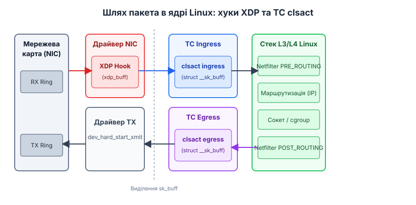
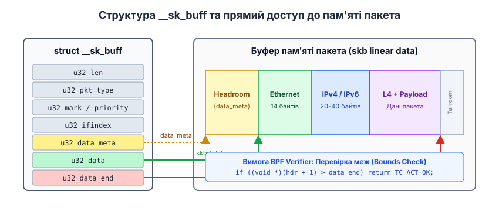
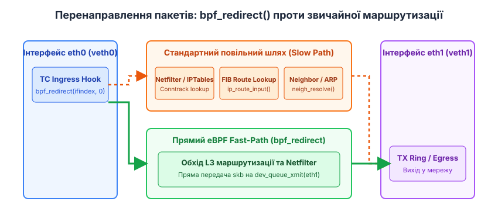

# eBPF у підсистемі Traffic Control (tc)

<preknowlist>
- [Стек мережевої підсистеми Linux](topic:sys-unix/network-stack-architecture) — проходження пакетів від NIC до сокета.
- [Принципи eBPF та XDP](topic:sys-unix/xdp-express-data-path) — базові концепції хуків BPF та verifier.
- [Модель підсистеми Netfilter](topic:sys-unix/netfilter-model) — концепція хуків пакетної фільтрації.
</preknowlist>

Коли сучасний високозавантажений шлюз, балансувальник навантаження або вузол кластера Kubernetes отримує потік 10 мільйонів пакетів на секунду (10 Mpps), стандартний мережевий стек Linux витрачає понад 60% обчислювальних ресурсів ЦП виключно на проходження через ієрархію правил `iptables`, перевірку стану з'єднань у таблицях `conntrack` та каскадні таблиці маршрутизації FIB. Навіть якщо пакет призначено для моментального перенаправлення у сусідній контейнер на тому ж самому фізичному хості, ядро вимушене виділити складну метаструктуру сокетного буфера `sk_buff`, виконати повний аналіз заголовків L2–L4, пройти через п'ять системних хуків підсистеми Netfilter та провести пошук у таблиці сусідів ARP/ND. Для усунення цього вузького місця підсистема Traffic Control (tc) разом із дисципліною черги `clsact` та розширеним фільтром BPF (eBPF) надає повністю програмований плацдарм обробки пакетів, який обходить повільні шляхи ядра, зберігаючи при цьому доступ до всього системного контексту мережевого стеку.

Детальний аналіз історичної еволюції підсистеми Traffic Control від класичних фільтрів `u32` до сучасної бескласової дисципліни `clsact` викладено у вставці [Еволюція Traffic Control та народження clsact](topic:sys-unix/ebpf-traffic-control-clsact/hist-tc-bpf-evolution.md).

## 1. Архітектура хуків Traffic Control у ядрі Linux

Мережевий стек ядра Linux пропонує дві основні точки впровадження eBPF-програм для обробки мережевих пакетів нижнього рівня: XDP (eXpress Data Path) та TC (Traffic Control). Щоб зрозуміти фундаментальну різницю між ними та обрати правильний інструмент, необхідно детально простежити шлях пакета від фізичної мережевої карти до системного виклику сокета.


*Шлях пакета у мережевому стеку ядра Linux із відображенням точних точок підключення XDP, виділення пам'яті sk_buff та хуків TC clsact на ingress та egress.*

Як показано на схемі, програма XDP виконується безпосередньо в драйвері мережевої карти під час обробки переривань NAPI при отриманні кадрів із кільцевого буфера RX (RX Ring). У цей момент пам'ять пакета представлена у вигляді сирого буфера `struct xdp_buff`. Ядро ще не виділило структуру `sk_buff`, не розпарсило Ethernet-кадр і не створило жодних системних метаданих. Це забезпечує максимальну продуктивність для відкидання SYN-флуду чи базового L4-балансування, але позбавляє програму eBPF контексту ядра — інформації про сокети, cgroups, сокетні мітки та віртуальні інтерфейси вищого рівня (veth, bridge, vlan).

Хук Traffic Control розміщується вище у стеку. Після того як драйвер викликає `napi_gro_receive()` або `netif_receive_skb()`, ядро виділяє метаструктуру `sk_buff` (socket buffer) у функції `__netif_receive_skb_core()`. Одразу після цього — до виклику Netfilter `NF_INET_PRE_ROUTING` та до прийняття рішення про маршрутизацію (IP routing decision) — ядро викликає хук **TC Ingress**.

На вихідному шляху (egress), коли процес відправляє дані через сокет, пакет проходить через TCP/IP стек, Netfilter `NF_INET_POST_ROUTING` та розрахунок маршруту. У функції `sch_handle_egress()` або `dev_hard_start_xmit()` безпосередньо перед передачею кадра у TX Ring драйвера виконується хук **TC Egress**.

Позиціонування TC надає програмам eBPF чотири ключові переваги перед XDP:
1. **Повний доступ до `sk_buff`:** Програма має доступ не лише до сирих байтів пакета, а й до системних полів: `mark`, `priority`, `pkt_type`, `queue_mapping`, `cb` (control buffer).
2. **Двонаправленість (Ingress + Egress):** XDP працює виключно на вхідному трафіку (ingress). TC eBPF дозволяє модифікувати, фільтрувати та маршрутизувати як вхідні, так і вихідні пакети.
3. **Підтримка будь-яких пристроїв:** XDP вимагає явного драйверного коду (`native mode`) або працює у повільному емуляційному режимі (`generic mode`). TC eBPF працює з будь-якими мережевими інтерфейсами Linux — включаючи віртуальні пристрої `veth`, `bridge`, `macvlan`, `wireguard` та `tun/tap`.
4. **Контекст сокета та cgroup:** На рівні TC програма eBPF може зчитувати ідентифікатори cgroup (`bpf_skb_cgrp_id()`) та прив'язувати пакети до конкретних сокетів процесів.

## 2. Дисципліна черги `clsact`: бескласова lockless-архітектура

Історично підсистема Traffic Control будувалася навколо дисциплін черг (qdisc), які керували пріоритезацією та обмеженням швидкості (shaping) вихідного трафіку. Для вхідного трафіку існувала псевдо-дисципліна `ingress` qdisc (handle `ffff:`). Проте `ingress` мала суттєві обмеження: вона не підтримувала вихідний трафік, вимагала створення ієрархій класів і використовувала внутрішній спін-блок `qdisc->seqlock` ядра для синхронізації списку фільтрів.

У ядрі Linux 4.5 була представлена спеціалізована дисципліна черги **`clsact`** (Classifying Action). `clsact` є чистою бескласовою точкою підключення (hook provider), розробленою спеціально для eBPF.

### Внутрішній устрій `clsact` у ядрі:
- `clsact` об'єднує вхідний (`ingress`) та вихідний (`egress`) напрямки під єдиним статичним ідентифікатором черги `ffff:`.
- **Відсутність чергування та блокувань (Lockless):** `clsact` не створює кільцевих буферів і не утримує блокування `root qdisc lock`. Обробка пакетів у `clsact` виконується в режимі RCU (Read-Copy Update). Кілька ядер ЦП можуть одночасно виконувати eBPF програми для вхідних пакетів на одному інтерфейсі без жодного контеншну блокувань.
- **Відсутність шейпінгу:** `clsact` не вимірює затримки та не затримує пакети у чергах. Її завдання — миттєво передати вказівник `sk_buff` прив'язаній програмі `cls_bpf` і отримати код вердикту.

Для активації дисципліни `clsact` на мережевому інтерфейсі (наприклад, `eth0`) використовується команда `tc`:

```bash
# Додавання дисципліни clsact до інтерфейсу
tc qdisc add dev eth0 clsact
```

Після створення `clsact` у файловій системі procfs/sysfs створюються два ланцюжки фільтрів: `ingress` та `egress`.

## 3. Режим Direct-Action (`da`) та коди повернення дій

У початковій архітектурі TC класифікатор (filter) лише присвоював пакету ідентифікатор класу (`classid`), після чого ядро передавало пакет окремому списку дій (actions). Це створювало зайвий шар абстракції та знижувало продуктивність.

Режим **Direct-Action** (прапорець `da`) перетворив eBPF програму типу `BPF_PROG_TYPE_SCHED_CLS` на монолітний виконавець логіки: програма одночасно аналізує пакет, модифікує його вміст та самостійно приймає остаточне рішення, повертаючи системний код дії TC.

```bash
# Прикріплення eBPF програми у режимі direct-action до ingress хука
tc filter add dev eth0 ingress bpf da obj my_prog.o sec classifier
```

### Основні коди дій TC (TC Action Codes):

У режимі Direct-Action eBPF-програма повертає цілочисельний код, який повідомляє підсистемі Traffic Control, яку дію слід застосувати до поточного пакета. У таблиці нижче наведено основні системні константи статусів та їхній вплив на подальшу обробку `sk_buff` у ядрі:

```
+------------------+-------+-------------------------------------------------------------+
| Константа        | Код   | Значення та поведінка ядра                                  |
+------------------+-------+-------------------------------------------------------------+
| TC_ACT_OK        |   0   | Пропустити пакет далі у стандартний мережевий стек ядра.   |
| TC_ACT_SHOT      |   2   | Відкинути пакет негайно (kfree_skb).                        |
| TC_ACT_UNSPEC    |  -1   | Використати рішення наступного фільтра у ланцюжку TC.       |
| TC_ACT_STOLEN    |   4   | Пакет перехоплено eBPF (ядро залишає skb програмі).         |
| TC_ACT_REDIRECT  |   7   | Перенаправити пакет на інший інтерфейс (через bpf_redirect).|
| TC_ACT_TRAP      |   8   | Передати пакет на стековий лог або інструменти трасування.  |
+------------------+-------+-------------------------------------------------------------+
```

Якщо програма повертає `TC_ACT_OK`, вхідний пакет на хуку `ingress` продовжує рух до підсистеми Netfilter `PREROUTING` та таблиці маршрутизації IP. Якщо програма повертає `TC_ACT_SHOT`, ядро зупиняє обробку та вивільняє пам'ять `sk_buff`, що є ефективним засобом фільтрації небажаного трафіку чи зловмисних пакетів.

 Повний перелік системних структур, розшифровку полів `struct __sk_buff`, коди дій `TC_ACT_*` та сигнатури допоміжних функцій ядра зведено у довіднику [Інтерфейс та хепери eBPF Traffic Control (clsact)](topic:sys-unix/ebpf-traffic-control-clsact/api-clsact-bpf-helpers.md).

## 4. Анатомія сокетного буфера `struct __sk_buff` та безпека BPF Verifier

На відміну від XDP, де програма приймає вказівник на `struct xdp_buff`, програми TC eBPF отримують у якості контекстного аргументу (у регістрі ЦП `R1`) вказівник на метаструктуру `struct __sk_buff`.

```c
SEC("classifier")
int tc_main(struct __sk_buff *skb) {
    void *data = (void *)(long)skb->data;
    void *data_end = (void *)(long)skb->data_end;
    // ...
}
```


*Внутрішня структура контексту __sk_buff, зв'язок вказівників data, data_end та data_meta із лінійним буфером кадра Ethernet.*

### Співвідношення `struct __sk_buff` та реального `struct sk_buff`:
`struct __sk_buff` — це безпечний публічний інтерфейс (uAPI), що експортується ядром для eBPF. Коли eBPF-програма зчитує поле `skb->mark` або `skb->data`, JIT-компілятор BPF перетворює це читання на реальний зсув у внутрішній структурі ядра `struct sk_buff`.

Поля `data` та `data_end` містять 32-бітні адреси початку та кінця лінійної області даних кадра (Linear packet buffer).

### Вимога BPF Verifier: Перевірка меж (Bounds Checking):
Оскільки eBPF код виконується безпосередньо в просторі ядра, верифікатор (BPF Verifier) блокує будь-яке завантаження об'єкта, якщо програма намагається роздерефереувати вказівник без попередньої перевірки меж.

Для розпарсування Ethernet та IP заголовків програма мусить виконувати сувору перевірку:

```c
struct ethhdr *eth = data;
if ((void *)(eth + 1) > data_end) {
    return TC_ACT_OK; // Межі порушено — передаємо пакет далі або скидаємо
}

struct iphdr *ip = (void *)(eth + 1);
if ((void *)(ip + 1) > data_end) {
    return TC_ACT_OK;
}
```

Якщо перевірку `(void *)(ip + 1) > data_end` вилучити, верифікатор видасть помилку під час завантаження:

```text
math between fp pointer and register invalid
invalid access to packet, off=14 size=20, R1(id=0,off=0,r=14)
R1 offset is outside of packet bounds
```

Ця умова гарантує, що жодна помилка у коді eBPF не призведе до читання за межами виділеної пам'яті та не викликає Kernel Panic.

## 5. Модифікація пакетів L2–L4 та робота з нелінійними буферами

Одним із найголовніших завдань TC eBPF є модифікація пакетів на льоту: зміна MAC-адрес, трансляція IP-адрес (NAT), заміна портів TCP/UDP та вставка тунельних заголовків.

### Два підходи до модифікації даних:

1. **Прямий доступ (Direct Packet Write):**
Якщо буфер є лінійним, програма може модифікувати байти безпосередньо через вказівники `data`:

```c
struct iphdr *ip = (void *)(eth + 1);
if ((void *)(ip + 1) <= data_end) {
    // Зміна IP-адреси призначення
    ip->daddr = bpf_htonl(0x0A000002); // 10.0.0.2
}
```

2. **Використання хепера `bpf_skb_store_bytes()`:**
У ядрі Linux сокетний буфер `sk_buff` може бути нелінійним (paged skb), якщо мережева карта використовує масиви сторінок `skb_shinfo(skb)->frags` для великих кадрів (GRO/TSO), або якщо пакет клоновано (`skb_cloned()`). Прямий запис у такий буфер можу зіпсувати пам'ять інших процесів.

Допоміжна функція `bpf_skb_store_bytes()` розв'язує цю проблему:

```c
long bpf_skb_store_bytes(struct __sk_buff *skb, u32 offset,
                          const void *from, u32 len, u64 flags);
```

Вона автоматично перевіряє, чи є пакет клонованим, і при необхідності викликає внутрішні функції ядра `pskb_expand_head()` або `skb_unshare()`, створюючи приватну копію лінійного буфера.

### Коригування контрольних сум (Checksum recalculation):
Зміна будь-якого поля в заголовках IP або TCP/UDP робить контрольні суми (checksum) недійсними. Якщо не оновити чексуму, мережевий стек отримувача відкине пакет як пошкоджений.

Для інкрементального оновлення чексум без перерахунку всього пакета використовуються спеціалізовані хепери:

```c
// Оновлення IP (L3) контрольної суми при зміні IP-адреси
__be32 old_ip = ip->saddr;
__be32 new_ip = bpf_htonl(0x0A000001);

ip->saddr = new_ip;

bpf_l3_csum_replace(skb, offsetof(struct iphdr, check), old_ip, new_ip, sizeof(new_ip));

// Оновлення TCP (L4) контрольної суми
bpf_l4_csum_replace(skb, offsetof(struct tcphdr, check) + ETH_HLEN + sizeof(struct iphdr),
                    old_ip, new_ip, sizeof(new_ip) | BPF_F_PSEUDO_HDR);
```

Прапорець `BPF_F_PSEUDO_HDR` інформує ядро про те, що зміна IP-адреси впливає на псевдозаголовок TCP/UDP, гарантуючи точну відповідність математичного алгоритму RFC 1071.

## 6. Перенаправлення трафіку та обхід стеку: `bpf_redirect()`

Найбільший приріст продуктивності у сучасних мережевих архітектурах забезпечується можливістю перенаправлення пакетів в обхід стандартної маршрутизації IP ядра.


*Порівняння повільного шляху (Slow Path) через Netfilter та таблиці FIB із прямим eBPF Fast-Path через bpf_redirect().*

### Механізм роботи `bpf_redirect()`:
Коли eBPF програма викликає `bpf_redirect(ifindex, flags)`, ядро не передає пакет далі по поточному стеку. Функція записує цільовий індекс інтерфейсу та напрямок у приховані метадані `skb` і повертає код `TC_ACT_REDIRECT`.

```c
// Перенаправлення пакета на вихідний шлях (egress) інтерфейсу з індексом 5
return bpf_redirect(5, 0);

// Перенаправлення пакета на вхідний шлях (ingress) інтерфейсу veth1
return bpf_redirect(target_ifindex, BPF_F_INGRESS);
```

Після повернення `TC_ACT_REDIRECT` функція `__netif_receive_skb_core()` перехоплює пакет і передає його безпосередньо у функцію `dev_queue_xmit()` цільового пристрою.

### Порівняння шляхів обробки пакета:

1. **Стандартний шлях (Slow Path):**
   `Ingress NIC` → `sk_buff alloc` → `TC ingress` → `Netfilter PREROUTING` → `conntrack` → `FIB Route Lookup` → `Netfilter POSTROUTING` → `TC egress` → `TX Driver`.
   *Кількість операцій:* 1200–1500 інструкцій ЦП, безліч переходів за вказівниками.

2. **eBPF Fast-Path via `bpf_redirect()`:**
   `Ingress NIC` → `sk_buff alloc` → `TC ingress (bpf_redirect)` → `TX Driver (target_if)`.
   *Кількість операцій:* ~150 інструкцій ЦП. Затримка обробки зменшується у 5–8 разів.

### Нове покоління хеперів перенаправлення:
- **`bpf_redirect_neigh()`:** Дозволяє перенаправляти пакети у зовнішню мережу L3 без явного виклику routing lookup, використовуючи таблицю сусідів ARP/ND ядра для підстави правильних MAC-адрес.
- **`bpf_redirect_peer()`:** Оптимізований хепер для віртуальних пар `veth`. Він перенаправляє пакет безпосередньо на вхідний шлях парного інтерфейсу у сусідньому мережевому просторі імен (network namespace), уникаючи подвійного проходження стеку.

 Повний робочий вихідний код eBPF-програми ядра та завантажувачів мовами C і C++ із використанням `libbpf` наведено у вставці [Практичний проект: перенаправлення трафіку за допомогою eBPF TC clsact](topic:sys-unix/ebpf-traffic-control-clsact/proj-tc-ebpf-redirect.md).

## 7. Глибокі механізми ядра: виклики `net/core/dev.c` та структури даних

Щоб осягнути внутрішню механіку виконання TC eBPF, необхідно проаналізувати вихідний код мережевої підсистеми ядра Linux у файлі `net/core/dev.c`.

### Послідовність системних викликів на шляху Ingress:

Передавання кадра від мережевого адаптера до eBPF-обробника розгортається у вихідному коді ядра через послідовний ланцюжок внутрішніх функцій:

1. Драйвер мережевої карти отримує кадр і викликає `netif_receive_skb_internal()`.
2. Ядро потрапляє у головну функцію обробки вхідного трафіку `__netif_receive_skb_core()`.
3. Усередині цієї функції, перед будь-якими перевірками протоколів, розміщено виклик **`sch_handle_ingress()`**:

```c
static inline struct sk_buff *sch_handle_ingress(struct sk_buff *skb,
                                                 struct packet_type **pt_prev,
                                                 int *ret, struct net_device *orig_dev) {
    struct mini_Qdisc *miniq = rcu_dereference_bh(skb->dev->miniq_ingress);
    struct tcf_result res;

    if (!miniq)
        return skb;

    // Виклик класифікаторів TC (включаючи cls_bpf) у режимі RCU
    switch (tcf_classify(skb, miniq->block, miniq->filter_list, &res, false)) {
    case TC_ACT_OK:
    case TC_ACT_RECLASSIFY:
        break;
    case TC_ACT_SHOT:
        kfree_skb(skb);
        return NULL;
    case TC_ACT_REDIRECT:
        skb_do_redirect(skb);
        return NULL;
    }
    return skb;
}
```

Як видно з коду ядра, `sch_handle_ingress()` зчитує вказівник `miniq_ingress` через `rcu_dereference_bh()`. Це означає, що програма eBPF виконується у паралельних контекстах NAPI без захоплення жодних спін-блокувань.

Якщо функція `tcf_classify()` повертає `TC_ACT_REDIRECT`, ядро викликає `skb_do_redirect()`, яка негайно передає пакет у вихідну чергу цільового пристрою і повертає `NULL`, перериваючи подальшу обробку у `__netif_receive_skb_core()`.

## 8. Розширена обробка тунелів, VLAN та інкапсуляція L2/L3

У хмарних мережах трафік між вузлами часто інкапсулюється у тунелі VXLAN, GRE або Geneve. eBPF у підсистемі TC надає спеціальні хепери для роботи з тунельними метаданими без необхідності явного розпарсування зовнішніх UDP/IP заголовків.

### Знімання та вставка тунельних заголовків (VXLAN/Geneve):

Для читання та формування тунельних заголовків програма TC eBPF використовує спеціалізовані helper-функції ядра, як показано у наступному прикладі коду:

```c
// Витягування тунельного ключа (VNI) на вхідному шляху
struct bpf_tunnel_key key = {};
int err = bpf_skb_get_tunnel_key(skb, &key, sizeof(key), 0);
if (!err) {
    // key.tunnel_id містить VNI (Virtual Network Identifier)
    // key.remote_ipv4 містить зовнішню IP-адресу хоста-відправника
}

// Налаштування інкапсуляції для вихідного пакета
struct bpf_tunnel_key out_key = {};
out_key.tunnel_id = 100;                // VXLAN VNI 100
out_key.remote_ipv4 = bpf_htonl(0x0A010101); // 10.1.1.1
out_key.tunnel_ttl = 64;

bpf_skb_set_tunnel_key(skb, &out_key, sizeof(out_key), BPF_F_ZERO_CSUM_TX);
```

Коли програма викликає `bpf_skb_set_tunnel_key()`, ядро не конструює зовнішній IP/UDP заголовок вручну у байт-коді BPF. Вона записує тунельні метадані у сокетний буфер, і коли пакет передається віртуальному пристрою `vxlan0`, драйвер тунелю автоматично інкапсулює пакет на апаратному рівні.

### Робота з 802.1Q VLAN тегами:
- `bpf_skb_vlan_push(skb, bpf_htons(ETH_P_8021Q), vlan_tci)`: Вставляє 4-байтовий тег VLAN 802.1Q безпосередньо за Ethernet-заголовком, розширюючи `skb` та коригуючи зсуви.
- `bpf_skb_vlan_pop(skb)`: Вилучає тег VLAN з пакета, стискаючи сокетний буфер.

## 9. Робота з BPF Maps у підсистемі Traffic Control

У програмах TC eBPF таблиці BPF Maps слугують для збереження динамічного стану між пакетами, обміну даними з користувацьким простором та реалізації складних таблиць маршрутизації.

### Основні типи BPF Maps у TC-програмах:
1. **`BPF_MAP_TYPE_HASH` та `BPF_MAP_TYPE_LRU_HASH`:**
   Використовуються для збереження таблиць з'єднань (Connection Tracking). Коли вхідний SYN-пакет проходить через TC ingress, програма створює запис у хеш-таблиці з 4-кортежем (src_ip, dst_ip, src_port, dst_port). Для наступних пакетів сесії підтвердження відбувається за один прохід `bpf_map_lookup_elem()`.
2. **`BPF_MAP_TYPE_LPM_TRIE` (Longest Prefix Match):**
   Реалізує префіксне дерево (Trie) для зберігання таблиць CIDR-маршрутизації IP. Використовується у Cilium для миттєвого пошуку найдовшого маски підмережі (наприклад, `10.244.0.0/16` ↔ `ifindex 4`).
3. **`BPF_MAP_TYPE_RINGBUF`:**
   Безблокувальний кільцевий буфер для передачі подій аудиту, метрик та зліпків пакетів (packet tracing) у користувацькі агенти моніторингу без втрат та з мінімальним навантаженням на ЦП.

## 10. Інструментарій діагностики, трасування та інспекції в ядрі

Для моніторингу та налагодження TC eBPF програм у ядрі Linux використовується набір системних інструментів:

### Використання утиліти `bpftool`:

Утиліта `bpftool` є основним інструментом інспекції завантажених eBPF-програм та зв'язаних із ними BPF-карт, надаючи такі базові команди для діагностики:

```bash
# 1. Перегляд усіх прикріплених TC програм на мережевих інтерфейсах
bpftool net show

# 2. Зняття розпарсеного байт-коду BPF (xlated) після перевіряльника BPF Verifier
bpftool prog dump xlated id <PROG_ID>

# 3. Зняття реальних машинного коду x86_64 після JIT-компіляції
bpftool prog dump jited id <PROG_ID>

# 4. Дамп вмісту конкретної BPF карти
bpftool map dump id <MAP_ID>
```

### Моніторинг системного логу ядра (`trace_pipe`):
Якщо у коді eBPF використати допоміжну функцію `bpf_trace_printk("Packet len: %d\n", skb->len)`, вивід логу буде доступний у файловій системі tracefs:

```bash
sudo cat /sys/kernel/debug/tracing/trace_pipe
```

## 11. Обробка розширених заголовків IPv6 та TCP-опцій

У сучасних дата-центрах суттєва частка трафіку обробляється за протоколом IPv6, який має відмінну від IPv4 структуру заголовків. 

### Особливості аналізу IPv6 у TC eBPF:
Базовий заголовок IPv6 має фіксований розмір 40 байтів (`struct ipv6hdr`). Проте між IPv6-заголовком та TCP-заголовком можуть розміщуватися розширені заголовки (Extension Headers) — Hop-by-Hop Options, Routing Header, Fragment Header, Destination Options.

Для безпечного обходу розширених заголовків програма використовує цикли з обчисленою межею (Bounded Loops), які підтримуються ядром Linux 5.3+:

```c
#include <linux/ipv6.h>

struct ipv6hdr *ip6 = (void *)(eth + 1);
if ((void *)(ip6 + 1) > data_end) {
    return TC_ACT_OK;
}

__u8 next_hdr = ip6->nexthdr;
void *hdr_ptr = (void *)(ip6 + 1);

// Цикл із фіксованою кількістю ітерацій для верифікатора
#pragma unroll
for (int i = 0; i < 4; i++) {
    if (next_hdr == IPPROTO_TCP) {
        break; // Знайшли TCP заголовок
    }
    
    struct ipv6_opt_hdr *ext_hdr = hdr_ptr;
    if ((void *)(ext_hdr + 1) > data_end) {
        return TC_ACT_OK;
    }
    
    // Переходимо до наступного розширеного заголовка
    hdr_ptr += (ext_hdr->hdrlen + 1) * 8;
    next_hdr = ext_hdr->nexthdr;
}
```

Директива `#pragma unroll` розгортає цикл на етапі компіляції Clang, що дає змогу BPF Verifier статично перевірити межі доступу до пам'яті для кожної ітерації.

## 12. Прозоре проксіювання та приєднання сокетів (`bpf_sk_assign`)

При побудові систем Service Mesh (наприклад, Envoy чи Istio) виникає потреба перехоплювати вхідні TCP-з'єднання і прозоро передавати їх локальному проксі-процесу без використання повільних правил `iptables -j TPROXY`.

Підсистема TC eBPF пропонує революційний механізм за допомогою поєднання двох хеперів: **`bpf_skc_lookup_tcp()`** та **`bpf_sk_assign()`**.

```c
SEC("classifier")
int tc_tproxy(struct __sk_buff *skb) {
    // ... розпарсування L2-L4 ...

    struct bpf_sock_tuple tuple = {};
    tuple.ipv4.saddr = ip->saddr;
    tuple.ipv4.daddr = ip->daddr;
    tuple.ipv4.sport = tcp->source;
    tuple.ipv4.dport = tcp->dest;

    // 1. Пошук локального listening-сокета Envoy у сокетній таблиці ядра
    struct bpf_sock *sk = bpf_skc_lookup_tcp(skb, &tuple, sizeof(tuple.ipv4), BPF_F_CURRENT_NETNS, 0);
    if (sk) {
        if (sk->state == BPF_TCP_LISTEN) {
            // 2. Пряме призначення сокета сокетному буферу skb
            if (bpf_sk_assign(skb, sk, 0) == 0) {
                bpf_sk_release(sk);
                return TC_ACT_OK; // Пакет іде прямо у сокет Envoy без routing!
            }
        }
        bpf_sk_release(sk);
    }
    return TC_ACT_OK;
}
```

Виклики `bpf_skc_lookup_tcp()` та `bpf_sk_assign()` дозволяють eBPF програмі знайти відкритий listening сокет користувацького процесу і прив'язати його безпосередньо до `skb->sk`. В результаті ядро передає пакет сокету процесів без проходження таблиць маршрутизації та підсистеми conntrack.

## 13. Інтеграція з cgroups, сокетами та Hardware Offloading

Окрім чистої обробки пакетів L2–L4, підсистема TC eBPF інтегрована з іншими підсистемами ядра Linux.

### Інтеграція з cgroup v2 та сокетами:
Програма TC eBPF може визначати, якому контрольному контейнеру (cgroup) належить процес, що відправляє або отримує пакет, за допомогою хепера `bpf_skb_cgrp_id(skb)`:

```c
u64 cgroup_id = bpf_skb_cgrp_id(skb);
if (cgroup_id == TARGET_CGROUP_ID) {
    // Застосувати політику безпеки для конкретного контейнера Kubernetes
    return TC_ACT_SHOT;
}
```

Крім того, за допомогою хепера `bpf_skc_lookup_tcp()` програма може отримати вказівник на сокет ядра `struct bpf_sock *` і перевірити його стан (наприклад, `TCP_ESTABLISHED`).

### Апаратне прискорення (TC Hardware Offloading):
Сучасні інтелектуальні мережеві карти (SmartNIC, такі як NVIDIA Mellanox ConnectX або Netronome Agilio) підтримують апаратне завантаження eBPF-програм TC безпосередньо у процесор мережевої карти.

При використанні прапорця `action hw` під час прикріплення:

```bash
tc filter add dev eth0 ingress offload bpf da obj my_prog.o sec classifier
```

JIT-компілятор драйвера перекладає байт-код eBPF у машинний код мережевого процесора (NPU). В результаті фільтрація та перенаправлення пакетів виконуються на апаратному рівні зі швидкістю лінійного каналу (Line Rate 100/200 Гбіт/с) із 0% навантаженням на основний центральний процесор сервера.

## 14. Порівняльний аналіз: XDP проти TC clsact

При розробці мережевих додатків на eBPF постає вибір між використанням XDP та TC `clsact`. У таблиці підсумовано їхні фундаментальні відмінності:

```
+-----------------------------------+-----------------------------------+-----------------------------------+
| Характеристика                    | XDP (eXpress Data Path)           | TC clsact (Traffic Control)       |
+-----------------------------------+-----------------------------------+-----------------------------------+
| Рівень виконання у ядрі           | Драйвер NIC (до sk_buff)          | Мережевий стек (після sk_buff)    |
| Напрямок трафіку                  | Лише Ingress                      | Ingress та Egress                 |
| Структура контексту               | struct xdp_buff                   | struct __sk_buff                  |
| Підтримка віртуальних пристроїв  | Обмежена (потрібен generic mode)  | Повна (veth, bridge, bond, vlan)  |
| Доступ до метаданих skb           | Відсутній                         | Повний (mark, priority, cgroup)   |
| Модифікація розміру пакета        | bpf_xdp_adjust_head()             | bpf_skb_adjust_room()             |
| Продуктивність (Drop rate)        | Максимальна (~24M pps/core)       | Висока (~12M pps/core)            |
| Головне призначення               | DDoS захист, L4 LB (Katran)       | CNI (Cilium), Service Mesh, NAT   |
+-----------------------------------+-----------------------------------+-----------------------------------+
```

Для завдань екстремального захисту від DDoS-атак та первинного відсікання трафіку вибір падає на XDP. Проте для побудови складних мережевих datapaths у Kubernetes, реалізації політики безпеки (Network Policies), моніторингу трафіку та перенаправлення між контейнерами підсистема **TC `clsact` є стандартом де-факто завдяки універсальності, підтримці Egress та доступу до метаданих ядра.**
