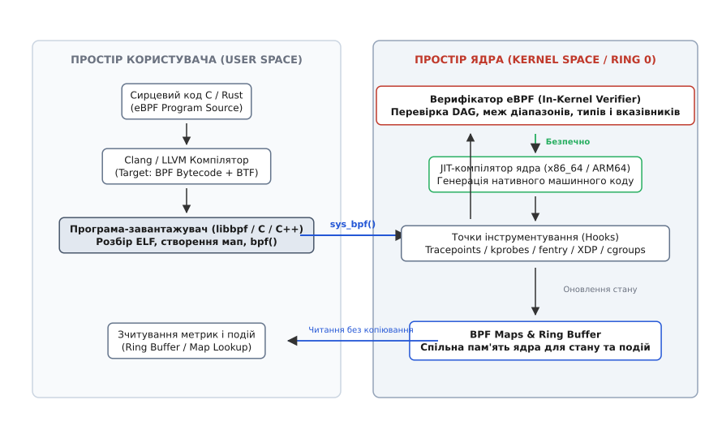
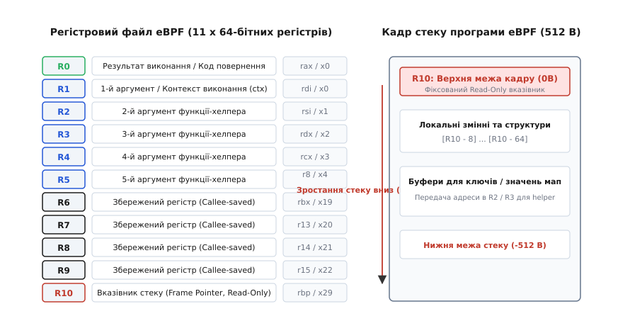
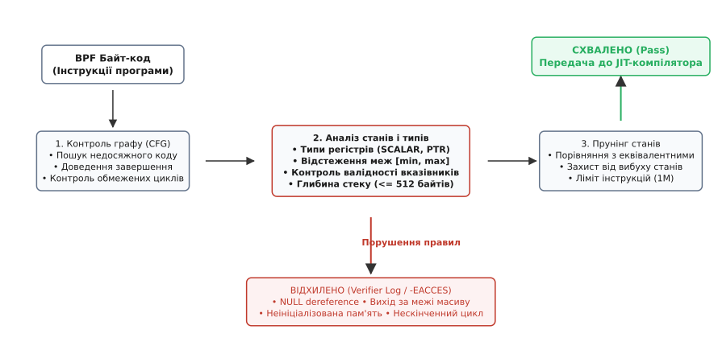
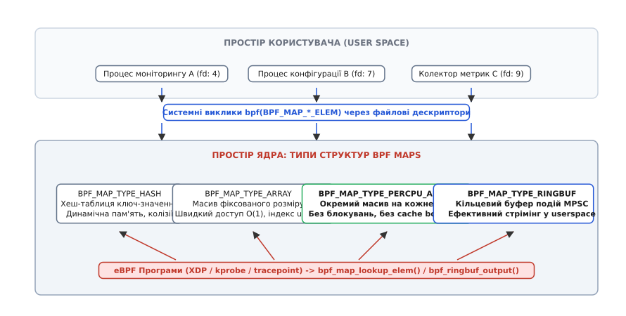

# eBPF: розширюваність ядра Linux, BPF Maps та верифікатор

<preknowlist>
- [Концепції ядра Linux](topic:sys-unix/kernel-and-userspace) — поділ просторів пам'яті, привілейований режим (ring 0) та обробка переривань.
- [Механіка системних викликів](topic:sys-unix/syscall-mechanics) — шлюз взаємодії між користувацьким процесом і ядром операційної системи.
- [Трасування ядра ftrace](topic:sys-unix/ftrace-kernel-tracing) — статичні точки перехоплення tracepoints та трампліни виклику функцій.
- [Динамічні зонди uprobes та kprobes](topic:sys-unix/uprobes-and-kprobes) — інструментування довільних інструкцій у коді ядра та процесів.
</preknowlist>

Коли операційна система обслуговує сотні тисяч мережевих пакетів на секунду або фіксує кожен системний виклик у навантаженому сервісі, спроба передати кожну подію у простір користувача для аналізу руйнує продуктивність системи. Кожен перехід межі між простором ядра (*kernel space*) та простором користувача (*user space*) вимагає збереження регістрів процесора, заміни таблиць сторінок віртуальної пам'яті, скидання кешів процесора (TLB) та копіювання буферів пам'яті. Утиліти діагностики, що спираються на класичний механізм налагодження `ptrace` або аудит через сокети Netlink, створюють настільки високі накладні витрати (*overhead*), що їхнє увімкнення під бойовим навантаженням сповільнює сервери у десятки разів або призводить до відмови в обслуговуванні.

Єдиним способом уникнути перемикання контекстів (*context*, від латинського *contextus* — з'єднання, зв'язок) є виконання аналітичного, безпекового чи мережевого коду безпосередньо всередині ядра Linux під час виникнення самої події. Технологія **eBPF** (*Extended Berkeley Packet Filter*) забезпечує таку можливість, перетворюючи монолітне ядро на динамічно програмовану платформу з математично доведеною безпекою виконання.

---

## 1. Архітектурна дилема: чому монолітне ядро потребувало безпечної віртуальної машини

Ядро Linux є монолітним (від грецького *monos* — один, та *lithos* — камінь): усі ключові підсистеми — планувальник процесів, віртуальна файлова система, мережевий стек і драйвери пристроїв — функціонують у єдиному адресному просторі з найвищим рівнем апаратних привілеїв процесора (*ring 0*). До появи eBPF інженер, якому було необхідно розширити поведінку ядра (наприклад, додати новий алгоритм фільтрації трафіку чи агрегувати затримки дискових операцій), мав лише два шляхи, кожен з яких створював критичні ризики.

```
Традиційні підходи до розширення ядра:

1. Пряма зміна вихідного коду ядра:
   [ Внесення патчів у vmlinux ] ---> [ Роки апстріму / Власні нестабільні форки ]

2. Завантажувані модулі (LKM - Loadable Kernel Modules):
   [ Сирці модуля C ] ---> [ insmod ] ---> [ Ring 0: Ризик Kernel Panic / Злам KABI ]

3. eBPF (Extended Berkeley Packet Filter):
   [ Байт-код C/Rust ] ---> [ In-Kernel Verifier ] ---> [ JIT ] ---> [ Безпечне виконання в Ring 0 ]
```

### Перший шлях: Пряме патчення вихідного коду ядра
Внесення змін до сирцевого коду `vmlinux` дозволяє реалізувати будь-яку логіку, але такий підхід непридатний для динамічних середовищ. Процес прийняття змін до офіційного дерева ядра (*upstream*) займає місяці або роки. Створення власних патчів змушує компанії підтримувати приватні збірки ядер, які ламаються під час кожного оновлення версії операційної системи через зміну внутрішніх структур даних ядра.

### Другий шлях: Завантажувані модулі ядра (LKM)
Завантаження модулів ядра за допомогою команди `insmod` є стандартним механізмом підключення драйверів. Модуль компілюється мовою C і виконується безпосередньо процесором у режимі *ring 0*. Проте використання LKM для моніторингу та безпеки несе дві непереборні загрози:
1. **Ризик повного краху системи (*Kernel Panic*)**: Модуль володіє абсолютним доступом до всієї фізичної пам'яті комп'ютера. Найменша помилка програміста — розіменування нульового вказівника (`NULL pointer dereference`), читання за межами виділеного буфера (*buffer overflow*), нескінченний цикл або взаємне блокування (*deadlock*) — негайно призводить до аварійної зупинки ядра. Один некоректний рядок коду діагностики виводить з ладу весь фізичний сервер.
2. **Відсутність стабільного внутрішнього двійкового інтерфейсу (*Kernel ABI*)**: Розробники Linux свідомо не підтримують стабільність внутрішніх структур даних між релізами. Структура завдання `struct task_struct` чи мережевого буфера `struct sk_buff` може змінити зміщення полів навіть у мінорному оновленні безпеки ядра дистрибутива. Модуль, скомпільований для ядра 6.1.20, призведе до пошкодження пам'яті під час завантаження в ядро 6.1.21.

### Альтернатива eBPF: Верифікований байт-код у пісочниці ядра
eBPF розв'язує цю дилему, пропонуючи архітектуру ізольованої віртуальної машини всередині самого ядра Linux. Програміст пише код високорівневою мовою (C або Rust), компілятор Clang/LLVM транслює його в компактний **BPF-байткод**, а ядро завантажує цей двійковий код через системний виклик `bpf(2)`.

Перш ніж байт-код отримає право виконатися бодай один раз, підсистема ядра — **Верифікатор (*Verifier*)** — здійснює математичне доведення того, що програма є абсолютно безпечною: вона гарантовано завершується, не містить нескінченних циклів, не звертається до неініціалізованої пам'яті, не виходить за межі виділених буферів і не здатна пошкодити структури операційної системи.

Після проходження верифікатора вбудований у ядро JIT-компілятор (*Just-In-Time Compiler*, від латинського *compilare* — збирати докупи) транслює інструкції BPF у нативний машинний код поточного процесора (x86_64 або ARM64). Програма починає виконуватися з максимальною апаратною швидкодією безпосередньо в обробниках переривань і точках трасування ядра.


*Архітектура завантаження та виконання програм eBPF: взаємодія між простором користувача, верифікатором ядра, JIT-компілятором та структурами пам'яті BPF Maps.*

Детальна історія появи першої версії Berkeley Packet Filter у 1992 році та її трансформації у сучасний eBPF наведена у вставці [📜 Еволюція BPF: від пакетного фільтра BSD до універсальної віртуальної машини ядра](topic:sys-unix/ebpf-verifier-internals-and-runtime-cost/hist-ebpf-vm-evolution.md).

---

## 2. Архітектура віртуального процесора eBPF

Віртуальна машина eBPF є 64-розрядною RISC-подібною архітектурою (*Reduced Instruction Set Computer*), спроєктованою спеціально для безшовного відображення на сучасні фізичні процесори загального призначення.

### 2.1. Регістровий файл та пряме апаратне відображення

Архітектура eBPF визначає 11 64-бітних регістрів (від пізньолатинського *registrum* — список, покажчик), позначених як `R0`–`R10`:

```
+--------------------------------------------------------------------------------+
| Регістр eBPF | Функціональна роль у BPF ISA            | x86_64 ABI | ARM64     |
|--------------+-----------------------------------------+------------+-----------|
| R0           | Результат виконання / Код виходу        | rax        | x0        |
| R1           | 1-й аргумент / Контекст виконання (ctx) | rdi        | x0        |
| R2           | 2-й аргумент виклику допоміжної функції | rsi        | x1        |
| R3           | 3-й аргумент виклику допоміжної функції | rdx        | x2        |
| R4           | 4-й аргумент виклику допоміжної функції | rcx        | x3        |
| R5           | 5-й аргумент виклику допоміжної функції | r8         | x4        |
| R6           | Збережений регістр (Callee-saved)       | rbx        | x19       |
| R7           | Збережений регістр (Callee-saved)       | r13        | x20       |
| R8           | Збережений регістр (Callee-saved)       | r14        | x21       |
| R9           | Збережений регістр (Callee-saved)       | r15        | x22       |
| R10          | Вказівник стеку (Read-Only Frame Ptr)   | rbp        | x29       |
+--------------------------------------------------------------------------------+
```

Кількість і семантика регістрів обрані не випадково: вони дзеркально відтворюють конвенцію викликів (*calling convention*) ABI процесорів x86_64 (System V AMD64 ABI) та ARM64 (AAPCS64). Коли JIT-компілятор ядра перетворює інструкцію eBPF на асемблерний код процесора, йому не потрібно реалізовувати складні механізми розподілу регістрів чи зберігати проміжні стани в оперативній пам'яті: регістр `R1` напряму стає регістром `rdi`, `R2` — `rsi`, а `R0` — `rax`. Це гарантує нульові накладні витрати на трансляцію.


*Регістровий файл eBPF R0-R10, їхнє відображення на апаратні регістри x86_64/ARM64 та організація фіксованого 512-байтного кадру стеку.*

### 2.2. Організація стеку та ліміти пам'яті

Кожна програма eBPF має власний фіксований стек розміром рівно **512 байтів**. Регістр `R10` вказує на вершину цього кадру стеку і є доступним виключно для читання (*read-only*): програма не має права змінювати значення самого `R10`, але може адресизувати локальні змінні зі знаковим від'ємним зміщенням відносно нього: `[R10 - 8]`, `[R10 - 16]`.

Жорсткий ліміт у 512 байтів встановлено тому, що стек самого ядра Linux має вкрай обмежений розмір (зазвичай 8 КБ або 16 КБ на весь потік ядра, константа `THREAD_SIZE`). Якщо дозволити eBPF-програмі виділяти кілобайти на стеку, виклик вкладених функцій ядра або обробка глибоких переривань призведе до переповнення стеку ядра (*kernel stack overflow*) та негайного зависання процесора.

> 🔧 **Навіщо це.**
> Обмеження стеку у 512 байтів вимагає, щоб будь-які великі структури даних (буфери рядків, вміст мережевих пакетів, масиви) зберігалися не на локальному стеку програми, а у спеціальних структурах ядра — **BPF Maps** — або виділялися через буфери `BPF_MAP_TYPE_PERCPU_ARRAY`.

### 2.3. Формат інструкцій eBPF ISA та арифметичні операції

Інструкція eBPF має фіксовану довжину 64 біти (8 байтів) і кодується структурою `struct bpf_insn`:

```text
struct bpf_insn:
  [ code: 8 bits ] [ dst_reg: 4 bits ] [ src_reg: 4 bits ] [ off: 16 bits ] [ imm: 32 bits ]
```

Набір інструкцій підтримує як 64-розрядні операції (`BPF_ALU64`), так і 32-розрядні операції (`BPF_ALU`). Під час виконання 32-розрядної операції верхні 32 біти 64-бітного цільового регістру автоматично обнуляються (*zero-extension*), що повністю збігається з поведінкою процесорів x86_64.

Для виклику підпрограм eBPF підтримує два механізми:
1. **BPF-to-BPF Functions (`BPF_CALL`)**: Дозволяє компілятору генерувати звичайні виклики функцій всередині програми з власним кадром стеку (загальна глибина вкладеності стеку обмежена 8 кадрами або сумарно 3584 байтами).
2. **Хвостові виклики (*Tail Calls*, `bpf_tail_call`)**: Дозволяють одній програмі eBPF передати керування іншій програмі без повернення, повністю замінюючи поточний контекст виконання. Для запобігання нескінченній рекурсії ядро жорстко обмежує глибину хвостових викликів до 33 переходів.

---

## 3. Верифікатор ядра (In-Kernel Verifier): механізм математичного доведення безпеки

Верифікатор (від латинського *verus* — істинний, та *facere* — робити) є найскладнішою і найважливішою підсистемою eBPF. Його завдання — проаналізувати завантажений байт-код і гарантувати, що виконання цієї програми в просторі ядра за будь-яких вхідних даних не може призвести до збою операційної системи.

Якщо верифікатор знаходить бодай один потенційно небезпечний шлях виконання, системний виклик `bpf(BPF_PROG_LOAD)` негайно повертає помилку `-EACCES` або `-EINVAL`, повертаючи розробнику детальний текстовий лог перевірки (*verifier log*).


*Поетапний процес роботи верифікатора eBPF: побудова графу потоку керування (CFG), симуляція станів та прунінг еквівалентних гілок.*

### 3.1. Побудова графу потоку керування (CFG) та контроль циклів

На першому етапі верифікатор будує орієнтований граф потоку керування (*Control Flow Graph*, CFG) програми:
1. **Перевірка недосяжного коду**: Кожна інструкція в програмі має бути досяжною з початкової інструкції. Наявність мертвого коду після безумовних стрибків відхиляється.
2. **Гарантія термінації (завершення)**: Програма ядра не може виконуватися нескінченно. Вона зобов'язана завершитися викликом інструкції `BPF_EXIT` (`R0 = return_value`).
3. **Контроль циклів**: Історично будь-які зворотні переходи (цикли) були категорично заборонені: граф мав бути строго ациклічним (DAG, *Directed Acyclic Graph*), а всі цикли мали повністю розгортатися компілятором під час збирання (`#pragma unroll`). Починаючи з ядра Linux 5.3, верифікатор підтримує обмежені цикли (*bounded loops*), але вимагає, щоб лічильник циклу мав статично доведені числові межі кроків, за яких кількість ітерацій гарантовано не перевищить ліміт складності.

### 3.2. Абстрактна інтерпретація та відстеження типів регістрів

Верифікатор не просто переглядає інструкції, а виконує віртуальну симуляцію виконання програми — **абстрактну інтерпретацію** (*abstract interpretation*, від латинського *abstractus* — витягнутий, відсторонений).

Під час запуску аналізу верифікатор ініціалізує стан регістрового файлу:
* `R1` отримує тип `PTR_TO_CTX` (вказівник на вхідний контекст ядра).
* `R10` отримує тип `PTR_TO_STACK` (вказівник на вершину кадру стеку).
* `R0` та `R2`–`R9` отримують тип `NOT_INIT`.

Для кожної точки програми верифікатор зберігає стан усіх 11 регістрів та кожного байта стеку. Кожен регістр має строго визначений внутрішній тип ядра `enum bpf_reg_type`:
* `NOT_INIT`: Регістр не ініціалізовано. Спроба прочитати значення з такого регістру призведе до негайної відмови верифікатора.
* `SCALAR_VALUE`: Регістр містить звичайне числове значення (ціле число, лічильник, бітова маска), що не є вказівником.
* `PTR_TO_CTX`: Вказівник на контекст виклику програми (наприклад, `struct __sk_buff` для мережі чи `struct pt_regs` для kprobe).
* `PTR_TO_STACK`: Вказівник на область локального стеку eBPF (`R10 + offset`).
* `PTR_TO_MAP_VALUE`: Вказівник на дані елемента BPF Map.
* `PTR_TO_MAP_VALUE_OR_NULL`: Вказівник, який може бути дійсним або містити `NULL` (наприклад, результат пошуку в хеш-таблиці).
* `PTR_TO_PACKET`: Вказівник на початок сирих мережевих даних пакета.
* `PTR_TO_PACKET_END`: Вказівник на кінець буфера мережевого пакета для контролю меж.

```
Еволюція стану регістру під час аналізу верифікатором:

1. R0 = bpf_map_lookup_elem(&my_map, &key);
   Стан R0: [ PTR_TO_MAP_VALUE_OR_NULL ]  <--- Пряме розіменування заборонено!

2. if (R0 == NULL) exit;
   Гілка True:  R0 = NULL  (перехід до виходу)
   Гілка False: R0 = [ PTR_TO_MAP_VALUE, id=1, off=0, smin=0, smax=1024 ]

3. R1 = *(u32 *)(R0 + 4);
   Стан: УСПІХ (Розіменування дозволено, бо перевірено на NULL і межі).
```

### 3.3. Відстеження меж діапазонів (Range Tracking) та розіменування вказівників

Найчастішою причиною падіння програм мовою C є вихід за межі масиву або розіменування `NULL`. Верифікатор відстежує мінімальні та максимальні можливі значення для кожного скаляра у 64-розрядному та 32-розрядному представленнях:
* `smin_value`, `smax_value`: 64-бітний знаковий діапазон можливих значень.
* `umin_value`, `umax_value`: 64-бітний беззнаковий діапазон можливих значень.
* `s32_min_value`, `s32_max_value`: 32-бітний знаковий піддіапазон.
* `u32_min_value`, `u32_max_value`: 32-бітний беззнаковий піддіапазон.
* `var_off`: відомі фіксовані нулі та одиниці в бітовій масці регістру (*tnum, tristate number*).

Коли програма здійснює умовний перехід, наприклад:
```text
if (len < 64) {
    /* Гілка A: umax_value = 63 */
} else {
    /* Гілка B: umin_value = 64 */
}
```
Верифікатор розгалужує симуляцію на дві незалежні гілки:
* У гілці `A` він фіксує для змінної `len` обмеження `umax_value = 63`.
* У гілці `B` він фіксує `umin_value = 64`.

Якщо далі в коді виконується читання буфера розміром 64 байти за індексом `len`, у гілці `A` доступ буде дозволено, оскільки максимальне зміщення 63 є меншим за 64. У гілці `B` верифікатор заблокує програму, оскільки `len` може перевищувати розмір буфера.

Аналогічно працює прямий доступ до мережевих пакетів у драйвері XDP:
```text
void *data = (void *)(long)ctx->data;
void *data_end = (void *)(long)ctx->data_end;
if (data + sizeof(struct ethhdr) > data_end)
    return XDP_DROP;
/* Після цієї перевірки читання Ethernet-заголовка дозволено */
```

### 3.4. Захист від атак спекулятивного виконання (Spectre)

Верифікатор ядра містить спеціальні евристики для захисту від вразливостей побічних каналів спекулятивного виконання процесорів (Spectre Variant 1 та Variant 2):
* **Засліплення констант (*Constant Blinding*)**: Усі 32- та 64-бітні константи в коді програми випадково маскуються операціями XOR з псевдовипадковими числами під час JIT-компіляції, щоб зловмисник не міг сформувати корисне навантаження спекулятивних гаджетів (ROP/JOP) у виконуваній пам'яті ядра.
* **Спекулятивні бар'єри**: Якщо регістр використовується як індекс масиву, верифікатор санітизує вказівник або вставляє інструкції зупинки спекуляції (`lfence` на x86), гарантуючи, що спекулятивний вихід за межі масиву не дозволить викрасти дані з кешу процесора.

### 3.5. Прунінг станів та захист від вибуху складності

При великій кількості розгалужень кількість можливих шляхів зростає експоненційно (`2ⁿ`). Щоб перевірка не тривала вічно, верифікатор застосовує **прунінг станів** (*state pruning*).

Коли верифікатор досягає певної інструкції, він порівнює поточний стан регістрів із записами станів, які вже були успішно перевірені в цій точці раніше. Якщо поточний стан є *підмножиною* (еквівалентним або більш строгим) раніше перевіреного безпечного стану, верифікатор негайно зараховує цю гілку як успішну і переходить до наступної.

У сучасних ядрах Linux загальний ліміт складності становить **1 000 000 перевірених інструкцій** (у ядрах до 5.2 ліміт становив 4096 або 131072 інструкції).

---

## 4. Збереження стану та обмін даними: BPF Maps

Програми eBPF є за своєю природою реактивними обробниками подій (*event-driven*): вони викликаються на короткий час під час настання переривання або виклику функції ядра і не зберігають глобальних змінних між викликами.

Для збереження накопичувального стану (лічильників, таблиць з'єднань, гістограм) та передачі інформації між ядром і процесами простору користувача використовуються **BPF Maps** — структури даних загального призначення, пам'ять під які виділяється ядром Linux.


*Модель пам'яті BPF Maps: зв'язок між дескрипторами процесів користувача та різними типами структур даних у ядрі.*

### 4.1. Основні типи карт пам'яті BPF

Ядро Linux надає понад 30 різних типів карт (`enum bpf_map_type`), основними з яких є:

```
+--------------------------------------------------------------------------------+
| Тип карти                 | Організація пам'яті       | Характерне застосування |
|---------------------------+---------------------------+-------------------------|
| BPF_MAP_TYPE_HASH         | Хеш-таблиця ключ-значення | Стан за PID, IP-адресою |
| BPF_MAP_TYPE_ARRAY        | Масив фіксованої довжини  | Метрики за індексом CPU |
| BPF_MAP_TYPE_PERCPU_HASH  | Окрема хеш-таблиця на CPU | Високонавантажені події |
| BPF_MAP_TYPE_PERCPU_ARRAY | Окремий масив на кожне CPU| Гістограми без блокувань|
| BPF_MAP_TYPE_LRU_HASH     | Хеш-таблиця з LRU-викидом | Мережеві кеші сесій     |
| BPF_MAP_TYPE_RINGBUF      | Кільцевий буфер подій     | Потокова передача подій |
| BPF_MAP_TYPE_ARENA        | Спільна пам'ять (mmap)    | Рідні вказівники C/C++  |
+--------------------------------------------------------------------------------+
```

1. **`BPF_MAP_TYPE_HASH`**: Універсальна хеш-таблиця з фіксованим або динамічним виділенням елементів. Дозволяє використовувати як ключ будь-яку довільну двійкову структуру (наприклад, 4-кортеж TCP-з'єднання `IP_src, IP_dst, port_src, port_dst`).
2. **`BPF_MAP_TYPE_ARRAY`**: Швидкий масив фіксованого розміру з числовим індексом від `0` до `max_entries - 1`. Доступ до елемента виконується за сталий час `O(1)` за допомогою прямого зміщення пам'яті. Елементи масиву неможливо видалити — їх можна лише перезаписувати.
3. **`BPF_MAP_TYPE_PERCPU_ARRAY` / `PERCPU_HASH`**: Створює окрему незалежну область пам'яті для кожного логічного ядра процесора (*per-CPU structure*). Коли eBPF-програма оновлює лічильник, вона модифікує комірку свого локального ядра CPU без використання апаратних атомарних інструкцій шини процесора (`LOCK CMPXCHG`) і без конфлікту кеш-ліній процесора (*cache line bouncing*). Простір користувача при читанні отримує масив значень від усіх ядер і самостійно підсумовує їх.
4. **`BPF_MAP_TYPE_RINGBUF`**: Високоефективний кільцевий буфер пам'яті формату MPSC (*Multi-Producer Single-Consumer*), розроблений для заміни застарілого `PERF_EVENT_ARRAY`. Він виділяє єдину сторінку пам'яті ядра, куди ядра процесорів записують структуровані події, а процес користувача зчитує їх без необхідності системного копіювання даних та без блокування пам'яті.
5. **`BPF_MAP_TYPE_ARENA` (Linux 6.9+)**: Розріджена спільна область пам'яті, що відображається в адресний простір eBPF і простору користувача з підтримкою рідних 64-бітних вказівників (`void *`). Це дозволяє будувати складні динамічні структури даних (дерева, списки), спільні між ядром та користувацькими процесами, без накладних витрат на серіалізацію через системні виклики.

Детальний довідник системних викликів, прапорців та структур BPF Maps доступний у вставці [📋 Інтерфейс системного виклику BPF Maps: структури, команди та операції](topic:sys-unix/ebpf-verifier-internals-and-runtime-cost/api-bpf-maps.md).

### 4.2. Конкурентність та синхронізація у BPF Maps

Оскільки програми eBPF можуть одночасно виконуватися на десятках процесорних ядер у паралельних потоках обробки переривань, безпека паралельного доступу забезпечується трьома механізмами:
1. **RCU (Read-Copy Update)**: Усі операції пошуку в картах eBPF виконуються під захистом RCU ядра Linux. Це гарантує, що читання ніколи не блокується операціями запису, а видалена пам'ять не звільняється, доки обробник не завершить виконання.
2. **Вбудовані атомарні операції**: Програми можуть використовувати інструкції `bpf_atomic_add()`, `__sync_fetch_and_add()` або порівняння з обміном для безпечного оновлення лічильників.
3. **`bpf_spin_lock`**: Для складних структур даних ядро дозволяє розміщувати блокування спинлоку безпосередньо всередині структури значення карти BPF. Верифікатор жорстко контролює, щоб блокування завжди звільнялося перед завершенням роботи програми eBPF.

---

## 5. Допоміжні функції ядра (BPF Helpers) та переносимість CO-RE

Програма eBPF принципово не має права викликати довільні функції ядра через вказівники на функції (це могло б порушити безпеку або обійти верифікатор).

Замість цього розробники ядра створили строго контрольований набір шлюзів — **BPF Helper Functions**.

```text
Базові функції-хелпери ядра:
• bpf_ktime_get_ns()       — Отримання точного монотонного часу ядра
• bpf_get_current_pid_tgid()— Отримання 64-бітного комбінованого TGID/PID
• bpf_get_current_comm()   — Отримання імені виконуваного файлу процесу
• bpf_probe_read_kernel()  — Безпечне читання з довільних структур пам'яті ядра
• bpf_probe_read_user()    — Безпечне читання з адресного простору процесу
• bpf_ringbuf_output()     — Запис структурованої події в кільцевий буфер
```

Кожен тип програми eBPF має доступ лише до дозволеного для нього переліку хелперів (наприклад, програма мережевого фільтра XDP не може викликати функції завершення процесу, а програма трасування не має права модифікувати мережеві пакети).

### Проблема переносимості та еволюція CO-RE (Compile Once – Run Everywhere)

Історично для компіляції BPF-програм на цільовому сервері вимагалося встановлювати повний пакет вихідних кодів ядра (`kernel-headers` чи `kernel-devel`), що важив сотні мегабайтів. Під час кожного запуску інструмент компілював код заново за допомогою Clang.

Для подолання цієї проблеми інженери ядра створили екосистему **CO-RE** (*Compile Once – Run Everywhere*), що спирається на три технології:
1. **BTF (BPF Type Format)**: Компактний двійковий формат метаданих, що містить повний опис усіх типів, структур, полів та зміщень ядра. Файл `/sys/kernel/btf/vmlinux` займає лише кілька мегабайтів і вбудований у ядро.
2. **`vmlinux.h`**: Автоматично згенерований єдиний заголовочний файл, що містить усі структури ядра без необхідності підключати стандартні заголовки Linux.
3. **Clang BPF Relocations**: Компільований об'єктний файл ELF містить спеціальні секції переміщень. Коли бібліотека `libbpf` завантажує програму на конкретній машині, вона читає BTF поточного ядра і автоматично підправляє зміщення полів у байт-коді eBPF відповідно до структур працюючого ядра.

```
Схема роботи технології CO-RE (Compile Once - Run Everywhere):

[ Машина розробника ]
  Сирці C + vmlinux.h ---> [ Clang -target bpf ] ---> [ openat.bpf.o з CO-RE Relocations ]
                                                               |
                                            (Єдиний двійковий артефакт)
                                                               v
[ Цільовий сервер (будь-яке ядро з BTF) ]
  /sys/kernel/btf/vmlinux + libbpf ---> Патчинг зміщень полів під поточне ядро ---> sys_bpf()
```

Макрос `BPF_CORE_READ(task, parent, pid)` під час виконання генерує ланцюжок безпечних читань з урахуванням зміщень конкретного ядра, усуваючи будь-яку нестабільність KABI.

---

## 6. Точки прикріплення, підсистеми ядра та керування через bpf_link

eBPF інтегрований практично у всі ключові підсистеми ядра Linux за допомогою спеціалізованих типів програм:

```
+------------------------------------------------------------------------------------+
| Тип програми eBPF     | Точка спрацьовування       | Сфера використання            |
|-----------------------+----------------------------+-------------------------------|
| BPF_PROG_TYPE_XDP     | Драйвер мережевої карти    | Захист від DDoS, L4 балансир  |
| BPF_PROG_TYPE_SCHED_CLS| Стековий класифікатор TC  | Маршрутизація, шейпінг трафіку|
| BPF_PROG_TYPE_KPROBE  | Довільна інструкція ядра   | Динамічне трасування ядра     |
| BPF_PROG_TYPE_TRACEPOINT| Статична точка ftrace    | Стабільний моніторинг syscalls|
| BPF_PROG_TYPE_TRACING | fentry / fexit трампліни   | Надвисокошвидкісне трасування |
| BPF_PROG_TYPE_LSM     | Хуки безпеки Linux LSM     | Політики доступу та безпека   |
| BPF_PROG_TYPE_CGROUP_*| Операції контрольної групи | Ізоляція мережі в контейнерах |
| BPF_PROG_TYPE_STRUCT_OPS| Таблиці операцій ядра    | Власні планувальники Sched-ext|
+------------------------------------------------------------------------------------+
```

### Механізм `bpf_link` та надійність життєвого циклу
Історично прив'язка програми eBPF до точки трасування здійснювалася через старі дескриптори `perf_event_open`. Якщо процес-власник аварійно завершувався або зависав, зонди могли залишатися активними в ядрі назавжди, марнуючи процесорні цикли.

У сучасному ядрі Linux введено абстракцію **`bpf_link`** (`sys_bpf(BPF_LINK_CREATE)`). Вона пов'язує завантажену програму eBPF із точкою прикріплення в єдиний атомарний об'єкт ядра, представлений файловим дескриптором у просторі користувача. Коли процес закриває цей дескриптор (або процес завершується операційною системою), ядро автоматично та безпечно від'єднує програму eBPF і звільняє всі виділені ресурси без ризику витоків.

### Інструменти діагностики: утиліта `bpftool`
Для інспекції завантажених у ядро об'єктів eBPF використовується стандартна утиліта `bpftool`:
* `bpftool prog list` — перегляд списку всіх завантажених у системі програм eBPF, їхніх ID, типів та часу виконання.
* `bpftool prog dump jited id <ID>` — перегляд реального машинного асемблерного коду, згенерованого JIT-компілятором ядра для цієї програми.
* `bpftool map list` та `bpftool map dump id <ID>` — інспекція та вивантаження вмісту карт BPF у реальному часі.

Повний цикл написання, компіляції, завантаження та вичитування подій трасувальника системних викликів наведено у вставці [⚙️ Практична реалізація моніторингу затримки системних викликів на eBPF](topic:sys-unix/ebpf-verifier-internals-and-runtime-cost/proj-ebpf-latency-tracker.md).

---

## 7. Ціна виконання, затримки та безпекові межі

eBPF не є універсальною заміною модулів ядра або процесів простору користувача. Його використання визначається строгими фізичними та архітектурними компромісами.

```
+-------------------------------------------------------------------------------+
| Механізм перехоплення   | Накладні витрати на подію   | Затримка на виклик    |
|-------------------------+-----------------------------+-----------------------|
| ptrace / gdb            | 2 context switches + signal | ~1000 - 5000 нс       |
| kprobe (int3 / ftrace)  | Trap / breakpoint overhead  | ~80 - 150 нс          |
| fentry / fexit (trampo) | Прямий асемблерний call     | ~10 - 25 нс           |
| Raw Tracepoint          | Статичний виклик в ядрі     | ~5 - 12 нс            |
| XDP (Драйвер мережі)    | Пряме виконання над DMA     | < 5 нс на пакет       |
+-------------------------------------------------------------------------------+
```

### Де eBPF має абсолютну перевагу:
* **Низькорівнева спостережуваність (*Observability*)**: Збір точних мікросекундних метрик роботи блокових пристроїв, мережевих черг, блокувань м'ютексів та планувальника завдань без впливу на продуктивність цільових процесів.
* **Високопродуктивна фільтрація та маршрутизація (*XDP / TC*)**: Відхилення DDoS-атак зі швидкістю понад 20 мільйонів пакетів на секунду на один процесорний потік шляхом обробки пакетів безпосередньо у драйвері мережевої карти до виділення структури `sk_buff`.
* **Динамічна безпека (*BPF LSM*)**: Створення контекстних політик безпеки (наприклад, заборона відкриття мережевих сокетів процесам, що читають конфіденційні файли), які перевіряються безпосередньо в хуках підсистеми Linux Security Modules.

### Межі застосування eBPF:
1. **Неможливість блокуючих операцій**: Більшість програм eBPF виконуються в контексті переривань або критичних секцій RCU, де процесу категорично заборонено переходити в стан сну (*sleep*), очікувати введення-виведення чи виділяти пам'ять, що може викликати блокування (*Sleepable BPF* з'явився у ядрі 5.10 лише для обмежених типів зондів LSM та fentry).
2. **Складність алгоритмів**: Програми зі складною рекурсією, динамічними графами змінної довжини або нетривіальними структурами даних не пройдуть перевірку верифікатора.
3. **Обмеження модифікації стану**: eBPF-програми моніторингу мають право лише читати пам'ять ядра через `bpf_probe_read_kernel`, але не можуть довільно змінювати внутрішні змінні ядра операційної системи, що гарантує цілісність ядра Linux.
