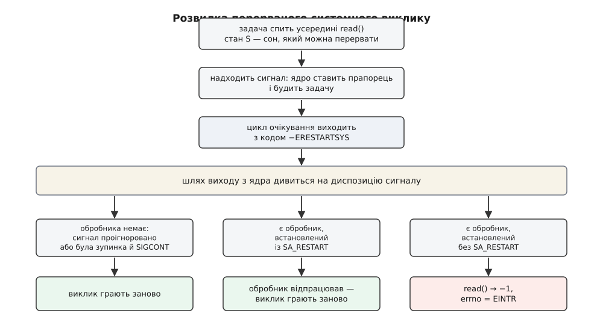
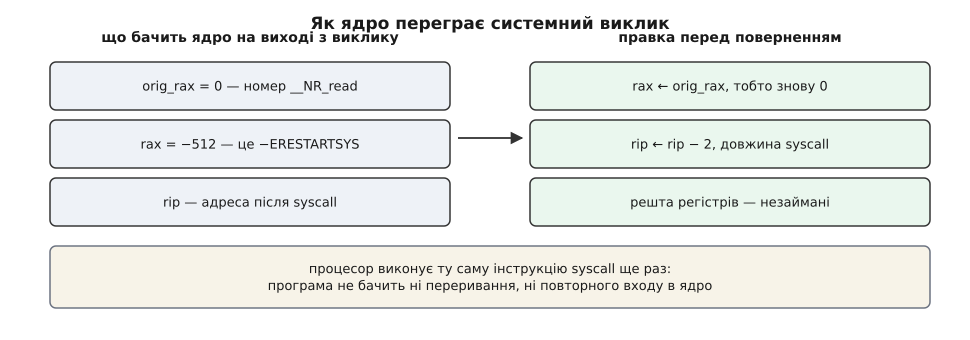
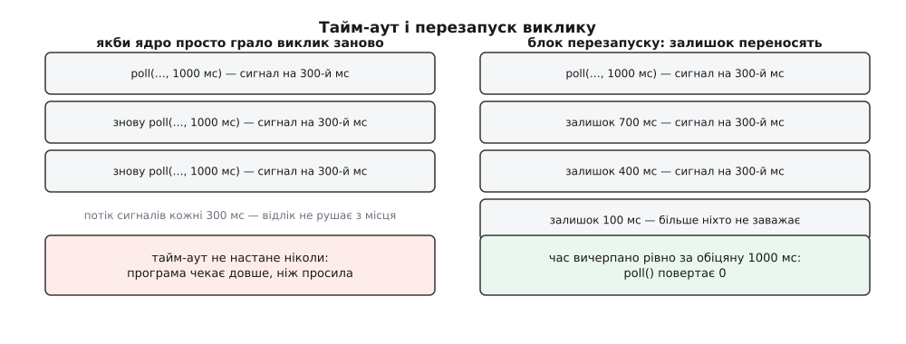

# EINTR: перервані виклики й перезапуск

<preknowlist>
- [Системний виклик](root:sys-unix/syscall-mechanics) — як програма переходить межу в ядро й дістає назад або результат, або код помилки в `errno`.
- [Сигнал](root:sys-unix/signal-model) — асинхронне сповіщення процесу: ядро запам'ятовує його й доставляє на найближчому виході в простір користувача.
- [Диспозиція сигналу](root:sys-unix/signal-disposition) — що процес призначив сигналові: власний обробник, ігнорування або типову дію.
- [Стани процесу](root:sys-unix/process-states) — стан S (сон, який можна перервати) і стан D (сон, якого перервати не можна).
- [Черги очікування в ядрі](root:sys-unix/kernel-wait-queues) — структура, у якій задача реєструє «розбудіть мене, коли станеться подія», і функції пробудження.
- [Блокуючий і неблокуючий режим](root:sys-unix/blocking-and-nonblocking) — чи чекає виклик на дані всередині ядра, чи одразу повертає `EAGAIN`.
- [Файловий дескриптор](root:sys-unix/file-descriptor) — маленьке число, яким процес називає ядру вже відкритий сокет, канал чи файл.
</preknowlist>

Програма читає рядок з термінала: викликала `read` і чекає, поки людина щось надрукує. Поки вона чекає, людина замість друку розтягує вікно. Система хоче про це сповістити — програма ж сама попросила: «як розмір зміниться, поклич ось цю мою функцію».

Функція лежить у просторі користувача, у самій програмі, і виконати її може тільки сам процес. А процес зараз спить усередині ядра, посеред незавершеного `read`. Щоб виконати обробник, він мусить опинитися в просторі користувача; щоб опинитися там — мусить вийти з ядра. А вийти з ядра посеред виклику просто так не можна: системний виклик має рівно дві відповіді — результат або помилка, і жодної форми «я ще не закінчив, продовжу потім».

Отже, вибір неминучий, і він невеликий: або відповісти програмі «мене перервали», або зіграти виклик заново — так, щоб програма нічого не помітила. Обидві відповіді в Unix існують, і обидві потрібні. Уся тема — про те, коли яку обирають і чому вибір узагалі не можна віддати на відкуп програмі.

## Чому сон узагалі можна перервати

Спочатку — чому обірваний виклик взагалі трапляється. Здавалося б, простіше дати задачі доспати: сигнал зачекає, доки дані прийдуть.

Не зачекає, і причина проста. Дані можуть не прийти ніколи. Співрозмовник на іншому кінці сокета мовчить, термінал порожній, канал ніхто не пише. Якби сон усередині `read` був недоторканним, то процес, який чекає на те, чого не буде, став би невбиваним: ані `SIGTERM`, ані `SIGKILL` до нього не дійшли б, бо доставляють сигнали лише на межі виходу з ядра, а до неї він не дійде.

Тому ядро розрізняє два сни. У стані `TASK_INTERRUPTIBLE` — той самий `S` у виводі `ps` — задача згодна, щоб її розбудили не тільки даними, а й сигналом. У стані `TASK_UNINTERRUPTIBLE` (`D`) — не згодна, і туди ядро кладе задачу лише там, де прокинутися посеред операції небезпечно для узгодженості даних, наприклад на короткому проміжку роботи з блоковим пристроєм. Довге очікування на дані — це завжди сон, який можна перервати; саме тому програму, що зависла на мережі, можна вбити, а програму, що застрягла в `D`, — ні.

Механіка пробудження тут та сама, що й для звичайних даних. Той, хто надсилає сигнал, ставить його в чергу сигналів адресата, зводить прапорець `TIF_SIGPENDING` і будить задачу. Задача прокидається всередині циклу очікування, перевіряє свою умову — байтів немає — і перевіряє прапорець сигналу. Прапорець зведено, тож цикл виходить, і виходить він не з результатом, а з кодом «мене перервали».

## Код, якого програма ніколи не бачить

Цей код — не `EINTR`. Усередині ядра підсистема повертає одне зі значень, яких у просторі користувача не існує взагалі: `ERESTARTSYS` (512), `ERESTARTNOINTR` (513), `ERESTARTNOHAND` (514) або `ERESTART_RESTARTBLOCK` (516). Кожне з них — не помилка, а вказівка тому шарові, який виводитиме процес із ядра: ось як саме з цим викликом можна повестися.

Різниця між ними — це різниця в тому, наскільки виклик готовий до повторення:

- `ERESTARTSYS` — «переграй, якщо дозволяє диспозиція сигналу»; це відповідь `read` на сокеті, `wait`, `flock`, блокуючого `open`;
- `ERESTARTNOINTR` — «переграй завжди, хай там що»; так поводиться, наприклад, обірваний `fork` — віддавати `EINTR` за операцію, яка не має жодного часткового стану, немає сенсу;
- `ERESTARTNOHAND` — «переграй лише якщо обробник не запускався»; це `pause` і `sigsuspend`, у яких сам факт запуску обробника і є тим результатом, на який чекали;
- `ERESTART_RESTARTBLOCK` — «переграй через окремий виклик, який дорахує час»; про нього — далі.

Жодне з цих чисел не потрапляє в `errno`. Вони живуть рівно від виходу з підсистеми до шару обробки сигналів, і саме там перетворюються або на повторний запуск, або на `EINTR` — звичайну помилку номер 4.



*Розвилка одна на всі перервані виклики: рішення ухвалює не той, хто чекав, а той, хто виводить процес у простір користувача.*

Рішення на цій розвилці залежить від диспозиції сигналу. Обробника немає — сигнал ігнорують, або він лише зупинив процес, — виклик переграють мовчки. Обробник є і встановлений із прапорцем `SA_RESTART` — обробник відпрацьовує, після чого виклик переграють. Обробник є, але `SA_RESTART` не поставили — програма дістає `-1` і `errno == EINTR`.

Прапорець `SA_RESTART` — не косметика й не сучасна зручність, а слід давнього розколу: System V віддавав `EINTR` завжди, 4.2BSD 1983 року почав деякі виклики перезапускати сам, і POSIX довелося мирити дві несумісні звички ([як Unix посварився через перезапуск](root:sys-unix/eintr-and-restart/hist-restart-wars.md) — 4.1BSD і System V віддавали `EINTR`, 4.2BSD ввів автоматичний перезапуск для `read`, `write`, `ioctl`, `wait` і кількох інших, 4.3BSD додав `siginterrupt`, щоб це вимикати, а POSIX залишив обидві поведінки під прапорцем `SA_RESTART`; звідси й те, що glibc-івський `signal()` мовчки дає BSD-семантику).

## Як виглядає «зіграти заново»

Переграти виклик означає буквально виконати ту саму машинну інструкцію ще раз. На x86-64 вхід у ядро робить двобайтова інструкція `syscall`, номер виклику лежить у регістрі `rax`, і ядро при вході зберігає його копію в `orig_rax`. Коли підсистема повернула `-ERESTARTSYS`, а диспозиція дозволила перезапуск, шар обробки сигналів робить дві правки в збереженому стані процесу: кладе назад `rax = orig_rax` і зменшує лічильник команд на два байти — рівно на довжину `syscall`.



*Уся механіка перезапуску — це відкручений на одну інструкцію лічильник команд і відновлений номер виклику; аргументи виклику лежать у своїх регістрах незаймані.*

Далі процес повертається в простір користувача, натрапляє на ту саму інструкцію `syscall` — і входить у ядро вдруге, з тими самими аргументами. Для програми між двома входами не сталося нічого: та сама точка коду, ті самі змінні, той самий буфер.

Побачити це збоку можна — і це найкоротший спосіб переконатися, що механіка саме така. Трасувальник стоїть на межі ядра, тобто до розвилки, і показує внутрішній код таким, яким його повернула підсистема: у виводі `strace` перерваний виклик виглядає як `read(0, ...) = ? ERESTARTSYS (To be restarted if SA_RESTART is set)`, далі йде рядок про доставлений сигнал, а за ним — той самий `read` із тими самими аргументами вдруге. Сама програма між цими двома рядками не виконала жодної своєї інструкції.

Через це перезапуск і працює лише для викликів, аргументи яких повністю описують те, що треба зробити. Якщо результат залежить від того, скільки часу вже минуло, повторення з тими самими аргументами дає неправильну відповідь — і ось тут ідилія закінчується.

## Годинник, який не можна відмотати

Візьмімо `poll(fds, n, 1000)` — «чекай на готовність, але не довше секунди». Виклик проспав 300 мс, надійшов сигнал, обробник відпрацював, ядро відкрутило лічильник команд — і `poll` починається спочатку з тайм-аутом 1000 мс. Якщо сигнали надходять кожні 300 мс (а таймер, що цокає тричі на секунду, — річ буденна), програма не побачить тайм-ауту ніколи. Прохання «не довше секунди» перетвориться на «скільки завгодно».



*Наївний перезапуск ламає саме ту обіцянку, заради якої тайм-аут і задавали.*

Тому Linux для таких викликів прозорого перезапуску не робить узагалі. Незалежно від `SA_RESTART` завжди повертають `EINTR`: `select`, `pselect`, `poll`, `ppoll`, `epoll_wait`, `epoll_pwait`; усі різновиди сну — `nanosleep`, `clock_nanosleep`, `sleep`, `usleep`; очікування сигналу — `pause`, `sigsuspend`, `sigwaitinfo`, `sigtimedwait`; черги й семафори System V — `msgrcv`, `msgsnd`, `semop`, `semtimedop`; `io_getevents`; а також будь-яка операція на сокеті, якому виставили `SO_RCVTIMEO` чи `SO_SNDTIMEO` — той самий `recv`, який без тайм-ауту чудово перезапускається.

Зверніть увагу, що це за перелік. Це не екзотика — це рівно ті виклики, на яких стоїть цикл подій будь-якого сервера. Точка, у якій програма чекає на сотні дескрипторів одразу, за побудовою є точкою, де перезапуску не буде.

> 🔧 **Навіщо це.** Звідси береться найпоширеніша помилка в серверному коді: розробник ставить `SA_RESTART` і вважає, що `EINTR` більше не існує. Для `read` на сокеті це справді так. Для `epoll_wait`, навколо якого крутиться весь сервер, — ні: він поверне `-1` з `EINTR` від першого ж `SIGCHLD` завершеного дочірнього процесу. Цикл, який трактує `-1` як фатальну помилку й виходить, помре не під навантаженням і не на дивному пакеті, а тоді, коли хтось зупинить процес із термінала й відпустить. Точний перелік того, що перезапускається і що ні, зібрано окремо ([що перезапускається, а що завжди дає EINTR](root:sys-unix/eintr-and-restart/api-restart-matrix.md) — таблиця викликів за трьома групами, поведінка `SA_RESTART` і `siginterrupt`, макрос `TEMP_FAILURE_RETRY`, окремий випадок `close`).

## Блок перезапуску: коли час усе-таки вміють дорахувати

Проте є випадок, коли віддати `EINTR` неможливо, а перезапустити треба. Сигнали `SIGSTOP` і `SIGTSTP` зупиняють процес, `SIGCONT` його відпускає — і жодного обробника при цьому не запускається. Програма, яка не встановлювала обробників і не збиралася бачити `EINTR`, після натиснутого користувачем `Ctrl+Z` і наступного `fg` дістала б помилку нізвідки.

Для цих випадків ядро тримає **блок перезапуску** — невеличку структуру в дескрипторі задачі, куди виклик перед виходом складає свій недороблений стан: передусім момент, до якого він мав чекати. Підсистема повертає `ERESTART_RESTARTBLOCK`, і ядро переграє виклик не як його самого, а як службовий `restart_syscall` — виклик без обгортки в libc, який програма ніколи не викликає сама. Той дістає з блоку збережений строк, перераховує залишок і засинає вже на нього. Так працюють `nanosleep`, `clock_nanosleep`, `futex` з очікуванням і — з ядра 2.6.24 — `poll`.

Там, де ядро дорахувати залишок не може, це подекуди робить бібліотека — і робить чесно, не ховаючи факту переривання. Класичний приклад — `sleep`: перерваний сигналом, він не спить далі й не повертає помилки, а віддає **кількість секунд, які лишилися недоспаними**. Нуль означає «доспав». Програма, яка ігнорує це число й вважає, що після `sleep(60)` минула хвилина, помиляється рівно на стільки, скільки з'їв сигнал.

Виходить симетрія: прозоро переграти можна або виклик без годинника (відмотавши лічильник команд), або виклик, який уміє зберегти свій дедлайн (через блок перезапуску). Виклик із годинником, але без збереженого стану, переграти прозоро не можна взагалі — залишається `EINTR`.

## Третя відповідь: частина роботи

Досі ми говорили, ніби відповідей дві. Насправді є третя, і вона важливіша за перші дві разом, бо трапляється частіше.

Правило таке: якщо на момент переривання виклик уже щось передав, він не повертає ані помилки, ані перезапуску — він повертає передане. `read`, що встиг скопіювати 300 байтів із запитаних 4096, поверне `300`. `write`, що встиг віддати 8 КіБ із 64, поверне `8192`. Інакше й не можна: байти вже пішли з буфера сокета, повторити виклик означало б прочитати їх удруге або записати вдруге.

Наслідок для коду сильніший, ніж здається. Обробити `EINTR` мало — цикл, який перезапускає виклик тільки на помилці, спокійно втратить решту 3796 байтів і навіть не помітить. Правильний цикл рахує передане й повторює доти, доки не набереться потрібна кількість або доки не станеться справжня помилка. Це, до речі, той самий цикл, який потрібен і зовсім без сигналів: короткий результат буває й від переповненого буфера сокета, і від каналу.

> 🔧 **Навіщо це.** Мережевий код, який ігнорує короткі результати, ламається не одразу: на локальному хості й малих повідомленнях `write` майже завжди віддає все за раз. Проблема виявляється в бою, на великому повідомленні й повільному клієнті, і виглядає як «протокол поламався, повідомлення обрізане» — за кілометр від справжньої причини.

## EINTR без жодного обробника

Ще одна тонкість, на яку легко натрапити: у Linux деякі виклики повертають `EINTR` після зупинки й `SIGCONT` навіть тоді, коли в програмі не встановлено жодного обробника. Це стосується `epoll_wait`, `semop`, `sigtimedwait` і операцій на сокеті з виставленим тайм-аутом. Поведінка не передбачена POSIX і на інших системах не трапляється, але в Linux вона є, і причина та сама, що й вище: цим викликам нема куди подіти свій годинник.

Практичний висновок один: припущення «я не ставив обробників, отже `EINTR` неможливий» хибне. Достатньо, щоб програму хтось зупинив із термінала, або щоб до неї під'єднався налагоджувач ([ptrace](root:sys-unix/ptrace-model) — механізм, яким `strace` і `gdb` перехоплюють процес; зупинка під трасуванням для сплячого виклику виглядає так само, як зупинка сигналом).

## Що з цим робить програма

Найпростіший випадок — просто повторити виклик. У glibc для цього є макрос `TEMP_FAILURE_RETRY`, але писати цикл руками не важче, і в ньому одразу видно, що саме робиться:

```c
ssize_t write_all(int fd, const void *buf, size_t len) {
    const char *p = buf;
    size_t left = len;
    while (left > 0) {
        ssize_t n = write(fd, p, left);
        if (n < 0) {
            if (errno == EINTR) continue;   /* перервали — просто ще раз */
            return -1;                      /* справжня помилка */
        }
        p += n;                             /* віддали менше, ніж просили */
        left -= (size_t) n;
    }
    return (ssize_t) len;
}
```

Тут в одному циклі закрито обидва випадки: `EINTR` веде на новий оберт без зсуву покажчика, а короткий результат — на новий оберт зі зсувом. Розгорнутий набір таких обгорток — разом із циклом подій, що переживає `EINTR`, і з тайм-аутом на сигналі — зібрано окремо ([правильні обгортки навколо перерваних викликів](root:sys-unix/eintr-and-restart/proj-retry-right.md) — `read_all`/`write_all`, стійкий до `EINTR` цикл на `epoll_wait`, тайм-аут через `SIGALRM` і перевірка всього цього під штучним потоком сигналів).

І одне місце, де повторювати категорично не можна: `close`. У Linux дескриптор закривають до того, як виклик може повернути `EINTR`, тож повторний `close` закриє вже не той файл — а якщо між викликами інший потік устиг відкрити щось нове й дістати той самий номер, то закриє чужий дескриптор. Помилку `close` варто зафіксувати в журналі, але не виправляти повтором. Це не деталь реалізації, а розбіжність стандартів: POSIX.1-2024 узаконив протилежну поведінку HP-UX, де дескриптор лишається відкритим і повтор обов'язковий, — і Linux свідомо лишився при своєму.

## Куди це веде

Найцікавіше в `EINTR` те, що його можна не терпіти, а використовувати. Якщо навмисно **не** ставити `SA_RESTART` і завести таймер на `SIGALRM`, то будь-який блокуючий виклик дістає тайм-аут задарма: сигнал прийде, обробник відпрацює, виклик поверне `EINTR`. Прийом старий і в однопотоковій програмі досі робочий.

Але в ньому сидять перегони, які й пояснюють, чому сучасні програми пішли іншим шляхом. Обробник сигналу може відпрацювати за мить **до** входу у виклик: прапорець «час вийшов» він виставить, а переривати вже нема чого — виклик тільки-но починається й спокійно засинає назавжди. Проміжок між перевіркою прапорця і входом у ядро закрити з простору користувача неможливо ([що взагалі можна робити в обробнику сигналу](root:sys-unix/async-signal-safety) — обробник виконується посеред довільної точки програми, тож звідти безпечно робити лічені речі; повноцінна логіка в обробнику — джерело саме таких прихованих станів).

Звідси й напрямок, у який Unix кінець кінцем прийшов: зробити так, щоб сигнали взагалі нічого не переривали. Сигнали блокують усі й перетворюють на подію, яку видно там само, де й дані, — байт у власному каналі (прийом, який Д. Дж. Бернстайн вигадав близько 1990 року й описав у мережевих конференціях 1991-го) або окремий дескриптор `signalfd`. Тоді точка очікування в програмі лишається одна, і питання «а що робити, коли нас перервали посеред очікування» просто не виникає ([маскування сигналів і signalfd](root:sys-unix/signal-mask-signalfd) — як заблокувати сигнали для всіх потоків і читати їх як звичайні структури з дескриптора).

Це та сама відповідь, що й на решту питань про очікування: зведіть усе, чого програма чекає, до одного вигляду — готовності дескриптора ([select, poll, epoll](root:sys-unix/select-poll-epoll) — очікування на багато джерел одним викликом). Сигнал, який колись був єдиним способом сказати процесові щось асинхронно, у такій програмі стає просто ще одним джерелом байтів.
