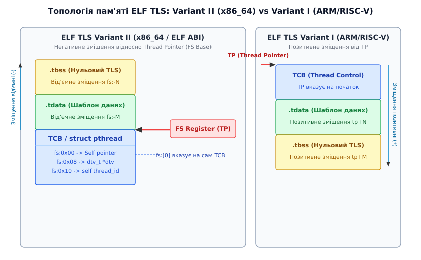
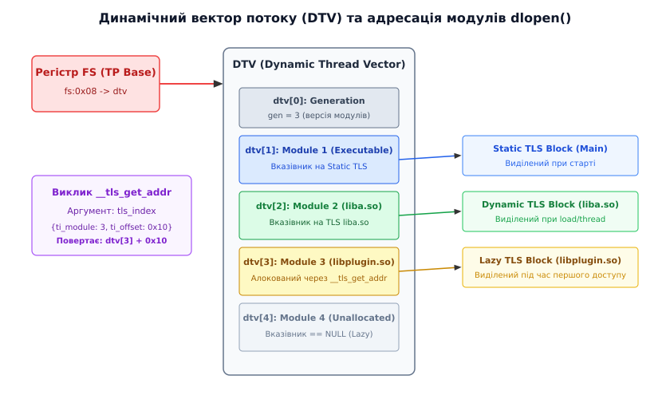
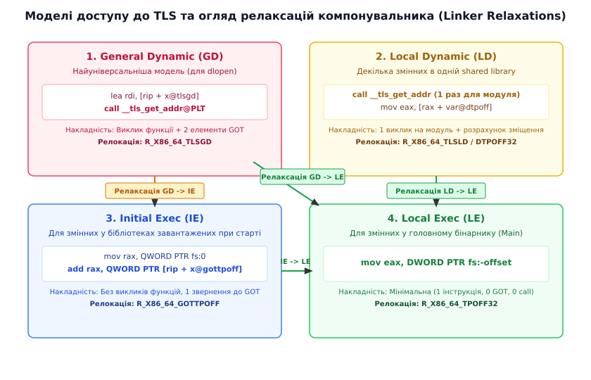

# TLS в ELF: як потік дістає власні глобальні змінні

<preknowlist>
- [Структура ELF](root:sys-unix/elf-structure) — розділення виконуваних файлів на сегменти PT_LOAD, розділи .data та .bss.
- [Динамічне компонування](root:sys-unix/dynamic-loader) — призначення таблиць GOT і PLT, функціональність інтерпретатора ld.so.
</preknowlist>

Коли два потоки виконання в одному процесі одночасно викликають системний виклик `read()`, який повертає помилку `EAGAIN`, кожен з них записує код цієї помилки у змінну `errno`. Якби `errno` була звичайною глобальною змінною у секції `.data`, один потік негайно перезаписав би значення, прочитане іншим, що створило б фатальний стан гонитви (race condition). Щоб зберегти синтаксичну зручність глобального доступу до змінних і при цьому надати кожному потоку власну фізично ізольовану комірку пам'яті, в операційних системах Unix було розроблено механізм **Thread-Local Storage (TLS)**.

У форматі виконуваних файлів ELF реалізація TLS є взаємопов'язаним комплексом дій компілятора, компонувальника (linker) та динамічного завантажувача (`ld.so`), який опирається на апаратну підтримку сегментації пам'яті в процесорах.

## 1. Конфлікт ізоляції та спільного використання пам'яті у багатопотокових процесах

У традиційній моделі процесів POSIX усі потоки одного процесу ділять між собою єдиний віртуальний адресний простір. Вони мають спільну купу (heap), відкриті файлові дескриптори, таблицю сторінок пам'яті (page table) та традиційні секції пам'яті виконуваного файла:

```
+-------------------------------------------------------+
|                 Адресний простір процесу              |
|                                                       |
|  +------------------+  +---------------------------+  |
|  |  Секція .text    |  |  Секція .data / .bss      |  |
|  |  (Машинний код)  |  |  (Спільні глобальні дані) |  |
|  +------------------+  +---------------------------+  |
|                                                       |
|  +------------------+  +---------------------------+  |
|  |  Стек Потоку A   |  |  Стек Потоку B            |  |
|  +------------------+  +---------------------------+  |
+-------------------------------------------------------+
```

Локальні змінні функцій розміщуються на стеку конкретного потоку і є природно ізольованими. Проте локальні змінні стеку існують лише під час виконання відповідного кадру функції (stack frame). Якщо даним потрібен тривалий життєвий цикл (як у глобальних або статичних змінних), але при цьому вони мають бути унікальними для кожного потоку, стек підходить погано.

Першою спробою розв'язати цю проблему на рівні програмних бібліотек було використання м'ютексів для захисту глобальних даних або передача спеціального контекстного вказівника (`struct context *ctx`) в усі функції програми. Обидва підходи виявилися неприйнятними з міркувань швидкодії та архітектури:
- Використання м'ютексів для кожної елементарної операції читання або запису покажчика стану створює величезну конкуренцію за шину пам’яті (bus contention), викликає інвалідацію кеш-ліній L1/L2 процесора (cache line bouncing) і повністю нищить переваги багатопотокового паралелізму.
- Передача вказівника на контекст крізь усі рівні викликів ламає архітектурну абстракцію функцій і унеможливлює використання стандартних бібліотечних інтерфейсів.

Необхідним став механізм, за якого звернення за ім'ям змінної (наприклад, `my_config`) під час виконання асемблерної інструкції прозоро адресовало б різну фізичну пам'ять залежно від того, який саме потік виконує цю інструкцію.

:::tabs
```c
#include <stdio.h>
#include <pthread.h>

/* Глобальна потоко-локальна змінна мовою C */
__thread int thread_counter = 0;

void increment_counter(void) {
    thread_counter++;
    printf("Thread %lu: counter = %d\n", (unsigned long)pthread_self(), thread_counter);
}
```
```cpp
#include <iostream>
#include <thread>

// Глобальна потоко-локальна змінна у C++11
thread_local int thread_counter = 0;

void increment_counter() {
    thread_counter++;
    std::cout << "Thread " << std::this_thread::get_id() 
              << ": counter = " << thread_counter << '\n';
}
```
:::

## 2. Компонування шаблонів пам'яті: Секції .tdata, .tbss та сегмент PT_TLS

Коли компілятор бачить оголошення змінної з ключовим словом `thread_local` (у C++11) або `__thread` (у C), він не розміщує її у звичайних секціях `.data` чи `.bss`. Замість цього генеруються спеціальні секції:

- **`.tdata`**: містить шаблони ініціалізованих потоко-локальних змінних (аналог `.data`).
- **`.tbss`**: містить інформацію про розмір неініціалізованих потоко-локальних змінних, які мають бути заповнені нулями (аналог `.bss`).

Під час збирання об'єктних файлів у підсумковий виконуваний файл або динамічну бібліотеку статичний компонувальник (`ld`) об'єднує всі секції `.tdata` та `.tbss` з окремих модулів у єдиний **шаблон ініціалізації TLS** (TLS Initialization Image).

Цей шаблон описується у таблиці заголовків програми (Program Header Table) ELF-файлу спеціальним записом типу **`PT_TLS`**.

```
Таблиця програмних заголовків (Program Headers):
  Type           Offset             VirtAddr           PhysAddr
                 FileSiz            MemSiz             Flags  Align
  LOAD           0x0000000000000000 0x0000000000400000 0x0000000000400000
                 0x000000000000072c 0x000000000000072c  R E    0x1000
  LOAD           0x0000000000000e10 0x0000000000401e10 0x0000000000401e10
                 0x0000000000000200 0x0000000000000280  RW     0x1000
  TLS            0x0000000000000e10 0x0000000000401e10 0x0000000000401e10
                 0x0000000000000020 0x0000000000000060  R      0x8
```

Поля заголовка `PT_TLS` несуть чітко визначену семантику:
- `FileSiz` (у даному прикладі `0x20` = 32 байти): визначає розмір секції `.tdata`. Це обсяг байтів, які потрібно скопіювати з виконуваного файла під час створення нового потоку.
- `MemSiz` (у прикладі `0x60` = 96 байтів): визначає повний розмір пам'яті під TLS. Різниця `MemSiz - FileSiz` (`0x40` = 64 байти) визначає обсяг секції `.tbss`, яку завантажувач зобов'язаний заповнити нульовими байтами.
- `Align` (`0x8` = 8 байтів): максимальне вирівнювання даних у блоці.

Принципово важливо: сегмент `PT_TLS` — це лише **шаблон (креслення)**. Він сам по собі не використовується для виконання коду. 

Коли програма створює новий потік (наприклад, через виклик `pthread_create()`, який у Linux виконує системний виклик `clone`), бібліотека C (glibc) виконує такі кроки:
1. Розраховує загальний розмір пам'яті на основі `MemSiz` усіх завантажених модулів.
2. Алокує новий блок віртуальної пам'яті через `mmap()` або з внутрішнього пулу стеків.
3. Копіює байт-у-байт вміст секції `.tdata` з шаблону `PT_TLS` у першу частину алокованого блоку.
4. Очищає нулями (`memset`) ділянку пам'яті, що відповідає секції `.tbss`.
5. Прив'язує базову адресу отриманого блоку до апаратного вказівника потоку (Thread Pointer).

Детальний опис історичного шляху від ранніх макросів `__errno_location()` до прийняття нативної специфікації ELF TLS наведено у вставці [📜 Історія еволюції локальної пам’яті потоків](root:sys-unix/elf-tls/hist-tls-evolution.md).

## 3. Топологія розміщення у пам'яті: ABI Variant I vs Variant II

Специфікація ELF TLS, розроблена Ульріхом Дреппером, визначає дві фундаментально відмінні топології розміщення TLS-блоків у пам'яті, відомі як **Variant I** та **Variant II**.

Вибір конкретного варіанта диктується архітектурою процесора та специфікацією відповідного System V ABI.

```
Variant I (ARM, RISC-V, MIPS):
[  TCB  ] [ .tdata ] [ .tbss ] ---> Пам'ять зростає (адреси +)
^ Thread Pointer (TP)

Variant II (x86, x86_64):
[ .tbss ] [ .tdata ] [  TCB  ] ---> Пам'ять зростає (адреси +)
                     ^ Thread Pointer (FS Base)
```

### Variant I (ARM, AArch64, RISC-V, PowerPC)
У топології Variant I апаратний вказівник потоку (Thread Pointer, TP) вказує безпосередньо на **початок** управляючої структури TCB (Thread Control Block).
- Блок статичного TLS (`.tdata` та `.tbss`) розміщується **після** TCB у напрямку зростання адрес.
- Доступ до змінних здійснюється за **позитивними зміщеннями**: `TP + offset`.

### Variant II (x86, x86_64, IA-64)
У топології Variant II апаратний вказівник потоку (в x86_64 це базова адреса регістра `FS`) вказує на **кінець** структури TCB (яка в glibc відповідає заголовку `tcbhead_t` у складі `struct pthread`).
- Блок статичного TLS розміщується **перед** TCB у напрямку зменшення адрес.
- Доступ до TLS-змінних первинного модуля здійснюється за **від'ємними зміщеннями**: `FS - offset`.
- За адресою `FS:0` (нульове зміщення від бази `FS`) знаходиться спеціальне поле — **self-pointer**, яке містить 64-бітну адресу самого регістра `FS`.
- За адресою `FS:0x08` розміщується вказівник на **Dynamic Thread Vector (DTV)**.

Застосування від'ємних зміщень у Variant II має важливу інженерну причину: це дозволяє C-бібліотеці розширювати внутрішню структуру TCB у напрямку зростання адрес без порушення фіксованих від'ємних зміщень до TLS-змінних, розрахованих статичним компонувальником під час збирання програми.


*Топологія пам'яті локальних даних потоку, розміщення TCB та адресація відносно регістра FS.*

## 4. Апаратна адресація через сегментні регістри x86_64: FS та GS

У 32-бітному режимі x86 для адресації пам'яті використовувалися сегментні регістри `CS`, `DS`, `SS`, `ES`, `FS`, `GS`. При переході на 64-бітну архітектуру x86_64 плоска модель пам'яті (flat memory model) зробила більшість сегментних регістрів застарілими: базові адреси для `CS`, `DS`, `ES`, `SS` в апаратурі примусово вважаються рівними `0`.

Проте розробники архітектури x86_64 залишили виняток для регістра **`FS`** та **`GS`**. Для них процесор підтримує довільні 64-бітні базові адреси, які зберігаються у спеціальних регістрах конфігурації (Model Specific Registers): `IA32_FS_BASE` та `IA32_GS_BASE`.

В операційній системі Linux встановлено чіткий розподіл цих регістрів:
- **`GS`**: використовується ядром Linux. У режимі ядра `GS` вказує на структури даних конкретного процесорного ядра (per-CPU data). При переході з користувацького простору в ядро інструкція `swapgs` миттєво перемикає базу `GS`.
- **`FS`**: повністю відданий у простір користувача (userspace) для реалізації TLS та збереження TCB поточного потоку.

При створенні нового потоку виконання C-бібліотека обчислює базову адресу TCB і передає її ядру через системний виклик `arch_prctl(ARCH_SET_FS, base_addr)`. Ядро записує це значення в MSR `IA32_FS_BASE`. У сучасних процесорах з підтримкою розширення `FSGSBASE` користувацький код може зчитати або змінити цю базу безпосередньо апаратними інструкціями `rdfsbase` та `wrfsbase`.

Коли компілятор генерує машинний код для читання `thread_local` змінної, він використовує префікс сегментація `FS:`:

```assembly
; Зчитування 32-бітного цілого числа за від'ємним зміщенням -4 від FS
mov eax, DWORD PTR fs:-0x4
```

Під час виконання цієї інструкції блок керування пам'яттю (MMU) процесора автоматично додає 64-бітне значення з MSR-регістра `FS_BASE` до вказаного від'ємного зміщення `-0x4`.

Це означає, що доступ до потоко-локальної змінної виконується за **одну інструкцію процесора** без жодних викликів функцій, обчислень у купі або звернень до таблиць сторінок ядра.

## 5. Завантаження динамічних бібліотек (.so), DTV та __tls_get_addr

Описана вище схема з від'ємними зміщеннями від `FS` ідеально працює для головного виконуваного файла та бібліотек, які були зкомпільовані й зкомпоновані разом із ним під час старту процесу.

Проте сучасні операційні системи підтримують динамічне завантаження модулів під час виконання за допомогою функції `dlopen()`. Припустимо, програма працює вже декілька годин, має 100 активних потоків, і раптом виконує `dlopen("plugin.so")`. Завантажена бібліотека `plugin.so` містить власні `thread_local` змінні.

Розмістити ці нові змінні у статичному блоці TLS неможливо: статичні блоки всіх 100 потоків вже виділені й щільно приганяються до TCB. Збільшення розміру статичного блоку вимагало б зупинки всіх потоків, перевиділення пам'яті в купі, копіювання існуючих даних та оновлення регістра `FS` для кожного потоку, що спричинило б катастрофічні затримки.

Для вирішення цієї проблеми специфікація ELF вводить індиректну структуру — **Dynamic Thread Vector (DTV)**.

```
FS Base 
  |
  +--> [ fs:0x08 ] ----> DTV Vector Array
                           +---------------------------+
                           | DTV[0]: Generation = 3    |
                           +---------------------------+
                           | DTV[1]: Executable TLS    | --> Static Block
                           +---------------------------+
                           | DTV[2]: liba.so TLS       | --> Dynamic Block 1
                           +---------------------------+
                           | DTV[3]: libplugin.so TLS  | --> Dynamic Block 2 (Lazy)
                           +---------------------------+
```

DTV — це масив вказівників, доступний за адресою `FS:0x08`. Кожен завантажений модуль (виконувальний файл або динамічна бібліотека) отримує від динамічного завантажувача унікальний **Module ID** (ціле число $1, 2, 3 \dots$).

Коли потік звертається до TLS-змінної з бібліотеки, завантаженої через `dlopen`, компілятор не може використати пряме зміщення від `FS`. Замість цього генерується виклик спеціальної функції runtime-підтримки:

```c
extern void *__tls_get_addr(tls_index *ti);
```

Функція приймає вказівник на структуру `tls_index`, яка містить два поля: `ti_module` (Module ID) та `ti_offset` (зміщення змінної всередині TLS-блоку цього модуля).

### Внутрішній алгоритм __tls_get_addr:

1. Зчитати вказівник на DTV поточного потоку з `FS:0x08`.
2. Перевірити лічильник генерації `DTV[0]`. Якщо від моменту останнього виклику було виконано `dlopen()` або `dlclose()`, генерація процесу зросла. Функція розширює масив DTV для поточного потоку через `realloc()`.
3. Перевірити вказівник `DTV[ti_module]`.
4. Якщо вказівник дорівнює `NULL` (або прапорцю `TLS_SLOT_UNALLOCATED`), це означає, що пам'ять під TLS цього модуля для поточного потоку ще не виділялася (**Lazy Allocation / Лінива алокація**).
5. Функція `__tls_get_addr` викликає внутрішню функцію `allocate_and_init()`, яка виділяє блок пам'яті через `malloc()`, копіює туди шаблон `.tdata` завантаженого модуля, заповнює `.tbss` нулями і записує отриману адресу в `DTV[ti_module]`.
6. Обчислити й повернути підсумкову результуючу адресу: `DTV[ti_module] + ti_offset`.

Завдяки DTV створення нових потоків та завантаження плагінів залишаються швидкими O(1) операціями: пам'ять під TLS динамічного плагіна виділяється для конкретного потоку лише тоді, коли цей потік уперше торкається змінних цього плагіна.


*Організація вектора DTV та лінива алокація пам'яті для динамічно завантажуваних модулів.*

## 6. Чотири класичні моделі доступу до TLS в ELF

Оскільки виклик функції `__tls_get_addr` вимагає збереження регістрів та індиректного переходу (що суттєво повільніше за інструкцію `mov fs:-4`), специфікація ELF визначає **чотири моделі доступу до TLS** (TLS Access Models).

Вони дозволяють компілятору та компонувальнику оптимізувати доступ до змінних залежно від того, де саме оголошено змінну і як буде використовуватися зкомпільований код.

Компілятор GCC/Clang дозволяє явно задати модель за допомогою прапорця `-ftls-model=...` або через атрибути коду `__attribute__((tls_model("...")))` у C чи `[[gnu::tls_model("...")]]` у C++.

### 1. General Dynamic (GD) — Загальна динамічна модель
Найбільш універсальна і найповільніша модель. Згенерований код не робить жодних припущень про те, де знаходиться змінна: вона може бути в основному бінарнику або в плагіні, який завантажать через `dlopen()`.

Компілятор резервує два послідовні записи у Global Offset Table (GOT) для збереження аргументу `tls_index` і генерує виклик `__tls_get_addr`:

```assembly
; General Dynamic (x86_64)
lea rdi, [rip + var@tlsgd]     ; Завантажити адресу tls_index з GOT в RDI
call __tls_get_addr@PLT        ; Викликати динамічний завантажувач
; Результат (абсолютна адреса змінної) повернуто в RAX
```

- **Призначення**: код динамічних бібліотек (`.so`), призначених для завантаження через `dlopen()`.
- **Релокація**: `R_X86_64_TLSGD`.

### 2. Local Dynamic (LD) — Локальна динамічна модель
Застосовується, коли код звертається до кількох `thread_local` змінних, які гарантовано знаходяться у **тій самій динамічній бібліотеці**, що й сам код.

Замість того щоб викликати `__tls_get_addr` для кожної окремої змінної, компілятор викликає `__tls_get_addr` лише **один раз** із `ti_offset = 0`, щоб отримати базову адресу TLS-блоку поточного модуля. Далі адреса кожної конкретної змінної обчислюється простим додаванням відомого константного зміщення (`DTPOFF`):

```assembly
; Local Dynamic (x86_64)
lea rdi, [rip + module@tlsld]   ; Адреса модуля для tls_index
call __tls_get_addr@PLT         ; Отримати базову адресу TLS блоку даного модуля в RAX
; Звернення до двох різних змінних модуля без повторного виклику функції:
mov ecx, DWORD PTR [rax + var1@dtpoff]
mov edx, DWORD PTR [rax + var2@dtpoff]
```

- **Призначення**: декілька TLS-змінних усередині однієї динамічної бібліотеки.
- **Релокація**: `R_X86_64_TLSLD` та `R_X86_64_DTPOFF32`.

### 3. Initial Exec (IE) — Початкова виконувана модель
Застосовується для змінних, які розташовані в об'єктах, що завантажуються **під час старту програми** (сам виконуваний файл або бібліотеки, вказані у звичайній таблиці `DT_NEEDED`).

Оскільки ці бібліотеки відомі на етапі запуску, динамічний завантажувач резервує для їхніх TLS-змінних місця безпосередньо у **статичному блоці TLS** поруч із головним бінарником. Виклики `__tls_get_addr` стають непотрібними. Динамічний завантажувач під час старту обчислює фіксоване зміщення від `FS` і записує його в елемент GOT (`gottpoff`):

```assembly
; Initial Exec (x86_64)
mov rax, QWORD PTR fs:0                  ; Прочитати self-pointer (базу FS)
add rax, QWORD PTR [rip + var@gottpoff]  ; Додати зміщення, зчитане з GOT
; RAX містить підсумкову адресу змінної
```

- **Призначення**: високопродуктивні бібліотеки, які компонуються статично або завантажуються суворо при старті.
- **Релокація**: `R_X86_64_GOTTPOFF`.

### 4. Local Exec (LE) — Локальна виконувана модель
Найшвидша можлива модель. Застосовується виключно тоді, коли компілятору гарантовано відомо, що змінна належить **головному виконуваному файлу програми** (main executable).

Оскільки розмір статичного TLS основного бінарника відомий на етапі статичного компонування, компонувальник `ld` розраховує точне від'ємне зміщення від регістра `FS` як константу прямо під час збирання бінарника.

```assembly
; Local Exec (x86_64)
; Прямий доступ за 1 інструкцію!
mov eax, DWORD PTR fs:-0x4
```

- **Призначення**: `thread_local` змінні у коді головної програми.
- **Релокація**: `R_X86_64_TPOFF32`.

Повний перелік кодових значень релокацій для архітектур x86_64 та AArch64 наведено у вставці [📋 Довідник структур та релокацій ELF TLS](root:sys-unix/elf-tls/api-elf-tls-structures.md).

## 7. Оптимізації компонувальника: TLS Linker Relaxations

Одна з найпотужніших фіч інфраструктури ELF TLS називається **релаксацією релокацій компонувальника (TLS Linker Relaxations / Transitions)**.

Коли компілятор компілює окремий файл вихідного коду C/C++ у об'єктний файл `.o`, він часто не знає, куди саме буде зкомпоновано цей код — у динамічну бібліотеку чи у головний виконуваний файл. Тому компілятор змушений діяти обережно й ґенерувати найбільш універсальний код моделі **General Dynamic (GD)**.

Проте коли статичний компонувальник `ld` об'єднує `.o` файли у фінальний бінарник, він володіє повною картиною проекту. Якщо компонувальник бачить, що об'єктний файл з кодом General Dynamic компонується у головну програму, він **переписує машинний код "на льоту"**, замінюючи інструкції виклику `__tls_get_addr` на швидші моделі!

```
         +------------------------+
         | General Dynamic (GD)   |
         +------------------------+
           /                    \
          /                      \
Релаксація в IE              Релаксація в LE
 (Static Shared Lib)          (Main Executable)
        v                          v
+------------------------+  +------------------------+
|  Initial Exec (IE)     |  |   Local Exec (LE)      |
+------------------------+  +------------------------+
        \                          ^
         \                        /
          ---- Релаксація в LE ---
```

### Приклад релаксації GD → LE:

Початковий код, згенерований компілятором у `.o` файлі (General Dynamic):
```assembly
.byte 0x66
lea rdi, [rip + var@tlsgd]    ; 0x66 + lea = 12 байтів
.word 0x6666
rex64 call __tls_get_addr@PLT  ; 4 байти + call = 5 байтів
```

Після статичного компонування у головний виконуваний файл компонувальник `ld` переписує ці 16 байтів машинних інструкцій у модель **Local Exec**:

```assembly
mov rax, QWORD PTR fs:0        ; 9 байтів: прочитати базу FS
lea rax, [rax - 0x4]           ; 7 байтів: відняти константне зміщення
; Жодного виклику __tls_get_addr, жодного звернення до GOT!
```

Спеціально підібрані розміри псевдоінструкцій у системі команд x86_64 гарантують, що байтова довжина початкового коду GD точно збігається з довжиною релаксованого коду LE, що дозволяє компонувальник виконувати заміну байтів без зсуву решти інструкцій у секції `.text`.


*Чотири моделі доступу до TLS та їх трансформація статичним компонувальником.*

## 8. Крайові випадки та пастки: Static TLS depletion та деструктори C++

Незважаючи на елегантність архітектури ELF TLS, під час розробки складних систем виникають серйозні граничні проблеми.

### 1. Исчерпання резерву Static TLS (Static TLS Depletion)
Прагнучи максимальної швидкодії, розробники деяких високонавантажених динамічних бібліотек компілюють свій код з прапорцем `-ftls-model=initial-exec`. 

Якщо така бібліотека завантажується під час старту програми (посилання у `DT_NEEDED`), динамічний завантажувач безпроблемно розміщує її TLS у статичному блоці. Проте якщо програма намагається завантажити таку бібліотеку пізніше через `dlopen()`, виникає фатальна помилка:

```text
dlopen: cannot allocate memory in static TLS block
```

Причина полягає в тому, що розмір статичного блоку TLS фіксується під час створення кожного потоку. Для задоволення потреб бібліотек, завантажених через `dlopen()`, glibc закладає невеликий резервний шар статичного TLS (`surplus static TLS`, зазвичай близько 16 Кб, що контролюється макросом `DL_NSTATIC_TLS`). 

Якщо завантажений плагін запитує більше статичного TLS, ніж залишилося у резерві, `dlopen()` аварійно завершується з помилкою. 

> 🔧 **Навіщо це знати**: Ніколи не використовуйте модель `initial-exec` під час збирання плагінів або динамічних бібліотек, які можуть завантажуватися через `dlopen()`. Для плагінів слід завжди залишати за замовчуванням модель `general-dynamic`.

### 2. Життєвий цикл та деструктори C++ thread_local об'єктів

У мові C++11 змінна `thread_local` може бути об'єктом класу з нетривіальним конструктором та деструктором:

```cpp
#include <string>
#include <fstream>

void log_event(const std::string& msg) {
    // Конструктор викликається при першому доступі в даному потоці
    // Деструктор повинен викликатися при завершенні потоку!
    thread_local std::ofstream thread_log("thread_" + std::to_string(get_thread_id()) + ".log");
    thread_log << msg << std::endl;
}
```

Оскільки потоки можуть завершуватися у довільний момент (через повернення з потокової функції або виклик `pthread_exit()`), компілятор не може покладатися на стандартні таблиці `.fini_array`.

Для підтримки життєвого циклу об'єктів glibc надає спеціальну внутрішню функцію:

```c
int __cxa_thread_atexit_impl(void (*dtor)(void *), void *obj, void *dso_handle);
```

Кожного разу, коли потік уперше ініціалізує `thread_local` об'єкт з деструктором, компілятор генерує виклик `__cxa_thread_atexit_impl`, додаючи вказівник на об'єкт та його деструктор у зв'язаний список, що зберігається у `struct pthread` поточного потоку.

Під час завершення потоку C-бібліотека обходить цей список у зворотному порядку (LIFO) і викликає деструктори всіх створених цим потоком об'єктів до того, як пам'яті TLS-блоку буде звільнена через `munmap()`.

Практичні приклади аналізу адрес TLS, налаштування та інспектування бінарних файлів за допомогою `readelf`, `objdump` і `gdb` описані у вставці [⚙️ Практичне дослідження та аналіз TLS у коді](root:sys-unix/elf-tls/proj-inspecting-tls.md).
