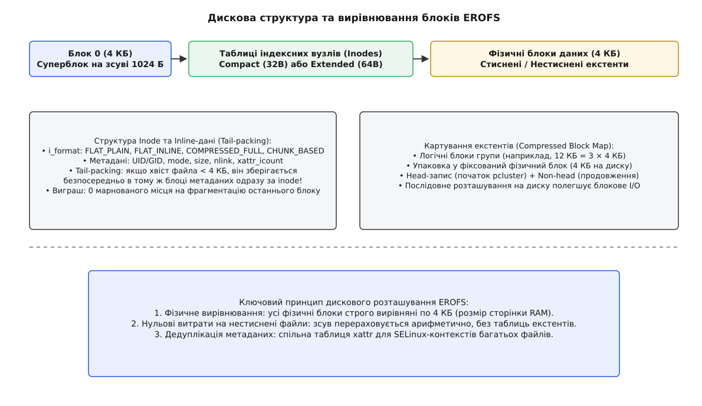
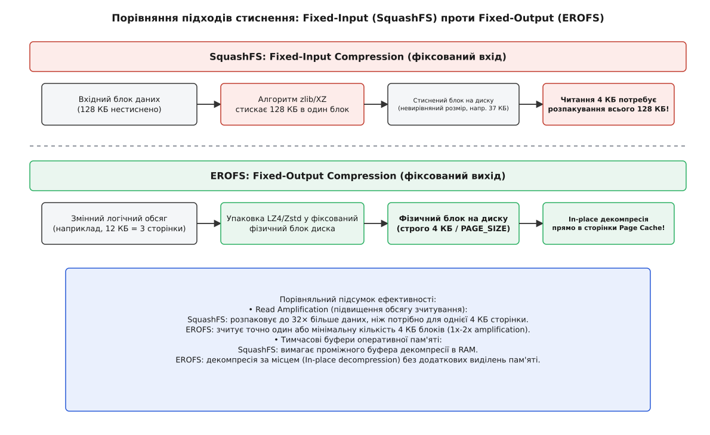
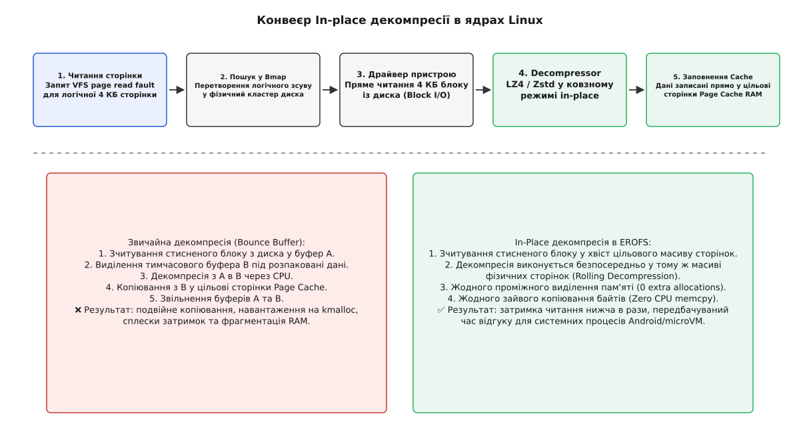
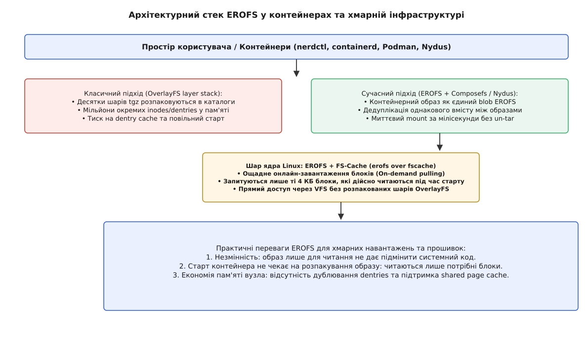

# Стиснена файлова система EROFS для контейнерів та прошивок

<preknowlist>
- [Модель inode](root:sys-unix/inode-model) — індексні вузли, метадані та відокремлення імен від вмісту.
- [Сторінковий кеш ядра](root:sys-unix/page-cache-durability) — посторінкова підкачка та робота декомпресора у RAM.
- [Накладені файлові системи](root:sys-unix/overlay-filesystems) — механізм OverlayFS та шарування контейнерних образів.
</preknowlist>

Одночасний запуск п'ятисот контейнерних мікросервісів на вузлі Kubernetes або виконання холодного старту смартфона одразу після оновлення прошивки впираються в жорстку суперечність між обсягом флеш-пам'яті та ціною читання стиснених даних. З одного боку, системні образи операційних систем та контейнерні образи доводиться стискати, щоб вони не виходили за межі доступного накопичувача. З іншого боку, традиційні стиснені файлові системи на кшталт SquashFS під час зчитування хоча б однієї 4-кілобайтної сторінки змушені декомпресувати величезні 128-кілобайтні блоки у тимчасові буфери оперативної пам'яті. Це спричиняє підвищення обсягу зчитування у десятки разів, стрибки затримок читання та тиск на пам'ять — аж до втручання OOM killer.

Файлова система **EROFS** (англ. *Enhanced Read-Only File System*, розширена файлова система лише для читання) вирішує цю суперечність через відмову від парадигми стиснення з фіксованим входом на користь стиснення з фіксованим виходом (англ. *fixed-output compression*). На дисковому носії фізичні блоки стиснених даних мають строго визначений розмір 4 КБ, що дозволяє ядру Linux виконувати декомпресію за місцем (англ. *in-place decompression*) безпосередньо у цільові сторінки Page Cache без жодних проміжних буферів чи зайвих операцій копіювання пам'яті.

## Проблема стисненого читання у VFS та тупик SquashFS

У традиційних файлових системах для збереження даних у формі Read-Only (SquashFS, cramfs) головним критерієм розробників протягом десятиліть був підсумковий коефіцієнт стиснення на диску. Для максимізації компресії вхідний потік нестиснених даних розбивався на однакові за обсягом шматки великого розміру (зазвичай 128 КБ, 256 КБ або 1024 КБ). Компресор (zlib, XZ або Zstd) стискав кожен такий шматок у дисковий блок довільної невирівняної довжини (наприклад, 37 412 байтів).

Коли процесорові потрібно зчитати лише перші 4096 байтів виконуваного файлу або динамічної бібліотеки `.so`, підсистема VFS викликає процедуру підкачки сторінки `read_folio()`. Оскільки стиснений блок у SquashFS не вирівняний по межах фізичних секторів і має довільний розмір, ядро змушене:
1. Визначити за допомогою внутрішніх таблиць, у якому саме стисненому 128-кілобайтному блоці лежать потрібні 4 КБ.
2. Прочитати з фізичного накопичувача весь стиснений блок (37 КБ).
3. Динамічно виділити через `kmalloc()` тимчасовий буфер в оперативній пам'яті (англ. *bounce buffer*).
4. Розпакувати у цей буфер усі 128 КБ нестиснених даних.
5. Скопіювати потрібні 4 КБ у цільову сторінку Page Cache.
6. Звільнити тимчасовий буфер.

Цей ланцюжок дій спричиняє **кратне підвищення обсягу зчитування** (англ. *read amplification*): з диска ядро тягне весь стиснений блок цілком, а розпаковує повні 128 КБ — у 32 рази більше, ніж запитувала програма. У смартфонах це викликало постійні мікрозависання анімації (англ. *jank*), а у хмарних вузлах — виснаження сторінкового кешу та непередбачувані затримки розгортання контейнерів.

## Парадигма Fixed-Output та фізичне вирівнювання блоків

EROFS перевертає цю схему: вона застосовує стиснення з фіксованим виходом (Fixed-Output). При формуванні образу компресор `mkfs.erofs` бере логічні екстентні блоки нестиснених даних різного обсягу (наприклад, 8 КБ, 12 КБ або 16 КБ) і стискає їх так, щоб підсумковий результат упакувався строго в один або декілька фізичних блоків розміром точно 4096 байтів (`PAGE_SIZE`). 

Оскільки розмір фізичного блоку на диску завжди дорівнює 4 КБ і кожен блок починається зі зсуву, кратного 4096 байтам, драйвер EROFS позбувся потреби у складному відстеженні невирівняних зсувів. Зчитування будь-якого стисненого блоку виконується як стандартна операція блокового I/O прямо в сторінку оперативної пам'яті.

*Дискова структура та вирівнювання блоків EROFS: суперблок, компактні inodes та фізичне вирівнювання 4 КБ.*

## Двошарове картування та типи індексних вузлів

На відміну від традиційних файлових систем, де формат збереження файлу є єдиним для всього тома, EROFS застосовує гнучке двошарове картування (англ. *two-layer mapping*) на рівні кожного окремого індексного вузла (inode). Залежно від характеру вмісту та розміру файла, `mkfs.erofs` обирає одну із чотирьох стратегій збереження (`i_format` layout):

1. **`EROFS_INODE_FLAT_PLAIN` (Нестиснений плаский)**: Файл зберігається без жодного стиснення у формі неперервного послідовного масиву фізичних блоків на диску. Цей режим обирається для файлів, які вже стиснені зовнішніми засобами (відеофайли, `JPEG`, `zip` архіви, готові бінарні образи). Для таких файлів EROFS не додає до самих даних жодного службового байта: трансляція логічного зсуву у фізичний блок виконується за одну арифметичну операцію `O(1)` без звернення до додаткових таблиць екстентів.
2. **`EROFS_INODE_FLAT_INLINE` (Плаский з упаковкою хвоста)**: Основна частина файла зберігається нестисненою, але його останній залишок (хвіст розміром менше 4 КБ) записується безпосередньо у той самий блок метаданих, де лежить сам індексний вузол. Це прибирає проблему марнування дискового простору на фрагментацію останнього блоку.
3. **`EROFS_INODE_COMPRESSED_FULL` (Повнофункціональне стиснення)**: Файл розбивається на логічні екстентні групи, які стискаються алгоритмами LZ4, LZ4HC, Zstd або MicroLZMA у фіксовані 4-кілобайтні фізичні кластери. Карта екстентів (Compressed Block Map) описує зв'язок між логічними та фізичними блоками.
4. **`EROFS_INODE_CHUNK_BASED` (Блокова дедуплікація)**: Файл ділиться на фрагменти (chunks) однакового розміру, кратного розміру блоку. Замість прямих адрес блоків індексний вузол містить масив записів `erofs_inode_chunk_index`: номер пристрою з таблиці multi-device плюс адреса блоку, звідки брати фрагмент. Саме на цьому режимі тримається дедуплікація вмісту між образами в Nydus.

*Порівняння підходів стиснення: Fixed-Input (SquashFS) проти Fixed-Output (EROFS).*

Детальний порівняльний вимір продуктивності, споживання пам'яті та затримок між SquashFS та EROFS розгорнуто в архітектурному порівнянні [🔌 Порівняння SquashFS та EROFS](root:sys-unix/erofs-read-only-filesystem/comp-squashfs-vs-erofs.md).

## In-place декомпресія та ковзне декодування LZ4

Ключовим технологічним проривом EROFS, який дозволив досягти продуктивності нестисненої файлової системи, є механізм **декомпресії за місцем** (англ. *in-place decompression*).

При звичайній декомпресії ядрові потрібні два окремі масиви пам'яті: буфер A зі стисненими дисковими даними та буфер B для розпакованого результату. В EROFS розробники реалізували алгоритм декодування, який використовує той самий масив фізичних сторінок пам'яті Page Cache як для вхідних стиснених даних, так і для розпакованого виходу.

*Конвеєр In-place декомпресії в ядрах Linux.*

Процес працює за наступною послідовністю дій:
1. Підсистема VFS замовляє зчитування групи сторінок (наприклад, 3 сторінки = 12 КБ). Ядро алокує 3 фізичні сторінки у Page Cache для даного файла.
2. Драйвер EROFS зчитує 4 КБ стисненого фізичного блоку з диска безпосередньо у **хвіст** цього ж масиву — тобто в третю, останню його сторінку цілком.
3. Декодер LZ4 у ковзному (rolling) режимі починає декодування з початку вхідних даних і записує розпаковані байти у **початок** першої сторінки.
4. Вихід росте швидше за вхід, тож голова запису неминуче наздоганяє голову читання — і саме тому стиснений блок кладуть у самий хвіст масиву. Поки декодер іде вперед, відстань від голови запису до найближчого ще не прочитаного стисненого байта лишається додатною, і вихід затирає стиснені дані рівно тоді, коли їх уже спожито. Якщо для конкретного кластера цього запасу не стає, драйвер відступає на звичайний проміжний буфер.
5. На момент завершення декодування весь 12-кілобайтний масив сторінок виявляється заповненим чистими розпакованими даними, а 4 КБ стисненого дискового блоку природно перезаписуються останніми байтами виходу.

У результаті в типовому випадку ядро здійснює **нуль виділень тимчасової пам'яті** (`0 allocations`) та **нуль операцій копіювання пам'яті** (`0 memcpy`).

Історію виникнення цієї технології всередині компанії Huawei, її боротьбу за входження в основну гілку ядра Linux та подальше поширення в Android AOSP зібрано у нарисі [📜 Історія EROFS: від смартфонів до стандарту контейнерів](root:sys-unix/erofs-read-only-filesystem/hist-erofs-evolution.md).

## Компактність метаданих, tail-packing та спільна таблиця xattrs

У Read-Only файлових системах обсяг метаданих (структур індексних вузлів, каталогових записів та розширених атрибутів) з'їдає відчутну частку образу — тим більшу, чим дрібніші файли в ньому переважають. EROFS зводить цей надлишок до мінімуму трьома дисковими рішеннями:

### 1. Компактні індексні вузли (`erofs_inode_compact`)
Для переважної більшості файлів розміром до 4 ГБ EROFS використовує компактні inode розміром всього **32 байти**. У цей обсяг упаковано всі POSIX-атрибути: `i_mode`, `i_nlink`, `i_size`, `i_uid`, `i_gid`, `i_ino` та дискову адресу першого блоку даних. Власного часу модифікації компактний вузол не має — його беруть зі спільної позначки `build_time` у суперблоці. Для великих файлів (> 4 ГБ) або файлів із 64-бітними мітками часу використовується розширений вузол `erofs_inode_extended` розміром 64 байти.

### 2. Упаковка хвостів файлів (Inline Tail-packing)
Якщо файл має розмір, наприклад, 5000 байтів, він займає один повний 4-кілобайтний блок (4096 байт) і залишок у 904 байти. У звичайних системах цей залишок вимагав би виділення другого повноцінного 4-кілобайтного блоку, де 3192 байти марнувалися б у формі нульового заповнення. 

В EROFS режим `EROFS_INODE_FLAT_INLINE` упаковує ці 904 байти безпосередньо в той самий 4-кілобайтний блок метаданих одразу за 32-байтною структурою `erofs_inode`. Ядро зчитує метадані файла та його хвіст за один послідовний виклик дискового I/O.

### 3. Таблиця спільних атрибутів (Shared xattr table)
У Android та контейнерах кожен файл має розширені атрибути безпеки SELinux (наприклад, `security.selinux="u:object_r:system_file:s0"`). У системі з 100 000 файлів ці однакові текстові рядки займають мегабайти дискового простору. EROFS виносить однакові атрибути у глобальну спільну таблицю `shared xattr table`, а в індексних вузлах файлів залишає лише 32-бітні індекси-посилання.

> 🔧 **Навіщо це.**
> Завдяки поєднанню 32-байтних компактних inode, упаковці хвостів та дедуплікації SELinux-міток метадані системного образу важать помітно менше, ніж на ext4, і виграш тим більший, чим більше в образі дрібних файлів з однаковими мітками безпеки. Точна цифра залежить від конкретного образу, тож єдиний чесний спосіб її дізнатися — зібрати те саме дерево обома засобами й порівняти.

Повну специфікацію дискових бінарних структур, зсувів та прапорців сумісності наведено у довіднику [📋 Довідник дискових структур даних EROFS](root:sys-unix/erofs-read-only-filesystem/api-erofs-ondisk.md).

## EROFS у сучасних контейнерних стеках: Composefs, Nydus та FS-Cache

Коли в ядрі Linux 5.19 EROFS навчилася читати образ через давню підсистему кешування **FS-Cache** (режим `erofs over fscache`), вона стала базою для контейнерних образів нового покоління.

Традиційне шарування контейнерів на базі OverlayFS працює за принципом розпакування кожного шару (`.tar.gz`) в окремий каталог на дисковій файловій системі хоста. Під час запуску контейнера з 30 шарами ядро накладає всі 30 нижніх каталогів в одному монтуванні OverlayFS, а кожен пошук імені йде по шарах згори вниз, аж поки файл знайдеться. Це призводить до:
- Виснаження кешу сутностей каталогів ядра (dentry cache).
- Повільного холодного запуску (спочатку треба завантажити й розпакувати всі гігабайти шарів).
- Відсутності прозорої дедуплікації однакових файлів між різними контейнерними образами.

*Архітектурний стек EROFS у контейнерах та хмарній інфраструктурі.*

Сучасний стек на базі **EROFS + Composefs / Nydus** змінює цю модель:
1. Кожен шар контейнера або весь підсумковий rootfs збирається як бінарний образ EROFS.
2. Файли усередині образу адресуються режимом `CHUNK_BASED` або через сховище за вмістом (Content-Addressable Storage): однаковий вміст, що трапляється в різних образах, зберігається на хості один раз.
3. Через підсистему `erofs over fscache` контейнерний образ монтується й починає виконуватися ще до того, як його завантажено повністю. Коли процес у контейнері вперше звертається до якоїсь сторінки пам'яті, демон простору користувача (наприклад, `nydusd`) прозоро підтягує по мережі лише той блок EROFS, який дійсно потрібен для виконання коду.

Практичне керівництво зі створення образів за допомогою `mkfs.erofs`, перевірки цілісності через `erofsck` та програму аналізу суперблоку мовами C та C++ зібрано у практичному проєкті [⚙️ Створення, інспектування та програмний аналіз образів EROFS](root:sys-unix/erofs-read-only-filesystem/proj-erofs-toolchain.md).
