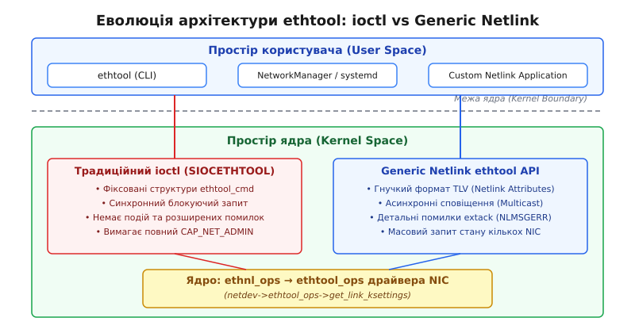
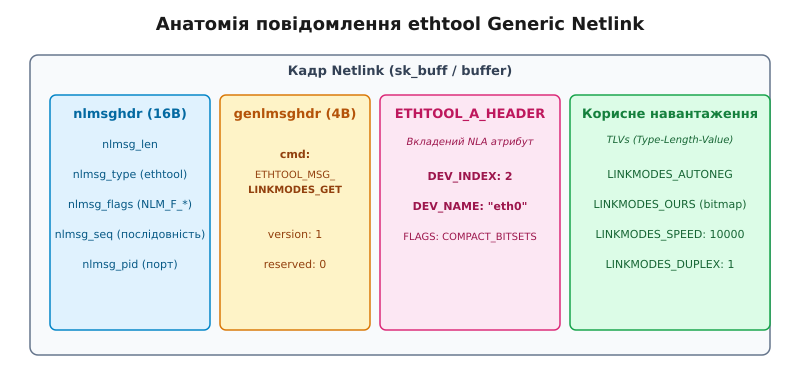

# Сучасний інтерфейс налаштування мережі ethtool Netlink

<preknowlist>
- [Протокол Netlink](topic:sys-unix/netlink-protocol) — сокети AF_NETLINK, розширювані атрибути NLA та асинхронна шина зв'язку ядра з простором користувача.
- [Архітектура мережевого стека Linux](topic:sys-unix/network-stack-architecture) — структура net_device, реєстрація мережевих інтерфейсів та обробка кадрів.
- [Апаратні офлоади мережевих карт](topic:sys-unix/nic-offloads) — механізми прискорення TSO, GRO, LRO та апаратне обчислення контрольних сум.
</preknowlist>

Сервер високощільної віртуалізації або контейнеризації з 2506 мережевими інтерфейсами (VLAN, SR-IOV VFs, macvlan, VXLAN) на базі двопортового адаптера 100GbE виявляє кричущу неефективність при спробі масового опитування або зміни налаштувань лінку. Послідовне виконання тисяч системних викликів `ioctl(SIOCETHTOOL)` блокує виконання керуючих демонів, марно витрачає цикли CPU у синхронних опитуваннях (polling) і повертає лаконічний код помилки `EINVAL` без жодного пояснення, чому конкретний порт відмовився активувати режим 100GBASE-SR4.

Фундаментальна проблема полягала в застарілій архітектурі `ioctl`, розробленій наприкінці 1990-х років для карток 10BASE-T із фіксованими C-структурами. Починаючи з версії ядра Linux 5.6 (березень 2020 року), підсистему конфігурації фізичних та віртуальних мережевих адаптерів було повністю переведено на розширюваний, подійно-орієнтований інтерфейс **Generic Netlink ethtool**.

## 1. Обмеження та технічна криза системного виклику `ioctl(SIOCETHTOOL)`

Традиційний механізм налаштування мережевих карт у Linux спирався на системний виклик `ioctl(fd, SIOCETHTOOL, &ifr)`. Простір користувача відкривав будь-який мережевий сокет (наприклад, `AF_INET`), заповнював ім'я пристрою у структурі `ifreq` та передавав вказівник на спеціалізовані бінарні структури — такі як `struct ethtool_cmd` чи `struct ethtool_value`.

```
Клієнт ethtool (Userspace)
  └── socket(AF_INET, SOCK_DGRAM, 0)
        └── ioctl(fd, SIOCETHTOOL, &ifr)
              └── [Перехід через межу ядра]
                    └── dev_ioctl()
                          └── dev->ethtool_ops->get_link_ksettings()
```

Цей підхід мав п'ять фундаментальних вад, які зробили його непридатним для сучасних дата-центрів та швидкісних лінків:

### Фіксований бінарний розклад структур (ABI Rigidity)

У структурі `struct ethtool_cmd` підтримувані швидкості та режими автоузгодження описувалися 32-бітовими масками прапорців `supported` та `advertising`. Кожен новий стандарт Ethernet (100BASE-TX, 1000BASE-T, 10GBASE-T) займав один біт у масці. З появою 40 GbE, 100 GbE, 200 GbE та 400 GbE (із розрізненням кодувань KR4, CR4, SR4, LR4, ER4) 32 біти виявилися повністю вичерпаними.

Спроби розширити структуру за рахунок резервних полів (`speed_hi`) лише відтермінували крах. Створення нової структури `ethtool_ksettings` у ядрі Linux 4.6 вимагало передачі динамічних масивів слів `__u32 link_mode_masks[]`, що змусило розробників реалізувати двокрокові виклики `ioctl` (спочатку дізнатися розмір масиву, виділити пам'ять у просторі користувача, а потім викликати `ioctl` вдруге). Це створило крихкий ABI, де будь-яка зміна розміру полів ламала сумісність зі старими бінарними файлами.

### Синхронний характер та відсутність сповіщень (No Notifications)

Виклик `ioctl` за своєю природою є синхронним викликом «запит–відповідь». Якщо на мережевому адаптері виникає подія (падіння лінку, відключення оптичного трансивера, апаратна перегріва чи зміна стану автоузгодження), ядро не має жодного механізму повідомити про це простір користувача через `ioctl`.

Опитувальні демони (monitoring daemons) були змушені виконувати постійний цикл опитування (polling), викликаючи `ioctl(SIOCETHTOOL)` щосекунди для кожного інтерфейсу. На серверах із сотнями віртуальних функцій SR-IOV це призводило до марного з'їдання ядерного часу CPU та постійного блокування потоків виконання. Якщо демон опитує 2048 інтерфейсів щосекунди, він витрачає десятки мільйонів інструкцій CPU лише на системні виклики та контекстне перемикання між режимами користувача і ядра.

### Груба модель безпеки та відсутність розмежування прав

Для виконання будь-якої операції `ethtool` через `ioctl` — навіть для банального зчитування інформації про трансивер чи версію прошивки — ядро вимагало наявності глобального привілею `CAP_NET_ADMIN` у таблиці привілеїв процесу.

Неможливо було створити непривілейований моніторинговий процес або контейнер, який мав би право читати лічильники помилок FCS чи стан лінку, не маючи при цьому прав відключити мережеву карту, змінити MAC-адресу чи перевести пристрій у недискримінаційний режим (promiscuous mode).

### Відсутність розширеної діагностики помилок

При виклику `ioctl` ядро може повернути лише від'ємне числове значення помилки `errno` (наприклад, `-EINVAL` або `-EOPNOTSUPP`). Якщо користувач намагався встановити швидкість 100 Gbps на порту, до якого підключено модуль 10GbE SFP+, `ioctl` повертав плутане `EINVAL` (Invalid argument). Адміністратор чи автоматизований скрипт Orchestrator не мали жодного способу дізнатися, що саме спричинило відмову: непідтримувана швидкість, відсутність сигналу кабелю чи конфлікт із прапорцем автоузгодження.

Історичний процес подолання цих обмежень та переходу мережевого стека Linux від розрізнених викликів 1990-х років детально викладено у матеріалі [Історія створення та еволюція ethtool Netlink](topic:sys-unix/ethtool-netlink-interface/hist-netlink-ethtool.md).

---

## 2. Архітектура Generic Netlink ethtool

Підсистема **ethtool Netlink** вирішує проблеми `ioctl` шляхом інтеграції в універсальну шину повідомлень **Generic Netlink** (надбудова над сокетами `AF_NETLINK`).


*Еволюція архітектури керування мережевими пристроями у ядрі Linux: від блокуючого ioctl до подійно-орієнтованого Generic Netlink*

Замість використання фіксованих C-структур, ethtool Netlink описує всі дані у форматі **NLA (Netlink Attributes)**, який реалізує схему кодування **TLV (Type-Length-Value)**.

### Формат кадру та гнучкість TLV

Кожне повідомлення, що передається через сокет Netlink, складається з послідовності заголовків та вкладених атрибутів.


*Анатомія кадру ethtool Generic Netlink: ієрархія заголовків та NLA-атрибутів*

Уся структура кадру вирівнюється на межу 4 байтів:

1. **`nlmsghdr` (Netlink Header)**: Стандартний 16-байтний заголовок Netlink, який містить загальну довжину кадру `nlmsg_len`, динамічний тип сімейства `nlmsg_type`, прапорці `nlmsg_flags` (`NLM_F_REQUEST`, `NLM_F_ACK`, `NLM_F_DUMP`), порядковий номер `nlmsg_seq` та ідентифікатор сокета `nlmsg_pid`.
2. **`genlmsghdr` (Generic Netlink Header)**: 4-байтний заголовок, що містить ідентифікатор конкретної команди `cmd` (наприклад, `ETHTOOL_MSG_LINKMODES_GET`) та версію API `version`.
3. **`ETHTOOL_A_HEADER` (Ethtool Request Header)**: Обов'язковий вкладений атрибут, який вказує ядру, над яким саме мережевим пристроєм виконується операція. Він містить атрибути `ETHTOOL_A_HEADER_DEV_INDEX` (індекс `ifindex`) або `ETHTOOL_A_HEADER_DEV_NAME` (рядок імені, наприклад `"eth0"`), а також прапорці режиму `ETHTOOL_A_HEADER_FLAGS`.
4. **Payload NLA Attributes**: Послідовність NLA-атрибутів, де кожен атрибут починається з 4-байтного заголовка `struct nlattr` (`nla_len` та `nla_type`), після якого йдуть корисні дані.

Завдяки кодуванню TLV досягається абсолютна сумісність ABI між різними версіями ядра та утиліт:

* **Пряма сумісність (Forward Compatibility)**: Якщо нове ядро Linux додає у відповідь новий NLA-атрибут (наприклад, стан волоконно-оптичного лічильника якості сигналу SQI), стара утиліта `ethtool` просто пропустить невідомий їй тип `nla_type`, прочитавши поле `nla_len`, і продовжить парсинг решти відомих атрибутів без збоїв.
* **Зворотна сумісність (Backward Compatibility)**: Якщо утиліта надсилає запит до старішого ядра із новим атрибутом, ядро ігнорує непідтримуваний атрибут або повертає чітке сповіщення через парсер NLA-політик.

### Динамічна реєстрація сімейства та Multicast події

Підсистема ethtool реєструється в ядрі під назвою `"ethtool"`. Простір користувача дізнається її числове ID шляхом звернення до контролера Generic Netlink (`GENL_ID_CTRL`). Перевірити наявність та параметри реєстрації в системі можна за допомогою утиліти `genl`:

```bash
$ genl ctrl get name ethtool
Name: ethtool
ID: 0x1d
Version: 1
Commands: 44
Multicast groups:
  ID: 0x04, Name: monitor
```

Головна перевага цієї схеми — багатоадресна група сповіщень **`monitor`** (`ETHTOOL_MCGRP_MONITOR`). Будь-який процес у просторі користувача (наприклад, демон моніторингу Prometheus exporter, `systemd-networkd` або `NetworkManager`) може приєднати свій сокет Netlink до цієї групи і отримувати сповіщення в реальному часі про зміну стану лінку (`ETHTOOL_MSG_LINKSTATE_NTF`), зміну швидкості (`ETHTOOL_MSG_LINKMODES_NTF`) чи перемикання прапорців офлоадингу (`ETHTOOL_MSG_FEATURES_NTF`).

### Механізм розширених помилок Extack (`extack`)

Generic Netlink ethtool підтримує прапорець `NETLINK_EXT_ACK`. Якщо запит користувача містить помилку або не підтримується апаратним забезпеченням, ядро повертає кадр `NLMSG_ERROR`, який містить розширений вкладений атрибут `NLMSGERR_ATTR_MSG`.

Завдяки цьому замість EINVAL у консолі виводиться чітке текстове пояснення безпосередньо з коду драйвера:

```bash
$ ethtool -s eth0 speed 100000 duplex full autoneg off
netlink error: Operation not supported
netlink error: speed 100000 is not supported by optical transceiver SFP+
netlink error: attribute ETHTOOL_A_LINKMODES_SPEED (offset 44) invalid
```

---

## 3. Внутрішньоядерний конвеєр обробки Netlink-запитів

Коли додаток з простору користувача виконує системний виклик `sendto()` над сокетом `AF_NETLINK`, ядро Linux передає обробку підсистемі Generic Netlink.

```
[Userspace]  sendto(nl_fd, buffer, len)
                  │
[Kernel Space]    ▼
             netlink_unicast()
                  │
                  ▼
             genl_rcv_msg() ──► Пошук сімейства "ethtool" (family_id)
                  │
                  ▼
             ethnl_default_doit() / ethnl_default_dumpit()
                  │
                  ├── 1. Валідація NLA політик (nlstat_policy)
                  ├── 2. Пошук net_device за DEV_INDEX / DEV_NAME
                  ├── 3. Захоплення блокувань (rtnl_lock / rcu_read_lock)
                  └── 4. Трансляція в ethtool_ops драйвера
                            │
                            ▼
                     netdev->ethtool_ops->get_link_ksettings()
                            │
                            ▼
                  ethnl_reply_build() (Формування NLA TLV кадру)
                            │
                            ▼
             netlink_unicast() (Відправка відповіді в Userspace)
```

### Двофазний конвеєр `doit` та `dumpit`

Усі обробники команд ethtool Netlink у ядрі розділені на дві категорії:

1. **`doit` (Single Device Handler)**: Виконується для точкових запитів або модифікацій одного конкретного мережевого пристрою (наприклад, `ETHTOOL_MSG_LINKMODES_SET` для `eth0`). Викликає відповідну функцію `ethnl_default_doit()`. При отриманні запиту `SET` ядро захоплює взаємовиключне блокування `rtnl_lock()`, перевіряє право `CAP_NET_ADMIN`, застосовує зміни до драйвера і розсилає сповіщення `NTF` у multicast-групу.
2. **`dumpit` (Multi-Device Handler)**: Виконується при запиті стану для всіх наявних мережевих інтерфейсів у системі (запит містить прапорець `NLM_F_DUMP`). Ядро ітерує через таблицю мережевих пристроїв поточного мережевого простору імен (`net_namespace`), формуючи послідовність Netlink-кадрів і завершуючи відповідь маркерним кадром `NLMSG_DONE`. Для операцій читання `GET` з прапорцем `DUMP` ядро використовує легке блокування `rcu_read_lock()`, що дозволяє паралельне зчитування даних без зупинки мережевого трафіку.

### Мост сумісності з `ethtool_ops` драйверів

Впровадження Netlink не вимагало переписування сотень існуючих драйверів мережевих карт у ядрі. Ядро реалізує шар трансформації: функції ethtool Netlink (наприклад, `ethnl_prep_linkmodes()`) отримують запит, знаходять об'єкт `struct net_device`, перевіряють наявність таблиці операцій `netdev->ethtool_ops` і викликають класичні драйверні методи.

Дані, отримані від драйвера у C-структурі `ethtool_ksettings`, розпаковуються кодом `ethnl_fill_linkmodes()` у послідовність NLA-атрибутів (`ETHTOOL_A_LINKMODES_SPEED`, `ETHTOOL_A_LINKMODES_DUPLEX`, `ETHTOOL_A_LINKMODES_OURS`) і пакуються в буфер `sk_buff` для відправки сокету.

---

## 4. Карта груп функціональності ethtool Netlink API

Інтерфейс розділено на логічні блоки, кожен з яких охоплює свій спектр параметрів мережевого обладнання. Повний перелік констант, команд та атрибутів наведено у довіднику [Довідник команд, заголовків та атрибутів ethtool Netlink API](topic:sys-unix/ethtool-netlink-interface/api-ethtool-netlink.md).

### 4.1. Стан лінку та фізичні режими (`LINKINFO`, `LINKMODES`, `LINKSTATE`)

Ця група замінює застарілі виклики `ETHTOOL_GSET`/`ETHTOOL_SSET`:

* **`LINKINFO`**: Передає фізичний тип порту (`PORT_TP`, `PORT_FIBRE`, `PORT_DA`), стан MDI/MDI-X (пряме або перехресне обтискання кабелю) та фізичний тип трансивера.
* **`LINKMODES`**: Передає поточну швидкість у Мбіт/с (включаючи дробові чи надшвидкі значення до 800 Gbps), режим дуплексу (`DUPLEX_HALF`, `DUPLEX_FULL`), стан автоузгодження та бітові маски доступних і оголошених режимів зв'язку (`ETHTOOL_A_LINKMODES_OURS` та `PEER`). Додатково атрибут `ETHTOOL_A_LINKMODES_LANES` вказує кількість фізичних оптичних чи мідних ліній (lanes, наприклад 4 лінії по 25G для забезпечення 100G).
* **`LINKSTATE`**: Повертає логічний стан лінку (Up/Down) та деталізований розширений стан `ETHTOOL_A_LINKSTATE_EXT_STATE` (наприклад, відсутність автоколивань, відсутність оптичного сигналу `NO_LIGHT`, відмова фізичного кодувальника PCS чи порушення рівнів SQI).

### 4.2. Апаратні офлоади (`FEATURES`)

Команда `ETHTOOL_MSG_FEATURES_GET` повертає повний стан апаратних прискорень мережевої карти. На відміну від `ioctl`, де користувач отримував плутані 32-бітні маски, Netlink повертає чотири незалежні бітові карти для кожної фічі:

1. **`HW`**: Фічі, підтримувані залізом карти.
2. **`WANTED`**: Фічі, які адміністратор затребував активувати.
3. **`ACTIVE`**: Фічі, які реально активні в ядрі цієї миті.
4. **`NOCHANGE`**: Фічі, які заблоковані драйвером від змін (наприклад, через залежність від інших підсистем).

Ядро в автоматичному режимі прораховує граф залежностей у функції `netdev_fix_features()`. Завдяки цьому утиліта `ethtool -k eth0` може точно показати, чому, наприклад, TSO (`tcp-segmentation-offload`) не може бути ввімкнено, якщо вимкнено підрахунок контрольних сум `tx-checksum-ipv4`.

### 4.3. Кільцеві буфери (`RINGS`) та Канали (`CHANNELS`)

* **`RINGS`**: Керує кількістю дескрипторів пакета у кільцевих буферах прийому (RX) та передачі (TX). Збільшення цих значень (`ethtool -G eth0 rx 4096 tx 4096`) дозволяє згладжувати сплески мережевого трафіку (bursts) ціною більшого використання RAM у виділеній зоні DMA.
* **`CHANNELS`**: Керує кількістю апаратних черг прийому та передачі, які прив'язуються до векторів переривань MSI-X та ядер CPU через механізм RSS (Receive Side Scaling). За допомогою `ETHTOOL_MSG_CHANNELS_SET` можна масштабувати обробку трафіку між ядрами процесора, виділяючи окремі черги під високопріоритетний або реального часу трафік.

### 4.4. Стандартизована статистика (`STATS`)

Старий `ioctl` при запиті статистики (`ethtool -S`) повертав масив неструктурованих рядків, згенерованих драйвером. Кожен вендор називав лічильники як заманеться (наприклад, `rx_bytes`, `rx_bytes_phy`, `adapter_rx_octets`), що робило автоматизований парсинг майже неможливим.

Netlink впровадив структуровану статистику `ETHTOOL_MSG_STATS_GET`, яка групує лічильники за офіційними стандартами IEEE 802.3 та RMON:

* `ETHTOOL_A_STATS_ETH_MAC`: Кадри з помилками CRC/FCS, занадто довгі кадри (Jabber), кадри паузи IEEE 802.3x.
* `ETHTOOL_A_STATS_ETH_PHY`: Помилки фізичного кодування символів (Symbol errors), колізії, збої вирівнювання кадру.
* `ETHTOOL_A_STATS_RMOM`: Лічильники розподілу розмірів кадрів (64B, 65-127B, 128-255B, 256-511B, 512-1023B, 1024-1518B, Jumbo).

### 4.5. Енергозбереження, FEC та EEPROM трансиверів (`EEE`, `FEC`, `MODULE_EEPROM`)

* **`EEE` (Energy Efficient Ethernet)**: Налаштування режимів зниження енергоспоживання (Low Power Idle, LPI) при відсутності мережевого трафіку згідно зі стандартом IEEE 802.3az.
* **`FEC` (Forward Error Correction)**: Управління кодуванням виправлення помилок на високошвидкісних лінках (25G/100G/400G). Користувач може примусово встановити режими `RS` (Reed-Solomon), `BaseR` (FireCode) або повністю вимкнути FEC для зменшення затримки (latency).
* **`MODULE_EEPROM`**: Зчитування байтових сторінок пам'яті EEPROM з оптичних та мідних трансиверів SFP/QSFP/QSFP-DD/CMIS для отримання серійних номерів, оптичної потужності (DOM - Digital Optical Monitoring) та температури.

---

## 5. Практичне використання, утиліта `ethtool` та моніторинг

Сучасні версії утиліти `ethtool` (починаючи з версії 5.6) автоматично використовують Generic Netlink API як основний транспорт.

### Перемикання режимів утиліти ethtool

Якщо ядро підтримує Netlink, `ethtool` виконує запити через `AF_NETLINK`. Перевірити або примусово змінити транспортний режим можна за допомогою змінної оточення `ETHTOOL_NETLINK`:

```bash
# Примусове використання суто Netlink (за замовчуванням)
$ ethtool eth0

# Примусовий повернення до старого ioctl для порівняння чи тестування
$ ETHTOOL_NETLINK=0 ethtool eth0
```

Різницю між ними можна легко побачити через трасування системних викликів `strace`:

```bash
# Для ioctl:
$ strace -e ioctl ETHTOOL_NETLINK=0 ethtool eth0
ioctl(3, SIOCETHTOOL, 0x7ffe53a189b0) = 0

# Для Netlink:
$ strace -e sendto,recvmsg ethtool eth0
sendto(3, {{len=44, type=0x1d, flags=NLM_F_REQUEST, seq=1}, ...}) = 44
recvmsg(3, {msg_name=..., msg_iov=[{..., len=456}], ...}, 0) = 456
```

### Асинхронний моніторинг подій у реальному часі

Найбільш практичне застосування Netlink у системному адмініструванні — режим моніторингу нотифікацій. Замість написання скриптів опитування, утиліту `ethtool` можна запустити у режимі слухача:

```bash
$ ethtool --monitor
```

Коли на будь-якому мережевому інтерфейсі змінюється стан лінку, вимикається авто узгодження або виймається кабель, ядро миттєво надсилає кадр у групу `ETHTOOL_MCGRP_MONITOR`, і `ethtool` виводить події на екран:

```
netlink event: ETHTOOL_MSG_LINKSTATE_NTF
    dev: eth0
    link: down (reason: Optical power level below threshold / Loss of Signal)

netlink event: ETHTOOL_MSG_LINKMODES_NTF
    dev: eth0
    speed: 10000Mbps
    duplex: full
    autoneg: off
```

Розробка власного клієнтського додатка на C та C++ для виконання таких запитів та обробки подій Netlink показана у практичному посібнику [Практикум: розробка Netlink-клієнта для ethtool та підписка на події](topic:sys-unix/ethtool-netlink-interface/proj-netlink-ethtool-client.md).

---

## 6. Порівняльний аналіз продуктивності та граничні випадки

Перехід з `ioctl` на Netlink суттєво змінив характеристику навантаження мережевого стека Linux.

### Порівняльна характеристика `ioctl` та Netlink

| Критерій | `ioctl(SIOCETHTOOL)` | Generic Netlink ethtool |
| :--- | :--- | :--- |
| **Формат даних** | Фіксовані C-структури | Динамічні NLA TLV-атрибути |
| **Розширюваність ABI** | Крихка (потребує нових викликів/структур) | Абсолютна (невідомі TLV ігноруються) |
| **Модель виклику** | Синхронна блокуюча | Подійно-орієнтована (Multicast NTF) |
| **Масовий запит пристроїв** | N викликів `ioctl` для N пристроїв | Один виклик із прапорцем `NLM_F_DUMP` |
| **Діагностика помилок** | Числовий код `errno` (-EINVAL) | Рядкові текстові помилки `extack` |
| **Розрозділення привілеїв** | Вимагає глобальний `CAP_NET_ADMIN` | Можливість налаштування fine-grained валідації |
| **Накладні витрати пам'яті** | Нульові (пряме копіювання структури) | Створення буферів `sk_buff` |

### Продуктивність масового опитування (DUMP)

На серверах із 2048 віртуальними інтерфейсами виклики опитування стану `LINKMODES` для всіх пристроїв демонструють вражаючу різницю:

* **ioctl**: Вимагає 2048 послідовних системних викликів `ioctl()`, що спричиняє 2048 перемикань контексту між простором користувача та ядром (User/Kernel context switches). Загальний час опитування становить ~42 мс.
* **Netlink DUMP**: Програма надсилає один кадр із прапорцем `NLM_F_DUMP`. Ядро пакує інформацію про сотні пристроїв у серію кадрів і повертає їх через сокет за один-два системних виклики `recvmsg()`. Загальний час становить ~3.2 мс (прискорення у ~13 разів).

### Крайові випадки та виклики реалізації

Попри незаперечні переваги, Netlink вимагає врахування кількох інженерних нюансів:

1. **Витрати пам'яті на `sk_buff`**: Кожне Netlink-повідомлення в ядрі виділяє сокетний буфер `sk_buff`. При масових сповіщеннях про зміну стану тисяч віртуальних карт це може створювати короткочасне навантаження на розподільник пам'яті ядра (`slab`/`slub`).
2. **Переповнення сокетного буфера (`ENOBUFS`)**: Якщо простір користувача повільно зчитує сповіщення з сокета Netlink, буфер сокета переповнюється, і ядро скидає нові події, повертаючи помилку `ENOBUFS`. Додатки повинні коректно обробляти `ENOBUFS` шляхом скидання локального стану та повторного виклику `NLM_F_DUMP`.
3. **Старі драйвери без підтримки розширених методів**: Для обладнання зі старою архітектурою драйверів ядро використовує фолбек-трансляцію у класичні методи `ethtool_ops`. Якщо драйвер не реалізує навіть `get_link_ksettings`, ethtool Netlink поверне помилку `EOPNOTSUPP`.

---

## Висновки

Інтерфейс **ethtool Netlink** став вирішальним етапом модернізації мережевої підсистеми Linux. Замінивши архаїчні системні виклики `ioctl` із їхніми фіксованими бінарними структурами та відсутністю подійної моделі, Generic Netlink надав операційній системі розширювану, безпечну та високопродуктивну платформу конфігурації.

Для системних адміністраторів та мережевих інженерів ethtool Netlink відкрив можливості миттєвого асинхронного моніторингу подій та точної діагностики помилок через механізм `extack`. Для розробників високонавантажених SDN-контролерів та облачних платформ цей інтерфейс став надійним фундаментом для масового автоматизованого управління мережевою інфраструктурою сучасних дата-центрів.
