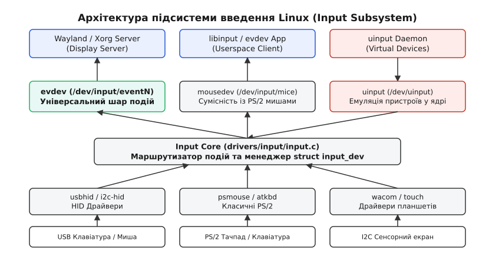
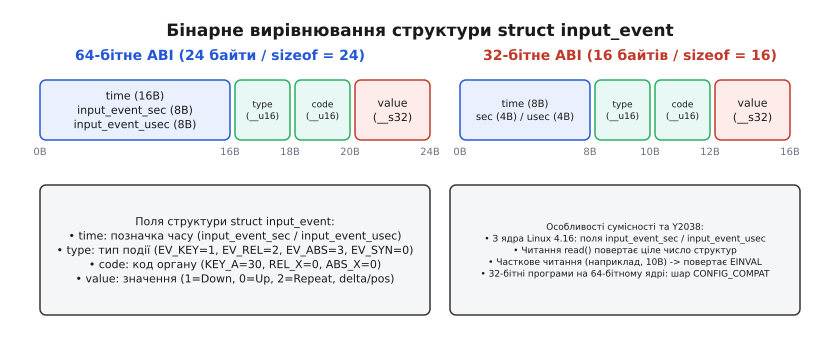
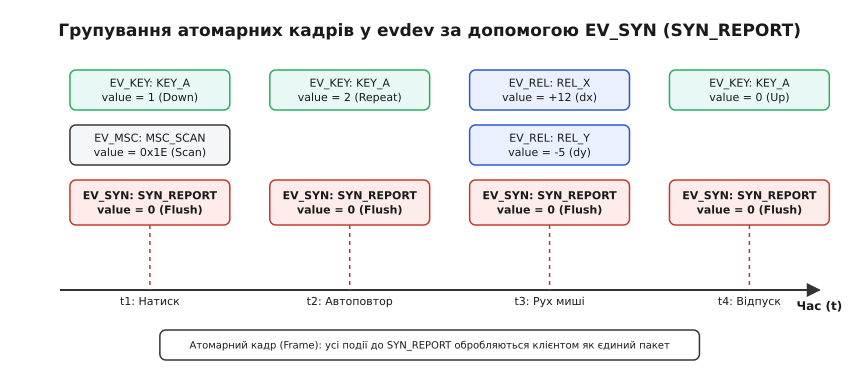
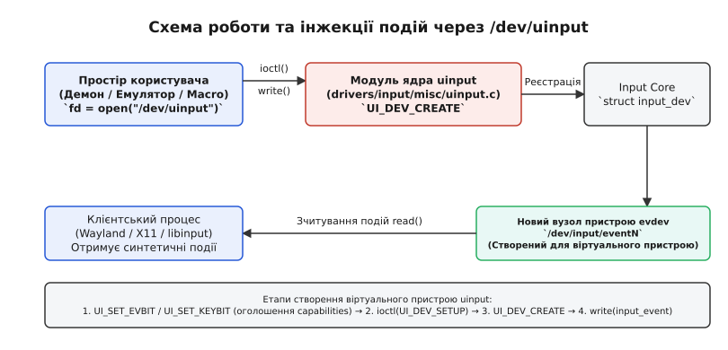

# Підсистема введення та події evdev (/dev/input/eventN)

<preknowlist>
- [Файл пристрою](root:sys-unix/device-file-model) — запис у `/dev`, що репрезентує драйвер пристрою у VFS.
- [Старший і молодший номери](root:sys-unix/major-minor-numbers) — нумерація символьних пристроїв для зв'язку з драйвером.
- [ioctl](root:sys-unix/ioctl-interface) — керуючі виклики драйвера для передачі системних команд та метаданих.
- [Блокуючий і неблокуючий режим](root:sys-unix/blocking-and-nonblocking) — читання файлових дескрипторів без очікування у неблокуючому режимі з прапорцем `O_NONBLOCK`.
- [epoll](root:sys-unix/select-poll-epoll) — мультиплексування подій від кількох пристроїв в одному потоці.
</preknowlist>

Натискання клавіші на USB-клавіатурі не породжує переривання саме по собі: хост-контролер періодично опитує клавіатуру службовою (interrupt) передачею і лише, отримавши пакет, виставляє переривання. Драйвер зчитує пакет шини, витягує сканкод і перетворює його на уніфіковане повідомлення ядра. Для програми у просторі користувача — чи це сервер графічного середовища Wayland, чи графічний движок гри, чи емулятор терміналу — це повідомлення з'являється як бінарний потік у символьному файлі `/dev/input/eventN`. Програма відкриває файл викликом `open()`, чекає на готовність даних у `epoll_wait()` і зчитує фіксовані бінарні структури `struct input_event`. 

За цією простотою криється підсистема введення ядра Linux (Input Subsystem) та її головний обробник — `evdev` (event device). Вона абстрагує тисячі різнорідних фізичних пристроїв (від класичних PS/2-мишей і USB-клавіатур до багатоточкових сенсорних панелей, акселерометрів, графічних планшетів Wacom і Force-Feedback керма) до єдиної подійної моделі.

## 1. Архітектура Input Subsystem: три рівні абстракції

До появи серії ядра Linux 2.4 кожен клас маніпуляторів мав власну схему драйверів і власний вузол у `/dev`. Пристрої PS/2 обслуговувалися через `/dev/psaux`, аналогові джойстики — через `/dev/js0`, а клавіатурні сканкоди надсилалися напряму у шар віртуальних терміналів TTY. Поява шини USB та динамічних описувачів HID (Report Descriptors) зробила таку схему нежиттєздатною: один фізичний корпус міг одночасно містити мишу, клавіатуру та мультимедійні кнопки. Історичні передумови та етапи розробки нової архітектури викладені у [історії створення уніфікованої підсистеми введення](root:sys-unix/evdev-codes-abi-and-ioctl/hist-linux-input-subsystem.md).

Сучасна підсистема введення побудована за трирівневою модульною архітектурою, яка повністю відокремлює фізичний транспорт від прикладної семантики.


*Шари підсистеми введення Linux: від фізичного контролера до обробника evdev та бібліотеки libinput.*

### Рівень 1: Апаратні драйвери (Device Drivers)
Драйвери нижнього рівня взаємодіють безпосередньо з апаратурою через відповідні шинні підсистеми:
- `usbhid` для пристроїв специфікації USB HID;
- `i2c-hid` для сенсорних панелей і екранів ноутбуків, підключених через шину I2C;
- `psmouse` та `atkbd` для традиційних PS/2 та AT маніпуляторів;
- `wacom` для графічних планшетів.

Завдання драйвера — обробити апаратне переривання у контексті переривання (Hard IRQ), зчитати сирий пакет даних від контролера пристрою, декодувати його у відкладеній обробці (Threaded IRQ або Workqueue) і викликати функції ядра `input_report_key()`, `input_report_rel()`, `input_report_abs()` та `input_sync()`. Драйвер не знає, які файли пристроїв відкриті у просторі користувача і хто є кінцевим споживачем даних.

### Рівень 2: Ядро підсистеми введення (Input Core)
Центральний модуль `drivers/input/input.c` діє як мультиплексор та маршрутизатор подій. При підключенні нового пристрою драйвер створює та реєструє структуру `struct input_dev`, заповнюючи бітові маски його можливостей (`evbit`, `keybit`, `relbit`, `absbit`). 

Input Core реєструє новий пристрій у підсистемі `sysfs` під шляхом `/sys/class/input/inputN` і генерує `uevent` для демона `udevd`. Демон `udevd`, отримавши сповіщення від ядра, створює відповідний файл пристрою у `/dev/input/eventN`, налаштовує права доступу та створює символічні посилання у каталогах `/dev/input/by-id/` та `/dev/input/by-path/`.

Коли драйвер генерує подію викликами `input_event()`, Input Core розсилає її копію всім прив'язаним обробникам подій (Event Handlers), які висловили зацікавленість у даному типі пристрою через виклик `input_match_device()`.

### Рівень 3: Обробники подій (Event Handlers)
Обробники подій створюють конкретні символьні файли пристроїв у каталозі `/dev/input/` та реалізують файлові операції VFS (`read`, `write`, `poll`, `ioctl`):
- **`evdev` (`/dev/input/eventN`):** Універсальний обробник, що передає незмінений потік подій у форматі `struct input_event`. Він не робить жодних припущень щодо призначення пристрою і підходить для будь-якого органу керування.
- **`mousedev` (`/dev/input/mice` та `/dev/input/mouseX`):** Шар сумісності, який емулює класичну PS/2-мишу для старих програм. Він транслює події `EV_REL` та `EV_KEY` від будь-яких мишей та тачпадів у 3-байтові пакети протоколу PS/2.
- **`joydev` (`/dev/input/jsN`):** Шар сумісності зі старим API джойстиків Linux (структура `struct js_event`).
- **`uinput` (`/dev/uinput`):** Спеціальний модуль, що дозволяє процесам простору користувача створювати віртуальні пристрої введення в ядрі.

У сучасних дистрибутивах Linux графічні сервери Wayland (Mutter, KWin, Sway) і Xorg беруть події з `evdev` через системну бібліотеку `libinput`, яка усуває відмінності між апаратними реалізаціями, фільтрує шум і розпізнає жести вже у просторі користувача.

## 2. Бінарний протокол: структура input_event та ABI сумісність

Символьні пристрої `/dev/input/eventN` мають старший номер **13**, а молодші номери виділяються динамічно, починаючи з **64** (діапазон 64–319 для `event0`–`event255`). Потік даних між ядром і простором користувача складається з послідовності бінарних структур `struct input_event`, визначених у `<linux/input.h>`.

```c
struct input_event {
    struct timeval time;   /* Часова позначка виникнення події */
    __u16 type;            /* Тип події (EV_KEY, EV_REL, EV_ABS, EV_SYN...) */
    __u16 code;            /* Код органу керування (KEY_A, REL_X, ABS_Y...) */
    __s32 value;           /* Стан, дельта зміщення або координата */
};
```


*Бінарна структура input_event: розміри полів, вирівнювання та відмінності між 32-бітним і 64-бітним ABI.*

### Вирівнювання та відмінності між 32-бітним і 64-бітним ABI

Поле `time` є структурою `struct timeval`, яка містить два поля: `tv_sec` (секунди) та `tv_usec` (мікросекунди). На розмір цієї структури фундаментально впливає розрядність архітектури та вирішення проблеми Y2038:

- **64-бітні системи (x86_64, aarch64, riscv64):** `tv_sec` та `tv_usec` мають розмір по 8 байтів (64 біти). Загальний розмір `struct timeval` становить 16 байтів. Поле `type` (2 байти), `code` (2 байти) та `value` (4 байти) займають 8 байтів. Загальний розмір `sizeof(struct input_event)` дорівнює **24 байтам**.
- **32-бітні системи зі старим ABI (armhf, i386 з 32-бітним time_t):** `tv_sec` та `tv_usec` мають розмір по 4 байти (32 біти). Загальний розмір `struct timeval` становить 8 байтів. Разом із полями типів розмір `sizeof(struct input_event)` дорівнює **16 байтам**.
- **Проблема 2038 року:** починаючи з ядра 4.16, заголовок `<linux/input.h>` описує час події не через `struct timeval`, а через окремі поля `input_event_sec` та `input_event_usec`. Розміру структури це не змінює: на 32-бітній архітектурі поля лишаються 32-бітними, тож `read()` віддає ті самі 16 байтів навіть тоді, коли libc уже перейшла на 64-бітний `time_t`. 32-бітну програму на 64-бітному ядрі обслуговує загальний шар сумісності (`CONFIG_COMPAT`) у `drivers/input/evdev.c`, який перепаковує і структури подій, і аргументи `ioctl` між двома розкладками.

> ⚠️ **Атомарність зчитування даних з evdev:**
> Системний виклик `read(fd, buf, count)` на пристрої `/dev/input/eventN` гарантує передачу лише цілої кількості структур `struct input_event`. Якщо буфер `count` менший за `sizeof(struct input_event)` (наприклад, спроба прочитати 10 байтів), виклик поверне `-1`, виставивши `errno` у `EINVAL`. Якщо у буфері ядра доступно 5 подій, а буфер користувача вміщує лише 3, ядро віддасть 3 події, а решту 2 залишить у кільцевому буфері для наступного `read()`.

### Внутрішня організація кільцевого буфера ядра та трасування викликів
Для кожного відкритого файлового дескриптора `evdev` ядро виділяє динамічну структуру `struct evdev_client`. Всередині неї розміщується кільцевий буфер `struct input_event buffer[client->bufsize]`. За замовчуванням розмір буфера дорівнює 64 або 128 елементам.

Послідовність виконання викликів усередині ядра Linux:
1. Апаратний драйвер викликає `input_event(dev, type, code, value)`.
2. Функція ядра `input_handle_event()` перевіряє бітові маски і передає подію у `input_pass_event()`.
3. Модуль `evdev` отримує подію у виклику `evdev_event()`, додає її у кільцевий буфер `client->buffer[client->head]` та оновлює індекс голови `client->head = (client->head + 1) & (client->bufsize - 1)`.
4. Якщо кільцевий буфер заповнюється до хвоста `client->tail`, ядро скидає масив і генерує `SYN_DROPPED`.
5. Ядро викликає `wake_up_interruptible(&client->wait)`, розбуджуючи процес, що очікував у системному виклику `read()` або `epoll_wait()`.

## 3. Класифікація типів подій (EV_*) та їхня внутрішня семантика

Перше поле структури — `type` — визначає інтерпретацію двох наступних полів `code` та `value`.

| Константа `type` | Числове значення | Семантичне призначення |
| :--- | :--- | :--- |
| **`EV_SYN`** | `0x00` | Маркери синхронізації та розділювачі атомарних кадрів. |
| **`EV_KEY`** | `0x01` | Зміна стану дискретних кнопок, клавіш та перемикачів. |
| **`EV_REL`** | `0x02` | Відносні координати та дельти зміщення (миша, трекбол, коліщатко). |
| **`EV_ABS`** | `0x03` | Абсолютні координати та параметри позиціонування (тачпад, тачскрин). |
| **`EV_MSC`** | `0x04` | Допоміжні та сирі події контролера (`MSC_SCAN` — сирий сканккод). |
| **`EV_SW`** | `0x05` | Стан бінарних фізичних тумблерів (кришка ноутбука, роз'єм навушників). |
| **`EV_LED`** | `0x11` | Керування світлодіодними індикаторами (Caps Lock, Num Lock). |
| **`EV_SND`** | `0x12` | Звукові сигнали та системний пищалик (Buzzer). |
| **`EV_REP`** | `0x14` | Налаштування автоповтору клавіатури (затримка та частота повтору). |
| **`EV_FF`** | `0x15` | Події зворотного зв'язку (Force Feedback для ігрових рулів і джойстиків). |
| **`EV_PWR`** | `0x16` | Події системного живлення. |

### Події синхронізації `EV_SYN`: атомарність кадрів
Пристрої введення зазвичай змінюють кілька параметрів одночасно. Наприклад, при косому русі миші оптичний сенсор одночасно фіксує зміщення по осях `X` та `Y`. Спроба обробити `REL_X` окремо від `REL_Y` призведе до артефактів та "східчастого" руху курсора.

Щоб запобігти цьому, `evdev` використовує концепцію **атомарного кадру (Frame)**. Драйвер надсилає послідовність окремих подій `EV_REL` або `EV_ABS`, а наприкінці пакета обов'язково генерує подію `EV_SYN` з кодом `SYN_REPORT` та значенням `0`.


*Групування атомарних кадрів у evdev за допомогою EV_SYN (SYN_REPORT).*

Коди подій `EV_SYN`:
- **`SYN_REPORT` (0):** Маркер завершення кадру. Отримувач зобов'язаний застосувати всі накопичені з останнього `SYN_REPORT` зміни осей і кнопок до свого внутрішнього стану пристрою.
- **`SYN_CONFIG` (1):** Повідомлення про зміну конфігурації пристрою.
- **`SYN_MT_REPORT` (2):** Маркер завершення кадру для окремого пальця у застарілому протоколі Multi-Touch Type A.
- **`SYN_DROPPED` (3):** Сигнал переповнення кільцевого буфера ядра. Якщо процес простору користувача зчитує дані занадто повільно, ядро скидає буфер подій і відправляє `SYN_DROPPED`. Після цього клієнт зобов'язаний заново запитати поточний стан усіх кнопок та осей через `ioctl(..., EVIOCGKEY/EVIOCGABS)`.

### Дискретні події `EV_KEY`
Події типу `EV_KEY` описують клавіатурні клавіші (коди `KEY_A`, `KEY_ENTER`, `KEY_LEFTCTRL`) та кнопки мишей чи джойстиків (`BTN_LEFT`, `BTN_RIGHT`, `BTN_SOUTH`, `BTN_TOUCH`).

Поле `value` при `EV_KEY` приймає три фіксовані значення:
- **`0`:** Клавішу або кнопку відпущено (Release).
- **`1`:** Клавішу або кнопку натиснуто (Press).
- **`2`:** Автоповтор клавіші (Autorepeat), згенерований таймером ядра.

### Відносні події `EV_REL`
Події `EV_REL` описують відносний приріст величини відносно попереднього стану. Для них не існує поняття "абсолютна позиція".
- **`REL_X` (0), `REL_Y` (1):** Зміщення миші по горизонталі та вертикалі у дискретних відліках (counts/dots).
- **`REL_WHEEL` (8):** Вертикальне прокручування коліщатка миші (`+1` вгору, `-1` вниз).
- **`REL_HWHEEL` (6):** Горизонтальне прокручування коліщатка.
- **`REL_WHEEL_HI_RES` (11):** Високоточне прокручування коліщатка миші (120 одиниць відповідають одному традиційному клацанню коліщатка, тобто одиниці `REL_WHEEL`).

### Абсолютні події `EV_ABS` та протокол Multi-Touch
Події `EV_ABS` віддають точну позицію органу керування на сенсорі. На відміну від відносних осей, абсолютні осі мають чіткі фізичні межі.
- **`ABS_X` (0), `ABS_Y` (1):** Координати первинного торкання або позиція стилуса.
- **`ABS_Z` (2):** Вертикальна вісь або заглиблення.
- **`ABS_PRESSURE` (24):** Сила тиску пальця або стилуса на графічному планшеті.
- **`ABS_TILT_X` (26), `ABS_TILT_Y` (27):** Кут нахилу пера планшета.

Сучасні тачпади та сенсорні екрани використовують специфікацію **Multi-Touch Protocol Type B (Slot-based)**. Кожному пальцю на екрані ядро виділяє слот:
- `ABS_MT_SLOT`: Номер активного слота (наприклад, 0, 1, 2).
- `ABS_MT_TRACKING_ID`: Унікальний ID торкання (-1 означає розмикання контакту).
- `ABS_MT_POSITION_X`, `ABS_MT_POSITION_Y`: Координати конкретного пальця.

Обчислення лінійного масштабування осей `EV_ABS`, робота з зоною нечутливості `flat` та відсікання джитеру `fuzz` формалізовано у [математичній обробці та фільтрації осей ABS](root:sys-unix/evdev-codes-abi-and-ioctl/math-evdev-abs-scaling.md).

### Перемикачі `EV_SW` та допоміжні події `EV_MSC`
Події типу `EV_SW` описують фізичні бінарні перемикачі, які зберігають свій стан тривалий час:
- `SW_LID` (0): Стан кришки ноутбука (1 — закрита, 0 — відкрита).
- `SW_TABLET_MODE` (1): Режим трансформації ноутбука у планшет.
- `SW_HEADPHONE_INSERT` (2): Підключення навушників у аудіороз'єм 3.5 мм.
- `SW_MICROPHONE_INSERT` (4): Підключення зовнішнього мікрофона.

Події типу `EV_MSC` передають сирі сканкоди контролера (`MSC_SCAN`) або апаратні часові позначки (`MSC_TIMESTAMP`), які дозволяють простору користувача виконувати точне налагодження драйверів.

### Зворотний зв'язок та тактильні двигуни (`EV_FF`)
Підсистема `EV_FF` (Force Feedback) дозволяє програмам надсилати команди тактильного зворотного зв'язку на ігрові керма, джойстики та вібромотори геймпадів. Програми завантажують ефекти у пам'ять контролера викликом `ioctl(fd, EVIOCSFF, &effect)`, отримують унікальний `effect_id`, після чого відправляють подію `EV_FF` із кодом `effect_id` та значенням кількості повторів.

Підтримуються такі типи ефектів:
- `FF_RUMBLE`: Просте вібрування з незалежним керуванням важким і легким вібромотором.
- `FF_PERIODIC`: Періодичні коливання (синусоїдальні, трикутні, прямокутні).
- `FF_CONSTANT`: Постійне силове зусилля заданого напрямку.
- `FF_SPRING`, `FF_FRICTION`, `FF_DAMPER`: Фізичні умови опору (пружина, тертя, демпфування) для ігрових керм.

## 4. Інспектування та контроль пристроїв через ioctl (EVIOC*)

Окрім зчитування потоку подій через `read()`, простір користувача повинен мати можливість дізнатися, що саме це за пристрій, які кнопки він має та які межі його осей. Для цього `evdev` надає багатий набір системних команд `ioctl`.

Повний перелік команд, структур та бітових масок наведено у [API-довіднику команди ioctl для evdev](root:sys-unix/evdev-codes-abi-and-ioctl/api-evdev-ioctl.md).

### Отримання метаданих та ідентифікаторів
За допомогою макросів `EVIOCGNAME`, `EVIOCGID`, `EVIOCGPHYS` програма зчитує паспортизацію пристрою:

```c
char name[256] = "Unknown";
struct input_id id;

/* Зчитати назву пристрою */
ioctl(fd, EVIOCGNAME(sizeof(name)), name);

/* Зчитати Vendor/Product ID */
ioctl(fd, EVIOCGID, &id);

printf("Device: %s (Vendor: 0x%04x, Product: 0x%04x, Bus: 0x%04x)\n",
       name, id.vendor, id.product, id.bustype);
```

### Запит capabilities через бітові маски (`EVIOCGBIT`)
Щоб з'ясувати, чи є пристрій клавіатурою, мишею чи тачпадом, використовується сімейство команд `EVIOCGBIT(ev_type, max_bytes)`. Ядро повертає масив довгих цілих чисел (`unsigned long`), у якому кожен біт відповідає підтримці відповідного коду події:

```c
#define BITS_PER_LONG (sizeof(unsigned long) * 8)
#define NBITS(x) ((((x) - 1) / BITS_PER_LONG) + 1)
#define test_bit(bit, array) ((array[(bit) / BITS_PER_LONG] >> ((bit) % BITS_PER_LONG)) & 1)

unsigned long evbit[NBITS(EV_MAX)] = {0};
ioctl(fd, EVIOCGBIT(0, sizeof(evbit)), evbit);

if (test_bit(EV_KEY, evbit) && test_bit(EV_ABS, evbit)) {
    /* Пристрій є сенсорним екраном або планшетом */
}
```

### Ексклюзивне захоплення пристрою (`EVIOCGRAB`)
У багатьох сценаріях (наприклад, у віртуальних машинах QEMU/KVM, іграх або комплексах віддаленого керування) необхідно перехопити ввід від конкретної клавіатури чи миші так, щоб події від неї **не потрапляли** до хостового графічного середовища.

Викликом `ioctl(fd, EVIOCGRAB, 1)` процес встановлює монопольне захоплення пристрою. З цього моменту ядро припиняє передачу подій даного `input_dev` усім іншим обробникам та іншим відкритим файловим дескрипторам `evdev`. Передача відновлюється після `ioctl(fd, EVIOCGRAB, 0)` або після закриття файлового дескриптора `close(fd)`.

## 5. Створення віртуальних пристроїв через /dev/uinput

Модуль ядра `uinput` (User Level Input Subsystem) дає змогу процесам простору користувача реєструвати нові пристрої введення в ядрі Linux. Це необхідно для реалізації демонів макросів, емуляторів геймпадів (наприклад, Steam Input), сервісів VNC/RDP та драйверів для нестандартного апаратного забезпечення.

Повний приклад реалізації на C та C++ з використанням `epoll` та `uinput` представлено у [практичному проекті асинхронного event loop та uinput](root:sys-unix/evdev-codes-abi-and-ioctl/proj-evdev-event-loop.md).


*Схема створення віртуального пристрою та інжекції подій через /dev/uinput.*

Процес створення віртуального пристрою складається з п'яти послідовних кроків:

1. **Відкриття файлу пристрою:** Процес відкриває `/dev/uinput` у режимі запису (`O_WRONLY | O_NONBLOCK`).
2. **Оголошення можливостей (Capabilities):** За допомогою команд `ioctl(ufd, UI_SET_EVBIT, ...)` та `ioctl(ufd, UI_SET_KEYBIT, ...)` процес повідомляє ядру, які типи подій та які саме клавіші чи осі підтримуватиме новий віртуальний пристрій.
3. **Заповнення специфікації пристрою:** Заповнюється структура `struct uinput_setup` (назва пристрою, Vendor ID, Product ID, Bus Type) і передається у ядро викликом `ioctl(ufd, UI_DEV_SETUP, &usetup)`.
4. **Створення пристрою у ядрі:** Виклик `ioctl(ufd, UI_DEV_CREATE)` змушує Input Core створити новий екземпляр `struct input_dev`, зареєструвати його у системі та створити для нього відповідний вузол `/dev/input/eventN`.
5. **Інжекція подій:** Процес відправляє події у ядро звичайним викликом `write(ufd, &ev, sizeof(ev))`, передаючи структури `struct input_event` з необхідними кодами та завершальним `SYN_REPORT`.

> 🔧 **Навіщо це.**
> Розуміння підсистеми `evdev` є базовою вимогою для розробки низькорівневого системного ПЗ під Linux: сервісів киосків (Kiosk Mode), перехоплювачів гарячих клавіш без залежностей від X11/Wayland, емуляторів введення для автоматизованого тестування GUI (UI Test Automation), сервісів віддаленого доступу та драйверів для кастомних промислових контролерів.

## 6. Безпека, розмежування прав та інтеграція з systemd-logind

Оскільки пряме зчитування символьного пристрою `/dev/input/eventN` дає змогу перехоплювати абсолютно всі натискання клавіш (включно з паролями у терміналі чи `sudo`), доступ до цих файлів обмежують. Сам вузол ядро створює у `devtmpfs` із правами `0600` для `root`; групу `input` і права `0660` йому призначають уже правила `udev`, які постачає дистрибутив.

У сучасних дистрибутивах Linux з графічними середовищами Wayland звичайні прикладні програми (наприклад, браузер чи текстовий редактор) **не мають прямих прав** на відкриття `/dev/input/eventN`. 

Замість цього застосовується безпечна схема розмежування доступу:
1. Системний демон `systemd-logind` виконує ролі привілейованого арбітра пристроїв.
2. При запуску сесії користувача менеджер вікон (Wayland Compositor) звертається до `systemd-logind` через системну шину D-Bus викликом `TakeDevice(major, minor)`.
3. `systemd-logind` відкриває потрібний вузол `/dev/input/eventN` у ядрі та передає відкритий файловий дескриптор менеджеру вікон через UNIX domain socket за допомогою механізму `SCM_RIGHTS`.
4. Менеджер вікон передає отримані дескриптори бібліотеці `libinput`, яка розбирає події і розсилає їх конкретним вікнам програм згідно з фокусом вводу.
5. При перемиканні віртуальної консолі (Ctrl+Alt+F2) демон `systemd-logind` надсилає композитору сигнал `PauseDevice`, а тоді відкликає сам дескриптор викликом `ioctl(fd, EVIOCREVOKE)` — після цього читання з нього повертає помилку, і події не витікають у неактивну графічну сесію.

## 7. Взаємодія з системною бібліотекою libinput

У сучасній архітектурі Linux графічні додатки та менеджери вікон (Wayland compositors) рідко зчитують `/dev/input/eventN` напряму. Натомість між `evdev` та прикладною програмою стоїть бібліотека `libinput`.

`libinput` вирішує завдання, які недоцільно реалізовувати всередині ядра Linux:
- **Обробка жестів тачпада:** Розпізнавання змикання/розмикання пальців (pinch-to-zoom), обертання та прокручування двома пальцями (two-finger scroll).
- **Фільтрація випадкових торкань (Palm Rejection):** Відсікання торкань долонею під час набору тексту на клавіатурі.
- **Акселерація та криві швидкості вказівника:** Масштабування відносного руху миші залежно від швидкості переміщення руки користувача.
- **Уніфікація Multi-Touch:** Трансляція подій Multi-Touch Protocol Type A та Type B у високорівневі події `LIBINPUT_EVENT_TOUCH_DOWN`, `MOVE`, `UP`.

Отже, ядро Linux через `evdev` надає чіткий, сирий і стандартизований бінарний протокол фізичних подій, а бібліотеки простору користувача перетворюють цей потік на високорівневі семантичні дії інтерфейсу.
