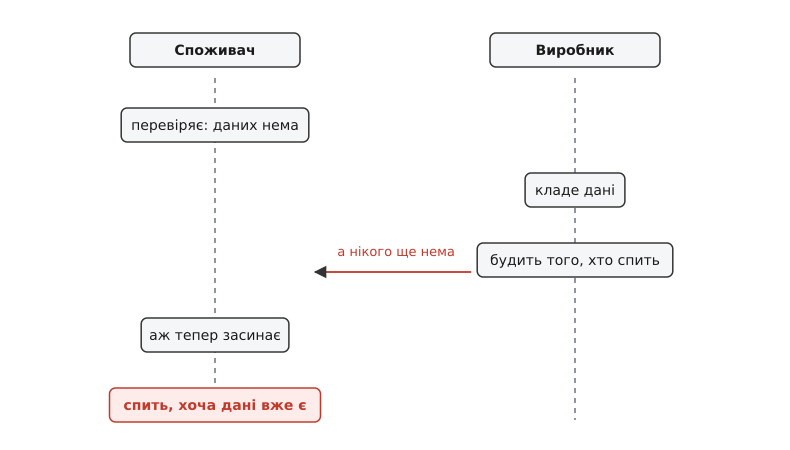
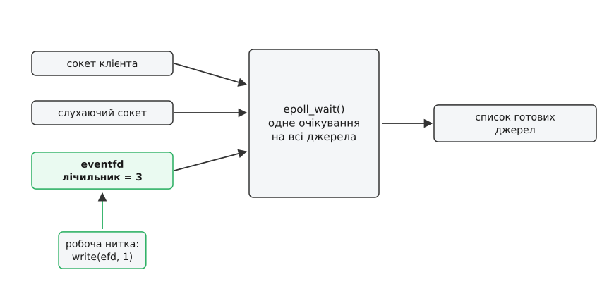
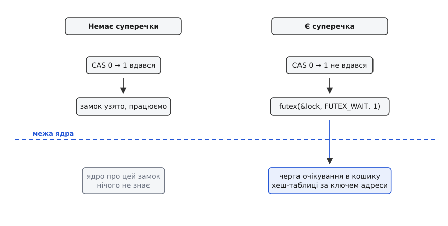

# eventfd і futex: сповіщення й дешеве очікування

<preknowlist>
- [Файловий дескриптор](root:sys-unix/file-descriptor) — число, за яким процес тримає відкритий обʼєкт ядра.
- [select, poll, epoll](root:sys-unix/select-poll-epoll) — як одна нитка чекає одразу на багато дескрипторів і дізнається, котрий із них готовий.
- [Блокуючий і неблокуючий режим](root:sys-unix/blocking-and-nonblocking) — що означає «виклик заснув» і що змінює `O_NONBLOCK`.
- [Системний виклик](root:sys-unix/syscall-mechanics) — як програма переходить у ядро й чому цей перехід не безкоштовний.
- [Черги очікування в ядрі](root:sys-unix/kernel-wait-queues) — механізм, яким ядро знімає задачу з процесора й повертає її назад.
- [Потоки як задачі](root:sys-unix/threads-as-tasks) — нитки одного процесу для планувальника є окремими задачами, які ділять адресний простір.
- [Атомарність і гонки](root:sf-tasks/atomicity-races) — атомарна операція «порівняй і заміни» (CAS) і гонка між перевіркою умови й дією за нею.
</preknowlist>

Програма тримає мережевий цикл: одна нитка спить, доки не прийдуть дані на котромусь із зʼєднань. Поруч працюють робочі нитки, які довго щось обчислюють. Одна з них дорахувала й має сказати про це циклові — а цикл спить.

Дотягтися до неї зсередини програми неможливо, і жодне вдале написання коду тут не рятує. Нитка, що спить, не виконується: процесор зараз зайнятий кимось іншим, і ваша інструкція «прокинься» просто нікуди не потрапить. Розбудити її може тільки той, хто її приспав, — ядро, бо саме воно зняло задачу з процесора й тримає її у своїй черзі очікування.

Отже, будь-яке сповіщення між нитками чи процесами мусить пройти через ядро. А кожен вхід у ядро — це системний виклик, і з цього моменту починається рахунок.

## Скільки коштує заснути

Сон виглядає як безкоштовна річ: задача нічого не робить, отже нічого не витрачає. Витрати сидять не в самому сні, а на його краях — у переходах.

Коли задача засинає, ядро ставить її у чергу очікування, позначає як «спить, її можна перервати сигналом» і викликає планувальник, щоб той віддав процесор комусь іншому. Пробудження робить зворотне: знімає задачу з черги, повертає в чергу готових, а якщо будити довелося з іншого ядра процесора — ще й посилає туди міжпроцесорне переривання. Коли задача нарешті поїде далі, її кеші вже холодні: за час сну їх витіснив хтось інший.

**Умова: дві нитки обмінюються 200 000 подій на секунду, і кожна подія коштує один системний виклик на подачу та один на прийом.**

```
вхід у ядро й повернення   ≈ 150 нс   (сучасне x86-64 із латками проти Spectre/Meltdown)
приспати + розбудити       ≈ 2 мкс    (планувальник, перемикання, холодні кеші)
на одну подію              = 2 · 150 нс + 2 мкс ≈ 2.3 мкс
200 000 · 2.3 мкс          = 0.46 с процесорного часу за секунду
```

Числа тут — порядок величини, а не паспортні дані: вони помітно різняться між поколіннями процесорів і залежать від увімкнених пом'якшень. Але висновок від точності не залежить: майже половина ядра процесора йде не на роботу, а на домовляння про роботу.

У цьому рахунку два доданки різної природи, і кожен породжує своє питання.

Перший — сам сон. У циклу подій він нікуди не дінеться: цикл на те й цикл, щоб спати, доки нема чого робити. Питання тут інше — **як приєднати чуже сповіщення до вже наявного очікування**, не заводячи другого сну й другої нитки.

Другий — системні виклики. Замкові (мʼютексу) сон здебільшого взагалі не потрібен: суперечка за замок трапляється рідко, а решту разів замок вільний. Питання — **як не платити за вхід у ядро тоді, коли в ядро йти не треба**.

`eventfd` відповідає на перше питання, `futex` — на друге. Але перш ніж розійтися, обидва мусять обійти ту саму пастку.

## Пастка втраченого пробудження

Спробуймо найпростіше сповіщення: споживач дивиться, чи є дані, і якщо нема — засинає; виробник кладе дані й будить сплячого. Виглядає бездоганно, поки не подивитися на проміжок часу між двома діями споживача.



*Пробудження, подане до того, як хтось заснув, не лишає сліду: споживач засинає вже після нього й не прокидається ніколи.*

Споживач перевірив — порожньо. Поки він іде до засинання, виробник устигає покласти дані й подати пробудження. Але будити ще нема кого: черга очікування порожня, і пробудження нікуди не записується. Аж тепер споживач лягає спати — на умову, яка вже виконана. Він спатиме, доки не надійде наступна подія, а якщо вона була остання, то назавжди.

Звідси випливає вимога, спільна для всіх механізмів цього роду. Сповіщення не може бути миттєвою подією, що існує лише в момент подання: воно мусить лишати **слід — стан, який переживе проміжок між перевіркою й засинанням**. І рішення «спати чи не спати» мусить ухвалюватися атомарно з переглядом цього сліду, тим самим механізмом, а не двома окремими діями програми.

`eventfd` робить слідом лічильник. `futex` переносить саму перевірку всередину системного виклику. Це два різні способи закрити ту саму щілину.

## eventfd: лічильник, який можна чекати як файл

Цикл подій спить у `epoll_wait`, а той знає лише дескриптори. Отже, сповіщення ззовні мусить виглядати як дескриптор — інакше його нема куди подіти.

Довгий час це робили каналом: заводили [канал](root:sys-unix/pipe-and-fifo), його читальний кінець клали в набір `epoll`, а пробудженням був один байт, записаний у протилежний кінець. Прийом старий і робочий, але плата за нього непропорційна: два дескриптори замість одного, буфер ядра на 64 КіБ, копіювання байтів туди й назад. Гірше те, що буфер може заповнитися: якщо цикл забарився й не вичитує, письменник або блокується, або дістає `EAGAIN` — а блокуватися тому, хто подає сповіщення, зазвичай не можна взагалі.

`eventfd` — це той самий прийом, з якого прибрали все зайве. Виклик віддає **один** дескриптор, за яким у ядрі стоїть **одне 64-бітове беззнакове число**:

- `write(efd, &v, 8)` додає `v` до лічильника;
- `read(efd, &v, 8)` віддає накопичене значення й обнуляє лічильник; із прапорцем `EFD_SEMAPHORE` — віддає 1 і зменшує лічильник на одиницю;
- дескриптор вважається готовим на читання, доки лічильник більший за нуль, і готовим на запис, доки в нього є куди додати;
- стеля — `0xfffffffffffffffe`; спроба записати `0xffffffffffffffff` дає `EINVAL`, бо це значення навмисно лишили неможливим, щоб переповнення не плуталося з даними;
- якщо додавання вийшло б за стелю, запис блокується (або дає `EAGAIN`) — сповіщення **накопичуються, а не губляться**.

Готовність тут — це стан лічильника, а не миттєва подія: хто б і коли не написав, слід лишається до вичитування. Щілина з попереднього малюнка закрита самою будовою обʼєкта.

Друга властивість випливає з того, що лічильник додає. Сто сповіщень, які прийшли, поки цикл був зайнятий, — це не сто байтів у буфері, а число 100, яке цикл дістане **одним** читанням і одразу знатиме, скільки подій злилося в одну.



*Робоча нитка не будить цикл подій напряму — вона пише в eventfd, і цикл дізнається про це там само, де дізнається про мережеві дані.*

```c
#include <sys/eventfd.h>
#include <sys/epoll.h>
#include <unistd.h>
#include <stdint.h>

int efd = eventfd(0, EFD_CLOEXEC | EFD_NONBLOCK);

/* робоча нитка, коли дорахувала: */
uint64_t one = 1;
write(efd, &one, sizeof one);              /* лічильник += 1 */

/* цикл подій, разово: */
struct epoll_event ev = { .events = EPOLLIN, .data.fd = efd };
epoll_ctl(ep, EPOLL_CTL_ADD, efd, &ev);

/* цикл подій, на кожній ітерації: */
if (fired.data.fd == efd) {
    uint64_t n;
    if (read(efd, &n, sizeof n) == (ssize_t)sizeof n)
        collect_results(n);                /* n — скільки разів нас смикнули */
}
```

`EFD_NONBLOCK` тут не оптимізація, а умова коректності: цикл подій не має права заснути всередині `read`, бо тоді він перестане обслуговувати решту дескрипторів. `EFD_CLOEXEC` закриває дескриптор на `exec`, щоб він не протік у дочірню програму.

> 🔧 **Навіщо це.** `eventfd` — стандартна розетка, якою підсистеми ядра втикаються у ваш цикл подій. `KVM` дає `ioeventfd`: запис гостя за вказаною адресою вводу-виводу позначає ваш `eventfd` готовим, замість виходити з віртуальної машини в код емулятора (`irqfd` — та сама розетка навпаки: із вашого запису в `eventfd` він робить переривання всередині гостя). [io_uring](root:sys-unix/io-uring-rings-model) реєструють з `eventfd`, щоб поява завершень будила звичайний `epoll`-цикл. Старий асинхронний ввід-вивід ядра має поле `aio_resfd` рівно з тією ж метою. Той самий обʼєкт закриває й потребу [розбудити цикл із обробника сигналу](root:sys-unix/async-signal-safety): `write` у `eventfd` дозволений у такому контексті, на відміну від майже всього іншого.

Ціна такої зручності видна з коду: подача — це системний виклик, прийом — теж. Дешевшим за канал `eventfd` робить не відсутність викликів — їх стільки ж, — а те, що за ним стоїть одне число замість двох дескрипторів і буфера. А злиття додає до цього своє: під навантаженням цикл платить одне читання за багато подій.

## futex: не платити, коли платити нема за що

Тепер друге питання. Візьмімо мʼютекс і подивімося, що відбувається у звичайному випадку — коли замок вільний.

Замок — це слово в памʼяті, яку нитки бачать спільно. Взяти вільний замок означає атомарно змінити в цьому слові 0 на 1. Якщо операція вдалася, всередині нікого не було: замок ваш, і ядро в цьому не брало участі жодним чином. Воно й не могло б додати нічого корисного — спати нема за чим, а весь обмін звівся до однієї атомарної інструкції ціною десятків наносекунд.

Ядро потрібне лише в рідкісному випадку: атомарна заміна не вдалася, замок у когось є, і нитці таки треба заснути. Отже, добрий замок мусить уміти заходити в ядро **тільки тоді**. А це має наслідок, сильніший, ніж здається: поки ніхто не чекає, ядро не повинно знати про замок **взагалі нічого** — ні обʼєкта, ні дескриптора, ні реєстрації. Обʼєкт очікування має виникати на вимогу, у мить появи першого охочого заснути, і зникати разом із ним.

Такий механізм і назвали **futex** (англ. *fast userspace mutex* — швидкий мʼютекс простору користувача).

Виклик має вигляд `futex(uaddr, FUTEX_WAIT, val, timeout, NULL, 0)` і читається так: «заснути на адресі `uaddr`, але тільки якщо там усе ще лежить `val`».

Ця умова — і є відповідь на пастку втраченого пробудження. Ядро бере замок потрібного кошика своєї хеш-таблиці, читає слово за адресою, порівнює з `val` — і лише за збігу ставить задачу в чергу. Якщо значення вже інше (власник відпустив замок у проміжку між вашою невдалою атомарною заміною й системним викликом), ви дістаєте `EAGAIN` і повертаєтеся не заснувши. Перевірка й засинання відбуваються під одним замком, тож щілини між ними просто нема.

Зворотний бік — `futex(uaddr, FUTEX_WAKE, n, …)`: розбудити щонайбільше `n` тих, хто стоїть у черзі цієї адреси; виклик повертає, скількох розбудив насправді. Для мʼютексу `n` дорівнює одиниці, для «сповістити всіх» — `INT_MAX`.



*Швидкий шлях не перетинає межу ядра взагалі, тому ядро не тримає для замка жодного обʼєкта, доки не зʼявиться перший охочий заснути.*

Слово має бути 32-бітове й вирівняне на чотири байти. Що означають його значення, ядро не знає й не хоче знати: воно вміє з ним рівно дві дії — порівняти й полічити тих, хто чекає. Уся семантика замка лишається у вашому коді.

Черги живуть у хеш-таблиці, а ключ кошика рахують з адреси. Для **приватного** futex (прапорець `FUTEX_PRIVATE_FLAG`, зʼявився в ядрі 2.6.22) ключ — це пара «адресний простір + віртуальна адреса»: дешево, без жодного заглядання в таблиці сторінок. Для **спільного** ключ будують із самого обʼєкта памʼяті — inode й зсув у ньому. Саме тому два процеси, які відобразили [спільну памʼять](root:sys-unix/posix-shared-memory) за різними віртуальними адресами, все одно потрапляють в один кошик і бачать один замок. Приватність треба просити явно: без цієї позначки ядро мусить розвʼязувати адресу до обʼєкта памʼяті на кожному виклику, навіть коли замок нікуди за межі процесу не виходить.

> 🔧 **Навіщо це.** Прямий виклик `futex(2)` у прикладному коді — рідкість: у glibc немає навіть обгортки, треба йти через `syscall()`. Але на futex стоїть майже вся синхронізація, якою ви користуєтеся: `pthread_mutex_lock`, [семафори POSIX](root:sys-unix/posix-semaphores), умовні змінні, `std::mutex` у C++, планувальник горутин у Go, `park`/`unpark` у Java. Коли пишуть, що незайнятий мʼютекс коштує близько двох десятків наносекунд, — це вартість атомарної інструкції, а futex є причиною, чому в тому рядку не стоїть «два мікросекунди».

Наївний замок на futex має рівно два стани — 0 «вільно» і 1 «взято» — і працює правильно, але відпускання в ньому щоразу викликає `FUTEX_WAKE`, бо власник ніяк не може знати, чи чекає хтось. Третій стан («взято, і є ті, хто чекає») прибирає цей виклик зі швидкого шляху: тепер відпускання дивиться на слово й іде в ядро лише тоді, коли там двійка. Як це виглядає в коді, де саме ховається гонка в двостановій версії і чому цикл навколо `FUTEX_WAIT` обовʼязковий — у розборі [мʼютекс на futex, від наївного до правильного](root:sys-unix/eventfd-and-futex/proj-futex-mutex.md).

Цикл навколо очікування потрібен ще й тому, що `FUTEX_WAIT` має право повернутися без причини: пробудження могло призначатися сусідові, чергу могли перенести на іншу адресу, або виклик [перервав сигнал](root:sys-unix/eintr-and-restart). Це не вада, а прямий наслідок будови: ядро не знає вашої умови, воно знає лише слово, тож остаточну перевірку робить той, хто цю умову задав.

Навколо базової пари виросло ще три речі, кожна з яких лікує свою конкретну болячку. **PI-futex** тримає у слові ідентифікатор власника, і ядро може тимчасово підняти йому пріоритет, щоб той швидше вийшов, — це прибирає [інверсію пріоритетів](root:sf-os/priority-inversion) у реальночасових задачах. **Стійкий (robust) список** дає ядру знати, які спільні замки тримає процес: якщо він помер усередині критичної ділянки, ядро позначить замок як `FUTEX_OWNER_DIED` і розбудить решту, замість лишити їх у вічному сні. **`futex_waitv`** (ядро 5.16) дозволяє чекати одразу на кілька futex-слів одним викликом.

Історію обох механізмів — від доповіді «Fuss, Futexes and Furwocks» на Ottawa Linux Symposium 2002 до `futex_waitv`, який приїхав у ядро заради ігор під Wine, — розібрано окремо: [звідки взялися futex і eventfd](root:sys-unix/eventfd-and-futex/hist-futex-birth.md).

## Чому одне не заміняє друге

Тепер видно, що це не два способи зробити те саме, а дві протилежні угоди.

futex не має дескриптора — і не може мати, бо весь виграш саме в тому, що ядро не заводить обʼєкта. Замок не покласти в `epoll`, не передати іншому процесові через сокет, не побачити в `lsof`. `futex_waitv` дозволяє чекати на кілька слів, але не змішує їх із сокетами: очікування на futex і очікування на дескриптори лишаються двома різними світами.

`eventfd`, навпаки, є дескриптором з усіма наслідками — його можна покласти в будь-яке очікування, передати [через сокет домену Unix](root:sys-unix/unix-domain-sockets), успадкувати через `fork`, побачити в `/proc`. Плата за це стала: за обʼєктом у ядрі стоїть памʼять, а кожне сповіщення коштує запис і читання.

Звідси й правило вибору. Якщо очікування здебільшого **не потрібне** — замок беруть і віддають мільйони разів на секунду, а суперечка трапляється зрідка — це futex, тобто звичайні мʼютекси й умовні змінні, без жодного власного коду. Якщо подію треба **приєднати до очікування на дескриптори** — це `eventfd`. У живій програмі найчастіше є обидва: цикл подій прокидається через `eventfd`, а всередині робочих ниток стоять мʼютекси на futex.

Що вибір справді важить, показує вже згаданий Wine: віндове очікування на кілька обʼєктів синхронізації там спершу збудували на `eventfd`, а потім переписали на `futex_waitv`. Механіка пояснює напрямок переходу: шлях через `eventfd` платить системним викликом на кожній події там, де futex здебільшого в ядро не йде.

## Ціна невидимості

Та сама відмінність вилазить у найгіршу мить — коли програма зависла.

`eventfd` видно звідусіль: він є в `/proc/PID/fd`, його показує `lsof`, а нитка стоїть у `epoll_wait` зі списком дескрипторів, який можна прочитати. Замок на futex не видно ніде: обʼєкта з іменем у ядрі нема, кошик хеш-таблиці про ваш код нічого не знає. Усе, що дасть [трасування](root:sys-unix/syscall-tracing), — рядок на кшталт `futex(0x7f2c…, FUTEX_WAIT_PRIVATE, 2, NULL)` і адреса слова, а хто саме те слово тримає, доводиться відновлювати з памʼяті процесу й знання про будову бібліотеки.

Це не недогляд, а та сама угода, дочитана до кінця. Механізм, який навмисне залишається невидимим для ядра, поки все гаразд, лишається невидимим і тоді, коли вже негаразд.
