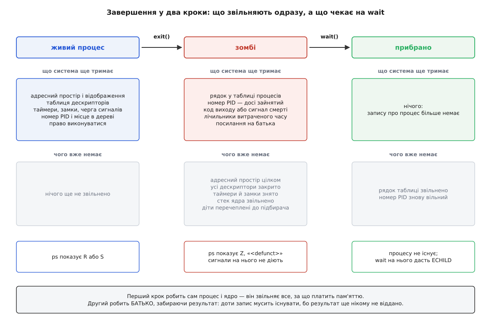
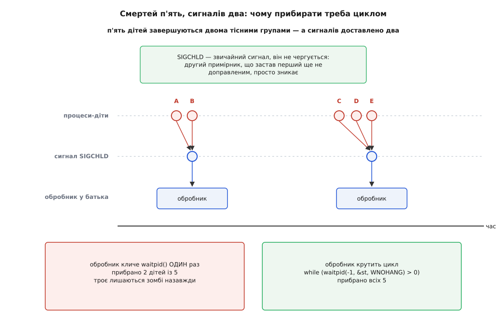
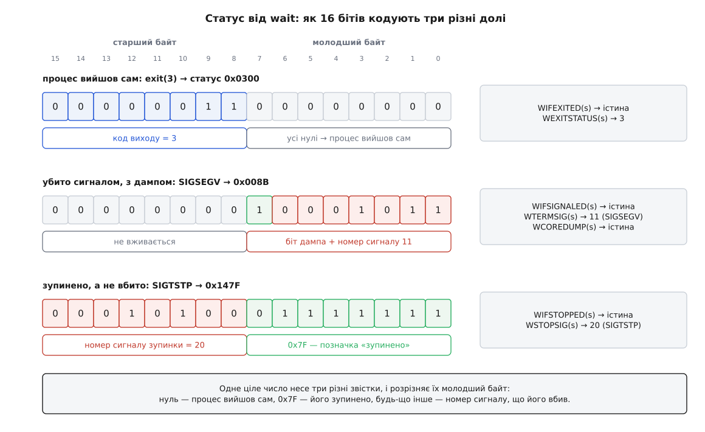
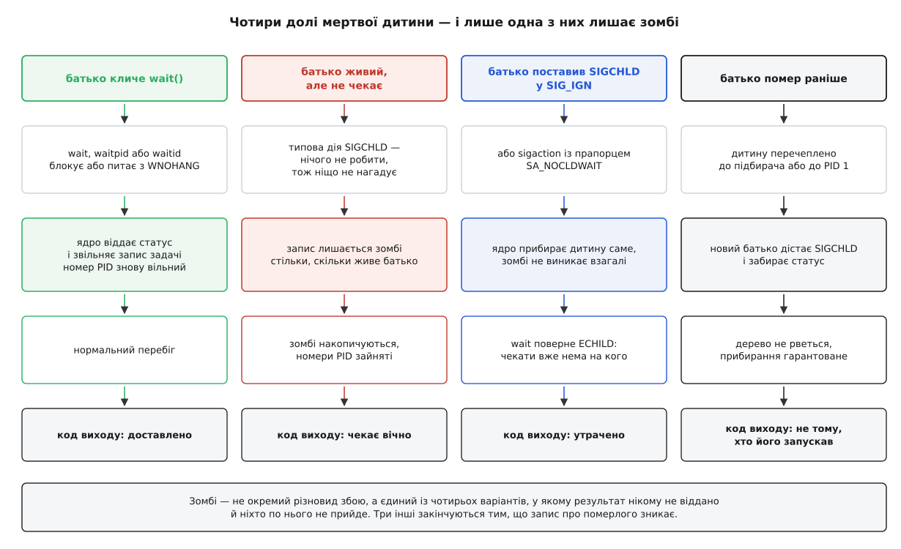

# Завершення, wait і зомбі

<preknowlist>
- [Процес: що це насправді](topic:sys-unix/process-model) — процес володіє адресним простором, таблицею дескрипторів і власною ідентичністю, і ці власності живуть за різними правилами.
- [PID і дерево процесів](topic:sys-unix/pid-and-hierarchy) — кожен процес має номер і батька; усі процеси утворюють дерево, у якому кожен, крім першого, комусь належить.
- [fork: розмноження процесу](topic:sys-unix/fork-semantics) — новий процес народжується копією того, хто його попросив, тож у нього завжди є конкретний батько, і батько знає його номер.
- [Сигнал: асинхронне сповіщення](topic:sys-unix/signal-model) — ядро вміє перервати процес звісткою; звичайні сигнали не чергуються, а лише позначаються прапорцем «є недоправлений».
- [Код виходу як інтерфейс програми](topic:sys-unix/exit-status) — програма віддає системі невелике число, і нуль означає успіх.
</preknowlist>

Кожна програма закінчується числом. `return 0` наприкінці `main`, `exit(2)` посеред роботи, аварійний вихід зі скрипта — усе це врешті одне й те саме: процес каже, чим скінчилося те, що він робив. Питання, з якого починається вся ця тема, звучить нахабно просто: **кому** він це каже?

Адресат цілком конкретний, і в нього є ім'я. `make` мусить знати, чи зібрався об'єктний файл, бо від цього залежить, чи кликати лінкер. Оболонка кладе число в `$?`, і на ньому тримається `&&`. Наглядач служби вирішує, перезапускати робітника чи вважати, що той відпрацював. Усі троє — той самий процес: батько, який цю дитину й запустив.

І тут з'являється складність, з якої виростає геть усе інше. Батько **не обов'язково дивиться саме зараз**. Він може щось рахувати, спати в `read` на сокеті, чекати на іншу дитину. Мить, коли дитина завершується, і мить, коли батько по результат приходить, — це дві різні миті, і порядок між ними довільний.

Отже, результат треба десь **зберегти** до запитання. Питання «де» відповідає на себе саме, щойно перебрати варіанти. У пам'яті самого процесу — не можна: саме її звільняють, і звільняють насамперед. У файлі — теж ні: файл треба десь створити, комусь прибрати, а надійність тут потрібна така сама, як у самих номерів процесів. Лишається єдине місце, яке не залежить від того, чи є ще процес: **структури ядра**.

Звідси головний висновок теми, і решта є його наслідками. Завершення процесу — не одна подія, а **дві**, рознесені в часі: спершу процес звільняє все, за що система платить, а потім хтось забирає його результат. І між цими двома подіями процесу вже немає, а запис про нього ще є.

## Смерть у два кроки

Коли процес кличе `exit`, ядро (у функції з промовистою назвою `do_exit`) робить довгий і цілком буденний перелік справ. Закриває всі дескриптори — а це означає, що канали на тому кінці дістають ознаку кінця файлу, а мережеві з'єднання розриваються. Знімає таймери. Відпускає блокування записів у файлах. Розбирає адресний простір: скидає таблиці сторінок, вертає системі кадри пам'яті, відв'язує відображені файли. Передає своїх дітей, якщо вони є, іншому батькові. Звільняє стек ядра, на якому щойно виконувався.

Після цього від процесу лишається дивна річ: **запис без нічого**. Виконувати нема чого, пам'яті немає, дескрипторів немає — а рядок у таблиці процесів є, і в ньому лежать номер, код виходу (або сигнал, що вбив), лічильники витраченого процесорного часу й посилання на батька.



*Перший крок звільняє все, за що система платить пам'яттю; другий, який робить батько викликом `wait`, прибирає те, що лишалося тільки заради нього.*

Ця половинчаста річ має власне ім'я — **зомбі** (гаїтянське креольське *zonbi* — мрець, піднятий чаклуном: тіло є, того, хто в ньому жив, немає). Ім'я не пізніша журналістська метафора: константа `SZOMB` із коментарем «проміжний стан у завершенні процесу» стоїть у заголовку `proc.h` уже в шостій редакції Unix 1975 року й переходить звідти в сьому. Утиліта `ps` показує такий процес станом `Z`, а замість назви команди пише `<defunct>` (лат. *defunctus* — «той, що відслужив»).

Отже, зомбі — не збій, не витік і не наслідок чиєїсь помилки. Це **штатна фаза** життя процесу: у звичайному перебігу крізь неї проходить кожен, а різниця лише в тому, скільки він у ній пробуде — мілісекунди чи назавжди. Виняток один, і він теж штатний: якщо батько наперед відмовився від результату, ядро прибирає запис тієї ж миті — і зомбі, якого можна було б побачити в `ps`, не виникає взагалі. Про цей випадок — нижче, у розділі про чотири долі.

> 🔧 **Навіщо це.** Звідси відповідь на найчастішу практичну спробу: `kill -9` на зомбі не робить нічого й не може зробити. Сигнал доставляють задачі, щоб вона на нього зреагувала, — а зомбі не виконує коду й не здатен виконати: у нього немає ані адресного простору, ані стека. Прибрати зомбі спроможний лише той, хто по нього не прийшов, — його батько. Тому в реальній роботі шукають не зомбі, а **батька зомбі**: `ps -o ppid= -p <pid>`, і далі розбираються вже з ним.

## Чому номер не звільняють одразу

Здавалося б, номер — найдешевше, що можна віддати негайно: процес не виконується, отже, число вільне. Але саме цього робити не можна, і причина рівно та ж, з якої треба зберігати результат.

Батько тримає в себе номер дитини — його повернув [fork](topic:sys-unix/fork-semantics). Доки батько не забрав результат, він має право цим номером користуватися: послати `SIGTERM`, спитати стан у `/proc`, знайти дитину у своїй таблиці робітників. Якщо ядро звільнить номер тієї миті, коли дитина перестала виконуватися, воно зможе видати те саме число новому процесові — і батьків `kill` полетить у чужого. Вікно між «дитина померла» і «батько це помітив» цілком реальне, а вбити не свого робітника — наслідок серйозний.

Тому номер лишається зайнятим доти, доки живий зомбі. Це не побічний ефект, а гарантія: **доки батько не забрав результат, номер його дитини не дістанеться нікому**. Гарантія тримається на власності — і зникає тієї самої миті, коли батько кличе `wait`. Про те, як ту саму задачу розв'язують дескриптори процесів, що взагалі не спираються на номери, — у темі [PID і дерево процесів](topic:sys-unix/pid-and-hierarchy).

## Сповіщення: SIGCHLD

Батько мусить якось дізнатися, що є по що приходити. Опитувати систему в циклі — марна витрата: смерть дитини трапляється рідко, а опитування коштує щоразу.

Тому ядро сповіщає батька саме: щойно дитина стала зомбі, батькові надсилають сигнал `SIGCHLD`. Типова дія для нього — **не робити нічого**, і це навмисне: програма, якій байдуже до дітей, не має спотикатися через їхню смерть. Хто хоче реагувати — ставить обробник.

Але тут ховається пастка, невидима, доки дітей мало. `SIGCHLD` — звичайний сигнал, а звичайні сигнали **не чергуються**: ядро тримає для кожного номера один біт «є недоправлений». Другий `SIGCHLD`, що надійшов, поки перший ще не доправлено, просто зникає — біт уже стоїть.



*Сигналів завжди не більше, ніж смертей, і буває менше: один запуск обробника може означати кількох мертвих дітей одразу.*

Наслідок прямий: **кількість доставлених сигналів менша за кількість смертей**. Обробник, який кличе `waitpid` рівно один раз, прибере одну дитину з групи, а решта лишиться зомбі — і лишатиметься, доки не помре сам батько. Помилка підступна тим, що на тестах із однією дитиною її не видно взагалі.

Правильна форма тому одна:

```c
static void on_sigchld(int sig) {
    (void)sig;
    int saved = errno;                    /* обробник не має права псувати errno */
    while (waitpid(-1, NULL, WNOHANG) > 0)
        ;                                 /* забираємо ВСІХ, хто вже готовий */
    errno = saved;
}
```

`WNOHANG` тут не оптимізація, а необхідність: без нього цикл, забравши останню готову дитину, заблокувався б на наступному оберті — усередині обробника сигналу, тобто спинивши всю програму невідомо надовго. З ним виклик, не знайшовши готових, негайно повертає нуль, і цикл закінчується.

Сам обробник — місце з дуже вузькими правами: він перериває програму в довільній інструкції, тому в ньому не можна ні виділяти пам'ять, ні писати в `stdio`, ні брати замки ([що взагалі можна робити в обробнику](topic:sys-unix/async-signal-safety)). `waitpid` до дозволеного належить, а `errno` доводиться зберігати руками саме через це. Хто не хоче цих обмежень зовсім — перетворює сигнал на читання з дескриптора через [signalfd](topic:sys-unix/signal-mask-signalfd) або відмовляється від `SIGCHLD` на користь [дескриптора процесу](topic:sys-unix/pid-and-hierarchy/proj-pidfd-supervisor.md), який стає читабельним рівно тоді, коли дитина перетворилася на зомбі.

`SIGCHLD` приходить не лише на смерть. Дитина, яку зупинили з термінала або сигналом `SIGSTOP`, теж змінила стан, і батько дізнається про це тим самим сигналом — якщо не попросив зворотного прапорцем `SA_NOCLDSTOP`. Тобто сигнал каже «щось із дитиною сталося», а що саме сталося — з'ясовує вже `wait` ([керування завданнями](topic:sys-unix/job-control)).

## Забрати результат: родина wait

Виклик, яким батько приходить по результат, у найпростішій формі не має параметрів, крім місця під відповідь. `wait(&status)` блокує того, хто його викликав, доки бодай одна його дитина не завершиться, і повертає її номер. Якщо готова дитина вже є, повернення миттєве.

«Будь-яка дитина» рідко буває тим, що треба, тому в ужитку майже завжди `waitpid(pid, &status, options)`. Перший аргумент звужує ціль тим самим знаковим словником, що й `kill`: додатне число — конкретна дитина, `-1` — будь-яка, `0` — будь-яка з групи процесів того, хто чекає, від'ємне — будь-яка з групи `-pid`. Прапорці в третьому аргументі кажуть, на що саме реагувати: `WNOHANG` — не блокуватися взагалі, `WUNTRACED` — повідомляти й про зупинених, `WCONTINUED` — і про відновлених.

Ще один виклик, `waitid`, розділяє те, що в `waitpid` злите в одне число: різновид цілі окремо, номер окремо. Він же додає прапорець, якого більше ніде немає, — `WNOWAIT`, «подивитися, не забираючи»: статус читається, а зомбі лишається на місці, і по нього можна прийти ще раз.

Дві помилки трапляються постійно й означають зовсім різне. `ECHILD` — «чекати нема на кого»: у процесу немає дітей узагалі або немає саме тієї, про яку питали. Це не збій, а нормальний кінець циклу очікування. `EINTR` — виклик перервано сигналом, що прийшов до того, як щось сталося; результату немає, треба повторити ([перервані виклики й перезапуск](topic:sys-unix/eintr-and-restart)).

Дві властивості очікування дивують найчастіше. Перша: чекати може **лише батько**. Дід не забере статусу онука, сусід — статусу чужої дитини, і жодні права root тут не допомагають. Це не обмеження доступу, а прямий наслідок того, що результат адресний: він призначений одному конкретному процесові. Друга: у багатопотоковій програмі чекати може **будь-який потік**, а не тільки той, що кликав `fork`, — бо дитина належить процесові, а не потокові ([потоки як задачі ядра](topic:sys-unix/threads-as-tasks)).

Повний перелік підписів, прапорців, полів `siginfo_t` і кодів помилок цієї родини зібрано окремо: [контракт родини wait](topic:sys-unix/exit-wait-zombies/api-wait-family.md). Там же видно, чим `wait4` відрізняється від `waitpid` і які поєднання прапорців взаємно виключні.

## Одне число на три різні звістки

Тепер про те, що саме лежить у `status`.

Виклик має рівно один вихідний параметр — покажчик на `int`. Так було в ранньому Unix, так лишилося. А розказати треба більше, ніж одне число: процес міг вийти сам із кодом, міг бути вбитий сигналом, міг бути не вбитий, а зупинений і потім відновлений. Це три різні звістки, і всі три мусять поміститися в одне ціле.

Розв'язок — розділити слово на два байти й зробити молодший байт **розрізнювачем**, а старший — полем, зміст якого залежить від молодшого.



*Молодший байт відповідає на питання «як саме скінчилося», і лише від його значення залежить, що означає старший.*

Читати цей поділ треба в одному-єдиному порядку — спершу молодший байт:

- він нульовий — процес вийшов сам, і його код лежить у старшому байті;
- він дорівнює `0x7F` — процес не помер, а зупинився, і в старшому байті номер сигналу, що його зупинив;
- будь-що інше — процес убито, у молодших семи бітах номер сигналу-вбивці, а восьмий біт каже, чи лишився після нього [аварійний дамп](topic:sys-unix/core-dump).

Саме тому статус ніколи не розбирають арифметикою, а користуються макросами — вони і є ця перевірка, записана раз і правильно. Порядок їх виклику не довільний: спитати `WEXITSTATUS` у процесу, якого вбив сигнал, означає прочитати сміття, бо старший байт у нього несе зовсім інше.

**Розбір статусу, який покриває всі три випадки.**

```c
int status;
pid_t pid = waitpid(child, &status, WUNTRACED);
if (pid < 0) { perror("waitpid"); return 1; }

if (WIFEXITED(status)) {
    printf("вийшов сам, код %d\n", WEXITSTATUS(status));
} else if (WIFSIGNALED(status)) {
    printf("убито сигналом %d%s\n", WTERMSIG(status),
           WCOREDUMP(status) ? " (з дампом)" : "");
} else if (WIFSTOPPED(status)) {
    printf("зупинено сигналом %d\n", WSTOPSIG(status));
}
```

Ті самі три випадки в числах, без макросів:

```
дитина зробила exit(3)
  status                = 3 << 8 | 0    = 0x0300
  status & 0x7F         = 0x00          → молодший байт нульовий → вийшла сама
  (status >> 8) & 0xFF  = 3             → те, що поверне WEXITSTATUS

дитину вбито SIGSEGV (11), дамп записано
  status                = 0x80 | 11     = 0x008B
  status & 0x7F         = 11            → не 0 і не 0x7F → убито
  status & 0x80         = 0x80          → WCOREDUMP: дамп є

дитину зупинено SIGTSTP (20)
  status                = 20 << 8 | 0x7F = 0x147F
  status & 0xFF         = 0x7F          → позначка «зупинено», а не вбито
  (status >> 8) & 0xFF  = 20            → те, що поверне WSTOPSIG
```

З цієї розмітки випливає обмеження, з яким рано чи пізно стикається кожен: **код виходу — це вісім бітів, і жодним більше**. Функція `exit` бере `int`, але до батька доходить лише молодший байт того `int`.

```
exit(0)     → батько бачить 0
exit(3)     → батько бачить 3
exit(-1)    → батько бачить 255      (−1 у доповняльному коді — усі одиниці)
exit(256)   → батько бачить 0        (молодший байт числа 256 нульовий)
exit(1000)  → батько бачить 232      (1000 − 3·256 = 232)
```

Останні два рядки — класичне джерело мовчазної біди: програма, що повертає кількість знайдених помилок як код виходу, при рівно 256 помилках відзвітує про повний успіх.

Звідси ж і домовленість оболонки. `$?` теж лише один байт, тож оболонка не може окремо сказати «вийшов з кодом 11» і «убитий сигналом 11». Вона розводить ці випадки самотужки: за смерть від сигналу *n* ставить `128 + n`, тому вбитий `SIGSEGV` дає 139, а перерваний з клавіатури — 130. Домовленість зручна, але не однозначна: програма, яка сама зробила `exit(139)`, у `$?` не відрізняється від тієї, що впала. Розрізнити їх здатен лише той, хто дивиться на справжній статус із `wait`, — а оболонка вже цього статусу не показує ([код виходу як інтерфейс програми](topic:sys-unix/exit-status)).

## exit, _exit і exit_group

Слово «завершитися» ховає три різні речі на трьох різних рівнях, і плутанина між ними коштує втрачених даних.

`_exit()` (він же `_Exit()`) — тонка обгортка над системним викликом: керування йде в ядро й не повертається. Нічого, крім описаного вище прибирання, не стається.

`exit()` — функція бібліотеки. Перед тим як покликати ядро, вона проганяє **весь відкладений хвіст програми**: обробники, зареєстровані через `atexit` і `on_exit`, деструктори глобальних об'єктів у C++, а тоді спорожнює всі буфери `stdio` ([буферизація stdio](topic:sys-unix/stdio-buffering)). Вихід з `main` через `return` — це той самий `exit`: значення, яке ти повернув, стає його аргументом.

Різниця між двома викликами — це різниця між «недописаний рядок журналу опинився у файлі» і «зник назавжди». І та сама різниця робить `_exit` обов'язковим у дитині після `fork`: дитина успадкувала копію батькових буферів, і `exit` у ній надрукував би вдруге те, що батько ще тільки збирається надрукувати.

Третій рівень — ядерний, і побачити його можна лише в багатопотоковій програмі. Процес завершується цілком, з усіма своїми потоками, — за це відповідає системний виклик `exit_group`, і саме його кличуть **обидві** бібліотечні функції: і `exit()`, і `_exit()`. Тому `return` з `main` кладе всю програму, хоч би скільки потоків у ній ще працювало, і `_exit()` у дитині після `fork` — теж.

Системний виклик `exit` — інший: він кладе **тільки ту задачу, яка його викликала**, і саме ним закінчує роботу окремий потік. Із C до нього не дістатися жодною бібліотечною функцією родини `exit`: сирий виклик доводиться робити через `syscall(SYS_exit, …)` — так його й кличе `pthread_exit`, а не прикладний код. Зомбі при цьому з'являється один — на весь процес, а не на кожну задачу.

## Коли батько не приходить

Тепер видно, як виникає єдиний по-справжньому поганий випадок. Батько живий, дитина мертва, `wait` ніхто не кличе — і зомбі лишається рівно доти, доки живий батько.

Що саме тоді закінчується? Не пам'ять: запис задачі — це кілька кілобайтів структур ядра, тож навіть повністю вибрана стеля номерів — це порядок сотні мегабайтів, на сучасній машині дрібниця. Закінчується **простір номерів**. Значення `pid_max` на класичних налаштуваннях — 32768, і кожен зомбі тримає одне число зайнятим. Крім того, кожен зомбі рахується проти обмеження на кількість процесів свого користувача й проти лічильника контролера `pids` у контрольній групі ([ліміти ресурсів](topic:sys-unix/resource-limits), [cgroups](topic:sys-unix/cgroups-resource-model)). Тобто служба, що плодить зомбі, спершу перестає давати запускатися чому-небудь **під тим самим користувачем**, і тільки згодом псує життя всій системі.

Ознака в `ps` — стан `Z`, який ні з чим не сплутати ([стани процесу](topic:sys-unix/process-states)). Ліки — не в зомбі, а в батькові: полагодити його або перезапустити. Перезапуск працює тому, що зі смертю батька всі його зомбі перечепляться до підбирача, і той їх негайно прибере.

Два поширені уявлення про зомбі при цьому хибні. Зомбі **не витрачає процесорного часу** — він не виконується взагалі, тож коли в `top` щось гріє процесор, це не він. І зомбі **не тримає пам'яті процесу**: увесь адресний простір звільнено ще на першому кроці, і `ps` показує йому нульовий обсяг саме тому.

Побачити всю механіку на власній машині — зробити зомбі, переконатися, що `kill -9` на нього не діє, прочитати його рядок у `/proc`, а тоді змусити кілька смертей злитися в один `SIGCHLD` — можна невеликою програмою: [лабораторія зомбі](topic:sys-unix/exit-wait-zombies/proj-zombie-lab.md).

## Чотири долі мертвої дитини

Випадків, у які потрапляє щойно померла дитина, рівно чотири, і зомбі назавжди — лише один з них.



*Три варіанти закінчуються тим, що запис про померлого зникає; лишає зомбі лише той, у якому результат нікому не віддано й ніхто по нього не прийде.*

Третій варіант потребує пояснення, бо виглядає як подарунок, а насправді є вибором із втратою. Якщо батько **явно** поставив `SIGCHLD` у `SIG_IGN` (або скористався прапорцем `SA_NOCLDWAIT` у `sigaction`), ядро прибирає його дітей саме, і зомбі не виникає взагалі. Ціна — статус зникає безслідно, а `wait` у такого процесу повертає `ECHILD`, навіть коли діти в нього є й вони щойно померли.

Тут криється тонкість, на якій ловляться регулярно: `SIG_DFL` і `SIG_IGN` для `SIGCHLD` — **не одне й те саме**, хоч типова дія й полягає в тому, щоб нічого не робити. Типова диспозиція означає «сигнал нікуди не веде», і зомбі при ній створюються як завжди. Явне `SIG_IGN` означає «результат мені не потрібен, прибирай сам». Різниця в поведінці разюча, а в коді — одна константа ([диспозиція сигналу](topic:sys-unix/signal-disposition)).

Практична пастка звідси така. Бібліотека, яка при ініціалізації ставить `SIGCHLD` у `SIG_IGN`, ламає в цій самій програмі `system()`, `popen()` і будь-який власний код, що чекає на дітей: усі вони дістануть `ECHILD` замість статусу. Диспозиція ще й успадковується через `fork`, тож ефект поширюється на дітей — а от `exec` таке `SIG_IGN` має право скинути, і поведінка стає різною до й після заміни образу ([exec: заміна образу](topic:sys-unix/exec-semantics)).

Ця пара винятків — спадок System V, де існував сигнал `SIGCLD` із семантикою, помітно відмінною від берклійського `SIGCHLD`. Звідки взялася розбіжність, чому вона трималася десятиліттями і як стандарт її врешті розсудив — окремо: [звідки взялися wait і зомбі](topic:sys-unix/exit-wait-zombies/hist-wait-and-zombie.md).

## PID 1 і контейнери

Четвертий варіант — перепідпорядкування — має наслідок, через який ця тема регулярно вибухає в контейнерах.

Коли батько помирає раніше за дитину, дитина не лишається без батька: її передають найближчому предкові, що оголосив себе підбирачем, а якщо такого немає — процесові з номером 1 ([сироти й перепідпорядкування](topic:sys-unix/orphan-reparenting)). Разом із дитиною новий батько дістає й обов'язок: коли вона помре, `SIGCHLD` прийде саме йому, і забирати статус доведеться йому.

Звідси головна вимога до будь-якого PID 1: він **мусить** у циклі кликати `waitpid(-1, …)` і прибирати всіх, хто до нього прийшов, — зокрема тих, кого він ніколи не запускав і про кого нічого не знає ([роль init і особливість PID 1](topic:sys-unix/init-and-pid1)).

У контейнері номер 1 дістається не спеціально написаному init, а тому, що вказали в образі, — часто це звичайний сервер або скрипт оболонки. Такий процес про свій новий обов'язок не здогадується: він чекає на власних дітей і більше ні на кого. Кожен онук, що осиротів десь у глибині, стає зомбі й лишається ним до кінця життя контейнера. Саме тому в оснастку контейнерів додали крихітні init: `tini` (його вмикає `docker run --init`), `dumb-init` або повноцінний менеджер служб усередині образу.

Гострішим це робить [простір імен процесів](topic:sys-unix/namespaces): у ньому PID 1 — не тільки підбирач, а й процес, зі смертю якого ядро вбиває всіх решту в цьому просторі. Тобто в контейнері обов'язок прибирати й обов'язок жити зійшлися на одному процесі, і помилка в ньому коштує одразу двох речей.

## Облік часу дістається лише тому, хто поховав

Прибирання має ще один наслідок, про який зазвичай не думають, — облік витраченого часу.

Ядро рахує час процесу двома кошиками: скільки той пробув у власному коді й скільки — у ядрі. Коли дитину прибирають, її час не зникає, а **додається до батькового рахунку за дітей** — саме звідти беруть числа `getrusage(RUSAGE_CHILDREN)` і `times()`. Додається він рівно в момент прибирання і рівно тому, хто прибрав.

Наслідок несподіваний і практичний: батько, що не кличе `wait`, не тільки лишає зомбі, а й **не бачить**, скільки часу з'їли його діти. Виклик `wait4` існує саме для того, щоб забрати статус і облік одним рухом:

```c
int status;
struct rusage ru;
pid_t pid = wait4(child, &status, 0, &ru);
/* ru.ru_utime і ru.ru_stime — час саме цієї дитини, а не сума за всіх */
```

Так працює вбудований `time` в оболонці: він запускає команду, чекає на неї — і числа, які друкує, є тим рахунком, що дістався йому в мить прибирання ([облік процесорного часу](topic:sys-unix/cpu-time-accounting)).

## Правило, з якого все випливає

Крізь усю тему проходить одне правило, ширше за процеси: **результат має власника, і система не викидає того, по що власник ще може прийти**.

З нього виводиться все перелічене. Запис про померлого живе, бо результат ще не віддано. Номер лишається зайнятим, бо власник має право ним користуватися й система не сміє підсунути йому чужого. Дерево процесів не рветься, бо в кожного результату мусить бути кому дістатися. Обов'язок PID 1 прибирати чужих онуків — не милосердя, а те саме правило, доведене до кореня дерева. Навіть облік часу підпорядкований йому: час дитини переходить не «нагору взагалі», а тому, хто по неї прийшов.

І звідси ж — чому зомбі неможливо полагодити з боку самого зомбі. Він не помилка виконання, а **порожній конверт із адресою**, який ніхто не забрав. Прибирає його не той, хто його бачить, а той, кому він адресований.
