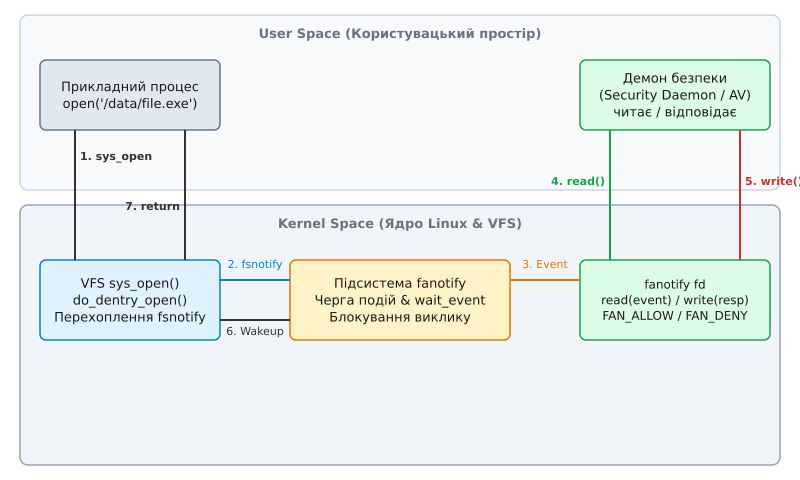
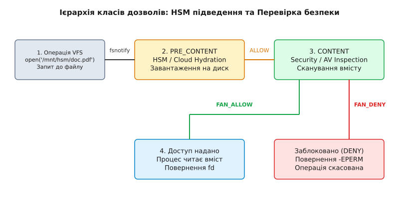

# Розширений моніторинг файлів fanotify: перехоплення FAN_OPEN_PERM

<preknowlist>
- [Inode](root:sys-unix/inode-model) — безіменний об'єкт ядра, що зберігає метадані та адреси блоків даних.
- [Каталог як відображення імен](root:sys-unix/directory-as-mapping) — таблиця відповідності між іменами та номерами inode у файловій системі.
- [Розбір шляху](root:sys-unix/at-family-syscalls) — механізм ядра для перетворення рядка шляху на об'єкт VFS.
- [Стеження за змінами: inotify і fanotify](root:sys-unix/inotify-and-fanotify) — асинхронні сповіщення файлових подій та їхні принципові обмеження.
</preknowlist>

Користувач запускає у терміналі бінарний файл `/tmp/untrusted_app` або відкриває документ із підробленим вкладенням. Асинхронний монітор файлової системи на базі `inotify` надсилає сповіщення про створення чи відкриття файлу через п'ять мілісекунд — але до цього часу процес `untrusted_app` уже зчитав конфігураційні файли з приватними ключами, зашифрував вміст домашньої директорії або завантажив шкідливу бібліотеку в оперативну пам'ять. Реактивна модель «повідомити після факту» безсила проти загроз виконання: файл змінено або прочитано до того, як спостерігач у користувацькому просторі встигне зреагувати.

Щоб зупинити небажану операцію, сповіщення має передувати самій дії. Ядро Linux мусить зупинити системний виклик напівдорозі, винести файл на перевірку демону безпеки й очікувати на його вердикт: надати файловий дескриптор чи негайно відмовити з помилкою `-EPERM`. Саме цю задачу вирішують синхронні події дозволу підсистеми fanotify — `FAN_OPEN_PERM`, `FAN_ACCESS_PERM` та `FAN_OPEN_EXEC_PERM`.

> 🔧 **Навіщо це.** Синхронне перехоплення подій дозволу fanotify є фундаментом для створення антивірусних сканерів прямого доступу (on-access scanning), систем запобігання витоку даних (DLP), інструментів контролю виконання бінарних файлів у контейнерах та підсистем прозорого завантаження хмарних файлів на вимогу (HSM / Cloud Hydration).

## Перехоплення у VFS: як ядро блокує системний виклик

Системний виклик `open()` або `openat()` не звертається до диска напряму. Він проходить через [спільний шар VFS](root:sys-unix/inotify-and-fanotify), де ядро перевіряє права доступу, знаходить відповідний [inode](root:sys-unix/inode-model) і готує внутрішню структуру `struct file`.

Траєкторія системного виклику у коді ядра Linux має такий вигляд:

```
sys_open() 
  └── do_sys_open()
        └── do_filp_open()
              └── path_openat()
                    └── do_dentry_open()
                          └── fsnotify_open_perm()
                                └── fsnotify_perm()
```

Саме у середині функції `do_dentry_open()` розміщено гачок підсистеми `fsnotify`. На відміну від асинхронних подій, які відправляються у чергу після завершення відкриття файлу, гачок дозволу `fsnotify_open_perm()` викликається **до того**, як файл буде остаточно відкрито й підключено до таблиці файлових дескрипторів прикладного процесу.

Функція `fsnotify_perm()` перевіряє активні маски сповіщень на точці монтування `mnt->mnt_fsnotify_mask` та на самому inode `inode->i_fsnotify_mask`. Якщо ядро бачить, що для даного об'єкта зареєстровано активний підписник із маскою `FAN_OPEN_PERM`, воно зупиняє звичайний хід відкриття файлу.

Коли спрацьовує перехоплення, ядро виконує такі внутрішні кроки:

1. Виділяє пам'ять під структуру ядра `struct fanotify_perm_event`.
2. Поміщає цю структуру у спискову чергу подій fanotify-групи `group->notification_list`.
3. Переводить потік прикладного процесу (`current task_struct`) у стан сну за допомогою виклику `wait_event_killable(group->fanotify_data.access_waitq, ...)` — на окремій черзі відповідей, не на тій, де демон чекає нових подій.
4. Блокує далі виконання операції `do_dentry_open()` до моменту зміни стану об'єкта події.

Заблокований потік перебуває у стані очікування в ядрі. З точки зору користувацького процесу системний виклик `open()` просто «зависає» у мить виконання, не споживаючи процесорного часу.

Детальніше про те, як розробники ядра Linux долали побоювання щодо зациклень та розробили цей механізм, описано в [історії створення та еволюції подій дозволу fanotify](root:sys-unix/fanotify-fsnotify-permission-events/hist-fsnotify-perm-evolution.md).

## Архітектура синхронного циклу перехоплення

Взаємодія між прикладним процесом, шаром VFS та демоном безпеки у користувацькому просторі побудована на двосторонньому каналі зв'язку через єдиний файловий дескриптор fanotify.



*Синхронний цикл перехоплення: процес блокується у VFS до отримання вердикту FAN_ALLOW або FAN_DENY від демона.*

Ланцюжок виконання події дозволу складається з п'яти послідовних кроків:

1. **Ініціація виклику:** Прикладний процес викликає `open()`. Потік переходить у режим ядра.
2. **Перехоплення та зупинка:** Гачок `fsnotify` у VFS генерує подію `FAN_OPEN_PERM`, додає її до черги fanotify-групи і блокує прикладний потік.
3. **Читання події демоном:** Демон безпеки викликає `read()` на своєму `fanotify_fd`. Ядро повертає структуру метаданих `struct fanotify_event_metadata`, яка містить PID викликача та **спеціальний анонімний файловий дескриптор** `fd` для доступу до файлу.
4. **Прийняття рішення:** Демон перевіряє файл (читає сигнатури через наданий `fd` або перевіряє права PID). Після цього демон формує структуру `struct fanotify_response` із вердиктом `FAN_ALLOW` (дозволити) або `FAN_DENY` (заборонити) і записує її у `fanotify_fd` за допомогою `write()`.
5. **Розблокування:** Ядро отримує відповідь, розблоковує прикладний потік і завершує системний виклик `open()`. При вердикті `FAN_ALLOW` процес отримує свій дескриптор; при `FAN_DENY` виклик скасовується, а процес отримує помилку `-EPERM`.

## Двостороння мова між ядром та демоном

Центральним елементом протоколу є передача анонімного файлового дескриптора. Коли демон читає метадані події `FAN_OPEN_PERM`, ядро самостійно відкриває цей файл у контексті ядра за допомогою функції `dentry_open()` та створює новий файловий дескриптор у таблиці файлів демона. Цей дескриптор повертається у полі `metadata->fd`.

Це вирішує принципову проблему: демону не потрібно самостійно розбирати шлях до файлу або викликати `open()`. Більше того, читання вмісту файлу через переданий `fd` **не генерує повторних подій fanotify**: ядро позначає такий файл прапорцем `FMODE_NONOTIFY`, і гачки `fsnotify` мовчки пропускають усі операції над ним.

:::tabs
```c
struct fanotify_event_metadata {
    uint32_t event_len;      /* Загальний розмір запису */
    uint8_t  vers;           /* Версія метаданих */
    uint8_t  reserved;       
    uint16_t metadata_len;   
    uint64_t mask;           /* Маска події (FAN_OPEN_PERM) */
    int32_t  fd;             /* Дескриптор файлу від ядра */
    int32_t  pid;            /* PID викликача */
};
```
```cpp
#include <cstdint>

struct fanotify_event_metadata {
    std::uint32_t event_len;      // Загальний розмір запису
    std::uint8_t  vers;           // Версія метаданих
    std::uint8_t  reserved;       
    std::uint16_t metadata_len;   
    std::uint64_t mask;           // Маска події (FAN_OPEN_PERM)
    std::int32_t  fd;             // Дескриптор файлу від ядра
    std::int32_t  pid;            // PID викликача
};
```
:::

Після перевірки вмісту демон надсилає ядру структуру відповіді:

:::tabs
```c
struct fanotify_response {
    int32_t  fd;         /* Дескриптор події з metadata.fd */
    uint32_t response;   /* Вердикт: FAN_ALLOW або FAN_DENY */
};
```
```cpp
#include <cstdint>

struct fanotify_response {
    std::int32_t  fd;         // Дескриптор події з metadata.fd
    std::uint32_t response;   // Вердикт: FAN_ALLOW або FAN_DENY
};
```
:::

Коли ядро отримує структуру `fanotify_response` через системний виклик `write()`, воно знаходить за дескриптором `resp.fd` відповідний об'єкт `fanotify_perm_event`, записує отриманий вердикт у поле `event->response` і будить прикладний потік на черзі відповідей: `wake_up(&group->fanotify_data.access_waitq)`.

Прикладний потік прокидається у ядрі, зчитує записаний вердикт і діє відповідно:
- Якщо вердикт **`FAN_ALLOW`**, функція `do_dentry_open()` продовжує роботу, підключає файл до таблиці процесів і повертає ціле число файлового дескриптора прикладній програмі.
- Якщо вердикт **`FAN_DENY`**, функція `do_dentry_open()` перериває роботу, звільняє підготовлену структуру `struct file` і повертає код помилки **`-EPERM`** (Operation not permitted).

Головне правило при обробці подій дозволу: **демон зобов'язаний закрити `fd` події за допомогою `close()` одразу після надсилання відповіді**. Якщо демон надішле `FAN_ALLOW`, але забуде закрити `fd`, у системі виникне витік дескрипторів, що швидко призведе до вичерпання лімітів таблиці файлів (`EMFILE`).

Повний перелік системних викликів, констант і прапорців наведено у [довіднику точок входу та структур fanotify](root:sys-unix/fanotify-fsnotify-permission-events/api-fanotify-perm-reference.md).

## Ієрархія класів та підведення даних (HSM)

При створенні групи `fanotify_init()` розробник вказує клас підписника. Коли для одного файлу зареєстровано кілька демонів (наприклад, система відновлення файлів із хмари та антивірусний сканер), ядро викликає їх у суворому порядку пріоритетів.



*Ієрархія обробки: спочатку демон HSM підтягує вміст файлу через PRE_CONTENT, після чого демон безпеки сканує його у класі CONTENT.*

Порядок ієрархії обробки подій у ядрі Linux є таким:

1. **`FAN_CLASS_PRE_CONTENT`**: Найвищий пріоритет. Використовується демонами HSM (Hierarchical Storage Management) та підсистемами прозорого підведення даних. Якщо файл на локальному диску є лише порожнім заповнювачем (stub file), демон `PRE_CONTENT` отримує подію першим. Він завантажує реальні дискові блоки з віддаленого хмарного сховища, записує їх на локальний диск і повертає `FAN_ALLOW`.
2. **`FAN_CLASS_CONTENT`**: Другий пріоритет. Викликається лише після того, як усі демони класу `PRE_CONTENT` підтвердили доступ. Антивірусний демон аналізує вже повністю завантажений на диск вміст файлу і приймає рішення про допуск.
3. **`FAN_CLASS_NOTIF`**: Найнижчий пріоритет. Викликається після того, як операція успішно відбулася. Використовується для звичайного асинхронного моніторингу та ведення логів.

Якщо демон класу `PRE_CONTENT` поверне `FAN_DENY` (наприклад, через відсутність мережевого з'єднання із хмарою), ядро негайно скасовує `open()` і взагалі не викликає демонів класу `CONTENT`, зберігаючи процесорний час системи.

## Перехоплення виконання: `FAN_OPEN_EXEC_PERM`

До версії ядра 5.0 розробники мали лише загальну маску `FAN_OPEN_PERM`. Вона спрацьовувала на будь-яке відкриття файлу — для читання, запису чи аналізу. Це створювало величезне навантаження на систему: демон мусив аналізувати тисячі тимчасових текстових файлів та логів.

Впровадження маски **`FAN_OPEN_EXEC_PERM`** дозволило виділити ті відкриття, які ядро робить з наміром виконати файл. Гачок спрацьовує тоді, коли файл відкривається з прапорцем `FMODE_EXEC` — тобто на `execve()`, `execveat()` та застарілому `uselib()`. Спільні бібліотеки під цю маску **не** потрапляють: `ld-linux.so` відкриває `.so` звичайним `open()` і лише потім відображає їх з `PROT_EXEC`, тож демон бачить їх як звичайні `FAN_OPEN_PERM`.

У коді ядра траєкторія перехоплення бінарників проходить через виклики:

```
do_execveat_common()
  └── do_open_execat()          /* відкриття з FMODE_EXEC */
        └── do_filp_open()
              └── do_dentry_open()
                    └── fsnotify_open_perm()
```

Завдяки `FAN_OPEN_EXEC_PERM` демон безпеки може контролювати цілісність бінарного коду: перевіряти цифрові підписи ELF-файлів або вираховувати хеш-суми безпосередньо перед тим, як код потрапить у простір пам'яті процесу.

## Простеження через sysfs та procfs

Для діагностики та контролю роботи fanotify ядро Linux надає сервісні інтерфейси у псевдофайлових системах `/proc` та `/sys`.

### 1. Інспекція відкритого дескриптора через `/proc/<pid>/fdinfo/`

Адміністратор або розробник може дізнатися, які саме мітки та маски встановлено демоном моніторингу, прочитавши файл інформації про дескриптор:

```bash
cat /proc/1234/fdinfo/5
```

Типовий вміст запису fdinfo для fanotify-дескриптора:

```
pos:    0
flags:  02000002
mnt_id: 21
fanotify flags:10 event-flags:0
fanotify mnt_id:21 mflags:0 mask:50000 ignored_mask:0
```

У рядку `fanotify mnt_id` вказується ідентифікатор точки монтування, а `mask` містить бітову маску встановлених подій: `50000` — це саме `FAN_OPEN_PERM` (0x10000) разом із `FAN_OPEN_EXEC_PERM` (0x40000).

### 2. Системні ліміти підсистеми у `/proc/sys/fs/fanotify/`

Ядро обмежує ресурси, які може споживати fanotify-група, трьома системними параметрами:
- `/proc/sys/fs/fanotify/max_queued_events` — максимальна кількість подій, яка може перебувати у черзі очікування демона (за замовчуванням 16384).
- `/proc/sys/fs/fanotify/max_user_marks` — максимальна кількість міток, яку один користувач може встановити на файли та каталоги.
- `/proc/sys/fs/fanotify/max_user_groups` — максимальна кількість fanotify-груп, яку може створити один користувач.

## Небезпека взаємного блокування (Self-Deadlock)

Найнебезпечніша пастка при розробці демонів перехоплення — взаємне блокування (self-deadlock).

Припустимо, демон безпеки перехоплює події `FAN_OPEN_PERM` на точці монтування `/home`. Користувач відкриває файл `/home/user/test.txt`. Ядро зупиняє процес і віддає подію демону. Демон у відповідь вирішує записати лог у файл `/home/daemon/audit.log` або викликає `stat("/home/user/test.txt")` за шляхом.

Викликавши `open()` або `stat()` за шляхом на тій самій файловій системі, демон сам спровокує нову подію `FAN_OPEN_PERM`. Потік демона зупиниться в ядрі, очікуючи на відповідь від fanotify-групи. Але єдиний демон, який може дати відповідь — це він самий, і він уже заблокований у очікуванні системного виклику.

```
Процес користувача -> open("/home/user/file") -> чекає на Демон
Демон -> відкриває "/home/daemon/log" -> генерує нову подію -> чекає сам на себе!
РЕЗУЛЬТАТ: Глухий кут (Deadlock). Системний виклик зависає назавжди.
```

Щоб запобігти взаємному блокуванню, демон безпеки повинен дотримуватися трьох обов'язкових правил:

1. **Фільтрація за PID:** Перевіряти PID викликача (`event->pid`). Якщо `event->pid == getpid()`, негайно повертати `FAN_ALLOW`.
2. **Робота суто через `event->fd`:** Ніколи не відкривати файл повторно за шляхом. Увесь аналіз вмісту виконувати виключно через анонімний дескриптор `event->fd`, переданий ядром.
3. **Зберігання логів поза зоною моніторингу:** Писати журнали у файлову систему, яка не охоплена мітками `FAN_MARK_MOUNT` (наприклад, у `tmpfs` або через сокет `syslog`).

Повний код робочого демона з використанням ідіоматичних обгорток C та C++ наведено у [практичній реалізації демона перехоплення FAN_OPEN_PERM](root:sys-unix/fanotify-fsnotify-permission-events/proj-fanotify-guard.md).

## Ціна синхронного моніторингу: затримка та надійність

Синхронний моніторинг не буває безкоштовним. Кожен системний виклик `open()`, який потрапляє під маску `FAN_OPEN_PERM`, перетворюється з швидкого переходу у VFS на міжпроцесну взаємодію з двома перемиканнями контексту (kernel → userspace → kernel).

Звичайна тривалість виклику `open()` при теплому кеші dentry становить близько **`1 мкс`**. У разі перехоплення через fanotify ця тривалість зростає до **`50…200 мкс`** навіть за умов миттєвої відповіді демона, а при аналізі дискових блоків може досягати кількох мілісекунд.

Обчислимо накладні витрати для сервера з високим навантаженням:

```
Базова швидкість open()         = 100 000 викликів/с · 1 мкс    = 0.10 с CPU (10% ядра)
Швидкість з FAN_OPEN_PERM        = 100 000 викликів/с · 80 мкс   = 8.00 с CPU (8 ядер!)
```

Отже, ставити мітки `FAN_OPEN_PERM` на всю файлову систему корпоративного сервера без детальної фільтрації шляхів або класів процесів — це шлях до катастрофічного падіння продуктивності.

Другий аспект — надійність у разі аварії. Якщо демон захисту аварійно завершує роботу (наприклад, отримавши `SIGKILL`), ядро закриває дескриптор fanotify й у функції `fanotify_release()` саме відповідає за померлого: кожна подія дозволу — і та, що чекала в черзі, і та, що вже була віддана на розгляд, — дістає вердикт `FAN_ALLOW`. Заблоковані виклики `open()` завершуються успішно: система не стає, але й захисту з цієї миті немає. Синхронний монітор падає у режим «пропускати все», і тримати демона живим — обов'язок наглядача служб, а не ядра.
