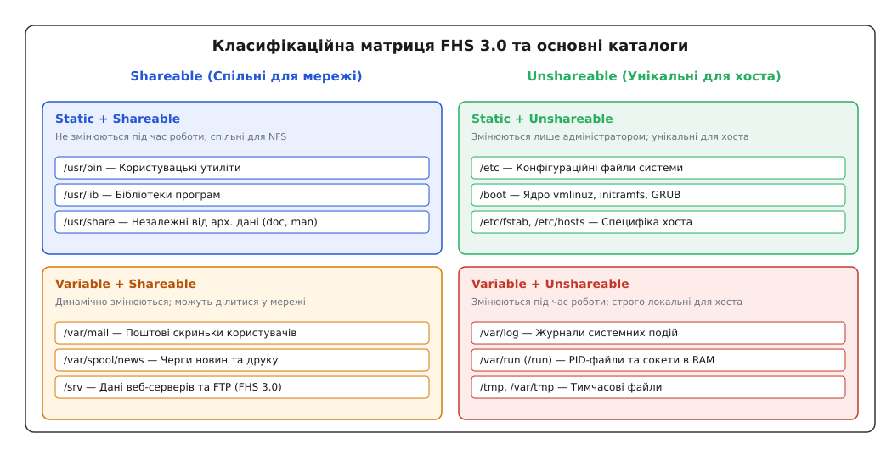
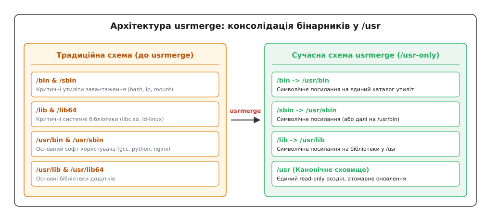
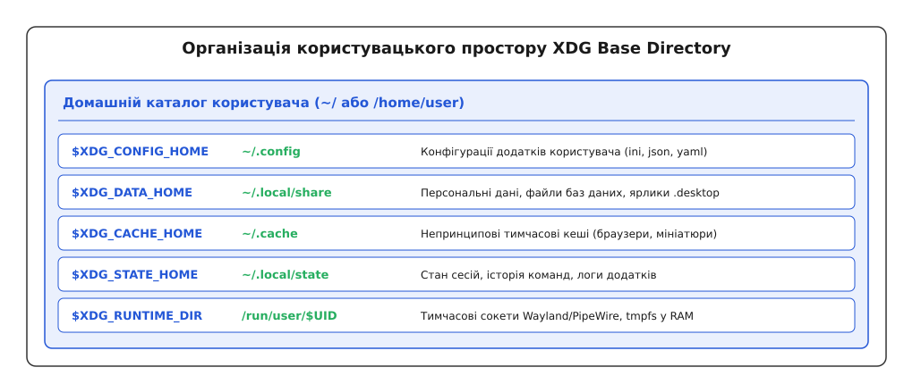

# Ієрархія файлової системи: куди що кладуть

<preknowlist>
- [Філософія Unix](root:sys-unix/unix-philosophy) — концепція малих інструментів та уніфікований простір файлового дерева.
- [Архітектура procfs](root:sys-unix/procfs-kernel-implementation) — віртуальні файлові системи ядра та простір процесів /proc.
</preknowlist>

Операційні системи родини Unix та Linux реалізують фундаментальну архітектурну ідею: весь дисковий простір, підключені пристрої, мережеві ресурси та навіть системний стан ядра представлені у вигляді єдиного ієрархічного дерева файлів. На відміну від інших операційних систем (наприклад, MS-DOS чи MS Windows), де кожен накопичувач або дисковий розділ отримує окрему літеру (`C:`, `D:`, `E:`), у Linux будь-який фізичний або віртуальний носій монтується в конкретну точку єдиного графа, вершиною якого є кореневий каталог, що позначається символом `/`.

Ця єдина структура не є довільним рішенням окремого розробника. Вона ретельно спроєктована, описана та стандартизована у документі **Filesystem Hierarchy Standard (FHS)**. Сучасний стандарт FHS 3.0, затверджений у 2015 році під егідою The Linux Foundation, визначає точні правила розміщення бінарних файлів, конфігурацій, бібліотек, логів та тимчасових даних. Розуміння цих правил є необхідною умовою для проектування надійних систем, створення пакетів програмного забезпечення, розробки системних сервісів та ефективного системного адміністрування.

У цьому розділі ми розберемо першопричини створення стандарту, математично-інженерну матрицю класифікації каталогів 2x2, детально вивчимо кожен каталог кореневої ієрархії, дослідимо технічні деталі глобальної реформи `usrmerge`, розглянемо специфікацію XDG Base Directory для користувацького простору та оглянемо еволюцію FHS у сучасних незмінних операційних системах.

---

## 1. Першопричини та філософія єдиного дерева

Щоб зрозуміти, чому Unix відмовився від літер дисків і прийшов до концепції FHS, потрібно повернутися до витоків операційної системи у 1970-х роках та дослідити фундаментальні механізми ядра Linux.

### 1.1. Абстракція VFS проти буквених дисків
У системах з літерами дисків програма повинна жорстко закладати у свій код або конфігурацію інформацію про те, на якому саме фізичному накопичувачі знаходяться її дані. Якщо конфігураційний файл переміщується з диска `C:` на диск `D:`, шлях до файла у коді додатка ламається, а системному адміністратору доводиться змінювати параметри середовища. 

Unix вирішив цю проблему за допомогою абстракції **Virtual File System (VFS)**. Для програмного забезпечення існує лише один глобальний простір імен шляхів. Системний виклик `open("/usr/bin/gcc", O_RDONLY)` не цікавиться тим, на якому фізичному накопичувачі (SATA SSD, NVMe, USB-флешці чи мережевому NFS-сервері) лежить цей бінарник. 

Під капотом ядро Linux зберігає файлову систему як граф об'єктів в оперативній пам'яті:
- **`inode` (індексний вузол)** — містить метадані файла (розмір, права доступу, атрибути часу, покажчики на дискові блоки);
- **`dentry` (directory entry)** — об'єкт кешу назв каталогів, що пов'язує текстове ім'я файла або каталогу з його номером інода;
- **`vfsmount`** — структура, що описує конкретну точку монтування файлової системи у загальному файловому дереві.

Коли процес звертається за шляхом `/usr/bin/gcc`, ядро проходить через кеш `dentry`, знаходить відповідну структуру `vfsmount`, визначає конкретну файлову систему (наприклад, ext4 чи btrfs) та викликає низькорівневий драйвер диска. Програма користувача бачитиме лише чистий уніфікований шлях.

### 1.2. Механізм mount namespaces та ізоляція VFS
Сучасне ядро Linux дозволяє процесам бачити різні ієрархії FHS завдяки підсистемі **просторів імен точек монтування (mount namespaces)**. 

За допомогою системного виклику `unshare(CLONE_NEWNS)` процес створює власну приватну копію дерева точок монтування. Зміни, внесені всередині нового простору імен (наприклад, монтування нової файлової системи в `/tmp` або ізоляція `/usr`), залишаються непомітними для решти процесів операційної системи. 

Для зміни кореневого каталогу процесу використовуються системні виклики:
- `chroot()` — застарілий виклик, що змінює логічний корінь для конкретного процесу;
- `pivot_root()` — сучасний виклик, який міняє місцями кореневу файлову систему та нову точку монтування, що є основою для роботи систем контейнеризації Docker, Podman та контейнерів systemd-nspawn.

### 1.3. Проблема хаосу та поява стандарту FSSTND/FHS
У перші десятиліття розвитку Unix (1970–1980-ті роки) кожен дистрибутив і кожна версія системи розставляли файли за власним усмотренням. Наприклад, утиліти мережі могли знаходитися в `/bin`, `/sbin`, `/usr/bin` або `/usr/etc`. Розробник, який створював програму для BSD Unix, не міг просто запустити її на System V Unix без переписання шляхів до конфігурацій та бібліотек.

У 1993 році спільнота розробників Linux вирішила покласти край цьому хаосу. Було започатковано документ **FSSTND (Linux Filesystem Standard)**, який у 1997 році розширився до загальногалузевого стандарту **FHS**. Мета стандарту — гарантувати, що будь-який розробник або пакетний менеджер може з високою точністю передбачити:
- Де знаходяться виконувані файли;
- Куди класти конфігураційні файли;
- Де шукати динамічні бібліотеки;
- Куди програма має право писати свої лог-файли та тимчасові дані.

---

## 2. Класифікаційна матриця FHS 3.0 (2x2)

В основі стандарту FHS 3.0 лежить елегантна інженерна модель. Замість хаотичного списку папок, FHS класифікує будь-які дані в операційній системі за двома незалежними осями (матриця 2x2):

1. **Shareable vs. Unshareable (Спільні або унікальні дані)**:
   - **Shareable (Спільні)**: Дані, які можуть зберігатися на одному центральному сервері та надаватися іншим комп'ютерам у мережі (наприклад, через NFS або SMB) без будь-якої модифікації. Приклади: утиліти користувача (`/usr/bin`), системна документація (`/usr/share/man`), бібліотеки (`/usr/lib`).
   - **Unshareable (Унікальні)**: Дані, які строго прив'язані до конкретного апаратного вузла (хоста) і не можуть використовуватись іншими машинами. Приклади: конфігурації мережі та системні паролі (`/etc`), інформація про завантажувач (`/boot`), лог-файли конкретної машини (`/var/log`), файли пристроїв (`/dev`).

2. **Static vs. Variable (Статичні або змінні дані)**:
   - **Static (Статичні)**: Файли, які змінюються лише під час установки, видалення або оновлення програмного забезпечення системним адміністратором або пакетним менеджером. Звичайні користувачі та запущені демони не мають права змінювати ці файли під час нормальної роботи системи. Приклади: виконувані файли, бібліотеки, документація.
   - **Variable (Змінні)**: Файли, вміст або розмір яких постійно змінюється у процесі виконання програм. Приклади: черги друку, поштові скриньки, журнали подій, бази даних статусів пакетного менеджера, тимчасові файли.


*Класифікаційна матриця FHS 3.0: розмежування каталогів за осями Shareable/Unshareable та Static/Variable.*

Детальний структурований опис каталогів та відповідних атрибутів доступу наведено у довіднику [Специфікація FHS 3.0 та XDG Base Directory](root:sys-unix/fhs-layout/api-fhs-directory-spec.md).

### 2.1. Практична цінність матриці 2x2 та безпека
Цей поділ дозволяє системним адміністраторам будувати гнучкі та безпечні архітектури дискового простору:
- **Монтування у режимі Read-Only**: Каталог `/usr` (Static + Shareable) можна змонтувати з прапором `MS_RDONLY` (`ro` у `/etc/fstab`). Це унеможливлює модифікацію системного коду шкідливим програмним забезпеченням навіть у разі отримання прав суперкористувача.
- **Ізоляція збоїв логування**: Каталог `/var` (Variable + Unshareable) виносять на окремий дисковий розділ або RAID-масив. Якщо якийсь демон заповнить весь дисковий простір логами у `/var/log`, це не призведе до падіння всієї операційної системи, оскільки корінь `/` і `/tmp` залишаться недоторканими.
- **Опції безпеки монтування**: Для змінних каталогів `/tmp` та `/var/tmp` застосовують прапори `nodev` (заборона пристроїв), `nosuid` (ігнорування suid-бітів) та `noexec` (заборона запуску бінарників), що нейтралізує більшість відомих векторів експлойтів локального підвищення привілеїв.

---

## 3. Детальна анатомія кореневої ієрархії (`/`)

Кореневий каталог `/` є вершиною файлового дерева. Згідно з вимогами FHS 3.0, корінь повинен містити лише мінімально необхідний набір каталогів, щоб забезпечити завантаження, відновлення та монтування решти файлових систем.

Розглянемо призначення та внутрішній устрій кожного базового каталогу.

```
/
├── boot/       # Завантажувач, ядро vmlinuz, initramfs
├── dev/        # Псевдо-ФС пристроїв (devtmpfs)
├── etc/        # Конфігураційні файли системи
├── home/       # Домашні каталоги користувачів
├── media/      # Точки монтування змінних носіїв (USB, CD)
├── mnt/        # Тимчасові точки монтування адміністратора
├── opt/        # Стороннє автономне ПЗ (third-party packages)
├── proc/       # Віртуальна ФС процесів та ядра (procfs)
├── root/       # Домашній каталог суперкористувача root
├── run/        # Змінні дані часу виконання у RAM (tmpfs)
├── srv/        # Дані системних сервісів (web, ftp)
├── sys/        # Віртуальна ФС апаратури та драйверів (sysfs)
├── tmp/        # Тимчасові файли (tmpfs)
├── usr/        # Вторинна статична ієрархія (основний софт)
└── var/        # Змінні дані (логи, кеші, бази даних)
```

### 3.1. Каталог `/boot`
Каталог `/boot` містить усе необхідне для початкового стартапу операційної системи до моменту монтування основних файлових систем:
- Скомпільоване ядро Linux (файли `vmlinuz-<версія>`);
- Тимчасову файлову систему в операційній пам'яті (`initrd.img` або `initramfs-<версія>.img`);
- Конфігураційні файли та модулі завантажувача (GRUB2, systemd-boot).

Поскільки завантажувачу (GRUB) на ранньому етапі потрібен прямий доступ до ядра, `/boot` часто виносять на окремий невеличкий дисковий розділ (наприклад, FAT32/EXT4), який підтримується прошивкою EFI або BIOS.

### 3.2. Каталог `/etc`
Назва `/etc` історично розшифровувалася як *et cetera* («і так далі»), проте в сучасній термінології її часто називають *Editable Text Configuration*. Це головний центр управління системою.

Правила FHS 3.0 щодо `/etc`:
1. В `/etc` зберігаються **лише текстові конфігураційні файли**, які можуть редагуватися адміністратором.
2. В `/etc` заборонено розташовувати виконувані бінарні файли (виняток робиться лише для командних скриптів ініціалізації).

Важливі файли та каталоги в `/etc`:
- `/etc/fstab` — таблиця статичного монтування файлових систем;
- `/etc/passwd`, `/etc/shadow`, `/etc/group` — бази даних користувачів та хешів паролів;
- `/etc/hostname` та `/etc/hosts` — мережева ідентифікація хоста;
- `/etc/sysctl.conf` або `/etc/sysctl.d/` — параметри ядра Linux;
- `/etc/systemd/system/` — локальні юніти та оверриди системних служб.

### 3.3. Каталог `/usr` (Secondary Hierarchy)
Каталог `/usr` (*User System Resources*) є найбільшим за обсягом у традиційних Linux-системах. Якщо корінь `/` містить мінімум для завантаження, то `/usr` містить переважну більшість користувацьких програм, бібліотек та документації, які встановлюються через пакетний менеджер (`apt`, `dnf`, `pacman`).

Структура підкаталогів `/usr`:
- `/usr/bin` — стандартні виконувані програми користувачів (`gcc`, `python`, `git`, `vim`, `bash`);
- `/usr/sbin` — утиліти системного адміністрування, які зазвичай вимагають привілеїв `root` (`sshd`, `nginx`, `iptables`, `fsck`);
- `/usr/lib` та `/usr/lib64` — спільні динамічні бібліотеки (`.so` файли) для утиліт з `/usr/bin` та `/usr/sbin`;
- `/usr/include` — заголовні файли мов C/C++ (`.h`, `.hpp`), необхідні для компіляції програм з сирцевого коду;
- `/usr/share` — архітектурно-незалежні дані (документація `man`, іконки, локалізаційні мовні файли, шрифти). Дані з `/usr/share` можна скопіювати з x86_64 на ARM64 без жодних змін;
- `/usr/local` — локальна ієрархія для програмного забезпечення, що збирається та встановлюється системним адміністратором вручну (наприклад, через `make install`). Пакетні менеджери дистрибутиву за стандартом FHS **не мають права** торкатися вмісту `/usr/local`.

### 3.4. Завантажувальний ланцюжок і виклик switch_root
Під час завантаження системи ядро спочатку монтує тимчасову файлову систему `initramfs` (яка розпаковується з cpio-архіву в оперативну пам'ять) у якості тимчасового кореня `rootfs`. 

Скрипт ініціалізації в `initramfs` підвантажує необхідні драйвери дискових контролерів (NVMe, AHCI, RAID), монтує справжній дисковий корінь `/` у папку `/sysroot`, монтує справжній `/usr`, а потім виконує системну процедуру `switch_root`. Програма `switch_root` очищає вміст RAM-диска `rootfs`, робить каталог `/sysroot` новим справжнім коренем `/` і передає управління першому процесу користувацького простору (`/sbin/init` або `systemd`).

---

## 4. Революція `usrmerge`: Об'єднання бінарних каталогів

Протягом чотирьох десятиліть у Unix існував дуалізм: критичні утиліти завантаження лежали в `/bin` та `/sbin`, а решта — у `/usr/bin` та `/usr/sbin`. Бібліотеки також ділилися між `/lib` та `/usr/lib`.

Детальний історичний опис того, як брак місця на дисках RK05 у 1971 році призвів до цього розділення, наведено у статті [Історія розділення /usr та шлях до usrmerge](root:sys-unix/fhs-layout/hist-usrmerge-and-split-usr.md).

### 4.1. Механіка та переваги usrmerge
У сучасних операційних системах розділення втратило сенс. Свою роль зіграла поява `initramfs`, яка монтує всі необхідні файлові системи ще до запуску першого процесу користувацького простору (`/sbin/init` або `systemd`).

Реформа **`usrmerge`** консолідує всі бінарні файли та бібліотеки виключно у каталозі `/usr`. При цьому у кореневому каталозі створюються символічні посилання:
- `/bin` → `usr/bin`
- `/sbin` → `usr/sbin`
- `/lib` → `usr/lib`
- `/lib64` → `usr/lib64`


*Консолідація бінарних каталогів у результаті реформи usrmerge.*

Переваги `usrmerge`:
1. **Усунення колізій шляхів**: Програма може викликати `/bin/bash` або `/usr/bin/bash` — обидва шляхи ведуть до одного і того ж фізичного файла.
2. **Спрощення пакетних менеджерів**: Ментейнерам пакетів більше не потрібно вирішувати, куди класти бінарник — у `/bin` чи `/usr/bin`.
3. **Атомарні оновлення операційної системи**: Оскільки вся операційна система (код та бібліотеки) тепер знаходиться всередині `/usr`, весь каталог `/usr` можна оновлювати атомарно як єдиний снапшот або образ диска.

Практичний приклад коду мовами C та C++, який програмує перевірку стану `usrmerge` та аналізує точки монтування, доступний у матеріалі [Інспекція ієрархії FHS та аналіз точок монтування](root:sys-unix/fhs-layout/proj-fhs-traverser-and-mount-checker.md).

---

## 5. Каталог `/var` (Variable Data)

Якщо `/usr` є статичним каталогом, то `/var` призначений для **динамічно змінних даних**. Вміст `/var` постійно змінюється під час роботи системи.

Основними підкаталогами `/var` є:
- `/var/log` — журнали системних та прикладних подій (`syslog`, `journald`, логи `nginx`, `auth.log`). Це перше місце, куди звертається адміністратор при виникненні несправностей;
- `/var/cache` — збережені кеш-дані додатків. Наприклад, `apt` зберігає завантажені `.deb` пакунки у `/var/cache/apt/archives/`. Вміст цього каталогу можна безпечно видалити у разі нестачі місця на диску;
- `/var/lib` — інформація про стан системних служб та баз даних. Бази даних PostgreSQL розташовуються у `/var/lib/postgresql`, а реєстр стану встановлених пакетів dpkg — у `/var/lib/dpkg`;
- `/var/spool` — черги відкладеної обробки (черги завдань друку CUPS, поштові черги Postfix, завдання розкладу `cron`);
- `/var/tmp` — тимчасові файли, які, на відміну від `/tmp`, повинні зберігатися між перезавантаженнями системи.

> 🔧 **Навіщо це.** Розділення `/var` та `/usr` гарантує надійність системи. Якщо веб-сервер буде атаковано і він заповнить логами весь каталог `/var/log`, системний диск із кодом `/usr` та конфігураціями `/etc` залишиться неушкодженим. Адміністратор завжди зможе увійти в систему та усунути проблему.

---

## 6. Каталог `/opt` та стороннє ПЗ

Каталог `/opt` (*Option*) призначений для встановлення сторонніх автономних пакетів програмного забезпечення (add-on software), які не входять до складу дистрибутиву операційної системи.

### Принцип автономних папок у `/opt`
На відміну від стандартних пакетів дистрибутиву, які розкидають свої файли по відповідних каталогах FHS (`/usr/bin`, `/usr/lib`, `/usr/share`), програма в `/opt` розташовується у власній ізольованій підпапці:
`/opt/google/chrome/` або `/opt/oracle/database/`.

Всередині своєї папки програма створює власний міні-всесвіт зі своїми бінарниками, бібліотеками та ресурсами. 

Правила FHS 3.0 для `/opt`:
- Статичні файли програми знаходяться в `/opt/<vendor>/<app>/`;
- Конфігураційні файли повинні зберігатися у `/etc/opt/<vendor>/<app>/`;
- Змінні дані та логи повинні зберігатися у `/var/opt/<vendor>/<app>/`.

Цей підхід дозволяє видалити сторонню програму одним простим рекурсивним викликом `rm -rf /opt/<vendor>/<app>`, не турбуючись про залишені «сміттєві» файли у системних бібліотеках.

---

## 7. Віртуальні та псевдо-файлові системи: `/dev`, `/proc`, `/sys`, `/run`

Операційна система Linux активно втілює принцип Unix «все є файл». Взаємодія з ядром, оперативою пам'яттю, процесами та фізичним обладнанням відбувається через спеціальні віртуальні файлові системи.

### 7.1. Каталог `/dev` (Device Nodes)
Каталог `/dev` містить файли пристроїв (device nodes). Пристрої у Linux поділяються на два основні типи:
1. **Блочні пристрої (Block devices)** — надають доступ до даних блоками фіксованого розміру з можливістю довільного позиціонування (`/dev/sda`, `/dev/nvme0n1p1`).
2. **Символьні пристрої (Character devices)** — надають доступ до даних у вигляді послідовного потоку байтів (`/dev/tty1`, `/dev/null`, `/dev/urandom`).

У сучасних системах Linux каталог `/dev` монтується як віртуальна файлова система **`devtmpfs`**. Ядро Linux автоматично створює та видаляє ноди пристроїв при підключенні або відключенні обладнання, а демон `udev` виставляє відповідні права доступу та створює зручні символічні посилання (наприклад, у `/dev/disk/by-uuid/`).

### 7.2. Каталог `/proc` (procfs)
Каталог `/proc` — це віртуальна файлова система ядра **procfs**, яка створюється безпосередньо в операційній пам'яті. Файли у `/proc` не займають місця на жорсткому диску; їхній вміст генерується ядром «на льоту» в момент звернення.

Призначення `/proc`:
- **Інформація про процеси**: Кожен за запущений процес має свій каталог `/proc/<PID>/`, де знаходяться файли `cmdline` (аргументи запуску), `environ` (змінні оточення), `fd/` (відкриті файлові дескриптори), `maps` (карта пам'яті);
- **Параметри ядра**: Каталог `/proc/sys/` надає можливість переглядати та змінювати налаштування ядра під час роботи (наприклад, `echo 1 > /proc/sys/net/ipv4/ip_forward`).

### 7.3. Каталог `/sys` (sysfs)
З появою ядра Linux 2.6 було впроваджено файлову систему **sysfs**, змонтовану в `/sys`. На відміну від плоского та хаотичного `/proc`, `/sys` надає чітку ієрархічну модель апаратури, шин (PCI, USB) та драйверів ядра.

Через `/sys` можна керувати яскравістю екрана (`/sys/class/backlight/`), переглядати температуру процесора, налаштовувати параметри енергозбереження та опитувати структури даних `kobject` ядра.

### 7.4. Каталог `/run` (Runtime Data)
Каталог `/run` було введено у специфікації FHS 3.0 для розв'язання проблеми збереження даних часу виконання (runtime state). 

Каталог `/run` монтується як **`tmpfs`** (файлова система в операційній пам'яті RAM) і очищається при кожному перезавантаженні. В ньому зберігаються:
- PID-файли запущені демонів (`/run/nginx.pid`);
- UNIX-сокети для міжпроцесної взаємодії (IPC);
- Тимчасові блоки блокування (lockfiles).

Історичні каталоги `/var/run` та `/var/lock` у сучасних системах є символічними посиланнями на `/run` та `/run/lock`.

### 7.5. Сучасні псевдо-ФС: cgroupfs v2 та tracefs
Розвиток ядра Linux додав дві нові специфічні псевдо-файлові системи:
- **`cgroupfs` (монтується в `/sys/fs/cgroup`)**: Реалізує єдине дерево керування ресурсами процесора, пам'яті та ввода-вивода для контрольних груп (cgroups v2).
- **`tracefs` (монтується в `/sys/kernel/tracing`)**: Надає інтерфейс підсистеми трасування ядра `ftrace` для перехоплення системних подій та аналізу продуктивності.

---

## 8. Персональний простір користувача: XDG Base Directory

Довгий час у Unix існувала проблема «засмічення» домашнього каталогу користувача (`~` або `/home/user`). Кожна програма створювала власні приховані каталоги або файли конфігурації безпосередньо в корені домашньої папки: `.bashrc`, `.vimrc`, `.mplayer/`, `.gconf/`. В результаті домашній каталог перетворювався на хаотичне звалище сотень прихованих файлів.

Для вирішення цієї проблеми організація **freedesktop.org** розробила специфікацію **XDG Base Directory Specification**.


*Розподіл каталогів користувача згідно зі специфікацією XDG Base Directory.*

Згідно з XDG, додатки повинні чітко розмежовувати свої файли за допомогою змінних середовища:
- **`$XDG_CONFIG_HOME`** (за замовчуванням `~/.config`) — конфігураційні файли користувача;
- **`$XDG_DATA_HOME`** (за замовчуванням `~/.local/share`) — персональні дані програм, файли баз даних, ярлики додатків `.desktop`;
- **`$XDG_CACHE_HOME`** (за замовчуванням `~/.cache`) — тимчасові кешовані дані (іконки, мініатюри зображень, кеш браузера);
- **`$XDG_STATE_HOME`** (за замовчуванням `~/.local/state`) — стан сесій, історія командного рядка, журнали користувацьких програм;
- **`$XDG_RUNTIME_DIR`** (за замовчуванням `/run/user/$UID`) — тимчасові сокети Wayland, PipeWire, D-Bus, розташовані у RAM.

Завдяки стандартам XDG користувач може бекапити лише папку `~/.config` та `~/.local/share`, повністю ігноруючи кеші у `~/.cache`.

---

## 9. Сучасні тенденції: Незмінні системи (Immutable OS) та контейнеризація

Еволюція дискових систем та систем захисту інформації призвела до виникнення концепції **незмінних операційних систем (Immutable OS)** — таких як Fedora Silverblue, SteamOS 3.0 (у пристроях Steam Deck), Flatcar Container Linux та NixOS.

### 9.1. Архітектура Read-Only /usr
У незмінній ОС базовий образ системи монтується строго в режимі Read-Only за допомогою технологій **OSTree** або снапшотів Btrfs/ZFS.

У такій системі:
- Каталог `/usr` є незмінним. Навіть користувач `root` не може змінити файл у `/usr/bin/` чи додати бінарник у `/usr/lib/`;
- Оновлення операційної системи відбувається шляхом атомарної заміни всього образу `/usr` при перезавантаженні;
- Каталог `/etc` залишається доступним для запису за допомогою технологій накладання **OverlayFS**;
- Каталог `/var` залишається єдиним місцем для збереження стану системи та даних користувачів.

### 9.2. Контейнеризація та ізольовані ієрархії
З приходом контейнеризації (Docker, Podman) та пакетних менеджерів з пісочницею (Flatpak, Snap), концепція FHS отримала нове життя.

Контейнер Flatpak містить власний повністю ізольований корінь файлової системи. Для програми у Flatpak створюється віртуальне середовище, де її власний бінарний код знаходиться в `/app` (замість `/usr`), а системні бібліотеки ізольованої платформи монтуються в `/usr`. Завдяки механізму **bind-mounts** та просторам імен ядра (Linux namespaces), додаток бачить власну спрощену ієрархію FHS, не маючи доступу до реальної файлової системи хоста.

### 9.3. Динамічне розширення через systemd-sysext
Сучасні незмінні ОС під управлінням `systemd` використовують механізм **`systemd-sysext` (system extension images)**. Файли системних розширень (наприклад, нові версії утиліт чи драйверів) зберігаються у вигляді обраних squashfs-образів і динамічно накладаються поверх read-only каталогів `/usr` та `/opt` за допомогою каскаду `OverlayFS`. Це дозволяє підключати та відключати системний софт без модифікації базового образу FHS.

---

## Висновки

Стандарт Filesystem Hierarchy Standard (FHS 3.0) є фундаментальним каркасом, на якому тримається вся організація даних у Linux. Перехід від хаотичних буквених дисків до єдиного ієрархічного дерева з абстракцією VFS дозволив Unix-подібним системам досягти виняткової гнучкості та масштабованості.

Матриця класифікації 2x2 (Static/Variable, Shareable/Unshareable) дала можливість розділити систему на незалежні точки монтування, забезпечивши високу надійність та безпеку. Завдяки сучасному етапу еволюції — реформі `usrmerge`, впровадженню стандарту XDG та розвитку незмінних ОС — ієрархія файлової системи Linux продовжує успішно адаптуватися до вимог сучасного світу хмарних обчислень, контейнеризації та атомарних оновлень.
