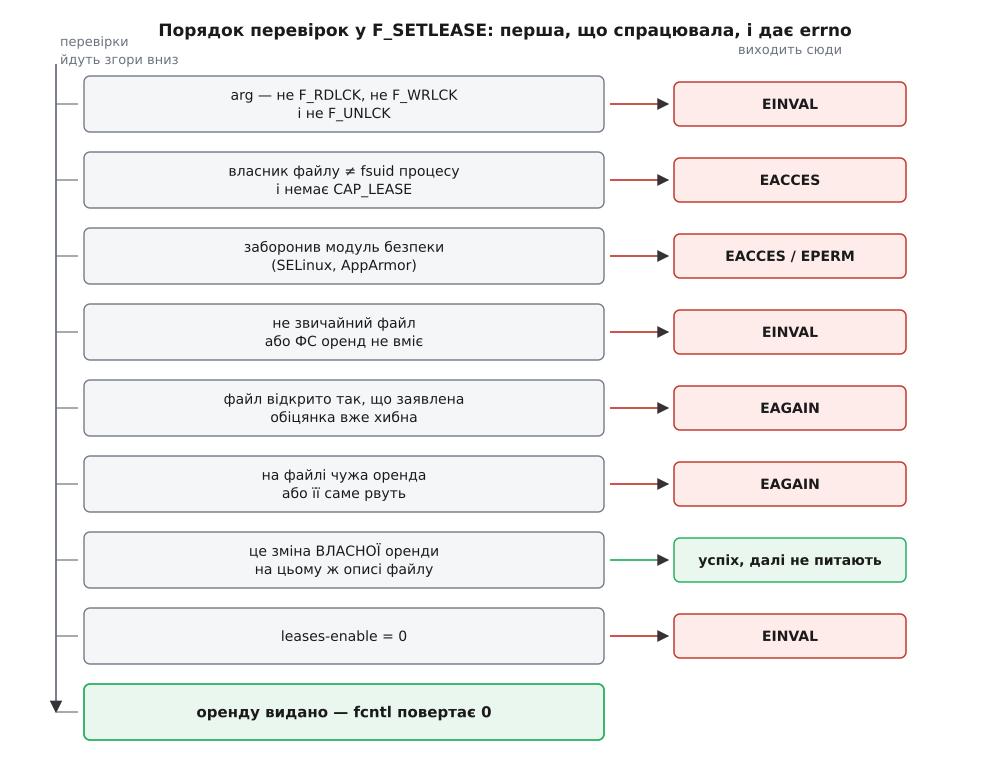

# 📋 Інтерфейс оренд: дві команди `fcntl`, порядок перевірок і два перемикачі

Довідка описує контракт оренди дослівно: що передають у `fcntl` і що звідти повертається, за якої умови ядро погоджується видати кожен вид оренди, який `errno` відповідає якій відмові, що бачить із іншого боку той, кого притримали, і які системні перемикачі всім цим керують.

## Дві команди

```c
#define _GNU_SOURCE      /* без цього сталих оренди в заголовку просто не буде */
#include <fcntl.h>

int fcntl(int fd, int cmd, ... /* arg */);
```

Оренди — розширення Linux, наявне з ядра 2.4; у POSIX їх немає й дотепер, тому glibc ховає `F_SETLEASE`, `F_GETLEASE` і `F_SETSIG` за `_GNU_SOURCE`. Забутий макрос дає помилку компіляції про невідомий ідентифікатор — не мовчазну відмову під час роботи.

| Виклик | Третій аргумент | Повертає |
| --- | --- | --- |
| `fcntl(fd, F_SETLEASE, arg)` | `int`: `F_RDLCK`, `F_WRLCK` або `F_UNLCK` | `0` за успіху, `-1` і `errno` за відмови |
| `fcntl(fd, F_GETLEASE)` | немає | `F_RDLCK`, `F_WRLCK` чи `F_UNLCK`, або `-1` і `errno` |

Оренда лягає на [опис відкритого файлу](topic:sys-unix/open-file-description) — структуру, що народжується на кожен `open`, — а не на сам дескриптор. Тому копії після `dup` і `fork` посилаються на ту саму оренду, зняти її можна через будь-яку з них, а зникає вона, коли закрито останню.

| `arg` | Обіцянка, яку дає ядро | Видається, лише якщо |
| --- | --- | --- |
| `F_RDLCK` | цього файлу ніхто не пише | inode не відкритий на запис — ані іншими, ані самим прохачем |
| `F_WRLCK` | цей файл не відкритий більш ніким | на inode немає жодного відкритого дескриптора, крім того, з якого просять |
| `F_UNLCK` | — | умови на стан файлу немає; перевірку прав проходить нарівні з рештою |

## Умова видачі — арифметика лічильників

Для `F_RDLCK` ядро питає одне: чи відкритий inode на запис хоч кимось. Дескриптор, відкритий на запис, рахується й тоді, коли він належить самому прохачеві, — тому оренду на читання дають лише з дескриптора, відкритого `O_RDONLY`.

Для `F_WRLCK` ядро звіряє лічильники inode із внеском самого прохача:

```
внесок власного дескриптора:
  відкрито на запис        → self_wcount = 1, self_rcount = 0
  відкрито лише на читання → self_wcount = 0, self_rcount = 1

оренду видано ⟺ i_writecount == self_wcount ∧ i_readcount == self_rcount
```

**Файл `doc` відкрито тільки орендарем, з `O_RDONLY`.**

```
i_readcount  = 1   self_rcount = 1   збіг
i_writecount = 0   self_wcount = 0   збіг
                                   → F_WRLCK видано
```

**Той самий файл відкрив на читання ще хтось.**

```
i_readcount  = 2   self_rcount = 1   2 ≠ 1
i_writecount = 0   self_wcount = 0
                                   → EAGAIN
```

Умова буквальна: жодного стороннього дескриптора — навіть такого, що відкритий лише на читання й нічого з файлом не робить.

## Помилки й порядок перевірок

Перевірки йдуть суворою чергою, і `errno` дає **перша**, що спрацювала. Тому за тим самим `EINVAL` стоять чотири різні причини, а взаємне розташування перевірок подекуди важить більше за їхній перелік.



*Сьома сходинка — не помилка, а вихід успіхом: зміна власної оренди завершується раніше, ніж черга дійде до системного перемикача.*

| `errno` | Причина |
| --- | --- |
| `EBADF` | `fd` не є відкритим дескриптором — загальна перевірка `fcntl`, найперша з усіх |
| `EINVAL` | `arg` не є жодною з трьох сталих |
| `EACCES` | UID власника файлу не збігається з файловим UID процесу, і немає `CAP_LEASE` |
| `EACCES` або інше | відмовив [модуль безпеки](topic:sys-unix/mac-selinux-apparmor) — значення обирає він сам |
| `EINVAL` | файл не звичайний: каталог, пристрій, канал, сокет |
| `EINVAL` | файлова система оренд не підтримує |
| `EAGAIN` | файл відкрито так, що заявлена обіцянка хибна вже в мить прохання |
| `EAGAIN` | просять `F_WRLCK`, а на файлі вже є чужа оренда; або наявну оренду саме рвуть (кілька оренд на читання співіснують вільно) |
| `EINVAL` | `/proc/sys/fs/leases-enable` містить `0` |
| `ENOMEM` | ядру забракло пам'яті на структури оренди |

> 🔧 **Навіщо це.** `EAGAIN` і `EINVAL` розділяють тут дві геть різні ситуації, і плутати їх дорого. `EAGAIN` каже «зараз не можна, спробуйте, коли файл звільниться» — це робочий стан, а не поломка. `EINVAL` каже «тут не можна ніколи»: ця файлова система оренд не має або адміністратор вимкнув їх у системі. Програма, що на `EINVAL` уперто повторює спробу, крутитиме цикл до кінця світу.

Права перевіряють за **файловим UID** процесу — тим самим, за яким ядро судить про доступ до файлів узагалі; звичайно він дорівнює [ефективному UID](topic:sys-unix/uid-gid-identity-model). Орендувати файл із чужим власником дає [можливість](topic:sys-unix/capabilities) `CAP_LEASE`.

## Що бачить той, кого притримали

| Як прийшов відкривач | Чим завершується його `open` або `truncate` |
| --- | --- |
| звичайно | спить, доки орендар не відповість або не спливе строк, далі — як завжди |
| з `O_NONBLOCK` | одразу `-1` і `EWOULDBLOCK` (на Linux це те саме число, що `EAGAIN`) |
| прийшов сигнал із обробником | `-1` і `EINTR` |
| процес убито сигналом | нічим — процес мертвий |

Спільне в трьох останніх рядках одне: **перерву оренди однаково запущено й доведено до кінця**. Відкривач пішов, а орендар усе одно дістав сигнал і мусить укластися в строк. Тому повторна спроба [неблокуючого](topic:sys-unix/blocking-and-nonblocking) `open` за мить має шанс пройти — перерва тим часом працює; і тому ж [перерваний сигналом](topic:sys-unix/eintr-and-restart) `open` не лишає механізм у напівстані.

## Що показує `F_GETLEASE`

`F_GETLEASE` повертає не те, що орендар тримає, а те, до чого йому треба дійти:

```
перерви немає       → фактичний тип: F_RDLCK, F_WRLCK або F_UNLCK
перерва почалася:
  досить зниження   → F_RDLCK   (хоча тримаєте ви ще F_WRLCK)
  потрібне зняття   → F_UNLCK   (хоча оренда ще ваша)
```

Різниця не косметична. Це єдиний спосіб дізнатися про перерву, не покладаючись на сигнал, — і єдиний спосіб виявити, що оренду вже забрали примусово, бо про це ядро окремо не повідомляє.

## Сповіщення: сигнал, адресат, `siginfo_t`

Розриваючи оренду, ядро викликає `kill_fasync(&fl->fl_fasync, SIGIO, POLL_MSG)` — тобто користується тим самим апаратом, що й [ввід-вивід за сигналом](topic:sys-unix/signal-driven-io).

| Що налаштовує | Команда | Типово |
| --- | --- | --- |
| який сигнал слати | `fcntl(fd, F_SETSIG, sig)` | `0` — голий `SIGIO`, без черги й без даних |
| кому слати | `fcntl(fd, F_SETOWN, pid)` | власником стає група потоків того, хто взяв оренду — ядро призначає її саме |

Другий рядок — приємна несподіванка: `F_SETLEASE` виконує неявний `F_SETOWN` на групу потоків прохача, тож у звичайному випадку окремий виклик зайвий. Робить це ядро м'яко: якщо власника вже задано попереднім `F_SETOWN`, оренда його не перебиває. Явний виклик потрібен, лише щоб адресувати сповіщення кудись інде — іншому процесові, групі процесів або конкретному потокові через `F_SETOWN_EX` з `F_OWNER_TID`.

Без `F_SETSIG` приходить голий `SIGIO`: він не стає в чергу (два сповіщення про два файли зіллються в одне) і не несе даних. Досить одного `F_SETSIG` — хай навіть із тим-таки `SIGIO`, — і ядро починає слати сигнал із супроводом; обробник, установлений із прапорцем `SA_SIGINFO`, дістає:

| Поле `siginfo_t` | Значення при перерві оренди |
| --- | --- |
| `si_signo` | сигнал, заданий у `F_SETSIG` |
| `si_code` | `POLL_MSG` |
| `si_fd` | номер дескриптора, чию оренду рвуть |

`si_fd` — те, заради чого все й робиться: орендар із сотнею оренд інакше не знає, про який саме файл ідеться.

І одразу межа цієї зручності. Черга сигналів реального часу не безмежна — її обмежує `RLIMIT_SIGPENDING`. Коли черга переповнилася, ядро повертається до голого `SIGIO` і шле його всьому процесові, а не окремому потокові. Тобто саме під навантаженням, коли оренд рвуть багато, орендар лишається без `si_fd` — рівно тоді, коли той найпотрібніший. Тому надійна програма не покладається на номер із сигналу беззастережно: діставши `SIGIO` замість свого сигналу, вона мусить обійти всі свої оренди через `F_GETLEASE` і сама знайти ті, які вже рвуть.

**Мінімальний контракт цілком.**

```c
int fd = open("doc", O_RDONLY);

struct sigaction sa = { 0 };
sa.sa_sigaction = on_break;              /* void on_break(int, siginfo_t *, void *) */
sa.sa_flags = SA_SIGINFO;
sigaction(SIGRTMIN, &sa, NULL);

fcntl(fd, F_SETSIG, SIGRTMIN);           /* черга й si_fd замість голого SIGIO */

if (fcntl(fd, F_SETLEASE, F_WRLCK) == -1)
    perror("F_SETLEASE");                /* F_SETOWN не потрібен: ядро вже */
                                         /* призначило власником нашу групу потоків */
```

`F_SETSIG` ставлять **до** `F_SETLEASE`, а не після: у зворотному порядку між двома викликами вміщується чуже відкриття, і перше ж сповіщення прийде голим `SIGIO` — без номера дескриптора.

## Системні перемикачі

Обидва — звичайні цілі числа в текстовому вигляді, як усі [параметри ядра в /proc](topic:sys-unix/sysctl-tunables).

| Файл | Типово | Що робить |
| --- | --- | --- |
| `/proc/sys/fs/leases-enable` | `1` | `0` забороняє **брати нові** оренди — `F_SETLEASE` повертає `EINVAL` |
| `/proc/sys/fs/lease-break-time` | `45` | скільки секунд ядро чекає на відповідь орендаря, перш ніж зняти чи знизити оренду саме |

У першого є тонкість, видна саме з порядку перевірок: перемикач питають **після** гілки «це зміна власної оренди». Вимкнення оренд на ходу тому нікого не кидає напризволяще — новий орендар їх уже не візьме, а наявні доживуть своє нормально: і знизити, і зняти оренду й далі можна.

У другого своя: значення `0` означає не «рвати негайно», а «**ніколи** не рвати за таймером». Ядро розуміє нуль як «строк не спливає», і відкривач спатиме в `open` доти, доки орендар не відповість сам.

```
$ cat /proc/sys/fs/lease-break-time
45
$ echo 15 > /proc/sys/fs/lease-break-time    # коротший строк — швидше пускають чужого
$ echo 0  > /proc/sys/fs/lease-break-time    # строку немає: чекати, поки орендар відповість
```

Перемикач діє на всю систему, а значення читається в мить, коли перерва починається, — тож правка впливає лише на ті перерви, що почнуться після неї, і нічого не міняє в уже початих.

## Як побачити оренди ззовні

Наявні оренди видно у `/proc/locks` разом із рештою замків — окремого файлу під них немає:

```
1: POSIX  ADVISORY  WRITE 3420 08:02:1441795 0 EOF
2: LEASE  ACTIVE    WRITE 5312 08:02:1441802 0 EOF
3: LEASE  BREAKING  READ  5312 08:02:1441803 0 EOF
```

Поля йдуть так: порядковий номер · клас · стан · тип · PID власника · пристрій і номер inode · діапазон байтів. Останній для оренди завжди `0 EOF`: оренда не буває частковою, вона на весь файл.

| Клас | Що це |
| --- | --- |
| `LEASE` | звичайна оренда, взята з простору користувача через `F_SETLEASE` |
| `DELEG` | делегування NFSv4 — та сама структура ядра, взята зсередини `nfsd` |

| Стан | Що це |
| --- | --- |
| `ACTIVE` | оренда діє, перерви немає |
| `BREAKING` | перерву почато, строк цокає |
| `BREAKER` | запис того, хто чекає на перерву |

Тип у четвертому полі ядро рахує тією самою функцією, що обслуговує `F_GETLEASE`. Тому в рядку зі станом `BREAKING` стоїть уже **цільовий** тип, а не той, який орендар фактично досі тримає: два способи спитати про оренду ніколи не суперечать один одному. Прикладна користь від цього пряма — коли `open` незрозуміло чому завмер, `BREAKING` у `/proc/locks` разом із PID орендаря показує і причину, і винуватця за одну команду.
