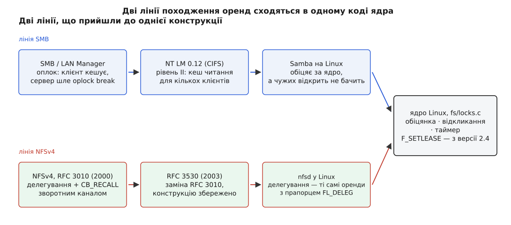

# 📜 Обіцянка з правом відкликання: як oplocks і делегування дійшли до fcntl

Механізм оренд у Linux не виріс із потреб самого Linux — його привезли ззовні дві мережеві файлові системи, кожна своєю дорогою, і обидві з тією самою знахідкою: серверу вигідно дозволити клієнтові кешувати файл, якщо збережено право передумати. Ця довідка простежує, звідки взялася така конструкція, чому Samba не могла обійтися без допомоги ядра, і чому NFSv4 незалежно винайшла те саме.

## Кеш на клієнті вартий обіцянки

Мережева файлова система живе з незручним фактом: звертання по мережі коштує на порядки більше, ніж звертання до локального диска. Найпростіший спосіб не платити — не звертатися: тримати вміст файлу в пам'яті клієнта й відповідати на читання звідти, а записи накопичувати й надсилати гуртом. Обидва прийоми ламаються об одну умову — коректність. Поки клієнт читає зі свого кешу, хтось інший може змінити файл на сервері, і клієнт цього не побачить; поки клієнт накопичує записи, інший клієнт бачить застарілий файл.

Ця напруга — між швидкістю кешу й видимістю чужих змін — загальна для всіх мережевих файлових систем і визначає їхню поведінку набагато сильніше, ніж набір операцій.

> 🔗 Що знати збоку: **[мережеві файлові системи](root:sys-unix/network-filesystems)** — NFS і SMB роблять віддалене сховище схожим на локальне дерево, але семантику одночасного доступу вимушено послаблюють: обіцянки локальної файлової системи через мережу задорого підтримувати дослівно.

Вихід, до якого дійшли обидва табори, той самий: сервер видає клієнтові умовну обіцянку — «поки я мовчу, ти сам на файлі, кешуй скільки хочеш», — залишаючи за собою право обіцянку відкликати, щойно на файл претендує ще хтось. Клієнт зобов'язаний на відкликання відповісти: скинути записи, викинути кеш, підтвердити. А щоб зникнення клієнта не вішало сервер навіки, у відкликання додано таймер.

## Оплоки: SMB робить це першим

У протоколі SMB така обіцянка зветься **опортуністичним замком** (англ. *opportunistic lock*, скорочено oplock) — «опортуністичним» саме тому, що вона не заявка на монополію, а користання нагодою: сервер бачить, що на файл більше ніхто не претендує, і роздає право кешувати, поки нагода тримається. Відкликання зветься **oplock break**.

Оплоки присутні вже в діалектах доби LAN Manager, а форма, у якій їх знають сьогодні, склалася в діалекті `NT LM 0.12` — тому самому, який Microsoft пізніше просувала під назвою CIFS. Публічні специфікації описують три різновиди: **виключний** оплок каже клієнтові, що файл відкритий тільки в нього (можна кешувати і читання, і записи); **пакетний** (batch) додає до цього право не закривати файл між відкриттями; **рівень II** — слабша обіцянка на випадок кількох одночасних клієнтів: кешувати читання можна, записи — ні. Документація Microsoft прямо пояснює походження пакетного різновиду: його зробили заради поведінки командних файлів DOS, які відкривали й закривали той самий файл десятки разів поспіль, і кожне таке відкриття по мережі коштувало обміну. Окремого автора конструкції публічні специфікації не називають — oplock-и описані як частина протоколу, без імен, і приписувати їх конкретній людині підстав немає.

## Samba обіцяє те, чого не знає

Samba реалізує SMB-сервер на Unix-машині, і саме тут конструкція ламається. Windows-клієнт просить оплок; `smbd` його видає — і в цю мить бере на себе зобов'язання, якого не може виконати. На тій самій машині живуть звичайні процеси: `cp`, редактор, скрипт резервного копіювання, демон індексації. Будь-хто з них може відкрити той самий файл і почати писати. Для ядра це рядове відкриття; `smbd` — просто ще один процес, який тримає свій дескриптор, і про чуже відкриття він не дізнається ніяк. Клієнт на іншому кінці мережі спокійно пише у свій кеш, вважаючи, що він сам, — і кешовані та локальні зміни розходяться назавжди.

Замків тут не досить: замок може лише **не пустити** іншого, і то лише того, хто сам погодився замки питати.

> 🔗 Що знати збоку: **[блокування файлів](root:sys-unix/file-locking)** — `flock` і POSIX-замки в Unix переважно дорадчі: вони узгоджують поведінку тих, хто їх бере, і не перешкоджають нікому іншому. Обов'язковість — виняток, а не правило.

Потрібне було щось третє: не заборона, а **звістка**. Ядро мало б у момент чужого відкриття зупинитися, повідомити того, хто тримає обіцянку, дати йому строк на відповідь — і аж тоді пропустити відкриття далі. Такого в Unix не існувало.

*SMB прийшов до відкликання заради кешу на клієнтові, NFSv4 — заради того самого; у ядрі Linux обидві лінії лягли на один код.*

## Linux 2.4: оренда в fcntl

Відповіддю стали **оренди** (leases): `F_SETLEASE` і `F_GETLEASE` у `fcntl`. Довідка `fcntl(2)` датує їхню появу ядром **2.4** і позначає як розширення Linux — у POSIX їх немає й дотепер, тож перенести код, що на них спирається, на інший Unix без переписування не вийде.

> 🔗 Що знати збоку: **[POSIX як стандарт](root:sys-unix/posix-standard)** — спільний знаменник Unix-систем; Linux має чимало власних інтерфейсів понад нього, і кожен такий інтерфейс — свідомий обмін переносності на можливість.

Конструкція повторює oplock майже дослівно. Оренда на читання (`F_RDLCK`) сповіщає власника, коли файл відкривають на запис або вкорочують; оренда на запис (`F_WRLCK`) — коли файл відкривають узагалі, хоч на читання. Сповіщення приходить сигналом — типово `SIGIO`, і його можна замінити своїм через `F_SETSIG`, щоб разом із сигналом отримати номер дескриптора. А якщо орендар мовчить довше, ніж записано в `/proc/sys/fs/lease-break-time`, ядро знімає або знижує оренду примусово і пропускає того, хто чекав.

> 🔗 Що знати збоку: **[модель сигналів](root:sys-unix/signal-model)** — асинхронне сповіщення, що уриває процес; у обробнику можна викликати лише вузьке коло безпечних функцій, тож реальні програми зазвичай зводять сигнал до події в основному циклі.

Що ця пара — ядерні оренди й `smbd` — задумувалася разом, видно і з боку Samba: право видавати оплоки за підтримки ядра вмикається окремим параметром `kernel oplocks` у `smb.conf` і **типово вимкнене**, а код Samba ставить обробник через `F_SETSIG` і бере оренду через `F_SETLEASE`. Тобто без ядра Samba видає оплок «під чесне слово», а з ядром — уже забезпечено. Ім'я автора ядерної частини за наявними джерелами встановити не вдалося, тож ця довідка його не називає.

## NFSv4 приходить тією самою дорогою

Поки Samba впиралася в брак сповіщень, робоча група NFS проєктувала четверту версію протоколу — і незалежно дійшла до тієї ж конструкції. Уже в **RFC 3010** (грудень 2000), першій специфікації NFSv4, є **делегування**: сервер передає клієнтові файл «у тимчасове володіння», і клієнт може обслуговувати відкриття, читання та записи локально, не питаючи сервера щоразу. Умова та сама: якщо інший клієнт просить доступ, що конфліктує з делегуванням, сервер його **відкликає** операцією `CB_RECALL`. Ця сама специфікація ставить і обмеження, яке з конструкції випливає прямо: відкликання йде **зворотним каналом** від сервера до клієнта, і якщо такого каналу немає, делегування не видаються взагалі — обіцянку, яку нема як забрати, давати не можна. Переглянута специфікація **RFC 3530** (квітень 2003) замінила RFC 3010, зберігши цю частину.

Спільного походження в двох ліній немає: SMB і NFS розроблялися різними людьми, в різних компаніях і різних форумах. Збіг пояснюється тим, що обидві впиралися в ту саму фізику — кеш на клієнті вартий обіцянки, а обіцянку треба вміти забирати.

> 🔗 Що знати збоку: **[сторінковий кеш і тривкість](root:sys-unix/page-cache-durability)** — записи спершу лягають у пам'ять і тільки згодом на носій; будь-яка домовленість про «хто зараз бачить актуальні дані» кінець кінцем упирається в те, коли саме кеш скидають.

## Дві лінії в одному коді

Коли в Linux нарешті дописали серверні делегування NFSv4, окремого механізму під них будувати не стали: `nfsd` реалізує делегування **поверх того самого коду оренд**, беручи їх через внутрішній `vfs_setlease` і одержуючи відкликання через свій обробник розриву. Різниця виявилася вужчою, ніж очікувалося: делегування довелося рвати на ширшому колі операцій, ніж звичайні оренди, тож у ядрі з'явився окремий прапорець `FL_DELEG` (робота Брюса Філдса, Bruce Fields, за архівами патчів і публікаціями LWN). Назовні цей різновид не виставлений: `nfsd` — його єдиний споживач, а `fcntl` бачить лише звичайні оренди.

Тим часом слово «lease» повернулося й у SMB. У **SMB 2.1**, що прийшов із Windows 7 і Windows Server 2008 R2, з'явилися **оренди** — розвиток тієї ж ідеї з тоншим поділом прав на кешування читання, записів і дескриптора. Це не заміна оплоків, а надбудова: специфікація прямо приписує серверу, чиє сховище оренд не вміє, просити натомість пакетний оплок. Так конструкція, яку Unix-світ узяв у SMB і назвав орендою, повернулася в SMB під тим самим ім'ям — уже з іншого боку.
