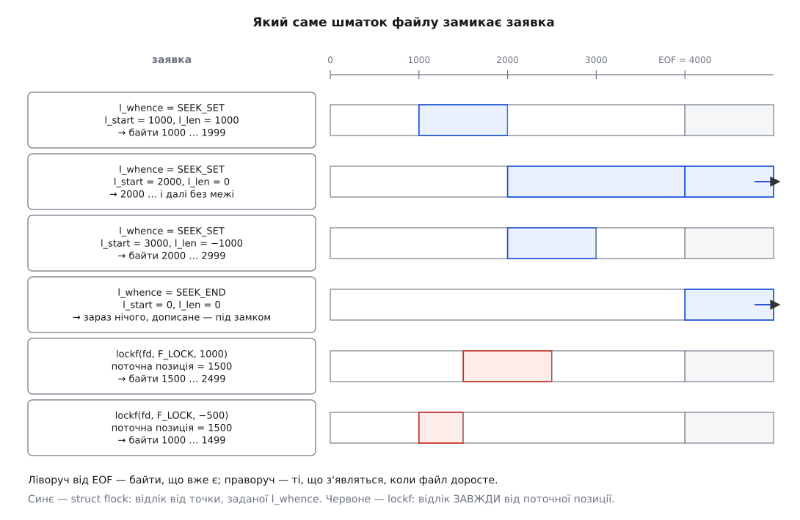

# 📋 Інтерфейси файлових замків: виклики, поля, коди відмов

Довідка для звіряння контракту: повний перелік операцій `flock(2)`, `fcntl(2)` і `lockf(3)`, структура `struct flock` поле за полем, таблиця помилок із причиною кожної та формат того, що система показує про наявні замки. Потрібна тоді, коли код уже написано й треба точно знати, який виклик, яке поле й який `errno`.

Механізмів три, а входів у ядро два. `flock` має власний системний виклик і власний набір констант. Замки записів POSIX і замки на [опис відкритого файлу](topic:sys-unix/open-file-description) входять через один і той самий `fcntl`, з однією й тією самою структурою, і різняться лише номером команди. Тому нижче `flock` описано окремо, а решту — разом.

---

## `flock(2)`

```c
#include <sys/file.h>

int flock(int fd, int op);      /* 0 або -1 з errno */
```

| Константа | Значення | Дія |
|---|---|---|
| `LOCK_SH` | 1 | спільний замок на весь файл |
| `LOCK_EX` | 2 | виключний замок на весь файл |
| `LOCK_NB` | 4 | **не операція, а домішок**: приєднується побітовим «або» до будь-якої з трьох |
| `LOCK_UN` | 8 | зняти замок |

Значення — окремі біти, тож `LOCK_EX | LOCK_NB` — це 6. Але ядро приймає не будь-яку комбінацію бітів, а рівно три значення після зняття `LOCK_NB`: 1, 2 або 8. `flock(fd, LOCK_SH | LOCK_EX)` дасть `EINVAL`, а не «якийсь із двох».

Аргумент-діапазон тут відсутній як поняття: `flock` завжди замикає файл цілком, і в `/proc/locks` такий замок завжди має межі `0 EOF`.

**Режим доступу дескриптора не звіряється.** Ядро вимагає лише, щоб дескриптор був відкритий хоч на читання, хоч на запис (`f_mode & (FMODE_READ | FMODE_WRITE)`), і не перевіряє, чи відповідає режим типу замка. Отже `LOCK_EX` на дескрипторі, відкритому з `O_RDONLY`, працює. Не працює лише `O_PATH`-дескриптор — у нього немає жодного з двох бітів, і виклик дає `EBADF`.

**`LOCK_MAND` більше не існує.** Ця константа (значення 32, поза чотирма бітами таблиці вище) колись мала позначати обов'язковий замок, але зламалася задовго до свого вилучення й ні з чим не конфліктувала. У ядрі 5.16 підтримку прибрали остаточно, зберігши сумісність найгіршим із можливих способів: заявку з цим бітом ядро **тихо ігнорує й повертає 0**, друкуючи одноразове попередження в журнал ядра. Код, що «захищався» через `LOCK_MAND`, не захищає нічого й не дізнається про це з коду повернення.

| Помилка | Причина |
|---|---|
| `EBADF` | `fd` не є відкритим дескриптором (зокрема `O_PATH`) |
| `EINTR` | під час очікування спрацював обробник сигналу |
| `EINVAL` | `op` не зводиться до `LOCK_SH`, `LOCK_EX` чи `LOCK_UN` |
| `ENOLCK` | ядру забракло пам'яті на запис про замок |
| `EWOULDBLOCK` | файл зайнято, а вказано `LOCK_NB` |

На Linux `EWOULDBLOCK` визначено як `EAGAIN` (обидва — 11), тож перевірки на них тотожні; POSIX дозволяє їм різнитися, і портабельний код звіряє обидва.

## `fcntl(2)`: шість команд замків

```c
#define _GNU_SOURCE          /* до будь-якого #include — інакше F_OFD_* невідомі */
#include <fcntl.h>

int fcntl(int fd, int op, struct flock *lock);
```

| Команда | Число | Власник замка | Чекає | Дія |
|---|---|---|---|---|
| `F_GETLK` | 5 | процес + inode | ні | розвідка: чи заважає щось |
| `F_SETLK` | 6 | процес + inode | ні | взяти або зняти; зайнято → `EAGAIN` |
| `F_SETLKW` | 7 | процес + inode | так | те саме з очікуванням; цикл → `EDEADLK` |
| `F_OFD_GETLK` | 36 | опис | ні | розвідка |
| `F_OFD_SETLK` | 37 | опис | ні | взяти або зняти; зайнято → `EAGAIN` |
| `F_OFD_SETLKW` | 38 | опис | так | те саме з очікуванням; пошуку циклів **немає** |

Три `F_OFD_*` оголошено в glibc під `#ifdef __USE_GNU`, а цей макрос вмикає лише `_GNU_SOURCE`. Без нього імена невідомі **компіляторові** — це помилка збірки, а не поведінки. Визначати макрос треба до першого `#include` або ключем `-D_GNU_SOURCE`.

Наявність підтримки в ядрі перевіряється інакше: заголовки з новішої glibc дадуть числа 36–38 і на старому ядрі, а ядро до 3.15 цих команд не знає й відповість `EINVAL`. Тобто перевірка «чи вміє система OFD-замки» — це `EINVAL` під час виконання, а не `#ifdef`.

**На 32-бітних збірках номери інші.** Коли ввімкнено `_FILE_OFFSET_BITS=64` (а також коли `time_t` 64-бітний), glibc підмінює `F_GETLK`/`F_SETLK`/`F_SETLKW` на `F_GETLK64`/`F_SETLK64`/`F_SETLKW64` — числа 12, 13, 14 — і `struct flock` на `struct flock64` ([великі файли](topic:sys-unix/large-file-support)). Тому `strace` на 32-бітній системі покаже `F_SETLK64`, а не `F_SETLK`; це не збій, а та сама команда з 64-бітними зсувами. На 64-бітних платформах `F_GETLK64` і `F_GETLK` — те саме число.

Сусідні команди того самого `fcntl`, які замками **не** є: `F_SETLEASE`/`F_GETLEASE` ставлять і читають оренду — механізм не взаємного виключення, а сповіщення про чуже відкриття ([оренда файлу](topic:sys-unix/file-leases)); `F_NOTIFY` — застаріле стеження за каталогом. У `/proc/locks` оренда з'являється поруч із замками, тож при розборі виводу її легко сплутати.

## `struct flock` — поле за полем

```c
struct flock {
    short l_type;      /* F_RDLCK = 0, F_WRLCK = 1, F_UNLCK = 2 */
    short l_whence;    /* SEEK_SET = 0, SEEK_CUR = 1, SEEK_END = 2 */
    off_t l_start;     /* зміщення від точки, заданої l_whence */
    off_t l_len;       /* довжина діапазону; 0 — до кінця файлу */
    pid_t l_pid;       /* вхід: 0 для F_OFD_*; вихід: хто заважає */
};
```

| Поле | Напрям | Що кладете | Що дістаєте |
|---|---|---|---|
| `l_type` | вхід і вихід | бажаний тип або `F_UNLCK` для зняття | після `*GETLK`: `F_UNLCK` — вільно, інакше тип конфліктного замка |
| `l_whence` | вхід і вихід | від чого відлічувати `l_start` | при конфлікті Linux ставить `SEEK_SET`, тобто зводить чужий діапазон до абсолютних байтів |
| `l_start` | вхід і вихід | зміщення початку | абсолютний початок конфліктного замка |
| `l_len` | вхід і вихід | довжина, `0` або від'ємна | довжина конфліктного замка, `0` — до кінця |
| `l_pid` | вхід і вихід | **`0` і лише `0` для `F_OFD_*`** | номер процесу-власника або `-1`, якщо це OFD-замок |

**Довжина.** Додатна `l_len` дає діапазон `l_start … l_start + l_len − 1`. Нуль означає «від `l_start` і до кінця файлу, хоч би куди той кінець доріс» — саме так, а не через поточний розмір, беруть замок на весь файл. Від'ємна `l_len` розгортає діапазон назад: `l_start + l_len … l_start − 1`. Це розширення Linux, доступне з версій 2.4.21 і 2.5.49; портабельний код тримається невід'ємних довжин.

**Точка відліку.** `l_whence` розв'язується **в мить виклику**: ядро зводить заявку до абсолютних байтів і запам'ятовує саме їх. Замок, узятий із `SEEK_CUR`, не поїде за наступним `lseek`; точка, обчислена від `SEEK_END`, лишається там, де був кінець файлу в мить виклику, і за файлом далі не рухається. Розтягнутися на дописане може лише правий край — і лише тоді, коли його немає взагалі, тобто при `l_len = 0`. Якщо після зведення початок виходить від'ємним, виклик дає `EINVAL`.



*Синє відлічується від точки, заданої `l_whence`; червоне — від поточної позиції, бо іншого вибору `lockf` не має.*

**Відповідь `*GETLK`.** Якщо ніщо не заважає, ядро ставить `l_type = F_UNLCK` і **решти полів не чіпає**. Якщо заважає — перезаписує `l_type`, `l_whence`, `l_start`, `l_len` описом **одного** з конфліктних замків (не обов'язково єдиного) і кладе в `l_pid` його власника. Звідси практичне правило: структуру треба заповнювати наново перед кожним викликом. Повторно вжити ту саму `struct flock` після `*GETLK` означає подати ядру чужий діапазон замість свого.

## `lockf(3)` — обгортка glibc

```c
/* _XOPEN_SOURCE >= 500  ||  _DEFAULT_SOURCE (glibc ≥ 2.19)
                         ||  _BSD_SOURCE / _SVID_SOURCE (glibc ≤ 2.19) */
#include <unistd.h>

int lockf(int fd, int op, off_t len);
```

Це не окремий механізм: glibc заповнює `struct flock` і викликає `fcntl`. Заповнює завжди однаково — `l_whence = SEEK_CUR`, `l_start = 0`, `l_len = len` — тому діапазон `lockf` **завжди** відлічується від поточної позиції у файлі, і жодного способу задати абсолютні межі інтерфейс не має.

| Операція | Число | У що перетворюється | Тип замка |
|---|---|---|---|
| `F_ULOCK` | 0 | `fcntl(fd, F_SETLK, …)` | `F_UNLCK` |
| `F_LOCK` | 1 | `fcntl(fd, F_SETLKW, …)` | `F_WRLCK` |
| `F_TLOCK` | 2 | `fcntl(fd, F_SETLK, …)` | `F_WRLCK` |
| `F_TEST` | 3 | `fcntl(fd, F_GETLK, …)` | **`F_RDLCK`** |

Три наслідки цієї таблиці варто прочитати уважно.

**Спільних замків `lockf` не вміє взагалі.** `F_LOCK` і `F_TLOCK` беруть тільки `F_WRLCK`. Схема «багато читачів, один письменник» через цей інтерфейс не будується — потрібен `fcntl` напряму або `flock`.

**`F_TEST` питає не те, що бере `F_LOCK`.** Розвідка йде з типом `F_RDLCK`, а замок береться з `F_WRLCK`. Нехай інший процес тримає на цих байтах замок на читання: із заявкою `F_RDLCK` він сумісний, із `F_WRLCK` — ні. Тому `F_TEST` відповість «вільно», а `F_TLOCK` одразу після нього поверне `EAGAIN`. Це не перегони в часі, а два різні питання.

**Дескриптор мусить бути відкритий на запис.** Для `F_LOCK` і `F_TLOCK` `fcntl` звірить режим і дасть `EBADF`, якщо запису немає.

Формула діапазону: додатна `len` дає `pos … pos + len − 1`, від'ємна — `len` байтів **перед** позицією, тобто `pos + len … pos − 1`, нульова — від позиції й до кінця файлу. (Сторінка `lockf(3)` описує від'ємний випадок як «`pos−size … pos−1`»; це давня друкарська помилка — за такого читання діапазон виходив би порожнім, а реалізація віддає `fcntl` рівно `l_len = len`.) Зняття `F_ULOCK` посеред замкненого шматка розрізає його на два окремі записи в ядрі.

На 32-бітних збірках із `_FILE_OFFSET_BITS=64` glibc перенаправляє виклик на `lockf64`.

## Матриця сумісності типів

Для замків із **різними** власниками, у межах одного механізму:

| наявний ↓ · заявлений → | на читання (`F_RDLCK`, `LOCK_SH`) | на запис (`F_WRLCK`, `LOCK_EX`) |
|---|---|---|
| **на читання** | сумісні | конфлікт |
| **на запис** | конфлікт | конфлікт |

Для замків **одного** власника конфлікту не буває ніколи: нова заявка не додається до старої, а **замінює** її на перекритих байтах. Заміна типу через `fcntl` неподільна — проміжку без захисту не виникає; у `flock` вона робиться зняттям і взяттям, тож проміжок є.

Хто такий «власник», залежить від механізму: для `flock` і `F_OFD_*` — опис відкритого файлу, для `F_SETLK` — пара «процес плюс inode».

Вимоги до режиму дескриптора різні в усіх трьох:

| Механізм | Що вимагає від дескриптора |
|---|---|
| `flock` | відкритий на читання **або** на запис (будь-що з двох) |
| `fcntl` `F_RDLCK` | відкритий на читання |
| `fcntl` `F_WRLCK` | відкритий на запис |
| `lockf` `F_LOCK`/`F_TLOCK` | відкритий на запис |

## Матриця взаємодії механізмів

Локально:

| наявний ↓ · заявлений → | `flock` | `fcntl` POSIX | `fcntl` OFD |
|---|---|---|---|
| **`flock`** | конфліктують | не бачать одне одного | не бачать одне одного |
| **`fcntl` POSIX** | — | конфліктують | конфліктують — **навіть у межах одного процесу** |
| **`fcntl` OFD** | — | — | конфліктують, якщо описи різні |

Клітинка «POSIX ↔ OFD» — та, яку пропускають найчастіше. Обидва види живуть в одному списку ядра, і замок, узятий через `F_SETLK`, заблокує заявку `F_OFD_SETLK` з того самого процесу. Це закріплено й у POSIX.1-2024, куди OFD-замки увійшли за заявкою Austin Group №768: виключний замок опису має перешкоджати й процесним замкам на тих самих байтах.

Клітинка «flock ↔ POSIX» тримається на тому, що з Linux 2.0 `flock` — самостійний системний виклик, а не обгортка над `fcntl`. На інших системах — зокрема на сучасних BSD — ці два види **взаємодіють**, тож припущення про незалежність непортабельне.

У [мережевій файловій системі](topic:sys-unix/network-filesystems) таблиця інша. З Linux 2.6.12 клієнт NFS не має власного `flock` і **емулює** його POSIX-замком на весь файл. Наслідок: те, що локально одне одного не бачить, на NFS бачить, бо там це буквально один механізм.

Поведінку перемикає опція монтування `local_lock` (з ядра 2.6.37):

| `local_lock=` | `flock` | POSIX-замки записів і OFD-замки |
|---|---|---|
| `none` (усталено) | на сервері | на сервері |
| `flock` | локально на клієнті | на сервері |
| `posix` | на сервері | локально на клієнті |
| `all` | локально на клієнті | локально на клієнті |

«Локально» означає, що замок не покидає клієнта: між процесами однієї машини він працює, між машинами — не існує. `local_lock=flock` відтворює поведінку клієнта до 2.6.12 і потрібен здебільшого тоді, коли змонтований NFS роздають далі через Samba. Опції `nolock`/`lock` перекривають `local_lock`.

## Коди відмов

| Код | Де виникає | Причина |
|---|---|---|
| `EAGAIN` | `F_SETLK`, `F_OFD_SETLK`, `lockf` `F_TLOCK` | діапазон тримає конфліктний замок |
| `EACCES` | `lockf` `F_TEST`; на інших системах — і `F_SETLK` | glibc для `F_TEST` віддає саме цей код. Для `F_SETLK` POSIX дозволяє будь-який із двох: Linux завжди віддає `EAGAIN`, тож портабельна перевірка звіряє обидва |
| `EWOULDBLOCK` | `flock` із `LOCK_NB` | файл зайнято; на Linux це те саме число, що `EAGAIN` |
| `EDEADLK` | `F_SETLKW`, `lockf` `F_LOCK` | ядро побачило цикл очікування. Глибина пошуку — 10 кроків, тож довші цикли пропускаються; можливі й хибні спрацювання. `F_OFD_SETLKW` цього коду не повертає ніколи |
| `ENOLCK` | усі три інтерфейси | вичерпано записи про замки в ядрі — або відмовив мережевий протокол замків (NLM на NFS) |
| `EINTR` | `flock`, `F_SETLKW`, `F_OFD_SETLKW`, `lockf` `F_LOCK` | під час очікування спрацював обробник сигналу |
| `EBADF` | усі | `fcntl`: режим дескриптора не відповідає типу замка. `flock`: не дескриптор або `O_PATH`. `lockf`: для `F_LOCK`/`F_TLOCK` дескриптор не відкрито на запис |
| `EINVAL` | усі | `flock`: неприпустимий `op`. `fcntl`: `l_pid ≠ 0` для `F_OFD_*`; невідомий `l_whence`; від'ємний зведений початок; команда `F_OFD_*` на ядрі до 3.15. `lockf`: невідома операція |
| `EFAULT` | `fcntl` | покажчик на `struct flock` поза доступним простором |
| `EIO` | `read`/`write`, **не сам замок** | замок NFSv4 втрачено; подальший ввід-вивід через цей дескриптор відмовляє, доки замок не знімуть або дескриптор не закриють (з Linux 3.12) |

Перелік вичерпний лише для локальних файлових систем. Якщо файл лежить на файловій системі, реалізованій у просторі користувача, і її [сервер FUSE](topic:sys-unix/fuse-userspace-filesystems) узявся обробляти замки сам, назовні виходить рівно той код, який повернув сервер, — зокрема й такий, якого немає в жодній довідковій сторінці. Коли ж сервер замків не обробляє, ядро тримає замок у себе, і домовленість діє лише між процесами цієї машини.

Про `EINTR` є окреме правило, яке часто рятує від зайвого коду. `flock`, `F_SETLKW` і `F_OFD_SETLKW` належать до викликів, що **перезапускаються** ядром, коли обробник сигналу встановлено з `SA_RESTART`. Тобто при акуратно налаштованих обробниках `EINTR` до програми не дійде — але покладатися на це можна лише в межах свого коду, бо чужа бібліотека може поставити обробник без цього прапорця ([EINTR і перезапуск](topic:sys-unix/eintr-and-restart)).

## `/proc/locks`

Файл показує всі замки системи ([procfs](topic:sys-unix/proc-reading-process-and-kernel-state)); один рядок — один запис у ядрі.

```
1: POSIX  ADVISORY  READ  5433 08:01:7864448 128 128
2: FLOCK  ADVISORY  WRITE 2001 08:01:7864554 0 EOF
8: OFDLCK ADVISORY  WRITE   -1 08:01:8713209 128 191
```

| № | Стовпець | Значення |
|---|---|---|
| 1 | порядковий номер | позиція в списку ядра, з двокрапкою |
| 2 | вид | `POSIX` (`fcntl` `F_SETLK`), `FLOCK` (`flock`), `OFDLCK` (`fcntl` `F_OFD_SETLK`); поруч трапляється й `LEASE` |
| 3 | обов'язковість | `ADVISORY` або `MANDATORY`; на ядрах від 5.15 — завжди перше |
| 4 | тип | `READ` — спільний, `WRITE` — виключний |
| 5 | номер процесу | власник; для OFD-замка тут `-1`, бо власника-процеса в нього немає |
| 6 | пристрій і файл | `старший:молодший:inode`; обидва номери пристрою — шістнадцяткові, номер inode — десятковий |
| 7 | початок | перший байт діапазону; для `flock` завжди `0` |
| 8 | кінець | останній байт або `EOF`; для `flock` завжди `EOF` |

Шлях до файлу тут не показано принципово — у ядрі замок висить на inode, а імен у inode може бути скільки завгодно. Щоб дістати шлях, стовпець 6 треба зіставити з відкритими дескрипторами системи; саме це й робить `lslocks`.

## `lslocks(8)`

```sh
$ sudo lslocks
COMMAND     PID  TYPE   SIZE MODE  M START END PATH
rpcbind    1379  FLOCK    0B WRITE 0     0   0 /run/rpcbind.lock
cron       2993  FLOCK    5B WRITE 0     0   0 /run/crond.pid
```

| Стовпець | Значення |
|---|---|
| `COMMAND` | ім'я програми-власника |
| `PID` | номер процесу |
| `TYPE` | `FLOCK`, `POSIX`, `OFDLCK` або `LEASE` |
| `SIZE` | розмір самого файлу, не діапазону |
| `MODE` | `READ` чи `WRITE`; **зірочка** в кінці означає, що процес не тримає замок, а чекає на нього |
| `M` | обов'язковість: `0` — консультативний, `1` — обов'язковий |
| `START`, `END` | межі діапазону |
| `PATH` | шлях; без прав на його читання — точка монтування пристрою |
| `BLOCKER` | номер процесу, що заважає (не в усталеному наборі) |
| `HOLDERS` | власники у вигляді `PID,COMMAND,FD` (не в усталеному наборі) |

Одна риса виводу збиває з пантелику найчастіше: **`EOF` перетворюється тут на нуль**. Обидва рядки прикладу — це замки `flock`, тобто на весь файл, і в `/proc/locks` вони мають межі `0 EOF`; `lslocks` показує `START 0`, `END 0`. Пара нулів означає не «нульовий діапазон», а «до кінця файлу».

Корисні ключі: `-p PID` — лише замки одного процесу, `-o COMMAND,PID,TYPE,START,END,PATH,BLOCKER` — свій набір стовпців, `--notruncate` — повний шлях без обрізання, `-J` — JSON.

## `flock(1)` з util-linux

```sh
flock [опції] файл|каталог команда [аргументи]
flock [опції] файл|каталог -c команда
flock [опції] номер-дескриптора
```

| Ключ | Дія |
|---|---|
| `-s`, `--shared` | спільний замок |
| `-x`, `-e`, `--exclusive` | виключний замок — усталено |
| `-u`, `--unlock` | зняти замок (рідко потрібне: закриття знімає само) |
| `-n`, `--nb`, `--nonblock` | не чекати, а відмовити |
| `-w СЕК`, `--wait`, `--timeout` | чекати не довше; допускає дробові значення |
| `-E N`, `--conflict-exit-code` | код виходу при відмові за `-n` чи `-w`; усталено 1 |
| `-o`, `--close` | закрити дескриптор із замком **перед** запуском команди |
| `-c`, `--command` | передати рядок оболонці через `-c` |
| `-F`, `--no-fork` | не породжувати дитину: `flock` заміщується командою й далі замок тримає вона |
| `--verbose` | повідомити, скільки тривало взяття або чому не вдалося |

Третя форма — `flock [опції] номер` — розрахована на скрипти оболонки: замок береться на вже відкритий дескриптор, а не на шлях, і живе до кінця блоку, який цей дескриптор тримає.

```sh
exec 9>/var/lock/report.lock
flock -n 9 || { echo "звіт уже будується"; exit 1; }
# ... робота під замком ...
exec 9>&-        # закриття знімає замок
```

Пара `-o` і `-F` розв'язує протилежні задачі, і плутати їх дорого. `-o` **віддає** дескриптор ще до запуску, тож команда замка не успадкує; це потрібне тоді, коли команда сама породжує довгожителя, який не має тримати файл. `-F` навпаки: замість породження дитини процес заміщується командою, і замок переходить до неї разом із дескриптором — потрібне під наглядачами служб, які стежать саме за первісним номером процесу.

## Мінімальний робочий виклик

Обгортка нижче містить усі місця, де контракт `F_OFD_*` порушують найчастіше: обнулення `l_pid`, розрізнення відмови «зайнято» та відмови «ядро не вміє», і перезапуск після сигналу.

```c
#define _GNU_SOURCE
#include <errno.h>
#include <fcntl.h>
#include <stdio.h>
#include <string.h>
#include <unistd.h>

/* type: F_RDLCK / F_WRLCK / F_UNLCK; len = 0 — до кінця файлу.
   Повертає 0, або -1 з errno. */
static int ofd_lock(int fd, short type, off_t start, off_t len, int wait)
{
    struct flock fl;
    memset(&fl, 0, sizeof fl);        /* l_pid = 0 — умова для F_OFD_* */
    fl.l_type   = type;
    fl.l_whence = SEEK_SET;
    fl.l_start  = start;
    fl.l_len    = len;

    int op = wait ? F_OFD_SETLKW : F_OFD_SETLK;
    int r;
    do {
        r = fcntl(fd, op, &fl);
    } while (r == -1 && errno == EINTR);   /* чужий обробник міг бути без SA_RESTART */
    return r;
}

int main(void)
{
    int fd = open("data.bin", O_RDWR | O_CREAT | O_CLOEXEC, 0644);
    if (fd < 0) { perror("open"); return 1; }

    if (ofd_lock(fd, F_WRLCK, 0, 0, 0) == -1) {
        if (errno == EAGAIN || errno == EACCES)
            fputs("діапазон тримає інший опис\n", stderr);
        else if (errno == EINVAL)
            fputs("ядро без OFD-замків (до 3.15)\n", stderr);
        else
            perror("F_OFD_SETLK");
        return 1;
    }

    /* розвідка тим самим описом: власний замок конфліктом не рахується */
    struct flock probe;
    memset(&probe, 0, sizeof probe);
    probe.l_type   = F_WRLCK;
    probe.l_whence = SEEK_SET;        /* l_len = 0 — увесь файл */
    if (fcntl(fd, F_OFD_GETLK, &probe) == 0)
        printf("F_OFD_GETLK: l_type=%d l_pid=%d\n", probe.l_type, probe.l_pid);

    pause();                          /* тримаємо замок, доки не вб'ють */
    return 0;
}
```

**Збірка й перевірка ззовні:**

```
$ cc -o lk lk.c && ./lk &
[1] 31428
F_OFD_GETLK: l_type=2 l_pid=0

$ grep OFDLCK /proc/locks
5: OFDLCK ADVISORY  WRITE -1 08:02:1441795 0 EOF

$ lslocks -p 31428
COMMAND   PID   TYPE SIZE MODE  M START END PATH
lk      31428 OFDLCK   0B WRITE 0     0   0 /home/u/data.bin
```

`l_type = 2` — це `F_UNLCK`, тобто «ніщо не заважає»: власний замок опису, узятий кілька рядків вище, конфліктом для себе не є. У `/proc/locks` на місці номера процесу стоїть `-1`, а `lslocks` показує обидві межі нулями — той самий замок на весь файл, побачений двома різними інструментами.

Пропуск `memset` — найтихіша з можливих помилок: у `l_pid` потрапляє сміття зі стека, і `F_OFD_SETLK` відмовляє з `EINVAL`, який дуже легко прочитати як «ядро старе».
