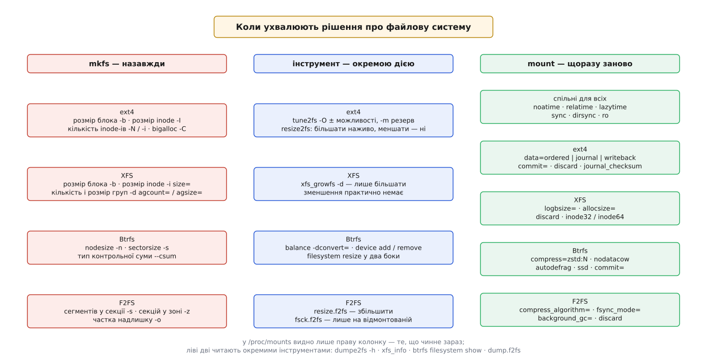

# 📋 Створення й монтування: ext4, XFS, Btrfs, F2FS

Це довідковий контракт чотирьох родин: які величини фіксуються назавжди в момент `mkfs`, які ще можна перекроїти окремим інструментом і які перебираються при кожному монтуванні. Розрізняти ці три часи важливо тому, що помилка в першому виправляється лише перенесенням усіх даних на нову файлову систему, а помилка в третьому — редагуванням одного рядка в `/etc/fstab`.

## Три часи ухвалення рішення



*Ліва колонка — те, що вже не переграти; права — те, що перебирається безкоштовно.*

Правило, спільне для всіх чотирьох: **геометрія — назавжди, поведінка — щоразу.** Розмір блока, розмір і кількість службових структур, розбиття носія на області розкладаються по носію під час форматування й вростають у формат. Політика ж — коли скидати журнал, чи стискати дані, чи оновлювати час доступу — живе в оперативній пам'яті ядра й задається прапорцями монтування.

## ext4

### `mkfs.ext4` — те, що задають один раз

| Параметр | Що задає | Типове значення | Змінити потім |
|---|---|---|---|
| `-b <байтів>` | розмір блока; степінь двійки від 1024 до 65536 | 4096 (обирається за розміром і `-T`) | ні |
| `-I <байтів>` | розмір inode; степінь двійки ≥ 128 | 256 | ні |
| `-i <байтів>` | скільки байтів простору припадає на один inode | 16384 | ні |
| `-N <число>` | пряма кількість inode-ів замість розрахунку з `-i` | — | ні |
| `-C <байтів>` | розмір кластера для `bigalloc`; від 2 до 32768 розмірів блока | 16 × розмір блока | ні |
| `-m <відсоток>` | частка блоків, доступна лише привілейованим процесам | 5 | так, `tune2fs -m` |
| `-J size=<МіБ>` | розмір журналу; від 1024 блоків до меншого з 10 240 000 блоків і половини ФС | за розміром ФС | так, зняти й створити наново |
| `-T <тип>` | набір типових значень: `floppy`, `small`, `big`, `huge` | за розміром пристрою | ні |
| `-E stride=`, `stripe_width=` | геометрія смуги під RAID, у блоках ФС | 0 | так, `tune2fs -E` |
| `-E resize=<блоків>` | скільки блоків зарезервувати під майбутнє зростання дескрипторів груп | ~1024-кратний запас | ні |
| `-E lazy_itable_init=`, `lazy_journal_init=` | не занулювати таблицю inode-ів і журнал одразу, а доручити це ядру | 1 (тобто лінива ініціалізація) | — |

Три перші рядки — найдорожча помилка ext4. Кількість [inode-ів](topic:sys-unix/inode-model) (безіменних записів, кожен із яких і є файл) розкладається по групах блоків під час форматування у **таблицю сталого розміру**; коли вони скінчаться, `creat` поверне `ENOSPC` при цілком вільному місці, і жодна команда цього не полагодить. Значення `-i 16384` означає «один файл на кожні 16 КіБ»; під теку з мільйонами дрібних файлів беруть `-i 4096`, під сховище образів дисків — `-i 1048576`.

Розмір inode 128 байтів (спадок ext2) вартий окремої згадки: у ньому немає місця під розширену мітку часу, і такі файлові системи впираються в [межу 19 січня 2038 року](topic:sys-unix/time-representation-y2038) — момент, коли 32-бітний лічильник секунд від епохи переповнюється. Типові 256 байтів цю межу знімають і додатково тримають короткі [розширені атрибути](topic:sys-unix/acl-and-xattr) прямо в inode, без окремого блока.

### Прапорці можливостей `-O`

Типовий набір ext4 складається з двох частин, обидві прописані в `/etc/mke2fs.conf`:

```
base_features = sparse_super, large_file, filetype, resize_inode, dir_index, ext_attr
ext4          = has_journal, extent, huge_file, flex_bg, metadata_csum,
                metadata_csum_seed, 64bit, dir_nlink, extra_isize, orphan_file
```

| Прапорець | Що дає | Увімкнути на готовій ФС |
|---|---|---|
| `extent` | карта блоків файлу як діапазони «початок + довжина» замість переліку номерів | `tune2fs -O extent` + `e2fsck -fD` |
| `metadata_csum` | контрольна сума на кожен блок метаданих: суперблок, дескриптори груп, inode-и, бітові карти, каталоги | `tune2fs -O metadata_csum` + `e2fsck -f` |
| `metadata_csum_seed` | сіль для сум зберігається в суперблоку окремо від UUID — тоді UUID можна змінити на змонтованій ФС | `tune2fs -O metadata_csum_seed` |
| `64bit` | номери блоків 48-бітні: стеля обсягу росте з 16 ТіБ до 1 ЕіБ | `resize2fs -b` (і `resize2fs -s`, щоб зняти) |
| `flex_bg` | бітові карти й таблиці inode-ів кількох сусідніх груп зводяться разом, а не розкидані по всьому носію | `tune2fs -O flex_bg` |
| `bigalloc` | одиниця розподілу — кластер із кількох блоків; менше метаданих на великих файлах, більше втрат на дрібних | практично ні — задається під час `mkfs` разом із `-C` |
| `has_journal` | власне журнал | `tune2fs -j`, зняти — `tune2fs -O ^has_journal` |
| `orphan_file` | список файлів, які видалили при відкритому дескрипторі, живе в окремому файлі, а не в одному замку суперблока | `tune2fs -O orphan_file` |

Прапорець ставлять з `-O <ім'я>`, знімають із `-O ^<ім'я>`. Після зміни `sparse_super`, `uninit_bg`, `filetype` чи `resize_inode` файлову систему треба прогнати через `e2fsck` — `tune2fs` про це попереджає сам.

### Що можна перекроїти потім

```bash
tune2fs -l /dev/nvme0n1p2          # увесь суперблок: можливості, лічильники, розміри
tune2fs -m 1 /dev/nvme0n1p2        # резерв суперкористувача з 5 % до 1 %
tune2fs -c 0 -i 0 /dev/nvme0n1p2   # вимкнути періодичний примусовий fsck
tune2fs -e remount-ro /dev/nvme0n1p2   # реакція ядра на виявлену помилку

resize2fs /dev/nvme0n1p2           # росте на ЗМОНТОВАНІЙ ФС
resize2fs /dev/nvme0n1p2 200G      # меншає лише на ВІДМОНТОВАНІЙ
resize2fs -M /dev/nvme0n1p2        # стиснути до мінімуму, який тримають наявні файли
```

Асиметрія тут принципова: **ext4 росте наживо й меншає лише в спокої.** Онлайн-зростання впирається у запас блоків, відведений під дескриптори груп (`resize_inode`, `-E resize=`); коли запас вичерпано, ФС доведеться відмонтувати. Меншати ж вона вміє завжди — саме тому ext4 лишається розумним вибором під розділ, розмір якого ще доведеться підбирати, надто якщо під ним лежить [device mapper](topic:sys-unix/device-mapper) — шар ядра, що складає логічні томи з фізичних відрізків.

```bash
# мінімальний робочий виклик: ФС під теку з мільйонами дрібних файлів
mkfs.ext4 -L mail -b 4096 -i 4096 -m 0 -E lazy_itable_init=0 /dev/sdb1
mount -o noatime,commit=30 /dev/sdb1 /var/spool/mail
```

## XFS

### `mkfs.xfs`

| Параметр | Що задає | Типове значення | Змінити потім |
|---|---|---|---|
| `-b size=<байтів>` | розмір блока; від 512 до 65536 | 4096 | ні |
| `-d agcount=<число>` | на скільки груп розподілу ділиться носій | за розміром пристрою | лише зростанням (нові групи додаються) |
| `-d agsize=<байтів>` | розмір однієї групи; від 16 МіБ до 1 ТіБ | похідне від `agcount` | ні |
| `-d su=<байтів>`, `sw=<число>` | ширина смуги RAID: одиниця й кількість носіїв даних | зчитується з пристрою | ні |
| `-i size=<байтів>` | розмір inode; мінімум 256 без CRC і 512 з CRC, максимум 2048 | 512 | ні |
| `-m crc=1` | контрольні суми метаданих і формат v5 | увімкнено | ні |
| `-m reflink=1` | дерево лічильників посилань — умова для спільних екстентів | увімкнено | ні |
| `-m finobt=1` | окреме дерево вільних inode-ів | увімкнено разом із `crc=1` | ні |
| `-m bigtime=1`, `inobtcount=1` | часи поза межею 2038 року; лічильник блоків у дереві inode-ів | у xfsprogs 6.x увімкнено, у старіших ні — звірити `mkfs.xfs -N` | `xfs_admin -O bigtime=1` на відмонтованій |
| `-l size=<блоків>`, `internal=1` | розмір журналу (мінімум 512 блоків) і чи лежить він усередині розділу | за розміром ФС, усередині | ні — зміну журналу на готовій ФС ядро не реалізує |
| `-l logdev=<пристрій>` | винести журнал на окремий носій | немає | ні |

Кількість груп розподілу — головна незворотна величина XFS. Кожна група має власні дерева вільного простору й власне дерево inode-ів, тому паралельні потоки не б'ються за спільні структури; але й розподіл між групами задається один раз. Прапорець `reflink=1` не менш важливий: без нього неможливі [копії з поділом блоків](topic:sys-unix/reflink-copies) — коли дві назви вказують на ті самі екстенти, доки хтось із них не почне писати, — а увімкнути його на готовій файловій системі нема чим.

Параметри `su`/`sw` вирівнюють розподіл під геометрію масиву. Щоб їх осмислено виставити, треба знати, як [рівні RAID](topic:sf-data/raid-levels) розкладають дані смугою по кількох носіях і де в цій смузі сидить надлишковість.

### Наживо й потім

```bash
xfs_info /mnt/data          # геометрія: те саме, що xfs_growfs -n
xfs_growfs -d /mnt/data     # зайняти весь наявний простір; ФС МУСИТЬ бути змонтована
xfs_growfs -D 4194304 /mnt/data   # до заданого розміру, у блоках ФС
xfs_repair -n /dev/sdb1     # сухий прогін; лагодити — лише на ВІДМОНТОВАНІЙ
xfs_admin -L label /dev/sdb1
```

> 🔧 **Навіщо це.** XFS практично не зменшується. У ядрі реалізовано лише скорочення **останньої** групи розподілу без її вилучення; жодна група не зникає, і файлову систему з єдиною групою не зменшити взагалі. На практиці це означає одне: розділ під XFS у логічному томі планують «з запасом униз», бо помилка з розміром виправляється створенням нової файлової системи й перенесенням даних. Та сама помилка на ext4 виправляється однією командою.

```bash
# мінімальний робочий виклик: сховище під великі файли на масиві 4×
mkfs.xfs -f -L archive -d su=256k,sw=3 -l size=512m /dev/md0
mount -o noatime,logbsize=256k,allocsize=16m /dev/md0 /srv/archive
```

## Btrfs

### `mkfs.btrfs`

| Параметр | Що задає | Типове значення | Змінити потім |
|---|---|---|---|
| `-n`, `--nodesize` | розмір вузла всіх B-дерев; степінь двійки, кратна сектору, не більша за 65536 | більше з 16 КіБ і розміру сторінки | ні |
| `-s`, `--sectorsize` | найменша одиниця розподілу даних | 4 КіБ (з версії 6.7) | ні |
| `--csum` | алгоритм контрольної суми: `crc32c`, `xxhash`, `sha256`, `blake2` | `crc32c` | ні |
| `-d`, `--data` | профіль надлишковості для блоків даних | `single` | так, `btrfs balance -dconvert=` |
| `-m`, `--metadata` | профіль надлишковості для метаданих | `dup` на одному носії, `raid1` на кількох | так, `btrfs balance -mconvert=` |
| `-M`, `--mixed` | дані й метадані в спільних групах блоків; має сенс для ФС менших за 1 ГіБ | вимкнено | ні |
| `-O`, `--features` | `free-space-tree`, `no-holes` (типово з 5.15), `block-group-tree` (типово з btrfs-progs 6.19), `raid-stripe-tree`, `squota` | див. ліворуч | частину — `btrfstune` |
| `-L`, `--label` | мітка тому | немає | так, `btrfs filesystem label` |

### Профілі надлишковості

| Профіль | Копій даних | Мінімум носіїв | Що витримує |
|---|---|---|---|
| `single` | 1 | 1 | нічого; сума лише виявить псування |
| `dup` | 2 в межах одного носія | 1 | локальне псування секторів, не втрату носія |
| `raid0` | 1, смугою | 2 | нічого; втрата будь-якого носія — втрата ФС |
| `raid1` | 2 на різних носіях | 2 | втрату одного носія |
| `raid1c3` / `raid1c4` | 3 / 4 | 3 / 4 | втрату двох / трьох носіїв |
| `raid10` | 2, смугою | 4 | втрату одного носія |
| `raid5` / `raid6` | парність | 3 / 4 на практиці | заявлено один / два, але **не рекомендовано** через діру запису |

Ключова відмінність від класичного масиву: `raid1` у Btrfs означає «два примірники кожного **куска**», а не «дзеркало двох дисків». Тому масив можна зібрати з носіїв різного обсягу, а профіль дозволено змінювати на живій файловій системі — перепаковкою через `balance`.

### Наживо

| Команда | Що робить |
|---|---|
| `btrfs filesystem usage /mnt` | правдива картина місця: окремо дані, окремо метадані, окремо профіль |
| `btrfs filesystem show` | які носії входять у том, скільки на кожному зайнято |
| `btrfs balance start -dusage=50 /mnt` | перепакувати групи блоків, заповнені менш ніж наполовину |
| `btrfs balance start -dconvert=raid1 -mconvert=raid1 /mnt` | змінити профіль надлишковості |
| `btrfs device add /dev/sdc /mnt`, `device remove` | додати чи вивести носій без відмонтування |
| `btrfs replace start /dev/sdb /dev/sdd /mnt` | замінити носій на місці, читаючи зі старого й з копій |
| `btrfs subvolume create /mnt/@home` | окреме дерево файлів усередині того самого тому |
| `btrfs subvolume snapshot -r /mnt/@home /mnt/.snap/1` | знімок за сталий час незалежно від обсягу: зберігається корінь дерева |
| `btrfs scrub start -B /mnt` | прочитати все підряд, звірити суми й полагодити з другої копії |
| `btrfs filesystem resize -10G /mnt`, `resize max` | змінити розмір в **обидва** боки, наживо |
| `btrfs property get /mnt compression` | який стиск фактично прописаний на об'єкті |

> 🔧 **Навіщо це.** `df` на Btrfs систематично бреше: він бачить сирі байти пристрою й не знає, скільки з них з'їсть чинний профіль і скільки вже роздано під групи метаданих. Файлова система може відмовити в `touch` із `ENOSPC`, показуючи чверть вільного місця, — це вичерпані групи під метадані. Стежити треба за `btrfs filesystem usage` і за співвідношенням `Size`/`Used` у рядку метаданих, а лікується це `btrfs balance`.

```bash
# мінімальний робочий виклик: дзеркало з двох носіїв під сховище
mkfs.btrfs -L pool -d raid1 -m raid1 /dev/sdb /dev/sdc
mount -o noatime,compress=zstd:3,space_cache=v2 /dev/sdb /srv/pool
btrfs subvolume create /srv/pool/@data
```

## F2FS

### `mkfs.f2fs`

Одиниця, навколо якої побудовано все інше, — **сегмент, жорстко 2 МіБ**. Решта геометрії задається в сегментах.

| Параметр | Що задає | Типове значення | Змінити потім |
|---|---|---|---|
| `-s <число>` | скільки послідовних сегментів утворюють **секцію** — одиницю прибирання сміття | 1 | ні |
| `-z <число>` | скільки секцій утворюють **зону**; активні логи розводяться по різних зонах | 1 | ні |
| `-o <відсоток>` | частка тому під область надлишку, невидиму для користувача, з якої живе прибиральник | розраховується | лише `resize.f2fs` |
| `-w <байтів>` | розмір сектора | розмір сектора пристрою | ні |
| `-t 0` / `-t 1` | чи виконувати discard під час форматування | 1 | — |
| `-a 0` / `-a 1` | розподіл «купою»: вузли ростуть з одного кінця простору, дані — з іншого | 1 | ні |
| `-c <пристрій>` | додати носій до багатопристроєвої ФС (до семи) | немає | ні |
| `-m` | режим зонного блокового пристрою (SMR, ZNS) | вимкнено | ні |
| `-O <можливості>` | `extra_attr`, `project_quota`, `inode_checksum`, `flexible_inline_xattr`, `quota`, `inode_crtime`, `lost_found`, `verity`, `sb_checksum`, `casefold`, `compression`, `encrypt` | базовий набір | ні |

Два практичні наслідки. По-перше, `-s` і `-z` варто узгоджувати з геометрією стирання самого носія: секція — це те, що прибиральник звільняє цілком, і коли вона збігається з блоком стирання флеша, [посилення запису](topic:sf-data/write-amplification) падає вдвічі-втричі. По-друге, `-O compression` вимагає `-O extra_attr` — стиск зберігає свої відомості в розширеній частині inode.

```bash
mkfs.f2fs -l root -O extra_attr,inode_checksum,sb_checksum,compression /dev/mmcblk0p2
fsck.f2fs -f /dev/mmcblk0p2     # лише на ВІДМОНТОВАНІЙ; -a — автоматичний режим
resize.f2fs /dev/mmcblk0p2      # збільшити до розміру розділу
dump.f2fs -d 1 /dev/mmcblk0p2   # суперблок і контрольна точка
```

## Параметри монтування

### Спільні для всіх файлових систем

| Параметр | Дія | Типово |
|---|---|---|
| `noatime` | не оновлювати час доступу взагалі | ні |
| `relatime` | оновлювати час доступу, лише якщо він старіший або рівний часу зміни | **так, з ядра 2.6.30** |
| `strictatime` | повне оновлення за POSIX — явна вимога поверх типового `relatime` | ні |
| `nodiratime` | не оновлювати час доступу на каталогах (входить у `noatime`) | ні |
| `lazytime` | часи оновлюються лише в пам'яті, а на носій потрапляють принагідно — разом із іншою зміною inode, при `fsync` або `sync` | ні |
| `sync` | кожен ввід-вивід виконується синхронно | ні |
| `dirsync` | синхронно виконуються лише зміни каталогів | ні |

Різниця між `relatime` й `noatime` менша, ніж здається: `relatime` уже усунув найдорожчий випадок — запис метаданих на кожне читання. `noatime` доцільний там, де читань дуже багато і кожне звертання до носія на рахунку; `lazytime` — там, де час доступу все-таки потрібен, але писати його щоразу шкода.

### ext4

| Параметр | Дія | Типово |
|---|---|---|
| `data=ordered` | у журнал ідуть лише метадані, але дані файлу виносяться на носій **до** запису метаданих про них | **так** |
| `data=journal` | у журнал ідуть і метадані, і самі дані — усе пишеться двічі | ні |
| `data=writeback` | у журнал ідуть лише метадані, порядок із даними не гарантовано: після збою в кінці файлу можуть виявитися чужі старі байти | ні |
| `commit=<секунд>` | як часто зливати транзакцію на носій | 5 |
| `barrier` / `nobarrier` | вимагати від пристрою скидання кешу в потрібних точках журналу | увімкнено |
| `journal_checksum` | контрольна сума транзакції — щоб не відтворити напівзаписаний намір як цілий | залежить від збирання |
| `journal_async_commit` | запис фіксації без окремого бар'єра; вимагає `journal_checksum` | ні |
| `delalloc` / `nodelalloc` | відкладати вибір фізичних блоків до самого виносу на носій | `delalloc` |
| `auto_da_alloc` | розпізнавати послідовність «переписати файл через `rename`» і виносити дані заздалегідь | увімкнено |
| `dioread_nolock` | прямий ввід-вивід без спільного замка inode | ні (`dioread_lock`) |
| `discard` / `nodiscard` | повідомляти пристрій про звільнені блоки одразу | **вимкнено** |
| `max_batch_time=`, `min_batch_time=` | скільки мікросекунд чекати, збираючи дрібні транзакції в одну | 15000 і 0 |
| `inode_readahead_blks=` | скільки блоків таблиці inode-ів читати наперед | 32 |
| `errors=remount-ro` · `continue` · `panic` | реакція на виявлену помилку | зі суперблока |

Три режими `data=` — це вибір між швидкістю й тим, що саме гарантовано після раптового вимкнення живлення; повна картина того, як журнал відновлює узгодженість, — у [журналюванні](topic:sys-unix/journaling-consistency). `nobarrier` та `commit=600` виглядають безкоштовним прискоренням рівно доти, доки не зникне живлення: обидва розширюють вікно, у якому підтверджені ядром записи ще не дійшли до носія — див. [кеш сторінок і fsync](topic:sys-unix/page-cache-durability).

### XFS

| Параметр | Дія | Типово |
|---|---|---|
| `logbsize=<16k…256k>` | розмір буфера журналу в пам'яті; більший буфер зменшує кількість звертань до журналу | 32k для журналу v1, `max(32k, log_sunit)` для v2 |
| `allocsize=<розмір>` | наскільки наперед резервувати місце за файлом, який росте; від розміру сторінки до 1 ГіБ | адаптивно, за поведінкою файлу |
| `inode64` / `inode32` | чи дозволено inode-ам мати номери поза першими 32 бітами | **`inode64` з ядра 3.7** |
| `discard` / `nodiscard` | негайний TRIM звільнених екстентів | `nodiscard` |
| `largeio` / `nolargeio` | що повертати в `st_blksize`: ширину смуги чи розмір блока | `nolargeio` |
| `noquota`, `uquota`, `pquota`, `gquota` | облік квот за користувачем, проєктом, групою | вимкнено |

Одна пастка, про яку варто знати заздалегідь: **параметри `barrier` і `nobarrier` XFS вилучено в ядрі 4.19.** Скидання кешу пристрою тепер завжди ввімкнене й не вимикається; старий рядок `/etc/fstab` із `nobarrier` після оновлення ядра дасть у журналі попередження, а не тихе прискорення.

### Btrfs

| Параметр | Дія | Типово |
|---|---|---|
| `compress=<алгоритм>[:рівень]` | стискати те, що стискається; `zlib` (рівні 1–9, типово 3), `zstd` (1–15, типово 3), `lzo`, `no`; рівні підтримуються з 5.1 | вимкнено |
| `compress-force=<…>` | стискати, не питаючи евристику, чи варто | вимкнено |
| `nodatacow` | перезаписувати блоки на місці; **тягне за собою `nodatasum` і вимикає стиск** | вимкнено |
| `nodatasum` | не рахувати контрольні суми на дані | вимкнено |
| `autodefrag` | ловити дрібні випадкові записи (десятки кілобайтів, зараз межа 64 КіБ) і ставити ділянку в чергу на перепакування; з 3.0 | вимкнено |
| `ssd`, `nossd`, `ssd_spread` | розподіл без урахування вартості переміщення голівки | автовизначення |
| `discard`, `discard=async`, `discard=sync`, `nodiscard` | асинхронний режим збирає діапазони в більші куски й шле їх фоном; є з 5.6 | **`discard=async` з 6.2** |
| `space_cache=v2` | окреме B-дерево вільного простору замість старого кешу | `v2` |
| `commit=<секунд>` | інтервал періодичної фіксації транзакції; з 3.12 | 30 |
| `subvol=<шлях>`, `subvolid=<число>` | який підтом підставити коренем цього монтування | типовий підтом тому |
| `degraded` | дозволити монтування, коли носіїв менше, ніж вимагає профіль | вимкнено |

Ланцюжок `nodatacow` варто прочитати ще раз: вимикаючи копіювання при записі для бази даних чи образу віртуальної машини (щоб файл не розсипався на сотні тисяч екстентів), ви **разом із цим** позбуваєтеся контрольних сум на його дані — суму нема коли оновити атомарно з блоком, який змінюється на місці. Ту саму дію на окремому файлі чи теці робить атрибут `C` (`chattr +C`), і накладати його треба **до** того, як у файл записано перший байт.

Стиск варто вмикати з розумінням, що `zstd` — це словниковий пошук збігів у стилі [LZ77](topic:sf-algorithms/lz77) плюс ентропійне кодування, і кожен рівень понад 3–5 з'їдає процесорний час швидше, ніж додає виграшу в місці.

### F2FS

| Параметр | Дія | Типово |
|---|---|---|
| `background_gc=on` · `off` · `sync` | фонове прибирання сміття | `on` |
| `gc_merge` | фоновий потік прибирання обслуговує й термінові запити | вимкнено |
| `atgc` | прибирання з урахуванням віку даних у секції | вимкнено |
| `discard` / `nodiscard` | TRIM у реальному часі | **`discard`** |
| `active_logs=` 2, 4 або 6 | скільки відкритих логів вести (гарячі/теплі/холодні × вузли/дані) | 6 |
| `fsync_mode=posix` · `strict` · `nobarrier` | наскільки ретельно `fsync` доводить супутні метадані до носія | `posix` |
| `compress_algorithm=` `lzo`, `lz4`, `zstd`, `lzo-rle` | алгоритм стиску | немає |
| `compress_log_size=`, `compress_extension=` | розмір кластера стиску й розширення файлів, які стискати | — |
| `inline_xattr`, `inline_data`, `inline_dentry` | тримати короткі атрибути, дані дрібних файлів і записи каталогу всередині inode | увімкнено |
| `flush_merge` | зливати одночасні команди скидання кешу в одну | вимкнено |
| `checkpoint=disable` | не робити контрольних точок — режим для швидкого оновлення образу системи | контрольні точки ввімкнено |

## `discard` проти `fstrim.timer`

Обидва роблять те саме — повідомляють носію, що блок більше не містить корисних даних, щоб контролер не переносив його вміст під час своєї внутрішньої перебудови. Різниця в тому, **коли** це відбувається.

| Спосіб | Коли шле команду | Ціна |
|---|---|---|
| `mount -o discard` | у момент звільнення блока, у критичному шляху видалення | на дешевих контролерах `unlink` великого файлу помітно гальмує |
| `mount -o discard=async` (Btrfs) | збирає діапазони й шле їх фоновим потоком | практично безкоштовно; типово з 6.2 |
| `fstrim.timer` → `fstrim -Av` | раз на тиждень (`OnCalendar=weekly`, `Persistent=true`, випадкова затримка до 100 хв) проходить усім вільним простором | сплеск навантаження на кілька секунд у зручний момент |

Розумна типова політика: **або** `discard=async` там, де він є, **або** `fstrim.timer` — вмикати обидва немає сенсу. Юніт `fstrim.timer` приходить із `util-linux` і в більшості дистрибутивів увімкнений одразу після встановлення; перевіряють це через [systemd](topic:sys-unix/systemd-model) — менеджер служб, що й запускає таймер:

```bash
systemctl status fstrim.timer
systemctl list-timers fstrim.timer
fstrim -Av                     # разовий прогін по всіх змонтованих ФС
```

Окремо варто пам'ятати, що команду мусить підтримувати весь ланцюжок під файловою системою: [блоковий пристрій](topic:sys-unix/block-device-model) із логічними томами, шифруванням чи віртуальним диском передає `discard` далі лише тоді, коли кожен шар це вміє й це йому дозволено (`discard` у `/etc/crypttab`, `issue_discards = 1` у `lvm.conf`).

## Як прочитати з живої системи, що фактично ввімкнено

Три різні джерела відповідають на три різні питання: **що записано у формат**, **що просили при монтуванні** й **що ядро насправді робить**.

```bash
# ── формат: що вросло під час mkfs ──────────────────────────────────────────
dumpe2fs -h /dev/nvme0n1p2     # суперблок ext4 без дампу груп
tune2fs -l /dev/nvme0n1p2      # те саме, іншим виглядом
xfs_info /mnt/data             # геометрія XFS: bsize, agcount, crc, reflink, log
btrfs filesystem show          # склад тому Btrfs
btrfs filesystem usage /mnt    # профілі й правдиве вільне місце
dump.f2fs -d 1 /dev/mmcblk0p2  # суперблок F2FS
cat /sys/fs/f2fs/mmcblk0p1/features   # перелік можливостей змонтованої F2FS
lsblk -f                       # тип ФС, мітка, UUID по всіх пристроях

# ── прохання: що написано в конфігурації ────────────────────────────────────
cat /etc/fstab
systemctl cat 'srv-pool.mount' 2>/dev/null

# ── дійсність: що ядро підставило зараз ─────────────────────────────────────
cat /proc/mounts               # чинні параметри, з типовими значеннями ядра
findmnt -o TARGET,SOURCE,FSTYPE,OPTIONS
cat /proc/self/mountinfo       # плюс корінь піддерева й правила поширення
```

Різниця між `/etc/fstab` і `/proc/mounts` — не формальність. У `fstab` лежить те, що просили; у `/proc/mounts` ядро друкує повний чинний набір, включно з параметрами, яких ніхто не писав: `data=ordered` для ext4, `compress=zstd:3` для Btrfs, `discard=async`, обраний ядром самотужки. Саме туди дивляться, коли треба відповісти на питання «а стиск точно ввімкнений?» — а не в конфігурацію.

Файл `/proc/self/mountinfo` показує ще один шар, якого немає в `/proc/mounts`: який саме підкаталог джерела став коренем цього монтування та як монтування поширюються між просторами імен. Що це означає й навіщо — у [моделі монтування](topic:sys-unix/mount-model), де дерево каталогів складається з окремих файлових систем.

Останнє: `mount -o remount` перебирає більшість параметрів **без відмонтування** — саме тому третя група рішень і коштує так дешево.

```bash
mount -o remount,noatime,commit=30 /srv/data
mount -o remount,compress=zstd:1 /srv/pool
```

Частину параметрів, однак, `remount` мовчки проігнорує: усе, що вимагає перебудови структур у пам'яті на момент монтування (наприклад, зміну `space_cache` чи `active_logs`), приймають лише при повному монтуванні. Перевірка одна — прочитати `/proc/mounts` після команди.

Таким чином, розмежування між моментами `mkfs`, редагуванням `/etc/fstab` та інструментами на кшталт `tune2fs` гарантує правильний баланс між незмінністю внутрішньої геометрії та гнучкістю керування продуктивністю живої системи.

