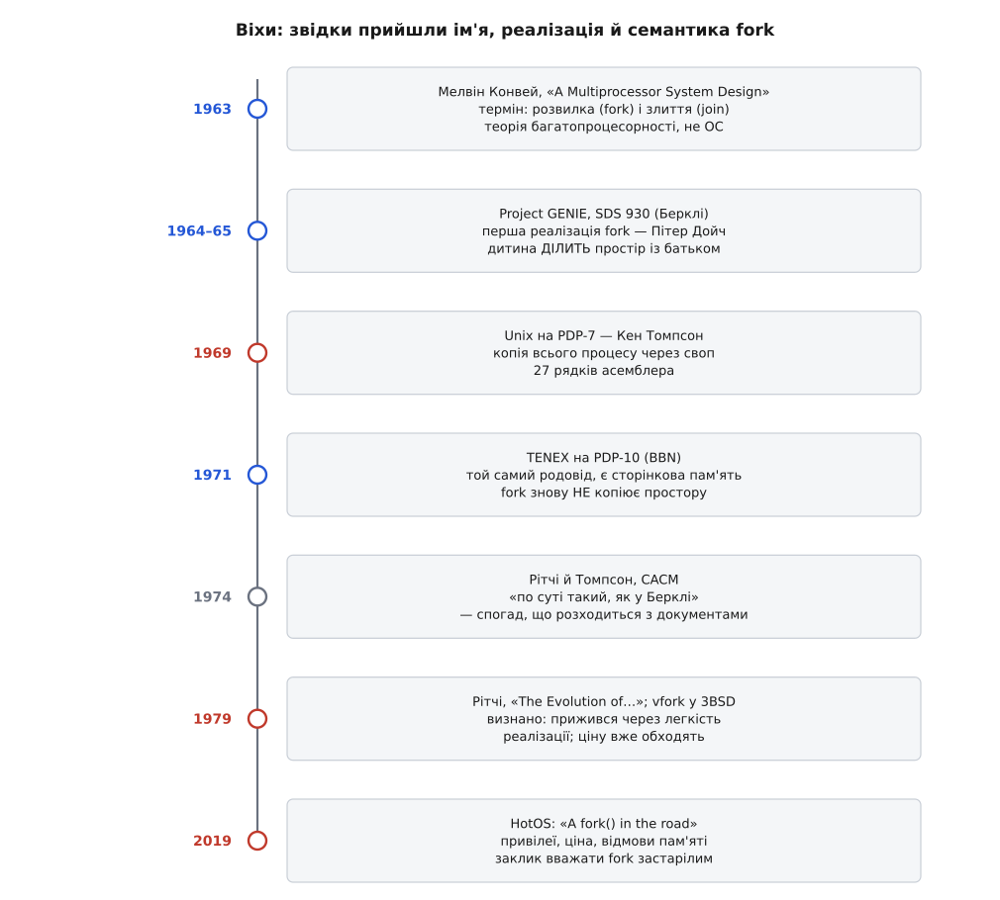
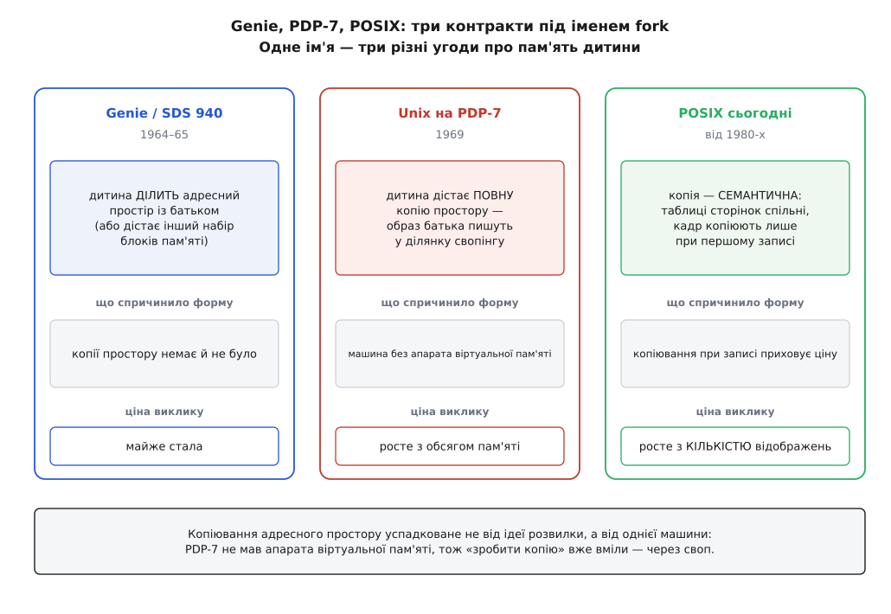

# 📜 Розвилка, яку Unix не винаходив, — і суперечка, чи час її прибрати

Слово `fork` старше за Unix, а виклик із цим іменем існував до Unix і означав **не те саме**. Ця історія варта окремої розповіді, бо в ній напрочуд чітко видно, як механізм, що його підручники півстоліття називають натхненним рішенням, насправді набув своєї форми через властивість однієї машини 1969 року — і як через п'ятдесят років саме цю форму почали називати помилкою, яку слід прибрати з ядра.


*Ім'я, реалізація й семантика прийшли з різних місць і в різний час: термін — з теорії багатопроцесорності, перша реалізація — з Берклі, а копіювання всієї пам'яті — з машини без апарата віртуальної пам'яті.*

## Термін приходить з теорії багатопроцесорності

Найраніший друкований слід поняття веде до статті Мелвіна Конвея (Melvin E. Conway) «A Multiprocessor System Design», виголошеної на осінній Об'єднаній комп'ютерній конференції (Fall Joint Computer Conference) — вона проходила 12–14 листопада 1963 року в Лас-Вегасі, а стаття посідає сторінки 139–146 збірника AFIPS. Конвей писав не про Unix і не про операційні системи в сьогоднішньому сенсі: його турбувало, як описати обчислення для машини з кількома процесорами. Звідти й пара понять — **розвилка** (fork), де одна нитка керування стає двома, і **злиття** (join), де вони знову зводяться в одну.

Доказовий статус тут варто розділити. Бібліографічні дані — рік, конференція, сторінки — перевіряються в покажчиках ACM і DBLP. А от твердження «термін походить від Конвея» — це висновок істориків, а не самоочевидність: його підтримують Лінус Німан і Мікаель Лааксо (Linus Nyman, Mikael Laakso) у «Notes on the History of Fork and Join» (IEEE Annals of the History of Computing, т. 38, № 3, 2016, с. 84–87), і саме на них спираються пізніші автори. Трапляється й розбіжність у датуванні: деякі довідники, зокрема англійська Вікіпедія, ставлять біля статті Конвея 1962 рік — імовірно, за датою написання чи препринта, тоді як конференційна публікація припадає на листопад 1963-го.

Конвей більше відомий іншим текстом — «How Do Committees Invent?» (1968), звідки походить закон Конвея про те, що структура системи повторює структуру організації, яка її будує. Розвилку керування він запропонував за п'ять років до того.

## Берклійський fork: те саме ім'я, інший виклик

Першу реалізацію приписують берклійській системі розподілу часу — тій, що виросла з **Project GENIE**. Роботу почали 1964 року на машині SDS 930, яку злегка переробили, а операційну систему написали з нуля; згодом ця конфігурація вийшла на ринок як SDS 940. Монітор (те, що сьогодні назвали б ядром) писали студент-докторант Батлер Лемпсон (Butler W. Lampson) і студенти Пітер Дойч (L. Peter Deutsch) та Чак Текер (Chuck Thacker) під керівництвом Вейна Ліхтенбергера (Wayne Lichtenberger). За свідченням, яке наводять історики, саме стаття Конвея спонукала Дойча реалізувати fork у цій системі.

І ось найважливіше, що зазвичай губиться в переказі. Берклійський `fork` **не копіював пам'ять**. Батько міг задати, який адресний простір і який машинний контекст дістане дитина: типово вона **ділила простір із батьком** — приблизно так, як сьогодні поводиться потік, — а на вибір могла дістати зовсім інший набір блоків пам'яті, вочевидь щоб виконувати іншу програму. Засобу зробити копію адресного простору там просто не було. Це не реконструкція з пам'яті учасників, а прочитання документації машини: лекцій Лемпсона про SDS 940 (1966) і технічного посібника SDS 940 Time-Sharing System (1967).

Отже, з Берклі Томпсон узяв **ім'я** й **розділення двох дій** — «створити процес» окремо від «завантажити програму». Копіювання всього стану — вже не звідти.


*Одне ім'я — три різні контракти. Те, що здається суттю виклику, насправді середній стовпчик: наслідок машини без апарата віртуальної пам'яті.*

## Двадцять сім рядків

Найпряміше свідчення про народження Unix-варіанта лишив Денніс Рітчі (Dennis M. Ritchie) у «The Evolution of the Unix Time-sharing System» (1979; передрук у Lecture Notes in Computer Science, т. 79, с. 25–35). Про походження ідеї він каже прямо: розділення функцій «певно ж не унікальне для Unix, і насправді воно було в берклійській системі розподілу часу, яка була добре відома Томпсонові».

А далі — місце, заради якого варто читати цей текст. Рітчі не пише, що розділення обрали як довершену абстракцію. Він пише, що «видається розумним припустити, що воно існує в Unix головно через легкість, з якою `fork` можна було реалізувати, не міняючи майже нічого іншого». І перелічує, що знадобилося: розширити таблицю процесів; додати виклик `fork`, який копіює поточний процес у ділянку свопінгу **вже наявними примітивами вводу-виводу** і трохи підправляє таблицю процесів. Підсумок: «`fork` на PDP-7 зайняв рівно 27 рядків асемблерного коду».

Чому цих рядків вистачило — зрозуміло з машини. PDP-7 не мав апарата віртуальної пам'яті, тож багатозадачність Unix робив єдиним доступним способом: **вивантажував увесь процес на диск і завантажував інший**. А коли «переключити процес» уже означає «записати його образ у своп», то «зробити копію процесу» — це той самий запис, тільки без витирання оригіналу. Копія цілого адресного простору не була рішенням проєктувальника; вона була **тим, що на цій машині й так уже вміли робити**. Ділити пам'ять між батьком і дитиною, як у Genie, було, навпаки, неможливо — нічим.

> 🔧 **Навіщо це.** Звідси випливає порядок причин, зворотний до звичного переказу. Не «Unix обрав копіювання, тому знадобилося [копіювання при записі](root:sf-os/copy-on-write)» — а «Unix копіював, бо на PDP-7 це було дешево; коли з'явилася апаратна пам'ять і копіювання перестало бути дешевим, довелося вигадати механізм, який робить його знову дешевим». Копіювання при записі — це не поліпшення `fork`, це компенсація його ціни, і кожен наступний обхід (`vfork`, `posix_spawn`, прапорці `clone`) — з того самого ряду.

Тим же абзацом Рітчі пояснює й те, чому `fork` не злили з `exec` в один виклик: об'єднаний варіант «був би значно складнішим — хоча б тому, що `exec` як такого не існувало; його роботу вже виконувала оболонка явним вводом-виводом». Тобто розділення в Unix спершу було не задумом, а станом справ.

## TENEX: доказ, що копіювання не було неминучим

Через рік-два після PDP-7-ного Unix у Bolt Beranek and Newman зробили TENEX — систему для PDP-10 (Деніел Бобров, Джеррі Берчфілд, Деніел Мерфі, Реймонд Томлінсон; доповідь на 3-му симпозіумі SOSP, 1971). TENEX теж успадкував ідеї Genie, теж має виклик `fork` — і теж **не копіює адресного простору**: дитина або ділить простір із батьком, або дістає порожній. Причина проста: TENEX мав сторінкову апаратуру — сторінковий блок для PDP-10 у BBN зробили самі, — тож потреби в трюку зі свопінгом не виникло.

Це важливо не як цікавинка, а як контрольний дослід. Дві системи одного походження, розділені кількома роками, розійшлися рівно там, де розійшлося залізо. Копіювальний `fork` — не неминучий висновок з ідеї розвилки; це відбиток однієї конкретної машини.

Є тут і місце, де свідчення учасників розходяться з документами. Рітчі й Томпсон у статті «The UNIX Time-sharing System» (CACM, липень 1974) написали, що `fork` був у берклійській системі «по суті таким, як ми його реалізували». З технічних описів SDS 940 випливає, що це не так: берклійський виклик мав інший контракт. Найпростіше пояснення — звичайне для історії техніки: учасник пам'ятає ідею, а не подробиці інтерфейсу, і за десять років різниця стирається. Статус цих двох свідчень різний: спогад у CACM — першоджерело щодо намірів авторів, але не щодо чужої системи; документація SDS 940 — першоджерело щодо неї.

## 2019: «fork() на роздоріжжі»

Через півстоліття та сама властивість — «дитина успадковує геть усе» — стала предметом фронтальної критики. Доповідь «A fork() in the road» (Ендрю Бауман з Microsoft Research, Джонатан Аппаву й Оран Крігер з Бостонського університету, Тімоті Роско з ETH Zurich) прозвучала на HotOS '19 — 17-му семінарі Hot Topics in Operating Systems, у травні 2019 року в Бертіноро (Італія). Теза винесена в анотацію: `fork` був «спритним хаком для машин і програм 1970-х, який давно пережив свою корисність і тепер є тягарем».

Автори починають з того, що звичка засліплює. Вони переглянули підручники з операційних систем і не знайшли жодного, який писав би про `fork` критично; студентам натомість кажуть, що це «одна з великих ідей Unix». А тим часом у реальному коді:

```
пакунків Ubuntu, які кличуть fork         1304   (7.2 % усіх пакунків)
пакунків, які кличуть posix_spawn           41
```

*(цифри з доповіді, здобуті переписом використання POSIX-інтерфейсів — Атлідакіс зі співавторами, EuroSys 2016)*

За тими цифрами стоять не забуті програми: `fork` кличуть майже всі оболонки, Apache, PostgreSQL, Oracle, Chrome, Redis і навіть Node.js.

Далі йдуть закиди. Три з них варто розібрати, бо кожен — це та сама успадкована властивість, побачена з іншого боку.

### Успадкувати все — значить успадкувати зайве

Типово дитина дістає **все**: відкриті дескриптори, відображення пам'яті з ключами й паролями, ідентичність, простори імен. Щоб дитина не мала зайвого, програміст мусить **явно віднімати** — закрити дескриптори або позначити їх як `FD_CLOEXEC`, затерти секрети в пам'яті, від'єднати простори імен. Це прямо суперечить [принципу найменших привілеїв](root:sf-security/least-privilege): усталений вибір мав би давати мінімум, а додаткові права — надаватися явно. Тут усталений вибір дає максимум, а забирати треба руками — і кожне забуте віднімання є діркою.

Автори додають менш очевидний наслідок: програма, яка робить `fork` **без** наступного [exec](root:sys-unix/exec-semantics), знецінює рандомізацію розташування адресного простору — усі копії дістають однакову карту пам'яті, тож адреса, підібрана в одній, чинна в усіх.

### Ціна, що росте разом із пам'яттю

Другий закид — вимірюваний. Навіть із копіюванням при записі `fork` мусить пройтися відображеннями батька й позабирати права на запис, а ця робота пропорційна не тому, скільки дитина використає, а тому, скільки батько **має**:

```
батько тримає N МіБ власних (брудних) сторінок

fork + exec        →  час ∝ N        лінійно росте разом із батьком
posix_spawn        →  час ≈ const    від N не залежить
```

*(форма залежності — з вимірювань самої доповіді; точні мілісекунди залежать від машини й ядра, тому тут не наводяться — важлива не величина, а те, що одна крива похила, а друга плоска)*

Найгірший випадок у них не найбільший, а найскладніший: коли адресний простір посічений чергуванням сторінок «лише читання» й «читання-запис» — тобто саме те, що дають спільні бібліотеки, рандомізація й компіляція на льоту. Звідси й практичний висновок доповіді: бібліотеки мов уже уникають `fork` усередині `posix_spawn`, а в Solaris `spawn` зробили окремим системним викликом ядра.

### Відмова, до якої ніхто не готувався

Третій закид найтонший. Кожне відображення «копіювати при записі» — це **потенційна** сторінка пам'яті: якщо котрийсь із двох процесів у неї запише, фізичний кадр таки знадобиться. Сумлінна реалізація мала б відхиляти `fork`, поки немає запасу під усі такі сторінки, — але тоді процес на 30 ГіБ не зможе розмножитися навіть заради дитини, яка негайно зробить `exec` і не торкнеться нічого. Тому Linux типово дозволяє [надлишкові зобов'язання](root:sys-unix/overcommit-and-oom): відображення створюються одразу, а нестача виявляється пізніше — сторінковим винятком, який уже нікуди подіти, крім як покликати вбивцю процесів.

Формулювання авторів прямолінійне: справжні програми не готові обробляти «на позір безпричинні» помилки браку пам'яті у `fork`. Redis, який робить `fork` заради знімка бази, прямо радить **не вимикати** надлишкові зобов'язання — інакше довелося б обмежити себе половиною доступної пам'яті.

## Що з цим робити — і чого доповідь не доводить

Натомість автори пропонують дві речі: високорівневий `spawn` (передусім `posix_spawn`) для переважної більшості випадків «створити процес і запустити в ньому програму» — і низькорівневий набір операцій, якими один процес може налаштовувати стан іншого, для решти. `vfork` вони згадують радше як паліатив: він близький до берклійського варіанта — дитина ділить простір із батьком, доки не зробить `exec`, — і саме через спільний простір ним важко користуватися безпечно. Порівняння цих способів між собою — окрема тема: [чим ще народжують процес](root:sys-unix/spawn-alternatives).

Тепер про доказовий статус самої доповіді, бо його легко переоцінити. HotOS — семінар для **позиційних** доповідей: там навмисне друкують загострені тези, щоб їх обговорювали, а не завершені дослідження. Вимірювання в статті реальні, перепис пакунків узятий із рецензованої роботи, вади `fork` (небезпека потоків, ціна, відсутність компонування) визнані й задокументовані незалежно. А от висновок «прибрати `fork` з ядра, лишивши емуляцію для старого коду» — це заклик, а не результат: жодне масове Unix-подібне ядро його не виконало, `fork` лишається і в POSIX, і в Linux, а пре-форкові сервери й знімки Redis і далі користуються ним свідомо. Самі автори чесно окреслюють, для чого `fork` досі добрий: однопотоковий процес із невеликою пам'яттю, якому треба тонко налаштувати оточення дитини й не треба від неї ізолюватися. Тобто — оболонка. Питання, яке вони ставлять, звучить інакше: чи варто й далі підганяти системний інтерфейс під зручність оболонки.

## Кого насправді слід виправляти

Найдивніше в цій історії те, що обидві сторони суперечки погоджуються між собою щодо фактів. Рітчі ніколи не стверджував, що `fork` — натхненний задум; він написав протилежне — що виклик, найпевніше, живе в Unix через легкість реалізації. Критики 2019 року цитують саме його й додають лише те, чого він знати не міг: як ця легкість оплачується через півстоліття.

Хибний переказ народився посередині — у підручниках, які перетворили технічну випадковість на архітектурну чесноту, і в навчальних курсах, де `fork` подають як **перший** спосіб створити процес, з якого студент дізнається, що таке процес узагалі. Саме до цього звернений останній заклик доповіді: викладати `fork` як історичний артефакт. Це, мабуть, найдивніша доля, яка може спіткати двадцять сім рядків асемблера, написаних, щоб не переробляти решту системи.
