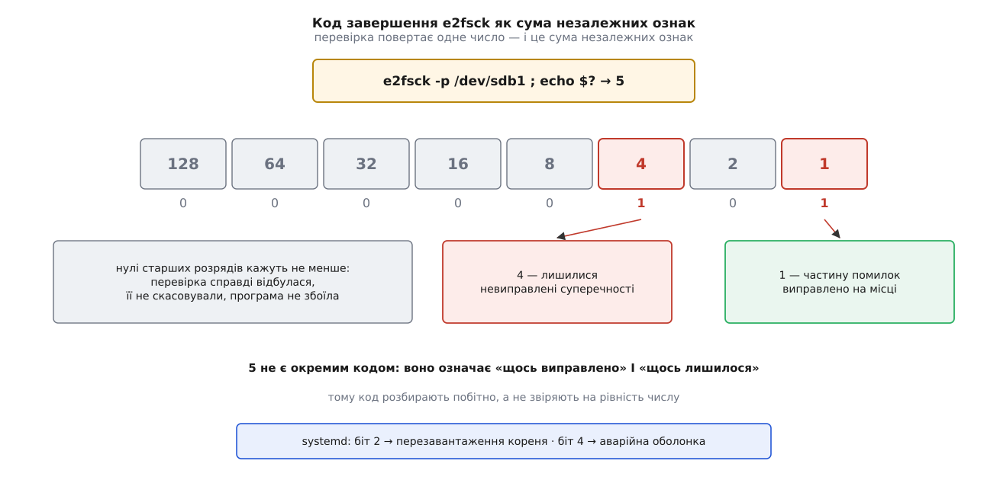

# 🧰 Контракт запуску перевірки: програми, ключі, коди, налаштування

Це довідка про інтерфейс перевірки файлової системи: яку саме програму викликають, який ключ що змінює, яке число вона повертає й у яких місцях описано, щоб усе це відбулося саме́ під час завантаження. Кожен рядок нижче — не лише «що робить», а й «коли це доречно», бо тут половина ключів безпечна, а половина незворотна.

## Диспетчер і виконавці

Команда `fsck` — це диспетчер. Вона визначає тип файлової системи (за суперблоком через `blkid`, або за ключем `-t`, або з рядка у `/etc/fstab`), знаходить програму з іменем `fsck.<тип>` і передає їй керування. Спільним у всіх типів лишається одне: набір кодів завершення.

```
fsck [ключі-диспетчера] [-t список-типів] пристрій…  [-- ключі-перевіряльника]
fsck.<тип> [ключі] пристрій…
```

| виклик | що це насправді | що відбувається |
|---|---|---|
| `fsck.ext2`, `fsck.ext3`, `fsck.ext4` | посилання на `e2fsck` | повна перевірка й ремонт |
| `fsck.xfs` | сценарій-заглушка | нічого: виходить із нулем, бо XFS докочує журнал під час монтування. Виняток — `fsck.mode=force` у командному рядку ядра або файл `/forcefsck`: тоді сценарій запускає `xfs_repair` |
| `xfs_repair` | окрема програма | справжня перевірка й ремонт XFS; тільки вручну, на розмонтованому томі |
| `fsck.btrfs` | сценарій-заглушка | нічого; `btrfs check` викликають лише вручну й лише за потреби |
| `fsck.vfat` | посилання на `dosfsck` | перевірка FAT |

Ключі самого диспетчера стосуються не тому, а порядку роботи з багатьма томами.

| ключ | дія | коли доречно |
|---|---|---|
| `-A` | пройти `/etc/fstab` і перевірити всі томи за їхніми номерами проходу | єдиний режим, у якому диспетчер узагалі корисний; так його викликає система ініціалізації |
| `-R` | разом із `-A` пропустити кореневий том | коли корінь уже змонтовано й перевіряти його нема як |
| `-P` | разом із `-A` перевіряти корінь паралельно з рештою | рідко: типово корінь іде окремо й першим |
| `-M` | не чіпати змонтовані томи, повернути для них нуль | захист від найгіршої помилки — запису в змонтований том |
| `-N` | нічого не виконувати, лише показати, що́ було б запущено | розвідка перед `-A` |
| `-C [fd]` | видавати смужку поступу (лише ext2/3/4) | довгі перевірки під наглядом |
| `-l` | взяти виключне блокування `flock(2)` на цілий диск (`/run/fsck/<диск>.lock`) | коли поруч працює інша утиліта того самого диска |
| `-s` | послідовно, по одній перевірці за раз | інтерактивний ремонт: інакше кілька програм заговорять у той самий термінал |
| `-t список` | обмежити типи (`-t ext4`, `-t noext4`, `-t opts=ro`) | вибірковий обхід `fstab` |
| `-r [fd]` | видати статистику по кожному тому | збір даних |
| `--` | усе після цього — ключі перевіряльника | коли треба передати щось, чого диспетчер не знає |

Крізь диспетчер самі проходять чотири ключі — `-a`, `-n`, `-y`, `-r`; решту невідомих він також передає далі. Ще два важелі живуть у змінних середовища: `FSCK_MAX_INST` обмежує число одночасних перевірок, `FSCK_FORCE_ALL_PARALLEL` знімає обережність і запускає всі томи разом, навіть коли вони на одному фізичному диску.

## Ключі `e2fsck`: що безпечно, а що ні

| ключ | дія | коли доречно |
|---|---|---|
| `-n` | відкрити том **лише для читання** й на всі питання відповісти «ні» | завжди першим. Це розвідка: звіт буде повний, том лишиться недоторканим |
| `-p` | *preen* — виправляти самотужки лише те, що виправляється однозначно; на першому ризикованому питанні зупинитися й вийти з кодом, до якого домішано `4` | автоматичний запуск при завантаженні. Придатний і вручну, коли хочеться «зроби безпечне, решту покажи» |
| `-a` | те саме, що `-p` | лише для сумісності зі старими сценаріями |
| `-y` | відповісти «так» на всі питання | коли розвідка вже зроблена, рішення прийнято й людини біля терміналу не буде. На незнайомому томі — останній крок, не перший |
| `-f` | перевіряти, навіть якщо том позначено чистим | обов'язковий супутник `-n`: без нього чистий том перевірку просто пропустить і збреше нулем |
| `-c` | прогнати `badblocks` у режимі читання й занести знайдені збійні блоки в список | підозра на фізичний носій. Зазвичай зайве: сучасні накопичувачі перепризначають збійні сектори самі, і чесніше дивитися в SMART |
| `-c -c` | те саме, але тестом «читання-запис», не руйнівним для даних | глибша перевірка носія; довго |
| `-k` | разом із `-c` не викидати попередній список збійних блоків | повторний прогін `-c` |
| `-b <блок>` | узяти суперблок не первинний, а резервний | первинний суперблок зіпсовано: `e2fsck` не впізнає файлову систему |
| `-B <розмір>` | шукати суперблок лише з таким розміром блока | разом із `-b`, коли автоматичний добір розміру збиває з пантелику |
| `-z <файл>` | писати старий вміст кожного зміненого блока у файл скасування | ремонт, який може стати гіршим за біду: `e2undo` поверне том назад |
| `-D` | перебудувати каталоги: стиснути, впорядкувати, переіндексувати | окрема оптимізація, не частина ремонту |
| `-F` | скинути кеші блокового пристрою перед початком | вимірювання швидкості; на ремонт не впливає |
| `-C <fd>` | писати поступ у вказаний дескриптор | коли перевірку запускає інша програма |
| `-t` | друкувати час кожного проходу | діагностика довгих перевірок |
| `-E <розширені>` | тонкі налаштування: `discard`/`nodiscard`, `fixes_only`, `optimize_extents`, `unshare_blocks`, `readahead_kb=`, `check_encoding` | окремі задачі; `fixes_only` корисний тим, що забороняє будь-яку оптимізацію — лише виправлення |

Зверніть увагу на пару `-n` і `-f`. Поодинці `-n` майже нічого не вартий: том, позначений чистим, буде оголошено справним за секунду. Розвідка — це `-fn`, і саме її роблять першою.

> 🔧 **Навіщо це.** Ключ `-y` спокусливий тим, що не питає. Але кожне питання `e2fsck` — це місце, де програма не має доказів і обирає ймовірніше; відповівши «так» наперед, ви віддаєте їй усі такі рішення, зокрема «викинути каталог, який здається зіпсованим». Тому послідовність стала: `-fn` → подивитися звіт → зняти копію → аж тоді `-fy`.

## Мінімальний робочий виклик

```bash
umount /dev/sdb1                                  # ремонтувати можна лише розмонтоване
e2image -r /dev/sdb1 /rescue/sdb1.meta            # знімок метаданих, поки нічого не змінено
e2fsck -fn /dev/sdb1 ; echo "код: $?"             # розвідка: нічого не міняти, показати все
e2fsck -fy -z /rescue/sdb1.undo /dev/sdb1         # ремонт із можливістю відкоту
e2undo /rescue/sdb1.undo /dev/sdb1                # якщо стало гірше — повернути як було
```

`e2image -r` зберігає лише метадані — суперблок, таблиці inode, каталоги, бітові карти — у файл, який зазвичай на порядки менший за том. Цього досить, щоб потім відтворити структуру або показати фахівцеві, що́ саме було до втручання.

Коли первинний суперблок зіпсовано, перед розвідкою треба знайти резервний:

```bash
mke2fs -n /dev/sdb1              # -n НІЧОГО не створює: лише друкує розкладку й резервні копії
dumpe2fs /dev/sdb1 | grep -i "суперблок\|superblock"
e2fsck -fn -b 32768 -B 4096 /dev/sdb1
```

Розташування резервних копій залежить від розміру блока, кількості блоків у групі та можливості `sparse_super`; для звичайного тому перша резервна копія лежить на початку другої групи блоків:

```
розмір блока 1024 → 8193
розмір блока 2048 → 16384
розмір блока 4096 → 32768
```

Пропущений `-n` у `mke2fs` перетворює розвідку на створення нової порожньої файлової системи поверх старої — це та помилка, після якої довідка вже не потрібна.

## Коди завершення

Число, яке повертає перевірка, — не перелік випадків, а сума незалежних ознак. Однакова таблиця чинна і для диспетчера `fsck`, і для `e2fsck`.

| біт | значення | що сталося |
|---|---|---|
| 0 | `1` | помилки були й виправлені |
| 1 | `2` | помилки виправлені, потрібне перезавантаження |
| 2 | `4` | помилки лишилися невиправленими |
| 3 | `8` | збій у роботі самої програми |
| 4 | `16` | помилка виклику чи синтаксису |
| 5 | `32` | перевірку скасував користувач |
| 7 | `128` | біда з рухомою бібліотекою |

Коли диспетчер перевіряє кілька томів, він повертає порозрядне «або» їхніх кодів.



*Одне число несе кілька незалежних фактів, тому його розбирають побітно.*

```bash
e2fsck -p /dev/sdb1
rc=$?
(( rc & 2 ))  && echo "корінь виправлено — треба перезавантажитися"
(( rc & 4 ))  && echo "лишилися невиправлені помилки — потрібна людина"
(( rc >= 8 )) && echo "перевірка не відбулася; стан тому невідомий"
```

Останній рядок правдивий тому, що сума молодших ознак не може перевищити `7`: усе, що більше, означає ввімкнений старший біт.

Служби [systemd](topic:sys-unix/systemd-model) читають цей код буквально. `systemd-fsck-root.service` за ознакою `2` вмикає `reboot.target`, а за ознакою `4` — `emergency.target`. `systemd-fsck@.service` для решти томів у обох випадках просто зазнає невдачі, і монтування, яке на неї спиралося, не відбувається.

## Шосте поле `/etc/fstab`

Рядок таблиці монтувань закінчується двома числами, і друге з них — номер проходу перевірки. Про саму таблицю й порядок монтувань є [окремий опис](topic:sys-unix/mount-model): тут важливе лише останнє поле.

```
# пристрій        точка   тип   опції      fs_freq  fs_passno
UUID=6f4b…-a19c   /       ext4  defaults   0        1
UUID=b210…-77e3   /home   ext4  defaults   0        2
UUID=0c88…-5d41   /data   xfs   defaults   0        0
```

| значення | класичний `fsck -A` | systemd |
|---|---|---|
| `0` або поле відсутнє | не перевіряти | не перевіряти: служба не стартує |
| `1` | кореневий том; перевіряється першим і сам | стартує `systemd-fsck-root.service` |
| `2` | решта; перевіряються після кореня, паралельно на різних дисках і послідовно в межах одного | стартує `systemd-fsck@<пристрій>.service` |

Різниця між колонками принципова. Класичний диспетчер сам будує чергу за числами, стежачи, щоб дві перевірки не гризли один шпиндель. Systemd натомість дивиться лише на «нуль чи не нуль»: служба перевірки стартує, якщо поле більше за нуль **і** том узагалі монтується при завантаженні (без опції `noauto`). Черговість тут задає не число, а залежності юнітів — кожне монтування має власну службу перевірки, впорядковану перед ним.

## Параметри ядра

Обидва параметри читає `systemd-fsck@.service`, і пишуть їх туди ж, де живуть усі інші параметри ядра, — у [командний рядок, який передає завантажувач](topic:sys-unix/bootloader-and-cmdline).

| параметр | значення | дія |
|---|---|---|
| `fsck.mode=` | `auto` (усталено) | перевіряти, коли перевіряльник вважає це за потрібне (позначка помилки, брудне розмонтування, вичерпані лічильники) |
| | `force` | безумовна повна перевірка — те саме, що `-f` |
| | `skip` | не перевіряти нічого |
| `fsck.repair=` | `preen` (усталено) | виправляти лише безпечне — ключ `-p` |
| | `yes` | відповідати «так» на всі питання — ключ `-y` |
| | `no` | не міняти нічого — ключ `-n` |

Найкорисніша пара — не та, що ремонтує, а та, що дивиться:

```
fsck.mode=force fsck.repair=no
```

Це повний огляд усіх томів при завантаженні без жодного запису. Звіт осяде в журналі, том лишиться недоторканим — а вже за звітом ви вирішите, що робити далі.

Зверніть увагу: `fsck.mode=force` будить і заглушку `fsck.xfs`, яка інакше не робить нічого, — вона запустить `xfs_repair`. Давній прийом «створити файл `/forcefsck` у корені» systemd не розуміє, але той самий `fsck.xfs` його досі шанує.

## Стан тому й розклад перевірок: `tune2fs`

`tune2fs -l <пристрій>` друкує суперблок. Для перевірки важать шість полів.

| поле | що означає |
|---|---|
| `Filesystem state` | `clean` — розмонтовано чисто; `not clean` — том змонтований або розмонтований аварійно; `clean with errors` — ядро вже записало сюди позначку помилки |
| `Errors behavior` | що робить ядро, побачивши суперечність: `Continue`, `Remount read-only`, `Panic` |
| `Mount count` / `Maximum mount count` | скільки разів том монтували від останньої перевірки і після скількох її вимагати; `-1` означає «ніколи» |
| `Last checked` / `Check interval` / `Next check after` | коли перевіряли востаннє, який проміжок дозволено й коли настане строк |
| `FS Error count`, `First error time`, `Last error time` | лічильник і мітки часу помилок, які ядро зберегло в суперблоці |

Ті самі величини змінюють ключами.

| ключ | дія | коли доречно |
|---|---|---|
| `-c <число>` | поріг монтувань до примусової перевірки; `0` або `-1` вимикає | майже ніколи; значення `random` дає випадкове число від 20 до 40 — навмисно, щоб десяток томів не зажадав перевірки одного дня |
| `-i <проміжок>` | найбільший час між перевірками: без суфікса або з `d` — дні, `w` — тижні, `m` — місяці; `0` вимикає | те саме |
| `-C <число>` | виставити поточний лічильник монтувань | значення більше за поріг змусить перевірку при наступному завантаженні — чесний спосіб її замовити |
| `-T <час>` | виставити час останньої перевірки: `YYYYMMDD[HH[MM[SS]]]` або `now` | лагодження наслідків збитого годинника |
| `-e <поведінка>` | `continue`, `remount-ro`, `panic` | `remount-ro` — розумний вибір: том перестає псуватися далі |
| `-f` | виконати попри помилки | коли `tune2fs` сам відмовляється чіпати підозрілий том |

Планові перевірки — спадок епохи без журналу. Нові томи їх типово не мають: `mke2fs` вмикає лічильники, лише якщо у `/etc/mke2fs.conf` стоїть `enable_periodic_fsck = 1`, і тоді ставить строк у 180 днів та випадкове число монтувань.

> 🔧 **Навіщо це.** Спокуса скористатися `-T now` чи `-C 0`, щоб машина перестала проситися на перевірку, майже нездоланна. Але ці ключі рухають лічильники — і тільки. Позначку `clean with errors` вони не знімають: її ставить ядро, а прибирає лише успішний прогін `e2fsck`. Якщо після `-T now` попередження зникло, ви вимкнули не біду, а її сповіщення.

## `/etc/e2fsck.conf`

Файл поділено на розділи виду `[назва]` з рядками `ключ = значення`. Найважливіший для великих томів — той, що переселяє робочі таблиці з пам'яті на диск.

```ini
[scratch_files]
        directory = /var/cache/e2fsck
        numdirs_threshold = 100000
        dirinfo = true
        icount = true

[options]
        readahead_kb = 16384
        log_filename = /var/log/e2fsck/e2fsck-%N.%h.%D.log
        broken_system_clock = false
        defer_check_on_battery = true
```

| відношення | дія |
|---|---|
| `scratch_files/directory` | якщо каталог існує й доступний на запис, `e2fsck` тримає свої таблиці у файлах у ньому, а не в пам'яті |
| `scratch_files/numdirs_threshold` | нижче цього числа каталогів лишатися в пам'яті — файли повільніші, і на малому томі вони зайві |
| `scratch_files/dirinfo` | чи виносити на диск відомості про каталоги; усталено `true` |
| `scratch_files/icount` | чи виносити на диск підрахунок посилань на inode; усталено `true` |
| `options/readahead_kb` | скільки пам'яті віддати на випереджувальне читання метаданих поперед основного потоку перевірки |
| `options/log_filename` | куди складати повний протокол; у назві можна вживати підстановки дати, часу й пристрою |
| `options/broken_system_clock` | не вірити часовим перевіркам, коли годинник машини ненадійний |
| `options/defer_check_on_battery` | подвоїти дозволений проміжок, поки живлення від батареї; усталено `true` |
| `options/accept_time_fudge` | дозволити розбіжність часу в суперблоці до доби; усталено `true` |
| `[problems]` | розділ, у якому адміністратор наперед задає відповідь на конкретну суперечність за її шістнадцятковим кодом |

Обидві таблиці, які виносить `scratch_files`, ростуть із розміром тому, а не з кількістю пошкоджень, — тому саме вони первинно з'їдають пам'ять на багатотерабайтних томах. Плата за перенесення проста: перевірка стає в рази повільнішою, зате доходить до кінця.

## Огляд живої системи: `e2scrub`, `xfs_scrub`, `btrfs scrub`

Тут проходить межа, яку легко втратити. Перевірка узгодженості питає, чи сходяться між собою твердження метаданих, і вимагає розмонтованого тому. Огляд (*scrub*) працює на живій системі й питає інше — чи не зіпсувалися байти проти збережених контрольних сум.

**`e2scrub`** — виняток, що поєднує обидва: він робить знімок [логічного тому LVM](topic:sys-unix/lvm-and-snapshots) і проганяє повну перевірку по знімку, поки оригінал працює.

```
e2scrub [ключі] ТОЧКА-МОНТУВАННЯ | ПРИСТРІЙ
e2scrub_all [ключі]
```

| ключ | дія |
|---|---|
| `-n` | надрукувати команди, які було б виконано, і нічого не робити |
| `-r` | прибрати знімок `<ім'я-тому>.e2scrub` і вийти, нічого не перевіряючи |
| `-t` | якщо помилок не знайдено, прогнати `fstrim` на змонтованій системі |
| `-A` | *(тільки `e2scrub_all`)* оглянути всі томи ext2/3/4, навіть не змонтовані |

Умови жорсткі: файлова система має лежати на логічному томі, а в групі томів мусить бути щонайменше 256 МіБ невиділеного місця під знімок — інакше том мовчки пропускають. Ремонтувати `e2scrub` не вміє й не намагається: знімок — копія, виправлення в ній оригіналові нічого не дадуть. Знайшовши помилки, він робить єдине можливе — **ставить оригіналові позначку помилки**, щоб наступне завантаження не змогло пройти повз. Ключ `-t` варто розуміти правильно: це не частина перевірки, а нагода при нагоді сказати накопичувачеві, які блоки вільні (див. [discard і TRIM](topic:sf-data/discard-and-trim)).

**`xfs_scrub`** оглядає змонтовану XFS засобами ядра.

```
xfs_scrub [-abCeMmnpTvx] ТОЧКА-МОНТУВАННЯ
```

| ключ | дія |
|---|---|
| `-n` | лише перевіряти метадані, нічого не ремонтувати й не оптимізувати |
| `-p` | лише оптимізувати метадані; про потрібний ремонт доповісти й вийти |
| `-x` | прочитати всі блоки даних файлів, шукаючи збої носія |
| `-a <число>` | припинити роботу, знайшовши більше вказаного числа помилок |
| `-e shutdown` | при знайдених помилках вимкнути файлову систему; усталено `continue` |
| `-k` | не звертатися до накопичувача з TRIM по вільному місцю |
| `-b` | працювати у тлі, одним потоком за раз |
| `-T` | друкувати час і витрату пам'яті кожної фази |

Коди завершення в нього свої: `0` — помилок немає, `1` — лишилися невиправлені, `2` — можлива оптимізація, `4` — збій у роботі, `8` — помилка виклику; складаються так само.

Повний ремонт XFS живе окремо, у `xfs_repair`, і має власну особливість: недокочений журнал він докотити не може — [журнал XFS уміє відтворити лише ядро](topic:sys-unix/journaling-consistency), ще й на машині тієї самої архітектури. Побачивши брудний журнал, програма виходить із кодом `2`; правильний хід — змонтувати том і одразу розмонтувати. Ключі: `-n` — не міняти нічого, `-L` — обнулити журнал (останній засіб: усі метадані «в польоті» зникнуть), `-d` — дозволити ремонт кореня, змонтованого лише для читання, `-e` — повертати `4` замість `0`, якщо щось було виправлено, `-m <МБ>` — стеля пам'яті, `-P` — вимкнути випереджувальне читання, коли робота застрягає.

**`btrfs scrub`** читає все підряд і звіряє з контрольними сумами, які Btrfs зберігає для кожного блока — і метаданих, і даних.

```
btrfs scrub start  [-BdrRf] [-c клас] [-n дані-класу] [--limit <розмір>] ШЛЯХ|ПРИСТРІЙ
btrfs scrub status [-dR] [--raw|--human-readable] ШЛЯХ|ПРИСТРІЙ
btrfs scrub cancel ШЛЯХ|ПРИСТРІЙ
btrfs scrub resume [-BdrR] ШЛЯХ|ПРИСТРІЙ
```

| ключ | дія |
|---|---|
| `-B` | не йти у тло, а показати підсумок наприкінці |
| `-d` | окрема статистика по кожному пристрою |
| `-r` | лише читати: знаходити розбіжності, але не виправляти |
| `-R` | сирі числа замість зведення |
| `-f` | почати новий огляд, навіть якщо файл стану твердить, що попередній ще триває |
| `--limit <розмір>` | стеля пропускної здатності на пристрій (`K`, `M`, `G`, `T`) |
| `-c`, `-n` | клас і підклас пріоритету вводу-виводу (застарілі: планувальники їх майже не шанують) |

Стан огляду переживає перезавантаження: він лежить у `/var/lib/btrfs/` (`scrub.status.<UUID>`), тому `resume` продовжує з місця зупинки. Коди завершення: `0` — успіх, `1` — огляд не вдалося виконати, `2` — нема чого продовжувати, `3` — знайдено невиправні помилки.

Різниця між останнім кодом і всім, що вище, і є суттю огляду. Коли контрольна сума не сходиться, видно, **яка саме копія бреше**; якщо на томі є друга копія блока — дзеркало чи надлишковість масиву, — справний примірник просто підставляють. Код `3` означає, що другої копії не було.
