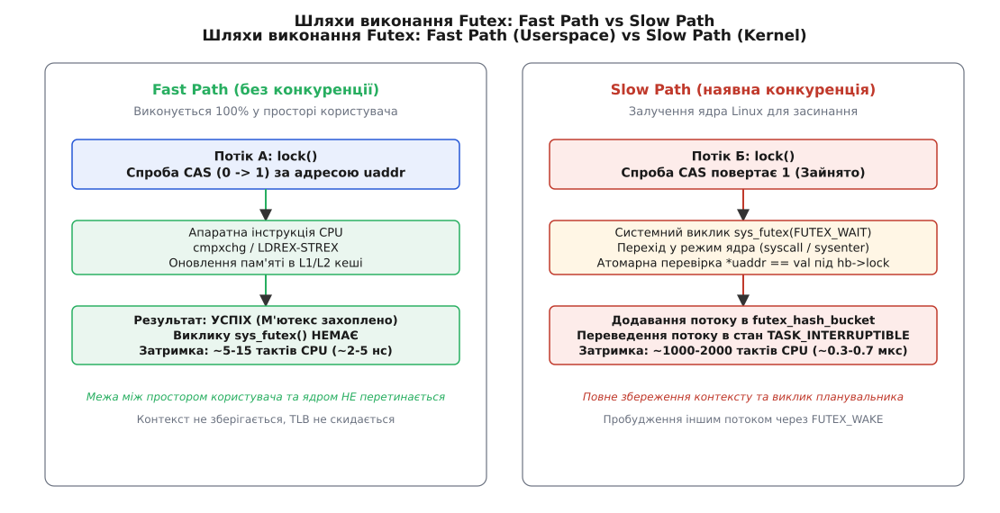
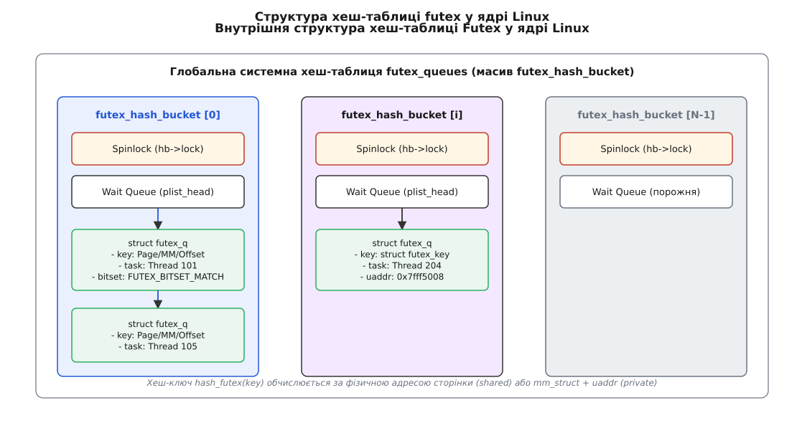
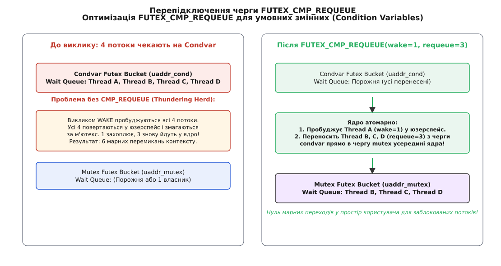

# Futex (Fast Userspace Mutex)

<preknowlist>
- [Ядро й простір користувача](root:sys-unix/kernel-and-userspace) — розділення режимів виконання, просторів адресації та ціна системного виклику.
- [Системний виклик: як програма просить ядро](root:sys-unix/syscall-mechanics) — механіка переходу в режим ядра та перемикання контексту.
- [Атомарні операції та бар'єри пам'яті в Linux](root:sf-tasks/atomic-ops) — інструкції CAS (Compare-And-Swap) та впорядкування пам'яті.
</preknowlist>

Перемикання контексту процесора та трансляція режимів виконання між простором користувача (Ring 3) і ядром Linux (Ring 0) вимагає від 1000 до 2000 тактів CPU на кожен системний виклик. Коли тисячі паралельних потоків у багатопотокових застосунках захоплюють та звільняють примітиви синхронізації мільйони разів на секунду, проведення кожної операції через системне переривання призводить до того, що помітна частка процесорного часу витрачається не на корисні обчислення, а на обробку трапів ядра та інвалідацію кешів CPU.

Фундаментальне розв'язання цієї проблеми в Linux забезпечується механізмом **Futex (Fast Userspace Mutex)** — гібридною технологією міжпроцесної та міжпотокової синхронізації. Futex виносить маніпуляцію станом блокування у простір користувача через швидкі атомарні інструкції процесора, залучаючи ядро операційної системи лише тоді, коли виникає реальна конкуренція за ресурс і потік необхідно заблокувати або розбудити.

Детальний процес історичного переходу від важких системних викликів LinuxThreads до сучасного сумісного з POSIX механізму Futex описано у вставці [Історія еволюції Futex](root:sys-unix/futex-fast-userspace-mutex/hist-futex-evolution.md).

## Ціна системного виклику та криза класичної синхронізації

У традиційних операційних системах Unix будь-яке блокування (наприклад, семафори System V IPC або файлові замки `fcntl`) є об'єктом, що повністю належить ядру. Для змінення стану семафора потік повинен виконати системний виклик, передати керування операційній системі та зачекати на перевірку прав і доступності ресурсу.

Виконання системного виклику супроводжується комплексними апаратними та програмними накладними витратами:
1. **Збереження контексту**: Процесор зберігає стан регістрів користувацького потоку у стеку ядра (`pt_regs`).
2. **Переключення стека та привілеїв**: Процесор змінює вказівник стека з приватної пам'яті процесу на стек ядра та перемикає рівень захисту кільця з Ring 3 на Ring 0.
3. **Конфлікти когерентності та скидання кешів**: Перехід у ядро змінює робочий набір адресації, що призводить до вимивання L1/L2 кешів інструкцій та промахів у кеші даних (cache misses).
4. **Залучення планувальника задач**: Ядро аналізує стан черг очікування, що може викликати повне перепланування потоку (context switch) з інвалідацією буфера асоціативної трансляції (TLB).

Аналіз реального профілю навантаження багатопотокових застосунків показує, що у 90-99% випадків при виклику блокування м'ютекс є повністю вільним. Виконання важкого системного виклику для захоплення ресурсу, за який ніхто не змагається, є неефективним марнуванням ресурсів.

## Парадигма Futex: розподіл обов'язків між процесором та ядром

Головна архітектурна ідея Futex полягає в тому, що стан синхронізаційного примітива зберігається у звичайній 32-бітній цілочисельній змінній (`uint32_t`), розташованій у спільній пам'яті простору користувача.

Логіка виконання розподіляється на два незалежних шляхи:
- **Fast Path (Швидкий шлях)**: Виконується на 100% у просторі користувача без звернення до ядра. Якщо потік намагається захопити вільний м'ютекс, він атомарно змінює значення змінної за допомогою інструкції процесора `LOCK CMPXCHG` (на x86) або `LDREX`/`STREX` (на ARM). Операція виконується за 5-15 тактів процесора (~2-5 наносекунд).
- **Slow Path (Повільний шлях)**: Застосовується лише тоді, коли атомарна операція у просторі користувача виявляє, що м'ютекс уже зайнятий іншим потоком. Тільки у цьому разі потік здійснює системний виклик `futex()`, просячи ядро заблокувати його й перевести у стан очікування `TASK_INTERRUPTIBLE`.


*Схема розподілу виконання Futex: захоплення без конкуренції відбувається миттєво в просторі користувача, а системний виклик sys_futex ініціюється лише при виникненні конфлікту.*

З погляду ядра операційної системи, Futex не є складним об'єктом із власною пам'яттю чи дескриптором. Ядро не зберігає жодного стану про futex-змінну доти, доки хоча б один потік не прийде у повільний шлях із проханням заснути за цією адресою.

## Анатомія операції FUTEX_WAIT: усунення гонки запізнілого пробудження

Основною операцією для переведення потоку в сон є `FUTEX_WAIT`. Сигнатура системного виклику приймає адресу змінної `uaddr` та очікуване значення `val`:

```c
long syscall(SYS_futex, uint32_t *uaddr, FUTEX_WAIT, uint32_t val,
             const struct timespec *timeout, uint32_t *uaddr2, uint32_t val3);
```

### Гонка запізнілого пробудження (Lost Wakeup Race)

Атомарність перевірки стану та засинання є найскладнішим питанням синхронізації. Уявімо сценарій без атомарної перевірки у ядрі:
1. Потік А у юзерспейсі бачить, що м'ютекс зайнятий (`state == 1`).
2. Потік А вирішує заснути й готується викликати системний виклик `futex()`.
3. У цей самий момент Потік Б у юзерспейсі звільняє м'ютекс (`state = 0`) і викликає `FUTEX_WAKE`.
4. Ядро виконує `FUTEX_WAKE`, але черга очікування ще порожня, бо Потік А ще не пройшов трап ядра. Сигнал пробудження втрачається.
5. Потік А врешті-решт заходить у ядро й засинає назавжди, хоча м'ютекс уже вільний.

### Атомарна перевірка значення у ядрі

Для запобігання втраченому пробудженню системний виклик `FUTEX_WAIT` виконує перевірку всередині ядра за такою суворою послідовністю:
1. Ядро обчислює хеш-ключ адреси `uaddr` і знаходить відповідний сектор глобальної хеш-таблиці `futex_hash_bucket`.
2. Ядро захоплює спінлок сектора `hb->lock`.
3. Перебуваючи під захистом `hb->lock`, ядро зчитує поточне значення з пам'яті користувача за адресою `uaddr` та порівнює його з параметром `val`, переданим із юзерспейсу.
4. Якщо значення не збігається (`*uaddr != val`), це означає, що інший потік змінив стан м'ютекса (наприклад, звільнив його) безпосередньо перед системним викликом. Ядро миттєво відпускає `hb->lock` і повертає помилку `EWOULDBLOCK` (`EAGAIN`). Потік повертається у простір користувача й повторює спробу захоплення.
5. Якщо значення збігається (`*uaddr == val`), ядро створює структуру `struct futex_q`, додає потік у список очікування `hb->chain`, переводить його у стан `TASK_INTERRUPTIBLE` — і лише тоді відпускає `hb->lock` та викликає планувальник (`schedule()`). Порядок саме такий: якби стан виставлявся після відпускання спінлока, пробудження між цими двома діями знову губилося б.


*Глобальна хеш-таблиця futex_queues у ядрі Linux: кожен бакет містить власну спін-блокування hb->lock та пріоритетну чергу заблокованих потоків futex_q.*

Повний перелік кодових операцій, аргументів, прапорців та кодів помилок системного виклику наведено у довіднику [Системний інтерфейс Futex та futex2](root:sys-unix/futex-fast-userspace-mutex/api-futex-syscall.md).

## Внутрішня хеш-таблиця та інфраструктура ядра

Всередині ядра Linux підсистема Futex базується на статично або динамічно виділеному масиві структур `futex_hash_bucket`. Розмір цього масиву обирається при завантаженні системи за кількістю доступних ядер CPU — приблизно 256 бакетів на ядро, округлено вгору до степеня двійки (звідси типові 256 бакетів на одноядерній машині й 16384 на 64 ядрах).

### Структури даних ядра

Кожен елемент масиву `futex_hash_bucket` містить два ключових поля:
- `spinlock_t lock`: Апаратне спін-блокування ядра для захисту даного хеш-бакета.
- `struct plist_head chain`: Пріоритетний зв'язаний список заблокованих потоків (`struct futex_q`), впорядкований за пріоритетом завдань.

Кожен заблокований потік репрезентується структурою `struct futex_q`:
- `union futex_key key`: Унікальний ключ, що описує futex-змінну (віртуальна адреса + mm_struct для приватних futex, або індекс фізичної сторінки + offset для спільних futex).
- `struct task_struct *task`: Вказівник на потік ядра, що заснув.
- `uint32_t bitset`: Бітова маска матчингу для операцій `FUTEX_WAIT_BITSET`.

Коли потік викликає `FUTEX_WAIT`, ключ обчислюється функцією `get_futex_key()`. За цим ключем через хеш-функцію знаходиться потрібний бакет. Захоплення вузького спінлока `hb->lock` гарантує, що паралельні виклики `FUTEX_WAIT` та `FUTEX_WAKE` для різних futex-змінних, що потрапили в інші бакети, виконуються повністю паралельно без взаємних блокувань.

## Анатомія операції FUTEX_WAKE

Коли власник м'ютекса звільняє ресурс і бачить, що є очікуючі потоки, він виконує операцію `FUTEX_WAKE`:

```c
long syscall(SYS_futex, uint32_t *uaddr, FUTEX_WAKE, int nr_wake,
             NULL, NULL, 0);
```

Послідовність дій ядра при виконанні пробудження:
1. Ядро обчислює хеш-ключ адреси `uaddr` й захоплює спінлок бакета `hb->lock`.
2. Ядро проходить по зв'язаному списку очікуючих елементів `struct futex_q` у даному бакеті.
3. Порівнюються ключі futex (збіг адреси та простору пам'яті).
4. Перші `nr_wake` потоків (зазвичай `nr_wake = 1` для м'ютексів або `nr_wake = INT_MAX` для умовних змінних) вилучаються з черги очікування.
5. Ядро змінює стан цих потоків з `TASK_INTERRUPTIBLE` на `TASK_RUNNING` і додає їх до черги виконання планувальника задач (`wake_up_process`).
6. Спінлок `hb->lock` звільняється.

## Усунення «шторму пробуджень»: FUTEX_CMP_REQUEUE для умовних змінних

При роботі з умовними змінними (Condition Variables, `pthread_cond_t`) виникає класична проблема продуктивності: коли один потік викликає `pthread_cond_broadcast()`, декілька заблокованих потоків чекають на підтвердження умови, після чого кожен із них повинен знову захопити м'ютекс умовної змінної.

Якщо використати простий `FUTEX_WAKE` для всіх потоків, виникає шторм пробуджень (Thundering Herd):
- Ядро будить усі 50 заблокованих потоків.
- Усі 50 потоків переходять у простір користувача й намагаються виконати `lock()` для одного м'ютекса.
- Рівно 1 потік захоплює м'ютекс, а 49 потоків зазнають невдачі, роблять системний виклик `FUTEX_WAIT` і знову засинають у ядрі.
- Система виконує 98 марних перемикань контексту.

Для усунення цієї проблеми в ядрі Linux реалізовано операцію **`FUTEX_CMP_REQUEUE`**:

```c
long syscall(SYS_futex, uint32_t *uaddr_cond, FUTEX_CMP_REQUEUE, 
             int nr_wake, int nr_requeue, uint32_t *uaddr_mutex, uint32_t val3);
```


*Операція FUTEX_CMP_REQUEUE пробуджує один потік, а інші заблоковані потоки переносить із черги умовної змінної безпосередньо у чергу м'ютекса всередині ядра.*

### Механізм перепідключення (Requeuing)

Під час виклику `FUTEX_CMP_REQUEUE` ядро виконує такі атомарні кроки під двома спінлоками бакетів:
1. Перевіряє, чи значення за адресою умовної змінної `*uaddr_cond == val3`. Якщо ні, повертає `EWOULDBLOCK`.
2. Розбуджує `nr_wake` потоків (зазвичай `1` потік), переводячи його в `TASK_RUNNING`.
3. Не повертаючи решту `nr_requeue` потоків у простір користувача, ядро вилучає їх із черги `uaddr_cond` і **перепідключає** (requeue) їхні структури `futex_q` безпосередньо у чергу очікування м'ютекса `uaddr_mutex` усередині ядра.
4. Потоки залишаються сплячими у ядрі. Коли власник м'ютекса викличе `FUTEX_WAKE` для м'ютекса, вони будуть послідовно пробуджуватися по одному без марних стрибків між простором користувача та ядром.

Приклад повноцінного використання тристанового м'ютекса та умовної змінної на мовах C та C++ наведено у вставці [Практична реалізація м'ютекса й condvar на futex](root:sys-unix/futex-fast-userspace-mutex/proj-futex-mutex.md).

## Бар'єри пам'яті та когерентність кешів

Функціонування швидкого шляху (Fast Path) повністю покладається на правильне впорядкування інструкцій процесора та збереження когерентності кешів на системній шині (протоколи MESI/MOESI):

1. **Acquire-семантика при захопленні**: Операція захоплення м'ютекса у юзерспейсі зобов'язана виконуватися з семантикою `acquire` (`atomic_compare_exchange` з `memory_order_acquire`). Це запобігає перенесенню процесором зчитувань із критичної секції вище за момент захоплення прапорця блокування.
2. **Release-семантика при звільненні**: Операція звільнення у юзерспейсі виконується з семантикою `release` (`atomic_fetch_sub` з `memory_order_release`). Це гарантує, що всі записи у пам'ять, зроблені у критичній секції, вивантажуються з буферів запису процесора (store buffers) і стають видимими іншим ядрам до скидання прапорця м'ютекса.

## Адаптивні спинлоки у бібліотеці NPTL

Бібліотека NPTL підтримує тип м'ютекса `PTHREAD_MUTEX_ADAPTIVE_NP`. Замість негайного переходу у повільний шлях із системним викликом `futex()`, такий м'ютекс спочатку виконує короткий цикл спінінгу у просторі користувача (у glibc лічильник адаптивного спінінгу — порядку сотні ітерацій з інструкцією `pause`). Якщо за цей час м'ютекс звільняється, потік захоплює його без системного виклику. Якщо м'ютекс залишається зайнятим, потік переходить до виклику `FUTEX_WAIT`. Це компроміс між витратами тактів CPU та ціною системного виклику.

## Захист від аварій та пріоритети: Robust Futexes та Priority Inheritance

Стандартні примітиви простору користувача мають два критичних крайових випадки: аварійне завершення потоку-власника та інверсію пріоритетів.

### Robust Futexes (Захист від «сирітських» м'ютексів)

Якщо потік захопив м'ютекс у просторі користувача й несподівано завершив роботу (через помилку сегментації `SIGSEGV`, виклик `exit()` або аварійне завершення), м'ютекс залишається у стані «зайнято». Решта потоків, що чекають на нього у ядрі, будуть заблоковані назавжди.

Для вирішення цієї проблеми реалізовано механізм **Robust Futexes**:
- Під час ініціалізації бібліотека потоків створює однозв'язний список у пам'яті користувача й повідомляє його адресу ядру через системний виклик `sys_set_robust_list()`.
- Кожного разу, коли потік захоплює robust-м'ютекс, він додає його адресу до цього списку у юзерспейсі.
- При завершенні потоку функція ядра `do_exit()` проходить по зареєстрованому robust-списку потоку.
- Для кожного futex у списку ядро встановлює спеціальний біт прапорця `FUTEX_OWNER_DIED` (`0x40000000`) у значення змінної та виконує `FUTEX_WAKE`.
- Наступний потік, який розбудився або намагався захопити м'ютекс, бачить біт `FUTEX_OWNER_DIED`, отримує від `pthread_mutex_lock` код помилки `EOWNERDEAD` і може відновити цілісність даних або безпечно відновити ресурс за допомогою функції `pthread_mutex_consistent()`.

### Priority Inheritance (PI Futex)

У системах реального часу виникає проблема інверсії пріоритетів (Priority Inversion):
- Низькопріоритетний потік L захоплює м'ютекс.
- Високопріоритетний потік H намагається захопити м'ютекс і засинає у `FUTEX_WAIT`.
- Середньопріоритетний потік M, якому не потрібен м'ютекс, витісняє потік L із процесора, оскільки його пріоритет вищий за L.
- У результаті високопріоритетний потік H чекає на виконання середньопріоритетного потоку M, що порушує гарантії реального часу.

Для вирішення цього ядро Linux надає PI-операції: `FUTEX_LOCK_PI` та `FUTEX_UNLOCK_PI`. Коли потік H засинає на PI-futex, ядро створює зв'язаний об'єкт `struct rt_mutex` усередині ядра й **тимчасово підвищує пріоритет** низькопріоритетного потоку L до пріоритету потоку H. Це гарантує, що потік L не буде витіснений потоком M і якнайшвидше завершить критичну секцію й звільнить м'ютекс.

## Приватні futex'и та адресація в ядрі

Початково будь-який futex розглядався ядром як потенційно спільний об'єкт між різними процесами (Shared Futex), розташований у розділюваній пам'яті (`mmap`, `shmget`).

Для ідентифікації такого futex ядро повинно було перетворити віртуальну адресу `uaddr` у фізичну адресу сторінки RAM:
- Ядро шукало сторінку пам'яті у таблицях сторінок процесу.
- Створювалася унікальна структура `union futex_key`, де ключем слугував вказівник на фізичну сторінку `struct page*` та зміщення всередині сторінки (або i-node файлу для mmap-файлів).

Оскільки 99% м'ютексів використовуються виключно між потоками одного й того самого процесу, використання фізичної адресації створювало зайві витрати на пошук у таблицях сторінок.

Ерік Дюмазе (Eric Dumazet) додав у ядро 2.6.22 прапорець **`FUTEX_PRIVATE_FLAG`**:
- При використанні `FUTEX_WAIT_PRIVATE` або `FUTEX_WAKE_PRIVATE` ядро знає, що futex належить лише поточному процесу.
- Ключем `union futex_key` стає безпосередньо комбінація віртуальної адреси `uaddr` та вказівника на структуру пам'яті процесу `mm_struct`.
- Це вилучило необхідність звернення до фізичних сторінок пам'яті та прискорило роботу повільного шляху ядра на 20-30%.

> 🔧 **Навіщо це.**
> Зміна прапорця на `FUTEX_PRIVATE_FLAG` є де-факто стандартом для всіх внутрішньопроцесних м'ютексів у NPTL (`pthread_mutex`), C++11 `std::mutex` та мовах високого рівня (Go, Rust, Java). Якщо ви розробляєте власний примітив синхронізації між потоками одного процесу, використання `FUTEX_WAIT_PRIVATE` замість класичного `FUTEX_WAIT` зменшує затримки засинання та розвантажує підсистему віртуальної пам'яті ядра.

## Спостережуваність та діагностика Futex у Linux

У високонавантажених системах конкуренція за Futex (Futex Contention) є однією з головних причин високої затримки (latency spikes) та низької утилізації CPU.

Для простеження та аналізу поведінки futex у ядрі Linux надаються такі інструменти:

1. **Системні трасувальні точки (Tracepoints)**:
   Ядро містить вбудовані трасувальні точки `syscalls:sys_enter_futex` та `syscalls:sys_exit_futex`. Збирати статистику можна за допомогою інструменту `perf`:
   ```bash
   perf stat -e syscalls:sys_enter_futex -a -- sleep 5
   ```
2. **Аналіз за допомогою bpftrace (eBPF)**:
   Скрипт `bpftrace` дозволяє підрахувати кількість викликів `futex()` у розрізі процесів та операцій:
   ```bash
   bpftrace -e 'tracepoint:syscalls:sys_enter_futex { @[comm, pid] = count(); }'
   ```
3. **Профілювання тривалості очікування**:
   За допомогою `offcputime` із пакета BCC можна виміряти точний час, який потоки проводять у стані `TASK_INTERRUPTIBLE` усередині системного виклику `futex_wait`, і побудувати Flame Graph затримок синхронізації.

## Еволюція API: futex2 та системний виклик sys_futex_waitv

Класичний системний виклик `sys_futex` мав фундаментальне обмеження: потік міг чекати на зміну стану лише **одної** futex-змінної за один виклик.

У 2021 році для потреб емуляції системних викликів Windows (зокрема `WaitForMultipleObjects` у шарах сумісності Valve Proton та Wine для запуску ігор на Linux) було розроблено нове сімейство викликів **futex2**. Першим із них у ядро Linux 5.16 увійшов системний виклик `sys_futex_waitv`:

```c
long syscall(SYS_futex_waitv, struct futex_waitv *waiters, unsigned int nr_futexes,
             unsigned int flags, struct timespec *timeout, clockid_t clockid);
```

### Переваги `sys_futex_waitv`
1. **Векторне очікування**: Потік передає масив структур `struct futex_waitv` і засинає доти, доки **хоча б один** із futex у масиві не змінить свій стан.
2. **Явне вказування розмірності та прапорців**: Кожен елемент масиву містить власні прапорці (наприклад, `FUTEX_32` та `FUTEX_PRIVATE_FLAG`), що готує ядро до майбутньої підтримки 64-бітних та 16-бітних futex-змінних.
3. **Пряме повернення індексу**: У разі успішного пробудження системний виклик повертає точний індекс елемента масиву, який спричинив пробудження, позбавляючи простір користувача від необхідності опитувати всі м'ютекси після виходу зі стану сну.
