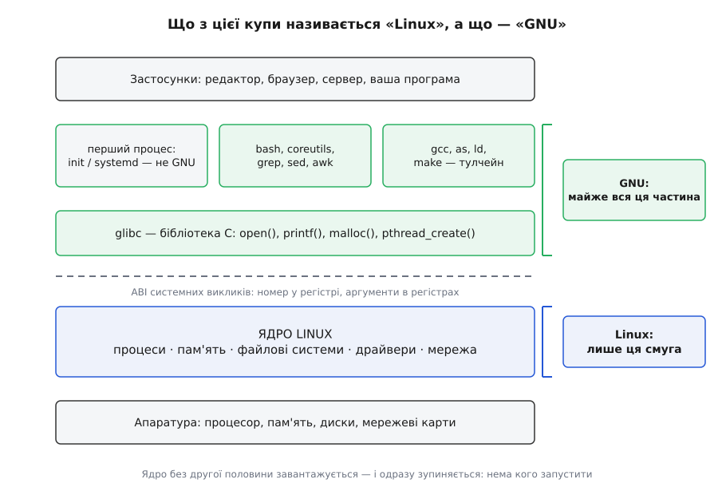
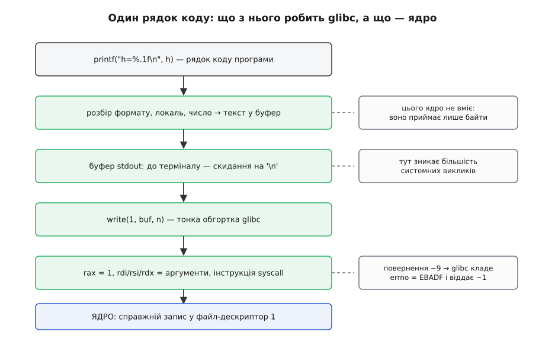
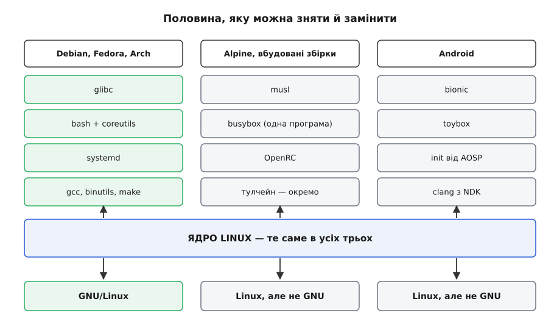

# Інструментарій GNU і чому «GNU/Linux»

<preknowlist>
- [Ядро й простір користувача](topic:sys-unix/kernel-and-userspace) — межа привілеїв: ядро дістає апаратуру, звичайна програма — ні, і перетнути межу можна єдиним способом.
- [Системний виклик](topic:sys-unix/syscall-mechanics) — той єдиний спосіб: номер і аргументи лягають у регістри, спеціальна інструкція передає керування ядру.
- [Родовід Unix](topic:sys-unix/unix-lineage) — звідки взялася сама форма системи: AT&T, Берклі, обмеження на сирці й ліцензії.
- [Тулчейн](topic:sys-bsystem/toolchain) — ланцюг «компілятор → асемблер → лінкер», що перетворює текст програми на здатний виконуватися файл.
</preknowlist>

## Ядро завантажилось і зупинилося

Візьмімо диск, на якому є ядро Linux і порожня коренева файлова система — жодного виконуваного файла. Машина вмикається, ядро розпаковується, ініціалізує процесор і пам'ять, піднімає драйвери, знаходить диск, монтує корінь. Усе працює. А тоді на екрані з'являється:

```
Kernel panic - not syncing: No working init found.
Try passing init= option to kernel.
```

Це не збій. Ядро дійшло до кінця своєї роботи й виявило, що робити далі йому нічого.

Причина — у самій будові системи. Ядро не має власного корисного заняття. Усе, що воно робить, воно робить **у відповідь**: процес просить пам'ять — ядро видає сторінки; процес просить прочитати файл — ядро йде на диск; пристрій смикає переривання — ядро будить той процес, що на нього чекав. Заберіть усі процеси — і залишиться справний двигун, до вала якого нічого не приєднано.

Звідси випливає річ, яку легко проґавити: **ядро не може бути власною першою програмою**. Код по той бік межі привілеїв — то інший світ, і ядро вміє лише **запустити** його, а не бути ним. Останнє, що робить ядро при завантаженні, — виконує `exec` над одним-єдиним файлом і віддає йому керування. Немає файла — немає системи.

Отже, робоча система — це щонайменше дві половини. Слово «Linux» називає лише одну з них, і то не ту, з якою людина має справу щодня. Друга половина має власне походження, власну назву й власні правила сумісності — і саме вона вирішує більшість того, що зазвичай списують на «Linux».

## Що мусить бути в другій половині

Склад другої половини не довільний: кожна її частина береться з потреби, яку створила попередня. Це видно, якщо почати з голого ядра й додавати рівно те, без чого зроблене доти не має сенсу.

**Перше — один виконуваний файл.** Ядро запускає його як процес з номером 1, і той процес живе до вимкнення. Це вже система: вона завантажується й щось робить. Тільки робить вона рівно одне й назавжди — [перший процес](topic:sys-unix/init-and-pid1) не змінюється й нічого не питає.

**Друге — переклад із мови ядра на мову програм.** Ту єдину програму треба чимось написати, і тут ховається перша неочевидна ціна. Інтерфейс ядра — не набір функцій. Це домовленість про регістри: номер виклику в одному регістрі, аргументи в наступних, потім спеціальна інструкція процесора, а після повернення — або результат, або мале від'ємне число, що означає помилку. Жоден компілятор не зробить цього сам із рядка `open("/etc/hostname", O_RDONLY)`.

Хтось мусить один раз написати — окремо для кожної архітектури — обгортку до кожного з кількох сотень системних викликів. І це лише початок. Мова C обіцяє програмі речі, яких у ядрі просто нема: `malloc` (ядро видає тільки цілі сторінки пам'яті), `printf` (ядро приймає лише готові байти), `strlen`, `qsort`, сортування за абеткою конкретної мови, розбір дати, пошук імені в DNS, потоки виконання. Усе це — [бібліотека C](topic:sys-unix/libc-as-gateway), і в системі з ядром Linux її роль майже завжди виконує **glibc** — GNU C Library.

**Третє — спосіб сказати, що запустити зараз.** Одна програма назавжди — це прилад, а не система. Людині потрібен посередник, який приймає рядок тексту, розбирає його на ім'я програми й аргументи, [роздвоює себе на два процеси](topic:sys-unix/fork-semantics), у копії [заміщає власний код кодом потрібної програми](topic:sys-unix/exec-semantics) — і чекає, поки та завершиться. Ця програма зветься [оболонка](topic:sys-unix/shell-role) (англ. shell — оболонка, шкаралупа), і в GNU це **bash**.

**Четверте — те, що оболонка запускатиме.** Оболонка без програм безсила: сама вона не вміє ані показати вміст теки, ані скопіювати файл, ані знайти рядок. Потрібен набір дрібних програм: `ls`, `cp`, `mv`, `cat`, `sort`, `wc`, `grep`, `sed`, `awk`, `find`, `tar`, `diff`. Дрібних і численних, а не однієї великої, — бо саме на цьому стоїть [філософія Unix](topic:sys-unix/unix-philosophy): кожна робить одне, а складають їх на місці, під конкретну задачу. У GNU це **coreutils** і ще з десяток пакетів поруч.

**П'яте — і найглибше — здатність робити нові програми.** Усе перелічене вище — скінченний набір двійкових файлів, які хтось зібрав деінде. Система, що вміє запускати лише привезене в коробці, — прилад. Щоб бути системою, вона мусить уміти виготовляти програми сама: асемблер, компілятор, лінкер, архіватор бібліотек, керівник збірки. У GNU це **binutils**, **GCC** і **make**.

Останній пункт має гостру форму, і саме в ній суть. Компілятор — теж програма, і його теж можна зібрати цим самим компілятором. Система з тулчейном усередині здатна **відтворити себе цілком**, разом із власним тулчейном; це властивість, а не побічний ефект — і вона має ціну та пастки, розібрані окремо у [самопіднятті компілятора](topic:sf-lang/compiler-bootstrapping).

> 🔧 **Навіщо це.** Різниця між «є тулчейн» і «нема тулчейна» щодня відчутна на вбудованих платах. Роутер із busybox має оболонку й сотню утиліт, але не має компілятора — і будь-яка зміна вимагає другої машини, крос-компіляції та копіювання готового файла. Машина з повним інструментарієм GNU полагодить себе сама: зібрати виправлену версію демона можна прямо на ній. Тому й дистрибутиви збирають на тому самому дистрибутиві, а не десь збоку.



*«Linux» — назва однієї смуги в цій стопці; майже все, що лежить над межею системних викликів і під застосунками, у типовому дистрибутиві прийшло з GNU — крім місця першого процесу, яке в масових дистрибутивах зайняли не GNU-програми.*

## Звідки взялася друга половина

Порядок, у якому цю другу половину написали, пояснює багато чого — зокрема й те, чому ядра в ній не було.

27 вересня 1983 року в групі новин `net.unix-wizards` з'явився допис із темою «New UNIX implementation». Річард Столмен оголосив, що збирається написати повну сумісну з Unix систему на ім'я GNU — рекурсивний жарт, розшифровка «GNU's Not Unix» — і роздавати її всім охочим. У початковому плані було перелічено ядро, редактор, оболонку, компілятор C, лінкер, асемблер і «ще кілька речей».

Робота пішла з кінця цього списку, від ядра якнайдалі: спершу редактор (GNU Emacs, 1985), потім компілятор (GCC, 1987), потім оболонка (bash, 1989, написав Браян Фокс). Бібліотеку C розробляли паралельно протягом другої половини 1980-х. До 1992-го всі великі утиліти системи були готові.

Такий порядок не випадковий, і причина в ньому подвійна. Інструмент — це те, чим роблять решту: маючи власний компілятор, ви пишете власні утиліти; маючи чужий, ви від нього залежите. Але важливіше інше: **кожен готовий шматок GNU одразу мав де працювати**. GCC ставили на комерційні Unix-и й на них компілювали; bash запускали як оболонку поверх чужого ядра. Тобто проєкт отримував користувачів, звіти про помилки й дописувачів **до того**, як його система стала цілою. Ядро такої розкоші не має: його нема куди поставити частково.

Ядром мав стати Hurd. 1987 року Фонд почав перемовини з Карнеґі-Меллоном про мікроядро Mach; далі три роки пішли на невизначеність із ліцензією на код Mach, реальна робота почалася 1990-го, а 1991-го Фонд вільного програмного забезпечення оголосив Hurd офіційним ядром GNU. Придатної для повсякденної роботи версії немає й донині, понад тридцять п'ять років потому — почасти саме через [мікроядерну будову](topic:sys-unix/monolithic-with-modules), яка ту роботу зробила значно важчою за монолітну.

Отже, 1991 року існувала операційна система, у якій було все, крім рівно однієї деталі.

Тим часом у Гельсінкі студент Лінус Торвальдс — фін зі шведськомовної меншини Фінляндії — писав для себе замінник навчальної системи Minix. 25 серпня 1991-го він оголосив про це в групі `comp.os.minix`, у вересні виклав версію 0.01. Писав він її на Minix, компілював GCC і користувався bash — тобто ядро Linux із першого дня будували інструментами GNU. Перша ліцензія була власна й забороняла комерційне поширення; на початку 1992-го, з випуском 0.12, Торвальдс перейшов на GPL версії 2, і серед причин він згодом називав саме вдячність компіляторові GCC, від якого Linux залежав.

Дві половини склалися. Але це не було злиттям двох проєктів: одному проєктові бракувало деталі, і деталь приніс сторонній аматор, який про GNU в той момент майже не думав. [Як саме це сталося і чим цей збіг обернувся для обох сторін](topic:sys-unix/gnu-userland/hist-two-halves.md) — окрема історія з датами, суперечками й кількома розвилками, на яких усе могло піти інакше.

Дати, авторство й послідовність подій тут — усталений факт, підтверджений архівами груп новин і випусками пакетів. Спірним є **тлумачення**: чия заслуга більша й чиє ім'я має нести результат.

## Шов: чому все тримається на glibc

Більшість шматків GNU замінні поодинці й безболісно. Не подобається bash — поставте `mksh` чи `zsh`; замість `grep` є `ripgrep`; замість GCC — clang. Один шматок так не виймається, і це glibc.

Причина в тому, що glibc — не просто ще одна бібліотека, а **шов між половинами**. Кожна динамічно зв'язана програма в типовому дистрибутиві звертається до ядра не сама, а через неї, і тому носить залежність від неї у собі. І шов цей товщий, ніж здається: між рядком коду й системним викликом лежить кілька перетворень.



*Один рядок коду й п'ять перетворень над ним. До ядра доходить лише останнє — усі попередні зробила бібліотека.*

Найкоротший спосіб побачити цей шов — написати те саме двічі: раз через бібліотеку, раз майже напряму.

```c
#include <stdio.h>
#include <unistd.h>

int main(void) {
    printf("h=%.1f\n", 42.3);   /* форматування + буфер + write усередині glibc */
    write(1, "h=42.3\n", 7);    /* тонка обгортка: одразу системний виклик */
    return 0;
}
```

Перший рядок робить три речі, яких ядро не вміє й не хоче вміти. Він розбирає рядок формату, перетворює число з рухомою комою на текст за правилами поточної локалі й кладе результат у буфер. Другий рядок не робить нічого з цього: байти вже готові, і виклик іде до ядра відразу.

Тепер найцікавіше — буфер. Запустіть програму під `strace`, який [показує кожен системний виклик у момент його здійснення](topic:sys-unix/syscall-tracing), — у терміналі ви побачите два записи:

```
write(1, "h=42.3\n", 7)                 = 7
write(1, "h=42.3\n", 7)                 = 7
```

Перенаправте вивід у файл — і перший запис зникне з того місця, де він щойно був, а вигулькне аж перед завершенням програми. Це не магія: glibc питає в ядра, чи є на [дескрипторі](topic:sys-unix/file-descriptor) 1 термінал, і вибирає режим буферизації. Для термінала — скидання на кожному переході рядка (щоб людина бачила вивід одразу), для файла — накопичення до повного буфера, розмір якого glibc питає в самої файлової системи (зазвичай 4096 байтів), щоб не смикати ядро дарма. Саме тут зникає більшість системних викликів програми, яка інтенсивно пише.

Так само бібліотека робить із помилками. Ядро не має поняття `errno`: воно повертає в регістрі мале від'ємне число, скажімо −9 для невідомого дескриптора. Домовленість «результат у діапазоні від −4095 до −1 — це помилка» живе в обгортці: glibc бачить −9, кладе `EBADF` у змінну `errno` поточного потоку й повертає програмі −1. Знайома кожному C-програмісту пара «−1 і errno» — цілком бібліотечний винахід, у ядрі її нема.

Шов має ще один бік, суто практичний. Динамічний лінкер вимагає не просто наявності glibc, а наявності потрібних **версій символів** — механізм [версіювання в спільних бібліотеках](topic:sys-unix/soname-versioning) дозволяє одному файлу бібліотеки нести кілька поколінь однієї функції. Тому програма, зібрана на свіжому дистрибутиві, на старшому вітається так:

```
./app: /lib/x86_64-linux-gnu/libc.so.6: version `GLIBC_2.34' not found (required by ./app)
```

Ядро тут ні до чого: воно ту програму запустило б без жодних заперечень.

## Наслідок перший: GNU — це діалект, а не лише набір програм

[POSIX](topic:sys-unix/posix-standard) фіксує мінімум: які утиліти мусять бути, які в них обов'язкові ключі й що вони роблять. Утиліти GNU цей мінімум реалізують — і додають зверху свого, десятиліттями й щедро. Довгі ключі виду `--help` — узагалі звичка GNU, у первісному Unix їх не було.

Додане настільки вросло в щоденну практику, що межу перестали помічати. `sed -i` для правки файла на місці, `grep -P` для перлових регулярних виразів, `date -d "next friday"`, `readlink -f`, `cp --parents`, `sort -h` для розмірів на кшталт `4.7G`, `ls --color` — жодного з цих ключів у POSIX нема. Люди пишуть скрипти, спираючись на них, і чесно вважають, що написали «під Linux».

Ось як це виявляється:

```sh
# на Debian замінить слово у файлі
sed -i 's/DEBUG/INFO/' app.conf
```

На macOS, де живе sed із роду BSD, той самий рядок дасть:

```
sed: 1: "app.conf": invalid command code a
```

Механізм видно з повідомлення. У BSD-версії ключ `-i` вимагає окремого аргументу — суфікса для резервної копії. Тому `'s/DEBUG/INFO/'` було взято за суфікс, а `app.conf` — за текст програми для sed, у якому перша літера `a` означає команду «додати рядок». Скрипт не зламався випадково: він звернувся до чужого діалекту тими словами, яких у ньому нема.

Переносний варіант обходиться без спірного ключа:

```sh
sed 's/DEBUG/INFO/' app.conf > app.conf.new && mv app.conf.new app.conf
```

Те саме працює у зворотний бік: `date -d` на BSD нема (там `date -v`), `readlink -f` у старих macOS відсутній. І третій бік — busybox, який реалізує ті самі утиліти в урізаному вигляді: `grep -P` там не з'явиться за жодної конфігурації, `sort -h` — так само. [Що саме з повсякденного набору є розширенням GNU, а що — стандартом](topic:sys-unix/gnu-userland/api-gnu-vs-posix.md) варто мати перед очима, коли скрипт має пережити переїзд.

> 🔧 **Навіщо це.** Найчастіша форма цієї пастки сьогодні — збірка в контейнері. Розробник пише скрипти на Ubuntu, а CI ганяє їх на Alpine заради розміру образу — і половина конвеєра падає на ключах, яких у busybox нема. Питання «під що це написано» має точнішу відповідь, ніж «під Linux»: під GNU-діалект. Ядро в обох випадках те саме.

## Наслідок другий: ліцензія — не оздоба, а конструктивний вибір

Друга половина прийшла не лише з кодом, а й з умовами. Інструментарій GNU поширюють під GPL — [копілефтною ліцензією](topic:sys-notary/open-source-licenses), яка вимагає, щоб похідні роботи лишалися під тими самими умовами. Виняток зроблено свідомо для бібліотеки C: вона під LGPL, послабленою версією, саме щоб закриті програми могли з нею зв'язуватися. Без цього винятку закрита програма не могла б скористатися glibc узагалі — а отже, і нічим із того, що дає в типовому дистрибутиві простір користувача.

Ядро при цьому тримається GPL версії 2 й ніколи не переходило на третю. А інструментарій GNU 2007 року перейшов — і розрив між двома половинами вперше став видимим не програмістам, а юристам.

Наслідки не забарилися. Apple, якій умови третьої версії не підходили, залишила в macOS bash гілки 3.2 — останньої під GPLv2 (сама версія 3.2 вийшла 2006 року, а її останній латаний випуск, 3.2.57, — аж 2014-го) — і тримала цю гілку замороженою понад десятиліття, а в macOS Catalina 2019 року зробила типовою оболонкою zsh під ліцензією MIT. Google з самого початку писала для Android власну бібліотеку C — bionic, зібрану з коду FreeBSD, NetBSD і OpenBSD під дозвільною ліцензією, — а 2015 року, починаючи з Android 6, почала замінювати власний набір утиліт toolbox на toybox під 0BSD, написаний саме як заміна busybox для тих, кому GPLv2 не підходить.

Це найпряміший доказ у суперечці про назву. Друга половина не є технічною неминучістю: це вибір з умовами, і той, кого умови не влаштовують, її **міняє**.

## Наслідок третій: половину можна зняти

Що й роблять — причому не як екзотику, а в системах, які працюють мільярдами примірників.



*Ліворуч — GNU/Linux у класичному вигляді. Праворуч — дві системи з тим самим ядром і жодним рядком GNU у своєму просторі користувача.*

Alpine Linux бере musl замість glibc, busybox замість coreutils і bash, OpenRC замість systemd — розпакований базовий образ важить близько 8 МБ проти майже 80 МБ в Ubuntu. Android бере bionic, toybox, власний init від AOSP і середовище виконання ART. Домашні роутери, камери й телевізори роками живуть на одному ядрі й одному файлі busybox, який через символьні посилання вдає із себе сотні окремих утиліт.

Усі ці системи — Linux у точному значенні слова: те саме ядро, ті самі системні виклики, ті самі драйвери. Жодна з них не є GNU/Linux. Отже, дві назви позначають **різні множини** — і різниця між ними не риторична, а перевіряється на першому-ліпшому роутері однією командою: `find . -printf '%p\n'` там відповість `find: unrecognized: -printf`, бо цього ключа busybox не має за жодної конфігурації.

Побачити межу найпростіше руками: [зібрати найменшу систему, яка справді завантажується](topic:sys-unix/gnu-userland/proj-minimal-userland.md) — ядро, один статично зв'язаний файл і нічого більше — і потім по одному додавати те, чого бракує. Після цього питання «що таке [дистрибутив](topic:sys-unix/kernel-vs-distribution)» перестає бути абстрактним.

## То як усе-таки називати

Суперечка про назву стоїть саме на тому, що описано вище, і обидві її сторони мають вагомі підстави.

Аргумент Фонду вільного програмного забезпечення: GNU ставив за мету не набір утиліт, а **цілу систему**, працював над нею вісім років, довів до стану «бракує однієї деталі» — і саме цю деталь приніс Linux. Називати результат за деталлю, а не за системою, — все одно що назвати автомобіль за двигуном. Тим паче що ім'я тягне за собою й ідею: GNU починався як політичний проєкт про свободу користувача, і зникнення назви стирає причину, з якої все це взагалі писали.

Заперечення теж вагомі. Сучасний настільний дистрибутив — це далеко не «ядро плюс GNU»: там Wayland або Xorg, Mesa, systemd, Firefox, Python, і за обсягом коду частка GNU в ньому давно менша за половину. Місце першого процесу в масових дистрибутивах GNU так і не зайняв: власний GNU Shepherd (до 2016 року — dmd) лишився в межах Guix, а типовим став systemd, що до GNU стосунку не має. А в живій мові «Linux» перемогло тридцять років тому, і мову назад не повернути.

Статус цих тверджень варто назвати прямо. **Хто що написав і коли — усталений факт**, підтверджений архівами: тут ніхто нікого не привласнює й не вигадує. Спір іде про **атрибуцію й рамку** — чиє ім'я має нести ціле, — і це питання оцінки, а не даних. Обидві сторони спираються на той самий, добре задокументований запис подій.

Інженерний вихід із суперечки простий: називайте той шар, про який говорите. «Ядро Linux» — коли йдеться про планувальник, драйвери чи системні виклики. «Утиліти GNU» або прямо «glibc» — коли йдеться про поведінку простору користувача. «Дистрибутив» — коли про зібране ціле. Назва, яка розрізняє половини, економить години: коли у звіті написано «не працює на Linux», перше корисне питання — **у якій із двох половин**.

## Дві половини — дві протилежні обіцянки

Поділ на дві половини має наслідок, дорожчий за будь-яку суперечку про назву: половини по-різному ставляться до сумісності, причому в протилежні боки.

Ядро дало обіцянку не ламати простір користувача. Номери й семантику системних викликів заморожено назавжди: виклик, який працював у 1995-му, працює й сьогодні, і статично зв'язана програма тих часів запуститься на свіжому ядрі без жодних умовностей. Нових викликів додають, старих не чіпають — це правило Торвальдс тримає жорстко, аж до відкочування змін, що його порушили.

Друга половина обіцяє інше — і в інший бік. Версіювання символів у glibc гарантує, що **стара** програма працюватиме на **новій** бібліотеці. Зворотного не обіцяно взагалі: програма, зібрана проти glibc 2.34, на системі з 2.31 не запуститься, бо потрібного покоління символів там просто нема.

Складіть ці дві обіцянки — і вийде висновок, зовсім не очевидний із назви системи. **Сумісність програми під Linux майже цілком вирішується її другою половиною, а не першою.** Звідси й уся практика, яка інакше виглядає забобоном: збирати випуски на найстарішому підтримуваному дистрибутиві, лінкувати статично, брати musl для переносних збірок, тягнути із собою контейнер із закріпленою версією бібліотеки. Ядро в цих клопотах не винне — воно і є та частина, яка нічого не ламає.
