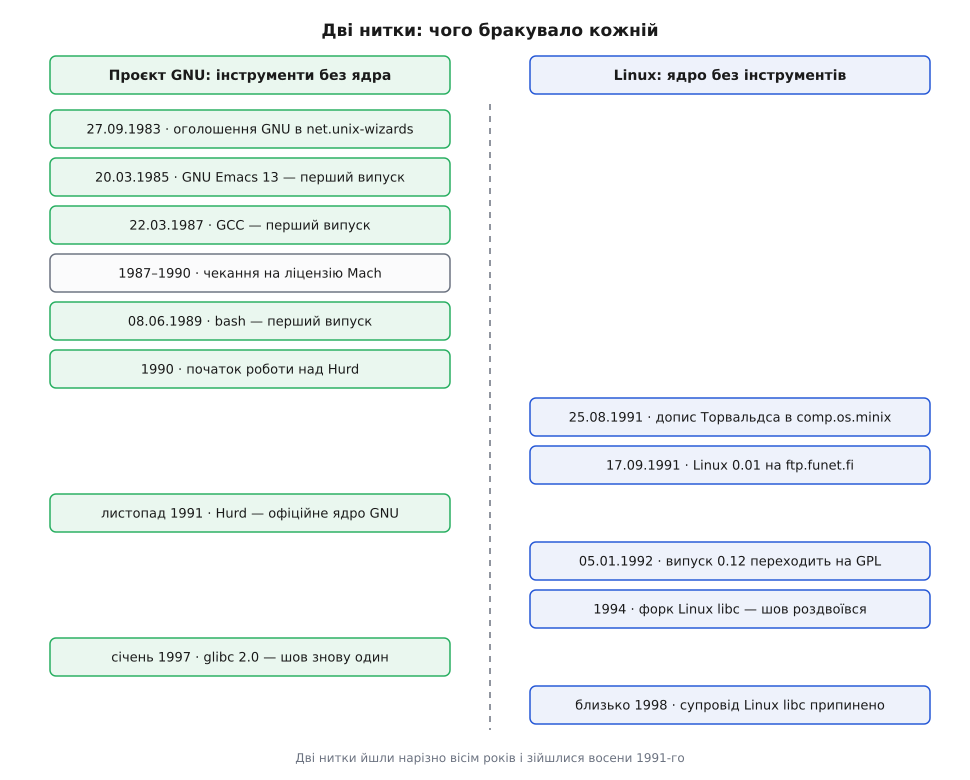

# 📜 Дві половини: як проєкт без ядра зустрів ядро без проєкту

Вісім років одні писали інструменти й не могли доробити ядро, а восени 1991-го студент у Гельсінкі написав ядро, яке без чужих інструментів не збиралося й не запускалося. Далі — обидві нитки по датах і ті розвилки, на яких усе могло скластися інакше.

*Ліва колонка — проєкт GNU, права — Linux; порядок рядків хронологічний.*

## Оголошення 27 вересня 1983 року

Річард Столмен (Richard Stallman) надіслав до груп новин Usenet `net.unix-wizards` і `net.usoft` повідомлення з адреси `RMS%MIT-OZ@mit-eddie`. Перший рядок тексту звучав так: «Starting this Thanksgiving I am going to write a complete Unix-compatible software system called GNU (for Gnu's Not Unix), and give it away free to everyone who can use it» — «Починаючи з цього Дня подяки я збираюся написати повну Unix-сумісну програмну систему на ім'я GNU і роздати її задарма всім, хто зможе нею користуватися».

*Статус доказовості: повний текст повідомлення опублікований самим Фондом вільного програмного забезпечення як первинне джерело; дату й групи новин підтверджує та сама публікація.* Столмен пізніше додав до неї примітку, що слово «free» тут ужито необережно: він мав на увазі, що ніхто не платитиме за **дозвіл** користуватися системою, а не що система не коштуватиме грошей — розрізнення, яке відтоді доводиться повторювати щоразу.

Ключове слово в оголошенні — **Unix-сумісну**. Не «кращу за Unix», не «нову». Столмен свідомо взяв чужу, вже усталену форму системи: ті самі імена команд, ті самі системні виклики, ту саму поведінку. Причина суто практична. Сумісність означала, що кожен окремий шматок GNU можна поставити на чужий, пропрієтарний Unix і одразу ним користуватися — а отже, у кожного шматка з'являлися користувачі, звіти про хиби й дописувачі задовго до того, як існувала бодай тінь власної системи. Проєкт, який довелося б чекати цілком і мовчки, помер би на другий рік.

Чому взагалі знадобилося переписувати те, що вже було написане, — окрема історія про ліцензійні обмеження AT&T на вихідний код, розібрана в [родоводі Unix](root:sys-unix/unix-lineage).

## Порядок, у якому будували

Через це рішення порядок робіт вийшов протилежним до інтуїтивного. Систему будували не знизу вгору, від ядра, а зверху вниз — від того, що людина бачить і чим користується щодня.

**Редактор.** Роботу над GNU Emacs Столмен почав 1984 року — як вільну заміну пропрієтарного Gosling Emacs. Версія 13, перший публічний випуск, вийшла 20 березня 1985 року; першою, що поширилася широко, стала версія 15.34 пізніше того ж року. *Статус: усталений факт, зафіксований у документації проєкту й довідкових джерелах.*

**Компілятор.** Тут спершу спробували не писати з нуля. Столмен просив дозволу взяти компілятор із Амстердамського інструментального набору Ендрю Таненбаума — виявилося, що вільним був університет, а не компілятор. Далі він узявся переробити компілятор мови Pastel із Ліверморської лабораторії, написавши до нього новий фронтенд для C, — і вперся в стіну: той компілятор тримав усю програму в пам'яті деревом і потребував мегабайтів стека, тоді як Unix на 68000 не давав більше за 64 кілобайти. Довелося писати компілятор наново; з коду Pastel до GCC не потрапило нічого, крім написаного самим Столменом фронтенда C. Перший випуск GCC став доступним для завантаження 22 березня 1987 року.

*Статус: усталений факт — 22 березня 1987 року вийшла бета під номером 0.9, версія 1.0 — 23 травня того ж року; обидва номери підтверджують і довідкові джерела, і збережені архіви самих випусків.*

**Оболонка.** bash (Bourne Again SHell — каламбур на «народжений знову» і прізвище Стівена Борна) написав Браян Фокс (Brian Fox), працівник Фонду. Писати його Фокс почав 10 січня 1988 року; перший випуск — бета під номером 0.99 — вийшов 8 червня 1989-го. *Статус: усталений факт, підтверджений довідковими джерелами.*

До червня 1987 року проєкт мав асемблер, майже готовий переносний оптимізувальний компілятор C, редактор і набір утиліт Unix. Не мав він лише однієї речі — тієї, без якої все це не вмикається.

## Три роки, витрачені на чужих юристів

Ядро пробували двічі, і обидва рази спотикалися об те саме: залежність від чужого коду з нез'ясованими умовами.

Перша спроба — TRIX, ядро, розроблене в MIT; до грудня 1986 року Фонд узявся його доробляти й від задуму відмовився. Друга — Mach. У середині 1987-го Фонд почав перемовини з професором Річардом Рашидом (Richard Rashid) із Карнеґі-Меллона про спільну роботу над мікроядром Mach. Ідея була розумна: не писати ядро цілком, а взяти готове мікроядро й побудувати над ним свої служби.

Далі сталося те, чого не спланувати. Юристи Карнеґі-Меллона близько **трьох років** вирішували, чи можна віддати код Mach на умовах, сумісних із вимогами вільного програмного забезпечення. Фонд усе це чекав — і чекав склавши руки: у власних звітах того часу сказано прямо, що роботи над ядром не ведеться, бо не має сенсу починати ядерний проєкт, поки лишається надія взяти Mach.

Ось точка, у якій історія вирішилася. Три роки — це 1987, 1988, 1989. Реальна робота над ядром почалася аж 1990-го; у січні 1991-го план полягав у тому, щоб розширити наявний частковий емулятор Unix на ім'я Poe, що працював поверх Mach. У листопадовому бюлетені GNU за 1991 рік уже сказано, що Hurd поверх Mach — офіційне ядро GNU. *Статус: усі ці дати взято з історичної довідки самого проєкту Hurd, тобто з первинного джерела зацікавленої сторони — але саме тому воно не має мотиву прикрашати затримку.*

Назва — жарт про рекурсію: Hurd розшифровують як «Hird of Unix-Replacing Daemons», а Hird — як «Hurd of Interfaces Representing Depth». Два взаємно рекурсивні акроніми, кожен усередині іншого. Заразом «herd of gnus» — стадо гну, натяк на будову з багатьох служб.

І тут спрацював другий, глибший чинник. Мікроядро означає, що робота, яку в моноліті виконує звичайний виклик функції всередині одного адресного простору, стає обміном повідомленнями між окремими процесами — з усіма наслідками для швидкодії, налагодження й взаємних блокувань. Чому це так і чому [моноліт із модулями](root:sys-unix/monolithic-with-modules) виявився значно легшим шляхом — окрема тема; для нашої історії досить наслідку: придатної для повсякденної роботи версії Hurd немає й донині.

> 🔧 **Навіщо це.** Затримку легко списати на бюрократію Карнеґі-Меллона, але причина глибша й повторювана: проєкт поставив свою критичну ланку в залежність від рішення, яке ухвалює хтось інший і не в його інтересах. Три роки очікування — це рівно те вікно, у яке встиг увійти сторонній.

## Гельсінкі, серпень 1991

25 серпня 1991 року Лінус Торвальдс (Linus Torvalds), студент Гельсінського університету, написав до групи новин `comp.os.minix`: «I'm doing a (free) operating system (just a hobby, won't be big and professional like gnu) for 386(486) AT clones» — «Роблю (вільну) операційну систему (просто хобі, не буде великою й професійною, як gnu) для клонів 386(486) AT».

Зверніть увагу, що́ стоїть у цьому реченні як мірило серйозності. GNU згадано в першому ж реченні — і згадано як те велике й професійне, чим це точно не буде. Тобто на серпень 1991-го проєкт GNU для людини з тієї спільноти був не абстракцією, а очевидним тлом.

17 вересня 1991 року версія 0.01 лягла на FTP-сервер `ftp.funet.fi`. Її не можна було просто взяти й запустити: щоб її зібрати, потрібен був MINIX, а щоб із нею щось робити — gcc і bash. Торвальдс у супровідних нотатках сам зазначив, що більшість інструментів, які використовують із Linux, — програми GNU під копілефтом GNU.

Отже, зустріч половин не була злиттям двох проєктів і навіть не була рішенням. Вона сталася сама, з двох причин, обидві з яких закладено ще 1983 року. По-перше, інструменти GNU вже існували, були переносними й уміли працювати на чужому ядрі — тож новому ядру не треба було нічого до себе доносити. По-друге, вони цілили в Unix-сумісність, а Торвальдс писав саме Unix-подібне ядро — тож інтерфейс, у який мали впертися обидві половини, був наперед узгоджений, хоча ніхто його для цієї зустрічі не узгоджував.

## Ліцензія: розвилка січня 1992-го

Перша версія Linux вийшла **не** під GPL. Власна ліцензія Торвальдса дозволяла копіювати й змінювати код, але прямо забороняла брати за нього гроші: «You may not distibute this for a fee, not even "handling" costs» — «Ви не можете поширювати це за плату, навіть за витрати на пересилання». *Орфографічна помилка в слові `distibute` — з оригіналу.*

Умова здається дрібницею, аж поки не поглянути на неї з боку того, як програми тоді доходили до людей. 1991 року «завантажити з інтернету» для більшості означало «попросити знайомого записати на дискети», а далі — стрічки й компакт-диски, які хтось мусив нарізати, спакувати й надіслати поштою. Заборона брати навіть за пересилання відрізала саме цей шлях. Заразом вона робила код несумісним із GPL: дві ліцензії не можна поєднати в одному дистрибутиві, якщо одна дозволяє продаж, а друга забороняє.

У нотатках до випуску 0.12 від 5 січня 1992 року Торвальдс написав: «I propose that the copyright be changed so that it confirms to GNU — pending approval of the persons who have helped write code» і назвав строк: «The GNU copyleft takes effect as of the first of February» — копілефт GNU набуває чинності з першого лютого. *Статус: цитати взято з первинного файла нотаток до випуску 0.12; частина вторинних джерел датує завершений перехід пізнішими випусками 1992 року — розбіжність у тім, що вважати моментом переходу, оголошення чи вихід випуску з готовим файлом ліцензії.*

Момент був можливий лише тому, що потрібна ліцензія на той час уже існувала в готовому вигляді: GPL другої версії опублікована в червні 1991 року, за два місяці до першого допису Торвальдса. Що саме означає копілефт і чим він відрізняється від дозвільних ліцензій — у темі про [ліцензії відкритого коду](root:sys-notary/open-source-licenses).

Наслідок цієї розвилки видно неозброєним оком. Дозвіл продавати — це те, з чого виросли дистрибутиви на компакт-дисках, а з них — компанії, що почали платити людям за роботу над ядром. Вимога віддавати зміни на тих самих умовах — це те, чому виправлення з тих компаній поверталися назад у спільне дерево, а не осідали в закритих відгалуженнях. Обидві половини системи опинилися під однією родиною ліцензій, і це, а не технічна сумісність, зробило їх однією системою в очах усіх, хто далі з ними працював.

Була й третя нитка, яка могла забрати все собі. Вільні системи на базі BSD існували вже тоді, але саме в 1992–1994 роках їхнє правове становище було непевним через позов AT&T щодо походження коду. Торвальдс потім не раз казав, що якби на момент початку роботи над Linux уже була доступна вільна 386BSD, він Linux найпевніше й не почав би. *Статус: це його власний ретроспективний здогад, а не доведений причинний зв'язок; правова колізія навколо BSD — окрема історія, згадана в [родоводі Unix](root:sys-unix/unix-lineage).*

## 1994–1998: шов, який на чотири роки роздвоївся

Зустріч половин не означала злагоди. Найгостріший конфлікт стався там, де він і мусив статися, — на єдиному місці, де половини мусять точно збігатися: у [бібліотеці C](root:sys-unix/libc-as-gateway), яка перекладає виклики звичайних функцій на системні виклики конкретного ядра.

1994 року розробники з боку Linux відгалузили власну гілку від glibc. Вона стала відома як **Linux libc** і несла внутрішнє ім'я `libc.so.5`. Загальновідома причина — те, що їхні зміни не вливалися назад до GNU через вимоги до оформлення авторських прав. *Статус: мотиви форку різні сторони переказують по-різному; те, що прийняття змін застопорилося, визнають обидві, а от чиєю мірою це була бюрократія й чиєю — нетерплячка, спільної версії немає.*

Чотири роки в екосистемі було два несумісні варіанти найважливішої бібліотеки. Двійковий файл, зібраний під одну, не запускався там, де стояла друга, — і саме звідти в тодішніх настановах до встановлення бралася нескінченна морока з «libc5 проти libc6». Чому це в принципі так і як [ім'я та версії символів у спільній бібліотеці](root:sys-unix/soname-versioning) визначають, що з чим запуститься, — окрема тема.

Скінчилося все не переговорами, а якістю. У січні 1997 року Фонд випустив glibc 2.0 — із суттєво кращою відповідністю POSIX, підтримкою інтернаціоналізації, IPv6, 64-бітових даних і потоків виконання. Розробники ядра згорнули свою гілку; на Linux glibc узяла внутрішнє ім'я `libc.so.6`, супровід Linux libc припинився приблизно 1998 року. *Статус: дата випуску glibc 2.0 (січень 1997) і перехід на `libc.so.6` — усталені факти; «приблизно 1998» для згасання форку точнішої дати не має.*

## Назва

Назву «GNU/Linux» першим ужив не Фонд, а дистрибутив. Ян Мердок (Ian Murdock) оголосив про Debian 16 серпня 1993 року в групі новин `comp.os.linux.development`; з листопада 1994 до листопада 1995 року Фонд вільного програмного забезпечення фінансував проєкт — Мердок сподівався, що Фонд у такий спосіб набуде досвіду пакування повної системи GNU. Дистрибутив і донині зветься **Debian GNU/Linux**. Фінансування скінчилося в листопаді 1995-го й не поновилося: у березні 1996 року Мердок відійшов від керування, а його наступники ближчих стосунків із Фондом уже не хотіли. *Статус: дати оголошення, період фінансування та березень 1996-го як момент відходу Мердока підтверджені довідковими джерелами; точного дня, коли в назву додали «GNU», у джерелах немає.*

Фонд відтоді просить називати систему GNU/Linux, коли йдеться про систему цілком, а не про саме ядро. Прохання щоразу викликає ту саму суперечку, і сперечаються в ній насправді про дві різні речі. Перша — про заслугу: чиєї роботи в тому, що запускається на вашій машині, більше. Друга, важливіша, — про те, чим ця річ узагалі є: назва «Linux» описує компонент, назва «GNU/Linux» описує систему, і те, яку з них ви оберете, змінює, що ви очікуєте побачити, відкривши таку машину.

Історія обох ниток дає до цієї суперечки простий факт, з яким погоджуються всі сторони незалежно від симпатій: жодна з половин не могла вийти в люди сама. GNU вісім років мав усе, крім ядра, і не спромігся його доробити. Linux у вересні 1991-го був ядром, яке неможливо було ні зібрати, ні використати без чужих інструментів. Те, що ці двоє зійшлися саме тоді, — не задум і не заслуга: це збіг двох незалежних рішень 1983 і 1991 років, кожне з яких ухвалили з власних міркувань.
