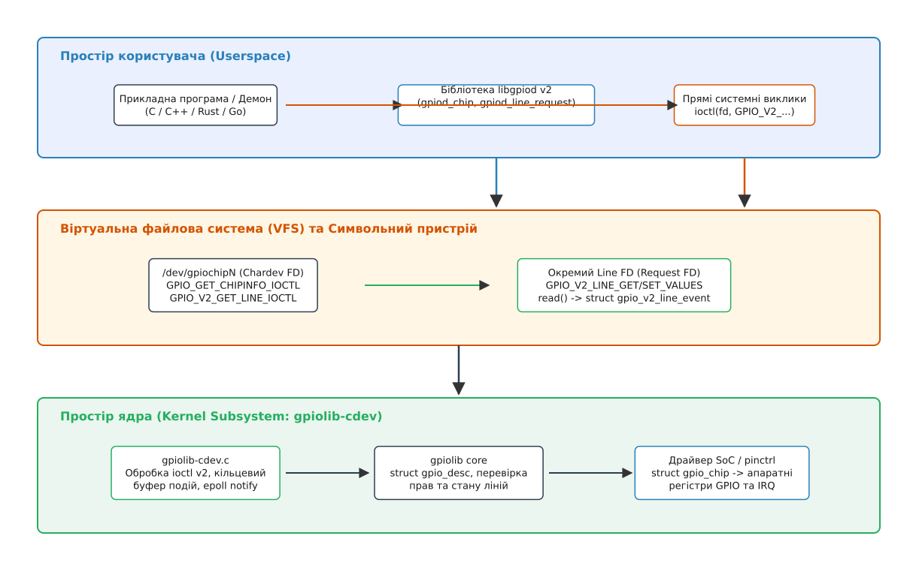
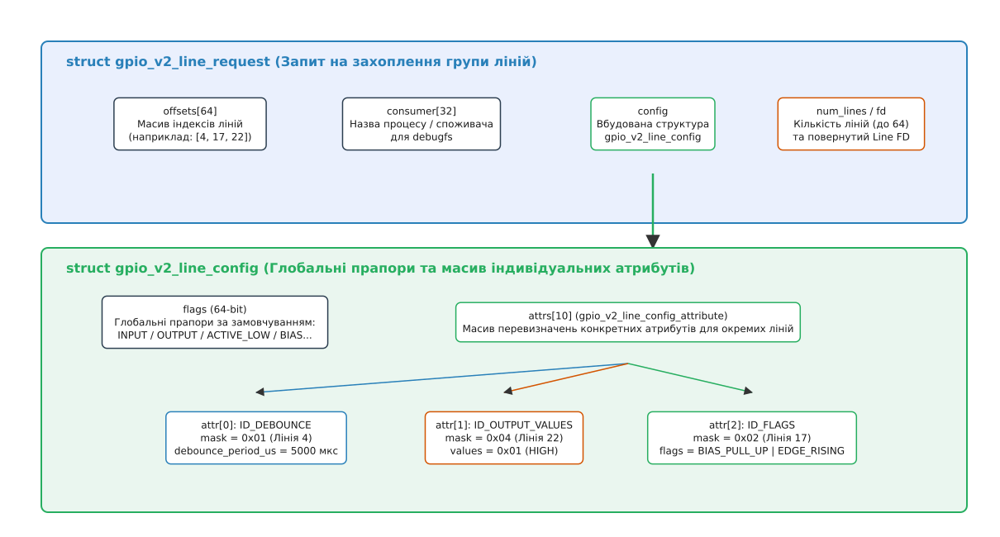
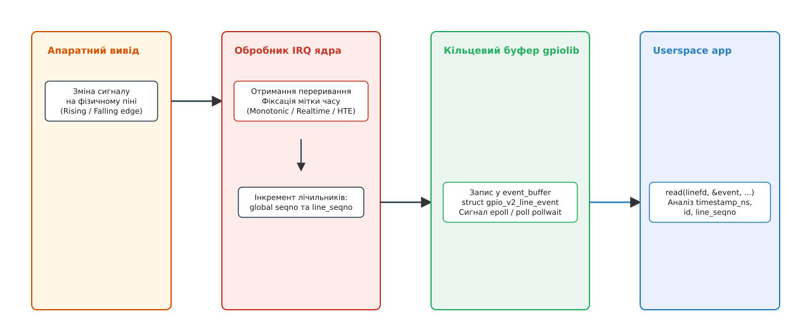

# Сучасний інтерфейс GPIO chardev ABI v2 (/dev/gpiochipN)

<preknowlist>
- [Символьні та блокові пристрої](root:sys-unix/character-and-block-devices) — абстракція `/dev/...`, драйвери символьних пристроїв та системний виклик `ioctl()`.
- [Сучасний дворівневий API GPIO descriptors (gpiod)](root:sys-unix/gpio-chardev-abi-v2-libgpiod) — концепція дескрипторів `struct gpio_desc` та відмова від застарілого sysfs.
- [Модель файлових пристроїв у VFS](root:sys-unix/device-file-model) — файлові дескриптори, подійний моніторинг `poll()`/`epoll()` та життєвий цикл системних ресурсів.
</preknowlist>

Коли в Linux 5.10 було прийнято нову версію ABI v2 для символьних пристроїв GPIO (`/dev/gpiochipN`), це стало вирішенням тривалих проблем асинхронного моніторингу подій та налаштування апаратних виводів із простору користувача. Старий інтерфейс v1, доданий у Linux 4.8, вимагав двох окремих файлових дескрипторів для читання рівнів та перехоплення фронтів сигналу, а його 32-бітні прапори конфігурації не вміщували атрибути внутрішнього підтягування (bias), апаратного придушення брязкоту (debounce) та вибору джерела міток часу. Новий ABI v2 об'єднав керування лініями й подійний моніторинг у єдиний атомарний об'єкт `struct gpio_v2_line_request` і надав гнучкий масив атрибутів `struct gpio_v2_line_attribute`, уможлививши точний бітбенгінг, безпечну роботу в багатопотоковому середовищі та повноцінну підтримку бібліотеки `libgpiod` v2.

У цій архітектурі взаємодія з апаратними виводами більше не спирається на магічні цілочисельні номери чи текстові файли у sysfs. Натомість прикладні програми працюють із файловою системою VFS через спеціалізовані виклики `ioctl()`, а ядро гарантує авто-очищення ресурсів при аварійних зупинках процесів.


*Архітектура символьного пристрою GPIO ABI v2 у ядрі Linux та просторі користувача.*

---

## 1. Архітектурні передумови: Від вад ABI v1 до уніфікації v2

До появи символьного пристрою основний доступ до ліній у просторі користувача відбувався через текстовий інтерфейс `/sys/class/gpio`. Запис чисел у файли `export` та `direction` створював критичні ризики для промислових систем: розрив між зміною напрямку піна та встановленням його значення викликав короткочасні електричні імпульси (glitches), а падіння процесу залишало піни захопленими без можливості автоматичного повернення в безпечний стан. Крім того, перетворення цілих чисел у текстові рядки ASCII та зворотний парсинг у ядрі вимагали тисяч циклів процесора, що робило програмне нарізання протоколів (bitbanging) через sysfs повільним та нестабільним.

Перша версія символьного пристрою ABI v1 (додана в Linux 4.8) виправила проблему очищення ресурсів шляхом прив'язки ліній до файлових дескрипторів (`fd`). Проте ABI v1 швидко вичерпав свій потенціал через чотири базові обмеження:

1. **Дуалізм файлових дескрипторів:** Для звичайного зчитування чи зміни стану використовувався дескриптор `Line Handle`, а для отримання переривань (Rising / Falling edge) — окремий `Line Event`. Оскільки ядро забороняло повторно захоплювати одну й ту саму лінію, програма не могла одночасно контролювати рівень та відстежувати фронти сигналу через один дескриптор.
2. **Вичерпання бітових прапорів:** 32-бітна маска прапорів `GPIOHANDLE_REQUEST_OPTION_*` не мала вільних бітів для додавання нових апаратних можливостей — таких як внутрішні підтягуючі резистори (`PULL_UP`, `PULL_DOWN`), придушення брязкоту контакту (debounce) та вибір джерела системних міток часу (`CLOCK_MONOTONIC` проти `CLOCK_REALTIME`).
3. **Жорсткість конфігурації групи ліній:** Запитуючи групу з кількох пінів у межах одного Line Handle, розробник мусив застосовувати однакові прапори до всіх ліній. Для роздільного налаштування входів і виходів доводилося відкривати кілька дескрипторів, що руйнувало атомарність управління.
4. **Відсутність динамічної повторної конфігурації:** Для зміни напрямку піна з входу на вихід під час виконання програми доводилося закривати дескриптор і відкривати його заново, що викликало короткочасний вихід лінії з-під контролю процесу.

Для усунення цих архітектурних тупиків у ядрі Linux 5.10 було реалізовано ABI v2, де всі операції керування, налаштування та подійного моніторингу об'єднано у єдину структуру `struct gpio_v2_line_request`.

> 📜 Детальний історичний екскурс про еволюцію користувацького інтерфейсу Linux GPIO — від створення sysfs до розробки ABI v2 — винесено у вставку [Еволюція ABI користувацького інтерфейсу GPIO у Linux](root:sys-unix/gpio-character-device-v2/hist-abi-v1-vs-v2.md).

---

## 2. Модель двоступеневих файлових дескрипторів у VFS

Взаємодія простору користувача з підсистемою gpiolib за допомогою ABI v2 будується на двоступеневі ієрархії файлових дескрипторів.

### 2.1. Головний дескриптор контролера (`/dev/gpiochipN`)

Кожен фізичний контролер GPIO (або розширювач на шині I2C/SPI) реєструється в системі як символьний пристрій `/dev/gpiochipN` (наприклад, `/dev/gpiochip0`). Прикладна програма відкриває цей файл за допомогою системного виклику:

:::tabs
```c
int chip_fd = open("/dev/gpiochip0", O_RDWR | O_CLOEXEC);
```
```cpp
sys::UniqueFd chip_fd{::open("/dev/gpiochip0", O_RDWR | O_CLOEXEC)};
```
:::

Файловий дескриптор `chip_fd` слугує точкою входу для запиту загальної інформації про чип та стану його ліній. Через `chip_fd` виконуються три групи системних викликів `ioctl()`:

* `GPIO_GET_CHIPINFO_IOCTL` — отримання назви чипа, мітки драйвера та загальної кількості ліній.
* `GPIO_V2_GET_LINEINFO_IOCTL` — отримання поточної конфігурації конкретної лінії (назва, споживач, прапори, атрибути).
* `GPIO_V2_GET_LINEINFO_WATCH_IOCTL` — підписка на спостереження за змінами конфігурації лінії іншими процесами.

### 2.2. Окремий дескриптор запиту ліній (Line Request FD)

Для безпосереднього використання ліній (читання, запис, моніторинг переривань) програма передає структуру `struct gpio_v2_line_request` у системний виклик `ioctl(chip_fd, GPIO_V2_GET_LINE_IOCTL, &req)`.

Ядро Linux перевіряє доступність вказаних ліній, блокує їх від повторного захоплення іншими процесами та повертає новий анонімний файловий дескриптор у полі `req.fd`.

```
  /dev/gpiochip0 (chip_fd)
         │
         ▼  ioctl(GPIO_V2_GET_LINE_IOCTL)
  ┌──────────────┐
  │   Line FD    │ ──► ioctl(GPIO_V2_LINE_SET_VALUES_IOCTL)
  └──────────────┘ ──► read() -> struct gpio_v2_line_event
         │         ──► poll() / epoll() notification
         ▼  close(line_fd)
  Ядро вивільняє лінії та повертає їх у безпечний стан
```

Цей повернутий `line_fd` має виключні права на управління захопленою групою ліній (до 64 ліній в одному запиті). Усі подальші операції `ioctl()` щодо зміни рівнів або конфігурації виконуються безпосередньо над `line_fd`.

### 2.3. Автоматичне очищення ресурсів та гарантії RAII

Найважливішою перевагою використання символьного пристрою є прив'язка життєвого циклу апаратних ресурсів до таблиці файлових дескрипторів процесу в ядрі.

Якщо програма, яка володіє `line_fd`, завершується аварійно (наприклад, через виникнення помилки `SIGSEGV` або примусове знищення сигналом `SIGKILL`), операційна система виконує каскадне закриття всіх відкритих файлових дескрипторів процесу. Підсистема `gpiolib-cdev` у ядрі отримує сповіщення про закриття `line_fd`, автоматично вивільняє всі прив'язані дескриптори `struct gpio_desc` та повертає апаратні лінії у безпечний режим цифрового входу.

---

## 3. Структури даних ABI v2 та гнучкий механізм атрибутів

На відміну від ABI v1, де налаштування задавалися єдиною 32-бітною бітовою маскою, в ABI v2 застосовано комбіновану модель: глобальні прапори за замовчуванням плюс масив індивідуальних атрибутів.


*Компоновка структури захоплення ліній gpio_v2_line_request та перевизначення атрибутів.*

### 3.1. Структура запиту `gpio_v2_line_request`

При захопленні ліній програма заповнює структуру `gpio_v2_line_request`:

* `offsets[64]` — масив індексів ліній на контролері (наприклад, `[17, 27]`).
* `num_lines` — кількість ліній у масиві (від 1 до 64).
* `consumer[32]` — текстова назва процесу або модуля для відображення у `/sys/kernel/debug/gpio`.
* `config` — структура `struct gpio_v2_line_config`, яка описує конфігурацію ліній.
* `event_buffer_size` — бажаний розмір кільцевого буфера подій переривань (якщо 0, ядро обирає розмір за замовчуванням, пропорційний кількості ліній).
* `fd` — поле, куди ядро записує результуючий Line FD.

### 3.2. Ієрархія атрибутів у `gpio_v2_line_config`

Структура `gpio_v2_line_config` містить глобальне поле `flags` (64-бітна маска) та масив `attrs[10]` типу `struct gpio_v2_line_config_attribute` — пар «атрибут плюс маска ліній».

Глобальні прапори `flags` застосовуються до **всіх** ліній, перелічених у `offsets[]`. Якщо ж для окремих ліній потрібні унікальні налаштування, розробник заповнює масив `attrs[]`:

Кожен елемент `attrs[]` містить вкладений атрибут `attr` та власну маску:
* `attr.id` — тип атрибута (`GPIO_V2_LINE_ATTR_ID_FLAGS`, `OUTPUT_VALUES` або `DEBOUNCE`).
* `mask` — 64-бітна бітова маска, де встановлений `i`-й біт означає, що даний атрибут застосовується до лінії з індексом `offsets[i]`.
* `attr` — об'єднання (`union`) зі значенням атрибута (нові 64-бітні прапори, вихідні логічні рівні або час дебаунсу у мікросекундах).

Цей підхід дозволяє в одному атомарному системному виклику захопити, наприклад, 8 ліній, зробивши 4 з них виходами з відкритим стоком, 2 — входами з підтяжкою Pull-Up, а ще 2 — входами з апаратним дебаунсом 10 мс.

> 📋 Повну технічну специфікацію всіх структур даних, кодувань команд `ioctl()`, таблицю бітових прапорів та коди помилок наведено у вставці [Довідник структур даних та ioctl-команд GPIO ABI v2](root:sys-unix/gpio-character-device-v2/api-v2-structures-and-ioctls.md).

---

## 4. Конфігураційні можливості ABI v2

ABI v2 відкриває доступ до повного спектра апаратних можливостей сучасних SoC та розширювачів портів.

### 4.1. Напрямок та активний рівень (Direction & Active Low)

* `GPIO_V2_LINE_FLAG_INPUT` та `GPIO_V2_LINE_FLAG_OUTPUT`: Визначають режим роботи піна. Передача обох прапорів одночасно є помилкою (`EINVAL`).
* `GPIO_V2_LINE_FLAG_ACTIVE_LOW`: Вмикає інверсію логіки безпосередньо у ядрі. Якщо цей прапор встановлено, то логічний `1` у просторі користувача відповідає фізичному низькому рівню (0 В) на піні, а логічний `0` — високому рівню (VCC). Це спрощує роботу з кнопками або реле, які активуються низьким рівнем.

### 4.2. Конфігурація вихідного каскаду (Drive Modes)

Для вихідних ліній доступні спеціальні режими керування транзисторними ключами:

* `GPIO_V2_LINE_FLAG_OPEN_DRAIN`: Вихід із відкритим стоком. Драйвер підтягує лінію до землі (0 В) при логічному 0, але переводить вивід у високоімпедансний стан (Hi-Z) при логічній 1. Застосовується для шин I2C та 1-Wire.
* `GPIO_V2_LINE_FLAG_OPEN_SOURCE`: Вихід із відкритим витоком. Драйвер підтягує лінію до VCC при логічній 1, але відпускає її в Hi-Z при 0.

### 4.3. Управління підтягуючими резисторами (Bias Control)

На відміну від застарілих систем, де підтяжка налаштовувалася через сторонні драйвери pinctrl або проприєтарні утиліти, ABI v2 дозволяє керувати резисторами прямо при захопленні лінії:

* `GPIO_V2_LINE_FLAG_BIAS_PULL_UP`: Вмикає внутрішній підтягуючий резистор до лінії живлення.
* `GPIO_V2_LINE_FLAG_BIAS_PULL_DOWN`: Вмикає внутрішній підтягуючий резистор до землі.
* `GPIO_V2_LINE_FLAG_BIAS_DISABLED`: Гарантовано вимикає всі внутрішні резистори підтяжки.

### 4.4. Апаратне та програмне придушення брязкоту (Debouncing)

Механічний контакт кнопки при натисканні генерує серію хаотичних імпульсів (брязкіт) тривалістю від 100 мкс до 10 мс. В ABI v2 фільтрація брязкоту задається атрибутом `GPIO_V2_LINE_ATTR_ID_DEBOUNCE` із вказуванням часу затримки в мікросекундах (`debounce_period_us`).

Ядро Linux обробляє цей атрибут двома шляхами:
1. Якщо апаратний контролер GPIO підтримує внутрішній дебаунс (наприклад, драйвер має функцію `set_config`), ядро програмує таймер безпосередньо у регістрі контролера.
2. Якщо контролер не має апаратного дебаунсу, підсистема `gpiolib` автоматично створює програмний системний таймер у ядрі, який відфільтровує хибні переривання до передачі події в простір користувача.

### 4.5. Вибір джерела міток часу (Event Clocks) та підсистема HTE

При перехопленні фронтів сигналу кожна подія супроводжується 64-бітним часовим штампом у наносекундах. ABI v2 дозволяє обрати джерело годинника за допомогою прапорів:

* `CLOCK_MONOTONIC` — джерело за замовчуванням: окремого прапора для нього немає, воно діє, доки не задано жодного з двох наступних. Монотонний годинник, який не зазнає стрибків при корекції системного часу через NTP.
* `GPIO_V2_LINE_FLAG_EVENT_CLOCK_REALTIME`: Використовує `CLOCK_REALTIME`. Календарний час (Wall-clock time), зручний для прив'язки подій до астрономічного часу.
* `GPIO_V2_LINE_FLAG_EVENT_CLOCK_HTE`: Використовує апаратний модуль фіксації часу HTE (Hardware Timestamp Engine). Апаратний блок SoC фіксує момент переривання з точністю до десятків наносекунд на рівні шини, мінімізуючи затримки обробника IRQ.

Підсистема HTE особливо корисна для промислових контролерів руху та декодерів інкрементальних енкодерів, де вимірювання часу між перериваннями визначає точність розрахунку швидкості обертання валу.

---

## 5. Асинхронна обробка подій та кільцевий буфер

Однією з найсильніших сторін ABI v2 є інтеграція моніторингу подій переривань у стандартний подійний цикл Linux (`epoll`).


*Послідовність обробки апаратних переривань та зчитування подій із кільцевого буфера.*

### 5.1. Подійна структура `gpio_v2_line_event`

Коли на лінії, конфігурованій з прапорами `GPIO_V2_LINE_FLAG_EDGE_RISING` або `FALLING`, відбувається зміна логічного рівня, обробник переривань ядра створює структуру `gpio_v2_line_event`:

:::tabs
```c
struct gpio_v2_line_event {
    __u64 timestamp_ns; /* Часова мітка події у наносекундах */
    __u32 id;           /* RISING_EDGE (1) або FALLING_EDGE (2) */
    __u32 offset;       /* Індекс лінії, на якій сталася подія */
    __u32 seqno;        /* Порядковий номер події у межах дескриптора Line FD */
    __u32 line_seqno;   /* Порядковий номер події конкретно для цієї лінії */
    __u32 padding[6];
};
```
```cpp
// Дзеркальне представлення структури події у C++20 UAPI
struct alignas(8) gpio_v2_line_event {
    std::uint64_t timestamp_ns;
    std::uint32_t id;
    std::uint32_t offset;
    std::uint32_t seqno;
    std::uint32_t line_seqno;
    std::uint32_t padding[6];
};
```
:::

Поля `seqno` та `line_seqno` дозволяють прикладному коду виявляти пропущені події: якщо `seqno` наступної прочитаної події більший за попередній більше ніж на 1, це означає, що переповнення кільцевого буфера призвело до втрати даних.

### 5.2. Зчитування даних та неблокуючий I/O

Для зчитування подій додаток викликає функцію `read()` над дескриптором `line_fd`:

:::tabs
```c
struct gpio_v2_line_event events[8];
ssize_t bytes_read = read(line_fd, events, sizeof(events));
size_t num_events = (bytes_read > 0)
                  ? (size_t)bytes_read / sizeof(struct gpio_v2_line_event)
                  : 0;  /* без перевірки -1 дав би величезне число */
```
```cpp
std::array<::gpio_v2_line_event, 8> events;
ssize_t bytes_read = ::read(line_fd.get(), events.data(), sizeof(events));
std::size_t num_events = (bytes_read > 0) ? (static_cast<std::size_t>(bytes_read) / sizeof(::gpio_v2_line_event)) : 0;
```
:::

Якщо в буфері немає нових подій, виклик `read()` блокує потік. Якщо на `line_fd` виставлено прапор `O_NONBLOCK` (через `fcntl()`, бо сам дескриптор створює ядро), виклик негайно повертає `-1` із `errno = EAGAIN`.

Для ефективного моніторингу сотень ліній без створення окремих потоків дескриптор `line_fd` передається у мультиплексор `epoll_ctl(epoll_fd, EPOLL_CTL_ADD, line_fd, &ev)`. Готовність даних для читання сигналізується подією `EPOLLIN`.

---

## 6. Внутрішній шлях виклику в ядрі (`gpiolib-cdev.c`)

Шлях системного виклику від простору користувача до фізичного регістру SoC розгортається через декілька підсистем ядра:

1. **Прийом виклику VFS:** Системний виклик `ioctl(chip_fd, GPIO_V2_GET_LINE_IOCTL, &req)` потрапляє у файлові операції символьного пристрою `gpiolib-cdev.c`.
2. **Перевірка прав та захоплення ліній:** Функція `linereq_create()` аналізує переданий масив `offsets[]`. Для кожного індексу виконується виклик `gpiochip_get_desc()`, який повертає ядерний дескриптор `struct gpio_desc`. Ядро перевіряє, чи не встановлено прапор `FLAG_REQUESTED`.
3. **Застосування конфігурації:** Драйвер `gpiolib` викликає підсистему `pinctrl` для переключення функціонального режиму піна (Muxing), а потім передає апаратні налаштування (direction, drive, bias, debounce) через низку методів структури `struct gpio_chip`:
   * `chip->direction_input(chip, offset)`
   * `chip->direction_output(chip, offset, value)`
   * `chip->set_config(chip, offset, config)`
4. **Реєстрація обробника IRQ:** Якщо запитано відстеження фронтів, ядро викликає `gpio_to_irq()`, отримує системний номер переривання та реєструє внутрішній обробник `linereq_irq_handler()` через `request_threaded_irq()`.
5. **Створення Line FD:** Через `anon_inode_getfd()` створюється анонімний inode і файловий дескриптор, у контексті якого зберігається кільцевий буфер подій `kfifo`.

Взаємодія з підсистемою HTE (Hardware Timestamp Engine) забезпечує апаратну прив'язку події до лічильника часу в момент фізичного спрацьовування компаратора на вході SoC. Це усуває затримки обробників системних переривань та джиттер, викликаний контекстними перемиканнями ядра Linux. Кільцевий буфер `kfifo` зберігає елементи фіксованого розміру, що робить операції читання у критичних секціях ядра O(1) і запобігає виділенню динамічної пам'яті під час обробки переривань.

---

## 7. Порівняння швидкодії: sysfs vs ABI v2 vs `/dev/mem`

Під час вибору способу управління GPIO у системних проєктах важливо розуміти накладні витрати кожного підходу:

| Метод доступу | Частота перемикання (Bitbanging) | Затримка IRQ (Latency) | Безпека та ізоляція | Залежність від прав |
| :--- | :--- | :--- | :--- | :--- |
| **SysFS (`/sys/class/gpio`)** | ~1–5 кГц | ~100–500 мкс | Низька (текстові файли) | Потрібен root для export |
| **Chardev ABI v2 (`ioctl`)** | ~200–800 кГц | ~5–20 мкс | Висока (абстракція VFS) | Група `gpio` через udev |
| **Direct Hardware (`/dev/mem`)** | ~20–50 МГц | N/A (лише polling) | Вкрай критична (доступ до MMIO) | Суворо `root` + CAP_SYS_RAWIO |

Хоча пряме відображення регістрів MMIO через `/dev/mem` або `devmem2` забезпечує максимальну частоту перемикання, воно повністю обходить підсистему ядра, створює загрозу пошкодження сусідніх регістрів контролера та унеможливлює обробку апаратних переривань у просторі користувача. Символьний пристрій ABI v2 надає оптимальний баланс між продуктивністю (сотні кілогерц) та безпекою ядра.

---

## 8. Практична робота: Низькорівневий ioctl vs Бібліотека libgpiod v2

Під час розробки прикладного програмного забезпечення розробник має вибір між двома підходами:

1. **Прямі виклики `ioctl()`:** Використовують лише стандартні системні заголовки `<linux/gpio.h>`. Цей підхід не має зовнішніх залежностей і є ідеальним для автономних або сильно обмежених за розміром вбудованих систем (embedded Linux, initramfs, bootloaders).
2. **Використання `libgpiod` v2:** Офіційна бібліотека простору користувача, розроблена спільнотою ядра Linux. Вона приховує складність формування структур `ioctl()`, забезпечує безпеку типів, підтримує сучасні ідіоми C++20 (RAII, `std::chrono`), а також надає байндинги для Python та Rust.

Використання `libgpiod` v2 є стандартом для сучасних дистрибутивів Linux (Debian, Ubuntu, Yocto Project). Вона абстрагує відмінності у версіях ядра та автоматично підганяє розширені атрибути під наявні можливості драйвера контролера.

Групові операції читання та запису значень ліній (`GPIO_V2_LINE_GET_VALUES_IOCTL` та `SET_VALUES_IOCTL`) виконуються за один системний виклик для всієї бітової маски, що дозволяє реалізовувати високошвидкісний паралельний бітбенгінг шин даних (наприклад, паралельних LCD-дисплеїв або зовнішніх ЦАП/АЦП) із частотою перемикання у сотні кілогерц без великих накладних витрат VFS.

> ⚙️ Повні, готові до компіляції приклади програм, реалізовані обома підходами (прямі `ioctl` та `libgpiod` v2) мовами C та C++, наведено у вставці [Практична реалізація: Прямі ioctl v2 та бібліотека libgpiod v2](root:sys-unix/gpio-character-device-v2/proj-v2-raw-ioctl-and-libgpiod.md).

---

## 9. Права доступу, безпека та багатопотоковість

Перехід на символьний пристрій `/dev/gpiochipN` кардинально покращив модель безпеки Linux у порівнянні з sysfs.

### 9.1. Розмежування прав через правила udev

За замовчуванням символьні пристрої `/dev/gpiochipN` належать користувачу `root` та групі `root` із правами `0600`. Для надання доступному користувачеві або демону права керувати GPIO без підвищення привілеїв до `root` використовується правило `udev`:

```ini
# /etc/udev/rules.d/99-gpio.rules
SUBSYSTEM=="gpio", KERNEL=="gpiochip*", GROUP="gpio", MODE="0660"
```

Користувач, доданий до системної групи `gpio`, отримує можливість відкривати `/dev/gpiochipN` і керувати лініями. При цьому система захищена від зловмисного вихоплення ліній, вже захоплених ядром (наприклад, ліній регуляторів напруги або шини системної SPI-флеш-пам'яті), оскільки `gpiolib` повертає помилку `EBUSY` на спробу захопити вже зайняту лінію.

### 9.2. Багатопотоковість та атомарна зміна конфігурації

Файловий дескриптор `line_fd` захищено внутрішніми м'ютексами ядра (`linereq->config_mutex`). Кілька потоків одного процесу можуть безпечно виконувати виклики `GPIO_V2_LINE_GET_VALUES_IOCTL` та `SET_VALUES_IOCTL` над одним і тим самим `line_fd`.

Крім того, виклик `GPIO_V2_LINE_SET_CONFIG_IOCTL` дозволяє атомарно змінити конфігурацію ліній (наприклад, перемикнути лінію з входу на вихід або змінити затримку дебаунсу) без розриву володіння лінією. Це повністю усуває ризик виникнення непередбачуваних проміжних станів (glitch-free reconfiguration).

<!-- службовий розділ про правила корпусу прибрано з читацького тексту

## 10. Аналіз базової версії статті (§3)

За правилами побудови курсу (AUTHORING §3), базова версія статті (`gpio-character-device-v2.md`) створюється лише за умови виконання всіх чотирьох критеріїв Gate:
1. Обсяг детальної версії перевищує 4000 слів або містить високорівневу оглядову сутність для широкого загалу.
2. Тема не є чисто довідниковою (reference-like enumeration of APIs/flags/structs).
3. Матеріал легко скорочується вдвічі без втрати цілісності причинно-наслідкового ланцюга.

Дана тема про інтерфейс GPIO chardev ABI v2 є **чисто довідниковою та системно-специфічною** (reference topic): її ядром є перелік системних викликів `ioctl()`, структур ядра `<linux/gpio.h>`, атрибутів та конфігураційних прапорів. Відповідно до абсолютного дискваліфікатора §3 AUTHORING ("The topic is reference-like — its core is an API, a protocol, a format, a set of parameters, a table"), створення базової версії для даної теми **не є доцільним** (`basic:empty`).
-->
