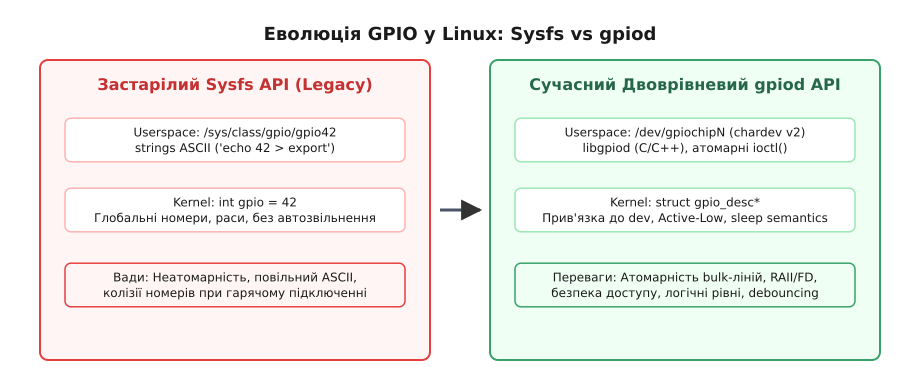

# Сучасний двоврівневий API GPIO descriptors (gpiod)

<preknowlist>
- [Файлова система sysfs та модель пристроїв](topic:sys-unix/sysfs-device-model) — представлення апаратних ресурсів ядра через деревини атрибутів sysfs та їхні обмеження.
- [Символьні та блочні пристрої](topic:sys-unix/character-and-block-devices) — абстракція пристроїв `/dev/...`, керування через системні виклики `ioctl()` та файлові дескриптори VFS.
- [Ядерний дескрипторний API gpiod](topic:sys-unix/gpiod-kernel-consumer-api) — концепція `struct gpio_desc` та безпечна робота з апаратними лініями у ядрі.
</preknowlist>

У сучасних системах на кристалі (SoC) ARM64 чи RISC-V із сотнями ліній виводу загального призначення (GPIO) іспанська рулетка з динамічною нумерацією чипів призводить до незворотного пошкодження заліза. Коли плата керування промисловим роботом ініціалізує шину I2C раніше за розширювач SPI, пін скидання живильного контролера отримує номер 42 замість світлодіода індикації, і перший же виклик запису вимикає живлення процесора на пів кроці вимірювального циклу.

Традиційна модель Linux, побудована на глобальних цілих числах та файловому інтерфейсі `/sys/class/gpio`, вичерпала себе ще в часи ядра 3.x. Вона не мала механізмів атомарної зміни стану, не гарантувала захисту ресурсів від аварійного завершення процесів і витрачала мікросекунди на текстові трансляції ASCII у системних викликах.

Розв'язанням цих проблем став двошаровий дескрипторний фреймворк **gpiod** (GPIO Descriptors). Він розмежував задачі ядра та простору користувача, замінивши небезпечні числа на суворо типізовані ядерні дескриптори `struct gpio_desc*`, а текстові файли `sysfs` — на символьні пристрої `/dev/gpiochipN` із бінарним двостороннім двошаровим ABI v2.


*Еволюція архітектури GPIO у Linux: від неатомарного Sysfs API до сучасного двоврівневого дескрипторного фреймворку (gpiod).*

## 1. Архітектурний конфлікт: чому числа та SysFS зламали системи

Щоб осягнути логіку нового дескрипторного API, необхідно простежити причинно-наслідковий ланцюг деградації старої моделі у складних вбудованих системах.

### 1.1. Проблема глобального числового простору

У старій системі `gpiolib` кожному фізичному виводу контролера призначалося одне ціле число (integer GPIO number). Драйвер периферії викликав функцію `gpio_request(42, "my_led")`, сподіваючись, що 42 завжди відповідає тому самому фізичному контакту на платі.

Ця гіпотеза руйнується у будь-якому SoC із кількома GPIO-контролерами або шинними розширювачами портів (I2C/SPI GPIO expanders, як-от PCF8574 або MCP23017). Порядок реєстрації пристроїв під час завантаження ядра залежить від послідовності асинхронного опитування (probe order) шин:
- Якщо драйвер внутрішнього GPIO-контролера SoC зареєструвався першим, він отримує діапазон номерів `0..31`.
- Якщо першим ініціалізувався розширювач на шині I2C, саме він займає діапазон `0..7`, а контролер SoC зсувається на `8..39`.

У результаті жорстко зашиті в код номери ліній перетворювалися на міну уповільненої дії. Зміна порядку завантаження модулів ядра чи додавання нового пристрою на шину докорінно змінювали карту номерів, змушуючи драйвери керувати чужими контактами.

### 1.2. Неатомарність та паразитна генерація імпульсів у SysFS

Інтерфейс простору користувача `/sys/class/gpio` маскувався під філософію UNIX «все є файл», але порушував базові вимоги до атомарності операцій виводу:

```bash
echo 42 > /sys/class/gpio/export
echo out > /sys/class/gpio/gpio42/direction
echo 1 > /sys/class/gpio/gpio42/value
```

Ці три дії виконуються окремими системними викликами `open()` та `write()`. Між конфігурацією напрямку (`direction`) та встановленням значення (`value`) виникає часова шпарина, у яку неминуче вклинюється планувальник задач Linux:

```
Процес A                    Планувальник Ядра                 Фізичний Пін GPIO
--------                    -----------------                 -----------------
write("out") -------------> Перемикання напрямку на вихід --> За замовчуванням 0V
                            === Контекстний перемикач ===
                            [Процес B виконується 10 мс]
write("1") ----------------> Встановлення високого рівня ----> Перехід у 3.3V
```

Якщо до піна під'єднано реле керування високовольтним контактором або лінію скидання активного низького рівня (Active-Low RESET), ця затримка у 10 мікросекунд створює короткочасне небажане перемикання (glitch), яке випадково вимикає живильне обладнання або перезавантажує суміжний мікроконтролер.

### 1.3. Витоки ресурсів та відсутність контролю життєвого циклу

Файли у `sysfs` не пов'язані з файловими дескрипторами процесів. Якщо прикладна програма експортувала пін, встановила його у вихід та підняла високий рівень, а потім зазнала аварійного завершення за сигналом `SIGKILL` (наприклад, через OOM Killer), ядро не отримувало жодного сповіщення про смерть власника:

- Лінія залишалася назавжди заблокованою у стані `output HIGH`.
- Жоден інший процес не міг повторно експортувати пін без ручного очищення через `unexport`.
- Система втрачала можливість повернути апаратне забезпечення у безпечний початковий стан (Fail-Safe condition).

Крім того, текстовий парсинг ASCII-рядків у системних викликах `write()` вимагав постійних конвертацій чисел у рядки та навпаки, обмежуючи частоту програмного перемикання пінів (bitbanging) бідними десятками кілогерц замість мегагерцових можливостей апаратури.

## 2. Дворівнева архітектура gpiod

Для кардинального усунення вад `sysfs` розробники ядра Linux розробили двоврівневу архітектуру **gpiod**, яка чітко розмежовує абстракції внутрішньоядерного керування та доступу з простору користувача.

```
+-----------------------------------------------------------------------+
|                       ПРОСТІР КОРИСТУВАЧА                             |
|  Прикладна програма / Утиліти (gpioget, gpioset, gpiomon)            |
|  Офіційна бібліотека: libgpiod (C / C++ / Python bindings)           |
+------------------------------------+----------------------------------+
                                     |  Системні виклики ioctl()
                                     v  Файловий дескриптор /dev/gpiochipN
+-----------------------------------------------------------------------+
|                          ПРОСТІР ЯДРА                                 |
|  Символьний пристрій GPIO (chardev ABI v2: gpio-cdev.c)              |
|                                                                       |
|  Підсистема gpiolib:                                                  |
|    - Дерево дескрипторів: struct gpio_desc                            |
|    - Контролери пристроїв: struct gpio_chip                           |
|    - Таблиці мапування: Device Tree / ACPI / gpiod_lookup_table       |
+------------------------------------+----------------------------------+
                                     |  Виклики драйвера (.set, .get)
                                     v
+-----------------------------------------------------------------------+
|                       АПАРАТНИЙ РІВЕНЬ                                |
|  Регістри SoC (MMIO) / Розширювачі портів на шині I2C / SPI          |
+-----------------------------------------------------------------------+
```

Ядерний рівень оперує непрозорими об'єктами `struct gpio_desc*`. Він повністю ізолює драйвери периферії від фізичних номерів виводів. Рівень простору користувача базується на символьних пристроях `/dev/gpiochipN` та системних викликах `ioctl()`, що прив'язують володіння лініями до файлових дескрипторів VFS.

## 3. Ядерний рівень: дескриптори `struct gpio_desc` та логічні стани

Усередині ядра підсистема `gpiolib` зберігає інформацію про кожен пін системи у структурі `struct gpio_desc`. Драйвер пристрою більше не запитує глобальний номер; він просить ядро надати лінію за її функціональним ім'ям, записаним у специфікації апаратного забезпечення (Device Tree або ACPI).

### 3.1. Механізм трансляції, пошуку DT/ACPI Lookup та трансляції переривань

Коли драйвер звертається до ядра з викликом `devm_gpiod_get(dev, "reset", GPIOD_OUT_LOW)`, підсистема `gpiolib` запускає внутрішній механізм трансляції:

1. **Аналіз вузла Device Tree:** функція `of_find_property()` шукає у вузлі пристрою атрибут із суфіксом `-gpios` або `-gpio` (наприклад, `reset-gpios`).
2. **Розкодування specifier:** з елемента дерева витягується phandle контролера (посилання на `&gpio1`), номер індексу всередині контролера (offset) та бітова маска прапорців полярності.
3. **Отримання `gpio_chip`:** ядро знаходить зареєстровану структуру `struct gpio_chip` за phandle-посиланням і звертається до внутрішнього масиву дескрипторів `descs[index]`.
4. **Конфігурація pinctrl:** якщо контролер під'єднано до підсистеми мультиплексування пінів (pinctrl), `gpiolib` автоматично викликає `pinctrl_gpio_request()`, перемикаючи фізичний контакт SoC у режим GPIO та налаштовуючи драйвери буферів.

```dts
sensor_node: sensor@48 {
    compatible = "vendor,sensor";
    reg = <0x48>;
    reset-gpios = <&gpio1 15 GPIO_ACTIVE_LOW>;
    interrupt-parent = <&gpio1>;
    interrupts = <15 IRQ_TYPE_EDGE_RISING>;
};
```

Коли периферійному драйверу потрібен номер переривання (IRQ), пов'язаний із лінією GPIO, він більше не читає системні таблиці вручну. Виклик `gpiod_to_irq(desc)` просить підсистему `irq_domain` контролера `gpio_chip` транслювати апаратний offset піна у віртуальний номер переривання ядра (Virtual IRQ number), який потім передається у `request_threaded_irq()`.

На платах архітектури x86, де відсутній Device Tree, мапування виконується через статичні таблиці `struct gpiod_lookup_table`, які реєструються під час ініціалізації платформи та зв'язують назву пристрою і текстову мітку піна з конкретним контролером.

### 3.2. Реєстрація апаратних контролерів у ядрі (`struct gpio_chip`)

Для низькорівневих розробників драйверів контролерів підсистема `gpiolib` надає інтерфейс реєстрації апаратних чипів через структуру `struct gpio_chip`:

:::tabs
```c
struct gpio_chip {
    const char *label;
    struct device *parent;
    int base;               /* Негативне значення для динамічної нумерації */
    u16 ngpio;              /* Кількість ліній на контролері */
    int (*request)(struct gpio_chip *gc, unsigned int offset);
    void (*free)(struct gpio_chip *gc, unsigned int offset);
    int (*get_direction)(struct gpio_chip *gc, unsigned int offset);
    int (*direction_input)(struct gpio_chip *gc, unsigned int offset);
    int (*direction_output)(struct gpio_chip *gc, unsigned int offset, int value);
    int (*get)(struct gpio_chip *gc, unsigned int offset);
    void (*set)(struct gpio_chip *gc, unsigned int offset, int value);
    void (*set_multiple)(struct gpio_chip *gc, unsigned long *mask, unsigned long *bits);
    int (*to_irq)(struct gpio_chip *gc, unsigned int offset);
    bool can_sleep;
};
```
```cpp
#include <cstdint>

// Концептуальна C++ абстракція для драйверів контролерів у змішаних середовищах
class GpioControllerBase {
public:
    virtual ~GpioControllerBase() = default;

    virtual int direction_input(unsigned int offset) = 0;
    virtual int direction_output(unsigned int offset, int value) = 0;
    virtual int get_value(unsigned int offset) const = 0;
    virtual void set_value(unsigned int offset, int value) = 0;
    virtual void set_multiple(unsigned long mask, unsigned long bits) = 0;

    [[nodiscard]] virtual bool can_sleep() const noexcept { return false; }
    [[nodiscard]] virtual std::uint16_t num_lines() const noexcept = 0;
};
```
:::

Драйвер апаратного контролера заповнює вказівники на функції читання та запису низькорівневих регістрів `.get` і `.set`, після чого викликає `devm_gpiochip_add_data(dev, chip, data)`. З цього моменту підсистема `gpiolib` бере на себе всю рутину перевірки прав доступу, логічної інверсії та генерації символьних пристроїв у просторі користувача.

### 3.3. Масиви дескрипторів у ядрі (`struct gpio_descs`)

Для периферійних пристроїв, що вимагають одночасної паралельної шини ліній (наприклад, паралельний LCD-дисплей чи шина даних SRAM), ядро надає спеціальний API масивів `struct gpio_descs`:

:::tabs
```c
struct gpio_descs *data_bus;

/* Отримання масиву ліній "data-gpios" з Device Tree */
data_bus = devm_gpiod_get_array(dev, "data", GPIOD_OUT_LOW);
if (IS_ERR(data_bus))
    return PTR_ERR(data_bus);

/* Кількість отриманих ліній зберігається у data_bus->ndescs */
unsigned long values = 0xA5; // Бінарне 10100101

/* Атомарне встановлення значення всього масиву за один виклик */
gpiod_set_array_value(data_bus->ndescs, data_bus->desc, data_bus->info, &values);
```
```cpp
#include <linux/gpio/consumer.h>
#include <cstdint>

// C++ RAII-обгортка над масивом дескрипторів GPIO у ядрі
class KernelGpioBus {
public:
    KernelGpioBus(struct device* dev, const char* name) {
        descs_ = devm_gpiod_get_array(dev, name, GPIOD_OUT_LOW);
    }

    [[nodiscard]] bool valid() const noexcept {
        return descs_ && !IS_ERR(descs_);
    }

    void write_mask(std::uint64_t value) noexcept {
        if (valid()) {
            unsigned long val = value;
            gpiod_set_array_value(descs_->ndescs, descs_->desc, descs_->info, &val);
        }
    }

private:
    struct gpio_descs* descs_{nullptr};
};
```
:::

Функція `gpiod_set_array_value()` оптимізована на рівні ядра: якщо всі лінії належать одному апаратному контролеру, ядро викликає метод `.set_multiple()` драйвера `gpio_chip`, що виконує прямий маскований запит у регістр виводу SoC без циклічного опитування кожного піна окремо.

### 3.4. Запит дескриптора та прив'язка до життєвого циклу devm

У сучасних драйверах ядра стандартним способом отримання ліній є сімейство функцій `devm_gpiod_get()`:

:::tabs
```c
#include <linux/module.h>
#include <linux/init.h>
#include <linux/platform_device.h>
#include <linux/gpio/consumer.h>

struct my_driver_priv {
    struct gpio_desc *reset_gpio;
    struct gpio_desc *status_led;
};

static int my_driver_probe(struct platform_device *pdev)
{
    struct device *dev = &pdev->dev;
    struct my_driver_priv *priv;

    priv = devm_kzalloc(dev, sizeof(*priv), GFP_KERNEL);
    if (!priv)
        return -ENOMEM;

    /*
     * Отримання лінії "reset", описаної в Device Tree як "reset-gpios".
     * Прапорець GPIOD_OUT_LOW атомарно конфігурує напрямок на вихід
     * і встановлює ЛОГІЧНИЙ НУЛЬ ще під час ініціалізації.
     */
    priv->reset_gpio = devm_gpiod_get(dev, "reset", GPIOD_OUT_LOW);
    if (IS_ERR(priv->reset_gpio)) {
        dev_err(dev, "Помилка отримання GPIO reset: %ld\n", PTR_ERR(priv->reset_gpio));
        return PTR_ERR(priv->reset_gpio);
    }

    /* Атомарне встановлення логічної одиниці (активація) */
    gpiod_set_value(priv->reset_gpio, 1);

    platform_set_drvdata(pdev, priv);
    return 0;
}
```
```cpp
#include <linux/gpio/consumer.h>
#include <utility>

// Ідіоматична C++ RAII-обгортка навколо ядерного дескриптора gpio_desc
// Для використання у вбудованих системах та підсистемах ядра з C++ фреймворками
class KernelGpioDescriptor {
public:
    explicit KernelGpioDescriptor(struct gpio_desc* desc = nullptr) noexcept
        : desc_(desc) {}

    ~KernelGpioDescriptor() {
        if (desc_) {
            gpiod_put(desc_);
        }
    }

    KernelGpioDescriptor(const KernelGpioDescriptor&) = delete;
    KernelGpioDescriptor& operator=(const KernelGpioDescriptor&) = delete;

    KernelGpioDescriptor(KernelGpioDescriptor&& other) noexcept
        : desc_(std::exchange(other.desc_, nullptr)) {}

    KernelGpioDescriptor& operator=(KernelGpioDescriptor&& other) noexcept {
        if (this != &other) {
            if (desc_) gpiod_put(desc_);
            desc_ = std::exchange(other.desc_, nullptr);
        }
        return *this;
    }

    void set_value(int value) noexcept {
        if (desc_) {
            gpiod_set_value(desc_, value);
        }
    }

    [[nodiscard]] int get_value() const noexcept {
        return desc_ ? gpiod_get_value(desc_) : -1;
    }

    [[nodiscard]] bool valid() const noexcept {
        return desc_ && !IS_ERR(desc_);
    }

private:
    struct gpio_desc* desc_{nullptr};
};
```
:::

Перефікс `devm_` (Device Managed) прив'язує виділений ресурс `gpio_desc` до структури `struct device`. Якщо процедура `probe()` завершиться помилкою або драйвер буде вивантажено з ядра, підсистема автоматом викличе `gpiod_put()`, гарантуючи відсутність витоків ресурсів без напису рутинного коду очищення.

### 3.5. Логічні стани (Active-Low Inversion)

Ключова концептуальна зміна у `gpiod` — це абстрагування від фізичних рівнів напруги (Вольт) на користь логічних станів сигналів (Active/Inactive).

У старих системах, якщо сигнал скидання мікросхеми був активним при низькому рівні напруги (Active-Low), розробник драйвера мусив знати це і вручну писати `gpio_set_value(gpio, 0)` для активації скидання. У `gpiod` полярність описується в конфігурації апаратури (Device Tree):

```dts
system_bus {
    sensor@48 {
        compatible = "vendor,sensor";
        reg = <0x48>;
        reset-gpios = <&gpio1 15 GPIO_ACTIVE_LOW>;
    };
};
```

Коли драйвер викликає `gpiod_set_value(desc, 1)`, ядро звіряється з прапорцями дескриптора. Оскільки лінія має прапорець `GPIO_ACTIVE_LOW`, підсистема `gpiolib` інвертує значення і подає на фізичний вивід 0 Вольт.

Для драйвера значення `1` завжди означає **«активувати сигнал»**, незалежно від того, як схематично розведено плату. Якщо виникне потреба вимкнути трансляцію логіки й подати безпосередній фізичний рівень напруги, використовуються функції сімейства `gpiod_set_raw_value()`.

### 3.6. Семантика контексту виконання: cansleep

Не всі лінійки GPIO створені однаковими з погляду швидкодії та контексту виклику. Ядро розрізняє дві категорії контролерів:

1. **MMIO контролери SoC (Memory-Mapped I/O):** регістри керування відображені безпосередньо у фізичну оперативну пам'ять процесора. Зміна стану лінії виконується за один або кілька тактів процесора шляхом прямого запису у регістр `SET`/`CLEAR`. Операція є атомарною, не блокує потік і може безпечно викликатися з обробників переривань (Hard IRQ) або критичних секцій під спінблоками (`spinlock_t`). Для них використовуються функції `gpiod_set_value()` та `gpiod_get_value()`.

2. **Шинні розширювачі (Off-chip I2C/SPI expanders):** щоб змінити стан лінії на чипі PCF8574, ядро мусить сформувати пакет транзакції I2C, надіслати його через контролер шини та зачекати на відповідь. Цей процес вимагає блокування мутексів та очікування завершення I/O-операцій, під час яких потік переходить у стан сну (`task_state_sleep`).

Якщо викликати `gpiod_set_value()` для лінії I2C-розширювача всередині обробника переривання, ядро згенерує критичне застереження `might_sleep()` або викличе Kernel Panic через спробу заснути в атомарному контексті.

Для роботи з такими лініями підсистема `gpiolib` вимагає використання функцій із суфіксом `_cansleep`:

:::tabs
```c
/* Безпечно викликати ЛИШЕ з контексту процесів чи підтоків (Threaded IRQ) */
gpiod_set_value_cansleep(priv->expand_gpio, 1);
```
```cpp
#include <linux/gpio/consumer.h>

// Виклик методу зі сну в C++ контексті threaded irq або workqueue
void set_expander_line_cpp(struct gpio_desc* desc, int logical_value) noexcept {
    if (desc) {
        gpiod_set_value_cansleep(desc, logical_value);
    }
}
```
:::

Спроба викликати звичайну `gpiod_set_value()` на лінії, що може спати, примусово видасть попередження у `dmesg`, а прапорець `gpiod_cansleep(desc)` дозволяє драйверу динамічно перевірити спроможність лінії до атомарної роботи.

## 4. Простір користувача: Символьні пристрої `/dev/gpiochipN` та ABI v2

У сучасних ядрах Linux (починаючи з 4.8, із повним переходом на ABI v2 у ядрі 5.10) старий інтерфейс `/sys/class/gpio` оголошено застарілим (deprecated). На зміну йому прийшли символьні пристрої `/dev/gpiochipN`.

### 4.1. Механізм файлових дескрипторів, права доступу та udev

Замість експорту окремих файлів для кожного піна, ядро представляє кожен фізичний контролер GPIO як символьний пристрій `/dev/gpiochip0`, `/dev/gpiochip1` тощо.

Модель розмежування прав більше не вимагає суперкористувача (root) для небезпечних маніпуляцій із файлами експорту. Права регулюються стандартними правилами `udev` та правилами файлової системи VFS:

```text
# /lib/udev/rules.d/60-gpiod.rules
SUBSYSTEM=="gpio", KERNEL=="gpiochip*", GROUP="gpio", MODE="0660"
```

Додавши користувача сервісного демона у групу `gpio`, адміністратор надає йому право відкривати `/dev/gpiochipN`, але повністю ізолює від прямого доступу до регістрів процесора чи чужих ядерних драйверів.

Взаємодія виконується за схемою:
1. Процес відкриває файл контролера: `int fd = open("/dev/gpiochip1", O_RDWR);`
2. За допомогою системного виклику `ioctl()` процес запитує необхідний набір ліній (Line Request).
3. Ядро повертає новий анонімний файловий дескриптор (`request_fd`), який є унікальним хендлом володіння обраними лініями.

Ця схема вирішує фундаментальну проблему життєвого циклу: **володіння лінією прив'язане до файлового дескриптора**. Якщо процес виходить з ладу, здійснює `exit()` або вбивається системою через `SIGKILL`, операційна система автоматично закриває всі відкриті файлові дескриптори. Ядро реалізує метод `release()` драйвера chardev, який негайно звільняє лінії GPIO та повертає їх у безпечний апаратний стан.

### 4.2. Внутрішня реалізація `gpio-cdev.c` та кільцеві буфери подій

Усередині ядра символьний пристрій керується драйвером `drivers/gpio/gpiolib-cdev.c`. Коли процес підписується на події фронтів сигналів (`GPIO_V2_LINE_FLAG_EDGE_RISING`), ядро створює внутрішній безблокувальний кільцевий буфер подій (kfifo):

- При виникненні апаратного переривання обробник IRQ ядра отримує наносекундну часову мітку з таймера `ktime_get_ns()`.
- Подія записується у `kfifo` як структура `struct gpio_v2_line_event`.
- Драйвер пробуджує потоки, розблоковуючи системний виклик `poll()` / `epoll()`.

Завдяки збереженню часової мітки безпосередньо у контексті переривання ядра, затримка реєстрації подій не залежить від того, наскільки швидко прикладна програма в просторі користувача прочитає дані з файлового дескриптора.

### 4.3. Атомарність та операції над масивами ліній (Bulk Operations)

Сучасний ABI v2 (`/usr/include/linux/gpio.h`) підтримує атомарний запит та керування масивом до 64 ліній одночасно у межах одного контролера.

Запит ліній формується через структуру `struct gpio_v2_line_request`. Якщо окремі лінії у масиві потребують різної конфігурації (наприклад, пін 0 — вихід, а пін 1 — вхід із підтяжкою), структура `struct gpio_v2_line_config` містить масив атрибутів `struct gpio_v2_line_config_attribute`, що дозволяє гнучко налаштовувати кожен пін індивідуально у межах єдиної атомарної транзакції `ioctl()`:

:::tabs
```c
#include <linux/gpio.h>
#include <sys/ioctl.h>
#include <fcntl.h>
#include <unistd.h>
#include <string.h>

struct gpio_v2_line_request req;
memset(&req, 0, sizeof(req));

/* Вибір офсетів ліній на чипі */
req.offsets[0] = 4;  /* Пін D0 */
req.offsets[1] = 5;  /* Пін D1 */
req.offsets[2] = 6;  /* Пін D2 */
req.num_lines = 3;
strcpy(req.consumer, "lcd_data_bus");

/* Конфігурація: напрямок на вихід */
req.config.flags = GPIO_V2_LINE_FLAG_OUTPUT;

/* Атомарне отримання дескриптора володіння */
int ret = ioctl(chip_fd, GPIO_V2_GET_LINE_IOCTL, &req);
int req_fd = req.fd;
```
```cpp
#include <linux/gpio.h>
#include <sys/ioctl.h>
#include <span>
#include <string_view>
#include <system_error>

// Низькорівнева обгортка ioctl v2 у стилі C++20
struct ChardevLineRequest {
    int request_fd{-1};

    static ChardevLineRequest create(int chip_fd, std::span<const std::uint32_t> offsets, std::string_view consumer) {
        struct gpio_v2_line_request req{};
        req.num_lines = static_cast<std::uint32_t>(offsets.size());
        for (std::size_t i = 0; i < offsets.size(); ++i) {
            req.offsets[i] = offsets[i];
        }
        consumer.copy(req.consumer, sizeof(req.consumer) - 1);
        req.config.flags = GPIO_V2_LINE_FLAG_OUTPUT;

        if (ioctl(chip_fd, GPIO_V2_GET_LINE_IOCTL, &req) < 0) {
            throw std::system_error(errno, std::generic_category(), "GPIO_V2_GET_LINE_IOCTL failed");
        }
        return ChardevLineRequest{req.fd};
    }
};
```
:::

Після отримання `req_fd` процес може змінити значення всіх трьох ліній за один системний виклик `ioctl()`:

:::tabs
```c
struct gpio_v2_line_values vals;
memset(&vals, 0, sizeof(vals));

vals.mask = 0x7;   /* Маска операції: перші 3 лінії (біти 0, 1, 2) */
vals.bits = 0x5;   /* Значення: D0=1, D1=0, D2=1 (бінарне 101) */

ioctl(req_fd, GPIO_V2_LINE_SET_VALUES_IOCTL, &vals);
```
```cpp
#include <linux/gpio.h>
#include <sys/ioctl.h>
#include <cstdint>
#include <system_error>

void set_line_values_v2(int req_fd, std::uint64_t mask, std::uint64_t bits) {
    struct gpio_v2_line_values vals{};
    vals.mask = mask;
    vals.bits = bits;

    if (ioctl(req_fd, GPIO_V2_LINE_SET_VALUES_IOCTL, &vals) < 0) {
        throw std::system_error(errno, std::generic_category(), "GPIO_V2_LINE_SET_VALUES_IOCTL failed");
    }
}
```
:::

Операція `GPIO_V2_LINE_SET_VALUES_IOCTL` гарантує, що значення шини установлюються ядром атомарно. Жодні контекстні перемикання не можу розірвати процес запису між окремими виводами шини.

### 4.4. Апаратні можливості ABI v2

Символьний інтерфейс ABI v2 надає простору користувача прямий доступ до розширеного функціоналу апаратних пінів:

- **Підтягувальні резистори (Line Bias):** `GPIO_V2_LINE_FLAG_BIAS_PULL_UP`, `GPIO_V2_LINE_FLAG_BIAS_PULL_DOWN`, `GPIO_V2_LINE_FLAG_BIAS_DISABLED`.
- **Режими каскаду (Drive Modes):** `GPIO_V2_LINE_FLAG_DRIVE_OPEN_DRAIN`, `GPIO_V2_LINE_FLAG_DRIVE_OPEN_SOURCE`.
- **Фільтрація дребезгу (Hardware Debouncing):** додавання значення `debounce_period_us` у конфігурації лінії змушує ядро або контролер pinctrl ігнорувати високочастотні шуми механічних кнопок.
- **Події переривань (Edge Detection):** прапорці `GPIO_V2_LINE_FLAG_EDGE_RISING` та `GPIO_V2_LINE_FLAG_EDGE_FALLING` дозволяють читати події змін стану піна через виклик `read(req_fd, ...)` із високими точними часовими мітками наносекундного рівня (`CLOCK_MONOTONIC` або `CLOCK_REALTIME`).

## 5. Практична реалізація: C та C++ у просторі користувача (libgpiod v2)

Прямий виклик `ioctl()` потребує громіздкого розгортання структур C. Для спрощення розробки консорціум розробників ядра створює офіційну бібліотеку **libgpiod**.

### 5.1. Еволюція libgpiod: Чому v1 поступилася v2

Перша версія бібліотеки (`libgpiod v1.x`) мала фундаментальні обмеження ABI: об'єкти ліній `struct gpiod_line` зберігали вказівники всередині структури чипа, що унеможливлювало безпечну багатопотокову роботу без глобального блокування. У `libgpiod v2` архітектуру було переписано з нуля:

- Об'єкти конфігурації (`line_config`, `line_settings`, `request_config`) відокремлено від об'єктів виконання.
- Додано потокобезпечність та ізоляцію стану.
- Офіційний C++ біндинг повністю переведено на семантику move-only та RAII (`gpiod::chip`, `gpiod::line_request`).

### 5.2. Консольні утиліти libgpiod v2 для CLI-скриптів

Для повсякденної діагностики та роботи у командному інтерфейсі libgpiod надає набір швидких консольних утиліт:

```bash
# Перегляд списку всіх контролерів та їх ліній у системі
gpioinfo

# Зчитування значення лінії з офсетом 12 на контролері gpiochip1
gpioget /dev/gpiochip1 12

# Атомарне встановлення значення 1 на лінії 16 із затримкою утримування стану
gpioset --hold-period=5s /dev/gpiochip1 16=1

# Моніторинг фронтів сигналів на лінії 7 у реальному часі
gpiomon /dev/gpiochip1 7

# Моніторинг подій змінення конфігурації чи загарбання ліній іншими процесів
gpionotify /dev/gpiochip1 7
```

Опція `--hold-period` або утримання процесу у фоні є принциповими для `gpioset`. Оскільки завершення команди закриває файловий дескриптор, утримання гарантує, що ядро не скине лінію у дефолтний стан відразу після виконання команди. Утиліта `gpionotify` відстежує запити до ліній з боку інших процесів системи, спрощуючи налагодження конфліктів доступу.

### 5.3. Базове зчитування та керування станом (C та C++)

Нижче наведено практичний приклад зчитування стану кнопки з апаратним фільтром дребезгу та керування світлодіодом мовами C та C++ (за стандартами `libgpiod v2`).

:::tabs
```c
#include <gpiod.h>
#include <stdio.h>
#include <stdlib.h>

int main(void)
{
    struct gpiod_chip *chip;
    struct gpiod_line_config *line_cfg;
    struct gpiod_line_settings *settings_in, *settings_out;
    struct gpiod_request_config *req_cfg;
    struct gpiod_line_request *request;
    enum gpiod_line_value val;

    /* Відкриття контролера GPIO */
    chip = gpiod_chip_open("/dev/gpiochip1");
    if (!chip) {
        perror("Не вдалося відкрити /dev/gpiochip1");
        return EXIT_FAILURE;
    }

    /* Створення об'єктів конфігурації */
    line_cfg = gpiod_line_config_new();
    req_cfg = gpiod_request_config_new();
    settings_in = gpiod_line_settings_new();
    settings_out = gpiod_line_settings_new();

    if (!line_cfg || !req_cfg || !settings_in || !settings_out) {
        fprintf(stderr, "Помилка виділення пам'яті під конфігурацію\n");
        goto out_free;
    }

    /* Налаштування вхідної лінії (Кнопка, offset 12) з PULL_UP та Debounce */
    gpiod_line_settings_set_direction(settings_in, GPIOD_LINE_DIRECTION_INPUT);
    gpiod_line_settings_set_bias(settings_in, GPIOD_LINE_BIAS_PULL_UP);
    gpiod_line_settings_set_debounce_period_us(settings_in, 15000); // 15 мс

    /* Налаштування вихідної лінії (Світлодіод, offset 16) */
    gpiod_line_settings_set_direction(settings_out, GPIOD_LINE_DIRECTION_OUTPUT);
    gpiod_line_settings_set_output_value(settings_out, GPIOD_LINE_VALUE_INACTIVE);

    /* Додавання налаштувань у конфігуратор ліній */
    gpiod_line_config_add_line_settings(line_cfg, (const unsigned int[]){12}, 1, settings_in);
    gpiod_line_config_add_line_settings(line_cfg, (const unsigned int[]){16}, 1, settings_out);

    gpiod_request_config_set_consumer(req_cfg, "button_led_app");

    /* Атомарний запит ліній у ядра */
    request = gpiod_chip_request_lines(chip, req_cfg, line_cfg);
    if (!request) {
        perror("Не вдалося отримати доступ до ліній GPIO");
        goto out_free;
    }

    /* Читання значення кнопки */
    val = gpiod_line_request_get_value(request, 12);
    printf("Стан кнопки (офсет 12): %s\n",
           val == GPIOD_LINE_VALUE_ACTIVE ? "НАТИСНУТО (ACTIVE)" : "ВІДПУЩЕНО");

    /* Перемикання світлодіода у стан ACTIVE */
    gpiod_line_request_set_value(request, 16, GPIOD_LINE_VALUE_ACTIVE);

    /* Звільнення запиту */
    gpiod_line_request_release(request);

out_free:
    gpiod_line_settings_free(settings_in);
    gpiod_line_settings_free(settings_out);
    gpiod_line_config_free(line_cfg);
    gpiod_request_config_free(req_cfg);
    gpiod_chip_close(chip);
    return EXIT_SUCCESS;
}
```
```cpp
#include <gpiod.hpp>
#include <iostream>
#include <exception>

int main()
{
    try {
        // Відкриття чипа (RAII: автоматичне закриття у деструкторі)
        ::gpiod::chip chip("/dev/gpiochip1");

        // Налаштування для кнопки (Input, Pull-Up, 15 мс Debounce)
        ::gpiod::line_settings button_settings;
        button_settings.set_direction(::gpiod::line::direction::INPUT);
        button_settings.set_bias(::gpiod::line::bias::PULL_UP);
        button_settings.set_debounce_period(std::chrono::milliseconds(15));

        // Налаштування для світлодіода (Output, Inactive)
        ::gpiod::line_settings led_settings;
        led_settings.set_direction(::gpiod::line::direction::OUTPUT);
        led_settings.set_output_value(::gpiod::line::value::INACTIVE);

        // Конфігурація ліній
        ::gpiod::line_config line_cfg;
        line_cfg.add_line_settings(::gpiod::line::offset(12), button_settings);
        line_cfg.add_line_settings(::gpiod::line::offset(16), led_settings);

        ::gpiod::request_config req_cfg;
        req_cfg.set_consumer("button_led_cpp_app");

        // Виконання запиту (RAII handle)
        auto request = chip.request_lines(req_cfg, line_cfg);

        // Читання кнопки
        auto btn_val = request.get_value(::gpiod::line::offset(12));
        std::cout << "Стан кнопки (офсет 12): "
                  << (btn_val == ::gpiod::line::value::ACTIVE ? "НАТИСНУТО" : "ВІДПУЩЕНО")
                  << std::endl;

        // Перемикання світлодіода у логічний ACTIVE
        request.set_value(::gpiod::line::offset(16), ::gpiod::line::value::ACTIVE);

        // Запит та відкриті чипи звільняються автоматично при виході з скоупу
    }
    catch (const std::exception& e) {
        std::cerr << "Критична помилка GPIO: " << e.what() << std::endl;
        return 1;
    }

    return 0;
}
```
:::

Використання C++ біндингу `libgpiod` демонструє переваги патерну RAII: відсутній ризик витоків об'єктів пам'яті чи застряглих файлових дескрипторів, а обробка помилок виконується через стандартні винятки `std::exception`.

### 5.4. Асинхронний моніторинг подій переривань через epoll

Один із найпотужніших сценаріїв користувацького API — це підписка на події змін стану (Edge Events) без постійного опитування у циклі (polling). Файловий дескриптор `request_fd` інтегрується із системними викликами `poll()`, `select()` та `epoll()`, дозволяючи вбудовувати обробку фронтів сигналів у звичайні асинхронні подійні цикли (Event Loops):

:::tabs
```c
#include <gpiod.h>
#include <stdio.h>
#include <stdlib.h>
#include <sys/epoll.h>
#include <unistd.h>

int main(void)
{
    struct gpiod_chip *chip;
    struct gpiod_line_settings *settings;
    struct gpiod_line_config *line_cfg;
    struct gpiod_request_config *req_cfg;
    struct gpiod_line_request *request;
    struct epoll_event ev, events[1];
    int epoll_fd, req_fd;

    chip = gpiod_chip_open("/dev/gpiochip1");
    if (!chip) return EXIT_FAILURE;

    settings = gpiod_line_settings_new();
    gpiod_line_settings_set_direction(settings, GPIOD_LINE_DIRECTION_INPUT);
    gpiod_line_settings_set_edge_detection(settings, GPIOD_LINE_EDGE_BOTH);

    line_cfg = gpiod_line_config_new();
    gpiod_line_config_add_line_settings(line_cfg, (const unsigned int[]){7}, 1, settings);

    req_cfg = gpiod_request_config_new();
    gpiod_request_config_set_consumer(req_cfg, "async_gpio_monitor");

    request = gpiod_chip_request_lines(chip, req_cfg, line_cfg);
    if (!request) return EXIT_FAILURE;

    req_fd = gpiod_line_request_get_fd(request);

    epoll_fd = epoll_create1(0);
    ev.events = EPOLLIN;
    ev.data.fd = req_fd;
    epoll_ctl(epoll_fd, EPOLL_CTL_ADD, req_fd, &ev);

    printf("Очікування фронтів сигналів на офсеті 7...\n");
    int nfds = epoll_wait(epoll_fd, events, 1, 5000); // 5 сек таймаут

    if (nfds > 0) {
        struct gpiod_edge_event_buffer *buffer = gpiod_edge_event_buffer_new(1);
        int ret = gpiod_line_request_read_edge_events(request, buffer, 1);
        if (ret > 0) {
            struct gpiod_edge_event *event = gpiod_edge_event_buffer_get_event(buffer, 0);
            enum gpiod_edge_event_type type = gpiod_edge_event_get_event_type(event);
            unsigned long long ts = gpiod_edge_event_get_timestamp_ns(event);
            printf("Отримано фронт: %s, Timestamp: %llu нс\n",
                   type == GPIOD_EDGE_EVENT_RISING_EDGE ? "RISING (Зростання)" : "FALLING (Спад)", ts);
        }
        gpiod_edge_event_buffer_free(buffer);
    }

    close(epoll_fd);
    gpiod_line_request_release(request);
    gpiod_line_settings_free(settings);
    gpiod_line_config_free(line_cfg);
    gpiod_request_config_free(req_cfg);
    gpiod_chip_close(chip);
    return EXIT_SUCCESS;
}
```
```cpp
#include <gpiod.hpp>
#include <iostream>
#include <chrono>

int main()
{
    try {
        ::gpiod::chip chip("/dev/gpiochip1");

        ::gpiod::line_settings settings;
        settings.set_direction(::gpiod::line::direction::INPUT);
        settings.set_edge_detection(::gpiod::line::edge::BOTH);

        ::gpiod::line_config line_cfg;
        line_cfg.add_line_settings(::gpiod::line::offset(7), settings);

        ::gpiod::request_config req_cfg;
        req_cfg.set_consumer("async_cpp_gpio_monitor");

        auto request = chip.request_lines(req_cfg, line_cfg);

        std::cout << "Очікування фронтів сигналів на офсеті 7 (C++)..." << std::endl;

        // Блокуюче очікування події з таймаутом 5 секунд
        bool has_event = request.wait_edge_events(std::chrono::seconds(5));

        if (has_event) {
            ::gpiod::edge_event_buffer buffer(1);
            int count = request.read_edge_events(buffer);
            if (count > 0) {
                const auto& event = buffer.get_event(0);
                std::cout << "Отримано фронт C++: "
                          << (event.type() == ::gpiod::edge_event::event_type::RISING_EDGE ? "RISING" : "FALLING")
                          << ", Timestamp: " << event.timestamp_ns() << " нс"
                          << std::endl;
            }
        }
    }
    catch (const std::exception& e) {
        std::cerr << "Помилка очікування події: " << e.what() << std::endl;
        return 1;
    }

    return 0;
}
```
:::

## 6. Апаратні крайові випадки, режими каскаду та Power Management

У реальних інженерних системах на межі ядра та заліза виникають специфічні ситуації, які вимагають обережного поводження з драйверами та конфігурацією.

### 6.1. Режими Open-Drain та Open-Source

Не всі фізичні виводи здатні активно підтягувати лінію до обох шин живлення (Push-Pull). У протоколах на кшталт I2C чи 1-Wire виводи працюють у режимі відкритий колектор/стік (Open-Drain):

- У стані `0` транзистор активно заземлює лінію.
- У стані `1` транзистор розмикається, і високий рівень створюється зовнішнім підтягувальним резистором.

Якщо драйвер спробує встановити звичайний Push-Pull режим на шині з кількома веденими пристроями, виникає коротке замикання (bus contention), коли один чип тягне лінію до 3.3V, а інший — до 0V. Фреймворк `gpiod` запобігає цьому через прапорці `GPIOD_OUT_HIGH_OPEN_DRAIN` та `GPIOD_OUT_LOW_OPEN_DRAIN`, доручаючи підсистемі `pinctrl` переключити транзисторні каскади у режим відкритого стоку.

### 6.2. Керування живленням та збереження стану при Suspend/Resume

Під час переходу системи у режими зниженого енергоспоживання (System Suspend, `S3` або `Deep Sleep`) контролери GPIO вимикають тактування та живлення своїх периферійних блоків.

Якщо пін керує лінією `ENABLE` зовнішнього джерела живлення, його відключення під час сну спричинить знеструмлення всієї плати. Для відвернення цього підсистема `gpiolib` інтегрується із системою Power Management ядра:

1. **Wake-up джерела:** лінії, налаштовані як джерела пробудження (наприклад, кнопка ввімкнення), реєструються викликом `enable_irq_wake(gpiod_to_irq(desc))`. Ядро залишає живлення відповідного блоку переривань контролера активним навіть у стані глибокого сну.
2. **Конфігурація пасивного стану (Pinctrl States):** через підсистему pinctrl драйвер визначає два апаратні стани: `default` (робочий) та `sleep` (сон). Під час входження у сон ядро автоматично перемикає піни у безпечну конфігурацію високого імпедансу (High-Z) або зберігає підтяжку резисторами.

## 7. Діагностика, трасування та порівняльний підсумок

Для контролю стану ліній у реальних системах ядро Linux надає інструменти через псевдо-ФС `debugfs` та підсистему трасування `ftrace`.

### 7.1. Інспекція через debugfs

Інформація про всі зареєстровані контролери та розподіл ліній знаходиться за шляхом `/sys/kernel/debug/gpio`:

```bash
cat /sys/kernel/debug/gpio
```

Приклад виводу стану ядра:

```text
gpiochip1: GPIOs 32-63, parent: platform/209c000.gpio, 209c000.gpio:
 gpio-44  (reset               |my_sensor_driver    ) out lo active-low
 gpio-48  (button_led_app      |button_led_app      ) in  hi pull-up
 gpio-52  (sysfs               ) in  hi
```

Аналіз запису розкриває повну карту:
- **`gpio-44`**: належить драйверу `my_sensor_driver`, налаштований як вихід (`out`), поточний логічний стан нуль (`lo`), активний низький рівень (`active-low`).
- **`gpio-48`**: зайнятий прикладною програмою `button_led_app` через `chardev ABI v2`, налаштований як вхід із підтяжкою до живлення (`pull-up`).
- **`gpio-52`**: нерозподілена лінія, налаштована як стандартний вхід без активного споживача.

Улагодження низькорівневих зв'язків підсистеми `gpio-cdev` виконується через аналіз деревини атрибутів `/sys/kernel/debug/gpiochipN`, де ядро фіксує список усіх активних анонімних файлових дескрипторів ліній та ідентифікатори процесів (PID) їхніх власників.

### 7.2. Трасування подій через Tracepoints

Для аналізу часових затримок та переключень ліній під навантаженням використовуються трасування ядерних подій `gpio_value` та `gpio_direction`:

```bash
cd /sys/kernel/debug/tracing
echo 1 > events/gpio/gpio_value/enable
cat trace_pipe
```

Вивід фіксує точний момент зміни логічних станів із позначкою часу ядра:

```text
  gpioset-1420  [001] d..1  124.512390: gpio_value: gpio-44 set 1
  irq/42-sensor [000] d.h1  124.512405: gpio_value: gpio-48 get 0
```

### 7.3. Порівняльний синтез підходів

Зводний порівняльний аналіз трьох поколінь API керування GPIO у Linux наведено у таблиці:

| Критерій | Застарілий SysFS (`/sys/class/gpio`) | Ядерний `gpio_desc` (`gpiolib`) | Користувацький chardev ABI v2 (`libgpiod`) |
| :--- | :--- | :--- | :--- |
| **Основа ідентифікації** | Глобальний `int gpio` | Об'єкт `struct gpio_desc*` | Ім'я контролера + offset у чипі |
| **Прив'язка життєвого циклу** | Глобальний стан (без власника) | Структура `struct device` (`devm`) | Файловий дескриптор `fd` (VFS) |
| **Атомарність операцій** | Відсутня (окремі `write()`) | Повна (атомарний `gpiod_get`) | Повна (Bulk `ioctl()` до 64 ліній) |
| **Логічна інверсія** | Відсутня (ручні фізичні Вольти) | Автоматична (`GPIO_ACTIVE_LOW`) | Автоматична (`GPIOD_LINE_VALUE_ACTIVE`) |
| **Сумісність із сном** | Не контролюється | Строга (`gpiod_set_value_cansleep` check) | Прозора на рівні ядра |
| **Захист від збоїв процесів**| Ні (стан зависає при `SIGKILL`) | Автозачистка при `remove()` драйвера | Автозачистка при закритті `fd` |
| **Швидкодія / Оверхед** | Дуже низька (парсинг ASCII) | Максимальна (прямий MMIO запис) | Висока (бінарні виклики `ioctl()`) |

Сучасний двошаровий API GPIO descriptors є єдиним виправданим стандартом для розробки драйверів ядра та системних додатків у Linux. Він усунув класи небезпечних апаратних гонок, надав повний контроль над життєвим циклом ресурсів і забезпечив високу швидкодію вбудованих систем.
