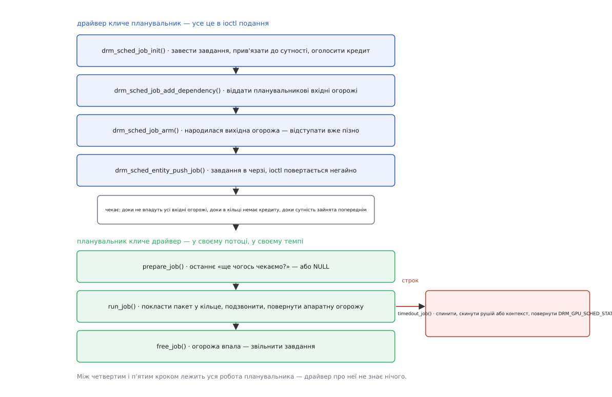

# ⚙️ Драйвер на спільному планувальнику: чотири зворотні виклики

Спільний планувальник `drm_sched` бере на себе черги, залежності, пріоритети й строки, а від драйвера просить уміти рівно одне: покласти пакет у кільце й повідомити, коли залізо його домолотило. Розберімо з робочим кодом, що саме драйвер ініціалізує, як проводить одне завдання від `ioctl` до кільця, які зворотні виклики пише — і в котрому місці цих викликів найлегше підвісити весь робочий стіл.

## Межа відповідальності

Домовленість вузька. Планувальник вирішує **коли**, драйвер знає **як**. Завдання переходить драйверові аж тоді, коли всі його вхідні огорожі впали, у кільці є запас і сутність не зайнята попереднім своїм завданням. Драйвер повертає за це апаратну огорожу — [одноразовий об'єкт dma-fence](topic:sys-unix/dma-fence-sync), який спрацює по закінченні роботи й після цього вже ніколи не зміниться.

Один `drm_gpu_scheduler` заводять **на апаратне кільце**, а не на пристрій. У чипа з окремими рушіями графіки, обчислень, копіювання й відео буде чотири планувальники, кожен зі своїм строком і своєю глибиною.



*Верхня половина належить процесові, що подає; нижня — потокові планувальника, і між ними немає спільного часу.*

## Ініціалізація

```c
#include <drm/gpu_scheduler.h>

struct mygpu_job {
    struct drm_sched_job base;      /* спільна частина — далі container_of */
    struct mygpu_ctx    *ctx;
    struct dma_fence    *hw_fence;  /* та сама, що поверне run_job */
    u64 batch_addr;                 /* адреса пакета в просторі контексту */
    u32 batch_size;
};
#define to_mygpu_job(j) container_of((j), struct mygpu_job, base)

static const struct drm_sched_backend_ops mygpu_sched_ops = {
    .prepare_job  = mygpu_prepare_job,
    .run_job      = mygpu_run_job,
    .timedout_job = mygpu_timedout_job,
    .free_job     = mygpu_free_job,
    .cancel_job   = mygpu_cancel_job,
};

int mygpu_engine_init(struct mygpu_engine *eng)
{
    const struct drm_sched_init_args args = {
        .ops          = &mygpu_sched_ops,
        .credit_limit = MYGPU_RING_SLOTS - 4,  /* менше, ніж уміщає кільце */
        .hang_limit   = 0,                     /* завинив раз — і по всьому */
        .timeout      = msecs_to_jiffies(500),
        .timeout_wq   = eng->dev->reset_wq,    /* окрема черга робіт під скидання */
        .score        = NULL,
        .name         = "mygpu-gfx",
        .dev          = eng->dev->drm.dev,
    };

    return drm_sched_init(&eng->sched, &args);
}
```

`credit_limit` — це не кількість завдань, а сума їхніх ваг: кожне завдання оголошує свій «кредит», і драйвер сам обирає одиницю (найчастіше — скільки слів завдання займе в кільці). Ліміт свідомо ставлять нижчим за фізичну місткість: усе, що вже подзвонило в дзвінок, планувальникові непідвладне, тож надто повне кільце перетворює будь-який пріоритет на побажання.

`timeout` — той самий строк, після якого завдання оголошують простроченим. У живих драйверах його ставлять від сотень мілісекунд до одиниць секунд: коротший зриває чесні, але важкі кадри, довший читається оком як завмирання. `hang_limit` каже, скільки разів завдання може завинити, перш ніж його контекст оголосять зіпсованим; нуль означає «з першого разу».

Окрема черга робіт під строк — не примха. Скидання чекає на залізо й на замки, і йому не можна ділити виконавця з тим, хто подає роботу: інакше рушій, що скидається, спинить подання на всіх інших рушіях.

## Сутність — це контекст

```c
int mygpu_ctx_init(struct mygpu_ctx *ctx, struct mygpu_device *dev)
{
    struct drm_gpu_scheduler *sched_list[] = {
        &dev->gfx[0].sched, &dev->gfx[1].sched,   /* однакові рушії */
    };

    return drm_sched_entity_init(&ctx->entity, DRM_SCHED_PRIORITY_NORMAL,
                                 sched_list, ARRAY_SIZE(sched_list),
                                 &ctx->guilty);
}

void mygpu_ctx_fini(struct mygpu_ctx *ctx)
{
    drm_sched_entity_destroy(&ctx->entity);  /* flush, а потім fini */
    mygpu_vm_put(ctx->vm);                   /* аж тепер можна віддавати решту */
}
```

Сутність — це вся присутність контексту в планувальнику: послідовна черга, чий порядок гарантовано збігається з порядком подання. Пріоритетів чотири — `KERNEL`, `HIGH`, `NORMAL`, `LOW`; найвищий призначений для внутрішньої роботи самого драйвера, а не для охочих із простору користувача, і роздавати його за проханням не можна.

Кілька планувальників у `sched_list` означають розподіл між однаковими рушіями: у мить, коли сутність порожня, планувальник переставить її на найменш завантажений — а порівнює він їх за полем `score`, лічильником накопиченої на планувальнику роботи. Останній аргумент — та комірка, у яку планувальник запише одиницю, визнавши цей контекст винним у зависанні.

`drm_sched_entity_destroy` — це `flush` плюс `fini`. Перша половина чекає, поки чергу розберуть, і повертає помилку, якщо процес убито: убитому далі нічого класти в чергу не дадуть. Друга — розбирає саму сутність. Порядок тут важить більше, ніж здається: усе, на що сутність посилається, має пережити її знищення.

## Життєвий цикл завдання

```c
int mygpu_submit_ioctl(struct drm_device *drm, void *data, struct drm_file *file)
{
    struct drm_mygpu_submit *args = data;
    struct mygpu_ctx *ctx = mygpu_ctx_lookup(file, args->ctx_id);
    struct mygpu_job *job;
    struct dma_fence *out_fence;
    unsigned int i;
    int ret;

    if (atomic_read(&ctx->guilty))
        return -ECANCELED;                 /* контекст утрачено, беруть новий */

    job = kzalloc(sizeof(*job), GFP_KERNEL);
    if (!job)
        return -ENOMEM;
    job->ctx = ctx;

    ret = drm_sched_job_init(&job->base, &ctx->entity,
                             mygpu_credits(args), file->driver_priv,
                             file->client_id);
    if (ret)
        goto err_free;

    for (i = 0; i < args->num_in_fences; i++) {
        struct dma_fence *in = mygpu_in_fence_get(file, args, i);

        if (IS_ERR(in)) { ret = PTR_ERR(in); goto err_cleanup; }

        /* Забирає посилання назавжди — і коли вдалося, і коли ні. */
        ret = drm_sched_job_add_dependency(&job->base, in);
        if (ret)
            goto err_cleanup;
    }

    job->batch_addr = args->batch_addr;
    job->batch_size = args->batch_size;
    ret = mygpu_reserve_ring_slot(ctx->ring, job);   /* усе, що знадобиться потім */
    if (ret)
        goto err_cleanup;

    mutex_lock(&ctx->lock);
    drm_sched_job_arm(&job->base);                   /* точка неповернення */
    out_fence = dma_fence_get(&job->base.s_fence->finished);
    drm_sched_entity_push_job(&job->base);
    mutex_unlock(&ctx->lock);

    ret = mygpu_out_fence_export(file, args, out_fence);
    dma_fence_put(out_fence);
    return ret;

err_cleanup:
    drm_sched_job_cleanup(&job->base);
err_free:
    kfree(job);
    return ret;
}
```

Три речі в цьому коді неочевидні.

**`arm` — точка неповернення.** До нього завдання ще нічиє: його можна кинути, звільнивши руками. Після нього завдання має номер у послідовності, а його вихідна огорожа вже роздана назовні — і хтось на неї, можливо, вже чекає. Ядро формулює це просто: після `drm_sched_job_arm()` подання **обов'язкове**, іншого виходу немає.

**`arm` і `push_job` — під одним замком.** Номер огорожі роздає перший, місце в черзі дає другий, і ці два порядки мусять збігатися. Два потоки, що подають в один контекст, без замка легко переплутають їх місцями — і тоді огорожа з меншим номером спрацює пізніше за більший, а на цьому впорядкуванні тримаються всі, хто порівнює огорожі однієї сутності за номером, не чекаючи їх.

**Пам'ять виділяють тут, а не потім.** `drm_sched_job_add_dependency` спокійно бере `GFP_KERNEL` — і має на це право саме тому, що огорожі ще немає назовні. Усе, що знадобиться пізніше, у `run_job` чи в скиданні, теж треба взяти зараз: слот у кільці, об'єкт огорожі, буфери під стан. Причина — у наступному розділі.

## Чотири зворотні виклики

```c
/* 1. Останнє «ще чогось чекаємо?». NULL означає «можна пускати». */
static struct dma_fence *mygpu_prepare_job(struct drm_sched_job *sched_job,
                                           struct drm_sched_entity *entity)
{
    struct mygpu_job *job = to_mygpu_job(sched_job);

    return mygpu_vm_pending_fence(job->ctx->vm);  /* сторінкові таблиці ще пишуться */
}

/* 2. Покласти в кільце й віддати апаратну огорожу. */
static struct dma_fence *mygpu_run_job(struct drm_sched_job *sched_job)
{
    struct mygpu_job *job = to_mygpu_job(sched_job);
    struct dma_fence *hw;

    if (sched_job->s_fence->finished.error || atomic_read(&job->ctx->guilty))
        return NULL;                 /* після скидання нічого не пускаємо */

    hw = mygpu_ring_emit(job->ctx->ring, job->batch_addr, job->batch_size);
    if (IS_ERR(hw))
        return hw;                   /* завдання спрацює з цією помилкою */

    job->hw_fence = hw;              /* наше посилання — до free_job */
    return dma_fence_get(hw);        /* друге — планувальникові, він його поверне */
}

/* 3. Строк вийшов. */
static enum drm_gpu_sched_stat mygpu_timedout_job(struct drm_sched_job *sched_job)
{
    struct mygpu_job *job = to_mygpu_job(sched_job);
    struct drm_gpu_scheduler *sched = sched_job->sched;

    /* Може, воно не зависло, а лише повільне: лічильник рушія посувається. */
    if (mygpu_ring_progressing(job->ctx->ring))
        return DRM_GPU_SCHED_STAT_NO_HANG;

    drm_sched_stop(sched, sched_job);          /* спинити подання на цьому рушії */
    atomic_set(&job->ctx->guilty, 1);          /* контекст утрачено назавжди */

    if (mygpu_reset_context(job->ctx) < 0 &&   /* спершу пробуємо вузьке скидання */
        mygpu_reset_engine(job->ctx->ring) < 0) {
        drm_sched_start(sched, -ENODEV);
        return DRM_GPU_SCHED_STAT_ENODEV;      /* залізо не піднялося */
    }

    drm_sched_start(sched, -ECANCELED);        /* зняті завдання падають з помилкою */
    return DRM_GPU_SCHED_STAT_RESET;
}

/* 4. Прибрати за завданням. */
static void mygpu_free_job(struct drm_sched_job *sched_job)
{
    struct mygpu_job *job = to_mygpu_job(sched_job);

    dma_fence_put(job->hw_fence);
    drm_sched_job_cleanup(sched_job);   /* огорожі, масив залежностей */
    kfree(job);
}
```

Посилання на огорожу з `run_job` рахуються окремо: одне забирає планувальник і сам віддає, друге лишається драйверові до `free_job`. Взяти одне на двох — і огорожа зникне з-під ніг у того, хто ще на неї дивиться; про механіку таких лічильників — [окрема тема](topic:sf-lang/reference-counting).

## Правило, у якому найлегше помилитися

Від `arm` і до миті, коли огорожа спрацює, драйвер перебуває всередині **критичної секції сигналювання**. У ній заборонено рівно те, що виглядає найбезневиннішим: виділяти пам'ять із `GFP_KERNEL`, брати замки, які беруть виділювачі, чекати на будь-що з простору користувача.

Причина — коло. Виділення пам'яті, не знайшовши вільної, кличе [витіснення сторінок](topic:sys-unix/swap-and-reclaim), а витіснення просить драйвери віддати кеші й буфери, і ті чекають на огорожі. Отже, шлях «виділити пам'ять» веде до «зачекати на огорожу». Якщо тепер сама огорожа спрацює лише після виділення пам'яті, коло замкнулося, і система стоїть — це класичне [взаємне блокування](topic:sf-tasks/deadlock), тільки складене з двох підсистем, що ніколи не бачили одна одної.

> 🔧 **Навіщо це.** Ядро дає позначки `dma_fence_begin_signalling()` і `dma_fence_end_signalling()`. Вони нічого не роблять — лише розповідають [перевірці замків](topic:sys-unix/kernel-locking) про залежність, якої вона інакше не побачила б, бо два її кінці лежать у різних драйверах. Розставте їх у `run_job` і в шляху скидання — і коло вилізе на тестовому стенді як сварка в журналі, а не в полі як мертвий екран у користувача. Про самі [прапорці виділення пам'яті](topic:sys-unix/allocator-and-kernel) варто пам'ятати тут окремо: `GFP_ATOMIC` не чекає нікого, але й береться з малого запасу, тож правильна відповідь майже завжди — виділити заздалегідь.

## Чому повторне подання визнали хибним

Після скидання спокуса очевидна: зняти з мертвого кільця чужі, невинні завдання й подати їх ще раз. Так і зробили в amdgpu, і саме звідти в коді планувальника лишився коментар — це виявилося дешевим способом, що погано працює.

Невинність тих завдань удавана. Друге завдання контексту зазвичай читає те, що написало перше; коли перше загинуло посеред роботи, його пам'ять — сміття, і повторний запуск другого дасть не відсутній результат, а хибний. Далі: повторне подання відбувається у шляху скидання, тобто всередині тієї самої критичної секції, де не можна ні виділяти, ні замикати — а подання без цього не обходиться. І врешті, подане вдруге завдання може зависнути знову, зі строком, відлік якого почався з нуля.

Тому сучасне правило інше: скидання вбиває все, що вже дійшло до заліза, кожна зачеплена огорожа спрацьовує **з помилкою**, винний контекст помічають утраченим, а невинні контексти просто подають далі — їхні завдання, які ще не встигли в кільце, нікуди не поділися.

## Пастки

**Витік завдань.** `free_job` кличуть лише для тих завдань, які планувальник узяв. Завдання, що пройшло `drm_sched_job_init`, але полягло дорогою до `arm`, драйвер звільняє власноруч через `drm_sched_job_cleanup` — і ядро вимагає цього прямо. Друга половина тієї самої пастки — вивантаження модуля: `drm_sched_fini` не звільняє того, що досі висить у черзі. Саме для цього є п'ятий, необов'язковий на вигляд виклик `cancel_job`: без нього при вивантаженні течуть завдання, а їхні огорожі не спрацьовують ніколи.

**Сутність, що переживає процес.** Сутність тримає вказівники на контекст, адресний простір, кільце — а все це вмирає разом із дескриптором файла. Знищувати треба в зворотному порядку й неодмінно через `drm_sched_entity_destroy`, який спершу дочекається черги. Звільнити контекст, поки планувальник іще може взяти з нього завдання, — це не витік, це читання звільненої пам'яті в чужому потоці.

**Огорожа, що не впала після скидання.** Найгірша з трьох, бо мовчазна. Шлях скидання загубив завдання, чию огорожу вже ніхто не просигналить, — і композитор чекає на неї вічно. Екран завмирає, а причина лежить за кілометр від симптому: у драйвері, що скинувся начебто успішно. Звідси єдине правило, з якого не буває винятків: кожна огорожа, що пережила `arm`, мусить урешті спрацювати — хай із помилкою, хай із `-ECANCELED`, але спрацювати.
