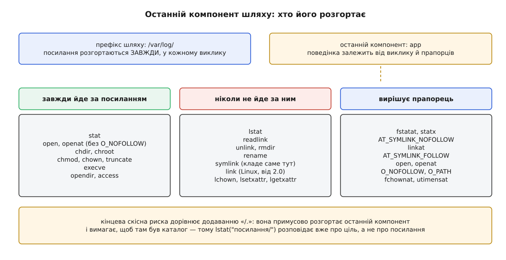

# 📋 Системні виклики для імен і посилань

Це контракт, за яким програма створює, читає, переносить і прибирає **імена** файлів: сигнатури, прапорці, точна семантика кожного з них і таблиця кодів помилок із причиною кожного. Тут немає жодної операції над даними файлу — усе, що нижче, чіпає лише рядки в каталогах, лічильники в inode й текст усередині символьних посилань.

## Останній компонент вирішує все

Будь-який шлях ділиться на дві нерівноправні частини — префікс і останній компонент. У префіксі (`/var/log/` у шляху `/var/log/app`) символьні посилання розгортаються **завжди**, у кожному без винятку виклику: інакше ядро просто не дійшло б до кінця шляху. А от що робити з **останнім** компонентом, вирішує сам виклик — і саме тут лежить уся різниця між `stat` і `lstat`.



*Три групи викликів і одне джерело плутанини: типове поводження в кожній групі своє, тож прапорець в одній вимикає розгортання, а в іншій — вмикає.*

Історично цю різницю виражали **іменем виклику**: префікс `l-` означає «не йди за посиланням» — `lstat`, `lchown`, `lgetxattr`, `lsetxattr`, `llistxattr`, `lremovexattr`. Коли ж з'явилося [сімейство *at](topic:sys-unix/at-family-syscalls) — виклики, що беруть шлях відносно дескриптора каталогу, — плодити нові назви перестали й додали прапорці. Тепер один виклик робить обидві роботи, і треба лише знати, від чого він відштовхується:

| Виклик | Типове поводження з останнім компонентом | Прапорець, що його перемикає |
|---|---|---|
| `fstatat`, `statx` | іде за посиланням | `AT_SYMLINK_NOFOLLOW` — не йти |
| `fchownat`, `utimensat`, `faccessat` | іде за посиланням | `AT_SYMLINK_NOFOLLOW` — не йти |
| `openat` | іде за посиланням | `O_NOFOLLOW` — не йти (помилка `ELOOP`) |
| `linkat` | **не** йде за посиланням | `AT_SYMLINK_FOLLOW` — таки йти |
| `unlinkat`, `renameat` | **не** йде за посиланням | немає — і не буде |

Асиметрія не примхлива: `stat` мусить типово розповідати про ціль, бо саме цього хоче 99 % коду, а `link` мусить типово копіювати саме посилання, бо жорстке посилання на щойно розгорнуту ціль — майже завжди не те, що малося на увазі. Тому в першому випадку прапорець вимикає розгортання, а в другому — вмикає.

### Кінцева скісна риска

Шлях, що закінчується на `/`, рівносильний тому самому шляху з доданим `/.`: розбір шляху вимагає, щоб останній компонент **існував і був каталогом**. Наслідок несподіваний: скісна риска примусово розгортає посилання навіть у викликах, які самі за ним не йдуть.

```
lstat("посилання")     → розповідає про саме посилання
lstat("посилання/")    → розгортає його й розповідає про каталог-ціль
                          (ENOTDIR, якщо ціль — не каталог)
open("посилання/")     → ENOTDIR, якщо ціль — звичайний файл
unlink("посилання/")   → помилка: unlink каталогів не прибирає
""                     → ENOENT (порожній шлях більше не означає «тут»)
```

Одне місце в Linux випадає з цієї схеми: `rmdir("посилання/")` повертає `ENOTDIR`, а не прибирає каталог-ціль, — Linux не розгортає посилання в `rmdir` навіть із рискою, тоді як інші системи розгортають. POSIX цей випадок лишає за реалізацією, тож покладатися на нього не варто взагалі.

## Створити ім'я

```c
#include <unistd.h>
int link(const char *oldpath, const char *newpath);
int symlink(const char *target, const char *linkpath);

#include <fcntl.h>   /* AT_* */
int linkat(int olddirfd, const char *oldpath,
           int newdirfd, const char *newpath, int flags);
int symlinkat(const char *target, int newdirfd, const char *linkpath);
```

`link` додає в каталог другий рядок із номером уже наявного inode й збільшує `st_nlink` на одиницю. Три речі, які треба знати напам'ять:

- **`newpath` ніколи не перезаписується.** Якщо ім'я зайняте — `EEXIST`, і жодного прапорця «перезаписати» не існує. Це не недогляд, а те, на чому тримається безпечне створення файлу-замка.
- **`oldpath` не розгортається** (у Linux — від версії 2.0). `link("посилання", "нове")` дає друге ім'я самому посиланню, а не його цілі. Щоб розгорнути, потрібен `linkat(..., AT_SYMLINK_FOLLOW)`.
- **Каталог заборонено**, і навіть root дістане `EPERM`.

Прапорці `linkat`:

| Прапорець | З якого ядра | Що робить |
|---|---|---|
| `AT_SYMLINK_FOLLOW` | 2.6.18 | розгорнути `oldpath`, якщо це посилання |
| `AT_EMPTY_PATH` | 2.6.39 | `oldpath` — порожній рядок; зв'язати файл, на який дивиться `olddirfd`. Потребує [можливості](topic:sys-unix/capabilities) `CAP_DAC_READ_SEARCH` |

`symlink` створює **новий inode** типу «символьне посилання», всередину якого кладе рядок `target` байт у байт. Рядок не перевіряють, не нормалізують і не приводять до абсолютного: `symlink("../..//x/./y", "s")` збереже саме ці символи. Порожній `target` дає `ENOENT`, надто довгий — `ENAMETOOLONG`, зайнятий `linkpath` — `EEXIST`.

> 🔧 **Навіщо це.** Що `link` не перезаписує ціль — не обмеження, а інструмент. Атомарної заміни жорсткого посилання не існує (`ln -f` усередині робить `unlink` і `link` — між ними є вікно, коли імені немає зовсім), зате є обхід: створити посилання під тимчасовим ім'ям і **перейменувати його поверх** — `rename` перезаписує атомарно. А `link`, що падає з `EEXIST`, сам собою є найстарішим у Unix надійним замком: виклик або створив ім'я, або ні, третього стану немає, і працює це навіть там, де немає `O_EXCL`, — на старих реалізаціях NFS.

Окремо: `fs.protected_hardlinks` (у мейнлайні від ядра 3.6; саме ядро лишає перемикач вимкненим, вмикають його дистрибутиви через `/etc/sysctl.d`) дає `EPERM`, якщо ви не власник вихідного файлу й не маєте на нього прав і на читання, і на запис. Захист від старого трюку, коли непривілейований користувач ставив своє ім'я на чужий setuid-файл, щоб той не зник після оновлення.

## Прочитати посилання

```c
ssize_t readlink(const char *restrict path, char *restrict buf, size_t bufsiz);
ssize_t readlinkat(int dirfd, const char *restrict path,
                   char *restrict buf, size_t bufsiz);
```

Виклик повертає кількість покладених у буфер байтів — і на цьому три пастки поспіль. **Завершального нуля він не додає.** **Обрізання не є помилкою:** якщо збережений шлях довший за `bufsiz`, вам мовчки віддадуть перші `bufsiz` байтів і повернуть саме `bufsiz` — жодного `ENAMETOOLONG`. Тож єдина ознака обрізання — те, що повернене число дорівнює розміру буфера. І **`ENOENT` тут означає «немає самого посилання»**, а не «немає цілі»: `readlink` цілі не торкається взагалі, тому висяче посилання читається чудово.

Розмір буфера підказує `lstat`: для символьного посилання `st_size` — це довжина збереженого рядка. Але на магічних посиланнях `/proc` (`/proc/self/exe`, `/proc/self/fd/N`) `st_size` дорівнює нулю, бо цілі там немає на диску. Тому надійний код не питає розміру, а росте, доки не переконається, що не зрізав:

```c
#include <stdlib.h>
#include <unistd.h>

/* Повертає шлях, завершений нулем; звільняє викликач. NULL — помилка. */
char *read_link(const char *path)
{
    size_t size = 256;
    for (;;) {
        char *buf = malloc(size);
        if (!buf)
            return NULL;
        ssize_t n = readlink(path, buf, size);
        if (n < 0) {            /* errno вже виставлено */
            free(buf);
            return NULL;
        }
        if ((size_t)n < size) { /* влізло з запасом — зрізати не могло */
            buf[n] = '\0';
            return buf;
        }
        free(buf);              /* n == size: могло зрізати, беремо більший */
        size *= 2;
    }
}
```

Із Linux 2.6.39 `readlinkat` приймає порожній шлях: `readlinkat(fd, "", buf, n)`, де `fd` здобуто через `open(path, O_PATH | O_NOFOLLOW)`, читає саме те посилання, на яке цей дескриптор і вказує, — без повторного розбору шляху, а отже без вікна для підміни.

Розгорнути **весь** ланцюжок посилань до кінця системного виклику немає: це робить бібліотечна функція `realpath(3)`, яка ходить шляхом покомпонентно вже в просторі користувача. `realpath(path, NULL)` у glibc сама виділяє пам'ять під результат.

## Дізнатися, що це взагалі

```c
#include <sys/stat.h>
int stat (const char *restrict path, struct stat *restrict st);  /* іде за посиланням */
int lstat(const char *restrict path, struct stat *restrict st);  /* не йде */
int fstat(int fd, struct stat *st);
int fstatat(int dirfd, const char *restrict path,
            struct stat *restrict st, int flags);
int statx(int dirfd, const char *restrict path, int flags,
          unsigned int mask, struct statx *stx);                 /* Linux 4.11 */
```

Для роботи з іменами важать чотири поля:

| Поле | Що в ньому |
|---|---|
| `st_ino` | номер inode — унікальний **усередині своєї файлової системи** |
| `st_dev` | яка це файлова система |
| `st_nlink` | лічильник імен у каталогах |
| `st_mode & S_IFMT` | тип; `S_IFLNK` — символьне посилання (видно лише через `lstat`) |

Звідси одне правило, яке порушують постійно: «це той самий файл» означає збіг **пари** `st_dev` + `st_ino`, ніколи не самого `st_ino`. У двох змонтованих файлових системах номери нумеруються незалежно, тож однакові `st_ino` там — річ буденна.

Для посилання `lstat` дає `st_size`, що дорівнює довжині цілі в байтах (без нуля), і `st_nlink`, що стосується самого посилання, а не цілі.

## Прибрати ім'я

```c
#include <unistd.h>
int unlink(const char *path);
int rmdir (const char *path);

#include <fcntl.h>
int unlinkat(int dirfd, const char *path, int flags);  /* AT_REMOVEDIR */
```

`unlink` викреслює рядок із каталогу й зменшує `st_nlink`. Каталоги він не чіпає (`EISDIR`), за посиланнями не йде — прибирає саме посилання, навіть якщо ціль існує.

`rmdir` прибирає **порожній** каталог: усе, крім `.` і `..`, дає `ENOTEMPTY`. За посиланням не йде: `rmdir("посилання-на-каталог")` — це `ENOTDIR`.

Окремого `rmdirat` не існує — його роботу перебрав прапорець: `unlinkat(dirfd, name, AT_REMOVEDIR)` поводиться точно як `rmdir`, `unlinkat(dirfd, name, 0)` — точно як `unlink`. Будь-яке інше значення `flags` дає `EINVAL`. Саме тому обхід дерева з видаленням (`rm -r`, `nftw` з `FTW_DEPTH`) обходиться одним дескриптором каталогу й одним викликом на елемент, не збираючи щоразу повного шляху.

Дві перепони, що дають `EPERM` і збивають з пантелику, бо не стосуються прав на сам файл:

- **[Біт sticky](topic:sys-unix/permission-bits) на каталозі** (`/tmp`, `/var/tmp`): прибрати чи перейменувати запис може лише власник запису, власник каталогу або привілейований процес. Без цього будь-хто стирав би чужі файли в спільній теці, маючи право запису в саму теку.
- **Атрибути `immutable` й `append-only`** (`chattr +i`, `+a`): на такий файл не можна ні поставити нове ім'я, ні прибрати наявне.

## Перенести ім'я

```c
#include <stdio.h>
int rename(const char *oldpath, const char *newpath);

#include <fcntl.h>
int renameat (int olddirfd, const char *oldpath,
              int newdirfd, const char *newpath);
int renameat2(int olddirfd, const char *oldpath,
              int newdirfd, const char *newpath,
              unsigned int flags);            /* Linux 3.15, glibc 2.28 */
```

`rename` переносить рядок у межах **однієї** файлової системи (інакше `EXDEV`) і, якщо `newpath` уже зайняте, **атомарно** його витісняє: сторонній процес, який заглянув за іменем `newpath` будь-якої миті, побачить або старий вміст, або новий, але ніколи не побачить порожнього місця. На цьому стоїть [атомарна заміна файлу](topic:sf-data/atomic-file-replace) — єдиний надійний спосіб оновити файл, який хтось паралельно читає.

Атомарність не є довговічністю. Щоб заміна пережила зникнення живлення, треба `fsync` на дескрипторі файлу **перед** перейменуванням і `fsync` на дескрипторі каталогу **після** ([кеш сторінок і довговічність](topic:sys-unix/page-cache-durability)).

Правила для каталогів: `oldpath`-каталог можна перенести лише на неіснуюче ім'я або на порожній каталог; спроба зробити каталог власним підкаталогом дає `EINVAL`; `.` і `..` як аргументи — теж `EINVAL`. Символьне посилання переноситься як звичайний файл: розгортання не відбувається, з місця на місце їде сам файл-посилання зі своїм текстом усередині.

Прапорці `renameat2` (комбінувати їх між собою не можна):

| Прапорець | З якого ядра | Що робить |
|---|---|---|
| `RENAME_NOREPLACE` | 3.15 (ext4); tmpfs, btrfs, cifs — 3.17; XFS — 4.0; більшість решти — 4.9 | не витісняти наявне `newpath`, а повернути `EEXIST` |
| `RENAME_EXCHANGE` | 3.15 | атомарно поміняти два наявні імені місцями; типи можуть відрізнятися |
| `RENAME_WHITEOUT` | 3.18 (tmpfs, ext4); XFS — 4.1; f2fs — 4.2; btrfs — 4.7 | перенести й лишити на старому місці «забіловку» — запис, що ховає однойменний файл нижнього шару в [об'єднаній файловій системі](topic:sys-unix/overlay-filesystems). Потребує `CAP_MKNOD` |

Двох речей тут легко не помітити. По-перше, підтримка прапорця залежить не лише від ядра, а й від **конкретної** файлової системи, і брак підтримки видно як `EINVAL` або `EOPNOTSUPP` — не як «зроблено без прапорця». По-друге, обгортка в glibc з'явилася лише у версії 2.28, тож переносний код кличе виклик номером. Разом це означає, що `RENAME_NOREPLACE` завжди пишуть із запасним шляхом:

```c
#define _GNU_SOURCE
#include <errno.h>
#include <fcntl.h>
#include <unistd.h>
#include <sys/syscall.h>

/* У glibc до 2.28 константи немає в жодному з цих заголовків. */
#ifndef RENAME_NOREPLACE
#define RENAME_NOREPLACE (1 << 0)
#endif

/* Перейменувати, НЕ витісняючи ціль. 0 — успіх, -1 і errno — ні. */
int rename_noreplace(const char *old, const char *new)
{
#ifdef SYS_renameat2
    if (syscall(SYS_renameat2, AT_FDCWD, old, AT_FDCWD, new,
                RENAME_NOREPLACE) == 0)
        return 0;
    if (errno != ENOSYS && errno != EINVAL && errno != EOPNOTSUPP)
        return -1;              /* справжня помилка, не брак підтримки */
#endif
    /* Запасний шлях без renameat2: жорстке посилання не витісняє ніколи,
       тож EEXIST від link() дає рівно ту саму відмову. Не атомарно
       як ціле — між link і unlink файл видно під двома іменами, —
       але цілі під іменем new не підміняє. */
    if (link(old, new) < 0)
        return -1;              /* EEXIST, якщо ім'я зайняте */
    return unlink(old);
}
```

## Файл, якому ім'я дають наприкінці

`O_TMPFILE` (Linux 3.11) створює inode **з нульовим лічильником імен**: файл є, місце під нього виділяється, а в жодному каталозі на нього нема рядка. Шлях в `open` називає не файл, а каталог — точніше, лише вказує, у якій файловій системі народитися новому inode.

```c
#define _GNU_SOURCE
#include <fcntl.h>
#include <stdio.h>
#include <unistd.h>

int fd = open("/var/lib/app", O_TMPFILE | O_RDWR, 0600);
/* … пишемо в fd скільки треба; файл ніде не видно … */

char proc[64];
snprintf(proc, sizeof proc, "/proc/self/fd/%d", fd);
linkat(AT_FDCWD, proc, AT_FDCWD, "/var/lib/app/data.bin", AT_SYMLINK_FOLLOW);
```

Чому саме так. `/proc/self/fd/N` — магічне посилання ([псевдо-ФС](topic:sys-unix/pseudo-filesystems)), і `linkat` типово за посиланнями не йде, тож без `AT_SYMLINK_FOLLOW` виклик спробував би зв'язати саме посилання й нічого доброго не вийшло б. Привілейований процес може обійтися без `/proc` зовсім: `linkat(fd, "", AT_FDCWD, шлях, AT_EMPTY_PATH)` — але це вимагає `CAP_DAC_READ_SEARCH`. І окремо: `O_EXCL` разом з `O_TMPFILE` має **протилежне звичному** значення — він назавжди забороняє давати цьому файлові ім'я.

Підтримка з'явилася нерівномірно: ext2/3/4, UDF, minix і tmpfs — від 3.11, XFS — 3.15, Btrfs і F2FS — 3.16, ubifs — 4.9. Брак підтримки видно як `EOPNOTSUPP`.

## Не дати підмінити шлях під ногами

Кожен виклик, що бере **текст** шляху, розбирає його наново, тому між двома вашими викликами будь-який компонент може стати посиланням кудись інде. Ядро дає чотири засоби проти цього.

`O_NOFOLLOW`: якщо останній компонент виявився символьним посиланням, `open` не йде за ним, а падає з `ELOOP`. Посилання в префіксі шляху це не зупиняє.

`O_PATH` (Linux 2.6.39): дескриптор-**місце**, а не відкритий файл. Читати й писати через нього не можна (`EBADF`), зате він годиться як `dirfd` для всіх викликів `*at`, передається іншому процесу через `SCM_RIGHTS`, і — головне — не потребує жодних прав на сам об'єкт, лише права проходу через каталоги префікса. Разом з `O_NOFOLLOW` дає [дескриптор](topic:sys-unix/file-descriptor) на саме посилання, придатний для `readlinkat`, `fstatat` і `fchownat` із порожнім шляхом.

Звідси головний прийом безпечної роботи з чужими шляхами: не перевіряти шлях текстом, а йти покомпонентно через `openat`, тримаючи дескриптор поточного каталогу. Дескриптор указує на inode й не залежить від того, що зробили з іменами після його здобуття, — а отже, [гонки між перевіркою й використанням](topic:sf-security/toctou-race) просто немає де виникнути.

`openat2` (Linux 5.6; обгортки в glibc немає, кличуть через `syscall`) робить те саме одним викликом. Замість прапорців він бере структуру `open_how`, а в ній поле `resolve`:

| Прапорець `resolve` | Що забороняє | Помилка |
|---|---|---|
| `RESOLVE_NO_SYMLINKS` | будь-яке посилання будь-де в шляху | `ELOOP` |
| `RESOLVE_BENEATH` | вихід за межі `dirfd` — через `..`, абсолютний шлях або посилання | `EXDEV` |
| `RESOLVE_IN_ROOT` | те саме, але `dirfd` править за корінь: `/` усередині шляху означає його | `EXDEV` |
| `RESOLVE_NO_MAGICLINKS` | магічні посилання `/proc` | `ELOOP` |
| `RESOLVE_NO_XDEV` | перетин точки монтування | `EXDEV` |

І два системні вимикачі, наявні в ядрі від 3.6 й увімкнені типово в сучасних дистрибутивах (саме ядро лишає обидва вимкненими), які прибирають найтиповіші атаки без жодних змін у програмах: `fs.protected_symlinks` (у каталозі з бітом sticky за посиланням не йдуть, якщо власник посилання не збігається ні з тим, хто йде, ні з власником каталогу) і `fs.protected_hardlinks` (описаний вище).

## Коди помилок

Усі виклики повертають `-1` і виставляють `errno` ([як їх читати](topic:sf-apps/errno)). Головні коди й **причина** кожного:

| Код | Де трапляється | Чому |
|---|---|---|
| `EXDEV` | `link`, `rename` | кінці на різних файлових системах: номер inode має сенс лише в своїй. Для `openat2` — ще й спроба вийти за межу при `RESOLVE_BENEATH`/`RESOLVE_IN_ROOT` |
| `EPERM` | `link`, `unlink`, `rename` | `oldpath` — каталог; біт sticky на каталозі; `immutable`/`append-only`; `fs.protected_hardlinks`; брак `CAP_MKNOD` для `RENAME_WHITEOUT`; файлова система жорстких посилань не має |
| `EMLINK` | `link`, `rename` | лічильник імен уперся в стелю: 65 000 на ext4, 65 535 на Btrfs |
| `ELOOP` | будь-який шлях | понад 40 переходів за посиланнями на один розбір; або `O_NOFOLLOW`/`RESOLVE_NO_SYMLINKS` на посиланні |
| `ENOENT` | будь-який шлях | компонента префікса немає; посилання висяче; порожній рядок шляху; `target` у `symlink` порожній |
| `EEXIST` | `link`, `symlink`, `mkdir`, `rename` з `RENAME_NOREPLACE` | ім'я вже зайняте, а перезапис тут не передбачено |
| `ENOTEMPTY` | `rmdir`, `rename` | каталог-ціль містить щось, крім `.` і `..` |
| `EISDIR` | `unlink`, `rename` | ціль — каталог, а джерело чи виклик каталогів не приймає |
| `ENOTDIR` | будь-який шлях | компонент префікса не каталог; `rmdir` на посиланні; кінцева `/` на не-каталозі |
| `EINVAL` | `unlinkat`, `renameat2` | недозволене значення `flags`; каталог у власний підкаталог; `.` або `..` як аргумент; прапорець, якого ця файлова система не підтримує |
| `EACCES` | будь-який шлях | немає права запису в каталог або права проходу через префікс |
| `EBUSY` | `rename`, `rmdir` | ім'я зайняте системою: точка монтування або чийсь поточний каталог |
| `ENOSPC` | `link`, `symlink`, `rename` | у каталозі немає місця під новий рядок |
| `EROFS` | усі, що пишуть | файлова система змонтована лише для читання |
| `EDQUOT` | `link`, `symlink` | вичерпано дискову квоту користувача |
| `ENAMETOOLONG` | будь-який шлях | компонент довший за `NAME_MAX` або шлях довший за `PATH_MAX` |
| `EBADF` | усе сімейство `*at` | `dirfd` не дескриптор каталогу (або дескриптор `O_PATH` там, де потрібен справжній) |
| `ENOSYS`, `EOPNOTSUPP` | `renameat2`, `openat2`, `O_TMPFILE` | виклику немає в цьому ядрі або можливості немає в цій файловій системі — потрібен запасний шлях |

Останній рядок варто читати як правило, а не як виняток: усе, що з'явилося після 3.11, треба вміти не отримати. Ядро й файлова система — різні межі підтримки, і перевіряються вони лише спробою.
