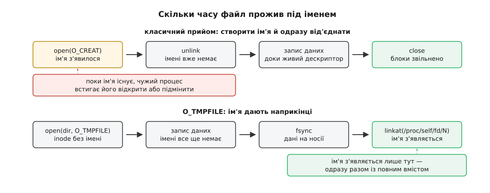

# ⚙️ Дослід із двома лічильниками

Тут дві невеликі програми на C, які не переказують правило про два лічильники, а перевіряють його приладами: перша заводить файл, дає йому друге ім'я, знімає обидва при відкритому дескрипторі — і на кожному кроці друкує три числа, серед них те саме «вільно на диску», яке в цій ситуації відмовляється зменшуватися. Друга проходить той самий шлях навпаки: створює inode, у якого імені немає від народження, і дає ім'я аж наприкінці, коли вміст уже повний. Разом вони показують, що ім'я й файл справді живуть окремо, — і, що важливіше, показують, у які саме моменти система міняє думку про зайняте місце.

## Що саме треба зловити

Твердження, яке ми перевіряємо, звучить точно: **блоки файлу лишаються зайнятими, доки більший за нуль хоч один із двох лічильників** — кількість імен у каталогах або кількість відкритих описів файлу. Із нього виводяться два спостережувані наслідки, і обидва контрінтуїтивні:

```
знято ВСІ імена, дескриптор відкритий  →  вільного місця НЕ побільшало
закрито дескриптор, імен і так не було →  вільного місця побільшало рівно на розмір файлу
```

Щоб це побачити, замало дивитися на один прилад. Треба одночасно тримати в кадрі три різні числа з трьох різних джерел і звіряти їх на кожному кроці. Саме розбіжність між ними — уся суть досліду: `stat` каже, що імен нуль, а `df` каже, що місце зайняте, і **обидва праві**.

## Три прилади й одне правило вимірювання

**Лічильник імен — `fstat(fd, &st)`, поле `st_nlink`.** Тут принципово, що ми питаємо через *дескриптор*, а не через шлях: коли імен уже нуль, шляху просто не існує, і `stat("шлях", …)` повернув би `ENOENT`. Дескриптор веде до inode безпосередньо, тож він єдиний, хто здатен розповісти про файл, у якого імен немає. Заразом беремо `st_ino` — щоб бачити, що inode протягом усього досліду **той самий**, і `st_blocks` — скільки блоків приписано цьому inode. Одиниця `st_blocks` у Linux зафіксована: 512 байтів, незалежно від розміру блока файлової системи.

**Лічильник вільного місця — `statvfs(каталог, &vfs)`.** Це той самий виклик, яким користується `df`; звертаючись напряму, ми прибираємо з картини і форматування, і округлення, і будь-які підозри на кешування в самій команді. Тут є одна пастка, через яку дослід легко зіпсувати. У структурі два лічильники вільного: `f_bfree` — скільки блоків справді вільні, і `f_bavail` — скільки з них дозволено зайняти звичайному користувачеві. Другий менший, бо ext4 віднімає резерв для root (типово 5 % обсягу) і власний внутрішній резерв. Для досліду нам потрібне сире `f_bfree`, інакше ми міряли б квоту, а не місце. І множити на розмір блока треба на `f_frsize`, а не на `f_bsize`: у POSIX лічильники блоків виражені саме у `f_frsize`.

**Доступність даних — `pread(fd, …)`.** Файл, у якого нуль імен, має лишитися придатним для читання. Це не окрема примха, а перевірка того самого твердження з іншого боку: якщо блоки зайняті, то в них лежить наш вміст, а не сміття.

Далі — правило, без якого числа стрибатимуть. Перед кожним відліком вільного місця програма викликає `sync()`. Причина в тому, що запис у файл не означає запису на носій: дані спершу лягають у кеш сторінок, і момент, коли файлова система насправді відведе під них блоки, вирішує вона сама ([кеш сторінок і довговічність](topic:sys-unix/page-cache-durability) — про те, коли записане стає записаним по-справжньому). Ext4, треба віддати належне, у своєму `statfs` це враховує: вона віднімає від вільних блоків ті, що вже пообіцяні відкладеному записові. Але покладатися на це не варто — інші файлові системи не зобов'язані так робити, і дослід має міряти механізм, а не особливість однієї реалізації. Точковий і дешевший варіант того самого — `syncfs(fd)`, який синхронізує лише ту файлову систему, де лежить `fd`.

## Програма

```c
/* two-counters.c — обидва лічильники файлу на власні очі.
   збірка: cc -O2 -Wall -Wextra -o two-counters two-counters.c
   запуск: ./two-counters /каталог/на/справжньому/диску            */
#define _GNU_SOURCE
#include <errno.h>
#include <fcntl.h>
#include <stdio.h>
#include <stdlib.h>
#include <string.h>
#include <sys/stat.h>
#include <sys/statvfs.h>
#include <unistd.h>

#define MIB     (1024ULL * 1024ULL)
#define PAYLOAD (64ULL * MIB)

static void die(const char *what) { perror(what); exit(1); }

/* Скільки байтів файлова система вважає вільними.
   f_bfree — сирі вільні блоки; f_bavail менший на резерв для root
   і на внутрішній резерв ext4, тож для досліду потрібен f_bfree.
   Одиниця лічильників блоків — f_frsize, а не f_bsize.           */
static unsigned long long free_bytes(const char *dir)
{
    struct statvfs vfs;
    if (statvfs(dir, &vfs) != 0) die("statvfs");
    return (unsigned long long) vfs.f_bfree * vfs.f_frsize;
}

static void report(int step, const char *stage, int fd, const char *dir)
{
    sync();                    /* інакше відлік залежить від того, що
                                  система ще не встигла записати */
    if (fd < 0) {
        printf("%d) ino=%-9s nlink=%-2s blocks=%-9s вільно=%6llu МіБ   %s\n",
               step, "-", "-", "-", free_bytes(dir) / MIB, stage);
        fflush(stdout);
        return;
    }

    struct stat st;
    if (fstat(fd, &st) != 0) die("fstat");
    printf("%d) ino=%-9llu nlink=%-2lu blocks=%-9llu вільно=%6llu МіБ   %s\n",
           step, (unsigned long long) st.st_ino, (unsigned long) st.st_nlink,
           (unsigned long long) st.st_blocks, free_bytes(dir) / MIB, stage);

    /* Який шлях ядро зараз приписує цьому дескрипторові. */
    char self[64], seen[4096];
    snprintf(self, sizeof self, "/proc/self/fd/%d", fd);
    ssize_t n = readlink(self, seen, sizeof seen - 1);
    if (n >= 0) { seen[n] = '\0'; printf("   %s → %s\n", self, seen); }
    fflush(stdout);
}

/* write() має право записати менше, ніж просили, — дописуємо решту. */
static void write_all(int fd, const char *p, size_t n)
{
    while (n > 0) {
        ssize_t k = write(fd, p, n);
        if (k < 0) { if (errno == EINTR) continue; die("write"); }
        p += k;
        n -= (size_t) k;
    }
}

int main(int argc, char **argv)
{
    const char *dir = (argc > 1) ? argv[1] : ".";
    char a[4096], b[4096];
    snprintf(a, sizeof a, "%s/counters-a.dat", dir);
    snprintf(b, sizeof b, "%s/counters-b.dat", dir);

    report(0, "до початку", -1, dir);

    int fd = open(a, O_RDWR | O_CREAT | O_EXCL, 0600);
    if (fd < 0) die(a);

    /* Псевдовипадкові байти, а не нулі й не однаковий символ: на ФС зі
       стисненням одноманітний вміст майже не займе місця — і міряти
       буде нічого.                                                  */
    static char buf[1 << 20];
    unsigned long long s = 88172645463325252ULL;      /* xorshift64 */
    for (size_t i = 0; i < sizeof buf; i++) {
        s ^= s << 13; s ^= s >> 7; s ^= s << 17;
        buf[i] = (char) s;
    }
    memcpy(buf, "TWO-COUNTERS", 12);                  /* впізнаваний початок */

    for (unsigned long long done = 0; done < PAYLOAD; done += sizeof buf)
        write_all(fd, buf, sizeof buf);
    if (fsync(fd) != 0) die("fsync");

    report(1, "записано 64 МіБ", fd, dir);

    if (link(a, b) != 0) die("link");
    report(2, "додано друге ім'я", fd, dir);

    if (unlink(a) != 0) die("unlink a");
    report(3, "знято перше ім'я", fd, dir);

    if (unlink(b) != 0) die("unlink b");
    report(4, "знято друге ім'я", fd, dir);

    char probe[13] = {0};
    if (pread(fd, probe, 12, 0) != 12) die("pread");
    printf("   через дескриптор читається: %.12s\n", probe);

    if (close(fd) != 0) die("close");
    report(5, "дескриптор закрито", -1, dir);
    return 0;
}
```

Три рішення в цьому коді варті окремого слова, бо кожне закриває спосіб отримати неправильний результат.

По-перше, файл заповнюється псевдовипадковими байтами. Спокуса написати `memset(buf, 'x', …)` велика, але на btrfs зі стисненням чи на ZFS однаковий байт стиснеться майже в ніщо, і різниці у вільному місці не буде видно взагалі — дослід «спростує» правило, якого навіть не торкнувся.

По-друге, ми **пишемо** байти, а не викликаємо `ftruncate` на 64 мебібайти. Друге дало б файл із оголошеним розміром і без жодного відведеного блоку: `st_size` показав би 64 МіБ, `st_blocks` — нуль, вільне місце не змінилося б ([розріджені файли](topic:sys-unix/sparse-files) — файл, у якого діри не займають носія).

По-третє, кожен крок друкує ще й вміст `/proc/self/fd/N`. Це псевдо-файл, у якому ядро тримає шлях, приписаний цьому дескрипторові ([/proc: процеси як файли](topic:sys-unix/proc-reading-process-and-kernel-state)). Він знадобиться нам за мить — щоб спіймати ще одну неправду.

## Що вона друкує

```
0) ino=-         nlink=-  blocks=-         вільно= 48224 МіБ   до початку
1) ino=1442851   nlink=1  blocks=131072    вільно= 48160 МіБ   записано 64 МіБ
   /proc/self/fd/3 → /srv/data/counters-a.dat
2) ino=1442851   nlink=2  blocks=131072    вільно= 48160 МіБ   додано друге ім'я
   /proc/self/fd/3 → /srv/data/counters-a.dat
3) ino=1442851   nlink=1  blocks=131072    вільно= 48160 МіБ   знято перше ім'я
   /proc/self/fd/3 → /srv/data/counters-a.dat (deleted)
4) ino=1442851   nlink=0  blocks=131072    вільно= 48160 МіБ   знято друге ім'я
   /proc/self/fd/3 → /srv/data/counters-a.dat (deleted)
   через дескриптор читається: TWO-COUNTERS
5) ino=-         nlink=-  blocks=-         вільно= 48224 МіБ   дескриптор закрито
```

Читаємо стовпчиками, і кожен розповідає своє.

`ino` не змінюється жодного разу. Ім'я з'явилося, ім'я зникло, ім'я зникло вдруге — inode той самий, номер той самий. Це і є твердження «ім'я не є частиною файлу», записане числом.

`blocks` дорівнює 131072 від першого виміру до останнього: 131072 · 512 = 64 МіБ, рівно стільки, скільки ми записали. Зверніть увагу, що це число живе аж до кроку 4 — inode продовжує володіти блоками навіть тоді, коли жодне ім'я на нього не вказує.

`nlink` — єдине, що взагалі рухається: 1 → 2 → 1 → 0. `link` додав рядок у каталог і збільшив лічильник; кожен `unlink` зробив зворотне.

`вільно` — головне. Між кроками 1 і 4 воно не змінилося ні на мебібайт, хоча між ними ми зняли **обидва** імені. Ось та сама сцена, від якої на серверах сивіють: адміністратор стер файл, `df` не поворухнувся, і це виглядає як несправність. Числа кажуть інакше: файлова система рахує зайнятими блоки живого inode, а inode живий, бо на нього вказує відкритий дескриптор. І тільки на кроці 5, після `close`, вільного стає на 64 МіБ більше — точно на розмір нашого файлу.

Між кроками 4 і 5 стоїть іще один рядок, і він доводить, що йшлося не про залишок сміття: `pread` через дескриптор віддає початок файлу, хоч дороги до нього через дерево каталогів уже немає жодної.

## Чому «(deleted)» — не про кількість імен

Тепер придивіться до рядків `/proc/self/fd/3`. Позначка ` (deleted)` з'явилася вже на кроці **3** — коли файл мав одне цілком робоче ім'я `counters-b.dat`, і будь-хто міг його відкрити звичайним `open`.

Це не помилка, а точна відповідь на інше питання. Ядро приписує дескрипторові не «якесь ім'я файлу», а той конкретний запис каталогу, через який файл відкривали. Позначку додає процедура складання шляху, і додає вона її тоді, коли **цей запис** прибрано з таблиці імен — незалежно від того, скільки інших імен лишилося в inode. Ми відкривали `counters-a.dat`, тож щойно зникло саме воно, шлях став історичним.

Звідси практичний висновок, вартий того, щоб його запам'ятати: `(deleted)` у `/proc/<pid>/fd/` означає «цим ім'ям файл більше не відкрити», а не «файл більше не має імен». Останнє каже лише `st_nlink`. Тому й `lsof +L1`, який шукає саме файли з нульовим лічильником імен, на кроці 3 наш файл **не** показав би, а `ls -l /proc/*/fd/` — показав би з позначкою.

## Друга половина: ім'я наприкінці

Класичний прийом із першої програми — створити ім'я й одразу від'єднати — має щілину. Між `open` і `unlink` ім'я існує й видиме всім, тож хтось устигає його відкрити, переставити чи підмінити. Крім того, якщо процес загине саме в цю мить, ім'я лишиться в каталозі назавжди.

`O_TMPFILE` знімає щілину, перевернувши порядок: inode народжується взагалі без імені, і якщо результат виявиться потрібним, ім'я дають наприкінці — уже разом із повним вмістом.



*Верхня доріжка має вікно, у якому чужий процес бачить недописаний файл; у нижній такого вікна немає.*

Найдивніше в цьому механізмі — як саме дають ім'я. Виклик `linkat` уміє зв'язувати лише те, що має шлях, а в нашого inode шляху нема. Обхід такий: `/proc/self/fd/N` — це і є шлях до нашого дескриптора, і `linkat` з прапорцем `AT_SYMLINK_FOLLOW` розгортає його до самого inode, а тоді вже прив'язує ім'я.

```c
/* tmpfile-link.c — файл, якому ім'я дають наприкінці.
   збірка: cc -O2 -Wall -Wextra -o tmpfile-link tmpfile-link.c      */
#define _GNU_SOURCE
#include <errno.h>
#include <fcntl.h>
#include <stdio.h>
#include <stdlib.h>
#include <string.h>
#include <sys/stat.h>
#include <unistd.h>

static void die(const char *what) { perror(what); exit(1); }

static void show(int step, const char *stage, int fd)
{
    struct stat st;
    if (fstat(fd, &st) != 0) die("fstat");

    char self[64], seen[4096];
    snprintf(self, sizeof self, "/proc/self/fd/%d", fd);
    ssize_t n = readlink(self, seen, sizeof seen - 1);
    if (n < 0) die("readlink");
    seen[n] = '\0';

    printf("%d) ino=%-9llu nlink=%-2lu %s\n   %s → %s\n",
           step, (unsigned long long) st.st_ino,
           (unsigned long) st.st_nlink, stage, self, seen);
    fflush(stdout);
}

int main(int argc, char **argv)
{
    const char *dir = (argc > 1) ? argv[1] : ".";
    char final_name[4096], self[64];
    snprintf(final_name, sizeof final_name, "%s/result.dat", dir);

    /* Перший аргумент — КАТАЛОГ, а не ім'я файлу: ми просимо inode
       «десь у цій файловій системі», не називаючи його.            */
    int fd = open(dir, O_TMPFILE | O_RDWR, 0600);
    if (fd < 0) {
        if (errno == EOPNOTSUPP || errno == EISDIR)
            fprintf(stderr, "O_TMPFILE тут недоступний (%s): потрібні "
                            "новіше ядро або інша ФС\n", strerror(errno));
        else
            perror("open O_TMPFILE");
        return 1;
    }

    show(1, "щойно народжений", fd);

    const char payload[] = "порахований результат\n";
    if (write(fd, payload, sizeof payload - 1) != (ssize_t) (sizeof payload - 1))
        die("write");
    if (fsync(fd) != 0) die("fsync");      /* дані на носій — ДО імені */

    show(2, "дані записано, імені все ще немає", fd);

    /* AT_SYMLINK_FOLLOW обов'язковий: /proc/self/fd/N — символьне
       посилання, і без прапорця linkat цілив би в сам вузол у procfs,
       а це інша файлова система — дістали б EXDEV.                  */
    snprintf(self, sizeof self, "/proc/self/fd/%d", fd);
    if (linkat(AT_FDCWD, self, AT_FDCWD, final_name, AT_SYMLINK_FOLLOW) != 0)
        die("linkat");

    show(3, "ім'я з'явилося", fd);

    /* Щоб ІМ'Я пережило вимкнення живлення, синхронізуємо каталог. */
    int dfd = open(dir, O_RDONLY | O_DIRECTORY);
    if (dfd < 0) die("open dir");
    if (fsync(dfd) != 0) die("fsync dir");
    close(dfd);
    close(fd);

    printf("готовий файл: %s\n", final_name);
    return 0;
}
```

Вивід:

```
1) ino=1442903   nlink=0  щойно народжений
   /proc/self/fd/3 → /srv/data/#1442903 (deleted)
2) ino=1442903   nlink=0  дані записано, імені все ще немає
   /proc/self/fd/3 → /srv/data/#1442903 (deleted)
3) ino=1442903   nlink=1  ім'я з'явилося
   /proc/self/fd/3 → /srv/data/#1442903 (deleted)
готовий файл: /srv/data/result.dat
```

`nlink=0` на кроках 1 і 2 — не пошкодження й не помилка обліку. Це нормальний стан inode, який існує, володіє блоками, приймає запис — і не має жодного імені. На кроці 3 лічильник стає одиницею: ми не «зберегли файл кудись», ми додали перший рядок у каталог, той самий, що його додає звичайний `ln`.

Шлях у `/proc` не змінився й лишився у вигляді `#<номер inode> (deleted)`. Причина — та сама, що й у першій програмі: дескриптор пам'ятає свій власний, безіменний запис, а `linkat` створив **новий**, окремий, і до нашого дескриптора той не має стосунку.

## Ціна й пастки

Системних викликів тут стала кількість — уся ціна досліду в записі 64 мебібайтів, тобто у швидкості носія. Але дві операції коштують більше, ніж на них схоже.

`sync()` синхронізує **всі** змонтовані файлові системи, тож на завантаженій машині кожен виклик може тривати секунди. `syncfs(fd)` робить те саме для однієї файлової системи й у досліді достатній.

`close()` на кроці 5 — не миттєвий. Саме там ядро виявляє, що обидва лічильники дійшли нуля, і йде звільняти блоки; робота ця пропорційна кількості екстентів, тож закриття останнього дескриптора багатогігабайтного знятого файлу здатне помітно підвісити процес.

Далі — те, на чому дослід ламається найчастіше.

**Файлова система, яку ви міряєте.** Якщо `/tmp` у вас на tmpfs, ви вимірюєте оперативну пам'ять, а не диск; на btrfs вільне місце після звільнення повертається з відставанням, бо зайняті екстенти віддаються після коміту транзакції і ще й асинхронно після нього, а на ZFS видалення теж прибирається у фоні. Тому запускати треба на ext4 або XFS, а результат на інших сімействах читати з поправкою на їхню бухгалтерію ([сімейства файлових систем](topic:sys-unix/filesystem-families)).

**Сусіди по диску.** `statvfs` показує стан усієї файлової системи, тож будь-який інший процес, що пише поруч, ворушить наші числа. Дослід має сенс лише там, де більше нічого не відбувається, і читати треба різниці, а не абсолютні значення.

**`link` не перетинає межу.** Обидва імені мусять бути в одній файловій системі, інакше `EXDEV`. Те саме стосується `linkat` у другій програмі: ім'я можна дати в будь-якому каталозі, але тільки тієї файлової системи, чий каталог ми передали в `open`.

**`O_TMPFILE` є не скрізь.** Прапорець з'явився в ядрі 3.11 (2013) і одразу працював на ext2/ext3/ext4, UDF, Minix і tmpfs; XFS підхопила його в 3.15, Btrfs і F2FS — у 3.16, ubifs — у 4.9. На старому ядрі виклик відмовляє з `EISDIR`, на непідтримуваній ФС — з `EOPNOTSUPP`; програма, що покладається на нього, мусить мати запасний шлях через звичайний тимчасовий файл із подальшим `rename`.

**`O_TMPFILE | O_EXCL` — це замок, а не «як завжди».** Разом із `O_TMPFILE` прапорець `O_EXCL` не має звичного значення «створити, лише якщо не існує»: він означає «цей файл ніколи не отримає імені». Ставте його там, де ім'я не потрібне принципово, і не ставте «про всяк випадок» — інакше `linkat` відмовить.

**Чому не `AT_EMPTY_PATH`.** Здавалося б, є прямий шлях: `linkat(fd, "", AT_FDCWD, ім'я, AT_EMPTY_PATH)`, без жодного `/proc`. Він працює з ядра 2.6.39, але вимагає можливості `CAP_DAC_READ_SEARCH` — тобто прав, яких у звичайної програми немає ([можливості замість всесильного root](topic:sys-unix/capabilities)). Обхід через `/proc/self/fd/N` цієї вимоги не має, тому в справжніх програмах уживають саме його. Ціна — залежність від змонтованого `/proc`; у мінімальному контейнері, де його немає, `linkat` поверне `ENOENT`.

**`linkat` не перезаписує.** Якщо `result.dat` уже існує, буде `EEXIST` — і жодного прапорця «перезаписати» тут не передбачено. Схема «підготував і замінив» вимагає іншого кроку: зв'язати під тимчасовим іменем, а тоді `rename` поверх старого.

**Довговічність — не те саме, що видимість.** `fsync(fd)` перед `linkat` кладе на носій **дані**; щоб на носії опинилося саме **ім'я**, потрібен `fsync` на дескрипторі каталогу — тому в другій програмі він є. Без нього після раптового вимкнення живлення можна дістати файловою системою повністю збережений вміст, до якого не веде жодне ім'я.

І остання річ, яка пояснює, чому весь цей стан взагалі безпечний. Файл із нульовим лічильником імен і живим дескриптором — це стан, який неможливо описати в дереві каталогів, а отже, після раптового збою його нізвідки було б відновити. Тому ext4 тримає на диску окремий список сиріт: коли `unlink` опускає лічильник імен до нуля, а файл ще відкритий, inode потрапляє в однозв'язний список, початок якого записаний у суперблоці. Після збою монтування проходить цим списком і звільняє блоки тих, кого вже ніхто не тримає ([журналювання й узгодженість після збою](topic:sys-unix/journaling-consistency)). Тобто «файл без імені» — не діра в обліку, а стан, який файлова система свідомо вміє записати й пережити.
