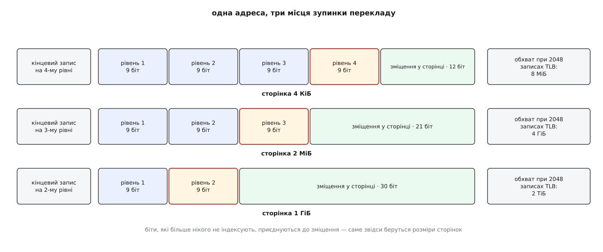
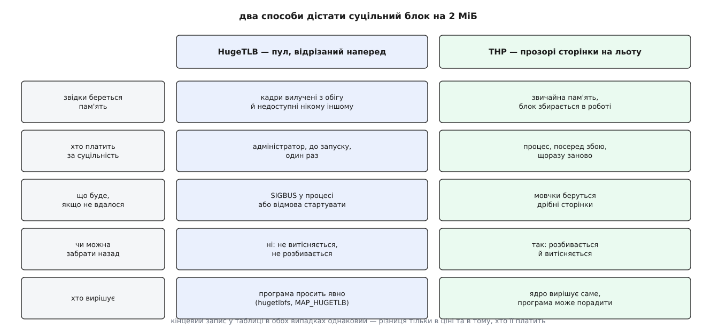
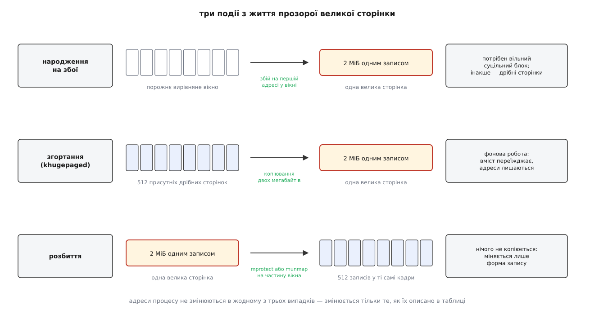

# Великі сторінки: HugeTLB і прозорі великі сторінки

<preknowlist>
- [Сторінки, таблиці сторінок і MMU](root:sf-os/paging-and-mmu) — адреса розпадається на індекси рівнів дерева й зміщення; запис таблиці містить номер кадру й прапорці.
- [TLB](root:hw-arch/tlb) — маленький кеш готових перекладів усередині процесора; його промах коштує обходу дерева таблиць.
- [Сторінковий збій](root:sf-os/page-fault) — на відсутньому записі апаратура спиняється й кличе ядро, а те підставляє сторінку.
- [Віртуальний адресний простір процесу](root:sf-os/virtual-address-space) — простір складається з ділянок, у кожної свої межі, права й походження.
- [mmap](root:sys-unix/mmap-model) — як програма просить у ядра ділянку простору й що вона отримує.
- [Копіювання при записі](root:sf-os/copy-on-write) — спільну сторінку розмножують лише тоді, коли в неї справді пишуть.
</preknowlist>

Уявіть службу, яка тримає в пам'яті індекс на двадцять чотири гігабайти й відповідає на випадкові запити. Профіль показує дивне. Процесор увесь час зайнятий, але встигає близько третини команди за такт. Кеш даних промахується не частіше, ніж на будь-якій іншій задачі такого розміру. Зате лічильник `dTLB-load-misses` дає майже один промах на кожен пошук.

Дані лежать у пам'яті, кеш робить свою роботу — і все одно кожне звернення платить окремий податок ще до того, як почнеться саме читання. Податок цей стягує переклад адрес: перш ніж прочитати число, процесор мусить довідатися, у якому фізичному кадрі воно лежить, а відповідь на це питання в нього закінчилася.

## Обхват — величина, якої немає в специфікації

Готові переклади процесор тримає в невеликому кеші, TLB. Записів у ньому фіксована кількість, і сама по собі вона нічого не каже: значення має добуток кількості записів на розмір сторінки. Це **обхват** TLB — обсяг пам'яті, по якому програма може бігати як завгодно безладно, не платячи за переклад.

```
перший рівень TLB   ≈   64 записи · 4 КіБ =  256 КіБ
другий рівень (STLB) ≈ 2048 записів · 4 КіБ =    8 МіБ
```

Точні числа різняться від покоління до покоління, але порядок такий: кілька сотень кілобайтів на перший рівень і одиниці мегабайтів на другий. Тепер порівняйте з робочою множиною нашої служби: 24 ГіБ проти 8 МіБ — це три сотих відсотка. При випадковому доступі влучити в цю тридцяту частку відсотка можна хіба випадково, тож промах стає не винятком, а правилом.

Що коштує промах? MMU йде дерево таблиць: до чотирьох залежних читань з пам'яті, кожне наступне за адресою, яку дало попереднє. Процесор має окремі кеші проміжних рівнів дерева, і вони знімають більшу частину цих читань — але останнє, за самим записом про сторінку, для випадкової області майже завжди йде в DRAM, бо таблиця останнього рівня для цієї області давно вихолола. Виходить кількасот тактів **чистого перекладу** на одне звернення — стільки ж або більше, ніж коштує саме читання даних.

Найгірше в цьому податку те, що його не видно. У профілі він не має власного рядка: він розмазаний по всій програмі як зупинки конвеєра, і виглядає точнісінько як «повільна пам'ять».

Зменшити його можна двома шляхами. Або торкатися менше різних сторінок — переупакувати дані так, щоб пов'язане лежало поруч. Або зробити так, щоб один запис TLB покривав більше. Перший шлях має межу: індекс на 24 ГіБ так і лишиться на 24 ГіБ, як його не пакуй. Другий шлях межі не має, і саме про нього далі.

## Чому TLB не роблять просто більшим

Напрошується очевидне: додати записів. Тисяча замало — хай буде сто тисяч.

Так не роблять, і причина апаратна. TLB шукає не за індексом, а **за вмістом**: подано номер віртуальної сторінки, і всі записи порівнюються з ним одночасно, кожен своїм компаратором. Такий пошук швидкий, поки записів мало, бо всі компаратори працюють паралельно. Але кожен доданий запис — це ще один компаратор, який споживає струм на кожному зверненні до пам'яті, і ще трохи ємності на спільних лініях, тобто ще трохи затримки. А затримка тут — на найкритичнішому шляху машини: TLB опитують паралельно з першим рівнем кешу даних, і якщо він не встигне, доведеться додати такт до **кожного** звернення.

Тому TLB росте повільно: за два десятиліття — від сотень записів до кількох тисяч. Проти зростання обсягів пам'яті це не зростання взагалі. Множник, який може дати виграш у сотні разів, лишається один — розмір сторінки.

## Зупинити переклад на рівень раніше

Хороша новина в тому, що апаратурі для цього нічого не треба доробляти. Усе вже є в самій будові дерева таблиць.

На x86-64 віртуальна адреса розпадається на чотири дев'ятки бітів, які по черзі індексують чотири рівні таблиць, і дванадцять молодших бітів — зміщення всередині сторінки, яке проходить крізь MMU недоторканим. Останній знайдений запис містить номер кадру, і фізична адреса складається з нього й зміщення.

Тепер поставмо в записі **третього** рівня один-єдиний прапорець: «я кінцевий, далі не йди». MMU спиняється тут і бере номер кадру просто з цього запису. Але тоді дев'ять бітів, якими він мав би індексувати таблицю останнього рівня, стають нікому не потрібні як індекс — і єдине розумне, що з ними робити, це віддати їх зміщенню. Зміщення розростається з 12 бітів до 21, а сторінка — з 4 КіБ до 2 МіБ.



*Прапорець «кінцевий» у записі проміжного рівня зупиняє переклад раніше. Біти, які мали індексувати наступні таблиці, приєднуються до зміщення — звідси й розмір сторінки: 4 КіБ, 2 МіБ або 1 ГіБ.*

З цієї арифметики випливає геть усе, що потім доведеться терпіти. Не «вирішили так зробити», а **інакше не буває**:

- Молодший 21 біт проходить крізь MMU без змін, отже фізичний блок мусить починатися на межі, кратній 2 МіБ, і бути **суцільним** — 512 кадрів поспіль. Ні дірок, ні перестановок усередині.
- Прапорці в записі одні на весь блок. Права доступу, біт бруду, біт звернення — спільні для двох мегабайтів. Захистити всередині окрему сторінку неможливо: немає де записати окремі права.
- Один запис TLB покриває 2 МіБ. Ті самі дві тисячі записів дають уже 4 ГіБ обхвату замість 8 МіБ — у 512 разів більше.
- Обхід дерева коротшає на крок: три читання замість чотирьох.
- Таблиць стає менше. Гігабайт, покритий дрібними сторінками, потребує 512 таблиць останнього рівня, тобто 2 МіБ самих лише таблиць на кожен гігабайт даних; великими сторінками він покривається 512 записами в одній таблиці — це 4 КіБ.

Той самий прийом працює й на рівень вище: кінцевий запис другого рівня забирає під зміщення 30 бітів і дає сторінку на 1 ГіБ. На x86-64 це вміють процесори, починаючи з AMD родини 10h («Barcelona», вересень 2007), і наявність такої змоги видно як `pdpe1gb` у `/proc/cpuinfo`.

ARM64 будує те саме зі своїх понять: замість «сторінкового» дескриптора на проміжному рівні ставиться **блоковий**, і при гранулі 4 КіБ це дає ті самі 2 МіБ та 1 ГіБ, а при гранулі 64 КіБ — блоки на 512 МіБ. Крім того, ARM має біт «суцільності»: шістнадцять сусідніх звичайних записів, що описують шістнадцять сусідніх вирівняних кадрів, можна позначити як одну групу, і TLB збереже їх одним записом на 64 КіБ. Це проміжний, дешевий розмір — його не треба вимолювати в системи, бо ущільнити шістнадцять кадрів набагато простіше, ніж п'ятсот дванадцять.

> 🔧 **Навіщо це.** Вимога вирівнювання — не формальність, а найчастіша причина, чому великі сторінки «не вмикаються». Ділянка на 2 МіБ, віддана `mmap` за довільною адресою, майже напевно перетинає межу двох мегабайтів навпіл, і жодна половинка не може стати великою сторінкою. Тому код, який на них розраховує, просить у системи більше, ніж потребує, і сам вирівнює початок: бере ділянку на 2 МіБ більшу, відрізає початок до найближчої межі й повертає хвіст. Ті самі міркування діють і для 1 ГіБ, тільки з межею на гігабайт.

## За суцільність хтось мусить заплатити

Отже, щоб віддати програмі велику сторінку, ядро мусить знайти 512 суцільних вирівняних кадрів. І ось тут закінчується апаратура й починається справжня складність.

Фізичні кадри ядро роздає блоками, розмір яких — степінь двійки: один кадр, два, чотири і так далі до найбільшого порядку. Блок на 2 МіБ — це порядок дев'ять. На щойно завантаженій машині таких блоків скільки завгодно. Через добу роботи вільна пам'ять перетворюється на пил: кеш файлів, буфери мережі, купи процесів, що народжуються й помирають, лишають по собі дірки на одну-дві сторінки. Сумарно вільного може бути десять гігабайтів, а суцільних двох мегабайтів — жодних.

Скласти блок докупи ядро вміє: воно **ущільнює** пам'ять, тобто переносить рухомі сторінки з середини майбутнього блоку кудись інде, правлячи всі записи таблиць, що на них указували. Але не всяка сторінка рухома — ядерні структури, закріплені під DMA буфери й багато чого ще зрушити не можна, і одна така сторінка посеред двох мегабайтів робить блок неможливим назавжди. А саме ущільнення коштує часу й блокувань. [Як ядро веде фізичні кадри — зони, блоки за порядками, ущільнення й хто його виконує](root:sys-unix/physical-page-allocator) — окрема, і чимала, тема.

Звідси головне для всієї подальшої розмови: суцільність має ціну, і хтось мусить її заплатити. Linux має дві відповіді на питання «хто і коли», і саме в цьому — уся різниця між двома механізмами великих сторінок. Не в API, не в розмірах, не в назвах: у тому, хто платить.

## Перша відповідь: відрізати наперед

Найпростіше — заплатити один раз, поки платити дешево, і більше не думати. Ядро відрізає від звичайної пам'яті **пул** великих сторінок, і далі роздає їх з нього.

```sh
$ sysctl -w vm.nr_hugepages=1024
$ grep -iE 'MemFree|HugePages_(Total|Free|Rsvd)|Hugepagesize|^Hugetlb' /proc/meminfo
MemFree:        12043912 kB
HugePages_Total:    1024
HugePages_Free:     1024
HugePages_Rsvd:        0
Hugepagesize:       2048 kB
Hugetlb:         2097152 kB
```

Два гігабайти щойно зникли зі звичайної пам'яті. Це не бухгалтерська умовність: ці кадри вилучені з обігу цілком. Ядро не покладе в них кеш файлів, не забере їх під тиском, не вивантажить у підкачку, не віддасть жодному процесові, який просто попросив пам'яті. Вони існують тільки для тих, хто попросить їх явно. Саме тому пул зазвичай задають при завантаженні (`hugepagesz=2M hugepages=1024` у рядку ядра), поки пам'ять іще не фрагментована — а сторінки на 1 ГіБ лише так і можна дістати надійно, бо гігабайт перевищує найбільший порядок блоку, який ядро вміє скласти в роботі.

Механізм цей зветься **HugeTLB** — за іменем підсистеми, яка ним керує. Дістатися до пулу можна кількома дверима, і всі вони ведуть в одне місце: файлова система `hugetlbfs`, прапорець `MAP_HUGETLB` у `mmap`, прапорець `SHM_HUGETLB` у `shmget`, прапорець `MFD_HUGETLB` у `memfd_create`. Найкоротший шлях виглядає так:

```c
#include <sys/mman.h>

/* два мегабайти однією великою сторінкою */
void *p = mmap(NULL, 2u << 20, PROT_READ | PROT_WRITE,
               MAP_PRIVATE | MAP_ANONYMOUS | MAP_HUGETLB, -1, 0);
if (p == MAP_FAILED)
        return -1;              /* у пулі не лишилося сторінок */
```

Тут ховається властивість, через яку HugeTLB поводиться геть не так, як звичайна пам'ять. У момент `mmap` ядро не видає сторінки, але **резервує** їх: лічильник `HugePages_Rsvd` росте, і зарезервоване вже ніхто інший не забере. Завдяки цьому пізніший збій на цій ділянці не може провалитися. А якщо резервування обійти або пул тим часом зменшити, збій таки провалиться — і процес отримає `SIGBUS`. Не вбивство від OOM, не повільну роботу, а сигнал у момент звернення до цілком законної адреси. Брак великих сторінок — це помилка, адресована процесові, а не системі.

Повний перелік того, що тут можна крутити — параметри завантаження, sysctl, гілка `/sys/kernel/mm/hugepages/`, роздача по вузлах NUMA, прапорці системних викликів і всі лічильники, які це показують, — зібраний окремо: [інтерфейси великих сторінок: пул HugeTLB, THP і те, чим вони міряються](root:sys-unix/huge-pages-tlb-reach/api-huge-page-interfaces.md).

> 🔧 **Навіщо це.** Саме тому PostgreSQL має налаштування `huge_pages` з трьома значеннями, і `on` означає «не запускайся, якщо великих сторінок не дали». Це не впертість: сервер з `huge_pages=on` перетворює наявність пулу на частину договору про розгортання, який видно одразу, а не через тиждень у вигляді загадкових просідань. Розмір пулу при цьому рахують від `shared_buffers` із запасом на службові структури, і рахунок цей мусить жити поряд із конфігом бази — інакше перше ж збільшення буфера мовчки поверне базу на дрібні сторінки або взагалі не дасть їй стартувати.

Що з цього виходить, добре видно з двох боків одразу. Пул жорсткий: недорахували — процес не стартує або впаде на `SIGBUS`; перерахували — гігабайти лежать мертвим вантажем, недоступні нікому. Пул непрозорий: програма мусить попросити явно, тобто її треба або переписати, або хоча б налаштувати. Зате пул **передбачуваний**: у ньому нема ущільнення посеред роботи, нема витіснення, нема моменту, коли система раптом передумає. Для бази даних, віртуальної машини або обробника пакетів, що на роки займають фіксований шмат пам'яті, це саме те, чого хочуть.

Є й приємний побічний ефект, помітний на великих масштабах: процеси, які відображають той самий файл `hugetlbfs`, можуть ділити не лише кадри, а й **самі таблиці** проміжного рівня. Коли сотня процесів дивиться в спільну область на сто гігабайтів, різниця між «сто копій таблиць» і «одна на всіх» рахується вже в гігабайтах.



*Обидва механізми дають однаковий кінцевий запис у таблиці. Різняться вони тим, коли платиться за суцільність, що станеться при невдачі й чи може система забрати сторінку назад.*

## Друга відповідь: робити мовчки

Пул вимагає, щоб хтось наперед знав розмір і не помилився. Але більшість програм не знає нічого й нічого не просить — а виграш від великих сторінок могла б мати. Звідси друга відповідь: хай ядро робить це саме, ні в кого не питаючи. Так з'явилися **прозорі великі сторінки** (англ. *transparent huge pages*, THP) — механізм, який Андреа Арканджелі довів до злиття в ядро 2.6.38 навесні 2011 року.

Прозорість тут означає буквально: жодного нового виклику, жодного нового типу пам'яті. Та сама анонімна пам'ять, той самий `malloc`, просто під ним іноді лежать не 512 дрібних сторінок, а одна велика.

Ядро втручається у двох різних моментах, і це різні механізми з різними наслідками.

**У момент збою.** Програма вперше торкається адреси; ядро бачить, що ділянка достатньо велика й вирівняна так, що навколо адреси вміщається цілий вирівняний блок на 2 МіБ. Тоді воно намагається взяти суцільний блок, обнулити його й поставити один кінцевий запис на проміжному рівні. Замість 512 збоїв — один; замість 512 записів у таблиці — один запис.

**Згодом, фоном.** Пам'ять, роздана дрібними сторінками, теж можна виправити заднім числом. Цим займається окремий потік ядра, `khugepaged`: він неквапно обходить ділянки процесів, шукає вирівняне вікно на 2 МіБ, де вже присутні дрібні сторінки, бере велику сторінку, **копіює** в неї вміст усіх п'ятисот дванадцяти, підміняє запис у таблиці й звільняє дрібні. Це називають згортанням. Програма нічого не помічає: адреси ті самі, вміст той самий, змінилася лише форма запису.

Є й зворотний хід. Щойно з великою сторінкою треба зробити щось, чого не можна зробити з блоком цілком — зняти права з її частини через `mprotect`, звільнити шматок через `munmap`, перенести частину на інший вузол NUMA, — ядро **розбиває** її назад на 512 звичайних записів, що вказують у ті самі кадри. Копіювання тут немає, міняється лише форма опису; сама пам'ять лишається на місці. Тому розбиття дешеве, і ядро вдається до нього охоче.



*Народження й згортання дають ту саму велику сторінку, але різною ціною: перше просить суцільний блок наперед, друге ще й копіює два мегабайти. Розбиття не копіює нічого — воно лише міняє один запис на 512.*

Керують цим із двох боків. Адміністратор — записом у sysfs:

```sh
$ cat /sys/kernel/mm/transparent_hugepage/enabled
always [madvise] never
```

`always` — пробувати скрізь, `never` — не пробувати ніде, `madvise` — тільки там, де програма попросила. А просить програма через `madvise`:

```c
madvise(buf, len, MADV_HUGEPAGE);    /* тут великі сторінки бажані */
madvise(buf, len, MADV_NOHUGEPAGE);  /* а тут — категорично ні */
madvise(buf, len, MADV_COLLAPSE);    /* згорни негайно, я почекаю */
```

Останній — наймолодший із трьох (він з'явився у версії 6.1) і найцікавіший: він не порада на майбутнє, а наказ згорнути тут і зараз, синхронно, поки виклик не повернувся. Це дає програмі те, чого раніше не було: змогу заплатити за згортання в момент, який вона сама обрала — скажімо, одразу після завантаження індексу, а не посеред обслуговування запиту.

Прозорі сторінки давно вже не обмежені анонімною пам'яттю. Так само працює `tmpfs` і спільна пам'ять, а файлові системи, що вміють великі частини кешу сторінок, дістають великі сторінки й для відображених файлів — насамперед для коду великих виконуваних файлів. Крім того, у ядрах 2024 року з'явилися **проміжні розміри**: не тільки 2 МіБ, а й 16 КіБ, 64 КіБ, 512 КіБ — усі степені двійки нижче за повний блок. Причина проста: двомегабайтовий крок для багатьох задач завеликий і платиться дорого, тоді як зібрати шістнадцять суцільних кадрів майже завжди можна одразу. Кожен розмір має власний вимикач у власній підтеці sysfs.

Історію цього руху — від чотиримегабайтових сторінок першого Pentium до пулу 2002 року, прозорих сторінок 2011-го й проміжних розмірів 2024-го — розказано окремо: [звідки взялися великі сторінки й чому їх довелося винаходити двічі](root:sys-unix/huge-pages-tlb-reach/hist-huge-pages.md).

## Три способи, якими прозорість шкодить

Репутація в THP суперечлива: половина документації баз даних починається з поради їх вимкнути. Це не забобон, але й не одна проблема — це три різні механізми, і плутати їх шкідливо, бо лікуються вони по-різному.

**Перший — затримка на розподілі.** Коли на збої суцільного блоку немає, ядро може спробувати зробити його негайно: запустити ущільнення **прямо в потоці, що спіткнувся**. Потік стоїть, поки ядро переносить чужі сторінки. Збій, який мав коштувати мікросекунду, коштує десятки мілісекунд. Саме звідси беруться скарги на «випадкові піки затримки, які нічим не пояснюються»: у профілі це навіть не звернення до диска, це просто раптова пауза.

Керує цим окремий вимикач, `defrag`, і його значення — це відповідь на питання «чи можна змусити прикладний потік чекати»:

```sh
$ cat /sys/kernel/mm/transparent_hugepage/defrag
always defer [defer+madvise] madvise never
```

`always` дозволяє чекати завжди, `never` не дозволяє ніколи (не знайшлося блоку — беремо дрібні сторінки й ідемо далі), `defer` віддає роботу фоновим потокам ядра, а `defer+madvise` — розумний компроміс, що став типовим у дистрибутивах: чекати дозволено лише тому, хто явно попросив великих сторінок через `madvise`. Логіка чесна: хто попросив, той знає, навіщо, і згоден заплатити.

**Другий — роздування.** Велика сторінка займає два мегабайти незалежно від того, скільки з них програмі справді потрібно. Купа, у якій живі об'єкти розкидані рідко, після згортання почне важити в кілька разів більше, і це буде видно в `RSS` як цілком реальні мегабайти. Підсилює ефект налаштування `max_ptes_none`: воно каже, скільком сторінкам у вікні дозволено бути порожніми, щоб `khugepaged` усе одно згорнув вікно, а типове його значення на x86-64 — 511 із 512. Тобто за домовленістю ядро згортає вікно, у якому зайнята одна-єдина сторінка з п'ятисот дванадцяти, роздуваючи її до двох мегабайтів. Проти цього в ядрах від 6.12 з'явився `shrink_underused`: під тиском на пам'ять ядро проходить списком великих сторінок, дивиться, скільки в кожній нульових дрібних, і розбиває недовикористані назад.

**Третій — груба зернистість спільного.** Це найцікавіший випадок, бо він переважно **історичний**, а фольклор про нього живий досі. Копіювання при записі працює по сторінці: пишеш у спільну — отримуєш свою копію. Поки сторінка на 4 КіБ, копія коштує 4 КіБ. Коли вона на 2 МіБ, один записаний байт коштував **двох мегабайтів копії**. Класична жертва — Redis, який робить знімок бази через `fork`: батьківський процес далі приймає команди, кілька тисяч розкиданих записів чіпають майже кожну велику сторінку, і замість дешевого спільного стану виходить копія майже всієї бази — з відповідним піком і по пам'яті, і по затримці. Саме звідси пішла порада «вимкніть THP», яку досі повторюють.

Але з ядра 5.8 (літо 2020) анонімні прозорі сторінки в цій ситуації поводяться інакше: замість копіювати два мегабайти ядро **розбиває** велику сторінку на дрібні й копіює лише ту одну, у яку писали. Ціна повернулася до чотирьох кілобайтів. До 5.8 було навпаки — збій на запис у спільну велику сторінку намагався взяти нову велику й скопіювати в неї всі два мегабайти. Отже, конкретно це підсилення для THP усунене — а ось для HugeTLB воно чинне досі, бо сторінки з пулу не розбиваються **ніколи**: записаний байт у спільну сторінку з `hugetlbfs` і сьогодні коштує повних двох мегабайтів копії.

> 🔧 **Навіщо це.** Якщо ви читаєте пораду «вимкніть прозорі сторінки», варто питати не «вимикати чи ні», а «яка з трьох причин мене стосується». Пік затримки в момент виділення пам'яті лікується `defrag=defer+madvise`, а не повним `never`. Роздутий `RSS` на рідкій купі лікується режимом `madvise` — тоді великі сторінки дістануться лише тому коду, який їх просив. І тільки якщо служба живе на форку зі спільним станом і на старому ядрі, повне вимкнення справді має сенс. Мірилом у всіх трьох випадках є ваша власна гістограма затримок до і після, а не рядок у чужому посібнику.

## Як подивитися, що діється

Уся картина видима, і дивитися варто з трьох боків.

Що є в системі загалом — `/proc/meminfo`: `Hugetlb` показує розмір пулу, `AnonHugePages` — скільки анонімної пам'яті вже лежить під прозорими сторінками, `ShmemHugePages` і `FileHugePages` — те саме для спільної пам'яті й кешу файлів.

Що дісталося конкретному процесові — `/proc/<pid>/smaps`: там кожна ділянка простору має власний рядок `AnonHugePages`, і одразу видно, чи стала великою саме та ділянка, заради якої все робилося.

Чи вдаються спроби — `/proc/vmstat`:

```sh
$ grep -E '^(thp_fault_alloc|thp_fault_fallback|thp_collapse_alloc|thp_split_pmd) ' /proc/vmstat
thp_fault_alloc 18422
thp_fault_fallback 96431
thp_collapse_alloc 311
thp_split_pmd 2044
```

Такий розклад читається однозначно: на кожну вдалу спробу припадає п'ять невдалих, тобто суцільних блоків у системі бракує, і програма здебільшого працює на дрібних сторінках, регулярно платячи за марні спроби. Лікують це не вимкненням THP, а боротьбою з фрагментацією пам'яті — або переходом на явний пул.

І, нарешті, чи є взагалі за що боротися — лічильники самого процесора:

```sh
$ perf stat -e dTLB-load-misses,dTLB-loads,dtlb_load_misses.walk_active ./service
```

Виграшу від великих сторінок не буде там, де промахів TLB і так мало. Послідовне читання великого масиву — саме такий випадок: сторінка змінюється раз на тисячу елементів, передвибірка працює, обхват не заважає. Виграш живе там, де доступ безладний, а робоча множина набагато більша за обхват — у хеш-таблицях, індексах, графах, буферних пулах баз.

Помацати різницю руками — найкоротший шлях до розуміння: [маленька програма, що ганяє випадковий обхід по одній і тій самій пам'яті, узятій трьома способами, і показує ціну перекладу в наносекундах](root:sys-unix/huge-pages-tlb-reach/proj-huge-page-benchmark.md).

## Одне рішення, дві ціни

Варто побачити, як мало тут насправді нового. Ні HugeTLB, ні THP не додають до апаратури нічого: обидва зрештою ставлять той самий прапорець у тому самому записі таблиці — «переклад закінчується тут». Кінцевий стан машини після обох механізмів однаковий до біта.

Уся різниця — у відповіді на питання, хто платить за суцільність і коли. HugeTLB відповідає: платить адміністратор, наперед, один раз, і платить готівкою — відрізаною від системи пам'яттю, якої більше ніхто не побачить. Взамін він отримує визначеність: жодних несподіванок у роботі, а брак ресурсу приходить чесною помилкою в момент запуску. THP відповідає інакше: платить сам процес, посеред збою, щоразу заново — і платить часом, якого не планував. Взамін він отримує пам'ять, яку ніхто не відрізав, і виграш там, де ніхто не здогадався попросити.

Тому й вибір між ними — не про продуктивність, а про те, де вам зручніше тримати ризик. Коли шмат пам'яті великий, довговічний і належить одному господареві, дешевше домовитися про нього заздалегідь. Коли пам'ять роздрібнена між сотнею різних програм, домовлятися нема з ким, і лишається довіритися ядру — але тоді варто знати три способи, якими ця довіра може обернутися піком на графіку.

