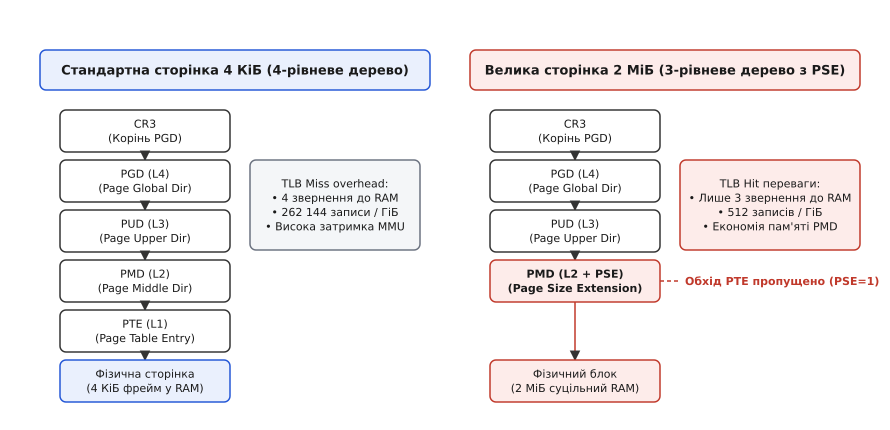
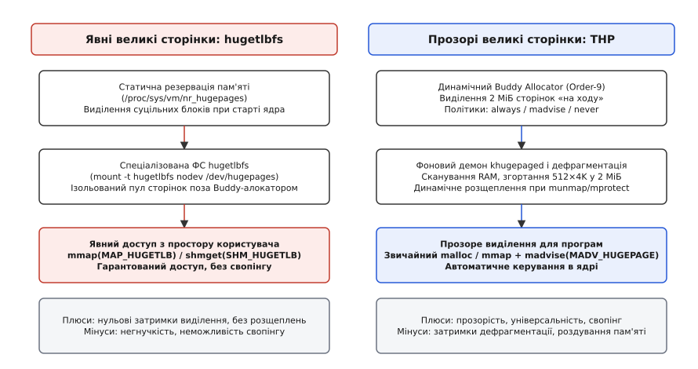

# Файлова система hugetlbfs та прозорі великі сторінки THP

<preknowlist>
- [Псевдо-ФС: procfs, sysfs, tmpfs](topic:sys-unix/pseudo-filesystems) — віртуальні файлові системи ядра Linux без дискового носія.
- [Інтерфейс тюнінгу ядра sysctl та /proc/sys](topic:sys-unix/sysctl-parameter-map-and-tooling) — динамічне налаштування параметрів ядра під час виконання.
- [Модель об'єктів sysfs](topic:sys-unix/sysfs-kobject-sysfs-dirent) — структури kobject та керування атрибутами у піддереві /sys/kernel/mm.
- [Відображення процесів у procfs](topic:sys-unix/procfs-kernel-implementation) — аналіз використання оперативної пам'яті процесів у /proc/[pid]/smaps.
</preknowlist>

База даних PostgreSQL під час виділення 128 ГіБ оперативної пам'яті створює понад 33 мільйони сторінок стандартного розміру 4 КіБ. Для збереження такої кількості трансляцій адрес дерево таблиць сторінок (*page tables*) процесу споживає понад 256 МіБ оперативної пам'яті ядра, а буфер асоціативної трансляції процесора (*Translation Lookaside Buffer*, TLB) зазнає постійних промахів (*TLB misses*). За вимірами на серверних навантаженнях із великим робочим набором частка часу, витраченого процесором на обхід таблиць сторінок замість корисної роботи, сягає десятків відсотків. Перехід на великі сторінки пам'яті розміром 2 МіБ зменшує кількість записів у таблицях сторінок у 512 разів: те саме дерево трансляцій стає на рівень нижчим, а робочий набір знову вміщається у TLB.

> 🔧 **Навіщо це.**
> Розуміння різниці між явними сторінками `hugetlbfs` та прозорими сторінками `THP` дозволяє усунути раптові сплески затримки (*latency spikes*) у високонавантажених сервісах (Redis, MongoDB, Java JVM), зменшити обсяг пам'яті ядра на таблиці сторінок для гіпервізорів QEMU/KVM та оптимізувати пропускну здатність мережевих стеків DPDK.

## Апаратне кешування TLB та анатомія великих сторінок

У сучасній 64-розрядній архітектурі x86_64 кожна програма оперує віртуальними адресами, які пристрій управління пам'яттю MMU (*Memory Management Unit*) транслює у фізичні адреси RAM. Ця трансляція виконується за допомогою ієрархічного дерева таблиць сторінок. Фізична адреса кореня дерева зберігається у керуючому регістрі процесора `CR3`. За замовчуванням операційна система використовує чотири рівні дерев: PGD (*Page Global Directory*), PUD (*Page Upper Directory*), PMD (*Page Middle Directory*) та PTE (*Page Table Entry*). П'ятирівневий режим (апаратно — процесори з ознакою `la57`, у Linux вмикається з ядра 4.14) додає між PGD та PUD ще один рівень, P4D; на чотирирівневому обладнанні ядро згортає його в порожню ланку, тож код підсистеми пам'яті всюди написано на п'ять рівнів.

Кожне звернення до нової сторінки пам'яті вимагає від MMU послідовного зчитування чотирьох записів із RAM. У разі промаху TLB апаратний модуль обходу дерев (*Page Walk Engine*) змушений виконувати послідовні зчитування з кеш-пам'яті L1/L2/L3 або системної RAM. Сучасні процесори додатково оптимізують цей процес за допомогою спеціалізованих кешів структур трансляції PSC (*Paging-Structure Caches*), які зберігають проміжні записи PGD та PUD. Якщо запис таблиці PGD відсутній у кеші CPU, перше звернення коштує близько 200–300 тактів процесора. Чотири послідовні звернення до RAM для одного відображення 4 КіБ у найгіршому разі складаються у затримку близько тисячі тактів, що кардинально знижує продуктивність гарячих циклів програми.

У кожному записі таблиці перші біти містять службові прапорці: `_PAGE_PRESENT` (наявність сторінки в RAM), `_PAGE_RW` (дозвіл на запис), `_PAGE_USER` (доступ з простору користувача), `_PAGE_PWT` (наскрізний запис у пам'ять), `_PAGE_PCD` (заборона кешування), `_PAGE_ACCESSED` (фіксація зчитування) та `_PAGE_DIRTY` (фіксація модифікації).

Для прискорення трансляції адрес в процесор вбудовано спеціалізований апаратний кеш — буфер асоціативної трансляції TLB. Сучасні мікропроцесори містять дворівневу ієрархію TLB: перший рівень L1 розділено на L1 ITLB (для інструкцій) та L1 DTLB (для даних), а другий рівень L2 STLB (*Second-Level TLB*) є спільним. Оскільки розмір TLB обмежений кількома тисячами записів (в Intel Skylake, наприклад, L1 DTLB містить 64 записи для сторінок 4 КіБ, а спільний L2 STLB — 1536 записів), адресація гігабайтних масивів пам'яті сторінками по 4 КіБ призводить до вимивання записів із TLB.


*Схема обходу чотирирівневого та трирівневого дерева сторінок x86_64.*

Розв'язанням цієї проблеми є використання розширення розміру сторінки PSE (*Page Size Extension*). Якщо в записі таблиці другого рівня PMD встановлено біт `_PAGE_PSE` (Bit 7), MMU зупиняє подальший обхід дерева і не звертається до таблиці PTE першого рівня. Вміст запису PMD інтерпретується як прямий вказівник на суцільний фізичний блок пам'яті розміром 2 МіБ (послідовність із 512 базових сторінок по 4 КіБ). На рівні PUD прапорець PSE адресує гігабайтні сторінки 1 ГіБ.

На відміну від x86_64, архітектура ARM64 (AArch64) реалізує додатковий апаратний механізм Contiguous Bit (`PTE_CONT`). Якщо в 16 послідовних записах таблиці PTE встановлено біт `PTE_CONT`, MMU об'єднує їх у єдину суцільну трансляцію розміром 64 КіБ; при 64-кілобайтній базовій сторінці суміжними позначаються 32 записи, і трансляція покриває 2 МіБ. Усе це відбувається на останньому рівні таблиць (level 3), тож переваги великих сторінок доступні без зміни структури PMD.

Використання сторінок 2 МіБ надає три фундаментальні переваги:

1. **Скорочення глибини обходу.** MMU виконує три звернення до пам'яті замість чотирьох, заощаджуючи сотні тактів процесора при кожному промаху L1 TLB.
2. **Збільшення ефективності TLB.** Один запис у TLB покриває 2 МіБ адресового простору замість 4 КіБ (збільшення ефективного охоплення TLB у 512 разів).
3. **Економія пам'яті ядра.** Для адресації 1 ГіБ пам'яті через сторінки 4 КіБ потрібна 1 таблиця PMD та 512 таблиць PTE, які займають 2 МіБ RAM. При використанні сторінок 2 МіБ таблиці PTE взагалі не створюються, заощаджуючи системну пам'ять ядра та прискорюючи роботу MMU.

## Дві концепції ядра Linux: явні HugeTLB та прозорі THP

Операційна система Linux реалізує дві принципово різні концепції роботи з великими сторінками: явну підсистему `HugeTLB` (з віртуальною файловою системою `hugetlbfs`) та автоматизований механізм `Transparent Huge Pages` (THP).


*Порівняння механізмів виділення та керування пам'яттю у hugetlbfs та THP.*

[Еволюцію підтримки великих сторінок пам'яті від Pentium Pro до mTHP](topic:sys-unix/hugetlbfs-thp-kernel-interfaces/hist-hugepages-evolution.md) зумовили практичні потреби додатків із високими вимогами до пам'яті.

Порівняння ключових характеристик обох підходів:

| Параметр / Властивість | Явні сторінки Hugetlbfs | Прозорі сторінки THP |
| :--- | :--- | :--- |
| **Спосіб резервації** | Статичний пул ядра при старті або через sysctl | Динамічне виділення з Buddy Allocator |
| **Інтерфейс доступу** | ФС hugetlbfs, `mmap(MAP_HUGETLB)` | Звичайний `malloc()`, `mmap()` + `madvise()` |
| **Витискання у swap** | Заборонено (сторінки заблоковані у RAM) | Дозволено (до 4.13 — лише через розщеплення на 4 КіБ) |
| **Фрагментація пам'яті** | Відсутня (пам'ять виділяється заздалегідь) | Схильні до фрагментації та затримок |
| **Зміни у коді програм** | Вимагають спеціальних викликів API | Прозорі, не вимагають зміни коду |

## Явна резервація через hugetlbfs та системний виклик mmap

Підсистема HugeTLB базується на ідеї попереднього виділення нефрагментованого пулу фізичної пам'яті. Усередині ядра кожним підтримуваним розміром великої сторінки керує внутрішня структура `struct hstate`, масив яких `hstates[HUGE_MAX_HSTATE]` зберігає списки вільних сторінок, лічильники зарезервованих сторінок та посилання на відповідні атрибути у sysfs. Це гарантує, що додаток завжди отримає великі сторінки без затримок на дефрагментацію.

### Конфігурація пулу HugeTLB

Резервація великих сторінок виконується двома шляхами:

1. **Параметри завантаження ядра.** У командному рядку завантажувача (GRUB/systemd-boot) вказуються параметри:
   `hugepagesz=2M hugepages=1024`
   Це змушує ядро виділити 1024 сторінки по 2 МіБ (загалом 2 ГіБ) на самому початку ініціалізації RAM, коли фізична пам'ять ще не фрагментована.

2. **Динамічний тюнінг через sysctl.** У працюючій системі адміністратор може змінити кількість зарезервованих сторінок:
   `sysctl vm.nr_hugepages=1024`
   Ядро звертається до Buddy Allocator і намагається виділити 1024 підряд розташованих блоки порядку 9 (*Order-9*). Якщо пам'ять сильно фрагментована, реальна кількість виділених сторінок може виявитися меншою за запитану. У разі потреби виділення понад зарезервований ліміт ядро намагається отримати тимчасові («понадлімітні») сторінки, якщо налаштовано параметр `nr_overcommit_hugepages`: у ядрах 5.x це робить `alloc_surplus_huge_page()`, а після переведення HugeTLB на фоліо ту саму роботу виконує `alloc_surplus_hugetlb_folio()`.

У багатопроцесорних системах з архітектурою NUMA виділення сторінок HugeTLB розподіляється між фізичними сокетами CPU. За допомогою прив'язки політики пам'яті `MPOL_BIND` у виклику `set_mempolicy()` або використання `numactl --membind` додаток гарантує, що великі сторінки виділяються у плашках RAM, безпосередньо підключених до поточного сокета, усуваючи затримки шин QPI/UPI.

### Монтування файлової системи hugetlbfs

Файлова система `hugetlbfs` — це псевдофайлова система у пам'яті, схожа на `tmpfs`, але кожен створений у ній файл спирається на пул великих сторінок.

Для використання `hugetlbfs` її монтують у файлову ієрархію:

```bash
mount -t hugetlbfs -o pagesize=2M nodev /mnt/hugepages
```

Після цього додатки (наприклад, PostgreSQL або QEMU) можуть створювати файли у каталозі `/mnt/hugepages` і відображати їх у свій адресовий простір через `mmap()`. Точка монтування довільна: у системах із systemd `hugetlbfs` зазвичай уже змонтовано в `/dev/hugepages`, і власне монтування тоді не потрібне.

### Анонімне виділення пам'яті через MAP_HUGETLB

Програми можуть обійтися без монтування файлової системи, викликаючи `mmap()` напряму з прапорцем `MAP_HUGETLB`:

:::tabs
```c
// Виділення анонімної пам'яті HugeTLB у мові C
void *ptr = mmap(NULL, 256 * 1024 * 1024,
                 PROT_READ | PROT_WRITE,
                 MAP_PRIVATE | MAP_ANONYMOUS | MAP_HUGETLB | MAP_HUGE_2MB,
                 -1, 0);
```
```cpp
// Виділення анонімної пам'яті HugeTLB у мові C++
auto* ptr = static_cast<uint8_t*>(::mmap(nullptr, 256 * 1024 * 1024,
                                          PROT_READ | PROT_WRITE,
                                          MAP_PRIVATE | MAP_ANONYMOUS | MAP_HUGETLB | MAP_HUGE_2MB,
                                          -1, 0));
```
:::

Ядро перевіряє наявність вільних сторінок у пулі `HugeTLB`. Якщо сторінки є, ядро одразу прив'язує фізичні записи PMD без залучення таблиць PTE. На рівні структур ядра сторінка HugeTLB позначається як складена сторінка (*compound page*): перша сторінка 4 КіБ отримує прапорець `PG_head`, а кожна з наступних 511 «хвостових» сторінок несе в полі `compound_head` вказівник на цю голову з молодшим бітом 1 (окремого прапорця `PG_tail` серед page flags сучасні ядра не мають — він лишився у старій літературі). Функція `compound_head()` дозволяє підсистемі VMM миттєво визначити корінь складеної сторінки при будь-яких операціях з указівниками. Якщо пул вичерпано, системний виклик повертає помилку `ENOMEM`.

Для прямих мережевих операцій високої швидкості (DPDK, RDMA) сторінки `hugetlbfs` додатково позначаються як зафіксовані у пам'яті за допомогою викликів `pin_user_pages()`, що повністю унеможливлює їх міграцію та перезапис під час DMA-обміну. Прапорці `VM_LOCKED` та `VM_HUGETLB` у структурі `vm_area_struct` гарантують, що підсистема витискання сторінок `kswapd` ніколи не намагатиметься скинути ці блоки у файл підкачки.

У сучасних контейнеризованих середовищах обмеження використання сторінок HugeTLB здійснюється через контролер cgroups v2 `hugetlb` за допомогою параметрів `hugetlb.2MB.max` та `hugetlb.1GB.max`.

## Автоматизований менеджмент: Transparent Huge Pages (THP)

Механізм Transparent Huge Pages (THP) створено для того, щоб звичайні програми отримали переваги великих сторінок без використання спеціалізованих API чи монтування файлових систем.

### Принцип роботи THP при сторінковому збої

Коли програма викликає стандартний `malloc(2097152)` або `mmap()`, ядро створює анонімне відображення в анонімній зоні пам'яті VMA (*Virtual Memory Area*). Фізична пам'ять при цьому не виділяється (застосовується відкладене виділення).

Під час першого звернення програми до створеного масиву відбувається апаратний сторінковий збій (*page fault*). Обробник ядра (`do_huge_pmd_anonymous_page()`) виконує такі кроки:

1. Перевіряє, чи вирівняно віртуальну адресу на межу 2 МіБ і чи перевищує розмір VMA значення 2 МіБ.
2. Звертається до Buddy Allocator із запитом на виділення одного блоку 2 МіБ (Order-9).
3. Якщо вільний блок знайдено, ядро атомарно заповнює запис PMD, встановлює біт `_PAGE_PSE` і повертає управління програмі. Програмі виділено 2 МіБ THP за один крок.
4. Якщо суцільного блоку 2 МіБ немає через фрагментацію, поведінка ядра визначається параметром `/sys/kernel/mm/transparent_hugepage/defrag`.

### Фоновий демон khugepaged

Якщо під час першого звернення ядро не знайшло суцільного блоку 2 МіБ і віддало програмі звичайні сторінки по 4 КіБ, у гру вступає фоновий демон ядра `khugepaged`.

Демон `khugepaged` функціонує за таким алгоритмом:

1. Періодично прокидається (інтервал задається через `scan_sleep_millisecs`).
2. Сканує анонімні VMA процесів у пошуках 512 підряд розташованих сторінок 4 КіБ.
3. Перевіряє, щоб кількість порожніх або витиснутих у swap сторінок не перевищувала пороги `max_ptes_none` та `max_ptes_swap`.
4. Якщо перевірку пройдено, `khugepaged` виділяє нову фізичну сторінку 2 МіБ, підтягує з swap те, чого бракує, копіює туди дані, атомарно оновлює запис PMD (встановлюючи `_PAGE_PSE`) та звільняє 512 старих сторінок 4 КіБ. Цей процес називається **згортанням сторінок** (*page collapsing*).

При взаємодії з підсистемою дедуплікації пам'яті KSM (*Kernel Samepage Merging*) виникає конфлікт інтересів: KSM намагається порівнювати вміст сторінок по 4 КіБ і розщеплює великі сторінки THP для усунення дублікатів. Тому для процесів з THP функцію KSM рекомендується вимикати.

### Підказка madvise() та прапорець MADV_HUGEPAGE

Щоб не застосовувати агресивний режим THP до всіх процесів у системі, глобальну політику зазвичай переводять у режим `madvise`. У цьому режимі ядро створює THP лише для тих діапазонів пам'яті, які програма явно позначила за допомогою системного виклику `madvise()`:

:::tabs
```c
// Позначення області пам'яті для THP у мові C
void *ptr = mmap(NULL, size, PROT_READ | PROT_WRITE, MAP_PRIVATE | MAP_ANONYMOUS, -1, 0);
madvise(ptr, size, MADV_HUGEPAGE);
```
```cpp
// Позначення області пам'яті для THP у мові C++
auto* ptr = static_cast<uint8_t*>(::mmap(nullptr, size, PROT_READ | PROT_WRITE, MAP_PRIVATE | MAP_ANONYMOUS, -1, 0));
::madvise(ptr, size, MADV_HUGEPAGE);
```
:::

Для скасування використання THP застосовується прапорець `MADV_NOHUGEPAGE`, а для синхронного примусового згортання — `MADV_COLLAPSE`.

Від ядра 6.8 доступне розширення Multi-size THP (mTHP): воно дозволяє прозоро виділяти анонімні сторінки проміжних розмірів — 16, 32, 64, 128, 256, 512 та 1024 КіБ, — щоб не платити за суцільний блок 2 МіБ там, де його не заповнять. Кожен розмір вмикається окремо, своїм каталогом у `/sys/kernel/mm/transparent_hugepage/`.

[Повний довідник інтерфейсів /sys/kernel/mm/ та /proc/meminfo](topic:sys-unix/hugetlbfs-thp-kernel-interfaces/api-hugetlb-thp-sysfs.md) містить структурований опис усіх параметрів конфігурації.

## Дефрагментація пам'яті, розщеплення та затримки

Попри зручність THP, автоматичне використання великих сторінок створює суттєві ризики для систем із жорсткими вимогами до часу відгуку (*low-latency systems*).

### Проблема прямої дефрагментації (Direct Compaction)

Під час тривалої роботи системи фізична пам'ять фрагментується: вільні сторінки 4 КіБ перемішуються із зайнятими. Коли процес у режимі `transparent_hugepage/defrag = always` спричиняє page fault, а у Buddy Allocator немає вільних блоків Order-9, ядро запускає **пряму дефрагментацію** (*direct compaction*).

Підсистема дефрагментації (`compact_zone()`) використовує два зустрічні сканери: сканер вільних сторінок (`isolate_freepages()`) рухається від кінця зони пам'яті до початку, шукаючи порожні блоки, а сканер рухомих сторінок (`isolate_migratepages()`) рухається від початку зони до кінця, виокремлюючи зайняті сторінки. Знайдені сторінки копіюються у вільні блоки, а записи у таблицях сторінок процесів атомарно оновлюються.

Цей процес відбувається у контексті потоку, який викликав page fault. У результаті потік програми замирає на десятки або навіть сотні мілісекунд (*latency spike*), що є неприпустимим для торговельних систем, веб-серверів та ігрових рушіїв.

### Розщеплення сторінок (Page Splitting)

Якщо програма викликає системні виклики `munmap()`, `mprotect()` або `madvise(MADV_DONTNEED)` лише для частини великої сторінки 2 МіБ (наприклад, для одного блоку 4 КіБ всередині 2 МіБ), ядро не може виконати операцію над всією сторінкою PMD.

У цей момент ядро виконує процедуру **розщеплення сторінки** (*split_huge_page*):
1. Захоплює спін-лок `pmd_lock()`.
2. Бере таблицю PTE на 512 записів — ядро відклало («задепонувало») її ще тоді, коли створювало велику сторінку, саме на цей випадок.
3. Заповнює записи PTE вказівниками на 512 окремих фреймів по 4 КіБ.
4. Замінює запис PMD із прапорцем `_PAGE_PSE` на звичайне посилання на створену таблицю PTE.
5. Надсилає міжпроцесорні переривання IPI (*Inter-Processor Interrupts*) за допомогою `smp_call_function_many()` для скидання застарілих кешів TLB (*TLB shootdown*) на всіх інших ядрах CPU.
6. Звільняє або модифікує той єдиний блок 4 КіБ, для якого запитано операцію.

Витискання THP у файл підкачки (*swap*) поводиться по-різному залежно від версії ядра. До 4.13 іншого шляху не було: `kswapd` спершу кликав `split_huge_page()`, розбивав блок 2 МіБ на 512 сторінок 4 КіБ і вивантажував їх поштучно. У 4.13 з'явився THP swap (`CONFIG_THP_SWAP`), а у 4.14 його добудували: якщо своп лежить на пристрої, де вдається зарезервувати суцільний кластер із 512 слотів, ядро вивантажує велику сторінку цілою, без розщеплення. Коли кластера немає, воно повертається до старого шляху.

Розщеплення є вкрай дорогою операцією, яка спричиняє міжядерні затримки синхронізації TLB.

### Роздування пам'яті (Memory Bloat) та ефекти fork()

Другим недоліком THP є нераціональне використання RAM. Якщо програма виділяє масив 2 МіБ і змінює в ньому лише один байт, ядро в режимі THP виділяє суцільний блок 2 МіБ. У разі використання стандартних сторінок ядро виділило б лише 4 КіБ фізичної RAM — тобто у 512 разів менше. Для процесів із великою кількістю дрібних розріджених відображень увімкнений THP здатен збільшити резидентну пам'ять у рази; саме це і називають роздуванням.

Крім того, під час виконання системного виклику `fork()` ядро позначає всі анонімні сторінки як Copy-on-Write (CoW). Що станеться при першому ж записі у велику сторінку, залежить від версії: до ядра 5.8 обробник намагався виділити нову сторінку 2 МіБ і скопіювати всі два мебібайти заради одного зміненого байта; від 5.8 семантику змінили — ядро розщеплює PMD і копіює лише ті 4 КіБ, у які справді пишуть. Дешевшою операція не стала, просто ціна перемістилася з копіювання у розщеплення й розсилання IPI.

Саме з цієї причини розробники баз даних **Redis**, **MongoDB** та **SingleStore** офіційно рекомендують повністю вимикати THP (`transparent_hugepage=never`) або переводити його у режим `madvise`.

## Діагностика та моніторинг у procfs та sysfs

Для контролю стану великих сторінок операційна система надає метрики на трьох рівнях: загальносистемному (`/proc/meminfo`), окремо за кожним підтримуваним розміром сторінки (`/sys/kernel/mm/hugepages/`) та індивідуальному для кожного процесу (`/proc/[pid]/smaps`).

### Системні метрики у /proc/meminfo

Файл `/proc/meminfo` відповідає не на питання «які там є поля», а на три практичні. Скільки явного пулу вже роздано — це різниця `HugePages_Total` мінус `HugePages_Free`; якщо вільних сторінок вдосталь, а `mmap(MAP_HUGETLB)` усе одно повертає `ENOMEM`, винен не пул, а ліміт `RLIMIT_MEMLOCK` або контролер cgroup. Чи створено відображення, яке ще не торкалося своїх сторінок, — покаже ненульовий `HugePages_Rsvd`: резерв закріплено наперед, фізичні сторінки віддадуться під час першого запису. І нарешті, прозорі сторінки в цю арифметику не входять узагалі: вони обліковуються окремо в `AnonHugePages` та `ShmemHugePages`, тому сума полів HugeTLB ніколи не пояснить, куди поділася решта RAM.

Чому саме THP не спрацював, `meminfo` не скаже — на це відповідають лічильники `/proc/vmstat`, і важлива в них не абсолютна величина, а співвідношення. Якщо `thp_fault_fallback` росте нарівні з `thp_fault_alloc`, ядро регулярно не знаходить суцільних блоків Order-9: фрагментація вже коштує продуктивності. Якщо натомість росте `thp_split_page`, великі сторінки створюються успішно, але програма сама ж їх і розбиває частковими `munmap()` чи `madvise()` — лікується це у коді програми, а не в налаштуваннях ядра. Нульовий або дуже малий `AnonHugePages` при ввімкненому THP означає те саме, що й перший випадок: суцільних блоків 2 МіБ у системі просто немає.

### Аналіз адресового простору у /proc/[pid]/smaps

Для аналізу конкретного процесу (наприклад, PID 4120) роздивляються відповідний мапінг у файлі `/proc/4120/smaps`:

```text
7f9800000000-7f9820000000 rw-p 00000000 00:00 0 
Size:             524288 kB
Rss:              524288 kB
AnonHugePages:    524288 kB
KernelPageSize:        4 kB
MMUPageSize:           4 kB
```

Поле `AnonHugePages` показує, яка частина цього відображення обслуговується прозорими сторінками — тут усі 512 МіБ. А `KernelPageSize` — головна пастка для читача: воно дорівнює 4 КіБ, і це правильне значення. Ядро бере його з `vma_kernel_pagesize()`, яка повертає розмір сторінки самої області пам'яті, а для анонімного THP область лишається звичайною, чотирикілобайтною: великі сторінки — лише спосіб її наповнити, а не її властивість. Значення 2048 КіБ у цих двох полях означає щось геть інше — відображення файлу з `hugetlbfs`, і тоді обсяг видно не в `AnonHugePages`, а в `Private_Hugetlb` та `Shared_Hugetlb`. Отже, за парою полів `KernelPageSize` і `AnonHugePages` дві підсистеми розрізняються однозначно.

Додатково стан використання пам'яті по вузлах NUMA можна перевірити через команду `numastat -c` та аналіз файлів у директорії `/sys/devices/system/node/node*/numastat`. Системні адміністратори часто перевіряють баланс розподілу сторінок за допомогою інструменту `numactl --hardware`. Утиліта `perf` дозволяє зняти низькорівневу статистику промахів кешу трансляцій за допомогою апаратних лічильників подій `dTLB-loads` та `dTLB-load-misses`. Контроль системних параметрів здійснюється через утиліту `sysctl`.

[Практична реалізація бенчмарку пам'яті на C та C++ з порівнянням продуктивності](topic:sys-unix/hugetlbfs-thp-kernel-interfaces/proj-hugepages-allocator.md) демонструє вимірювання затримок доступу та аналіз результатів у реальному часі.

## Стратегія вибору та практичні рекомендації

Вибір між `hugetlbfs`, `THP` та стандартними сторінками 4 КіБ залежить від профілю навантаження додатків:

1. **Застосовуйте hugetlbfs (`mmap(MAP_HUGETLB)`), коли:**
   - Ви розгортаєте бази даних із великим Shared Buffer (PostgreSQL, Oracle DB).
   - Ви запускаєте віртуальні машини QEMU/KVM із фіксованим обсягом RAM.
   - Ви використовуєте мережевий стек високої продуктивності DPDK або бази даних у пам'яті з детермінованим часом відгуку.
   - Необхідно повністю виключити затримки дефрагментації та гарантувати відсутність розщеплення сторінок.

2. **Застосовуйте THP у режимі `madvise`, коли:**
   - Ви розробляєте власні C/C++ програми з великими масивами обчислень (машинне навчання, обробка графіки, фізичне моделювання).
   - Ви використовуєте середовища виконання із власною керованою пам'яттю (Java JVM, Go Runtime), де можна явно викликати `madvise(MADV_HUGEPAGE)` для купи (*heap*).

3. **Повністю вимикайте THP (`transparent_hugepage=never`), коли:**
   - На сервері працюють бази даних Redis чи MongoDB або застосунки Node.js із викликами `fork()` (перший же запис після `fork()` змушує механізм Copy-on-Write розібратися з цілою сторінкою 2 МіБ замість одного фрейму 4 КіБ, і затримки збігаються саме зі знімками даних).
   - Система відчуває дефіцит оперативної пам'яті, а навантаження складається з великої кількості дрібних короткоживучих процесів.
