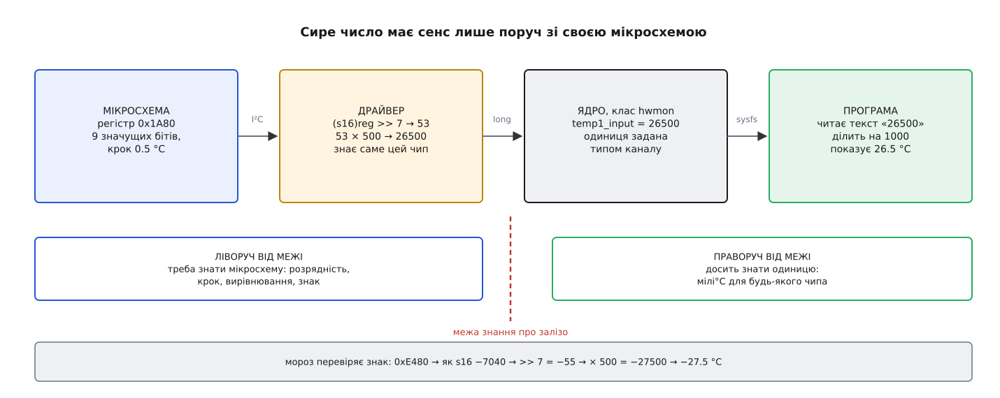
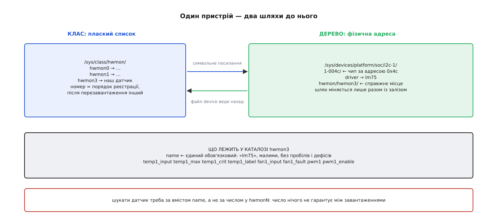
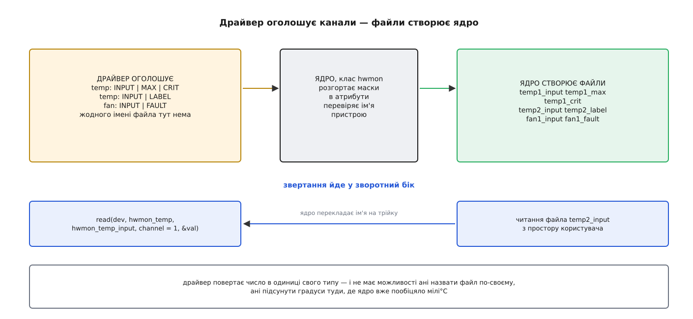

# hwmon: клас датчиків у ядрі й одиниці в sysfs

<preknowlist>
- [Модель пристроїв у sysfs](root:sys-unix/sysfs-device-model) — єдине дерево під'єднаного заліза й те, що властивості пристрою видно назовні як окремі файли-атрибути.
- [Псевдо-ФС: procfs, sysfs, tmpfs, devtmpfs](root:sys-unix/pseudo-filesystems) — файли, яких нема на диску: їхній вміст ядро складає в момент читання.
- [Шина I²C](root:com-devices/i2c) — два дроти, адреса й регістри: як процесор розмовляє з дрібною мікросхемою на платі.
- [Фіксована кома](root:hw-arch/fixed-point) — дробове число як ціле з наперед домовленою вагою молодшого розряду.
- [Блок дробових чисел (FPU)](root:hw-arch/fpu) — окремий вузол процесора зі своїм набором регістрів, стан яких треба зберігати й відновлювати.
</preknowlist>

## Число, яке ні про що не говорить

Ви хочете знати, чи не перегрівається машина. Місць, де щось міряють, у ній назбирується десяток: усередині процесора є діод, на материнській платі сидить окрема мікросхема, яка рахує оберти вентиляторів і стежить за напругами, свій датчик має накопичувач, свій — модуль живлення. Кожну з цих мікросхем спроєктувала інша компанія в інший рік, і кожна тримає результат вимірювання по-своєму. Одна віддає ціле число з кроком пів градуса. Друга — з кроком однієї шістнадцятої. Третя взагалі не знає своєї температури й повідомляє, скільки градусів лишилося до аварійної межі, а саму межу вам треба десь дізнатися окремо.

Тепер уявімо, що ядро віддає ці числа назовні як є — просто вміст регістрів. Програма, яка показує температуру, мусила б тримати в собі довідник: для цієї мікросхеми зсунь на сім бітів і помнож на 500, для тієї — відніми від сотні, для он тієї — глянь спершу в інший регістр, чи не увімкнено розширену роздільність. Довідник довелося б поповнювати щоразу, коли на світ виходить нова плата, — і поповнювати в кожній програмі окремо: у графічному індикаторі, у службі, що вимикає машину при перегріві, у збирачі метрик на сервері.

Це саме та робота, яку розумно зробити один раз. Драйвер уже знає свою мікросхему — знає навіть більше, ніж потрібно програмі. Отже, перетворення сирого числа на величину має жити в драйвері. Але тоді драйвери мусять домовитися між собою: якщо кожен віддаватиме температуру у своїх одиницях і у файлі власної назви, ми повернемося до того самого довідника, лише переставленого на рівень вище.

Така домовленість у ядрі є, і зветься вона **hwmon** (від англ. *hardware monitoring* — «нагляд за залізом»). Це не драйвер і не шина: це клас — спільний контракт, до якого пристає будь-який драйвер, що має що виміряти.

## Що насправді віддає мікросхема

Візьмімо для конкретності класичний датчик температури, який висить на двох дротах I²C і має всього чотири регістри. Температура лежить у першому з них: дев'ять значущих бітів, старший — знак, крок — пів градуса, і все це вирівняно вліво в шістнадцятибітному слові. Молодші сім бітів не означають нічого.

Драйвер читає з шини два байти й отримує, наприклад, `0x1A80`. Перетворення виглядає так:

```
регістр           = 0x1A80 = 0001 1010 1000 0000₂
як знакове 16-бітне = +6784
арифметичний зсув на 7 = 6784 / 128 = 53   ← стільки кроків по 0.5 °C
× 500                  = 26500             ← мілі°C
```

**Той самий датчик, коли надворі мороз, а плата ще не прогрілася:**

```
регістр           = 0xE480
як знакове 16-бітне = 58496 − 65536 = −7040
арифметичний зсув на 7 = −7040 / 128 = −55
× 500                  = −27500            ← мілі°C, тобто −27.5 °C
```

У коді драйвера це два рядки, і головне в них — тип:

```c
/* Дев'ять значущих бітів, вирівняних уліво; крок 0.5 °C.
   Приведення до s16 ставить знаковий біт на своє місце,
   після чого зсув управо стає арифметичним і працює для мінусів. */
static long reg_to_millicelsius(u16 reg)
{
        return ((s16)reg >> 7) * 500;
}
```

Знак тут не дрібниця: якби зсув робили над беззнаковим числом, мороз перетворився б на +228.5 °C — і саме так виглядає більшість помилок у саморобних драйверах.

## Чому 26500, а не 26.5

Драйвер міг би повернути `26.5`. Не повертає — і причина не в смаку.

Ядро не рахує в плаваючій комі. Регістри блока дробових чисел не входять у той набір, який ядро зберігає при вході в системний виклик: зберігати їх на кожному переході коштувало б дорого, а користі не мало б ніякої, бо самому ядру дроби майже ніде не потрібні. Тому код ядра, якому раптом знадобився FPU, зобов'язаний обгорнути обчислення парою викликів, що явно зберігають і відновлюють стан блока, — і робить це хіба що криптографія з векторними інструкціями, де виграш вартий заходу. Заради температури таке ніхто робити не буде. До того ж є архітектури, на яких у ядрі дробів немає взагалі.

Лишається ціле число з наперед домовленою вагою одиниці молодшого розряду. Вагу треба вибрати раз і для всіх — і вибрати так, щоб з одного боку в неї вліз найточніший датчик, який трапиться, а з другого не переповнилося звичайне ціле. Для температури мілі-градус дає обидва запаси: найдрібніший крок серед поширених мікросхем — одна шістнадцята градуса, тобто 62.5 м°C, і він у мілі-градусах ще розрізняється; а діапазон, який поміщається в 32 біти, накриває будь-яку фізику з таким запасом, що ним можна нехтувати.

Так само вибрано вагу для решти величин, і цей перелік — і є ядро домовленості:

```
temp*_input      мілі°C            26500  → 26.5 °C
in*_input        мілівольт          1224  → 1.224 В
fan*_input       обертів за хвилину 1837  → 1837 об/хв
curr*_input      міліампер         12000  → 12 А
power*_input     мікроват       34250000  → 34.25 Вт
energy*_input    мікроджоуль
humidity*_input  мілівідсоток      43200  → 43.2 %
pwm*             0…255 (частка, не величина)
```

Домовленість не всесильна, і межовий випадок у ній названо чесно. Якщо мікросхема віддає не температуру, а напругу з зовнішнього термістора, перерахувати її в градуси можна лише через логарифм — а логарифма в ядрі нема з тієї самої причини, що й дробів. Для таких каналів документація прямо дозволяє тримати у файлах `temp*` **мілівольти**, а рахунок лишити програмі. Це рідкість, але про неї варто знати: одиниця тут задана типом каналу, а не фізикою вимірювання.

Схожа історія з напругами на платі. Мікросхема-наглядач має вхід на кілька вольтів, а виміряти треба дванадцять — тому на платі стоїть подільник із двох резисторів, і мікросхема бачить лише частку. Про подільник вона не знає нічого, тому `in*_input` чесно показує те, що на ніжці. Множення на коефіцієнт подільника історично лишилося в налаштуваннях програми `sensors`, де його вписують рядком `compute` для конкретної моделі плати; сучасні драйвери, яким подільник описали в дереві пристроїв, роблять це самі.

Звідки взявся сам перелік одиниць — питання не риторичне: він старший за ядро в його теперішньому вигляді й прийшов із проєкту, який починався зовсім не як частина ядра.

Контракт народився в проєкті lm_sensors наприкінці 1990-х: спершу як користувацький інструмент із власним переліком мікросхем, потім разом із ним у ядрі з'явилася підсистема I²C, і лише 2005 року датчики виділили в окремий клас — [від lm_sensors до класу hwmon](root:sys-unix/hwmon/hist-from-lm-sensors-to-hwmon.md).



*Сире число має сенс лише поруч зі своєю мікросхемою; драйвер перетворює його на величину в домовленій одиниці, і далі жоден учасник ланцюга вже не мусить знати, який чип стоїть на платі.*

## Один файл — одне число

Домовленості про одиниці замало: треба ще знати, який файл читати. Тут hwmon користується правилом sysfs, яке діє скрізь: **в атрибуті лежить одне значення, і його видно як звичайний текстовий рядок**. Ніякого розбору форматів, ніяких структур.

Назва файла складена за граматикою `<тип><номер>_<що саме>`. Тип — це і є одиниця з таблиці вище: `temp`, `in`, `fan`, `curr`, `power`, `energy`, `humidity`, `pwm`. Номер розрізняє канали одного типу в межах мікросхеми: два датчики температури — це `temp1` і `temp2`. Нумерація починається з одиниці — крім напруг, які історично рахуються з нуля, і за компанію з ними датчиків розкриття корпусу. Останній шматок каже, що це за число: `_input` — виміряне зараз, `_min` і `_max` — межі, за якими мікросхема здійме тривогу, `_crit` — аварійна межа, `_alarm` — чи спрацювала тривога, `_fault` — чи можна взагалі вірити цьому каналу, `_label` — людська назва каналу.

Реальний каталог виглядає так:

```
$ ls /sys/class/hwmon/hwmon3/
name          temp1_input   temp1_max     temp1_crit    temp1_label
device        temp2_input   temp2_max     temp2_crit    temp2_label
fan1_input    fan1_fault    pwm1          pwm1_enable

$ cat /sys/class/hwmon/hwmon3/temp1_input
26500
```

Головне в цьому — не список, а те, що **назва файла є оголошенням типу**. Прочитавши `temp1_input`, програма вже знає одиницю й не веде жодних перемовин. Повний перелік типів, ознак і меж — контракт, який годиться тримати під рукою, — винесено окремо: [Атрибути hwmon у sysfs: типи, ознаки, одиниці](root:sys-unix/hwmon/api-hwmon-attributes.md).

## `name` — єдиний обов'язковий файл

Каталоги класу звуться `hwmon0`, `hwmon1`, `hwmon2` — і це не адреса. Число тут означає лише порядок, у якому пристрої зареєструвалися цього разу. Завантажилися драйвери в іншій послідовності — і `hwmon2` став `hwmon4`. Прив'язувати до цього числа моніторинг — найпоширеніша помилка в цій темі.

Тому єдиний файл, обов'язковий для будь-якого пристрою hwmon, — це `name`: коротке ім'я мікросхеми чи драйвера, малими літерами, без пробілів, дефісів і зірочок. Заборона не примхлива: ім'я потрапляє в конфігурацію користувацьких програм як ключ, і пробіл із дефісом там неможливо розібрати однозначно. Ядро перевіряє ім'я при реєстрації й відмовляє драйверові з поганим, а для драйверів, які беруть ім'я з опису заліза, є службова функція, що замінює заборонені символи підкресленням.

Отже, правильний спосіб знайти свій датчик — обійти `/sys/class/hwmon/*/name`, знайти потрібне ім'я й далі працювати з тим каталогом, у якому воно лежить:

```sh
for d in /sys/class/hwmon/hwmon*; do
        [ "$(cat "$d/name")" = "coretemp" ] || continue
        cat "$d/temp1_input"
done
```

Якщо однакових мікросхем у машині кілька, розрізнити їх допомагає символьне посилання `device` — воно веде на справжній пристрій, до якого прив'язано цей hwmon, і в його шляху вже видно шину й адресу: `.../i2c-1/1-004c`. Цей шлях змінюється лише разом із залізом, тому саме на ньому будують стабільні імена — правилами udev, які створюють посилання за фізичним розташуванням.

> 🔧 **Навіщо це.** Збирач метрик, який запам'ятав `/sys/class/hwmon/hwmon2/temp1_input`, після оновлення ядра почне слати на панель температуру накопичувача під назвою «процесор» — і не помітить цього, бо файл читається успішно. Пошук за `name` при кожному старті коштує кількох мілісекунд і знімає цілий клас таких мовчазних підмін.

## Де це живе в дереві пристроїв

Пристрій hwmon не самостійний. Він завжди дитина того пристрою, який справді щось міряє: мікросхеми на I²C, вузла PCI, платформного пристрою. У дереві це виглядає як окремий вузол `hwmon/hwmonN` під батьком, а `/sys/class/hwmon/hwmonN` — лише символьне посилання на нього, зроблене для зручності обходу.



*Клас дає плаский список усього, що вміє міряти; дерево пристроїв дає фізичну адресу — шину, номер, позицію на ній. Посилання `device` веде з класу назад у дерево.*

Наслідок такої підпорядкованості практичний: файли живуть рівно стільки, скільки триває прив'язка драйвера до пристрою. Відв'яжете драйвер — каталог зникне цілком, разом з усіма межами, які ви туди записали. Те саме станеться при висмикуванні пристрою: відкритий дескриптор лишиться, але читання з нього почне повертати помилку.

## Драйвер оголошує канали, а не файли

Лишається питання, як ядро змушує сотні незалежних драйверів дотримуватися контракту. Найпростіший спосіб — покластися на сумлінність: хай кожен драйвер сам створює свої файли з правильними іменами. Так і було раніше, і результат передбачуваний: у різних драйверах ті самі за суттю атрибути звалися по-різному, а нові — як заманеться авторові.

Сучасний спосіб інший. Драйвер не створює файлів узагалі. Він **оголошує канали**: скільки їх, якого типу кожен і які ознаки в нього є. Оголошення — це масив описів, де тип каналу заданий переліком, а набір ознак — бітовою маскою. Файли за цим оголошенням створює вже ядро.

```c
static const struct hwmon_channel_info * const chip_info[] = {
        HWMON_CHANNEL_INFO(temp,
                           HWMON_T_INPUT | HWMON_T_MAX | HWMON_T_CRIT,
                           HWMON_T_INPUT | HWMON_T_LABEL),
        HWMON_CHANNEL_INFO(fan,
                           HWMON_F_INPUT | HWMON_F_FAULT),
        NULL
};
```

Читання й запис драйвер віддає трьома зворотними викликами. `is_visible` вирішує, чи взагалі показувати цей атрибут і з якими правами — повертає `0` (файла не буде), `0444` (лише читання) або `0644`. `read` дістає значення й зобов'язаний повернути його **в одиниці свого типу**; `write` приймає записане.

```c
static int chip_read(struct device *dev, enum hwmon_sensor_types type,
                     u32 attr, int channel, long *val)
{
        struct chip_data *data = dev_get_drvdata(dev);
        u16 reg;
        int err;

        switch (type) {
        case hwmon_temp:
                err = chip_read_temp_reg(data, channel, attr, &reg);
                if (err)
                        return err;
                *val = ((s16)reg >> 7) * 500;   /* мілі°C */
                return 0;
        default:
                return -EOPNOTSUPP;
        }
}
```

Форма виклику тут промовиста: ядро питає не «прочитай файл temp1_input», а «дай значення типу `hwmon_temp`, ознака `input`, канал 0». Розбір імені файла лишився в ядрі, і драйвер більше не має жодної можливості назвати свій атрибут `temp1_celsius` або віддати градуси замість мілі-градусів у файлі, який ядро вже позначило як температурний.



*Оголошення каналів іде в один бік, звертання — у зворотний: ядро само перекладає ім'я файла на трійку «тип, ознака, канал» і кличе драйвер.*

Реєстрація зводиться до одного виклику, який приймає ім'я, приватні дані драйвера й оголошення каналів; варіант із префіксом `devm_` прив'язує пристрій hwmon до життя батьківського, і знімати його руками вже не треба:

```c
hwmon = devm_hwmon_device_register_with_info(dev, "lm75", data,
                                             &chip_chip_info, NULL);
```

Як із цього збирається робочий драйвер — від читання шини до кешування й реєстрації в тепловому каркасі — розібрано у вставці [Мінімальний драйвер hwmon для датчика на I²C](root:sys-unix/hwmon/proj-hwmon-driver.md).

## Кожне читання — це справжня транзакція

Файл `temp1_input` виглядає як файл, але за кожним його читанням стоїть похід на шину. Для мікросхеми на I²C, що працює на 100 кГц, обмін «вибери регістр — прочитай два байти» забирає близько пів мілісекунди самого лише часу на дротах, не рахуючи черги до шини, яку ділять інші учасники. А деякі датчики ще й перетворюють не миттєво: після команди їм треба десятки або сотні мілісекунд, поки аналого-цифровий перетворювач добере свою точність.

Звідси дві речі, які роблять драйвери. По-перше, вони **кешують**: прочитавши значення, драйвер запам'ятовує момент і протягом наступної секунди-двох віддає збережене, не турбуючи шину. По-друге, доступ до мікросхеми серіалізується замком. Одну команду SMBus ядро й так проводить цілою — адаптер шини на час обміну замкнено, — але кеш і послідовності з кількох транзакцій підряд (вибрати регістр, прочитати, звірити біт стану) захистити нікому, крім самого драйвера.

> 🔧 **Навіщо це.** Опитувати `temp1_input` десять разів на секунду безглуздо двічі: дев'ять разів із десяти ви прочитаєте той самий кешований байт, а там, де кешу нема, — займете шину, на якій, буває, висять не лише датчики. Розумний період — від секунди; для аварійного нагляду краще не частішати опитування, а виставити мікросхемі межу й читати `_alarm`.

## Запис: межі, вентилятор і хто має право

Частина атрибутів доступна на запис, і поділяються вони на дві дуже різні групи.

Перша — межі: `temp1_max`, `in0_min`, `fan1_min`. Записане число їде в регістр мікросхеми, і далі вона стежить за ним сама, без участі процесора. Мікросхема має право округлити ваше значення до свого кроку, тому прочитане назад може відрізнятися від записаного — це не помилка, а нормальна поведінка.

Друга — керування вентилятором. `pwm1` приймає число від 0 до 255 — це не швидкість і не відсоток обертів, а шпаруватість сигналу, яким живлять вентилятор; на скільки обертів це перетвориться, залежить від конкретного вентилятора. Поруч живе `pwm1_enable`, який вибирає, хто взагалі керує: `0` — керування вимкнено, вентилятор крутиться на повну; `1` — ручний режим, швидкість береться з `pwm1`; `2` і більше — автоматичні режими самої мікросхеми, коли вона сама зіставляє температуру зі своєю кривою.

Різниця між цими двома групами стає болючою в одному місці. Перевівши вентилятор у ручний режим, ви забрали керування в мікросхеми — і якщо ваша програма після цього впаде, ніхто його не поверне: вентилятор так і крутитиметься на заданих ста двадцяти з двохсот п'ятдесяти п'яти, поки хтось не запише в `pwm1_enable` двійку. Частина мікросхем має від цього захист — власний сторожовий таймер, що сам повертає автоматичний режим, якщо до нього довго не зверталися, — але покладатися на його наявність не можна.

Права на всі ці файли роздає драйвер через `is_visible`, і типова картина така: `_input` — `0444` для всіх, межі й керування — `0644`, тобто тільки для власника, яким у sysfs є root. Роздавати доступ ширше — справа політики, а не ядра: це роблять правилами [udev](root:sys-unix/udev-rules), які міняють групу й режим потрібних атрибутів після появи пристрою.

## Тривоги: чому їх усе одно доводиться опитувати

Файли `_alarm` показують, що мікросхема помітила вихід за межу: одиниця означає тривогу, нуль — усе гаразд. Поруч `_fault` каже інше — що самому вимірюванню вірити не варто: обірваний термодіод, знятий вентилятор. Читати `temp3_input`, коли `temp3_fault` дорівнює одиниці, немає сенсу.

Прикрий бік у тому, що біти тривоги в багатьох мікросхемах **липкі**: біт піднявся, коли межу перетнули, і лишається піднятим до першого читання, після чого скидається. Це зроблено, щоб коротке перевищення не проґавили, — але означає, що читання тривоги є її споживанням, і два незалежні наглядачі за тією самою мікросхемою відберуть подію один в одного. Апаратний вивід тривоги на платі зазвичай нікуди не приєднаний, тож переривання по ньому не приходить, і навіть найакуратніший наглядач урешті опитує стан у циклі.

## hwmon міряє, thermal вирішує

Про політику в hwmon немає нічого. Тут можна дізнатися температуру й дізнатися, що вона перевищила виставлену межу, — але ніде не сказано, що при цьому робити: пригальмувати процесор, розкрутити вентилятор, вимкнути машину. Це свідома межа: рішеннями опікується окремий тепловий каркас ядра, який оперує зонами, точками спрацювання й пристроями охолодження. Датчик hwmon може віддати себе цьому каркасові як джерело температури — для цього драйвер ставить в оголошенні відповідну ознаку, і ядро само реєструє його теплову зону з опису заліза; докладніше — [тепловий каркас ядра](root:sys-unix/thermal-management-framework).

Зв'язок працює і у зворотний бік, і це пояснює дивину, яку бачить кожен, хто хоч раз запускав `sensors` на ноутбуці. Теплові зони, зі свого боку, теж показуються як пристрої hwmon — щоб їх бачили ті самі програми. Тому одна фізична точка вимірювання може трапитися у виводі двічі: раз від драйвера мікросхеми, раз від теплової зони, яка на цю саму мікросхему й спирається.

## Що з цього виходить

Сам hwmon робить напрочуд мало. Він не читає шин, не знає жодної мікросхеми, не приймає рішень. Усе, що він дає, — граматика назв, одиниця на кожен тип і обов'язкове ім'я.

Але саме цього виявилося досить, щоб `sensors`, служба нагляду й панель у стільниці працювали з мікросхемою, якої не існувало на світі, коли їх писали. Драйвер нової плати оголошує свої канали — і його температура з'являється в усіх трьох програмах одночасно, без жодного рядка змін у кожній із них. Клас коштує ядру кількох сотень рядків коду; довідник мікросхем, від якого він рятує, коштував би кожній програмі окремо й ніколи не був би повним.
