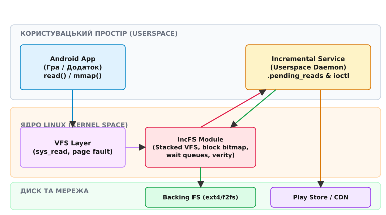
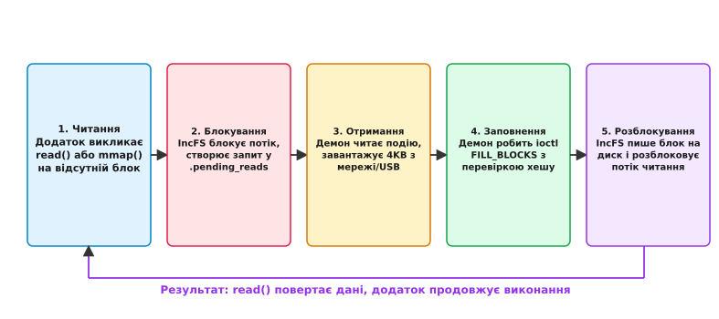

# Інкрементальна файлова система IncFS (Android Incremental Delivery)

<preknowlist>
- [Віртуальна файлова система VFS](root:sys-unix/vfs-layer) — абстракція в підсистемі ядра Linux, яка об'єднує різні файлові системи під єдиним VFS API.
- [Відображення пам'яті mmap](root:sys-unix/mmap-model) — механізм проектування вмісту файлів безпосередньо у віртуальний адресний простір процесу.
- [Перевірка цілісності fs-verity](root:sys-unix/fs-verity) — криптографічна верифікація окремих блоків файлу за допомогою хеш-дерев.
- [Файлові системи користувацького простору FUSE](root:sys-unix/fuse-userspace-filesystems) — механізм винесення логіки VFS у процес користувача через `/dev/fuse`.
</preknowlist>

Сучасні мобільні ігри класів AAA та графічно насичені додатки досягають обсягів у 15–30 гігобайт. Коли користувач натискає кнопку «Завантажити» в магазині додатків, традиційний процес встановлення вимагає збереження дистрибутива повністю перед першим запуском. При швидкості мобільного зв'язку 50 Мбіт/с очікування розтягується на 40–80 хвилин, і значна частина користувачів скасовує встановлення, не дочекавшись кінця. Рішення полягає в тому, щоб дозволити додатку стартувати вже тоді, коли на диску є перші 10% даних (головний виконуваний файл, рушій та ресурси першої локації), а решту 90% дозавантажувати фоново під час гри.

Однак звичайні файлові системи не призначені для виконання файлів, частини яких відсутні на диску. Якщо потік виконання звертається до відсутнього байта у пам'яті або викликає `read()`, ядро повернуло б помилку або заповнило буфер нулями, зруйнувавши роботу додатку. Щоб зробити процес дозавантаження прозорим для програм, у ядрі Linux для операційної системи Android було створено інкрементальну файлову систему — **IncFS** (*Incremental File System*, від лат. *incrementum* — приріст, надбавка).

---

## 1. Проблема прозорого доступу до неповних даних

Головна вимога до технології інкрементальної дистрибуції (Android Incremental Delivery) полягає в тому, що сам додаток (наприклад, гра на рушії Unreal Engine або Unity) **не повинен знати**, що частина його файлів ще не завантажена. Додаток використовує стандартні системні виклики POSIX: `open()`, `read()`, `lseek()`, `mmap()`, `stat()`.

Якщо спробувати реалізувати таке потокове завантаження у звичайній файловій системі (ext4 або f2fs), виникає декілька фундаментальних перешкод:

- **Розріджені файли (Sparse Files):** Зауважимо, що розріджений файл дозволяє розмітити 2-гігабайтний файл, виділивши на диску лише 100 мегабайт. Проте при зчитуванні незаповнених «дірок» розрідженого файлу VFS негайно повертає нульові байти. Для прикладного коду це виглядає як пошкодження текстур чи конфігурацій.
- **Відсутність механізму очікування у ядрі:** Ядро Linux не має вбудованого способу призупинити виклик `read()` звичайного файлу і попросити зовнішній мережевий демон терміново завантажити відсутню сторінку з інтернету.
- **Накладні витрати FUSE:** [Файлові системи користувацького простору FUSE](root:sys-unix/fuse-userspace-filesystems) дозволяють перехоплювати читання, але створюють величезне навантаження на процесор через постійні переключення контексту між ядром та користувацьким простором.

Детальний аналіз передумов створення IncFS та альтернативних підходів наведено у вставці [Історія виникнення Android Incremental Delivery та IncFS](root:sys-unix/incfs-incremental-filesystem/hist-android-incremental.md).

Спеціалізований модуль IncFS розв'язує цю проблему шляхом реалізації шаруватої файлової системи, яка перехоплює звернення VFS до відсутніх блоків і прозоро блокує потік читання до моменту, поки потрібний блок не буде доставлений фоновим сервісом.

---

## 2. Архітектура IncFS: Шарувата файлова система (Stacked VFS)

За своєю структурою IncFS належить до класу **шаруватих файлових систем** (*stacked filesystems*). Вона не управляє фізичними секторами накопичувача (UFS або eMMC) напряму. Натомість IncFS монтується поверх вже існуючого каталогу в базовій файловій системі (найчастіше ext4 або f2fs у розділі `/data`).

```
+-------------------------------------------------------------------+
|               Потік користувача (Гра / Додаток)                   |
+-------------------------------------------------------------------+
       | sys_read()                           | mmap() page fault
       v                                      v
+-------------------------------------------------------------------+
|                 Віртуальна файлова система (VFS)                  |
+-------------------------------------------------------------------+
                               |
                               v
+-------------------------------------------------------------------+
|                           Модуль IncFS                            |
|  - Бітмап присутності блоків (4KB)                                |
|  - Черга заблокованих потоків (wait_queue)                        |
+-------------------------------------------------------------------+
      | (Блок є)                                   | (Блок відсутній)
      v                                            v
+-----------------------------+       +-----------------------------+
|    Базова FS (ext4 / f2fs)  |       |     Службовий файл          |
|    Зчитування сторінки      |       |    .pending_reads           |
+-----------------------------+       +-----------------------------+
                                                   |
                                                   v
                                      +-----------------------------+
                                      |     Incremental Service     |
                                      |    (Потокове завантаження)  |
                                      +-----------------------------+
```


*_Архітектура IncFS: потік виконання від додатку користувача до ядра Linux, демона Incremental Service та віддаленого сервера CDN_*

При монтуванні екземпляра IncFS точка монтування (наприклад, `/data/incremental/MT_game_123`) надає додатку повноцінну файлову структуру. Кожен файл у цій файловій системі має дві сутності:

1. **Базовий файл (Backing File):** Фізичний файл на ext4/f2fs, у якому зберігаються реально завантажені блоки даних та службові заголовки.
2. **Віртуальний файл IncFS:** Об'єкт VFS, який бачать додатки. При виклику `stat()` система повертає **повний номінальний розмір файлу** (наприклад, 2 147 483 648 байт для 2-гігабайтного APK), навіть якщо на диску наразі збережено лише 5 мегабайт.

### Унікальний ідентифікатор (File ID) та каталог `.index`

Кожен файл в IncFS отримує криптографічно стійкий 128-бітний ідентифікатор — **File ID** (UUID). У кореневому каталозі монтування IncFS автоматично створюється службова директорія `.index`. У ній знаходяться посилання, назви яких відповідають шістнадцятковому представленню File ID. 

Це забезпечує швидкий доступ демона завантаження до будь-якого файлу за його ідентифікатором, незалежно від того, як файл перейменовується або переміщується у каталогах користувача.

### Реалізація VFS-таблиць операцій у ядрі

Модуль ядра IncFS перевизначає стандартні VFS-структури операцій файлу `struct file_operations` та операцій іноди `struct inode_operations`:

- `incfs_file_read_iter()` — заступає місце стандартного читача; перевіряє наявність блоків перед зчитуванням.
- `incfs_mmap()` — перехоплює відображення у віртуальну пам’ять та підключає власну таблицю операцій `struct vm_operations_struct`.
- `incfs_page_mkwrite()` — керує записом і підкачуванням сторінок при обробці збоїв сторінок відображеної пам'яті.

При виклику `incfs_mount()` ядро виділяє структуру суперблока `struct super_block`, зв'язує її з базовою файловою системою і створює внутрішні об'єкти `struct incfs_mount_info`. Кожна інода в IncFS зберігає вказівник на нижньорівневу іноду `backing_inode`, передаючи запити запису на фізичний диск без перевиділення власних блоків.

---

## 3. Анатомія інкрементального файлу та бітова карта блоків

Дані всередині інкрементального файлу розбиваються на фіксовані блоки розміром **4096 байт** (4 КБ), що відповідає стандартному розміру сторінки пам'яті (*page size*) в архітектурі ARM64 та x86_64.

Для кожного файлу IncFS підтримує внутрішню структуру даних — **карту заповнення блоків** (*block presence map* або бітмап).

```
Структура інкрементального файлу (Загальний розмір: 16 КБ = 4 блоки):

[ Заголовок IncFS ] [ Бітмап: 1 | 0 | 1 | 0 ] [ Блок 0: ДАНІ ] [ Блок 2: ДАНІ ]
                                                 (4096 Б)        (4096 Б)

Блок 0: Присутній на диску (Біт = 1) -> Зчитується миттєво
Блок 1: Відсутній (Біт = 0)          -> Потік блокується у ядрі
Блок 2: Присутній на диску (Біт = 1) -> Зчитується миттєво
Блок 3: Відсутній (Біт = 0)          -> Потік блокується у ядрі
```

Заголовок базового файлу містить:
- **Сигнатура (Magic Number):** вісім байтів, що кодують рядок «INCFS» — за нею ядро впізнає базовий файл IncFS.
- **128-бітний File ID.**
- **Повний розмір файлу у байтах.**
- **Таблицю зміщень блоків:** вказує фізичне розташування кожного 4KB блоку всередині базового файлу.
- **Прапори стиснення:** IncFS підтримує прозоре стиснення окремих блоків алгоритмами **LZ4** або **ZSTD**. Якщо блок стиснено, демон передає його стиснутим, ядро так і зберігає його в базовому файлі, а розпаковує вже під час читання — наповнюючи сторінковий кеш готовими 4096 байтами.

### Обчислення накладних витрат пам'яті бітмапа

Бітова карта наявності блоків зберігається у компактному вигляді. Для файлу розміром 2 гігобайти (2 147 483 648 байт) загальна кількість 4KB блоків становить:

```
Кількість блоків = 2 147 483 648 / 4096 = 524 288 блоків
Обсяг бітмапа    = 524 288 бітів / 8 = 65 536 байтів (рівно 64 КБ)
```

Таким чином, бітова карта 2-гігабайтного ігрового архіву займає всього 64 кілобайти оперативної пам'яті в ядрі, що дозволяє тримати карти заповнення відкритих файлів у швидкому слаб-кеші ядра (*slab allocator*).

---

## 4. Механізм перехоплення читання: Від Page Fault до ioctl

Щоб зрозуміти, як IncFS забезпечує прозорість для прикладного коду, простежимо ланцюжок подій при спробі зчитати відсутній блок.

```
Додаток               Ядро (IncFS)               .pending_reads            Incremental Service
   |                       |                           |                            |
   |--- 1. read(blk 1) --->|                           |                            |
   |                       |-- 2. Перевірка бітмапа    |                            |
   |                       |   (Блок 1 відсутній!)     |                            |
   |                       |-- 3. Блокування потоку    |                            |
   |                       |   (wait_event)            |                            |
   |                       |-- 4. Запис події -------->|                            |
   |                       |                           |<--- 5. read() події -------|
   |                       |                           |     (FileID, Block 1)      |
   |                       |                           |                            |
   |                       |                           |--- 6. Завантаження з CDN ->|
   |                       |                           |                            |
   |                       |<---------------- 7. ioctl(FILL_BLOCKS) ----------------|
   |                       |-- 8. Запис блоку на диск  |                            |
   |                       |-- 9. Бітмап = 1           |                            |
   |                       |-- 10. Розблокування потоку|                            |
   |<-- 11. Успіх read() --|                           |                            |
```


*_Життєвий цикл завантаження відсутнього блоку: від блокування read() до ioctl FILL_BLOCKS і відновлення виконання_*

### Крок 1: Перехоплення виклику
Користувацький процес викликає системний виклик `read(fd, buf, 4096)` або звертається до сторінки пам'яті через [відображення mmap](root:sys-unix/mmap-model). Останнє спричиняє збій сторінки (*page fault*), який перехоплює й обробляє ядро. 

Ланцюжок викликів у ядрі Linux має вигляд:
`do_user_addr_fault()` -> `handle_mm_fault()` -> `__do_fault()` -> `incfs_fault()` -> `incfs_read_page()`. VFS передає обробку підсистемі IncFS.

### Крок 2: Перевірка бітового масиву
IncFS обчислює індекс блоку `block_index = offset / 4096` і перевіряє відповідний біт у карті заповнення.
- **Якщо біт дорівнює 1 (блок є):** IncFS перенаправляє запит читання до базової файлової системи (ext4/f2fs). Дані зчитуються зі сторінкового кешу та повертаються додатку за мікросекунди — так само швидко, як у звичайній файловій системі.
- **Якщо біт дорівнює 0 (блок відсутній):** Починається процедура інкрементального очікування.

### Крок 3: Блокування потоку у ядрі
Ядро створює елемент очікування у внутрішній черзі `wait_queue_head_t` і переводить потік додатку у стан `TASK_INTERRUPTIBLE`. З точки зору операційної системи потік заснув на системному виклику `read()`, подібне до очікування даних із сокета чи пайпа.

Якщо потік користувача отримує критичний сигнал переривання (наприклад, `SIGKILL` при закритті гри користувачем), виклик `wait_event_interruptible()` переривається, елемент видаляється з черги, а ядро повертає внутрішній код `-ERESTARTSYS`. Для користувацького процесу це виглядає як обірваний сигналом `read()` — помилка `EINTR`, або ж автоматичний перезапуск виклику, якщо обробник сигналу встановлено з `SA_RESTART`.

### Крок 4: Сповіщення через `.pending_reads`
IncFS формує структуру запиту `struct incfs_pending_read_info` і додає її до списку подій службового файлу `.pending_reads`. 

Фоновий процес демона (`IncrementalService`), який слухає файл `.pending_reads` за допомогою системного виклику `poll()` або `epoll()`, отримує сигнал про наявність нових даних.

### Крок 5: Завантаження та заповнення блоку через `ioctl`
Демон зчитує з `.pending_reads` UUID файлу та номер відсутнього блоку, після чого виконує паралельний HTTP-запит до CDN-сервера або зчитує блок через кабель USB (у випадку команд `adb install-incremental`).

Отримавши 4096 байт даних, демон викликає `ioctl()` з командою `INCFS_IOC_FILL_BLOCKS` над дескриптором **самого інкрементального файлу**: структура заповнення не містить File ID, тож файл визначає саме дескриптор — демон відкриває його за ідентифікатором у каталозі `.index`.

:::tabs
```c
/* Виклик ioctl заповнення блоку мовою C */
struct incfs_fill_block block_data = {
    .block_index = 1,
    .data_len = 4096,
    .data = (uint64_t)(uintptr_t)user_buffer,
    .compression = 0
};

struct incfs_fill_blocks fill_args = {
    .count = 1,
    .fill_blocks = (uint64_t)(uintptr_t)&block_data
};

if (ioctl(incfs_file_fd, INCFS_IOC_FILL_BLOCKS, &fill_args) < 0) {
    perror("Помилка виконання INCFS_IOC_FILL_BLOCKS");
}
```
```cpp
// Виклик ioctl заповнення блоку мовою C++20
IncfsFillBlock block_data{
    .block_index = 1,
    .data_len = 4096,
    .data = reinterpret_cast<uint64_t>(user_buffer.data())
};

IncfsFillBlocks fill_args{
    .count = 1,
    .fill_blocks = reinterpret_cast<uint64_t>(&block_data)
};

if (::ioctl(incfs_file_fd, INCFS_IOC_FILL_BLOCKS, &fill_args) < 0) {
    std::cerr << "Помилка виконання INCFS_IOC_FILL_BLOCKS: " 
              << std::generic_category().message(errno) << '\n';
}
```
:::

### Крок 6: Оновлення стану та розблокування
При виконанні `INCFS_IOC_FILL_BLOCKS` ядро:
1. Записує отримані 4096 байт у відповідне зміщення базового файлу.
2. Встановлює біт присутності даного блоку в `1`.
3. Викликом `wake_up_interruptible()` розблоковує потік додатку, що чекав у черзі.

Потік додатку прокидається, системний виклик `read()` копіює щойно записані байти в буфер користувача і повертає успішний результат `4096`. Гра продовжує виконання без жодної помилки чи збою!

Повну специфікацію викликів `ioctl` та контроль-файлів наведено у вставці [Специфікація ioctl та системних інтерфейсів IncFS](root:sys-unix/incfs-incremental-filesystem/api-incfs-ctl.md), а практичний приклад коду демона — у вставці [Практична реалізація демона заповнення блоків IncFS](root:sys-unix/incfs-incremental-filesystem/proj-incfs-daemon.md).

---

## 5. Криптографічна верифікація даних та інтеграція з fs-verity

Забезпечення прозорого завантаження даних із мережі створює серйозну загрозу безпеці: що завадить шкідливому фоновому процесу або підміненому мережевому серверу передати пошкоджений або модифікований блок, підмінивши виконуваний код бінарного файлу APK?

Для захисту цілісності IncFS тісно інтегрована з підсистемою ядра [fs-verity](root:sys-unix/fs-verity).

```
Корінь дерева Меркла (Merkle Root Hash) - підписаний розробником
                       [ Root Hash ]
                        /         \
              [ Hash A ]           [ Hash B ]
               /      \             /      \
          [ H(B0) ]  [ H(B1) ]  [ H(B2) ]  [ H(B3) ]
             |          |          |          |
          [Block 0]  [Block 1]  [Block 2]  [Block 3]
```

При створенні інкрементального файлу за допомогою `INCFS_IOC_CREATE_FILE` йому передається підпис та корінь дерева хешів Меркла (*Merkle Tree*).

Коли демон передає блок через `INCFS_IOC_FILL_BLOCKS`:
1. IncFS обчислює SHA-256 хеш отриманого 4KB буфера.
2. Ядро звіряє цей хеш із відповідним вузлом дерева Меркла.
3. **Якщо хеш збігається:** блок приймається та записується на диск.
4. **Якщо хеш не збігається:** `ioctl` завершується помилкою, блок на диск не потрапляє, біт присутності лишається нульовим, а потік додатку зрештою отримує помилку читання.

Це унеможливлює модифікацію коду гри або її ресурсів під час фонового завантаження.

---

## 6. Обробка збоїв, таймаути та випереджальне завантаження

Мобільні мережі відрізняються нестабільністю. Якщо пристрій входить у тунель або втрачає покриття Wi-Fi, фонове завантаження може зупинитися. Потік додатку не може блокуватися у ядрі вічно.

### Таймаути читання (`read_timeout_ms`)

IncFS підтримує параметр конфігурації таймауту читання (`read_timeout_ms`). Якщо потік заблоковано на відсутньому блоці понад вказаний інтервал (наприклад, 10 000 мс):

- Для звичайного системного виклику `read()` ядро перериває очікування та повертає помилку `ETIME`.
- Для звернення через [відображення mmap](root:sys-unix/mmap-model) ядро надсилає процесу сигнал `SIGBUS` (*Bus Error*). Додаток може перехопити цей сигнал і показати користувачеві діалогове вікно: *«Мережеве з'єднання втрачено. Будь ласка, перевірте зв'язок»*.

### Випереджальне завантаження (Predictive Loading) через `.log`

Щоб мінімізувати ймовірність блокування потоків користувача, IncFS надає механізм журналювання звернень через службовий файл `.log`.

Демон користувацького простору аналізує файл `.log` у реальному часі. Оскільки ігри завантажують ресурси послідовно (наприклад, при вході в нову локацію спочатку зчитується заголовок геометрії, потім текстури персонажів), демон може бачити шаблони звернень.

Виявивши звернення до блоку `N`, демон заздалегідь завантажує блоки `N+1`, `N+2`, ..., `N+16` до того, як гра встигне викликати для них `read()`. Це забезпечує гладкий геймплей без мікрозависань (*stutters*).

---

## 7. Відмовостійкість та крайні випадки (Fault Tolerance & Edge Cases)

У жорстких умовах мобільної ОС IncFS обробляє такі крайні сценарії:

### Переповнення диска (ENOSPC)
Якщо під час заповнення блоків через `INCFS_IOC_FILL_BLOCKS` фізичний накопичувач ext4/f2fs вичерпує вільне місце, базовий системний виклик `write` повертає `ENOSPC`. IncFS транслює цю помилку демону і залишає біт присутності блоку рівним 0, дозволяючи мобільній ОС ініціювати очищення тимчасового кешу.

### Примусове розмонтування (umount -f)
Якщо демон завантаження або ОС ініціює розмонтування файлової системи до заповнення всіх блоків, IncFS будить усі заблоковані в `wait_queue` потоки й повертає їм помилку замість даних, тож жоден процес не лишається висіти на `read()` назавжди.

---

## 8. Простеження та діагностика IncFS через ftrace та sysfs

Інженери та розробники системного ПЗ можуть аналізувати стан IncFS у запущеній ОС Android або настільному Linux через підсистеми ядра `ftrace` та `sysfs`:

### Точки простеження ftrace (Tracepoints)
IncFS реєструє власну групу точок трасування в каталозі `/sys/kernel/tracing/events/incfs/`. Конкретний перелік подій залежить від версії ядра, тому його дивляться просто списком файлів у цьому каталозі; сталим лишається головне — подія про запит читання, що став у чергу очікування, і подія про обслуговування цього запиту після заповнення блоку.

Ввімкнення простеження виконується через каталог `/sys/kernel/tracing/`:
```bash
ls /sys/kernel/tracing/events/incfs/            # які події є в цьому ядрі
echo 1 > /sys/kernel/tracing/events/incfs/enable # увімкнути всі події підсистеми
cat /sys/kernel/tracing/trace_pipe
```

---

## 9. Підсумок та практичне значення IncFS

> 🔧 **Навіщо це.**
> Інкрементальна файлова система IncFS є фундаментальною технологією Android 11+, яка кардинально змінила дистрибуцію великого програмного забезпечення. Вона дозволяє запускати багатогігабайтні ігри та додатки за лічені секунди після початку завантаження, зводячи очікування користувача до мінімуму. Завдяки реалізації у вигляді шаруватого модуля ядра Linux, IncFS досягає повної прозорості для POSIX-додатків, нативної швидкості читання заповнених даних та надійного захисту цілісності через інтеграцію з `fs-verity`.

Характеристики та параметри IncFS у порівнянні з іншими файловими механізмами:

| Параметр | Звичайна FS (ext4/f2fs) | FUSE | **IncFS (Incremental FS)** |
| :--- | :--- | :--- | :--- |
| **Рівень виконання** | Ядро Linux | Простір користувача | **Ядро Linux (Шарувата VFS)** |
| **Швидкість читання наявних даних** | Нативна (100%) | Повільна (50–70%) | **Нативна (99–100%)** |
| **Прозорість для POSIX read/mmap** | Так | Так | **Так** |
| **Реакція на відсутній блок** | Повертає 0 або помилку | Переключення контексту | **Блокування потоку до ioctl** |
| **Перевірка цілісності** | Ні | Кастомна | **Вбудована (fs-verity / Merkle)** |
