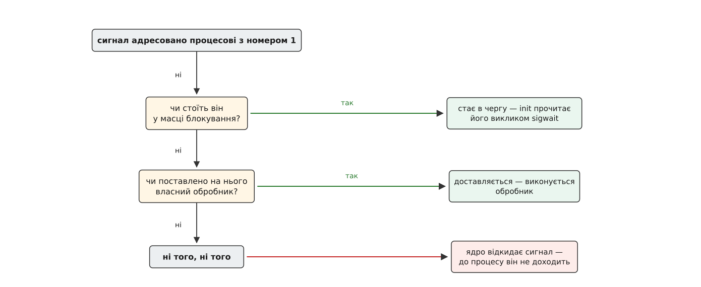
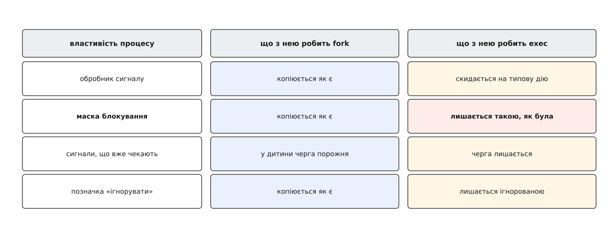

# ⚙️ Крихітний init на сотню рядків C

Застосунок, що опинився номером 1 у контейнері, поводиться дивно: команда зупинки до нього не доходить, а мертві процеси навколо не зникають. Найкоротший спосіб побачити, звідки береться одне й друге, — власноруч написати ту крихітну програму-init, яку в такі образи кладуть, і переконатися, що жодну її частину викинути не можна.

## Три обов'язки — і жодного понад

Ставимо межу одразу, бо спокуса написати менеджер служб виникає на другому кроці. Наша програма робить рівно три речі.

Перше — **запустити справжній застосунок**, заради якого все й затівалося: `fork`, а в дитині `exec`. Другого способу народити процес у Unix немає.

Друге — **ховати всіх, кого до нас приписали**. Не лише власну дитину: до номера 1 приписуються сироти цілого простору імен, і їхні залишкові записи забирати нікому, крім нас.

Третє — **пересилати сигнали зупинки застосункові й повертати назовні його код виходу**. Без першого зупинка контейнера перетворюється на добивання, без другого той, хто нас запустив, не відрізнить успіху від падіння.

Усе разом — приблизно шістдесят рядків. Кожен із трьох обов'язків має свою пастку, і всі три пастки тихі: програма запускається, працює і роками поводиться майже правильно.

## Обробник чи блокування

Найочевидніший каркас — поставити обробники на `SIGCHLD`, `SIGTERM`, `SIGINT`, `SIGHUP` і в них усе робити. Каркас цей поганий, і не через стиль. Усередині обробника дозволено вкрай мало функцій — він може перервати основний код у будь-якій точці, зокрема посеред чужої, наполовину переставленої структури; чому саме так і що з цього виходить — [окрема тема](topic:sys-unix/async-signal-safety).

Тому чесний init обробників не ставить узагалі. Він **блокує** потрібні сигнали й читає їх явно — викликом `sigwait`, що спить, поки в черзі порожньо, і віддає номер сигналу, щойно там щось з'явиться. Ніякого переривання посеред чужої роботи: сигнал приходить рівно в тій точці, де ми на нього чекаємо. Блокування й пряме читання відкладених сигналів — [окремий механізм](topic:sys-unix/signal-mask-signalfd) із власними правилами.

Тут виникає законне заперечення. Сигнал із типовою дією, посланий процесові з номером 1, ядро відкидає, поки на ньому немає обробника, — а ми обробників саме й не ставимо. Виходить, `SIGTERM` до нас не дійде?

Дійде, і причину варто знати. Ядро перевіряє долю сигналу по порядку, і **першою** перевіркою є блокування: заблокований сигнал не відкидається ніколи. Логіка проста — поки сигнал стоїть у черзі, процес ще встигне поставити на нього обробник, тож вирішувати наперед, що реагувати нема кому, було б передчасно.



*Точне правило має дві умови водночас: ядро відкидає сигнал, лише коли той **не заблокований** і на ньому **не стоїть** обробник.*

Отже, обробник — не єдиний спосіб узяти сигнал під контроль, а лише один із двох. Блокування дає той самий результат і не тягне за собою обмежень, які накладає обробник.

## Блокувати треба раніше, ніж з'явиться дитина

Порядок двох перших дій виглядає байдужим, але саме він розділяє робочу програму й програму, що зависає раз на тисячу запусків.

Якщо спершу зробити `fork`, а блокування поставити після нього, відкривається вікно, у яке провалюється `SIGCHLD`. Застосунок може впасти миттєво — не знайшлася бібліотека, зайнятий порт, — і сповіщення про його смерть прийде до нас, поки сигнал ще не заблокований і обробника на ньому немає. Типова дія `SIGCHLD` — «нічого не робити», тож сповіщення просто зникне. Далі ми входимо в `sigwait` і спимо назавжди, чекаючи на звістку, яка вже приходила. Застосунок мертвий, контейнер «працює».

Друге вікно вужче, але з тими самими наслідками: `SIGTERM`, що прилетів між `fork` і моментом, коли ми записали номер дитини, пересилати нема куди.

Блокування **до** `fork` закриває обидва вікна одним рухом: жоден сигнал не пропаде, бо всі вони від цієї миті стають у чергу й дочекаються нас.

Але з цього ж випливає єдина неочевидна дія в усій програмі — **зняти маску в дитині**. Річ у тім, що `fork` і `exec` поводяться з диспозицією сигналів по-різному: [заміна образу](topic:sys-unix/exec-semantics) скидає обробники на типову дію (код старої програми зник, викликати нема чого), а от **маска блокування переживає заміну незайманою**.



*Успадковується все, але exec скидає лише обробники. Маска йде далі — разом із новою програмою, яка про неї не знає.*

> 🔧 **Навіщо це.** Забудьте зняти маску — і застосунок стартує з усіма сигналами заблокованими. Його власний обробник `SIGTERM` не спрацює ніколи, `sleep` усередині сценаріїв поводитиметься дивно, а Ctrl+C не діятиме. Симптом виглядатиме як хиба застосунку, шукатимуть її в застосунку, а лежить вона за два рядки звідси.

## Програма

```c
/* mini-init.c — найменший чесний init для контейнера.
   Складання:  cc -O2 -Wall -o mini-init mini-init.c              */

#define _POSIX_C_SOURCE 200809L
#include <signal.h>
#include <stdio.h>
#include <sys/wait.h>
#include <unistd.h>

int main(int argc, char *argv[])
{
    if (argc < 2) {
        fprintf(stderr, "вжиток: %s <програма> [аргументи…]\n", argv[0]);
        return 2;
    }

    /* 1. Блокуємо все, на що збираємося реагувати, — ДО появи дитини.
          Синхронні пастки лишаємо відкритими: вони приходять від власної
          помилки, і блокувати їх стандарт прямо забороняє.            */
    sigset_t mask, orig;
    sigfillset(&mask);
    sigdelset(&mask, SIGSEGV);
    sigdelset(&mask, SIGBUS);
    sigdelset(&mask, SIGILL);
    sigdelset(&mask, SIGFPE);
    sigprocmask(SIG_BLOCK, &mask, &orig);

    /* 2. Запускаємо справжній застосунок. */
    pid_t child = fork();
    if (child < 0) {
        perror("fork");
        return 1;
    }
    if (child == 0) {
        sigprocmask(SIG_SETMASK, &orig, NULL);  /* маска переживає exec — знімаємо */
        execvp(argv[1], &argv[1]);
        perror(argv[1]);
        _exit(127);                             /* усталений код «команду не запущено» */
    }

    /* 3. Єдиний цикл: прокинувся від сигналу — розібрався — знову спати. */
    for (;;) {
        int sig;
        if (sigwait(&mask, &sig) != 0)
            continue;

        if (sig != SIGCHLD) {
            kill(child, sig);                   /* пересилаємо застосункові */
            continue;
        }

        /* Одне сповіщення може означати кілька смертей — ховаємо всіх. */
        for (;;) {
            int status;
            pid_t dead = waitpid(-1, &status, WNOHANG);

            if (dead <= 0)
                break;          /* 0 — живі ще є; -1 з ECHILD — ховати нікого */
            if (dead != child)
                continue;       /* чужа сирота: поховали й забули */

            if (WIFEXITED(status))
                return WEXITSTATUS(status);
            if (WIFSIGNALED(status))
                return 128 + WTERMSIG(status);
        }
    }
}
```

Вихід із програми стоїть у єдиному місці — там, де серед похованих знайшлася **наша** дитина. Код виходу віддаємо як свій; якщо застосунок загинув від сигналу, віддаємо `128 + номер`, за [усталеною угодою оболонок](topic:sys-unix/exit-status) — своїх кодів виходу сигнали не мають.

Помітьте, чого в циклі немає: перевірок на `EINTR`. Усі сигнали заблоковані, тож переривати `waitpid` нема чому — [звична морока з перезапуском викликів](topic:sys-unix/eintr-and-restart) тут зникає сама.

Пересилання сигналу теж не завершує циклу, і це навмисне. Ми надіслали `SIGTERM` і повернулися спати — а застосунок тим часом ще закриває з'єднання, ще породжує допоміжні процеси й ще лишає по собі сиріт. Обов'язок ховати діє до останньої миті контейнера, а не до початку його зупинки.

Решти немає навмисно. Перезапуску застосунку після падіння сюди не додають, і причина не в лінощах: щойно init перезапускає дитину, він втрачає здатність віддати назовні її код виходу, бо кодів стало кілька. Той, хто запустив контейнер, чекає на одну відповідь «чим це скінчилося», і давати її має він сам, дивлячись на завершений контейнер. Наглядати, рахувати спроби й вирішувати, чи варто пробувати ще, — робота [поверхом вище](topic:sys-unix/service-lifecycle).

## Перевірка на живому просторі імен

Щоб дістати номер 1, ціла машина не потрібна: досить окремої [нумерації процесів](topic:sys-unix/namespaces). `unshare --pid --fork` створює її й запускає в ній програму — саме `--fork` і робить її першою, бо сам `unshare` до нової нумерації не входить; `--mount-proc` підмонтовує свій `/proc`, інакше `ps` показуватиме числа зовнішнього світу.

Спершу подивимося на хворобу — застосунок номером 1 без жодного init:

```sh
$ sudo unshare --pid --fork --mount-proc sleep 300 &
$ pgrep -x sleep
51234
$ sudo kill -TERM 51234     # тиша: обробника немає, сигнал відкинуто
$ sudo kill -KILL 51234     # гине — але це вже добивання
```

Саме це й робить рушій контейнерів: надсилає `SIGTERM`, чекає десяток секунд і добиває `SIGKILL`. Тепер той самий застосунок під нашим init:

```sh
$ cc -O2 -Wall -o mini-init mini-init.c
$ sudo unshare --pid --fork --mount-proc ./mini-init sleep 300 &
$ pgrep -x mini-init
51290
$ sudo kill -TERM 51290
[1]+  Exit 143
```

Код 143 — це 128 + 15: init прокинувся, переслав `SIGTERM` дитині, поховав її й вийшов з її кодом. Десяти секунд очікування не знадобилося.

Поховання сиріт перевіряється зсередини:

```sh
$ sudo unshare --pid --fork --mount-proc ./mini-init /bin/sh
# sh -c 'sleep 30 &'                    # проміжна оболонка гине вмить
# ps -e -o pid,ppid,stat,args
  PID  PPID STAT COMMAND
    1     0 S    ./mini-init /bin/sh
    2     1 S    /bin/sh
    4     1 S    sleep 30                ← поїхав до номера 1
```

Через тридцять секунд перегляньте список ще раз: рядка немає взагалі, літера `Z` не з'явилася.

## Пастки

**`wait` поза циклом.** Замініть внутрішній цикл одним викликом `waitpid` — і на кожному злитому сповіщенні один труп лишиться непохованим. Звичайні сигнали черги не мають: два `SIGCHLD`, що прийшли впритул, зіллються в один. Щоб побачити це напевно, поставте замість `-1` номер власної дитини: сироти не ховатимуться зовсім, і `ps` покаже стовпчик `Z`, що росте.

**Сигнал одному процесові чи цілій групі.** `kill(child, sig)` будить лише сам застосунок. Якщо той запускає своїх дітей і не пересилає їм нічого (типовий випадок — застосунок під сценарієм-обгорткою), зупинка до них не дійде. Спокуса — надіслати сигнал [групі процесів](topic:sys-unix/sessions-and-process-groups) через `kill(-child, sig)`, і це справді буває правильно; але дитина за замовчуванням успадковує **нашу** групу, тож без `setpgid(0, 0)` у дитині такий виклик влучить і в нас самих. Сигнал повернеться в наш `sigwait`, ми перешлемо його знову — і так без кінця. Або окрема група дитині, або пересилання одному процесові; проміжного варіанта немає.

**Вихід init — це кінець усього.** Наше `return` з `main` не просто завершує програму: ядро вбиває `SIGKILL`'ом решту простору імен, а спроби народити там процес далі повертають `ENOMEM`. Для контейнера це саме те, чого хочуть, — але означає, що будь-яка ненавмисна дорога до виходу (незручний `break`, необроблена помилка) миттєво знімає все живе. У програмі має бути рівно один `return` після `fork`, і стояти він мусить там, де ми свідомо завершуємо контейнер.

**`SIGKILL` переслати неможливо.** Його не заблокувати, тож із простору-предка він приходить примусово й убиває нас на місці — переслати ми не встигаємо, і застосунок гине разом з усім простором, нічого не зберігши. Це не хиба програми: якщо ззовні вирішили добивати, зробити чемно вже не вийде. Уся цінність init саме в тому, щоб зупинка встигла закінчитися **до** цього моменту.

**Порожній образ.** Init стає першим процесом, тож його файл мусить бути в образі й запускатися. Зібрана динамічно програма в образі без бібліотеки C дасть «no such file or directory» на цілком наявний файл; для таких образів збирайте `cc -static`.
