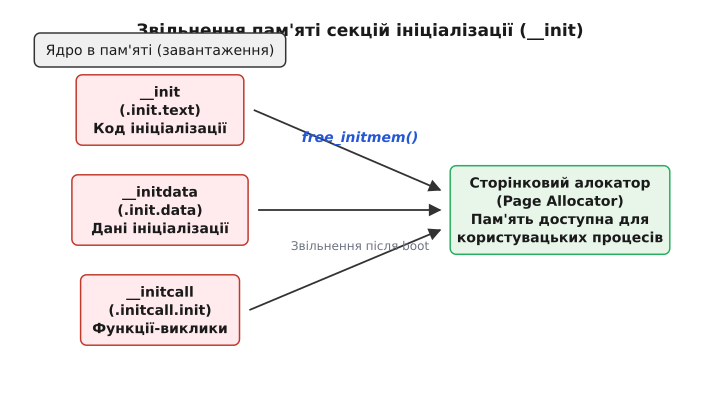

# Секції ініціалізації: код і дані, які ядро викидає після завантаження

<preknowlist>
- [Процес завантаження ядра](topic:sys-unix/kernel-boot-process-from-reset-vector-to-start-kernel) — розпакування образу, перехід у довгий режим та початок виконання start_kernel().
- [Механізм initcalls](topic:sys-unix/kernel-initcalls) — рівні ініціалізації підсистем ядра та порядок їх виконання.
</preknowlist>

Операційна система Linux проектувалася та оптимізувалася для роботи в умовах суворо обмежених апаратних ресурсів. Одним із найбільш елегантних та цікавих архітектурних рішень ядра Linux є його унікальний підхід до управління пам'яттю під час завантаження системи. Оскільки величезна кількість функцій, драйверів, масивів та структур даних потрібні виключно на етапі початкової ініціалізації системи (наприклад, для розпізнавання обладнання, налаштування сторінкової пам'яті, парсингу параметрів командного рядка, розпакування структур, встановлення початкових таймерів), тримати їх у оперативній пам'яті під час звичайної роботи системи було б недоцільно та марнотратно.

Щоб вирішити цю проблему, розробники ядра Linux створили набір спеціальних макросів мови C, найвідомішими з яких є `__init` та `__initdata`. Вони дозволяють компілятору розміщувати код та дані ініціалізації в окремих спеціалізованих секціях пам'яті, таких як `.init.text` та `.init.data`. Після того, як ядро успішно завершує етап завантаження і готується передати управління простору користувача (user space), викликається спеціальна архітектурно-залежна функція `free_initmem()`. Її завдання — назавжди звільнити ці секції, повертаючи сторінки пам'яті до загального сторінкового алокатора (Page Allocator), щоб вони стали повністю доступними для звичайних процесів користувача. 

## 1. Проблема: Чому звільнення пам'яті ініціалізації настільки важливе?

Під час процесу завантаження ядро Linux виконує колосальний обсяг роботи. Воно перевіряє оперативну пам'ять, ініціалізує контролери переривань (наприклад, APIC на архітектурі x86), налаштовує системні таймери, сканує доступні шини передачі даних (PCI, USB, I2C, SPI), ініціалізує віртуальну файлову систему (VFS), монтує кореневий розділ і, нарешті, запускає процес `init` (або `systemd`), який переводить систему в робочий режим.

Більшість коду, який відповідає за ці початкові налаштування, щойно він виконав свою роботу, більше ніколи не буде викликаний до наступного холодного перезавантаження системи. У монолітних ядрах без відповідної оптимізації весь цей код ініціалізації залишався б у пам'яті назавжди. Це означало б, що сотні кілобайтів або навіть кілька мегабайтів оперативної пам'яті (RAM) зберігали б інструкції процесора, які ніколи не будуть виконані знову.

Для серверів із сотнями гігабайтів оперативної пам'яті втрата кількох мегабайтів може здаватися незначною. Проте Linux працює не лише на серверах. Ця операційна система домінує на ринку вбудованих систем (embedded systems), пристроїв Інтернету речей (IoT), домашніх маршрутизаторів, смартфонів та смарт-годинників. У багатьох з цих пристроїв загальний обсяг оперативної пам'яті може становити лише 16 МБ, 32 МБ або 64 МБ. У таких обмежених умовах кожен кілобайт збереженої пам'яті є критичним. Звільнення 2 МБ ініціалізаційного коду на роутері з 16 МБ RAM означає повернення понад 12% всієї доступної пам'яті системи! Це дозволяє запустити додаткові мережеві служби, збільшити розмір буферів TCP/IP або уникнути виклику Out-Of-Memory (OOM) Killer.

Щоб максимізувати обсяг вільної пам'яті для користувацького простору, Linux використовує концепцію одноразових секцій ініціалізації. Замість того, щоб змішувати код завантаження зі звичайним кодом ядра, компілятору дається вказівка згрупувати весь ініціалізаційний код та тимчасові дані разом в один великий неперервний блок. Після того, як система завантажилася, ядро позначає всі сторінки пам'яті, які належать до цього блоку, як вільні, повертаючи їх до загального пулу вільної пам'яті системи.

## 2. Анатомія макросів `__init` та `__initdata`

Для того, щоб явно вказати компілятору (GCC або Clang), що певна функція, масив або змінна належить до коду ініціалізації і не буде потрібна згодом, в ядрі Linux визначені спеціальні макроси. Вони оголошені в головному заголовному файлі ініціалізації ядра — `include/linux/init.h`. Повний довідник макросів із детальними прапорцями компонувальника наведено в матеріалі [Специфікація макросів ініціалізації](topic:sys-unix/init-sections/api-init-macros.md).

### 2.1. Макрос `__init` для функцій

Макрос `__init` використовується виключно для позначення функцій. У препроцесорі C він розгортається в атрибут компілятора `__attribute__((__section__(".init.text")))`. 

Цей атрибут змушує компілятор розмістити згенерований машинний код цієї конкретної функції не у стандартній секції коду `.text` (де лежить більшість коду ядра), а у спеціально виділеній користувацькій секції `.init.text`.

Розглянемо типовий приклад використання макроса в коді драйвера:

```c
#include <linux/init.h>
#include <linux/module.h>

/* Функція налаштування, яка потрібна лише раз */
static int __init my_custom_hardware_init(void)
{
    printk(KERN_INFO "Початок ініціалізації мого апаратного забезпечення...\n");
    
    // Код налаштування портів вводу/виводу,
    // реєстрація переривань, виділення початкових буферів
    
    return 0;
}
```

У цьому прикладі машинний код функції `my_custom_hardware_init` розміщується у секції `.init.text`. Після того, як пристрій буде ініціалізовано на етапі завантаження, пам'ять, яку займає цей код, буде безповоротно звільнена. 

Слід пам'ятати про критичне правило: після завершення ініціалізації системи будь-який виклик функції, позначеної макросом `__init`, призведе до краху системи (kernel panic, page fault або oops). Це станеться тому, що фізична пам'ять, за адресою якої знаходилася ця функція, вже була передана іншому процесу або перезаписана іншими даними. Процесор спробує виконати випадковий сміттєвий код або натрапить на сторінку пам'яті, до якої він більше не має прав доступу на виконання.

### 2.2. Макрос `__initdata` для змінних

Аналогічно до функцій, макрос `__initdata` використовується для статичних змінних, масивів або структур даних, інформація в яких потрібна лише під час ініціалізації. Цей макрос розгортається в атрибут `__attribute__((__section__(".init.data")))`, що розміщує дані в секції `.init.data`.

Приклад використання для тимчасових структур:

```c
#include <linux/init.h>

/* Великий масив конфігурації, який потрібен лише при старті */
static int initial_port_configuration[1024] __initdata = { 
    [0 ... 1023] = -1 
};

static int __init my_network_driver_init(void)
{
    int i;
    for (i = 0; i < 1024; i++) {
        if (initial_port_configuration[i] != -1) {
            setup_port(i, initial_port_configuration[i]);
        }
    }
    return 0;
}
```

У цьому випадку масив `initial_port_configuration` займає 4 кілобайти пам'яті (1024 цілих числа по 4 байти). Оскільки він позначений як `__initdata`, він розміщується у секції `.init.data` і знищується та звільняється з оперативної пам'яті разом із кодом ініціалізації.

### 2.3. Похідні макроси та специфічні випадки

Окрім базових `__init` та `__initdata`, ядро Linux визначає цілий спектр подібних макросів для більш специфічних потреб:

- `__initconst`: Використовується для константних даних (змінних типу `const`), які потрібні лише під час завантаження. Він розміщує дані в секції `.init.rodata`. Це особливо важливо для великих таблиць констант, які використовуються для парсингу, але пізніше стають непотрібними.
- `__exit`: Цей макрос є логічною протилежністю `__init`. Він використовується для функцій очищення та деініціалізації (наприклад, під час вивантаження модуля ядра). Оскільки вбудований драйвер в монолітному ядрі ніколи не вивантажується, інструкції з макросом `__exit` відкидаються компонувальником ще на етапі збирання.
- `__exitdata`: Використовується для даних, які необхідні виключно функціям, позначеним як `__exit`.
- `__ro_after_init`: Дані, позначені цим атрибутом, є доступними для читання та запису (Read/Write) під час процесу ініціалізації. Але щойно функція `free_initmem()` завершує свою роботу, ядро змінює права доступу до сторінок пам'яті з цими даними на Read-Only. Це захищає критичні структури даних ядра від зміни зловмисниками після завантаження.

Продублювати подібну поведінку у власних проєктах користувацького простору можна за допомогою підходів, описаних у практичній статті [Одноразові секції в C/C++](topic:sys-unix/init-sections/proj-custom-init-section.md).

## 3. Магія лінкера: Як секції збираються разом

Атрибути компілятора GCC, такі як `__attribute__((__section__(".init.text")))`, лише вказують компілятору, у які іменовані секції об'єктного файлу (ELF файлу `.o`) помістити згенерований машинний код чи дані. Справжня робота відбувається пізніше, на етапі компонування (лінкування) сотень і тисяч об'єктних файлів в єдиний монолітний образ ядра.

Під час збирання фінального ядра системний лінкер (GNU `ld` або LLVM `lld`) використовує спеціальний скрипт лінкера `arch/<architecture>/kernel/vmlinux.lds.S`. Цей файл містить вичерпні інструкції для лінкера щодо того, як саме структурувати фінальний бінарний файл ядра (`vmlinux`), де саме в пам'яті повинна розташовуватися кожна секція і яке вирівнювання вона повинна мати.

У скрипті лінкера `vmlinux.lds.S` усі розрізнені секції ініціалізації з усіх об'єктних файлів ядра збираються і групуються разом в один великий неперервний блок. Ключовим моментом є те, що цей блок розміщується між двома спеціальними глобальними символами, які позначають початок і кінець області ініціалізації.

```ld
    /* Вирівнювання поточної адреси лінкування до розміру фізичної сторінки пам'яті.
       PAGE_SIZE зазвичай дорівнює 4096 байт на архітектурах x86. */
    . = ALIGN(PAGE_SIZE);
    
    /* Створення глобального символу, який вказує на початок пам'яті ініціалізації */
    __init_begin = .; 

    /* Збираємо всі секції .init.text з усіх вхідних файлів */
    .init.text : {
        _sinittext = .;
        *(.init.text)
        _einittext = .;
    }

    /* Збираємо всі секції .init.data */
    .init.data : {
        *(.init.data)
    }
    
    /* Збираємо масиви вказіників для initcalls */
    .initcall.init : {
        __initcall_start = .;
        *(.initcall.init)
        __initcall_end = .;
    }

    /* Вирівнюємо кінець блоку до повної сторінки пам'яті */
    . = ALIGN(PAGE_SIZE);
    
    /* Створення глобального символу для кінця ініціалізаційної пам'яті */
    __init_end = .;   
```

Символи `__init_begin` та `__init_end` представляють собою адреси в пам'яті. З C-коду ядра до них можна звернутися, оголосивши їх як зовнішні масиви:

```c
extern char __init_begin[], __init_end[];
```

Ці символи дозволяють коду ядра точно знати фізичні та віртуальні адреси початку та кінця блоку пам'яті ініціалізації. Вирівнювання початку і кінця цього блоку за розміром сторінки (`ALIGN(PAGE_SIZE)`) є критичним. Справа в тому, що менеджер пам'яті ядра Linux (відомий як сторінковий алокатор або Buddy Allocator) оперує блоками, розмір яких строго дорівнює одній сторінці (4 КБ). Якби секція ініціалізації закінчувалася посеред сторінки пам'яті, а одразу за нею починалася б секція постійного коду ядра `.text`, ядро не змогло б звільнити цю останню сторінку. Звільнення частини сторінки неможливе, а звільнення всієї сторінки призвело б до знищення частини постійного коду ядра. Суворе вирівнювання по сторінках гарантує, що між `__init_begin` та `__init_end` лежать лише цілі сторінки пам'яті.

## 4. Процес завантаження Linux: Від bootloader до `rest_init`

Момент звільнення пам'яті є логічним фіналом багатоетапного конвеєра завантаження ядра Linux:

1. **Завантажувач (Bootloader)**: Програми GRUB, U-Boot або UEFI завантажують стиснений образ ядра (`bzImage`) з диска в оперативну пам'ять.
2. **Розпакування образу**: Код декомпресора розпаковує справжнє ядро в іншу область оперативної пам'яті.
3. **Рання архітектурна ініціалізація**: Виконується низькорівневий асемблерний код (наприклад, `arch/x86/boot/head_64.S`). Він налаштовує початкові сторінкові таблиці, ініціалізує GDT, переводить процесор у довгий режим і передає управління до `start_kernel()`.
4. **Масивна ініціалізація у `start_kernel()`**: Функція `start_kernel()` (`init/main.c`) позначена макросом `__init` і викликає сотні інших `__init` функцій. Тут налаштовуються всі базові підсистеми: менеджер пам'яті (slab/slub allocators), планувальник завдань (scheduler), обробка переривань, таймери, VFS та IPC. 
5. **Розгалуження в `rest_init()`**: Наприкінці роботи `start_kernel()` викликає `rest_init()`, яка створює два критичних потоки ядра через `kernel_thread()`:
   - **Потік `kernel_init` (PID 1)**: Потік, який завершить ініціалізацію та перетвориться на перший процес простору користувача (`/sbin/init` або `systemd`).
   - **Потік `kthreadd` (PID 2)**: Менеджер усіх майбутніх потоків ядра.
6. **Перехід у простій**: Функція `rest_init()` перетворюється на idle thread (PID 0 або swapper), виконуючи інструкцію `hlt` під час відсутності активних завдань.


*Концептуальна схема розташування секцій ініціалізації в пам'яті ядра та їх повернення до сторінкового алокатора за допомогою free_initmem().*

### 4.1. Робота потоку `kernel_init` і фінал ініціалізації

Новостворений потік `kernel_init` бере на себе виконання `initcalls`, ініціалізацію мережевого стеку, монтування кореневої файлової системи (rootfs) та підготовку до запуску користувацького процесу.

Безпосередньо перед тим, як ядро виконає системний виклик `execve` для запуску `/sbin/init` і передасть управління в user space, етап початкового завантаження вважається остаточно завершеним. Жодна підсистема більше ніколи не потребуватиме функцій чи даних з атрибутом `__init`.

У цей момент потік `kernel_init` викликає функцію `free_initmem()`.

## 5. Механізм звільнення пам'яті: Розбір `free_initmem()`

Функція `free_initmem()` визначається для кожної апаратної архітектури окремо (`arch/x86/mm/init.c`, `arch/arm64/mm/init.c` або `arch/riscv/mm/init.c`), оскільки процес налаштування прав доступу до сторінок пам'яті глибоко залежить від апаратної специфіки MMU процесора. Головне завдання цієї функції — повернути вільні сторінки між `__init_begin` та `__init_end`.

### 5.1. Реалізація для архітектури x86

Спрощений вигляд реалізації `free_initmem` для x86_64:

```c
void free_initmem(void)
{
    /* Отримуємо числові значення фізичних адрес із глобальних символів лінкера */
    unsigned long start = (unsigned long)(&__init_begin);
    unsigned long end = (unsigned long)(&__init_end);

    /* 
     * Архітектурно-специфічний захист пам'яті: 
     * Переконуємося, що сторінки доступні для запису та читання (RW)
     * перед тим як віддати їх процесам користувача.
     */
    set_memory_rw(start, (end - start) >> PAGE_SHIFT);

    /* Викликаємо загальносистемну функцію звільнення зарезервованої пам'яті */
    free_initmem_default(POISON_FREE_INITMEM);

    /* Виводимо інформаційне повідомлення в лог ядра (dmesg) */
    printk(KERN_INFO "Freeing unused kernel image (initmem) memory: %luk freed\n",
           (end - start) >> 10);
}
```

Платформо-незалежна функція `free_initmem_default()` викликає базовий механізм `free_reserved_area()`:

```c
void free_initmem_default(int poison)
{
    free_reserved_area((void *)(&__init_begin), (void *)(&__init_end),
                       poison, "unused kernel image (initmem) memory");
}
```

### 5.2. Анатомія функції `free_reserved_area()`

Функція `free_reserved_area()` (`mm/page_alloc.c`) переводить фізичні сторінки пам'яті зі стану "зарезервовано для ядра" в стан "вільна пам'ять".

```c
unsigned long free_reserved_area(void *start, void *end, int poison, const char *s)
{
    void *pos;
    unsigned long pages = 0;

    /* Безпечне вирівнювання адрес до меж сторінок */
    start = (void *)PAGE_ALIGN((unsigned long)start);
    end = (void *)((unsigned long)end & PAGE_MASK);

    /* Цикл проходить по кожній фізичній сторінці в діапазоні */
    for (pos = start; pos < end; pos += PAGE_SIZE, pages++) {
        
        /* Крок 1: Отруєння пам'яті (за наявності прапорця) */
        if (poison)
            memset(pos, POISON_FREE_INITMEM, PAGE_SIZE);

        /* Крок 2: Фізичне звільнення сторінки */
        free_reserved_page(virt_to_page(pos));
    }

    if (pages && s)
        pr_info("Freeing %s: %ldK\n", s, pages << (PAGE_SHIFT - 10));

    return pages;
}
```

Ключові кроки цього алгоритму:

1. **Безпечне вирівнювання сторінок**: Адреси жорстко вирівнюються, щоб унеможливити випадкове видалення сторінок з постійним кодом ядра.
2. **Отруєння пам'яті (Memory Poisoning)**: У режимі налагодження (`CONFIG_DEBUG_PAGEALLOC`) вміст сторінки заповнюється байтовим патерном `POISON_FREE_INITMEM` (байт `0xcc` на x86, що відповідає інструкції `INT3`). Якщо будь-який код спробує звернутися до звільненої `__init` пам'яті, процесор миттєво згенерує переривання налагоджувача й паніку ядра (Kernel Oops), вказуючи на помилку Use-After-Free.
3. **Функція `free_reserved_page()`**: Для кожної сторінки через `virt_to_page()` знімається прапорець `PG_reserved`. Після цього `__free_page()` передає сторінку до сторінкового алокатора.

## 6. Сторінковий алокатор та система Buddy

Звільнені сторінки потрапляють до сторінкового алокатора, який керує пам'яттю за допомогою алгоритму Buddy System. Цей алгоритм групує вільні сторінки в блоки розміром `2⁰, 2¹, 2², ..., 2¹⁰` сторінок (від 4 КБ до 4 МБ).

Коли сторінки секції `__init` масово звільняються у циклі `free_reserved_area()`, алгоритм Buddy об'єднує сусідні сторінки у великі неперервні блоки вільної пам'яті. Ці блоки потрапляють у зони пам'яті `ZONE_NORMAL`.

Відтепер ці сторінки стають невідрізними від будь-якої іншої оперативної пам'яті в системі. Коли процес користувача (наприклад, веб-сервер Nginx) викликає `mmap` або `brk` для виділення пам'яті, ядро може виділити йому сторінки пам'яті, де під час завантаження знаходився код ініціалізації контролера переривань.

## 7. Механізм `initcalls`: Динамічна ініціалізація без хардкоду

Для уникнення жорстко прописаних списків викликів ініціалізації Linux використовує механізм `initcalls`. Будь-який драйвер або підсистема може зареєструвати свою функцію ініціалізації за допомогою макросів рівнів, таких як `core_initcall()`, `subsys_initcall()`, `fs_initcall()`, або `device_initcall()`.

```c
static int __init my_advanced_subsystem_init(void)
{
    // Ініціалізація підсистеми
    return 0;
}

/* Реєстрація функції на рівні підсистем */
subsys_initcall(my_advanced_subsystem_init);
```

Макрос `subsys_initcall(fn)` створює вказівник на функцію `fn` і розміщує його у підсекції `.initcall4.init`. Під час компіляції ядра лінкер збирає всі ці вказівники, сортує їх за рівнями та складає в суцільний масив між символами `__initcall_start` та `__initcall_end`.

Під час завантаження системи функція `do_initcalls()` послідовно викликає кожну функцію за вказівником у цьому масиві. Вся секція `.initcall.init` лежить всередині загального блоку `__init_begin` ... `__init_end`, тому масив вказівників звільняється разом із кодом ініціалізації при виклику `free_initmem()`.

## 8. Модулі ядра та `__init`: Динамічне завантаження

Для завантажуваних модулів ядра (Loadable Kernel Modules, LKM, файли `.ko`) концепція `__init` працює асинхронно під час роботи системи.

При завантаженні модуля через `finit_module` менеджер модулів ядра (`kernel/module/main.c`) ділить пам'ять модуля на два окремі блоки:
1. **Core section**: Постійний код та дані модуля (`.text`, `.data`, `.bss`), які залишаються у пам'яті до вивантаження модуля (`rmmod`).
2. **Init section**: Тимчасовий блок пам'яті, куди копіюються секції `.init.text` та `.init.data` модуля.

Після успішного виконання функції ініціалізації модуля ядро викликає `module_memfree()`, яка негайно звільняє тимчасовий блок пам'яті "Init section". Оптимізація пам'яті діє як під час завантаження системи, так і під час точкового завантаження драйверів.

## 9. Безпека: Принцип W^X та `__ro_after_init`

Сучасні версії ядра Linux суворо дотримуються принципу безпеки **W^X** (Write XOR Execute): жодна сторінка пам'яті не повинна бути одночасно доступною для запису (Writable) і для виконання коду (Executable).

Секція `.init.text` має атрибути Executable та Read-Only (RX). Секція `.init.data` містить змінні, тому її сторінки є Writable та Non-Executable (RW, NX). У скриптах лінкера ці секції вирівнюються окремо на межах сторінок, що дозволяє встановити для них різні права доступу в сторінкових таблицях (PTE).

Додатковим інструментом є макрос `__ro_after_init`. Змінні з цим атрибутом розміщуються у секції `.data..ro_after_init`. На етапі завантаження ця секція має права Read-Write, але після завершення ініціалізації функція `mark_rodata_ro()` змінює права доступу до сторінок на Read-Only. Ці дані не звільняються з пам'яті, але стають захищеними від перезапису на апаратному рівні.

## 10. Взаємодія з ftrace, kprobes та інструментами діагностики

Функції, розміщені у секції `.init.text`, потребують особливої уваги під час динамічного трасування та налагодження ядра.

### 10.1. Обмеження kprobes та ftrace
Підсистема `kprobes` (яка дозволяє встановлювати динамічні точки перехоплення інструкцій у працюючому ядрі) забороняє встановлення трасувальників на функції з атрибутом `__init`. Інструмент перевіряє адреси за допомогою функції `within_kprobe_blacklist()`. Якби точка перехоплення була встановлена у секції `.init.text`, то після виконання `free_initmem()` механізм `kprobes` залишив би вказівники на видалену пам'ять, що призвело б до паніки ядра при спробі демонтажу точки перехоплення.

Аналогічно, механізм `ftrace` під час підготовки списку трасованих функцій ядра відфільтровує символи, розташовані між `__init_begin` та `__init_end`, щоб після завершення завантаження підсистема трасування не намагалася модифікувати машинні інструкції на звільнених сторінках пам'яті.

### 10.2. Спостереження через dmesg та procfs
Результат виконання `free_initmem()` під час завантаження системи роздруковується у системний лог ядра, який можна переглянути за допомогою утиліти `dmesg`:

```bash
dmesg | grep -i "freeing unused kernel"
```

Типовий вивід повідомляє точний обсяг вивільненої пам'яті:
`[    2.145012] Freeing unused kernel image (initmem) memory: 2048K`

У файлі `/proc/meminfo` значення вивільненої пам'яті відображається у системних показниках підсистеми управління пам'яттю, дозволяючи моніторити ефективність збереження ресурсів на системному рівні.

## 11. Наслідки помилок розробників: Section Mismatch

Помилкове використання макросів ініціалізації призводить до нестабільності ядра. Поширеною помилкою є збереження вказівника на структуру з `__initdata` у глобальну змінну постійної секції:

```c
static struct my_config initial_cfg __initdata = { .mode = 1 };
static struct my_config *active_cfg;

static int __init my_driver_init(void)
{
    /* КРИТИЧНА ПОМИЛКА: Зберігаємо вказівник на тимчасову пам'ять */
    active_cfg = &initial_cfg;
    return 0;
}
```

Під час завантаження цей код спрацює без помилок. Але після виконання `free_initmem()` звернення до `active_cfg->mode` викличе читання зі звільненої сторінки пам'яті. У кращому випадку це поверне сміттєві дані, а у гіршому — призведе до спотворення даних або Kernel Panic.

Для виявлення таких помилок інструмент `modpost` під час компіляції ядра сканує об'єктні файли та попереджає про ситуації Section Mismatch (`WARNING: vmlinux.o: Section mismatch`), коли постійний код звертається до тимчасових секцій.

## 12. Висновки

Секції ініціалізації `__init` та `__initdata` є ефективним архітектурним механізмом, який дозволяє монолітному ядру Linux вивільняти пам'ять після завантаження системи. Шляхом групування тимчасового коду й даних у спеціалізовані секції лінкера ядро повертає сотні кілобайт або мегабайти оперативної пам'яті до загального сторінкового алокатора за допомогою функції `free_initmem()`. Розуміння роботи цих секцій є фундаментальним для розробки стабільних драйверів та системного програмного забезпечення.
