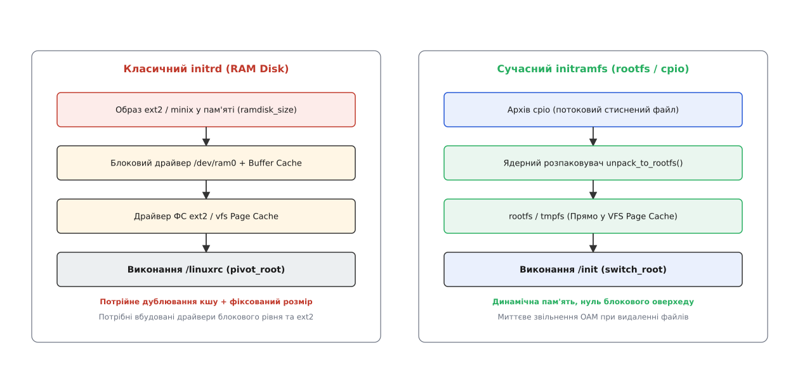
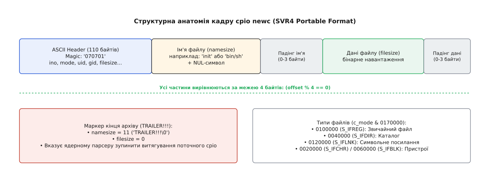
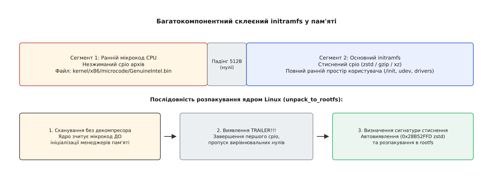
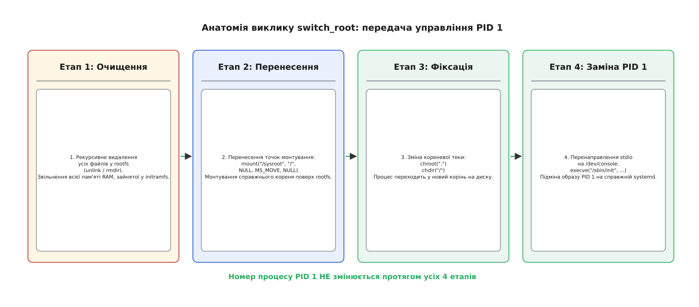

# Архітектура initramfs та cpio: розгортання раннього простору користувача

<preknowlist>
- [Ланцюг завантаження](topic:sys-unix/boot-chain) — послідовність передачі керування від прошивки через завантажувач і ядро до init.
- [Монтування й дерево монтувань](topic:sys-unix/mount-model) — концепція VFS, точки монтування та заміна кореня через pivot_root.
- [Псевдо-ФС: procfs, sysfs, tmpfs, devtmpfs](topic:sys-unix/pseudo-filesystems) — файлові системи в пам'яті, структура rootfs та devtmpfs.
</preknowlist>

Сервер із масивом NVMe-накопичувачів, зашифрованими томами LUKS та створеною поверх них файловою системою Btrfs зупиняється на етапі завантаження ядра, якщо ядро намагається змонтувати параметр `root=/dev/mapper/root_crypt` безпосередньо. Коду ядра для розшифровки диска потрібен модуль `dm-crypt`, для роботи з NVMe-накопичувачами потрібен драйвер `nvme.ko`, а для зчитування складеного тома Btrfs — відповідний драйвер файлової системи. Проте всі ці модулі лежать у файловій системі за шляхом `/lib/modules/$(uname -r)/`, яка знаходиться всередині того самого зашифрованого тома, який ядро ще не здатне прочитати.

З цього архітектурного замкненого кола виходять двома шляхами. Перший — скомпільувати абсолютно всі можливі драйвери контролерів накопичувачів, шифрування, мережевих стеків та файлових систем безпосередньо всередину монолітного бінарного файлу ядра `vmlinuz`. Це збільшує розмір ядра до сотень мегабайтів і робить створення універсального дистрибутиву неможливим. Другий вихід — надати ядру тимчасову початкову файлову систему в оперативній пам'яті, яка містить мінімальний набір утиліт і модулів, достатній для пошуку, розшифровки, збирання та монтування справжнього кореня. Тимчасове середовище називають **раннім простором користувача** (англ. *early userspace*), а механізм його доставки у пам'яті пройшов еволюцію від дискових емуляцій `initrd` до сучасних потокових архівів `initramfs`.

## Проблема початкового монтування та тупик блокового initrd

Перша реалізація тимчасового кореня мала назву **initrd** (англ. *initial RAM disk*). Вона з'явилася в серії ядер Linux 1.3 і спиралася на емуляцію фізичного дискового носія в оперативній пам'яті. Завантажувач зчитував з диска файл ядра та готовий образ файлової системи ext2 або minix. Після ініціалізації базового апаратного забезпечення ядро створювало віртуальний блоковий пристрій `/dev/ram0`, розпаковувало в нього образ диска та монтувало цей пристрій як початковий корінь.

Усередині монтованого `/dev/ram0` ядро викликало спеціальний сценарій `/linuxrc`. Цей сценарій підвантажував додаткові модулі ядра, запитував пароль розшифровки диска, ініціалізував мережу і згодом виконував виклик `pivot_root`, щоб поміняти місцями тимчасовий корінь `/dev/ram0` та щойно змонтований справжній корінь на жорсткому диску.

*Порівняння шляху даних та використання пам'яті між класичним initrd та сучасним initramfs.*

Такий підхід розв'язав проблему завантаження модульних ядер, проте виявився фундаментально неефективним з точки зору використання пам'яті та архітектури Virtual File System (VFS, англ. *Virtual File System*). Оскільки `/dev/ram0` був блоковим пристроєм, виконання будь-якого бінарного файлу з него призводило до потрійного дублювання даних у пам'яті:
1. Сирий образ у пам'яті ядра під пристроєм `/dev/ram0`.
2. Буферний кеш (англ. *buffer cache*) блокового пристрою.
3. Сторінковий кеш (англ. *page cache*) VFS при читанні файлів програмою.

Окрім цього, розмір RAM-диска був фіксованим і задавався параметром ядра `ramdisk_size` під час компіляції. Якщо під пристрій виділяли 16 МБ пам'яті, ці 16 МБ залишалися повністю вилученими з оперативної пам'яті системи, навіть якщо реальні файли всередині образу займали лише 2 МБ. Нарешті, для зчитування сам образ вимагав наявності вбудованого в ядро блокового драйвера RAM-дисків та драйвера файлової системи ext2. Детальніше про те, як розробники ядра долали ці обмеження, розкрито в [історії трансформації блокового initrd у rootfs](topic:sys-unix/initramfs-cpio-unpacker-internals/hist-ramdisk-to-rootfs.md).

## Архітектура initramfs: rootfs, tmpfs та усунення блокового шару

Під час масштабної реорганізації VFS у ядрах серії Linux 2.6 Ал Віро (Al Viro) та Лінус Торвальдс повністю переосмислили роботу з початковою файловою системою. Оскільки підсистема VFS уже мала вбудовану файлову систему в пам'яті `ramfs` (та її розширену версію `tmpfs`), яка існує безпосередньо у сторінковому кеші й не має під собою жодного блокового пристрою, виникла ідея використати її як корінь завантаження.

Новий механізм отримав назву **initramfs** (англ. *initial RAM filesystem*). На відміну від `initrd`, `initramfs` не є образом файлової системи чи блоковим пристроєм. Це архів у форматі `cpio`, який ядро розпаковує безпосередньо у спеціальний екземпляр `tmpfs`, що створюється на найпершому етапі ініціалізації ядра під назвою **rootfs**.

Впровадження `initramfs` принесло п'ять фундаментальних переваг:
- **Нульові накладні витрати блокового рівня:** Відсутність `/dev/ram0` усуває буферний кеш і блоковий шар. Файли живуть безпосередньо у сторінковому кеші VFS.
- **Динамічне використання пам'яті:** `rootfs` споживає рівно стільки оперативної пам'яті, скільки займають розпаковані файли. Немає потреби попередньо резервувати фіксований обсяг RAM.
- **Миттєве звільнення ресурсів:** При видаленні тимчасових файлів після завантаження пам'яті миттєво повертаються системному розподільнику сторінок пам'яті (page allocator).
- **Відсутність дискових драйверів у корі ядра:** Для розгортання `initramfs` ядру не потрібні драйвери блокових пристроїв чи файлових систем — потрібен лише внутрішній парсер `cpio`.
- **Конкатенація архівів:** Завантажувач може передавати ядру кілька склеєних `cpio`-архівів поспіль в одному блоці пам'яті.

Процес ініціалізації починається у функції `init/main.c`, яка викликає `default_rootfs()`. Ця функція монтує мінімальний екземпляр `rootfs` у системному списку монтувань. Оскільки `rootfs` спирається безпосередньо на `struct page`, створення файлів у цій файловій системі зводиться до зв'язування сторінок пам'яті з індексами `struct inode` та записами каталогів `struct dentry`. При цьому операції читання й запису оминають дискові черги I/O, що забезпечує найвищу можливу швидкість обробки файлів.

Пряме порівняння функціональних властивостей між двома підходами наведено в матеріалі про [порівняльний аналіз пам'яті та рівнів абстракції](topic:sys-unix/initramfs-cpio-unpacker-internals/comp-initrd-initramfs-memory.md).

## Формат cpio newc: потоковий ASCII-архів у пам'яті

Формат контейнера для `initramfs` обирався за суворими критеріями: парсер повинен бути максимально простим, не вимагати виділення великих обсягів пам'яті й розбирати архів за один лінійний прохід без зворотного мотання (англ. *random access* або *seeking*). Популярний формат `tar` виявився незручним, оскільки вимагає складнішої обробки контрольних сум та розширень довгих імен. Формат `zip` зберігає центральний каталог у кінці файлу, що унеможливлює його потокову розпаковку.

Вибір зупинився на варіанті **cpio newc** (англ. *copy in and out*, формат SVR4 Portable Format без CRC). Заголовок кожного файлу в цьому форматі займає точно **110 байтів** і складається виключно з 8-значних шістнадцяткових ASCII-рядків.

*Анатомія 110-байтового ASCII-заголовка, вирівнювання за межею 4 байтів та навантаження у форматі cpio newc.*

Використання ASCII-тексту замість двійкових цілих чисел має фундаментальну причину: воно робить заголовок абсолютно незалежним від порядку байтів процесора (англ. *endianness*). Шістнадцятковий рядок `"000001A4"` зчитується однаково як на Big-Endian процесорах (s390x, SPARC), так і на Little-Endian (x86_64, ARM64), не вимагаючи виконання функцій на кшталт `ntohl()` або `bswap32()` на найраніших етапах завантаження.

Структура кожного кадру архіву `cpio newc` включає три послідовні елементи:
1. **Заголовок (Header):** 110 байтів фіксованого ASCII-тексту (поля `c_magic`, `c_ino`, `c_mode`, `c_uid`, `c_gid`, `c_filesize`, `c_namesize` тощо).
2. **Шлях файлу (Filename):** Текстовий рядок довжиною `namesize` (включаючи завершальний NUL-байт `\0`), вирівняний нульовими байтами до межі, кратної 4 байтам.
3. **Бінарне навантаження (File Payload):** Вміст файлу довжиною `filesize` байтів, також вирівняний нуль-байтами до межі 4 байтів.

Кінець архіву позначається спеціальним фіктивним файлом з іменем `"TRAILER!!!"`. Коли ядерний розпаковувач знаходить заголовок з ім'ям `"TRAILER!!!"`, він зупиняє розбірку поточного архіву. Повні технічні зауваження та маски режимів `c_mode` описано у матеріалі про [специфікацію заголовка cpio newc](topic:sys-unix/initramfs-cpio-unpacker-internals/api-cpio-header-spec.md).

## Склеєні initramfs-образи та рання декомпресія мікрокоду

Сучасні завантажувачі (GRUB 2, systemd-boot) дозволяють передавати ядру кілька скомбінованих архівів `cpio`, просто склеєних один за одним в один суцільний буфер пам'яті. Ядерний розпаковувач `unpack_to_rootfs()` у файлі `init/initramfs.c` обробляє такий буфер у циклі: після знаходження маркеру `"TRAILER!!!"` він пропускає всі вирівнювальні нулі до межі 512 байтів і перевіряє, чи залишилися в буфері додаткові дані.

Ця властивість стала основою для механізму **раннього оновлення мікрокоду CPU** (англ. *early microcode loading*) для процесорів Intel та AMD.

*Послідовність розпакування склеєного образу initramfs із незашифрованим раннім мікрокодом та стисненим основним архівом.*

Процесори x86 вимагають патчінгу бінарного мікрокоду на найранішому етапі завантаження — до того, як ядро ініціалізує багатопотоковість (SMP) та підсистеми управління пам'яттю. Якщо мікрокод лежить усередині основного стисненого образу `initramfs` (наприклад, стисненого за допомогою `zstd` або `xz`), ядро не зможе його прочитати, оскільки декомпресор вимагає ініціалізованого розподільника пам'яті `kmalloc`.

Для вирішення цього парадоксу образ `/boot/initrd.img` конструюють як склейку двох окремих сегментів:
1. **Перший сегмент (Ранній cpio):** Нестиснений (сирий) `cpio`-архів, який містить лише бінарні файли оновлення мікрокоду за шляхом `kernel/x86/microcode/GenuineIntel.bin` або `kernel/x86/microcode/AuthenticAMD.bin`.
2. **Другий сегмент (Основний initramfs):** Повноцінний `cpio`-архів, стиснений алгоритмом `zstd`, `gzip` або `lz4`, який містить дерева `/bin`, `/lib`, `/etc` та сценарій `/init`.

Під час старту ядро сканує перші байти пам'яті без використання алгоритмів розпакування, витягує бінарник мікрокоду, завантажує його безпосередньо в кожне процесорне ядро через MSR-регістри, після чого зупиняється на першому маркері `"TRAILER!!!"`. Далі ядро визначає сигнатуру стиснення другого сегмента (наприклад, `0x28B52FFD` для `zstd`), запускає відповідний декомпресор і розгортає решту файлів у `rootfs`.

> 🔧 **Навіщо це.** Склейка невирівняних cpio-сегментів є частою причиною збоїв інструментів типу `zcat /boot/initrd.img`. Якщо утиліта бачить нестиснений ранній cpio-мікрокод на початку файлу, вона повертає помилку `not in gzip format`. Для коректного розпакування склеєних образів використовують спеціалізовані утиліти на кшталт `unmkinitramfs`, які вміють шукати зсуви сигнатур компресії в бінарному потоці.

Також, починаючи з ядра Linux 5.6 (2020 рік), механізм конкатенації `cpio` використовується для передачі розширеної конфігурації ядра через **bootconfig** (англ. *boot configuration*). Текстовий конфігураційний файл `bootconfig` дописується в кінець образу `initramfs` разом із магічним футером `"# CONFIG\n"`. Модуль ядра `init/main.c` прочитує цей дерев'яний файл конфігурації ще до запуску `init`, розширюючи параметри командного рядка без обмежень на довжину рядка завантажувача.

## Логіка розпаковувача init/initramfs.c та створення вузлів VFS

Внутрішній розпаковувач ядра знаходиться у файлі `init/initramfs.c` і викликається під час ініціалізації ядра функцією `populate_rootfs()`. Процес відбувається у кілька чітко розграничених кроків:

1. **Перевірка вбудованого initramfs:** Якщо ядро було скомпільовано з вшитим архівом (параметр конфігурації `CONFIG_INITRAMFS_SOURCE`), ядро спочатку розпаковує цей внутрішній cpio з ділянки пам'яті між символами `__initramfs_start` та `__initramfs_size`.
2. **Детекція сигнатур компресії:** Якщо завантажувач передав зовнішній `initramfs`, ядро аналізує перші магічні байти буфера завантаження:
   - `0x1f 0x8b` — компресія `gzip`
   - `0x28 0xb5 0x2f 0xfd` — компресія `zstd`
   - `0xFD 0x37 0x7A 0x58` — компресія `xz`
   - `0x89 0x4C 0x5A` — компресія `lzo`
   - `0x04 0x22 0x4D 0x18` — компресія `lz4`
3. **Потокова декомпресія та розбір кадру:** Декомпресор розпаковує потік у тимчасовий буфер, а функція `unpack_to_rootfs()` послідовно читає заголовки `struct cpio_newc_header`.
4. **Створення об'єктів VFS:** Залежно від вісімкового значення поля `c_mode`, ядро виконує відповідні ядерні функції для формування файлового дерева `rootfs`:
   - `S_IFDIR` (`0040000`): Викликом `init_mkdir()` створюється каталог.
   - `S_IFREG` (`0100000`): Викликом `init_open()` створюється файл, після чого вміст із потоку `cpio` записується безпосередньо у його сторінковий кеш `init_write()`.
   - `S_IFLNK` (`0120000`): Викликом `init_symlink()` створюється символьне посилання, ціль якого зчитується із секції даних кадру.
   - `S_IFCHR` (`0020000`) та `S_IFBLK` (`0060000`): Викликом `init_mknod()` створюються пристрої з відповідними номерами `c_rmaj` та `c_rmin`.

Під час обробки файлів ядро також підтримує хеш-таблицю інод для відновлення жорстких посилань. Якщо новий кадр має номер `c_ino`, який уже зустрічався раніше, а його поле `c_filesize` дорівнює 0, ядро не створює новий порожній файл, а виконує системну операцію `init_link()`, пов'язуючи нове ім'я з уже існуючою інодою у `rootfs`.

Практичну програмну модель такого розпаковувача мовами C та C++ з обробкою падінгів вивчено в матеріалі про [практичну реалізацію розпаковувача cpio](topic:sys-unix/initramfs-cpio-unpacker-internals/proj-cpio-unpack-engine.md).

## Дистрибутивні інструменти генерації: dracut, mkinitcpio та initramfs-tools

Створення образу `initramfs` на практиці автоматизується дистрибутивними утилітами, які збирають потрібні бінарні файли, скрипти та модулі ядра в єдиний стиснений потік `cpio`:

- **dracut (Fedora, RHEL, SUSE):** Спирається на модульну концепцію. Кожен модуль `dracut` (наприклад, `90crypt`, `90lvm`, `95nfs`) оголошує свої залежності й додає у підсумковий `initramfs` лише ті утиліти й драйвери, які необхідні для функціонування даної підсистеми.
- **mkinitcpio (Arch Linux):** Працює через механізм масивів `HOOKS=(base udev autodetect modconf block filesystems fsck)`. Хук `autodetect` аналізує поточне апаратне забезпечення залишками sysfs і відсікає всі зайві драйвери ядра, зменшуючи розмір образу до 8–12 МБ.
- **initramfs-tools (Debian, Ubuntu):** Використовує конфігурацію `/etc/initramfs-tools/initramfs.conf` з двома основними режимами збірки: `MODULES=most` (універсальний образ для будь-якого заліза) та `MODULES=dep` (вузькоспеціалізований образ лише для поточного ПК).

Генерований образ `initramfs` розміщується у каталозі `/boot/initrd.img-$(uname -r)` і реєструється у меню конфігурації завантажувача.

## Життєвий цикл раннього простору користувача та виконання /init

Після закінчення роботи `unpack_to_rootfs()` ядро перевіряє наявність виконуваного файлу `/init` у файловій системі `rootfs`. Якщо файл `/init` знайдено, ядро запускає його в режимі користувача (User Mode) як найперший процес у системі за допомогою внутрішньої функції `run_init_process("/init")`. Цей процес отримує номер **PID 1**.

Сценарій або бінарний файл `/init` (яким у сучасних системах може бути як `sh`-скрипт у Debian/Ubuntu, так і спеціалізоване середовище `systemd-initrd` у Fedora/Arch) виконує такий алгоритм дій:

1. **Монтування базових псевдо-ФС:** `/init` монтує `/proc` (`procfs`), `/sys` (`sysfs`), `/dev` (`devtmpfs`) та `/run` (`tmpfs`).
2. **Ініціалізація менеджерів пристроїв:** Запускається утиліта `systemd-udevd` або `mdev`, яка сканує шини PCI/USB і завантажує драйвери для знайдених дискових контролерів.
3. **Розблокування томів збереження:**
   - Для зашифрованих дисків викликається `cryptsetup`, запитується пароль і створюється віртуальний пристрій `/dev/mapper/root_crypt`.
   - Для логічних томів LVM викликаються утиліти `vgscan` та `vgchange -ay`.
   - Для програмних RAID-масивів викликається `mdadm --assemble --scan`.
4. **Пошук кореня за міткою чи UUID:** `/init` зчитує рядок параметрів ядра `/proc/cmdline`. Якщо параметр задано як `root=UUID=550e8400-e29b-41d4-a716-446655440000`, утиліта `blkid` знаходить відповідний пристрій серед усіх розпізнаних дисків.
5. **Монтування справжнього кореня:** Знайдений пристрій монтується в каталог `/sysroot` (або `/newroot`) усередині `rootfs`.

У сучасних дистрибутивах на основі systemd середовище `initramfs` виконує екземпляр `systemd` з особливими цілями (англ. *targets*): `initrd.target`, `initrd-fs.target` та `initrd-switch-root.target`. Це дозволяє паралельно завантажувати драйвери дискових масивів та вести впорядкований журнал логів `journald` ще до монтування фізичного диска.

Гнучкість раннього простору користувача дозволяє реалізовувати довільно складні сценарії завантаження: від зчитування ключів шифрування з токена YubiKey чи TPM2-чіпа до монтування кореневої файлової системи через мережевий протокол iSCSI або NFS при бездисковому завантаженні (англ. *diskless boot*).

## Механізм передачі керування: атомарний switch_root

Після успішного монтування справжнього кореня в каталог `/sysroot` тимчасове середовище `initramfs` повинно завершити свою роботу й передати керування справжньому менеджеру системних служб (наприклад, `/sbin/init` або `/usr/lib/systemd/systemd`).

Використати для цього застарілий системний виклик `pivot_root` неможливо: ядро Linux свідомо забороняє виконувати `pivot_root` над спеціальною файловою системою `rootfs`. Звичайний виклик `chroot /sysroot` також є неприйнятним, оскільки він змінить лише поточну кореневу теку процесу, але залишить саму файлову систему `rootfs` з усіма її тимчасовими файлами змонтованою у RAM, що марно витрачатиме оперативну пам'ять.

Для чистого та атомарного переходу використовується спеціалізована утиліта **switch_root**.

*Етапи очищення rootfs, перенесення точок монтування та виклику execve під час переходу до справжнього кореня.*

Утиліта `switch_root` виконує строго впорядковану послідовність із п'яти кроків:

1. **Рекурсивне видалення файлів:** `switch_root` обходить усе дерево файлів `rootfs` (за винятком каталогу `/sysroot`) і викликає `unlink()` та `rmdir()` для кожного елемента. Оскільки `rootfs` лежить у `tmpfs`, видалення файлів негайно звільняє всі зайняті ними сторінки оперативної пам'яті.
2. **Перенесення монтувань (Move Mount):** `switch_root` виконує системний виклик перенесення монтування для підсистем `/dev`, `/proc`, `/sys` та `/run` із тимчасового кореня у відповідні каталоги нового кореня (`/sysroot/dev`, `/sysroot/proc` тощо). Одразу після цього сам каталог `/sysroot` переноситься поверх точного кореня монтування `/` за допомогою системного виклику `mount("/sysroot", "/", NULL, MS_MOVE, NULL)`.
3. **Зміна кореневої теки (chroot):** Викликаються системні функції `chroot(".")` та `chdir("/")`, що остаточно переводить процес у новий корінь на дисковому носії.
4. **Перенаправлення файлових дескрипторів:** Стандартні файлові дескриптори введення-виведення (0, 1, 2) закриваються й перевідкриваються на файлі `/dev/console` справжнього кореня.
5. **Заміна образу процесу (execve):** `switch_root` викликає системну функцію `execve("/sbin/init", argv, envp)`.

Крок з `execve` є вирішальним: він підміняє код і дані тимчасового процесу `/init` кодом справжнього менеджера системних служб (`systemd`), при цьому **номер процесу PID 1 зберігається**. Ядро не перезапускає процес керування, а продовжує виконання того самого первинного процесу з новим бінарним образом усередині нової файлової системи. На цьому розгортання раннього простору користувача повністю завершується, і система переходить до штатного запуску служб простору користувача.
