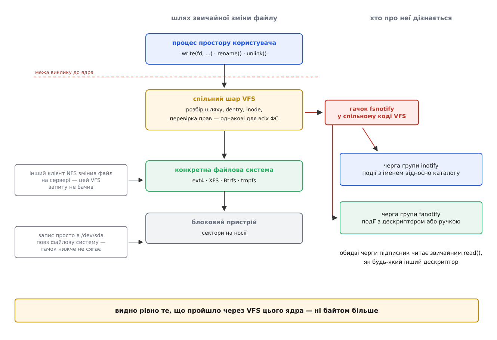
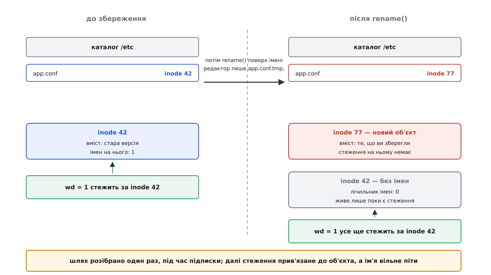
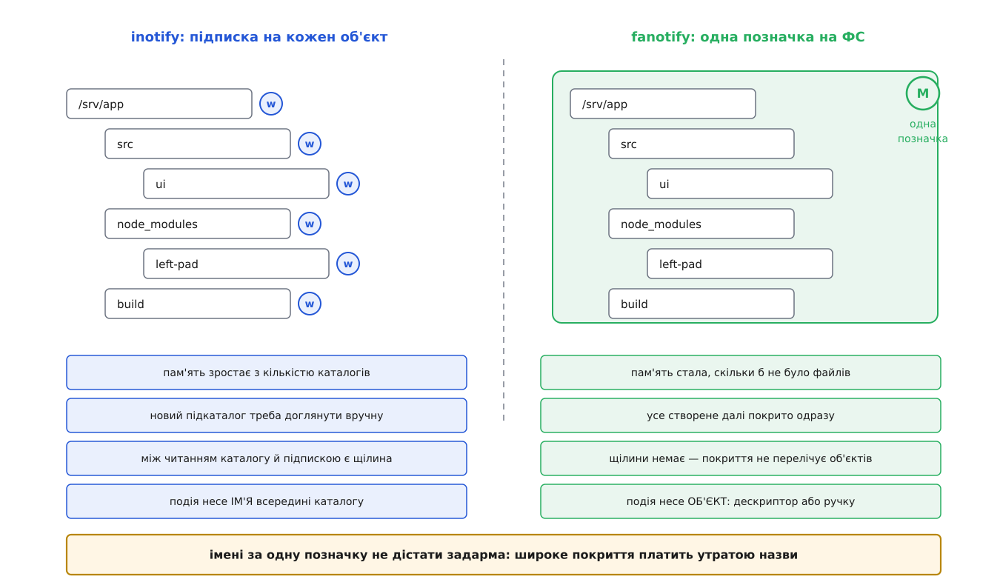

# Стеження за змінами у файловій системі: inotify і fanotify

<preknowlist>
- [Inode](topic:sys-unix/inode-model) — безіменний об'єкт файлової системи, у якому живуть тип, права, розмір та адреси даних.
- [Файловий дескриптор](topic:sys-unix/file-descriptor) — цілочисельний ідентифікатор відкритого об'єкта в ядрі, з якого читають за допомогою `read()`.
- [VFS](topic:sys-unix/vfs-layer) — спільний шар ядра Linux, крізь який проходять усі файлові операції.
- [select, poll, epoll](topic:sys-unix/select-poll-epoll) — очікування подій на кількох дескрипторах в одному потоці.
</preknowlist>

Коли сучасному середовищу розробки потрібно оновити результат збірки після збереження файлу, воно має дізнатися про зміну. Найочевидніший спосіб — регулярне опитування (polling): програма періодично обходить дерево каталогів і викликає `stat()` для кожного файлу, порівнюючи час останньої модифікації.

На малому проєкті це працює, але на дереві з 30 000 каталогів і файлів оновлення кожні 200 мілісекунд вимагає 150 000 системних викликів на секунду. Навіть якщо всі шляхи лежать у гарячому кеші ядра, таке опитування постійно витрачає 10–15 % потужності одного процесорного ядра лише на те, щоб отримувати відповідь «нічого не змінилося». До того ж опитування завжди має затримку й мовчки пропускає короткоживучі тимчасові файли, які з'являються та зникають між перевірками.

Причина цієї неефективності проста: опитує той, хто не знає, а ядро в мить виконання операцій `write()`, `rename()` чи `unlink()` уже тримає в руках усі дані. Замість періодичних опитувань ядро Linux надає подійні інтерфейси сповіщення, які розвертають цей потік інформації.

## Де в ядрі народжуються події

Операції з файлами викликаються десятками різних системних викликів. Щоб не розсипати копії логіки сповіщення по всьому ядру, гачки сповіщення розставлені в [спільному шарі VFS](topic:sys-unix/vfs-layer). Коли операція успішно проходить крізь VFS, ядро викликає функції підсистеми `fsnotify`, яка перевіряє наявність підписників і складає нові події в черги відповідних груп у пам'яті ядра.

*Місце гачка задає межі видимості: підписник бачить лише ті операції, які виконало ядро цієї машини крізь шар VFS.*

З розташування гачка у VFS випливають три важливі правила:
1. **Видно лише локальні операції ядра.** Зміни на [мережевій файловій системі](topic:sys-unix/network-filesystems), зроблені іншим клієнтом, не проходять крізь ваш VFS, тому події про них не виникають.
2. **Події повідомляють про вже виконані дії.** Звичайна подія приходить після завершення виклику, коли змінити перебіг операції вже неможливо.
3. **Ядро бачить і ім'я, і inode.** У мить спрацювання гачка ядру відомі як рядок імені в каталозі, так і внутрішній об'єкт `inode`.

> 📜 Сповіщення у файловій системі Linux пройшли довгий шлях еволюції: від раннього механізму `dnotify` на сигналах (ядро 2.4) через `inotify` (ядро 2.6.13) до уніфікованого шару `fsnotify` та системного механізму `fanotify`. Детальніше розвиток цих підходів описано в [історичному екскурсі](topic:sys-unix/inotify-and-fanotify/hist-from-dnotify-to-fanotify.md).

## inotify: стеження за іменами каталогів і файлів

Механізм `inotify` орієнтований на прикладні програми — збирачі проєктів, файлові менеджери та демони синхронізації. Програма створює дескриптор групи за допомогою `inotify_init1()` і додає точки стеження через `inotify_add_watch()`. Події читаються з дескриптора як послідовність структур `inotify_event` (що містять номер `wd`, маску подій, поле `cookie` для парних перейменувань та ім'я створеного чи вилученого об'єкта), які можна зручно чекати у спільному циклі [epoll](topic:sys-unix/select-poll-epoll).

Головна особливість `inotify`: підписка оформлюється за шляхом, але ядро розбирає шлях лише один раз і прив'язує стеження до конкретного **inode**. Якщо файл перейменовують або видаляють, стеження лишається на початковому об'єкті inode.

*Атомарна заміна файлу редактором створює новий inode, через що підписка на старий файл перестає отримувати нові події.*

Більшість текстових редакторів зберігають зміни атомарно: створюють тимчасовий файл, записують новий вміст і роблять `rename()` поверх оригінального імені. При підписці безпосередньо на файл програма отримує події видалення старого inode і втрачає зв'язок з новим файлом. Тому надійна практика — **стежити за каталогом, а не за окремим файлом**. Каталог зберігає свій inode при заміні файлів усередині нього.

Стеження `inotify` не є рекурсивним: для контролю дерева з тисячі каталогів потрібно додати тисячу окремих стежень, що обмежується системними параметрами у `/proc/sys/fs/inotify/max_user_watches`. Черга подій має обмежений розмір (типово 16 384 події). При переповненні черги ядро надсилає спеціальний прапорець `IN_Q_OVERFLOW` і відкидає подальші події. У такому разі програма повинна очистити внутрішній стан і виконати повне повторне сканування файлової системи.

> ⚙️ Практичну реалізацію неблокувального спостерігача за цілим деревом каталогів із обробкою перейменувань, вирівнюванням буферів та відновленням після переповнення розібрано в [практичному проєкті](topic:sys-unix/inotify-and-fanotify/proj-watch-tree.md).

## fanotify: глобальне покриття та перехоплення доступу

Механізм `fanotify` створено для системних служб — антивірусних сканерів, систем аудиту та ієрархічних сховищ даних. Він розв'язує дві задачі, які неможливо виконати за допомогою `inotify`:

1. **Глобальне покриття без обходу каталогів.** За допомогою `fanotify_mark()` із прапорцем `FAN_MARK_MOUNT` або `FAN_MARK_FILESYSTEM` одна підписка покриває всі файли на точці монтування або всій файловій системі, включно з тими, що будуть створені в майбутньому.
2. **Перехоплення доступу (події-дозволи).** У режимах `FAN_CLASS_CONTENT` чи `FAN_CLASS_PRE_CONTENT` ядро зупиняє процес, який викликає `open()` або `execve()`, і надсилає підписнику подію-дозвіл: `FAN_OPEN_PERM` для відкриття, `FAN_OPEN_EXEC_PERM` для запуску. Процес спить у ядрі, доки підписник не відправить назад структуру `fanotify_response` із вердиктом `FAN_ALLOW` або `FAN_DENY`.

*Одна позначка fanotify на точці монтування покриває всі наявні та майбутні файли без витрат пам'яті на тисячі окремих стежень.*

За замовчуванням у класі `FAN_CLASS_NOTIF` подія `fanotify` передає підписнику готовий відкритий файловий дескриптор на об'єкт, а не його ім'я. У новіших версіях ядра (5.1+) з'явився режим `FAN_REPORT_FID`, який замість відкритого дескриптора повертає стійку ручку об'єкта (`file_handle`) — це знімає з підписника потік відкритих дескрипторів, по одному на кожну подію.

Використання подій-дозволів вимагає привілеїв `CAP_SYS_ADMIN`, адже підписник стає частиною критичного шляху виконання файлових операцій для всієї системи.

## Порівняння механізмів

| Критерій | inotify | fanotify |
|---|---|---|
| **Призначення** | Сповіщення прикладних програм | Антивірусний контроль, аудит, HSM |
| **Об'єкт підписки** | Окремий файл або каталог | Inode, точка монтування (`MOUNT`), вся ФС (`FILESYSTEM`) |
| **Рекурсія дерева** | Немає (потрібно підписувати кожен каталог) | Автоматична для всієї точки монтування чи ФС |
| **Ідентифікація у події** | Ім'я файлу в каталозі + `wd` | Відкритий `fd` або ручка об'єкта (`FID`) + ім'я (з 5.9+) |
| **Режим дозволів (`PERM`)** | Відсутній (лише сповіщення post-factum) | Підтримується (`FAN_OPEN_PERM`, `FAN_ACCESS_PERM`) |
| **Необхідні привілеї** | Права на читання відповідного каталогу | `CAP_SYS_ADMIN` (для `PERM` і `MOUNT`/`FILESYSTEM`) |

inotify ідеально підходить для локального відстеження проєктів у користувацьких програмах, тоді як fanotify є інструментом глобального системного моніторингу та контролю доступу.

> 📋 Повний перелік сигнатур системних викликів, масок подій, структур `inotify_event` та `fanotify_event_metadata`, а також параметрів `/proc/sys/fs/` наведено в [довіднику з API](topic:sys-unix/inotify-and-fanotify/api-notify-syscalls.md).
