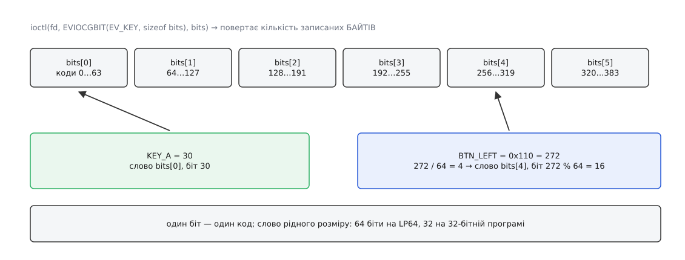

# 📋 Інтерфейс evdev: подія, типи, команди ioctl

Файл `/dev/input/eventN` віддає не текст і не байти довільної форми, а щільно вкладені двійкові структури сталого розміру; усе інше про пристрій — ім'я, перелік можливостей, межі осей, поточний стан — дістають не читанням, а командами `ioctl`. Тут зібрано обидві половини цього контракту: точний вигляд події в пам'яті й повний перелік команд з аргументами, поверненими значеннями та кодами помилок.

## Подія в пам'яті

```c
struct input_event {
#if (__BITS_PER_LONG != 32 || !defined(__USE_TIME_BITS64)) && !defined(__KERNEL__)
	struct timeval time;
#define input_event_sec  time.tv_sec
#define input_event_usec time.tv_usec
#else
	__kernel_ulong_t __sec;
	__kernel_ulong_t __usec;
#define input_event_sec  __sec
#define input_event_usec __usec
#endif
	__u16 type;
	__u16 code;
	__s32 value;
};
```

Гілка препроцесора тут не примха: на 32-бітній системі бібліотека може зібрати `struct timeval` із 64-бітними секундами, і структура перестала б збігатися з тим, що кладе ядро. Тому в такому разі заголовок бере власне поле того самого розміру, що й раніше, і читає його **без знака** — це відсуває вичерпання лічильника з 2038 на 2106 рік ([межа `time_t`](root:sys-unix/time-representation-y2038) від цього нікуди не дівається, лише конкретно тут її обійшли). Наслідок для коду простий: до полів часу звертаються **лише** через `input_event_sec` і `input_event_usec`, бо `ev.time.tv_sec` компілюється не на кожній платформі.

| платформа | розмір події | секунди | вичерпання |
|---|---|---|---|
| 64-бітна (LP64) | 24 байти | 64 біти зі знаком | практично ніколи |
| 32-бітна, класична `timeval` | 16 байтів | 32 біти зі знаком | 2038 |
| 32-бітна з `__USE_TIME_BITS64` | 16 байтів | 32 біти без знака | 2106 |

На sparc64 друге поле розкладено інакше (число плюс вирівнювання), загальний розмір той самий. 32-бітна програма поверх 64-бітного ядра читає саме 16-байтові події — розкладку перекладає [шар сумісності](root:sys-unix/compat-32-on-64), і те саме він робить із аргументами всіх команд нижче.

Правила `read`: буфер мусить умістити щонайменше одну структуру, інакше `EINVAL`; повертається завжди кратна `sizeof(struct input_event)` кількість байтів — половини події не буває. Порожня черга блокує виклик або дає `EAGAIN` за `O_NONBLOCK`.

## Типи подій і прочитання value

| `type` | код | що означає `value` | простір кодів | напрям |
|---|---|---|---|---|
| `EV_SYN` | 0x00 | даних не несе, увесь сенс у `code` | `SYN_*`, до 0x0f | читання |
| `EV_KEY` | 0x01 | `0` відпущено, `1` натиснуто, `2` автоповтор | `KEY_*` і `BTN_*`, до 0x2ff | читання |
| `EV_REL` | 0x02 | знаковий **приріст**; подій із нулем не буває | `REL_*`, до 0x0f | читання |
| `EV_ABS` | 0x03 | абсолютне значення в одиницях пристрою | `ABS_*`, до 0x3f | читання |
| `EV_MSC` | 0x04 | за кодом: `MSC_SCAN` — апаратний скан-код, `MSC_TIMESTAMP` — час самого пристрою в мікросекундах | `MSC_*`, до 0x07 | читання |
| `EV_SW` | 0x05 | `0`/`1` — положення перемикача | `SW_*`, до 0x10 | читання |
| `EV_LED` | 0x11 | `0` згасити, `1` запалити | `LED_*`, до 0x0f | читання і запис |
| `EV_SND` | 0x12 | `SND_TONE` — частота в герцах, `SND_BELL` і `SND_CLICK` — `0`/`1` | `SND_*`, до 0x07 | запис |
| `EV_REP` | 0x14 | мілісекунди | `REP_DELAY` 0, `REP_PERIOD` 1 | читання і запис |
| `EV_FF` | 0x15 | `1` пустити ефект, `0` спинити; `code` — номер ефекту, виданий `EVIOCSFF` | номери ефектів | запис |
| `EV_PWR` | 0x16 | зарезервовано, чинні драйвери не шлють | — | — |
| `EV_FF_STATUS` | 0x17 | `FF_STATUS_STOPPED` або `FF_STATUS_PLAYING` | `FF_STATUS_*` | читання |

«Запис» у стовпці напряму означає буквально `write` тієї самої `struct input_event` у той самий дескриптор: увімкнути Caps Lock — це записати одну подію з типом `EV_LED`, кодом `LED_CAPSL` і значенням 1.

Коди `EV_SYN` варті окремого рядка, бо жоден із них не є даними:

| код | значення |
|---|---|
| `SYN_REPORT` 0 | межа кадру: усе до неї сталося одночасно |
| `SYN_CONFIG` 1 | історичний сигнал зміни налаштувань, драйвери його не шлють |
| `SYN_MT_REPORT` 2 | межа одного контакту в старому [протоколі мультидотику](root:sys-unix/multitouch-protocol) типу A |
| `SYN_DROPPED` 3 | чергу цього клієнта переповнено й скинуто, накопичений стан недійсний |

## Бітові маски: EVIOCGBIT і EVIOCGPROP

Питання «на що цей пристрій здатен» має відповідь у вигляді бітового масиву: біт із номером `c` виставлено — код `c` пристрій уміє.

`EVIOCGBIT(type, len)` розкривається в `_IOC(_IOC_READ, 'E', 0x20 + type, len)`, тобто довжина **вашого** буфера зашита в сам номер команди — [номер ioctl несе розмір аргументу](root:sys-unix/ioctl-interface/api-ioctl-encoding.md), і саме тому команда збирається на місці виклику, а не є сталою. `EVIOCGBIT(0, …)` віддає маску типів, `EVIOCGBIT(EV_KEY, …)` — маску клавіш, `EVIOCGBIT(EV_ABS, …)` — маску осей.

Повертає команда **кількість фактично записаних байтів**: менше з розміру маски в ядрі та вашого буфера. Значення, менше за прохане, помилкою не є — це нормальний спосіб дізнатися, скільки кодів знає ядро, на якому ви зараз.



*Розбирати треба словами рідного розміру, а не байтами: масив укладено як `unsigned long[]`.*

```c
#define NLONGS(n)     (((n) + 8 * sizeof(long) - 1) / (8 * sizeof(long)))
#define TESTBIT(a, b) ((a)[(b) / (8 * sizeof(long))] >> ((b) % (8 * sizeof(long))) & 1)

unsigned long keys[NLONGS(KEY_CNT)] = {0};
int n = ioctl(fd, EVIOCGBIT(EV_KEY, sizeof keys), keys);   /* n — байти, не біти */
if (n > 0 && TESTBIT(keys, KEY_A)) { /* пристрій уміє KEY_A */ }
```

`EVIOCGPROP(len)` віддає так само влаштовану маску `INPUT_PROP_*` — властивостей, які з набору осей не випливають. `INPUT_PROP_DIRECT` каже, що координати збігаються з місцем на екрані (тачскрин), `INPUT_PROP_POINTER` — що вони керують курсором опосередковано (тачпад), `INPUT_PROP_BUTTONPAD` — що вся поверхня є кнопкою. Без цієї маски тачпад і тачскрин нерозрізненні: осі в них однакові.

## Осі: struct input_absinfo

```c
struct input_absinfo {
    __s32 value;       /* поточне значення осі */
    __s32 minimum;     /* межі, оголошені драйвером */
    __s32 maximum;
    __s32 fuzz;        /* шум: менші зміни ядро відкидає */
    __s32 flat;        /* мертва зона навколо середини (джойстик) */
    __s32 resolution;  /* одиниць на міліметр; для кутових осей — на радіан */
};
```

`EVIOCGABS(вісь)` — це `_IOR('E', 0x40 + вісь, struct input_absinfo)`, `EVIOCSABS(вісь)` — `_IOW('E', 0xc0 + вісь, …)`. Запис потрібен калібруванню й лишає два обмеження: `ABS_MT_SLOT` міняти заборонено, а на пристрої без оголошених осей команда дає `EINVAL`. Якщо буфер коротший за структуру, ядро мовчки обнуляє `resolution` — так стара програма не псує поле, якого не знає.

## Команди ioctl

| команда | аргумент | що робить | помилки |
|---|---|---|---|
| `EVIOCGVERSION` | `int` | версія протоколу evdev, зараз `0x010001`; не змінювалась роками, тож як перевірка можливостей марна | — |
| `EVIOCGID` | `struct input_id` | `bustype`, `vendor`, `product`, `version` — те саме, що показує `/proc/bus/input/devices` | — |
| `EVIOCGNAME(len)` | буфер | людське ім'я пристрою | `ENOENT` |
| `EVIOCGPHYS(len)` | буфер | фізичне місце в дереві шин, як-от `usb-0000:00:14.0-2/input0` | `ENOENT` |
| `EVIOCGUNIQ(len)` | буфер | серійний номер, якщо пристрій його повідомляє | `ENOENT` |
| `EVIOCGPROP(len)` | буфер | маска `INPUT_PROP_*` | — |
| `EVIOCGBIT(type, len)` | буфер | маска підтримуваних кодів | `EINVAL` при `type > EV_MAX` |
| `EVIOCGABS(вісь)` / `EVIOCSABS(вісь)` | `struct input_absinfo` | межі й параметри осі | `EINVAL` |
| `EVIOCGKEY(len)`, `EVIOCGLED(len)`, `EVIOCGSND(len)`, `EVIOCGSW(len)` | буфер | знімок поточного стану клавіш, індикаторів, звуків, перемикачів — маскою | — |
| `EVIOCGMTSLOTS(len)` | `__u32` код + масив `__s32` | значення однієї осі `ABS_MT_*` по всіх слотах | `EINVAL` |
| `EVIOCGKEYCODE` / `EVIOCSKEYCODE` | `unsigned int[2]` | рядок таблиці пристрою: `{скан-код, код клавіші}` | `EINVAL` |
| `EVIOCGKEYCODE_V2` / `EVIOCSKEYCODE_V2` | `struct input_keymap_entry` | те саме зі скан-кодом до 32 байтів і доступом за індексом | `EINVAL` |
| `EVIOCGREP` / `EVIOCSREP` | `unsigned int[2]` | затримка й період автоповтору в мілісекундах | `ENOSYS` |
| `EVIOCGRAB` | `int` | ненульове — захопити пристрій, нуль — відпустити | `EBUSY`, `EINVAL` |
| `EVIOCREVOKE` | `int`, лише 0 | назавжди відрізає цей дескриптор від пристрою | `EINVAL` |
| `EVIOCSCLOCKID` | `int` | шкала часу для міток подій | `EINVAL` |
| `EVIOCGMASK` / `EVIOCSMASK` | `struct input_mask` | фільтр подій на цьому дескрипторі | `EFAULT`, `ENODEV` |
| `EVIOCGEFFECTS`, `EVIOCSFF`, `EVIOCRMFF` | `int`, `struct ff_effect`, `int` | скільки ефектів віддачі пристрій тримає водночас; завантажити ефект; стерти за номером | — |

Кілька рядків цієї таблиці приховують домовленості, яких із підпису не видно.

**Знімок стану вичищає чергу.** `EVIOCGKEY`, `EVIOCGLED`, `EVIOCGSND` і `EVIOCGSW` не просто копіюють маску: вони заразом викидають із черги цього клієнта всі невичитані події того самого типу. Інакше знімок і потік перекривалися б, і читач порахував би те саме натискання двічі.

**Таблиця скан-кодів має два вигляди.** Старий (`unsigned int[2]`) не вміє скан-кодів, довших за чотири байти, і не дає перебрати таблицю — треба вгадати скан-код, щоб про нього спитати. Новий кладе `struct input_keymap_entry` з полем `scancode[32]`, куди влазить будь-який HID-шлях, а прапорець `INPUT_KEYMAP_BY_INDEX` перемикає пошук із «знайди за скан-кодом» на «дай рядок номер `index`» — так таблицю вичитують цілком.

**Зміна годинника скидає чергу.** `EVIOCSCLOCKID` приймає лише `CLOCK_REALTIME`, `CLOCK_MONOTONIC` і `CLOCK_BOOTTIME`; на решту — `EINVAL`. Після перемикання ядро скидає накопичене й кладе `SYN_DROPPED`, бо мітки з двох різних [шкал часу](root:sys-unix/kernel-timekeeping) в одній черзі неможливо порівняти. Тому команду віддають першою, зразу після `open`.

**Маска подій прощає невідоме.** Типово всі біти в `struct input_mask` виставлено. Порожня маска для типу означає, що події цього типу більше не потраплятимуть у чергу — і не витрачатимуть буфер на те, що клієнт однаково викидає. Невідомий ядру тип чи задовгий масив помилкою не є: команда приймається, а невідомі коди лишаються нулями, тобто відфільтрованими. Виняток один — `EV_SYN` не фільтрується ніколи: межі кадрів і зізнання про втрату мусять доходити за будь-якої маски.

**Відкликання незворотне.** Після `EVIOCREVOKE` цей дескриптор мертвий: `read` і будь-який `ioctl` дають `ENODEV`, а `poll` повертає `EPOLLHUP | EPOLLERR`, щоб цикл подій не завис на вічному очікуванні. Команда потрібна тому, хто роздає готові дескриптори іншим процесам і мусить уміти забрати їх назад, не покладаючись на чужу добру волю. Захоплення `EVIOCGRAB`, навпаки, знімається саме, щойно дескриптор закривають, — окремого «відпустити при аварії» не існує.

## Коди помилок

| код | коли |
|---|---|
| `EINVAL` | команди немає в цьому ядрі · буфер `read` менший за одну подію · заборонений аргумент (ненульовий для `EVIOCREVOKE`, чужий годинник, `ABS_MT_SLOT`) · відпускає захоплення не той, хто його брав |
| `ENOSYS` | `EVIOCGREP` чи `EVIOCSREP` на пристрої, який не оголосив `EV_REP` |
| `ENODEV` | пристрій від'єднано або дескриптор відкликано |
| `EBUSY` | `EVIOCGRAB`, коли пристрій уже захопив хтось інший |
| `ENOENT` | рядка, який просять (`EVIOCGUNIQ`, `EVIOCGPHYS`), у пристрою немає |
| `EAGAIN` | `O_NONBLOCK` і порожня черга |
| `EFAULT` | буфер не належить процесові |
| `EACCES` | при `open`: прав на вузол немає — доступ до `/dev/input/*` роздають [окремо від звичайних прав](root:sys-unix/device-access-groups) |

`EINVAL` у першому рядку — не просто помилка, а єдиний спосіб перевірити наявність команди: невідомий номер вивалюється з `switch` драйвера саме в нього. Тому клієнти не питають версію ядра, а пробують команду й дивляться на результат.

## Мінімальний робочий виклик

```c
#include <fcntl.h>
#include <stdio.h>
#include <time.h>
#include <unistd.h>
#include <sys/ioctl.h>
#include <linux/input.h>

#define NLONGS(n)     (((n) + 8 * sizeof(long) - 1) / (8 * sizeof(long)))
#define TESTBIT(a, b) ((a)[(b) / (8 * sizeof(long))] >> ((b) % (8 * sizeof(long))) & 1)

int main(void)
{
    int fd = open("/dev/input/event0", O_RDONLY | O_NONBLOCK);
    if (fd < 0) { perror("open"); return 1; }

    int clk = CLOCK_MONOTONIC;
    ioctl(fd, EVIOCSCLOCKID, &clk);          /* доки черга ще порожня */

    char name[256] = "";
    ioctl(fd, EVIOCGNAME(sizeof name - 1), name);

    unsigned long types[NLONGS(EV_CNT)] = {0};
    ioctl(fd, EVIOCGBIT(0, sizeof types), types);

    printf("%s:%s%s%s\n", name,
           TESTBIT(types, EV_KEY) ? " клавіші"   : "",
           TESTBIT(types, EV_REL) ? " відносні"  : "",
           TESTBIT(types, EV_ABS) ? " абсолютні" : "");

    if (TESTBIT(types, EV_ABS)) {
        struct input_absinfo abs;
        if (ioctl(fd, EVIOCGABS(ABS_X), &abs) == 0)
            printf("ABS_X: %d..%d, шум %d, %d одиниць на мм\n",
                   abs.minimum, abs.maximum, abs.fuzz, abs.resolution);
    }

    close(fd);
    return 0;
}
```

`EVIOCGNAME` повертає довжину разом із завершальним нулем, але задовге ім'я обрізає **без** нуля — тому в прикладі буфер оголошено на байт більший за прохане, і останній байт лишається нулем за будь-якого результату.
