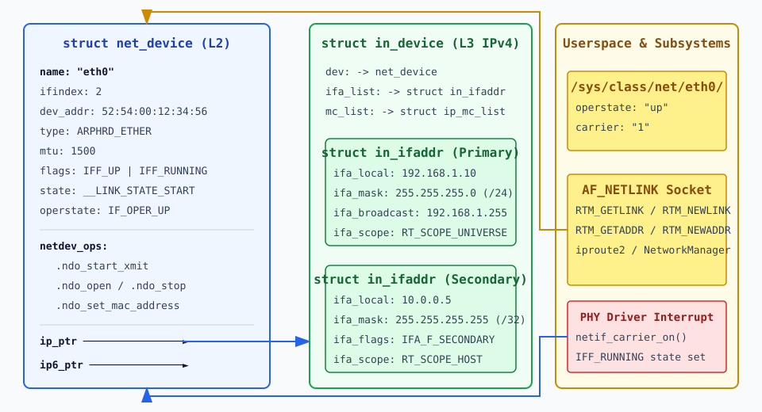

# Інтерфейси, адреси й стан лінка

<preknowlist>
- [Мережевий стек Linux](root:sys-unix/network-stack-architecture) — загальна архітектура проходження пакетів через шари L2/L3 у ядрі.
- [Протокол Netlink](root:sys-unix/netlink-protocol) — асинхронна міжпроцесна взаємодія між ядром Linux та простором користувача.
</preknowlist>

Коли системна плата сервера отримує живильний імпульс і ядро Linux завершує ініціалізацію PCI-автовиявлення, мережевий контролер виходить зі стану скидання. Драйвер пристрою опитує шину, зчитує вміст EEPROM або Flash-пам'яті мережевої карти, реєструє переривання MSI-X і виділяє в операційній пам'яті головну об'єктну структуру мережевої підсистеми. У цей момент фізичне залізо перетворюється для системи на програмну абстракцію — мережевий інтерфейс.

Мережеві пристрої у Unix не мають файлів символьних чи блокових пристроїв у каталозі `/dev` і не підпорядковуються класичній схемі `major/minor` номерів. Замість файлових системних викликів `read()` та `write()` операційна система оперує кільцевими буферами пакетів (`sk_buff`), чергами передачі (Tx/Rx queues) і мережевими адресами різного рівня OSI.

## Абстракція мережевого пристрою: `struct net_device`

Кожен мережевий інтерфейс у ядрі Linux — фізичний порт Ethernet, бездротовий Wi-Fi адаптер, тунель GRE, віртуальний міст Bridge чи парний пристрій `veth` — описується структурою `struct net_device` (визначена в `<linux/netdevice.h>`). Вона є однією з найбільших структур ядра і містить сотні полів для керування канальним рівнем (L2), збору статистики, взаємодії з драйвером та прив'язки протоколів L3.

### Ключові поля `struct net_device`

Внутрішньо об'єкт `net_device` розбитий на декілька концептуальних блоків:

1. **Ідентифікація та індексація**:
   * `name`: Рядковий ідентифікатор інтерфейсу (наприклад, `eth0`, `enp3s0`, `wlan0`, `lo`). Обмежений константою `IFNAMSIZ` (16 байтів разом із нульовим термінатором).
   * `ifindex`: Унікальний системний числовий індекс пристрою (ціле додатне число). Індекси призначаються послідовно при реєстрації інтерфейсу і не змінюються протягом життя об'єкта. Програмні сокети зв'язуються з конкретним інтерфейсом через системний виклик `setsockopt()` з опцією `SO_BINDTODEVICE` або через опції адреси `sockaddr_ll.sll_ifindex`.

2. **Характеристики канального рівня (L2)**:
   * `dev_addr`: Постійний масив байтів, що містить поточну апаратну MAC-адресу (для Ethernet — 6 байтів).
   * `perm_addr`: Заводська MAC-адреса, зчитана з ROM контролера (застосовується для відновлення оригінальної адреси після підміни `dev_addr`).
   * `addr_len`: Довжина апаратної адреси в байтах (6 для Ethernet, 8 для IEEE 802.15.4, 0 для тунелів P-t-P).
   * `type`: Тип апаратури згідно з заголовком `<linux/if_arp.h>` (наприклад, `ARPHRD_ETHER` для Ethernet, `ARPHRD_LOOPBACK` для loopback, `ARPHRD_PPP` для точкових з'єднань).
   * `mtu`: Maximum Transmission Unit — максимальний розмір корисного навантаження кадру L2 в байтах без урахування заголовочної частини Ethernet (стандартно 1500 байтів, для Jumbo-кадрів — до 9000 байтів, для loopback — 65536 байтів).

3. **Бітові прапорці стану**:
   * `flags`: Бітова маска адміністративного та конфігураційного стану (таблиця нижче).
   * `priv_flags`: Внутрішні прапорці ядра, приховані від прямого редагування з користувацького простору (наприклад, `IFF_EBRIDGE` для мостів, `IFF_802_1Q_VLAN` для VLAN-пристроїв, `IFF_OPENVSWITCH`).

4. **Операційний вектор драйвера (`netdev_ops`)**:
   Вказівник на структуру `struct net_device_ops`, яка інкапсулює процедури драйвера:
   * `.ndo_open`: Викликається при активації інтерфейсу (команда `ip link set dev up`). Ініціалізує черги DMA та переривання.
   * `.ndo_stop`: Викликається при деактивації інтерфейсу (`ip link set dev down`). Зупиняє передачу і звільняє апаратні ресурси.
   * `.ndo_start_xmit`: Головна функція передачі кадру. Мережевий стек передає в неї готовий пакет `struct sk_buff`. Якщо апаратна черга повна, функція повертає `NETDEV_TX_BUSY`.
   * `.ndo_set_mac_address`: Змінює апаратну MAC-адресу пристрою.
   * `.ndo_change_mtu`: Валідує та змінює розмір MTU.
   * `.ndo_get_stats64`: Заповнює структуру розширеної лічильникової статистики (пакети, байти, колізії, відкинуті кадри).

5. **Вказівники на конфігурацію протоколів L3**:
   * `ip_ptr`: Вказівник на структуру `struct in_device`, яка зберігає прив'язані IPv4-адреси та параметри IGMP/ARP.
   * `ip6_ptr`: Вказівник на структуру `struct inet6_dev`, що відповідає за IPv6-адреси, ICMPv6 та Neighbor Discovery.

```
┌──────────────────────────────────────────────────────────────────────────┐
│                         struct net_device                                │
├──────────────────────────┬───────────────────────────────────────────────┤
│ name: "eth0"             │ type: ARPHRD_ETHER                            │
│ ifindex: 2               │ mtu: 1500                                     │
│ dev_addr: 52:54:00:12... │ flags: IFF_UP | IFF_BROADCAST | IFF_RUNNING   │
├──────────────────────────┴───────────────────────────────────────────────┤
│ netdev_ops  ───────────► .ndo_start_xmit, .ndo_open, .ndo_stop           │
│ ip_ptr      ───────────► struct in_device (IPv4 адреси та маски)        │
│ ip6_ptr     ───────────► struct inet6_dev (IPv6 адреси та SLAAC)         │
└──────────────────────────────────────────────────────────────────────────┘
```

### Синхронізація та безпека потоків: RTNL Lock та RCU

На багатоядерних процесорних системах (SMP) мережеві пристрої обробляють мільйони пакетів на секунду у контексті м'яких переривань (SoftIRQ), поки у просторі користувача адміністратори змінюють IP-адреси та маршрути. Для відсутності стану гонитви (Race Conditions) ядро застосовує два принципово різних механізми синхронізації:

1. **Глобальне блокування RTNL Mutex (`rtnl_lock()`)**: Усі конфігураційні зміни канального та мережевого рівнів (додавання адрес, зміна MTU, підйоми лінків, налаштування RTNETLINK) виконуються під егідою одного глобального ядрашного м'ютекса — RTNL Lock (`rtnl_lock()` / `rtnl_unlock()`). Це гарантує, що два процеси у просторі користувача не зможуть одночасно змінити стан того самого пристрою.
2. **Механізм RCU (Read-Copy-Update) для швидкого шляху (Fast Path)**: Під час обробки кожного вхідного пакета мережевий стек повинен прочитати вказівник `ip_ptr` та проітерувати список `in_ifaddr`. Використання спинблоків або м'ютексів на цьому шляху призвело б до величезного падіння продуктивності. Замість цього ядро захищає вказівник `ip_ptr` механізмом RCU. Обробник пакетів викликає `rcu_read_lock()`, швидко зчитує IP-адресу без жодного блокування шини, і викликає `rcu_read_unlock()`. Якщо в цей момент адміністратор видаляє адресу, ядро виключає елемент зі списку, але фізично звільняє пам'ять викликом `kfree_rcu()` лише після того, як усі потоки ядра завершать поточний такт обробки RCU.

### Життєвий цикл структури `net_device`

Пам'ять під `net_device` виділяється функцією `alloc_netdev()` або її спеціалізованим обгортковим макросом `alloc_etherdev()`. Разом із самою структурою ядро виділяє додатковий блок пам'яті під приватні дані драйвера (Private Data), доступні через макрос `netdev_priv(dev)`.

Реєстрація у системі виконується функцією `register_netdev(dev)`. Після цього ядро робить новий пристрій видимим у системному каталозі `/sys/class/net/<name>`, створює записи в procfs та надсилає мультикаст-повідомлення `RTM_NEWLINK` через сокет RTNETLINK.

Видалення пристрою є двоетапним процесом із застосуванням механізму RCU. Викликом `unregister_netdev(dev)` пристрій виключається зі глобальних списків ядра, але пам'ять звільняється функцією `free_netdev()` лише після того, як усі паралельні потоки ядра закінчать обробку пакетів, що посилалися на цей об'єкт.

## Таблиця адміністративних та апаратних прапорців `flags`

Прапорці стану визначені у заголовку `<linux/if.h>`. Вони визначають модальність роботи інтерфейсу:

| Прапорець | Числове значення | Опис та механічна дія в ядрі |
| :--- | :--- | :--- |
| `IFF_UP` | `0x1` | Інтерфейс піднято адміністративно (`ip link set up`). Ядро дозволяє надсилати пакети. |
| `IFF_BROADCAST` | `0x2` | Пристрій підтримує широкомовні кадри (Ethernet). |
| `IFF_DEBUG` | `0x4` | Увімкнено внутрішнє драйверне налагодження. |
| `IFF_LOOPBACK` | `0x8` | Інтерфейс є програмним петльовим пристроєм зворотного зв'язку (`lo`). |
| `IFF_POINTOPOINT` | `0x10` | З'єднання «точка-точка» (PPP, GRE тунель). MAC-адреси відсутні. |
| `IFF_NOTRAILERS` | `0x20` | Заборона використання трейлерів Ethernet (застаріле). |
| `IFF_RUNNING` | `0x40` | Операційний стан: фізичний лінк встановлено, апаратна черга готова до роботи. |
| `IFF_NOARP` | `0x80` | Відключено протокол ARP на цьому інтерфейсі (статичне мапування L2/L3). |
| `IFF_PROMISC` | `0x100` | Нерозбірливий режим (Promiscuous Mode). Апаратний фільтр NIC вимикається, і пристрій приймає всі кадри сегмента. |
| `IFF_ALLMULTI` | `0x200` | Приймати всі мультикаст-кадри (Multicast Promiscuous). |
| `IFF_MASTER` | `0x400` | Пристрій є агрегатором (Bonding master / Bridge). |
| `IFF_SLAVE` | `0x800` | Пристрій підпорядкований агрегатору (Bonding slave). |
| `IFF_MULTICAST` | `0x1000` | Підтримка апаратного мультикасту L2. |
| `IFF_LOWER_UP` | `0x10000` | Сигнал фізичного носія (Carrier Active). Керується функцією `netif_carrier_on()`. |

## Багаторівнева адресація: L2 (MAC) та L3 (IPv4/IPv6)

Для доставки даних мережевому стеку необхідно зв'язати локальний апаратний ідентифікатор канального рівня із глобальними мережевими адресами.

### Канал L2: MAC-адреса та апаратний фільтр NIC

Мережевий адаптер Ethernet використовує 48-бітну (6 байтів) MAC-адресу (Media Access Control). Адреса записується у шістнадцятковому форматі, наприклад `52:54:00:12:34:56`.

Перші 3 байти називаються **OUI (Organizationally Unique Identifier)** — це ідентифікатор виробника обладнання, який присвоюється інститутом IEEE. Наступні 3 байти призначаються вендором для кожного випущеного чипа.

Два найстарші біти першого байта мають особливе математичне значення:
* **Бит 0 (Multicast/Unicast)**: Якщо біт дорівнює `0`, адреса є індивідуальною (Unicast). Якщо біт дорівнює `1`, це мультикаст-адреса. Широкомовна адреса `FF:FF:FF:FF:FF:FF` має всі біти, встановлені в `1`.
* **Бит 1 (Local/Global)**: Якщо біт дорівнює `0`, адреса є глобально унікальною (Burned-In Address, BIA). Якщо біт дорівнює `1`, адреса локально згенерована адміністратором або віртуалізатором (Locally Administered Address).

Коли мережева карта приймає кадр із кабелю або радіоефіру, її апаратний ASIC-фільтр перевіряє destination MAC-адресу. Кадр приймається і копіюється у буфер DMA лише за виконання однієї з трьох умов:
1. Destination MAC збігається із вмістом регістра `dev_addr`;
2. Destination MAC є широкомовним (`FF:FF:FF:FF:FF:FF`) або входить у підписану таблицю мультикаст-фільтра;
3. На пристрої активовано прапорець `IFF_PROMISC` (використовується аналізаторами трафіку, такими як `tcpdump` або Wireshark).

Якщо жодна умова не виконується, мережевий адаптер скидає кадр на апаратному рівні без генерації переривання процесора, заощаджуючи ресурси системи.

### Підсистема фільтрації L2: Нерозбірливий режим (Promiscuous Mode) та лічильники посилань

Коли утиліта трасування трафіку (наприклад, `tcpdump` або `dumpcap`) відкриває сирий сокет `AF_PACKET`, ядро активує нерозбірливий режим на інтерфейсі викликом функції `dev_set_promiscuity(dev, 1)`.

Оскільки декілька аналізаторів можуть бути запущені одночасно, ядро веде цілочисельний лічильник посилань `dev->promiscuity`. Кожен новий запит збільшує лічильник на 1. Апаратний прапорець `IFF_PROMISC` встановлюється у контролері NIC при переході лічильника з 0 до 1, і знімається лише тоді, коли лічильник викликом `dev_set_promiscuity(dev, -1)` знову опускається до 0. Це запобігає випадковому вимкненню проміскуїтетного режиму для одного аналізатора при закритті іншого.

Аналогічний механізм лічильників застосовується і для прапорця `IFF_ALLMULTI` викликом `dev_set_allmulti(dev, 1)`.

### Рівень L3 IPv4: Структури `in_device` та `in_ifaddr`

Один мережевий інтерфейс канального рівня може мати декілька призначених IPv4-адрес. У ядрі Linux зв'язок між `struct net_device` та адресами IPv4 реалізований через дволанцюгову структуру даних.

Поле `dev->ip_ptr` вказує на структуру `struct in_device`. У цій структурі поле `ifa_list` містить однозв'язний список об'єктів `struct in_ifaddr`:

```c
struct in_ifaddr {
    struct in_ifaddr   *ifa_next;      /* Вказівник на наступну адресу в списку */
    struct in_device   *ifa_dev;       /* Зворотний вказівник на пристрій */
    __be32             ifa_local;      /* Локальна IP-адреса хоста (Big-Endian) */
    __be32             ifa_address;    /* IP-адреса призначення (для P-t-P) */
    __be32             ifa_mask;       /* Маска підмережі у форматі Big-Endian */
    __be32             ifa_broadcast;  /* Wide-area широкомовна адреса */
    unsigned char      ifa_prefixlen;  /* Довжина CIDR-префікса (0..32) */
    unsigned char      ifa_flags;      /* Прапорці адреси (IFA_F_SECONDARY тощо) */
    unsigned char      ifa_scope;      /* Область видимості адреси */
    char               ifa_label[IFNAMSIZ]; /* Назва адреси чи псевдоніма */
};
```

Перша адреса в списку `ifa_list` вважається **головною (Primary IP)**. Усі наступні адреси, додані в ту саму підмережу, отримують прапорець `IFA_F_SECONDARY`. Це має важливе значення при виборі джерела адреси (Source Address Selection): коли процес надсилає пакет через інтерфейс без явного виклику `bind()`, ядро бере виключно Первинну адресу.

З детальною історією того, як ядро позбулося обмежень старого інструментарію та псевдонімів `eth0:1`, можна ознайомитися у вставці [Еволюція від ioctl до Netlink](root:sys-unix/interfaces-and-addresses/hist-ifconfig-to-iproute2.md).

#### Область видимості адреси (`ifa_scope`)

Ядро Linux використовує поняття Scope (область видимості) для обмеження діапазону маршрутизації адреси:
* `RT_SCOPE_UNIVERSE` (0): Глобальна адреса, доступна з будь-якої точки мережі Інтернет.
* `RT_SCOPE_SITE` (200): Локальна для сайту (застаріло у IPv4, використовувалося для приватних мереж).
* `RT_SCOPE_LINK` (253): Дійсна тільки в межах безпосереднього локального сегмента кабелю (Link-Local). Пакети з такою адресою джерела не маршрутизуються через шлюзи.
* `RT_SCOPE_HOST` (254): Локальна для поточного хоста (використовується для loopback-адрес `127.0.0.1`). Пакети ніколи не залишають межі операційної системи.

### Автоматичний вибір джерела адреси (Source Address Selection)

Коли додаток створює сокет і робить виклик `connect(fd, &dest_addr, ...)` без попереднього прив'язування до конкретної локальної адреси через `bind()`, мережевий стек повинен автоматично обрати оптимальну локальну IP-адресу виходу. Цей процес регулюється алгоритмом Source Address Selection:

1. Ядро виконує пошук у таблиці маршрутизації (`fib_lookup()`) для визначення вихідного мережевого пристрою `net_device` та маршруту Next-Hop.
2. Якщо у знайденому маршруті явно вказано атрибут `src` (наприклад, `ip route add default via 192.168.1.1 dev eth0 src 192.168.1.50`), ядро негайно вибирає вказану адресу.
3. Якщо атрибут `src` відсутній, ядро сканує список `ifa_list` структури `in_device` вихідного інтерфейсу.
4. Ядро шукає адресу, чий `ifa_scope` не перевищує scope маршруту призначення, віддаючи перевагу первинній адресі (`Primary IP`), яка належить до тієї самої підмережі, що й Next-Hop шлюз.

### Рівень L3 IPv6: Структури `inet6_dev` та `inet6_ifaddr`

В архітектурі IPv6 кожен інтерфейс обов'язково має принаймні одну Link-Local адресу (з префіксом `fe80::/10`), згенеровану автоматично або на основі EUI-64 / Privacy Extensions (RFC 4941).

IPv6-адреси зберігаються у полі `dev->ip6_ptr` в структурі `struct inet6_dev`. Окремі адреси описуються структурою `struct inet6_ifaddr`.

На відміну від IPv4, де адреса стає активною миттєво після запису у регістр, кожна IPv6-адреса при появі проходить обов'язковий процес **DAD (Duplicate Address Detection — виявлення дубльованих адрес)**:
1. При додаванні адреса отримує прапорець `IFA_F_TENTATIVE` (попередня).
2. Ядро надсилає у мережу ICMPv6-запит Neighbor Solicitation до спеціальної адреси Solicited-Node Multicast (`ff02::1:ffXX:XXXX`).
3. Якщо протягом тайм-ауту відповіді Neighbor Advertisement не надійшло, прапорець `IFA_F_TENTATIVE` знімається, і адреса стає активною.
4. Якщо виявлено конфлікт, адреса отримує прапорець `IFA_F_DADFAILED`, деактивується, і ядро генерує системне сповіщення про помилку.

## Анатомія CIDR, масок та підмереж

IPv4-адреса складається з 32 бітів (4 байти). Вузол мережі не може визначити, яка частина адреси відповідає за номер мережі, а яка — за номер хоста, без маски підмережі.

### Безкласова маршрутизація CIDR (Classless Inter-Domain Routing)

До 1993 року IP-адреси ділилися на жорсткі класи A (маска `/8`), B (маска `/16`) та C (маска `/24`). CIDR замінив цю схему довільною довжиною маски.

Маска підмережі — це 32-бітне число, де старші `N` бітів дорівнюють `1`, а решта `32 - N` бітів дорівнюють `0`. Число `N` називається **префіксом підмережі**.

Математичний алгоритм виділення адрес у ядрі описується побітовими операціями:

```
[IP-адреса хоста]        192.168.1.10      --> 11000000.168.00000001.00001010
[Маска /24]              255.255.255.0     --> 11111111.11111111.11111111.00000000
-------------------------------------------------------------------------------
[Мережева адреса (AND)]   192.168.1.0       --> 11000000.168.00000001.00000000
[Інверсна маска (~NOT)]  0.0.0.255         --> 00000000.00000000.00000000.11111111
[Широкомовна (OR)]       192.168.1.255     --> 11000000.168.00000001.11111111
```

Математичні формули для підрахунку характеристик підмережі:

```
Розмір адресного простору N_total = 2^(32 - Prefix)
Кількість робочих хостів  N_hosts = 2^(32 - Prefix) - 2
```

Дві адреси віднімаються тому, що адреса з усіма нулями в частині хоста ідентифікує саму мережу, а адреса з усіма одиницями є широкомовною (Broadcast).

### Спеціальні випадки префіксів

1. **Префікс `/32` (Хост-маршрут)**:
   Маска `255.255.255.255`. Містить рівно 1 IP-адресу (`2^0 = 1`). У ній немає окремих адрес мережі та широкомовлення. Використовується для призначення Loopback-адрес, прив'язки сервісів у BGP/OSPF (Loopback Router ID) та в тунельних ендпоінтах.

2. **Префікс `/31` (Точкові з'єднання RFC 3021)**:
   Містить 2 адреси (`2^1 = 2`). За стандартом RFC 3021 обидві адреси використовуються як робочі IP-адреси двох кінців кабелю Point-to-Point між двома маршрутизаторами. Це заощаджує 50% IP-адрес на магістральних каналах.

3. **Префікс `/30` (Застаріле P-t-P з'єднання)**:
   Містить 4 адреси (`2^2 = 4`), з яких для хостів придатні лише 2 (наприклад, `.1` та `.2`), а `.0` — мережа, `.3` — широкомовлення.

4. **Префікс `/0` (Зашкоджений дефолтний маршрут)**:
   Маска `0.0.0.0`. Покриває увесь IPv4 адресний простір. Використовується для позначення шлюзу за замовчуванням (Default Gateway, `0.0.0.0/0`).

## Динамічний стан лінка: `IFF_UP`, `IFF_RUNNING` та Operstate

Розуміння стану мережевого інтерфейсу вимагає чіткого розмежування адміністративного наміру користувача та апаратного стану фізичного середовища.

### Двофазна модель стану: Administrative vs Physical State

Інтерфейс має два незалежних рівня готовності:
* **Адміністративний стан (`IFF_UP`)**: Керується оператором системи за допомогою команд `ip link set dev <name> up/down`. Якщо прапорець `IFF_UP` скинуто, ядро забороняє будь-яку обробку пакетів на інтерфейсі, а драйвер переводить физ-чип (PHY) у режим енергозбереження.
* **Фізичний стан носія (`IFF_RUNNING` / `IFF_LOWER_UP`)**: Відповідає за наявність фізичного зв'язку (Carrier Signal). Прапорець встановлюється драйвером лише тоді, коли мережева карта задетектувала електричний чи оптичний сигнал від мережевого комутатора (Ethernet Link Pulse).

```
   [Команда оператора: ip link set eth0 up]
                       │
                       ▼
            Прапорець IFF_UP = 1
                       │
                       ▼
       [Апаратне автоузгодження PHY Auto-Negotiation]
                       │
             ┌─────────┴─────────┐
             ▼                   ▼
    Узгодження успішне    Кабель витягнуто
             │                   │
             ▼                   ▼
    netif_carrier_on()  netif_carrier_off()
             │                   │
             ▼                   ▼
   IFF_RUNNING = 1       IFF_RUNNING = 0
   operstate = UP        operstate = LOWERLAYERDOWN
```

Перехід фізичного лінка контролюється підсистемою ядра `phy_state_machine()`. Коли апаратне переривання сповіщає про втрату зв'язку, драйвер викликає функцію ядра `netif_carrier_off(dev)`. Ядро скидає прапорець `IFF_RUNNING` та виключає інтерфейс із таблиць вибору маршрутів. Коли кабель вставляють назад, драйвер викликає `netif_carrier_on(dev)`.

### Підсистема NAPI (New API) та модерація переривань

При отриманні високошвидкісного потоку пакетів (наприклад, 10 або 100 Гбіт/с Ethernet) генерація апаратного переривання на кожен вхідний кадр призвела б до перевантаження процесора (Interrupt Storm).

Для уникнення цієї проблеми ядро Linux застосовує гібридну підсистему **NAPI (New API)**:
1. При надходженні першого пакета мережева карта генерує апаратне переривання.
2. Обробник переривань драйвера тимчасово вимикає подальші переривання прийому на мережевій карті.
3. Драйвер реєструє структуру `struct napi_struct` у списку ядра та планує виконання м'якого переривання `NET_RX_SOFTIRQ`.
4. Ядро у контексті м'якого переривання опитує кільцевий буфер прийому (Rx Ring) короткими порціями (квота `netdev_budget`, стандартно 64 пакети).
5. Коли кільцевий буфер стає порожнім, NAPI виключає опитування та знову вмикає апаратні переривання NIC.

### Аварійні тайм-аути передачі (Tx Timeout Watchdog)

Якщо мережева карта зависає через апаратний збій або зависання кільцевого буфера DMA, вона припиняє надсилати пакети, хоча прапорці `IFF_UP` та `IFF_RUNNING` залишаються встановленими.

Для запобігання мовчазній відмові ядро реалізує таймер `netdev_watchdog()`. Кожного разу, коли стек передає пакет у драйвер викликом `.ndo_start_xmit`, оновлюється поле `trans_start`. Якщо черга передачі залишається заблокованою довше ніж `dev->watchdog_timeo` (зазвичай 5 секунд), ядро фіксує аварію Tx Timeout, викликає процедуру драйвера `.ndo_tx_timeout()`, скидає апаратний контролер і генерує системну подію.

### Операційний стан RFC 2863 (`operstate`)

Оскільки комбінація прапорців `IFF_UP` та `IFF_RUNNING` не охоплювала складні сценарії (наприклад, підкладка під тунелями, авторизація 802.1X або віртуальні стеки), ядро Linux імплементувало стандарт RFC 2863 через поле `operstate`.

Можливі значення `operstate` (знаходяться у файлі `/sys/class/net/<ifname>/operstate`):
1. `unknown`: Стан не визначений драйвером (типово для віртуальних драйверів застарілого типу).
2. `notpresent`: Апаратне забезпечення відсутнє (наприклад, витягнуто карту SFP/USB).
3. `down`: Інтерфейс вимкнено адміністративно (`IFF_UP = 0`).
4. `lowerlayerdown`: Інтерфейс піднято адміністративно (`IFF_UP = 1`), але підстилаючий фізичний пристрій не має лінка (`IFF_RUNNING = 0`). Наприклад, VLAN-інтерфейс `eth0.10` піднято, але кабель з `eth0` витягнуто.
5. `testing`: Інтерфейс перебуває в режимі апаратного самотестування (Loopback diagnostic).
6. `dormant`: Інтерфейс очікує на зовнішню подію (наприклад, завершення сесії шифрування EAPOL/802.1X). Пакети даних не пропускаються.
7. `up`: Інтерфейс повністю готовий до роботи, лінк узгоджено, пакети передаються в обох напрямках.

### Інспектування стану через sysfs, procfs, Tracepoints та eBPF XDP

Ядро надає прямому користувачеві та інструментам трасування актуальну інформацію про стан інтерфейсу:

* `/sys/class/net/<ifname>/operstate` — поточний текстовий стан RFC 2863 (`up`, `down` тощо).
* `/sys/class/net/<ifname>/carrier` — числове значення наявності носія (`1` — лінк є, `0` — немає). Спроба прочитати файл при `IFF_UP = 0` повертає помилку `EINVAL`.
* `/sys/class/net/<ifname>/flags` — шістнадцяткова бітова маска прапорців (наприклад, `0x1003` для `IFF_UP | IFF_BROADCAST | IFF_MULTICAST`).
* `/sys/class/net/<ifname>/mtu` — поточне значення MTU.
* `/sys/class/net/<ifname>/address` — поточна MAC-адреса у текстовому вигляді.
* `/sys/class/net/<ifname>/statistics/` — детальні лічильники `rx_packets`, `tx_packets`, `rx_bytes`, `tx_bytes`, `rx_errors`, `tx_errors`, `rx_dropped`.
* `/proc/net/dev` — текстова таблиця лічильників усіх мережевих пристроїв.
* `/proc/net/if_inet6` — список усіх IPv6-адрес із позначенням їхнього `ifindex` та `scope`.

У найсучасніших архітектурах обробки трафіку поверх `net_device` підключаються BPF-програми через підсистему **XDP (eXpress Data Path)**. Драйвер пристрою виконує eBPF-код безпосередньо у кільцевому буфері NAPI ще до виділення пам'яті під `sk_buff`. Програма може миттєво повернути вердикт `XDP_DROP` (скинути пакет), `XDP_TX` (відправити назад у порт) або `XDP_PASS` (передати стандартному мережевому стеку ядра).

Для низькорівневої діагностики без накладних витрат ядро надає системи статичних точок трасування (Tracepoints):
* `net:net_dev_xmit`: Фіксує передачу кадру `sk_buff` у драйвер пристрою.
* `net:netif_receive_skb`: Фіксує прийом кадру з драйвера у мережевий стек L2/L3.

Використовуючи інструмент `bpftrace`, розробники можуть в реальному часі відстежувати затримки передачі через `net_device`:

```bash
# Трасування передачі пакетів через конкретний мережевий пристрій
bpftrace -e 'tracepoint:net:net_dev_xmit { printf("Dev: %s, Len: %d\n", args->name, args->len); }'
```

## Архітектура віртуальних інтерфейсів (`veth`, `bridge`, `macvlan`, `dummy`)

Окрім драйверів для фізичних мережевих адаптерів, ядро Linux містить широкий набір програмних драйверів віртуальних мережевих пристроїв:

1. **Парні віртуальні інтерфейси (`veth`)**:
   Створюються завжди парами (наприклад, `veth0` та `veth1`). Передача кадру у `.ndo_start_xmit` пристрою `veth0` призводить до того, що функція драйвера миттєво викликає `netif_rx()` для `veth1`. Парні інтерфейси `veth` слугують основним з'єднувальним містком між мережевими просторами назв контейнерів Docker/Kubernetes та основним стеком хоста.

2. **Програмний мережевий міст (`bridge`)**:
   Віртуальний пристрій, що імітує апаратний комутатор L2. Пристрій `bridge` об'єднує декілька фізичних чи віртуальних портів, веде таблицю вивчення MAC-адрес (FDB — Forwarding Database) і виконує комутацію кадрів між портами без виходу на рівень L3.

3. **Драйвери `macvlan` та `macvtap`**:
   Дозволяють створити декілька віртуальних мережевих інтерфейсів із власними унікальними MAC-адресами поверх одного фізичного адаптера Ethernet. Це забезпечує прямий доступ віртуальних машин або контейнерів до локальної фізичної мережі без накладних витрат на програмне мостування.

4. **Заглушка (`dummy`)**:
   Програмний інтерфейс, який скидає всі передані кадри (аналог `/dev/null` у мережевому стеку). Використовується для налаштування BGP Anycast адрес, які повинні залишатися постійно активними на хості незалежно від стану фізичних портів.

## Мережеві простори назв (Network Namespaces) та міграція пристроїв

У ядрі Linux кожен об'єкт `struct net_device` належить до конкретного мережевого простору назв `struct net` (доступний через макрос `dev_net(dev)`).

Коли системний адміністратор переміщує мережевий пристрій між просторами назв (наприклад, переміщує кінець `veth` пари у контейнер викликом `ip link set dev veth1 netns <pid>`), у ядрі відбувається фундаментальна перебудова:

1. Ядро бере глобальне блокування `rtnl_lock()`.
2. Пристрій виключається зі списків старого простору назв, надсилаючи сповіщення `RTM_DELLINK`.
3. Видаляються всі прив'язані IPv4 та IPv6 адреси, очищаються таблиці ARP/NDP та виключаються всі сокети.
4. Пристрій перепідключається до списку `net_device` нового простору назв `struct net`.
5. Пристрою призначається новий унікальний `ifindex` у контексті нового простору назв.
6. Дерево файлової системи sysfs `/sys/class/net/` перебудовується у відповідному каталозі `/proc/<pid>/net/`.
7. Ядро надсилає сповіщення `RTM_NEWLINK` у мультикаст-групу Netlink нового простору назв.

## Особливості інтерфейсу Loopback (`lo`)

Інтерфейс зворотного зв'язку (Loopback, `lo`) є особливим псевдо-пристроєм ядра. Він створюється автоматично при старті мережевої підсистеми і слугує для міжпроцесної взаємодії (IPC) у межах одного хоста через стандартний сокетний API.

```
[Пользовательский процесс A]           [Пользовательский процесс B]
            │                                      ▲
   sendto() │                                      │ recvfrom()
            ▼                                      │
 ┌──────────────────────────────────────────────────────────────────┐
 │                       Мережевий стек ядра                        │
 │  ┌────────────────────────────────────────────────────────────┐  │
 │  │                  Маршрутизація (ip_route_output)           │  │
 │  └──────────────────────────────┬─────────────────────────────┘  │
 │                                 │                                │
 │                                 ▼ loopback_xmit()                │
 │  ┌────────────────────────────────────────────────────────────┐  │
 │  │        skb_orphan() -> netif_rx() / netif_receive_skb()    │  │
 │  └────────────────────────────────────────────────────────────┘  │
 └──────────────────────────────────────────────────────────────────┘
```

### Відсутність DMA, переривань та апаратури

На відміну від фізичних мережевих карт, інтерфейс `lo` позбавлений реального апаратного забезпечення:
1. **Відсутність DMA (Direct Memory Access)**: При передачі даних через `lo` ядро не витрачає час на шину PCIe, створення DMA-дескрипторів та відображення фізичних сторінок пам'яті.
2. **Відсутність апаратних переривань (Hardware Interrupts)**: Отримання пакета не викликає процедуру IRQ.
3. **Робота у контексті виклику**: Передача пакета виконується функцією `loopback_xmit()` (реалізація `.ndo_start_xmit` для `lo`).

Функція `loopback_xmit()` працює за винятково швидким алгоритмом:
```c
/* Спрощена концептуальна схема loopback_xmit у ядрі Linux */
netdev_tx_t loopback_xmit(struct sk_buff *skb, struct net_device *dev) {
    skb_orphan(skb);                  /* Відв'язуємо пакет від сокета відправника */
    skb->protocol = eth_type_trans(skb, dev); /* Налаштовуємо тип L3 протоколу */
    dev_lstats_add(dev, skb->len);    /* Оновлюємо статистику байтів/пакетів */
    netif_rx(skb);                    /* Одразу кладемо пакет у чергу прийому RX */
    return NETDEV_TX_OK;
}
```

Пакет `sk_buff` миттєво повертається назад у вхідну чергу прийому стека (`netif_rx`), минаючи будь-яку фізичну медиа-передачу.

### Оптимізація MTU та продуктивності

Для реальних Ethernet-карт стандартний MTU дорівнює 1500 байтів, оскільки великі кадри на фізичному кабелі збільшують ризик колізій та помилок.

Для `lo` обмеження фізичного кабелю відсутні. Тому за замовчуванням MTU для loopback встановили рівним **65 536 байтів (64 КБ)**. Це дозволяє стеку TCP формувати гігантські сегменти даних (TSO/GSO). Процесор витрачає у 40 разів менше операцій на обробку заголовків TCP/IP при передачі того самого обсягу даних, завдяки чому пропускна здатність `lo` на сучасних процесорах досягає **50–100 Гбіт/с**.

Блок `127.0.0.0/8` (понад 16 мільйонів адрес) зарезервовано для loopback у IPv4. Будь-яка адреса з цього діапазону (наприклад, `127.0.0.1`, `127.0.0.2`, `127.0.1.1`) локалізується ядром і спрямовується через `lo`. У IPv6 для цього використовується єдина адреса `::1/128`.

## Інтерфейс RTNETLINK та підсистема подій

Сучасна конфігурація інтерфейсів та адрес у Linux виконується через підсистему **RTNETLINK** (сокетна родина `AF_NETLINK`, протокол `NETLINK_ROUTE`).

На відміну от синхронних викликів `ioctl()`, RTNETLINK дозволяє:
* Отримувати повні зрізи конфігурації за один системний виклик;
* Підписуватися на мультикаст-групи сповіщень ядра (`RTNLGRP_LINK`, `RTNLGRP_IPV4_IFADDR`, `RTNLGRP_IPV6_IFADDR`).

Коли кабель витягують з порту або на інтерфейсі з'являється нова IP-адреса, ядро формує кадр `RTM_NEWLINK` або `RTM_NEWADDR` і розсилає його всім підписаним демонам простору користувача.

З повним структурним довідником полях повідомлень, прапорцях `ifinfomsg`/`ifaddrmsg`, макросах парсингу та ідіоматичних прикладах коду на мовах C та C++ можна ознайомитися у вставці [Інтерфейс RTNETLINK](root:sys-unix/interfaces-and-addresses/api-rtnetlink.md).

> 🔧 **Навіщо це.**
> Розуміння внутрішнього розмежування `IFF_UP`, `IFF_RUNNING` та `operstate` має вирішальне значення при побудові високонавантажених систем та мережевих демонів:
> 1. **Kubernetes CNI та контейнеризація**: Мережеві плагіни (Calico, Cilium, Flannel) створюють віртуальні `veth`-пари для кожного пода. Стеження за подіями `RTM_NEWLINK` через RTNETLINK дозволяє CNI-демону миттєво дізнаватися про появу нового контейнера і налаштовувати маршрутизацію без опитання файлів `/sys/class/net`.
> 2. **Балансувальники навантаження (HAProxy, Keepalived)**: Демони високої доступності прив'язують плаваючу VIP (Virtual IP) адресу до Loopback або фізичного інтерфейсу з прапорцем `IFA_F_SECONDARY` або маскою `/32`. Якщо фізичний лінк втрачено (`operstate` переходить у `LOWERLAYERDOWN`), Keepalived негайно передає VIP-адресу іншому вузлу кластера.
> 3. **High-Frequency Trading та обробка пакетів**: Програми, що використовують AF_XDP або DPDK, опитують стан `carrier` через sysfs або RTNETLINK для миттєвого переключення трафіку на резервний адаптер при відмові основного порту (Failover).


*Зв'язок структур ядра net_device, in_device та in_ifaddr із підсистемою сповіщень Netlink і файловою системою sysfs.*

Фундаментальні абстракції `struct net_device` та `struct in_device` формують основу мережевої підсистеми Linux. Вони відокремлюють специфіку фізичного апаратного забезпечення канального рівня (L2) від протокольних алгоритмів L3, а двофазна система прапорців `IFF_UP` / `IFF_RUNNING` та `operstate` забезпечує коректне відображення стану носія у системних демонах простору користувача.
