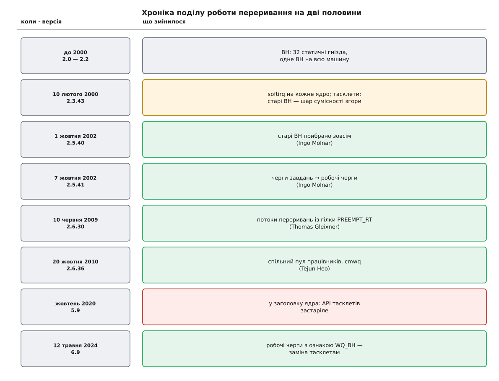

# 📜 Як народжувалася нижня половина

Слова «верхня» й «нижня половина» звучать так, ніби хтось сів і спроєктував поділ роботи переривання надвоє. Насправді нижня половина Linux — це тридцять років латання одного й того самого місця: спершу відкладену роботу зробили простою до примітивності, потім за це заплатили симетричною багатопроцесорністю, потім переписували механізм чотири рази й досі не закінчили. Нижче — датована хроніка з первинних джерел: патчів, журналів змін і комітів.

*Тридцять років і чотири механізми на одному місці: кожен наступний з'являвся тоді, коли попередній упирався в те, чого в момент його народження ще не існувало.*

## Тридцять два гнізда на всю машину

Первісний механізм звався просто **BH** (від *bottom half*) і був масивом на тридцять два вказівники на функції — `bh_base[32]`. Гнізда роздавали не драйверам, а підсистемам, і роздавали статично, переліком у заголовку: `TIMER_BH`, `NET_BH`, `SERIAL_BH`, `TQUEUE_BH`. Драйвер не міг завести собі нове гніздо — він або втискався в чуже, або не мав нижньої половини взагалі. «Позначити роботу» означало ввімкнути розряд у слові `bh_active`; на виході з переривання ядро обходило розряди й викликало те, що знайшло.

Найважливіше сиділо не в масиві, а в правилі виконання: **одночасно на всій машині виконувалося щонайбільше одне BH**. Коментар у тодішньому `kernel/softirq.c` пояснював це прямо — перевірка лічильника гарантувала, що другий процесор до обробників просто не зайде.

> 🔧 **Навіщо це.** У 1994 році правило коштувало нуль: процесор був один, і «одне BH на машину» дорівнювало «одне BH взагалі». Ядро 2.0 (1996) принесло симетричну багатопроцесорність — і те саме правило раптом стало ціною. Поки одне ядро розбирає мережеве BH, друге не може виконати навіть таймерне: воно не чекає на дані, воно чекає на дозвіл. Друга машина, куплена заради мережі, мовчить.

Тому «зробимо SMP» для нижніх половин довго означало «зробимо гірше»: додавання процесорів не додавало пропускної здатності там, де жила майже вся робота драйверів.

## Лютий 2000: softirq і тасклети

Розв'язок приїхав у патчі `patch-2.3.43`, викладеному на kernel.org 10 лютого 2000 року. Патч уводив три речі одразу.

Перша — **softirq**: той самий масив на 32 елементи, але тепер поле «що назбиралося» стало **окремим на кожен процесор** (`softirq_state[NR_CPUS]`), і одна й та сама функція softirq могла бігти на всіх ядрах водночас. Серіалізації більше не було ніде, тож підсистема мусила захищати свої дані сама.

Друга — **тасклет**: надбудова над гніздом `TASKLET_SOFTIRQ` з єдиною гарантією, що конкретний тасклет не виконується на двох ядрах одночасно. Це рівно те, що потрібно драйверові, який не хоче писати замки, і не заважає іншим тасклетам бігти паралельно.

Третя й найцікавіша — **сумісність**. Старі BH нікуди не поділися: кожне з тридцяти двох гнізд стало окремим тасклетом у масиві `bh_task_vec[32]`, а функція `bh_action()` перед викликом старого коду брала спільний `global_bh_lock`. Тобто давню машинну серіалізацію відтворили точно — але тільки для тих, хто ще її потребував. Коментар автора над цим місцем не приховує ставлення: «Bottom halves: globally serialized, grr...» (`kernel/softirq.c`, 2.3.43). Старі драйвери працювали без жодної правки, нові писалися вже на softirq і тасклетах, і перехід розтягнувся на роки замість одного болючого стрибка.

## Кому належить цей патч

Тут доводиться зупинитися й сказати чесно: патч 2.3.43 **не має підпису автора**. Це доба до git, коли зміни приходили Лінусові листом і зливалися без жодного `Signed-off-by`.

Що можна стверджувати з самого патча: softirq приїхали в одному шматку з переробленням мережевого приймання — у тому ж дифі з'являються `softnet_data[NR_CPUS]`, `NET_RX_SOFTIRQ`, `NET_TX_SOFTIRQ` і `net_rx_action()`. Цю роботу («softnet») вів мережевий стек, а його тодішнє ядро тримали Олексій Кузнецов (Інститут ядерних досліджень, Москва) і Девід Міллер. Непрямий доказ авторства лежить у журналі змін 2.5.40, де Інґо Молнар, прибираючи `net_bh_lock`, питає просто в тексті: чи влаштовує такий підхід Олексія. Отже: **авторство softirq за Кузнецовим — правдоподібне й загальновживане приписування, підперте контекстом, але не задокументоване підписом у самому патчі**. Різниця між «зробив» і «немає паперу» тут не риторична: приблизно так і народжуються пізніші суперечки про першість.

## Жовтень 2002: BH ховають, черги завдань замінюють

Паралельно з BH у ядрі жила друга гілка відкладеної роботи — **черги завдань** (`tq_struct`, `tq_immediate`), які виконував звичайний потік ядра `keventd`. Це давало те, чого softirq не дасть ніколи: у такому обробнику можна спати. Заголовок нинішнього `kernel/workqueue.c` досі перелічує, з чийого коду це виросло: Девід Вудгаус, Ендрю Мортон, Кай Петцке, Теодор Ц'о.

Механізм був до простоти прямий: структура з вказівником на функцію ставала в один зі списків, а `keventd` ці списки обходив. Але кожен, кому кортіло, заводив собі власну чергу завдань, і поводилися ці черги по-різному — коли доробка станеться, чи буде вона на тому самому процесорі, що поставив її в чергу, чи можна дочекатися завершення. Одні й ті самі два слова означали різні речі в різних підсистемах.

Розв'язка настала за тиждень восени 2002 року, і обидва кроки зробив Інґо Молнар. У версії 2.5.40 (1 жовтня 2002) його патч зі скромною назвою «smptimers, old BH removal, tq-cleanup» **прибрав старі BH зовсім**: приводом стало те, що зникло останнє важливе гніздо, `TIMER_BH`, і тримати заради решти цілий механізм із машинним замком стало безглуздо. У версії 2.5.41 (7 жовтня 2002) черги завдань замінила **робоча черга**: per-CPU потік-працівник, відкладене за таймером подання роботи, `schedule_work()`.

Від первісного механізму лишилися дві літери. Вони й досі всюди: `local_bh_disable()`, `spin_lock_bh()` — і, як побачимо, у назві його заміни через двадцять два роки.

## 2009: обробник, у якого є власна задача

Наступний зсув прийшов не з мережі, а з реального часу. У гілці латок PREEMPT_RT майже всі драйвери примусово перевели на обробники-потоки: якщо тіло обробника виконує звичайна задача, її можна витіснити, і найгірша затримка системи перестає залежати від найдовшого драйвера.

Томас Ґляйкснер запропонував занести це в основну гілку — обговорення на LKML тривало з жовтня 2008 року, і Лінус наполіг на окремій функції замість переробки всіх викликів `request_irq()`. Коміт `3aa551c9b4c1` («genirq: add threaded interrupt handler support», 23 березня 2009) увів `request_threaded_irq()`: коротка перевірка в апаратному контексті повертає `IRQ_WAKE_THREAD`, і решту робить потік. Зміна вийшла у 2.6.30 (10 червня 2009).

> [Гілка реального часу PREEMPT_RT](root:sys-unix/preempt-rt-kernel-transformation) — набір латок, що робить майже все ядро витісненним заради передбачуваної найгіршої затримки; більшість його ідей поступово переїжджає в основну гілку.

## 2010: пул замість потоку на чергу

Робочі черги зразка 2002 року мали свою ваду: кожна черга заводила власні потоки на кожен процесор. Черг у ядрі ставало все більше, потоків — сотні, і майже всі спали. Теджун Хео переписав цей рівень на схему з **керованою одночасністю** (*concurrency-managed workqueue*, cmwq): працівники стали спільними для всіх черг, а ядро почало стежити за моментом, коли працівник **засинає**, і саме тоді запускати наступного. Зміна ввійшла у 2.6.36 (20 жовтня 2010) — авторство тут задокументоване і в заголовку файлу, і в комітах.

## Довге прощання з тасклетами

Тасклети пережили і BH, і черги завдань, але з 2020 року їх виводять з ужитку. Причина не в швидкості: гарантія «цей тасклет — лише на одному ядрі водночас» тримається на прапорці, який знімають **після** виклику функції драйвера, тож пам'ять під структурою мусить жити довше за саму роботу, а по-справжньому скасувати чи дочекатися тасклета нема чим. Для гілки реального часу додається друге: тасклет виконується в атомарному контексті, а там витіснення заборонене — тобто кожен тасклет знову ставав шматком найгіршої затримки. У ядрі 5.9 у `include/linux/interrupt.h` з'явився запис, що це API застаріле й варто дивитися в бік потоків переривань, із посиланням на лист від команди PREEMPT_RT (linutronix.de) від 16 липня 2020 року; технічно запис приїхав комітом `12cc923f1ccc` Ромена Пер'є, який заодно міняв спосіб ініціалізації тасклетів.

Заміну дописав той самий Теджун Хео: коміт `4cb1ef64609f` («workqueue: Implement BH workqueues to eventually replace tasklets», 4 лютого 2024) додав робочі черги з ознакою **`WQ_BH`** — виконуються там само, у контексті softirq, але через інтерфейс робочих черг, де `cancel` і `flush` роблять те, що обіцяють. Вийшло це в ядрі 6.9 (12 травня 2024).

Кільце замкнулося на іменах: механізм, названий 1994 року «нижньою половиною», прибрали 2002-го, а те, що 2024-го посіло місце його останнього спадкоємця, знову зветься `BH`.
