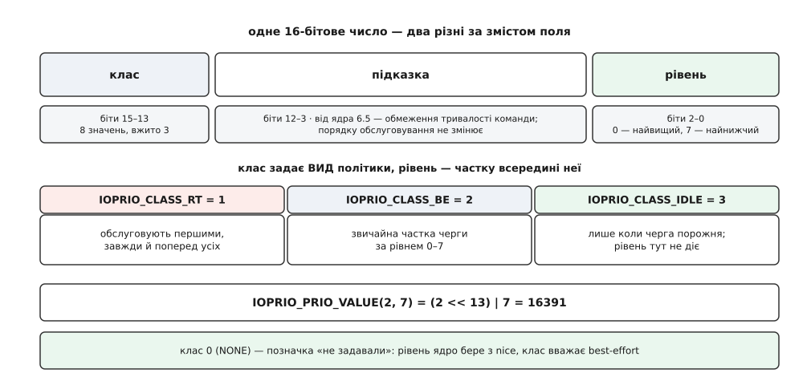
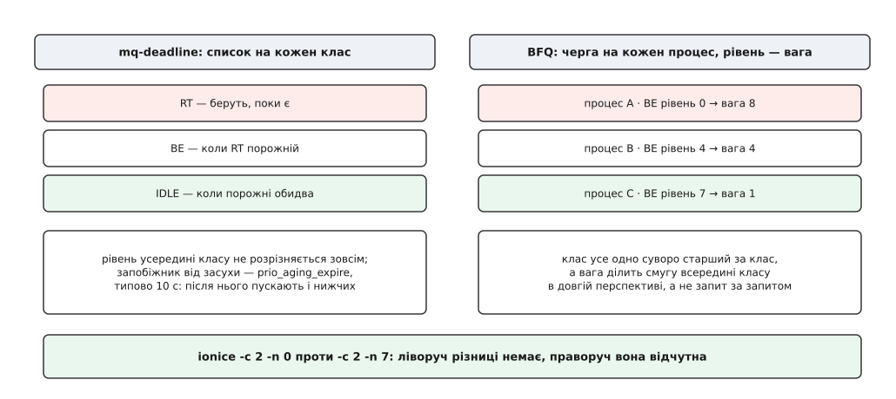
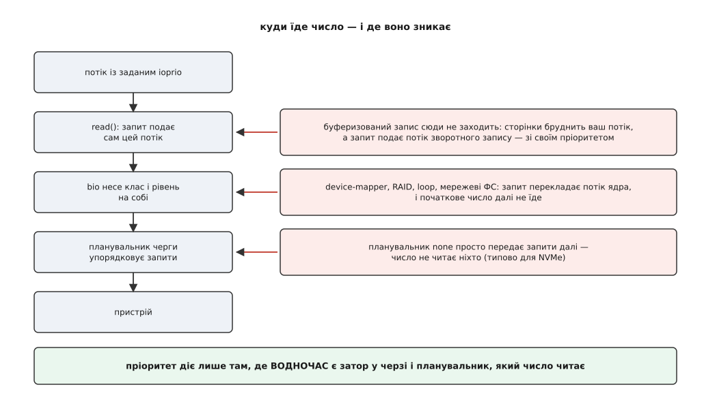

# Пріоритет вводу-виводу: класи ionice та ioprio_set

<preknowlist>
- [Блоковий пристрій](root:sys-unix/block-device-model) — сектори, черга запитів і те, що носій тримає в роботі кілька запитів водночас.
- [Планувальники блокового введення-виведення](root:sys-unix/io-schedulers) — хто впорядковує чергу перед пристроєм і чим `none` відрізняється від `mq-deadline` та BFQ.
- [Пріоритети, nice і реальночасові класи](root:sys-unix/priority-nice-realtime) — як ядро ділить процесорний час і що означає число `nice`.
- [Кеш сторінок і довговічність](root:sys-unix/page-cache-durability) — брудні сторінки й потоки зворотного запису, які виносять їх на носій.
- [Буферизований і прямий ввід-вивід](root:sys-unix/buffered-and-direct-io) — чим шлях повз кеш відрізняється від звичайного.
- [Потік як задача](root:sys-unix/threads-as-tasks) — потік є окремою задачею ядра з власним набором атрибутів.
</preknowlist>

Ніч, машина знімає резервну копію: `tar` читає домашній каталог і складає архів. У цю ж мить ви зберігаєте файл у редакторі — і редактор завмирає на пару секунд. Перше, що спадає на думку, — забрати в копіювання пріоритет:

```
$ nice -n 19 tar czf /backup/home.tar.gz /home
```

Редактор завмирає так само. Подивімося, чому.

**Скільки процесора насправді просить таке копіювання.**

```
$ top -b -n1 -p $(pgrep -x tar)
  PID  USER    %CPU  S  COMMAND
 4821  andrij   4.1  D  tar
```

Літера `D` у колонці стану — «непереривний сон»: задача стоїть у ядрі й чекає, поки завершиться її запит до носія. Процесора вона майже не просить, і ті чотири відсотки йдуть на стиснення. А `nice` ділить процесорний час між тими, хто за нього змагається. Хто здебільшого чекає, той у цьому змаганні не бере участі — тож і поступатися йому нема чим.

Затор, який відчув редактор, утворився не на процесорі.

## Черга, у якій справді тісно

Носій обслуговує обмежену кількість запитів водночас: коли їх надходить більше, зайві шикуються в чергу перед пристроєм. Редакторів запит на запис прийшов у ту саму чергу, де вже стояли сотні читань `tar`, і став у хвіст.

**Скільки чекає запит, що потрапив у хвіст зайнятої черги.**

```
глибина черги пристрою          = 32 запити
обслуговування одного на SSD    ≈ 100 мкс
чекання в хвості                = 32 · 100 мкс = 3.2 мс

обслуговування одного на HDD    ≈ 8 мс
чекання в хвості                = 32 · 8 мс    = 256 мс
```

Редактор чекає рівно стільки, скільки перед ним стоїть чужої роботи. Ось ресурс, за який тут ідеться: не такт процесора, а місце в черзі. Отже, і сказати «робота цього процесу менш нагальна» треба саме черзі.

Звідси видно, де має жити відповідне число. Черга оперує не процесами, а запитами: до неї приходить структура з номером сектора, довжиною й напрямком передачі. Щоб переставляти запити між собою, планувальникові потрібне число **на самому запиті**. А оскільки запит ядро формує в момент подання — у контексті того потоку, який покликав `read()`, — число природно взяти з атрибута цього потоку.

## Атрибут потоку і два системні виклики

Такий атрибут з’явився в ядрі 2.6.13 (2005) разом із планувальником CFQ; обидва написав Єнс Аксбо, і донині це його підсистема. Читають і пишуть атрибут двома системними викликами, для яких glibc так і не зробила обгорток, тож звертаються до них напряму:

```c
#include <sys/syscall.h>
#include <unistd.h>

static int ioprio_set(int which, int who, int ioprio) {
    return syscall(SYS_ioprio_set, which, who, ioprio);
}
static int ioprio_get(int which, int who) {
    return syscall(SYS_ioprio_get, which, who);
}
```

Перші два аргументи разом називають адресата. `which` каже, за яким видом ідентифікатора шукати: `IOPRIO_WHO_PROCESS` (1) — окрема задача, `IOPRIO_WHO_PGRP` (2) — уся група процесів, `IOPRIO_WHO_USER` (3) — усі процеси з таким реальним UID. Нуль у `who` означає «я сам» — відповідно ця задача, її група, її користувач. Назва `PROCESS` трохи обманює: одиницею тут є задача, тобто окремий потік, і потоки одного процесу цілком можуть мати різні пріоритети вводу-виводу. Коли адресатів кілька, `ioprio_get` не має що повернути одним числом і повертає **найвищий** знайдений — тобто відповідає на питання «чи є серед них хтось нагальний», а не «який у них пріоритет».

Атрибут успадковується: дитина після `fork()` дістає його від батька, а `exec()` не скидає — нова програма починає з тим самим числом. Без цієї властивості не працювало б нічого з написаного далі: єдиний спосіб запустити чужу програму з іншим пріоритетом — виставити атрибут собі, поки ви ще її батько.

## Чому клас, а не одне число

Лишається третій аргумент — власне пріоритет. Спокусливо зробити з нього просту шкалу «від найважливішого до найменш важливого», як `nice`. Але шкала вміє виражати тільки пропорцію: «цьому вдвічі більшу частку смуги, ніж тому». А від дискової черги хочуть ще двох речей, які пропорцією не описуються.

Перша — суворе старшинство: «поки є запити цього роду, решту не чіпай узагалі». Так поводяться зі збором даних, який не можна затримати ні на мить. Друга — протилежна: «пускай тільки тоді, коли черга порожня», щоб фонове індексування чи копіювання не додало іншим ані мілісекунди. Ані перше, ані друге не є точкою на шкалі часток: обидва кажуть про **порядок обслуговування**, а не про його розмір.

Тому число ділять на два поля. Старші біти несуть клас — вид політики; молодші — рівень усередині класу, тобто ту саму пропорцію, там де вона доречна.

```c
#define IOPRIO_CLASS_SHIFT  13
#define IOPRIO_PRIO_VALUE(class, level)  (((class) << IOPRIO_CLASS_SHIFT) | (level))

/* найнижчий best-effort: (2 << 13) | 7 = 16391 */
ioprio_set(IOPRIO_WHO_PROCESS, 0, IOPRIO_PRIO_VALUE(2, 7));
```

Класів, які щось означають, три: `IOPRIO_CLASS_RT` (1) — обслуговують першими завжди, `IOPRIO_CLASS_BE` (2) — звичайна частка черги за рівнем, `IOPRIO_CLASS_IDLE` (3) — лише коли більше нікому. Рівнів вісім, від 0 (найвищий) до 7, і мають вони сенс у перших двох класах; для `IDLE` рівень нічого не змінює, бо там нема чого ділити.



*Число пріоритету — не одна шкала, а клас плюс рівень усередині класу. Десять бітів між полями довго стояли порожні.*

Ті десять порожніх бітів заповнили у ядрі 6.5: туди кладуть **підказку** — номер обмеження тривалості команди, який передадуть далі самому накопичувачу. Підказка не змінює порядку обслуговування, вона змінює поведінку носія; повний перелік констант, кодів помилок і форм виклику зібрано окремо — [контракт ioprio](root:sys-unix/io-priorities/api-ioprio.md).

## Клас нуль і слід від nice

Якщо потік ніколи не викликав `ioprio_set`, його клас — `IOPRIO_CLASS_NONE` (0). Це не четверта політика, а позначка «не задавали». Ядро в такому разі бере рівень із процесорного `nice` і поводиться з потоком як з `best-effort`:

```
рівень = (nice + 20) / 5        (цілочисельне ділення)

nice = −20  →  рівень 0   (найвищий у best-effort)
nice =   0  →  рівень 4   (типовий)
nice = +19  →  рівень 7   (найнижчий)
```

Ось і відповідь на початкову невдачу. `nice -n 19` таки дійшов до дискової черги — але найслабшим із важелів: він зсунув копіювання на найнижчий рівень **усередині того самого класу**, де сидить редактор. Клас лишився спільний, тож запити `tar` і далі стоять в одній черзі з редакторовими й далі їх затримують. Сказати «пропускай усіх поперед себе» через `nice` неможливо — класи він не виставляє. Для цього й потрібен окремий виклик.

## ionice

На практиці цей виклик роблять не з коду, а утилітою `ionice` з пакета util-linux. Вона вміє дві речі: запустити нову програму вже з потрібним пріоритетом (виставляє атрибут між `fork` і `exec`) або змінити його наявній задачі.

```
$ ionice -c 3 tar czf /backup/home.tar.gz /home   # запустити в класі idle
$ ionice -p 4821                                  # прочитати поточне
idle
$ ionice -c 2 -n 7 -p 4821                        # перевести на льоту
```

Змінювати пріоритет чужому процесу може той, хто має право надіслати йому сигнал, або власник `CAP_SYS_NICE`. Окремо стоїть клас `RT`: щоб виставити його, потрібен `CAP_SYS_ADMIN` або `CAP_SYS_NICE` — раніше приймали лише перший. Замок тут не формальність: «обслуговують першими завжди» означає, що один нестримний читач у цьому класі здатний надовго засушити всю решту системи, і ядро не має чим його вгамувати.

> 🔧 **Навіщо це.** Найчастіший корисний випадок — не підняти когось, а опустити: `ionice -c 3` для нічного бекапу, індексатора, антивірусної перевірки чи `rsync`. Клас `idle` — єдиний з трьох, який не потребує жодних прав і не здатний нашкодити: гірше, ніж «чекати, поки звільниться черга», уже не буде. Тому в сервісних файлах systemd рядок `IOSchedulingClass=idle` стоїть частіше за всі інші налаштування вводу-виводу разом узяті.

## Хто взагалі читає це число

Досі йшлося про те, як число потрапляє на запит. Але саме по собі воно нічого не робить: хтось має його прочитати й переставити запити місцями. Це робота планувальника черги. І тут виявляється головне про `ionice` — **на більшості сучасних машин у черзі не стоїть ніхто, хто на це число дивиться**.

```
$ cat /sys/block/nvme0n1/queue/scheduler
[none] mq-deadline kyber bfq
```

Квадратні дужки показують вибране. `none` — це не планувальник, а його відсутність: запити йдуть до апаратних черг накопичувача в тому порядку, у якому надійшли. Для NVMe таке типове й розумне — носій має десятки власних черг і сам розкладає роботу по каналах, а перестановки в програмному шарі коштували б більше, ніж дали. Наслідок для нас неприємний: `ionice` на такому пристрої не робить рівно нічого, мовчки й без жодної помилки. Виклик успішний, атрибут виставлено, число доїхало до запиту — і там померло.

Читають його два планувальники. BFQ — від самої появи, бо чесний поділ смуги між процесами і є його призначенням. `mq-deadline` навчився цього значно пізніше: підтримку додали в ядрі 5.15, а до робочого стану довели в 5.16. Kyber пріоритетів не розрізняє.

Проміжок між цими датами й нинішнім станом — окрема історія: число народилося разом із CFQ, а коли в ядрі 5.0 (2019) старий однопотоковий блоковий шар викинули цілком, разом із ним пішов і CFQ — і `ionice` на два з половиною роки лишився командою, яка нічого не робить майже ніде. Як воно так вийшло й чому повернення виглядало саме так — в [історії ioprio](root:sys-unix/io-priorities/hist-ioprio-and-cfq.md).

Звідси єдина правильна звичка: перш ніж покладатися на `ionice`, перевірити, що на цьому пристрої стоїть планувальник, який його читає, а потім переконатися вимірюванням, що ефект справді є. Як поставити такий дослід — два читачі, один носій, різні класи — розібрано в [перевірці на ділі](root:sys-unix/io-priorities/proj-does-ionice-work.md).

## Два способи прочитати те саме число

Ті двоє, що число читають, поводяться з ним по-різному, і це видно неозброєним оком.

`mq-deadline` тримає окремий список запитів на кожен клас і бере з нижчого лише тоді, коли вищі порожні. Рівнем усередині класу він не переймається взагалі — списків три, по одному на клас. Суворий порядок означає ризик засушити нижчих, тож поруч стоїть запобіжник: параметр `prio_aging_expire`, типово десять секунд. Коли запит нижчого класу простояв довше, його пускають попри те, що вищі ще є.

BFQ рахує інакше. У нього черга на кожен процес і бюджет, який ця черга витрачає, коли її обслуговують; рівень пріоритету перетворюється на **вагу** — частку смуги, яку процес отримає в довгій перспективі. Клас при цьому все одно старший за будь-яку вагу: рівень ділить смугу лише між тими, хто вже в одному класі.



*Одна й та сама команда дає різний результат: один планувальник розрізняє лише класи, другий — ще й рівні всередині класу.*

Практичний висновок звідси такий: `ionice -c 2 -n 0` проти `-c 2 -n 7` на `mq-deadline` не змінює нічого, а на BFQ дає відчутну різницю. Це властивість планувальника, а не команди, і жодне повідомлення про це вам не скаже.

Є ще одна тонкість, спільна для обох. Перш ніж потрапити до планувальника, запити на сусідні сектори зливаються в один — це головна економія блокового шару. А злитий запит мусить мати один пріоритет, і ядро бере з двох **вищий** (функція `ioprio_best`). Тому читання класу `idle`, яке лягло впритул до чужого `best-effort`, поїде разом із ним як `best-effort`. Це не помилка й не втрата: два сусідні сектори однаково довезуть одним обертом, і розділяти їх заради дотримання класу було б чистою шкодою.

## Три місця, де число мовчки не діє

Навіть із правильним планувальником є шляхи, на яких пріоритет губиться. Усі три однаково тихі.

**Буферизований запис.** Коли програма пише через кеш сторінок, її `write()` лише бруднить сторінки в пам’яті й негайно повертається — жодного запиту до носія в контексті цього потоку не виникає. Запит подасть потік зворотного запису, набагато пізніше і зі своїм власним пріоритетом. Тому `ionice -c 3 dd if=/dev/zero of=big bs=1M count=10000` не стримує запис ані на крихту: до черги він приходить не від `dd`. Пріоритет доїжджає до запису тільки тоді, коли подання відбувається в контексті програми — тобто з `O_DIRECT` або на `fsync()`.

**Запит, якого не було.** Читання, що потрапило в кеш сторінок, до черги не доходить зовсім, і говорити про його пріоритет немає сенсу. А коли ту саму сторінку вже замовив хтось інший, ваше читання чекає на **його** запит — із його пріоритетом, не з вашим. У класі `idle` це працює вам на користь: чуже читання, до якого ви приєдналися, привезе сторінку швидше, ніж привезли б ви.

**Посередники.** Між файловою системою і носієм часто стоїть іще один шар: device-mapper, програмний RAID, `loop`-пристрій, мережева файлова система. Там запит нерідко перекладає потік ядра, і початковий пріоритет далі не їде. Те саме у віртуальній машині: гість виставляє клас у своїй черзі, а хазяїн бачить лише запити процесу-емулятора.



*Пріоритет діє лише там, де водночас є затор у черзі і планувальник, який число читає.*

## Не потік, а операція

Атрибут на потоці добре описує ціле заняття: цей процес — бекап, той — база. Але сервер, який тримає тисячі з’єднань кількома потоками, так не влаштований: на одному й тому самому потоці по черзі трапляється і читання, за яким чекає жива людина, і фонове перечитування індексу. Виставляти й скидати атрибут перед кожною операцією було б безглуздо — це системний виклик на кожен запит.

Тому пріоритет навчилися класти прямо в опис операції. У libaio для цього є поле `aio_reqprio` у структурі `iocb` і прапорець `IOCB_FLAG_IOPRIO`, який каже ядру це поле читати (ядро 4.18); подробиці подання — у статті про [io_submit](root:sys-unix/linux-aio-io-submit). В [io_uring](root:sys-unix/io-uring-rings-model) поле `ioprio` є в кожному записі черги подань від самого початку. Кодування там те саме — той самий клас плюс рівень, той самий зсув на тринадцять бітів.

## Куди перемістився важіль

Питання, заради якого все це починалося, з роками змінило формулювання. Тоді питали «який із процесів на моїй машині важливіший»; тепер частіше питають «яка з робіт на цьому вузлі важливіша», а робота — це десяток процесів у контейнері. Атрибут на потоці такого не виражає, і продовжувати його для цього не стали: замість того ядро отримало окремий шар керування по [cgroup](root:sys-unix/cgroups-resource-model) — вагу, стелю смуги й цільову затримку на групу. Він працює **над** планувальником, а не всередині нього, тож діє й там, де вибрано `none`; що саме там налаштовують, розібрано в статті про [обмеження вводу-виводу по cgroup](root:sys-unix/io-cgroup-control).

Одна ниточка від старого механізму до нового все ж простяглася. Файл `io.prio.class` у групі дозволяє перебити клас усіх запитів, що з неї виходять: `promote-to-rt` підіймає їх до реального часу, `restrict-to-be` не пускає вище за best-effort — зручно, коли групі не довіряєш, а `CAP_SYS_ADMIN` у ній усе-таки є. Найцінніше тут те, що правило групи діє й на зворотний запис: сторінки, які файлова система вміє приписати до cgroup, поїдуть із класом групи, а не з класом потоку зворотного запису. Це той рідкісний випадок, коли пріоритет доходить до буферизованого запису.

`ionice` від цього не застарів — він лишився найдешевшим і найточнішим способом сказати про одну конкретну задачу на одній конкретній машині. Просто діє він за двох умов одночасно, і жодну з них не видно в успішному коді повернення: у черзі перед пристроєм має бути затор — інакше переставляти нема чого, — і в цій черзі має стояти той, хто число прочитає.
