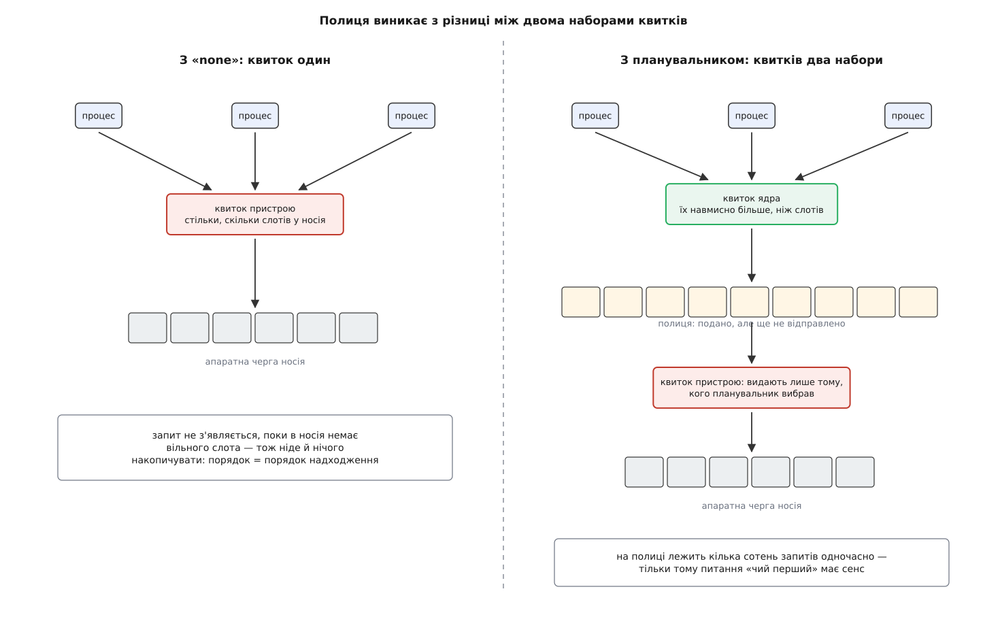
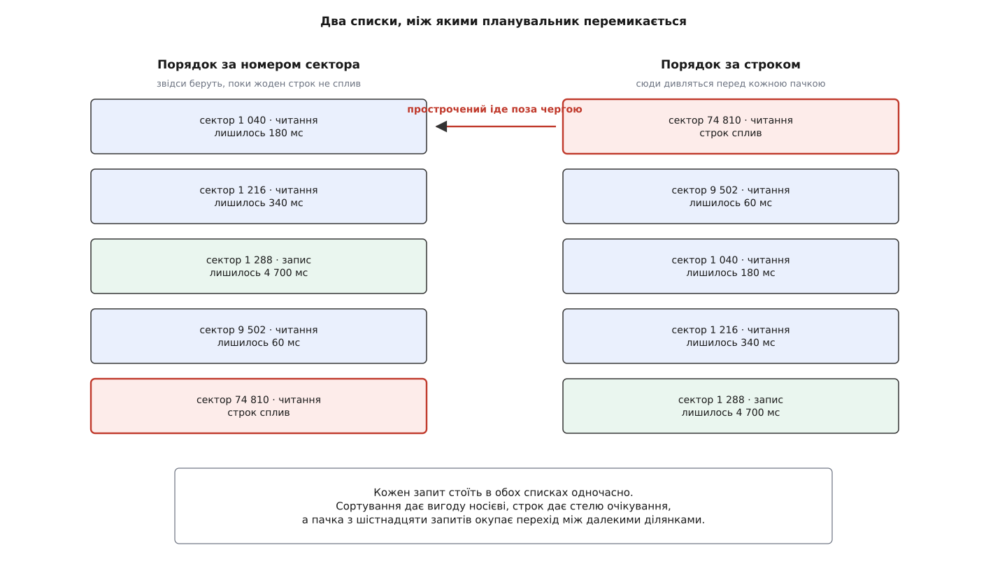
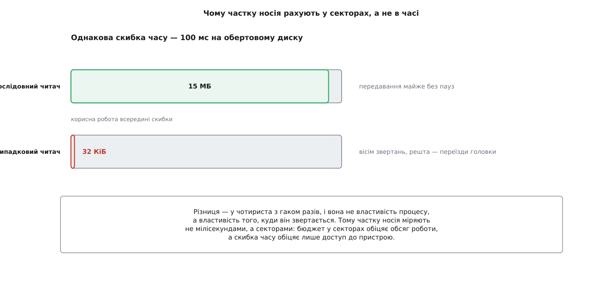
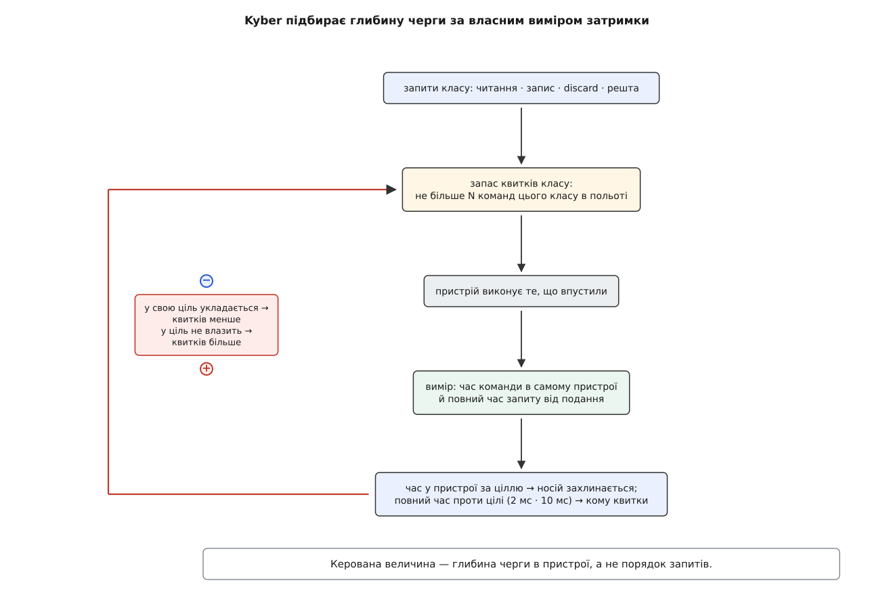

# Планувальники блокового введення-виведення: none, mq-deadline, BFQ і Kyber

<preknowlist>
- [Блоковий пристрій: сектори, блоки й черга запитів](topic:sys-unix/block-device-model) — запит живе окремою структурою, суміжні запити зшиваються в один, а подання розкладено на програмні черги ядер процесора й апаратні черги носія.
- [Сторінковий кеш і довговічність запису](topic:sys-unix/page-cache-durability) — запис підтверджують програмі, щойно дані лягли в пам'ять, а на носій вони йдуть пізніше й уже без глядача.
- [Замки в ядрі](topic:sys-unix/kernel-locking) — спільна структура під замком стає вузьким місцем, коли до неї одночасно тягнеться багато ядер процесора.
- [cgroups: облік і обмеження ресурсів](topic:sys-unix/cgroups-resource-model) — процеси зібрано в групи, і ресурс можна ділити між групами, а не лише між окремими процесами.
</preknowlist>

## Затримка, якої ніде не видно

Копіювання великого файлу йде у фоні, і система, що хвилину тому літала, починає затинатися. Меню розкривається з паузою, редактор зберігає три кілобайти й думає секунду. Найдивніше тут те, що носій не зламався й не перегрівся: кожне окреме звертання до нього коштує рівно стільки ж, скільки коштувало, — кількадесят мікросекунд. Усі операції швидкі, а чекати доводиться довго.

Пояснення суто арифметичне. Копіювання встигло подати тисячі запитів, і твої три кілобайти стоять за ними. Тисяча звертань по сто мікросекунд — це десята частка секунди; десять тисяч — ціла секунда. Носій увесь цей час працює на повну потужність. Просто працює він не на тебе.

Напрошується очевидне: хай ядро пропустить маленький запит уперед. Тут і з'ясовується, де межа можливого, — і щоб її побачити, треба глянути, як запит узагалі потрапляє до носія.

## Слово, якого носій не знає

Пристрій не може тримати скільки завгодно незавершених команд. Кожна з них займає рядок у скінченній апаратній таблиці, і рядок лишається зайнятим, поки команда не виконана. Тому подача влаштована так: щоб віддати команду, драйвер мусить спершу дістати вільний рядок — квиток, який у ядрі звуть **тегом** (англ. *tag* — бирка, ярлик). Немає вільного тега — немає й способу подати команду взагалі.

Розмір таблиці диктує залізо разом із протоколом. Диск SATA із чергою команд бере 32 одночасні команди; SAS — сотні; NVMe дозволяє тисячі, та ще й у кількох незалежних чергах. Скільки б їх не було, число скінченне й відоме наперед.

А далі — те, заради чого все це рахувалося. У словнику пристрою немає слів «скасуй», «пропусти цього вперед» і «це від важливого процесу». Отримавши команди, він виконує їх у порядку, який зручний йому: NVMe взагалі не обіцяє жодного порядку між командами, диск із головкою впорядкує їх під свою геометрію. Хто саме просив ці сектори, пристрій не знає — і знати не мусить, бо в інтерфейсі блокового пристрою такого поняття просто немає.

Отже, влада ядра над тим, чиї запити підуть першими, закінчується рівно в мить видачі тега. Усе, що взагалі можна вирішити, вирішується до неї.

## Полиця перед дверима

Тепер видно, чого коштує сама можливість вибирати.

Коли запит створюють одразу з квитком пристрою, вибирати нема з чого: запит або йде вниз негайно, або його ніде тримати, бо він і не з'явився — місця в таблиці немає. Порядок виходить той самий, що й порядок надходження, і жоден шар ядра тут ні на що не впливає.

Щоб було з чого вибирати, ядро заводить **другий, ширший набір квитків**. Запит, увійшовши в блоковий рівень, бере квиток із цього ширшого набору й лягає в чергу ядра; квиток пристрою йому видадуть пізніше — у мить, коли ядро вирішить, що черга саме його. Різниця між двома числами і є та полиця, на якій кілька сотень запитів лежать **одночасно**. Тільки завдяки їй питання «чий перший» узагалі має сенс.



*Полиця існує рівно тому, що квитків ядра більше, ніж слотів у пристрої: різниця — це запити, які вже подано, але ще не відправлено.*

Звідси випливає точна ціна вибору, і вона двостороння.

Ширша полиця дає більше влади над порядком — але кожен запит на ній лежить, замість виконуватися, і базове очікування росте для всіх. Гірше того: сучасний носій швидкий саме тому, що всередині паралельний, і повільніє, коли його черга напівпорожня. Притримати запити — значить недовантажити пристрій.

Вужча полиця тримає пристрій завантаженим, і сумарна пропускна здатність виходить найбільша, — але хто саме забере цю здатність, вирішує вже не ядро, а порядок надходження.

Шар, який тримає цю полицю й вирішує, кого з неї випустити, звуть **планувальником блокового введення-виведення**. Усі чотири планувальники Linux — це чотири відповіді на одне питання: скільки притримувати й за яким правилом випускати. Історично цей шар відповідав зовсім на інше питання — як швидше довезти головку до сектора; чому питання підмінилося саме так, розібрано в [нарисі про шлях від ліфта до багатьох черг](topic:sys-unix/block-device-model/hist-elevator-to-blkmq.md).

## none: коли притримувати не варто нічого

Найпростіша відповідь — не притримувати. Планувальника немає, полиці немає, запит бере квиток пристрою одразу при створенні й іде вниз.

Це не означає «блоковий рівень нічого не робить». Зшивання суміжних запитів лишається: поки процес подає пакет запитів, вони лежать у його власній заглушці, і сусідні там знаходять одне одного. Зникає саме **переставляння**: ніхто не вирішує, чий запит важливіший.

Причина, чому для швидкого носія це типовий вибір, — у ціні самого рішення. Документація ядра наводить виміряну вартість обробки одного запиту в планувальнику під спільним замком: близько 0.7 мкс для mq-deadline і близько 1.9 мкс для BFQ на процесорі Intel Core i7-2760QM. Порівняймо це з тим, скільки запитів пропускає сучасний носій.

**Умова: носій витримує 500 тисяч операцій за секунду; обробка одного запиту коштує 1.9 мкс і виконується під одним спільним замком.**

```
робота планувальника за секунду = 500000 · 1.9 мкс = 0.95 с
доступний час однієї ділянки під замком = 1.00 с
завантаження серіалізованої ділянки     = 95 %
для mq-deadline: 500000 · 0.7 мкс       = 0.35 с → 35 %
```

Ділянку під спільним замком не можна розпаралелити: скільки б ядер процесора не було, вона одна. Дев'яносто п'ять відсотків її часу — це стіна, до якої система впирається незалежно від кількості ядер. Документація BFQ так і подає свої межі прямим числом: близько 400 тисяч операцій за секунду на Intel i7-4850HQ і близько 80 тисяч на ARM Cortex-A53. Носій, який уміє більше, планувальник просто не встигне обслужити.

До цього додається друга втрата, уже не процесорна. Багатоканальний носій дає свою швидкість лише тоді, коли всередині лежить багато незалежної роботи. Планувальник, притримуючи запити заради порядку, зменшує саме цю кількість — і платить пропускною здатністю за перестановки, яких носієві не потрібно.

Тому ядро типово ставить `none` кожному пристрою, що показує більше однієї апаратної черги; пристрою з однією чергою — `mq-deadline`.

> 🔧 **Навіщо це.** Порада «поставте bfq, буде відгукливіше» перестає працювати рівно там, де починається серверне навантаження на NVMe: планувальник з'їдає ядро процесора під замком і зрізає пропускну здатність, не даючи натомість нічого, бо зайвої черги в носія й так немає. Перш ніж міняти планувальник, варто глянути на два числа: скільки апаратних черг у пристрою і скільки операцій за секунду він реально видає. Вище кількох сотень тисяч будь-який планувальник — це витрата, а не налаштування.

## Гальмо, що працює й без планувальника

Але тоді повертається задача з початку: якщо порядком ніхто не керує, що заважає фоновому копіюванню знову залити чергу й потопити чуже читання?

Заважає окремий шар, який стоїть **перед** планувальником — запит писаря проходить крізь нього ще до того, як ляже на полицю, — і працює за іншим принципом. Він не переставляє запити місцями, він **обмежує глибину** саме для фонового зворотного запису, тобто для тих сторінок, які ядро скидає на носій без глядача. Замір простий: шар постійно міряє затримку читань і порівнює її з цільовим числом. Затримка перевищила ціль — глибина фонового запису падає вдвічі; читання довго не з'являються — обмеження послаблюється.

Цільове число має розумні типові значення: близько 2 мс для носія без рухомих частин і близько 75 мс для обертового диска, і його видно та можна змінити у властивостях черги. Задум запозичено з мережевої боротьби з роздутими буферами: цінність не в тому, щоб щось упорядкувати, а в тому, щоб черга просто не встигала вирости. Механізм заслуговує на окремий розбір — [гальмування фонового запису](topic:sys-unix/writeback-throttling) описує, як саме він міряє вікно й наскільки різко відступає.

Це важливо для розуміння всієї картини: `none` — не «жодного захисту», а «жодного переставляння». Захист від залитої черги лишається, просто його дає не планувальник.

## mq-deadline: стеля на очікування

Для повільного пристрою з однією чергою — картки пам'яті, звичайного диска, дешевого контролера — переставляння досі окупається. Але чисте сортування за номером сектора має ваду, помітну лише під навантаженням: коли в чергу рівним струмком надходять запити поблизу поточного положення головки, далекий запит не візьмуть ніколи, бо щоразу знайдеться ближчий.

Ліки — тримати запити відразу **в двох порядках**. В одному вони відсортовані за номером сектора: це те, що вигідно носієві. У другому вишикувані за часом надходження, і кожному приписано строк, до якого його треба обслужити. Поки строк найстаршого не сплив, планувальник видає запити з відсортованого порядку. Щойно сплив — кидає сортування й бере прострочений.



*Сортування дає вигоду носієві, строк дає стелю очікування; планувальник тримає обидва списки й переходить із першого на другий, коли строк спливає.*

Строки навмисно несиметричні: читанню дають 500 мс, запису — 5 с. Причина не в примсі. На читанні зазвичай хтось стоїть і чекає безпосередньо, а запис до цієї миті вже прийнято в пам'ять і підтверджено програмі, тож його затримка болить у рази менше.

Дві дрібніші деталі закривають наслідки цього рішення. Перша: перемикання між далекими ділянками коштує, тому запити видають **пачками** — типово по шістнадцять із відсортованого порядку, перш ніж знову дивитися на строки. Друга: якщо читань завжди вдосталь, запис може не отримати черги ніколи; тому після двох пачок читань одна пачка запису йде обов'язково, навіть якщо жоден строк не сплив.

Що з цього виходить і чого не виходить, варто розділити чітко. Виходить **стеля на очікування**: жоден запит не пролежить довше за свій строк. Не виходить **частка**: процес, який ллє суцільний потік, спокійно забирає майже всю пропускну здатність, поки всі чужі строки формально дотримано. Стеля на очікування й частка від смуги — різні обіцянки, і mq-deadline дає лише першу.

Довгий час у mq-deadline була ще одна, не пов'язана з цим роль: він єдиний умів тримати суворий порядок записів для [зонованих носіїв](topic:sys-unix/zoned-block-devices), де в зону дозволено писати лише послідовно, і тому для таких пристроїв був обов'язковим. У випуску ядра 6.10 цю роботу перенесли в сам блоковий рівень — окремий механізм тепер тримає в польоті не більше одного запису на зону, — і вибір планувальника для зонованих пристроїв перестав бути зумовленим.

## BFQ: коли питання справді «чиї»

Стелі на очікування вистачає серверові й не вистачає людині за столом. Робочий стіл хоче іншого: щоб фонове архівування взагалі не забирало більшу частину смуги, скільки б воно не подавало запитів.

Перша спроба відповіді була очевидна — роздати процесам скибки часу, як роздають процесорний час. І вона підводить саме на носіях. Пропускна здатність носія стрибає не у відсотках, а в сотні разів залежно від того, послідовні звертання чи розкидані; отже, за однакову скибку часу послідовний читач перенесе в сотні разів більше даних, ніж випадковий. Скибка часу гарантує **час доступу**, а не **обсяг роботи**, — а люди чекають саме обсягу.



*Однаковий час на обертовому диску дає різницю в сотні разів за обсягом — тому міряти частку в мілісекундах безглуздо.*

Тому BFQ роздає процесам не час, а **бюджет у секторах**. Черга процесу, отримавши носій, тримає його, поки не витратить свій бюджет або поки не спорожніє; після цього її переставляють у кінець із новим бюджетом. Скільки секторів припадає на процес, визначає його **вага** — число від 1 до 1000, типово 100; вага задається на процес або на цілу групу cgroup, і тоді ділиться смуга між групами.

Сам порядок, у якому черги дістають носій, визначає не проста карусель, а спеціальний внутрішній планувальник, названий B-WF2Q+. Він веде для кожної черги віртуальний час і бере наступною ту, чий віртуальний час найменший, — так частка виходить пропорційною вазі не «в середньому колись», а з обмеженим відхиленням у кожен момент, і це відхилення можна порахувати. Як саме віртуальний час перетворює ваги на гарантію й чому проста карусель такої гарантії не дає, розібрано в [математиці зваженої справедливої черги](topic:sys-unix/io-schedulers/math-fair-queueing.md).

Але тут BFQ упирається в неприємність, спільну для всіх схем із частками. Процес, який читає файл послідовно й синхронно, тримає в черзі **один** запит: наступний він подасть лише тоді, коли отримає відповідь на попередній. Його черга щомиті порожніє — і якщо в цю мить віддати носій наступному, обіцяна частка не варта нічого, бо процес фізично не встигає її вибрати. Тому BFQ, обслуживши такий процес, **навмисно чекає** кілька мілісекунд без діла, ставлячи на те, що зараз прилетить наступний запит. Ставка виграє тим частіше, чим справніше працює [випереджувальне читання](topic:sys-unix/readahead), яке саме й наповнює потік послідовних звертань.

Ціна цього чекання й є головна причина, чому BFQ не ставлять на швидкий носій. Простій у кілька мілісекунд на диску з головкою — дрібниця проти переїзду; на багатоканальному носії, який за ці мілісекунди виконав би сотні команд, це пряма втрата. Плюс уже пораховані 1.9 мкс процесора на кожен запит.

Є в BFQ і третій шар — набір здогадів, які піднімають вагу щойно розбудженому інтерактивному застосунку й тому, що схожий на програвач звуку чи відео. Здогади помітно поліпшують відчуття від системи й водночас порушують ту саму пропорційність, заради якої все будувалося: документація прямо радить вимикати їх, коли потрібен передбачуваний поділ смуги, а не суб'єктивна відгуклість.

> 🔧 **Навіщо це.** BFQ — єдиний із чотирьох, хто вміє відповісти на вимогу «ця служба не має права з'їсти більше третини диска, хоч би скільки просила», не вдаючись до жорсткого обмеження. Вагу видно й задається вона у файлі `io.bfq.weight` відповідної групи cgroup. Але обіцянка діє лише там, де BFQ узагалі доречний: одна апаратна черга, кількадесят тисяч операцій за секунду, є кому чекати. На NVMe це налаштування або нічого не змінить, або зріже пропускну здатність.

## Kyber: не порядок, а зворотний зв'язок

Лишається випадок, який не закриває жоден із трьох. Носій швидкий і паралельний, тож BFQ надто дорогий; але навантаження таке, що черга всередині пристрою постійно повна, і затримка окремого читання росте не через чужу перевагу, а просто через довжину черги.

Тут переставляння не допоможе взагалі: якщо в пристрої вже лежить триста команд, порядок останніх десяти нічого не змінить. Допоможе тільки одне — щоб команд усередині було менше. А скільки саме менше, порахувати наперед неможливо: це залежить від носія, від співвідношення читань і записів, від розміру запитів.

Тому Kyber не рахує порядок. Він рахує **глибину** й підбирає її вимірюванням.

Запити поділено на кілька класів — читання, запис, звільнення блоків (discard) і решта, — і кожному класу видано власний запас квитків на відправлення. Скільки квитків, стільки команд цього класу може бути в польоті одночасно; стеля запасу — 256 команд на читання, 128 на запис, 64 на звільнення блоків. Кожному класові приписано ще й цільову затримку: 2 мс читанню, 10 мс запису.

А далі важить, у якому порядку Kyber ставить два питання. Спершу — чи затори взагалі в носії: для цього він дивиться на час, який команда провела в самому пристрої, і бере його дев'яностий перцентиль, щоб не смикатися на поодиноких викидах. Вилізло за ціль хоч в одного класу — носій уважають перевантаженим. І аж тоді планувальник забирає квитки, причому не в того, хто спізнюється, а навпаки — у класів, які у свою ціль укладаються. Клас, чия власна затримка вже перевищила ціль, дістає квитків **більше**: він спізнюється не через носій, а через те, що надто довго чекав квитка в ядрі.

Перерахунок пропорційний: запас множать на відношення виміряної затримки до цільової. Клас, що вклався у три чверті цілі, лишається з трьома чвертями свого запасу; клас, що спізнився вдвічі, дістає вдвічі більший. Так глибина перетікає від того, у кого є запас, до того, кому його бракує, а сумарна довжина черги в пристрої падає рівно тоді, коли пристрій справді захлинається.



*Керована величина тут не порядок запитів, а глибина черги в пристрої; правило замикається на власному вимірюванні, а не на моделі носія.*

Два виміряні часи грають у цій петлі різні ролі, і саме через це вона не душить пропускну здатність даремно. Час у самому пристрої — діагноз: він каже, чи носій уже захлинається, і без нього скорочення глибини було б стрільбою наосліп. Повна затримка, у якій до цього додано очікування квитка в ядрі, — адреса: вона каже, кому квитків додати, а в кого забрати. Одного числа тут не вистачило б: клас цілком може спізнюватися при вільному носієві — просто тому, що йому мало дозволено.

За це доводиться платити тим, чого Kyber не робить зовсім. Він не знає про процеси й групи, і поняття частки в ньому немає. Ненажерливий процес під Kyber так само забере більшу частину смуги — просто зробить це, не роздуваючи затримку всім іншим. Це різна обіцянка, і плутати її з BFQ не варто: одна про **обмежену затримку**, друга про **гарантовану частку**.

## Де стоїть ручка і чого вона не вирішує

Вибір належить конкретному пристрою, а не системі: чинний і доступні планувальники лежать у `/sys/block/<пристрій>/queue/scheduler`, і запис у цей файл перемикає їх на ходу. Старий параметр ядра `elevator=` стосувався одночергового блокового рівня, якого більше немає, — сучасне ядро на нього лише лається в журналі; дистрибутиви ставлять типові значення правилами [udev](topic:sys-unix/udev-rules), розрізняючи пристрої за ознакою обертання й кількістю черг. Що саме можна підкрутити всередині кожного планувальника, з одиницями та типовими значеннями, зібрано в [переліку налаштувань](topic:sys-unix/io-schedulers/api-scheduler-tunables.md).

Твердження цієї теми легко перевірити власноруч: під фоновою заливкою запису поміряти затримку дрібних читань і подивитися, як міняються верхні відсотки розподілу при перемиканні планувальника. Як зібрати такий замір, щоб він міряв носій, а не сторінковий кеш, показано в [проєкті з вимірювання](topic:sys-unix/io-schedulers/proj-measure-schedulers.md).

Наостанок — три межі, за якими ручка вже нічого не важить.

Планувальник бачить лише запити, що дійшли до блокового рівня. Скільки їх буде й коли вони прийдуть, вирішує сторінковий кеш зі своїм зворотним записом; спізніле й тому надто велике скидання брудних сторінок планувальник розкладе рівніше, але не відмінить.

Пропорційність між групами він дає лише в одному втіленні — BFQ, тобто саме там, де його зазвичай не можна собі дозволити. Для швидких носіїв цю задачу розв'язує окремий шар обмежень по cgroup, який працює незалежно від того, який планувальник стоїть, і міряє групам не порядок, а частку й затримку — [обмеження вводу-виводу по cgroup](topic:sys-unix/io-cgroup-control).

І остання межа очевидна лише заднім числом. Планувальник живе на пристрої, що має чергу запитів, — тобто на справжньому носії. Шаруватий пристрій, зібраний [device mapper](topic:sys-unix/device-mapper), власної черги з планувальником не має: він приймає запит і передає нижче. Ставити планувальник треба тому пристрою, який лежить в основі, а не тому, який видно програмі.

Усе разом окреслює місце цього шару точніше, ніж будь-який опис його правил. Планувальник — остання точка, де ядро ще знає, **хто** просив. Нижче лишаються тільки номери секторів, і жодне рішення про справедливість там уже неможливе.
