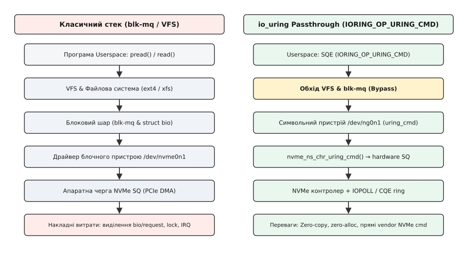

# Низькорівневий пасстру команд NVMe через IORING_OP_URING_CMD

<preknowlist>
- [Внутрішня архітектура io_uring](topic:sys-unix/io-uring-kernel-internals) — механіка подачі SQE та отримання CQE через спільні кільця в пам'яті.
- [Огляд блокового шару (blk-mq)](topic:sys-unix/block-layer-mq) — дворівнева конвеєризація запитів, класичні структури `struct bio` та `struct request`.
- [Підсистема NVMe у ядрі](topic:sys-unix/nvme-target-kernel-subsystem) — структура команд NVMe, черги SQ/CQ контролера та організація командних слів.
</preknowlist>

Коли високонавантажений застосунок на кшталт розподіленої бази даних виконує мільйони операцій введення-виведення на секунду (IOPS) через стандартний блоковий стек Linux, процесор витрачає помітну частку робочого часу на програмні накладні витрати ядра, а не на корисну роботу з даними. Сучасні SSD-накопичувачі стандарту PCIe Gen5 NVMe забезпечують затримки апаратного виконання нижче 10 мікросекунд, однак проходження запиту через віртуальну файлову систему (VFS), підсистему кешування сторінок, розрахунки зсувів, виділення пам'яті під структури `bio` та конвеєр `blk-mq` додає додаткові мікросекунди затримки на кожен виклик. Усунення цього програмного бар'єру вимагало створення механізму, який поєднує пряме формування апаратних команд контролера з високою ефективністю асинхронних кілець пам'яті.

## Проблема класичного блокового стеку та обмеження ioctl

У класичній архітектурі Linux блоковий шар розроблявся з розрахунком на механічні жорсткі диски (HDD). Його головним завданням було замаскувати затримки апаратного забезпечення шляхом асинхронного кешування, злиття сусідніх секторів (bio merging) та оптимізації руху голівки диска у планувальниках введення-виведення (Elevator algorithms, CFQ, Deadline).

З появою апаратних черг у NVMe (до 65 535 черг введення-виведення, кожна з яких вміщує до 65 536 записів) ядро Linux отримало підсистему `blk-mq`. Вона вирішила проблему локальності даних на багатоядерних системах, прив'язавши програмні черги (Software Staging Queues) до ядер CPU та розподіливши їх на апаратні черги відправлення (Hardware Dispatch Queues). Проте внутрішній шлях виконання запиту все одно лишився довгим і вимагає послідовного подолання таких етапів:

1. **Трансляція VFS:** Перевірка прав доступу, блокування інодів (`inode lock`), трансляція файлового зсуву у логічний номер блоку (LBA).
2. **Виділення bio та request:** Створення та ініціалізація об'єктів `struct bio`, огортання їх у `struct request` із виділенням пам'яті зі слабів ядра (slab allocator).
3. **Обробка в blk-mq:** Проходження через обробники планувальника (bfq, kyber або none), перевірка можливостей злиття запитів, отримання тегів (`blk_mq_get_tag`).
4. **Трансляція в драйвері:** Трансляція універсальної структури `struct request` у 64-байтний специфічний дескриптор NVMe-команди `nvme_setup_cmd()` безпосередньо перед записом у register-mapped пам'ять контролера.

Кожен із цих етапів супроводжується викликами функцій виділення пам'яті, оновленням лічильників посилань на об'єкти ядра та атомарними синхронізаційними бар'єрами, які споживають дорогоцінні такти центрального процесора.

Для утиліт моніторингу та керування накопичувачами тривалий час існував єдиний альтернативний шлях — системний виклик `ioctl()` із прапорцями `NVME_IOCTL_IO_CMD` або `NVME_IOCTL_ADMIN_CMD`. Проте `ioctl()` виявився непридатним для побудови високопродуктивних двигунів зберігання даних. Він є повністю синхронним: потік користувацького простору засинає при кожному виклику (переходячи у стан `TASK_UNINTERRUPTIBLE`), чекаючи на апаратне переривання від PCIe-шини. Це унеможливлює пакетну відправку команд, створює величезну кількість перемикань контексту CPU та унеможливлює використання неблокуючих циклів подій (event loops).

Детальний опис конфлікту між синхронними викликами, появою проєктів на кшталт SPDK та релізом ядра 5.19 подано в матеріалі [Історія розвитку пасстру команд NVMe у ядрі Linux](topic:sys-unix/io-uring-cmd-passthrough/hist-nvme-passthrough-evolution.md).

## Архітектура io_uring passthrough та опкод IORING_OP_URING_CMD

Механізм io_uring passthrough, представлений у ядрі Linux 5.19, відкриває новий шлях взаємодії із пристроями. Замість того, щоб змушувати розробників обирати між безпечним, але повільним ядерним стеком та швидким, але небезпечним драйвером простору користувача (SPDK), ядро додало універсальну обгортку для команд пристрою — опкод `IORING_OP_URING_CMD`.


*Порівняння шляхів виконання запиту: класичний стек blk-mq проходить через VFS, bio та систему блочних черг, тоді як IORING_OP_URING_CMD передає команду безпосередньо з SQE у драйвер символьного пристрою NVMe (/dev/ng0n1).*

При використанні `IORING_OP_URING_CMD` ядро не інтерпретує зміст операції читання чи запису. Підсистема `io_uring` виступає як транспортний конвеєр: вона бере хвіст елемента черги подачі (SQE), відведений під поле `sqe->cmd`, і передає його у драйвер символьного пристрою NVMe через зворотний виклик `.uring_cmd`. Поле `cmd` починається зі зсуву 48 байт, тож у звичайному 64-байтовому SQE під нього лишається тільки 16 байт. Для NVMe цього замало, і кільце обов'язково створюють із прапорцем `IORING_SETUP_SQE128`: тоді під команду доступні 80 байт, і 72-байтна структура `nvme_uring_cmd` уміщується цілком.

### Внутрішня механіка передачі команди в ядрі

Коли застосунок викликає `io_uring_submit()`, ядро витягує SQE із кільця подачі. Обробник `io_issue_sqe()` перевіряє значення `sqe->opcode`. Виявивши `IORING_OP_URING_CMD` (код 46), ядро виконує послідовність кроків:

1. **Отримання таблиці операцій:** За файловим дескриптором `sqe->fd` витягується структура `struct file`. Ядро перевіряє наявність функції `.uring_cmd` у таблиці `file->f_op`.
2. **Передача у драйвер:** Для пристроїв NVMe generic character device (`/dev/ngXnY`) функцією обробки є `nvme_ns_chr_uring_cmd()`.
3. **Пряме формування NVMe команди:** Драйвер NVMe витягує з поля `sqe->cmd` структуру `nvme_uring_cmd`. Він перевіряє прапорці, розміщує внутрішній контекст `struct nvme_uring_cmd_pdu` безпосередньо у зарезервованій площі команди `io_uring` (`ioucmd->pdu`, усуваючи виклики `kmalloc` у гарячому шляху) і формує апаратну 64-байтну команду NVMe.
4. **Відправка у hardware SQ:** Сформована команда лягає у вільний слот апаратної черги подачі NVMe-контролера, після чого драйвер бере новий індекс tail цієї черги й записує його MMIO-інструкцією `writel()` у дзвінковий регістр пристрою (doorbell register).
5. **Асинхронне повернення control:** Драйвер повертає ядру спеціальний код `-EIOCBQUEUED`. Це означає, що команда прийнята контролером і виконується асинхронно. Системний виклик або потік опитування `io_uring` негайно продовжує роботу без жодного блокування.

Точний бітовий контракт полів `struct io_uring_sqe`, використання розширених режимів `SQE128` / `CQE32` та таблицю розбіжностей символьних і блочних дескрипторів винесено у вставку [Специфікація API та структур IORING_OP_URING_CMD для NVMe](topic:sys-unix/io-uring-cmd-passthrough/api-uring-cmd-nvme.md).

## Механізм асинхронного завершення та task_work

Найважливішим етапом роботи passthrough є повернення результату виконання пристроєм у простір користувача без втрати продуктивності. 

Коли контролер NVMe завершує виконання команди (наприклад, зчитав дані з NAND-осередків у системну оперативну пам'ять через PCIe DMA), він генерує переривання MSI-X або позначає статусний біт у черзі завершення (Completion Queue, CQ). Драйвер NVMe перехоплює цей сигнал у своєму обробнику переривань (IRQ handler) або у функції поллінгу.

Процес обробки завершення складається з наступних ланок:

```
[NVMe Controller IRQ / IOPOLL]
           │
           ▼
[nvme_uring_cmd_end_io()] ──► Витягує статус NVMe (cdw0, status code)
           │
           ▼
[io_uring_cmd_done()]     ──► Визначає контекст виконання
           │
  ┌────────┴────────────────────────┐
  │ Context Check                    │
  ▼                                  ▼
[In IRQ / SoftIRQ context]    [In Task context]
  │                             │
  ├──► task_work_add()          └──► io_cqring_fill_event()
  │    (відкладена публікація)       (прямий запис у CQE)
  ▼
[Виконання task_work при поверненні в userspace]
```

1. **Виклик обробника драйвера:** Драйвер NVMe викликає внутрішню функцію завершення `nvme_uring_cmd_end_io()`. Вона зчитує 32-бітний результат `cdw0` та код статусу NVMe (NVMe Status Code).
2. **Передача у io_uring:** Драйвер викликає ядерну функцію `io_uring_cmd_done()`.
3. **Уникнення блокувань переривачем:** Оскільки обробник переривання працює у контексті hard IRQ або softirq, прямо писати в структури `io_uring` або викликати функції, що можуть блокуватися, заборонено. Взаємодія з простором користувача з контексту переривання створила б небезпеку гонки даних (data race) та пошкодження кільця завершення. Тому `io_uring_cmd_done()` використовує ефективний ядерний механізм `task_work_add()`.
4. **Публікація CQE:** Завдання додати CQE у кільце завершення прив'язується до потоку, який ініціював запит. Коли цей потік повертається з ядра у простір користувача (або під час наступної ітерації циклу `io_uring_enter`), виконавець `task_work` записує результати у кільце CQ. Застосунок бачить готовий CQE із `user_data`, статусом виконання у `cqe->res` (нуль при успіху, від'ємний `-errno` при помилці ядра, додатне значення Status Field, коли команду відкинула апаратура) та командно-специфічним результатом `cdw0` у `cqe->big_cqe[0]`, якщо кільце створене з `IORING_SETUP_CQE32`.

## Оптимізація IOPOLL та робота без переривань

Хоча асинхронні переривання зручні для класичних навантажень, на швидкостях понад 1 мільйон IOPS сама лише обробка апаратних переривань MSI-X стає катастрофічними накладними витратами для CPU. Переключення контексту між виконуваним кодом та обробником переривань руйнує кеш процесора (L1/L2 data & instruction cache eviction).

Для досягнення мінімально можливої затримки `IORING_OP_URING_CMD` повністю підтримує режим опитування **IOPOLL** (`IORING_SETUP_IOPOLL`).

У режимі `IOPOLL`:
- Драйвер NVMe налаштовує апаратні черги пристрою у режим без переривань (polling queues).
- При поданні SQE ядро не вмикає чекання на переривання.
- Застосунок користувацького простору викликає `io_uring_enter()` із прапорцем `IORING_ENTER_GETEVENTS`, або ядро запускає спеціальний потік опитування (`io_sqthread`).
- Потік опитування безперервно викликає функцію драйвера `uring_cmd_iopoll` (`nvme_ns_chr_uring_cmd_iopoll`), яка сама вичитує апаратну чергу завершення NVMe-контролера: перевіряє біт фази (phase bit) у черговому записі CQ і, побачивши переворот, забирає результат.

Це забезпечує так званий **busy-polling**: процесор не засинає і не чекає на IRQ, а дістає результат миттєво після того, як контролер встановить статусний біт на PCIe-шині. Завдяки цьому затримка скорочується на 2–5 мікросекунд на кожній операції, досягаючи стабільних 4–7 мкс під навантаженням.

## Реєстрація буферів (Fixed Buffers), Fixed Files та Zero-Copy

Звичайний системний виклик читання вимагає, щоб ядро перевірило адреси буфера користувача, перевело їх у сторінки пам'яті (page pinning через `get_user_pages()`), сформувало список DMA (Scatter-Gather List, SGL) та відпустило закріплені сторінки після завершення.

Механізм `io_uring passthrough` дозволяє усунути ці накладні витрати за допомогою попередньої реєстрації буферів та файлів:

:::tabs
```c
/* Приклад на C: Попередня реєстрація буферів у io_uring */
struct iovec iov;
iov.iov_base = dma_buffer;
iov.iov_len = 4096 * 1024;

/* Реєструємо масив буферів у ядрі один раз при старті програми */
int ret = io_uring_register_buffers(&ring, &iov, 1);
if (ret < 0) {
    perror("Помилка io_uring_register_buffers");
}
```
```cpp
// Приклад на C++: Ідіоматична реєстрація буфера з перевіркою помилок
#include <span>
#include <system_error>
#include <liburing.h>

std::error_code register_fixed_buffer(struct io_uring& ring, std::span<std::byte> buffer) {
    struct iovec iov{
        .iov_base = buffer.data(),
        .iov_len = buffer.size()
    };
    int ret = ::io_uring_register_buffers(&ring, &iov, 1);
    if (ret < 0) {
        return std::error_code(-ret, std::generic_category());
    }
    return {};
}
```
:::

При використанні зареєстрованих буферів (`IORING_URING_CMD_FIXED`) ядро один раз закріплює (pin) фізичні сторінки пам'яті користувача й тримає готовий перелік цих сторінок. Під час подачі `IORING_OP_URING_CMD` драйвер NVMe більше не викликає `get_user_pages()` для кожного запиту: він бере вже закріплені сторінки й будує з них апаратний дескриптор NVMe. Це забезпечує повноцінне **Zero-Copy**: дані переходять із NAND-флешу контролера прямо в буфер програми через PCIe DMA без жодного проміжного копіювання в оперативній пам'яті.

Крім того, застосування реєстрації файлових дескрипторів (`IORING_REGISTER_FILES`) дозволяє зареєструвати символьний вузол `/dev/ng0n1` безпосередньо у внутрішньому масиві файлів `io_uring`. Це усуває виклики `fget()` та `fput()` у ядрі, знімаючи атомарні операції інкременту лічильника посилань `file->f_count` при кожній подачі SQE.

## Профілювання продуктивності та локальність NUMA

При побудові високонавантажених двигунів обробки даних розробники стикаються із питанням міжвузлового обміну пам'яті в архітектурах NUMA (Non-Uniform Memory Access). Сучасні сервери мають декілька процесорних сокетів, і PCIe-слоти контролерів NVMe фізично підключені до ліній PCI Express конкретного CPU.

Якщо потік подачі SQE виконується на ядрі CPU_0, а контролер NVMe підключений до шини CPU_1, то кожен виклик DMA та запис у регістри MMIO змушений проходити крізь міжпроцесорну шину (Intel UPI або AMD Infinity Fabric). Це збільшує затримку доступу на 30–50% та викликає додаткові міжядерні колізії кешу.

Застосування `IORING_OP_URING_CMD` у поєднанні з прив'язкою потоків до ядер CPU (Thread Affinity) та виділенням DMA-буферів на тому самому NUMA-вузлі дозволяє досягти стабільної пропускної здатності та мінімізувати затримки хвоста (tail latency p99.99):

- **Локальність CPU та PCIe:** Прив'язка робочого потоку `io_uring` до процесорного ядра, яке прямо керує даним PCIe Root Complex.
- **Прив'язка Hugepages:** Виділення DMA буферів пам'яті розміром 2 МБ або 1 ГБ через `mmap(MAP_HUGETLB)` на найближчому NUMA-вузлі.
- **Профілювання через perf:** Застосування інструментів `perf stat -e kmem:mm_page_alloc` та `perf top` підтверджує відсутність міжвузлового трафіку та виділень сторінок під час гарячого циклу I/O.

## Спеціальні можливості: ZNS, Vendor Commands, Computational Storage та DIF/DIX

Найбільшою перевагою `IORING_OP_URING_CMD` є не лише швидкість, а й абсолютна розширюваність. Універсальний блоковий шар `blk-mq` здатен обробляти лише класичні секторні операції: `READ`, `WRITE`, `FLUSH`, `DISCARD`. Якщо пристрій підтримує специфічні можливості стандарту NVMe, блочний шар просто відкидає їх як непідтримувані.

Завдяки passthrough застосунки отримали мову для прямого спілкування з апаратурою:

1. **ZNS (Zoned Namespaces):** Зоновані SSD вимагають послідовного запису у зони та використання спеціальних команд `Zone Append` (опкод `0x7d`), `Zone Open`, `Zone Close`, `Zone Finish`. Passthrough дозволяє базам даних (наприклад, RocksDB з двигуном ZenFS) надсилати `Zone Append` через `IORING_OP_URING_CMD`, не покладаючись на емуляцію зонованих пристроїв у блоковому шарі.
2. **Vendor-Specific Commands:** Виробники накопичувачів можуть впроваджувати власні опкоди (наприклад, команди апаратного дедуплікаційного стиснення, зчитування розширеної статистики зсуву осередків NAND або апаратного шифрування).
3. **Computational Storage:** Сучасні накопичувачі із вбудованими процесорами (CSD, Computational Storage Devices) здатні виконувати пошук, фільтрацію чи індексування даних безпосередньо на контролері накопичувача. Завдяки `IORING_OP_URING_CMD` програма може подати команду виконання програми (`Execute Program` із набору Computational Programs), передати параметри фільтрації та отримати CQE лише із відфільтрованим результатом, не завантажуючи PCIe-шину сирими даними.
4. **End-to-End Data Protection (DIF/DIX):** Передача блоків перевірки цілісності даних (Data Integrity Field / Extension) через поля `metadata` та `metadata_len`. Це дозволяє апаратурі SSD автоматично перевіряти контрольні суми T10-DIF при виконанні запису.

Повний робочий код клієнтського застосунку з вимірюванням затримок та описом збірки наведено у матеріалі [Практична реалізація бенчмарку NVMe passthrough на C та C++](topic:sys-unix/io-uring-cmd-passthrough/proj-nvme-passthrough-bench.md).

## Обробка скасувань та таймаутів у passthrough

При роботі з мережевими чи дисковими пристроями завжди існує ризик виникнення апаратних збоїв чи затримок відповіді контролера. Механізм `io_uring` надає вбудовані засоби для керування життєвим циклом запитів.

У разі перевищення таймауту (що визначається полем `timeout_ms` у структурі `nvme_uring_cmd`) або при виконанні операції скасування запиту `IORING_OP_ASYNC_CANCEL`, ядро виконує такі дії:

- **Виклик обробника скасування:** Підсистема `io_uring` викликає внутрішній обробник драйвера для скасування завислої команди.
- **Скидання апаратної черги:** Драйвер NVMe надсилає апаратному контролеру команду `Abort` для відповідного ідентифікатора команди (Command Identifier, CID).
- **Повернення CQE:** Запит завершується у кільці CQE із кодом помилки `cqe->res = -ECANCELED` або із апаратним кодом статусу `NVME_SC_ABORT_REQ`. Це дозволяє застосунку коректно виявити апаратний збій та не чекати нескінченно на відповідь пристрою.

## Крайові випадки, безпека та обмеження

Незважаючи на високу ефективність, використання `IORING_OP_URING_CMD` накладає суворі вимоги до проєктування програмного забезпечення:

- **Права доступу та сумісність:** Стандартні команди читання й запису ядро пропускає за звичайними правами на файл `/dev/ngXnY` (їх роздають через `udev`), а от адміністративні та вендорські команди вимагають `CAP_SYS_ADMIN`. Некоректно сформована NVMe-команда може призвести до пошкодження таблиці просторів імен або втрати даних на накопичувачі.
- **Вимоги до вирівнювання пам'яті (DMA Alignment):** Буфери даних у просторі користувача повинні бути суворо вирівняні за межею 4096 байт (або за розміром сектора накопичувача). Передавання невирівняного вказівника призведе до помилки DMA-контролера з кодом `-EFAULT` або системного збою.
- **Помилки конфігурації CQE32:** Якщо застосунок запитує від драйвера повернення розширених статусів NVMe, але забуває ініціалізувати кільце з прапорцем `IORING_SETUP_CQE32`, ядро поверне помилку `-EINVAL` під час подачі SQE.
- **Відсутність автоматичного ремапінгу:** Оскільки запит іде повз файлову систему, застосунок відповідає за сумісність точних адрес LBA (Logical Block Address). Запис за межами доступного простору імен повертає апаратний статус помилки NVMe «LBA Out of Range» (`NVME_SC_LBA_RANGE`).
- **Компроміси (trade-offs):** Використання passthrough позбавляє застосунок автоматичного кешування сторінок Linux (`page cache`). Системи баз даних мусять самостійно реалізовувати буферні пули (Buffer Pool) та механізми ущільнення в просторі користувача.

Використання `IORING_OP_URING_CMD` стало важливим етапом еволюції Linux I/O. Воно дало змогу поєднати низькорівневі переваги апаратного NVMe-протоколу із безпечним асинхронним середовищем `io_uring`, сформувавши новий стандарт розробки високопродуктивних систем зберігання даних.
