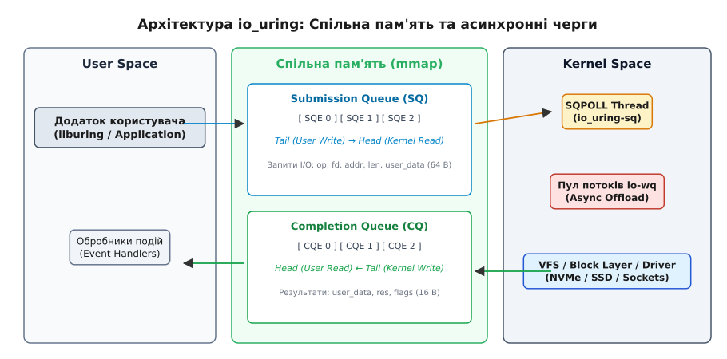

# Сучасний асинхронний ввід-вивід io_uring

<preknowlist>
- [Ядро й простір користувача](root:sys-unix/kernel-and-userspace) — перемикання контексту та системні виклики.
- [Файлові дескриптори та VFS](root:sys-unix/vfs-layer) — як ядро абстрагує ввід-вивід.
- [Синхронний та асинхронний I/O](root:sys-unix/readiness-vs-completion) — обмеження epoll та POSIX AIO.
</preknowlist>

Під час обробки сотень тисяч операцій вводу-виводу на секунду (IOPS) на сучасних накопичувачах NVMe або мережевих адаптерах 100GbE класична модель системних викликів Linux стає головним вузьким місцем продуктивності. Традиційні виклики `read()` та `write()` вимагають примусового перемикання контексту між простором користувача (ring 3) та ядром (ring 0) для кожного окремого пакета чи блоку даних. На таких навантаженнях помітна частка процесорного часу йде не на корисну роботу додатка, а на збереження та відновлення регістрів, перевірку прав доступу й скидання буферів асоціативної трансляції (TLB). Ситуація додатково ускладнилася після впровадження захисних механізмів від атак Spectre та Meltdown (зокрема ізоляції таблиць сторінок ядра KPTI), які збільшили затримку одного системного виклику до сотень наносекунд.

Спроби обійти ці обмеження за допомогою існуючих асинхронних інтерфейсів зазнали невдачі через фундаментальні вади їхньої архітектури:
- Механізм `epoll` розроблений для сповіщення про готовність (readiness notification), а не для завершення операцій (completion). Для звичайних регулярних файлів на диску `epoll` завжди миттєво повертає стан «готовий до читання», оскільки VFS не підтримує готовність для дискових файлів. Коли програма викликає `read()`, потік усе одно блокується в ядрі, якщо потрібні сторінки відсутні у кеші сторінок (page cache).
- Інтерфейс POSIX AIO (реалізований у бібліотеці `glibc`) створює прихований пул потоків `pthread` у просторі користувача. Кожен асинхронний запит породжує накладні витрати на створення контексту потоку, синхронізацію м'ютексів та виділення стека.
- Ядерний асинхронний ввід-вивід Linux AIO (`io_submit`) працює виключно з файлами, відкритими у режимі `O_DIRECT` (в обхід кешу сторінок), вимагає суворого вирівнювання адрес буферів по розміру сектора диска і блокується при зміні розміру файлу чи оновленні метаданих файлової системи. Крім того, Linux AIO взагалі не підтримує мережеві сокети.

Для подолання цих обмежень інженер Єнс Аксбо (Jens Axboe) у 2019 році розробив подійний каркас **`io_uring`**, доданий до ядра Linux починаючи з версії 5.1. `io_uring` забезпечує універсальний, високоефективний асинхронний ввід-вивід для всіх типів файлів і сокетів, усуваючи системні виклики з гарячого шляху виконання за допомогою кільцевих буферів у спільній пам'яті.

## Архітектура безсистемних викликів: Кільцеві буфери у спільній пам'яті

Головна архітектурна ідея `io_uring` — повне усунення системних викликів під час подання запитів та отримання результатів. Замість виконання виклику `read()` або `write()` для кожної операції, програма та ядро взаємодіють через двонаправлену структуру даних у спільній пам'яті (shared memory), мапованій через виклик `mmap()`.

Ця ділянка пам'яті містить два кільцевих буфери (ring buffers), побудованих за принципом Lock-free Single-Producer / Single-Consumer (SPSC):

1. **Submission Queue (SQ) — Черга подання:** Буфер, у який програма користувача (Producer) записує нові I/O-запити, а ядро (Consumer) зчитує їх для виконання.
2. **Completion Queue (CQ) — Черга завершення:** Буфер, у який ядро (Producer) записує результати виконаних операцій, а програма (Consumer) зчитує їх у зручний для себе час.

```
       Подання запитів (SQE)                Зчитування результатів (CQE)
 [ Додаток ] ───────► [ Submission Queue ] ───────► [ Ядро Linux ]
     ▲                                                   │
     └───────────────── [ Completion Queue ] ◄───────────┘
```

Оскільки обидві черги розміщені у спільних сторінках пам'яті, додаток додає запит у чергу SQ і зчитує результат із CQ за допомогою звичайних інструкцій запису та читання RAM, взагалі не перемикаючи контекст процесора.

Для забезпечення узгодженості без блокувань (lock-free) ядро та додаток синхронізують черги через атомарні вказівники голови (`head`) та хвоста (`tail`), використовуючи процесорні бар'єри пам'яті (`smp_store_release` та `smp_load_acquire`):
- Для черги SQ: додаток просуває вказівник `tail` після запису нових запитів, а ядро просуває вказівник `head` у міру їх вилучення.
- Для черги CQ: ядро просуває вказівник `tail` після виписування результатів, а додаток просуває `head` після їх обробки.

Масив елементів SQ (на відміну від CQ) має додатковий шар непрямої адресації — масив індексів `sqring->array`. Додаток записує фізичний елемент у будь-яку вільну комірку масиву запитів і лише вказує її індекс у кільці. Це дозволяє додавати запити у довільному порядку та об'єднувати їх у батчі без переміщення великих обсягів пам'яті.

## Анатомія запитів та відповідей: Поля SQE та CQE

Операції в `io_uring` кодуються фіксованими бінарними структурами. Детальну специфікацію полів, вирівнювання та таблицю опкодів наведено в довідковій вставці до цієї теми — «Інтерфейс та структури даних io_uring».

### Черга подання: struct io_uring_sqe (64 байти)

Кожен елемент черги подання (Submission Queue Entry) займає рівно 64 байти, що збігається з розміром стандартної кеш-лінії x86_64 і ARM64. Це усуває явище хибного розділення кешу (false sharing) між ядрами CPU.

Основні поля `io_uring_sqe`:
- **`opcode` (1 байт):** Код операції (`IORING_OP_READV`, `IORING_OP_WRITEV`, `IORING_OP_ACCEPT`, `IORING_OP_POLL_ADD`, `IORING_OP_SEND_ZC` тощо).
- **`flags` (1 байт):** Прапорці поведінки запиту:
  - `IOSQE_FIXED_FILE`: використовувати попередньо зареєстровані файлові дескриптори.
  - `IOSQE_IO_DRAIN`: зачекати завершення всіх попередніх запитів у черзі перед початком виконання цього.
  - `IOSQE_IO_LINK`: зв'язати цей запит із наступним. Наступний SQE почне виконуватися лише після успішного завершення поточного.
  - `IOSQE_ASYNC`: примусово делегувати виконання операції фоновому пулу потоків ядра `io-wq`.
  - `IOSQE_BUFFER_SELECT`: автовибір буфера з зареєстрованої групи (provided buffers).
- **`fd` (4 байти):** Файловий дескриптор цільового файла або сокета.
- **`off` (8 байтів):** Зміщення у файлі для операцій читання/запису.
- **`addr` (8 байтів):** Адреса буфера в просторі користувача або вказівник на масив `iovec`.
- **`len` (4 байти):** Розмір буфера в байтах або кількість елементів `iovec`.
- **`user_data` (8 байтів):** 64-бітне довільне значення (найчастіше вказівник на об'єкт контексту або ідентифікатор транзакції). Ядро не інтерпретує це поле і без змін повертає його у відповідному CQE.

### Ланцюжки запитів (Request Chaining)

Завдяки прапорцю `IOSQE_IO_LINK` розробник може сформувати впорядковану послідовність операцій без повернення управління у простір користувача між кроками. Наприклад, можна зв'язати три SQE над уже відкритим файлом:
1. `IORING_OP_WRITE` (записати блок даних)
2. `IORING_OP_FSYNC` (скинути записане на носій)
3. `IORING_OP_CLOSE` (закрити дескриптор)

Ядро виконає їх послідовно одне за одним. Якщо перший запит поверне помилку (наприклад, `-EIO`), ядро автоматично скасує наступні пов'язані запити з кодом `-ECANCELED`, не витрачаючи ресурси на їх виконання. Важлива межа механізму: ланцюжок лише впорядковує операції, але не передає результат попереднього кроку наступному — усі SQE ланцюжка заповнюються ще до подання, тож дескриптор, який щойно повернув `IORING_OP_ACCEPT` чи `IORING_OP_OPENAT`, наступний запит ланцюжка підставити не може.

### Черга завершення: struct io_uring_cqe (16 байтів)

Кожен елемент черги завершення (Completion Queue Entry) має розмір 16 байтів (прапорець `IORING_SETUP_CQE32` вмикає подвоєний, 32-байтний варіант із двома додатковими 64-бітними полями для операцій, яким замало самого `res`):
- **`user_data` (8 байтів):** Збігається з полем `user_data` відповідного SQE. Завдяки цьому додаток миттєво знаходить відповідний обробник (callback/future) без збереження додаткових таблиць стану.
- **`res` (4 байти):** Результат операції. У разі успіху містить кількість оброблених байтів (наприклад, `4096`). У разі помилки містить від'ємний код системної помилки (наприклад, `-EAGAIN`, `-EBADF`, `-ENOMEM`).
- **`flags` (4 байти):** Метапрапорці ядра (наприклад, `IORING_CQE_F_MORE` для багаторазових генерацій подій або `IORING_CQE_F_BUFFER` з ID обраного буфера).

## Системні виклики та життєвий цикл ядра

Для керування екземпляром `io_uring` ядро Linux надає три фундаментальні системні виклики ядра:
- `int io_uring_setup(u32 entries, struct io_uring_params *p);` — створення екземпляра кільця та повернення зміщень для мапінгу пам'яті.
- `int io_uring_enter(unsigned int fd, unsigned int to_submit, unsigned int min_complete, unsigned int flags, sigset_t *sig);` — подання нових SQE в ядро та очікування завершення CQE.
- `int io_uring_register(unsigned int fd, unsigned int opcode, void *arg, unsigned int nr_args);` — одноразова реєстрація таблиць файлів, буферів чи пулів потоків.

### 1. Створення кільця: io_uring_setup()

Додаток викликає `io_uring_setup()`, вказуючи кількість елементів черги `entries` (від 1 до 32768; ядро округлює це число вгору до найближчого степеня двійки). Ядро створює анонімний файловий дескриптор `ring_fd` і заповнює структуру `io_uring_params`, повертаючи точні зміщення полів у спільній пам'яті. 

Після цього додаток виконує виклики `mmap()` для двох областей:
- Пам'ять черг SQ, CQ та масиву непрямих індексів `array`.
- Пам'ять масиву структур `io_uring_sqe`.

### 2. Подання та очікування: io_uring_enter()

Коли додаток заповнив декілька SQE в пам'яті і просунув вказівник `sqring->tail`, ядро ще не знає про появу нових запитів. Щоб сповістити ядро або заблокувати потік до появи готових результатів, викликається `io_uring_enter()`:

- Параметр `to_submit` вказує кількість нових SQE у черзі.
- Параметр `min_complete` вказує кількість CQE, поява яких вимагається перед розблокуванням потоку.
- Якщо `to_submit > 0` та `min_complete = 0`, виклик повідомляє ядро про нову роботу і миттєво повертає управління (неблокуюче подання батчу).
- Якщо `to_submit = 0`, `min_complete = 1`, а у `flags` виставлено `IORING_ENTER_GETEVENTS`, виклик працює як аналог `epoll_wait()`, переводячи процес у стан сну до приходу хоча б одного результату. Без цього прапорця ядро на `min_complete` не дивиться взагалі й повертається негайно.

### Шляхи виконання запитів всередині ядра

Отримавши SQE, ядро обирає один із трьох шляхів виконання залежно від природи операції та стану ресурсів:

```
                  ┌─────────────────────────────────────────┐
                  │          Надходження SQE у ядро         │
                  └────────────────────┬────────────────────┘
                                       │
            ┌──────────────────────────┼──────────────────────────┐
            ▼                          ▼                          ▼
   [ Швидкий шлях ]           [ Полінг подій ]          [ Асинхронний пул ]
Неблокуюча спроба VFS       Реєстрація poll_wait       Передача в io-wq
  (Page Cache Hit)           (Мережевий сокет)         (Page Cache Miss/Disk)
```

1. **Швидкий шлях (Fast-path):** Ядро намагається виконати операцію негайно у контексті поточного системного виклику без блокування. Якщо дані файлу вже перебувають у RAM (Page cache hit), ядро скопіює їх у буфер користувача і миттєво сформує CQE.
2. **Асинхронний полінг (Poll-driven):** Для сокетів та мережевих пристроїв ядро реєструє внутрішній зворотний виклик (pollwait) у черзі очікування сокета. Коли мережевий адаптер отримує пакет, апаратне переривання активує callback ядра, який виконує зчитування і поміщає CQE в чергу.
3. **Делегування пулу потоків ядра (io-wq):** Якщо операція є блокуючою за своєю природою (наприклад, читання з диска при відсутності даних у кеші сторінок, розширення файлу, блокування inode), ядро передає запит внутрішньому пулу робочих потоків ядра `io-wq`. Ці потоки виконують блокуючу операцію асинхронно щодо додатка користувача, не затримуючи головний цикл подій.

### Механізм Task Work

Щоб уникнути зайвих міжпроцесорних переривань (IPI) та контекстних перемикань при поверненні результатів з апаратних переривань, `io_uring` використовує внутрішній механізм ядра **Task Work** (`task_work_add`). 

Замість того, щоб миттєво будити процес користувача з контексту переривання (ISR), ядро додає задачу завершення у списки `task_work` відповідного потоку. Коли потік повертається у простір користувача або виконує наступний `io_uring_enter()`, ядро пакетно обробляє всі накопичені результати `task_work`, записуючи CQE у простір користувача за один похід.

## Архітектура асинхронного пулу потоків ядра io-wq

Коли операція вводу-виводу не може бути виконана у неблокуючому швидкому контексті (наприклад, виникає промах кешу сторінок `page cache miss`, вимагається виділення нових дискових блоків в ext4/xfs, або виконується системний виклик `fsync`), ядро передає SQE підсистемі **`io-wq`** (io_uring worker queue).

`io-wq` — це внутрішній асинхронний пул робочих потоків ядра, розроблений спеціально для замкненого обслуговування блокуючих операцій `io_uring`. 

### Типи робочих потоків: Bound vs Unbound

Пул `io-wq` розділяє всі задачі на дві категорії з різним масштабуванням:

1. **Зв'язані потоки (Bound Workers):** обслуговують роботу, час виконання якої обмежений згори — насамперед ввід-вивід зі звичайних файлів на блочному пристрої (`read`, `write`, `fsync`). Межа їх кількості за замовчуванням прив'язана до числа доступних процесорних ядер.
2. **Незв'язані потоки (Unbound Workers):** обслуговують роботу, що може блокуватися як завгодно довго — операції з сокетами, каналами (`pipe`), терміналами, а також блокування файлів (`flock`). Межа тут значно вища й за замовчуванням спирається на ліміт числа процесів користувача (`RLIMIT_NPROC`).

Додаток може налаштувати верхню межу кількості потоків `io-wq` через виклик `io_uring_register()` з опкодом `IORING_REGISTER_IOWQ_MAX_WORKERS` (окремі межі для зв'язаних і незв'язаних потоків), запобігаючи неконтрольованому виснаженню ресурсів пам'яті ядра при сплесках дискових запитів.

## Буферні кільця (Provided Buffer Rings) та автовибір буферів

У традиційній мережевій моделі на базі `epoll` додаток змушений заздалегідь виділяти буфер пам'яті під кожне відкрите сокетне з'єднання. Якщо сервер підтримує 1 000 000 одночасних пасивних TCP-з'єднань, а розмір буфера становить 4 КБ, додаток марнує понад 4 ГБ оперативної пам'яті лише на очікування даних.

`io_uring` вирішує цю проблему за допомогою механізму **Provided Buffer Rings** (`IORING_REGISTER_PBUF_RING`):

1. Додаток створює єдиний спільний пул буферів пам'яті у просторі користувача і реєструє його в ядрі як кільце буферів `struct io_uring_buf_ring`.
2. Додаток надсилає запити на читання (`IORING_OP_RECV` або `IORING_OP_READ`) із прапорцем `IOSQE_BUFFER_SELECT` без вказання конкретної адреси буфера.
3. Коли на сокет прибувають дані, ядро атомарно вибирає перший вільний буфер із кільця `io_uring_buf_ring`, записує туди дані і повертає його ідентифікатор `bid` у полі `cqe->flags` (прапорець `IORING_CQE_F_BUFFER`).
4. Після обробки даних додаток повертає ідентифікатор `bid` назад у кільце буферів без жодних системних викликів.

Це знижує споживання пам'яті мережевими серверами у десятки разів, оскільки обсяг виділеної пам'яті пропорційний не кількості з'єднань, а кількості активних запитів, що обробляються одночасно.

## Багаторазові запити (Multi-shot Request Model)

У класичній моделі асинхронного вводу-виводу для отримання кожного нового з'єднання або пакета додаток повинен заново формувати і подавати новий SQE. Для високонавантажених серверів це створює постійне навантаження на чергу SQ.

`io_uring` пропонує **режим багаторазових запитів (Multi-shot requests)**:

- `IORING_ACCEPT_MULTISHOT` — Додаток подає один-єдиний SQE на прийняття з'єднань, і ядро тримає цей запит активним доти, доки його не скасують. Кожне нове вхідне TCP-з'єднання породжує новий CQE з прапорцем `IORING_CQE_F_MORE`.
- `IORING_RECV_MULTISHOT` — Додаток подає один SQE на читання з сокета. Ядро породжує новий CQE щоразу, коли у сокет прибувають нові дані, не вимагаючи повторного подання SQE.

Запит залишається активним доти, доки сокет не буде закрито, не виникне критична помилка або додаток не надішле явний запит скасування `IORING_OP_ASYNC_CANCEL`.

## Режими екстремальної продуктивності

Базовий режим `io_uring` істотно випереджає `epoll` завдяки об'єднанню викликів у батчі (batching). Проте для досягнення максимальної продуктивності в системи впроваджено три додаткові режими роботи.

### 1. Режим SQPOLL (Kernel Thread Polling) — Zero-Syscall I/O

Якщо під час ініціалізації `io_uring_setup()` встановити прапор `IORING_SETUP_SQPOLL`, ядро Linux створює спеціальний системний потік `io_uring-sq`.

Цей потік ядра працює у нескінченному циклі, виконуючи активний полінг (polling) пам'яті Submission Queue у просторі користувача. Коли програма записала новий SQE і оновила `sqring->tail`, потік ядра **миттєво підхоплює його без виконання системного виклику `io_uring_enter()`**.

В результаті додаток може виконувати мільйони операцій вводу-виводу на секунду із **абсолютно нульовою кількістю системних викликів** (Zero-syscall I/O).

Для запобігання марнотратному спалюванню 100% CPU потік `SQPOLL` засинає, якщо черга SQ залишається порожньою протягом заданого інтервалу (параметр `sq_thread_idle`; якщо додаток його не задав, ядро бере близько секунди). У цьому разі ядро встановлює прапор `IORING_SQ_NEED_WAKEUP` у спільній пам'яті. Додаток перевіряє цей прапор і, якщо потік заснув, робить один виклик `io_uring_enter()`, щоб розбудити `SQPOLL`, після чого нульові системні виклики відновлюються.

### 2. Режим IOPOLL (Driver Polling) — Безпереривний ввід-вивід

Під час роботи з надшвидкими NVMe SSD затримка обробки апаратного переривання контролером переривань процесора (APIC) та процедурою ISR стала співмірною з часом зчитування комірки флеш-пам'яті (кілька мікросекунд).

Режим `IORING_SETUP_IOPOLL` переводить обробку дискових файлів у режим опитування драйвера (polled I/O). Замість очікування апаратного переривання від дискового контролера, ядро опитує безпосередньо кільцеві черги команд NVMe (Hardware Completion Queues). Ціна цього — процесорні цикли, витрачені на активне опитування пристрою; натомість із бюджету затримки зникає весь шлях апаратного переривання, а на найшвидших NVMe це відчутна частка часу операції.

### 3. Попередньо зареєстровані ресурси (Registered Resources)

При кожному традиційному `read()` ядро змушене виконувати рутинну підготовчу роботу:
1. Знайти об'єкт `struct file` у таблиці файлових дескрипторів процесу за індексом `fd`.
2. Перевірити права доступу.
3. Для прямого вводу-виводу (`O_DIRECT`) — отримати сторінки буфера користувача і заблокувати їх у фізичній RAM (`get_user_pages()`), щоб вони не потрапили у swap під час DMA-передачі.
4. Розблокувати ці сторінки після закінчення DMA.

За допомогою системного виклику `io_uring_register()` додаток може зареєструвати ці ресурси одноразово під час старту:

- **Зареєстровані файли (Registered Files):** Додаток передає ядру масив файлових дескрипторів. Ядро створює внутрішній масив вказівників на `struct file`. У наступних SQE додаток вказує прапорець `IOSQE_FIXED_FILE` і передає індекс масиву замість справжнього `fd`, минаючи таблицю дескрипторів процесу.
- **Прямі файлові дескриптори (Direct Descriptors):** За допомогою `IORING_FILE_INDEX_ALLOC` ядро виділяє дескриптори безпосередньо у внутрішній таблиці `io_uring`, минаючи таблицю `fd` процесу. Це усуває конфлікти блокувань спільного списку файлів процесу (`files_lock`) у багатопотокових серверах.
- **Зареєстровані буфери (Fixed Buffers):** Додаток заздалегідь виділяє та реєструє свої буфери пам'яті через `IORING_REGISTER_BUFFERS`. Ядро блокує фізичні сторінки (pinning) лише один раз. Виклики `IORING_OP_READ_FIXED` та `IORING_OP_WRITE_FIXED` здійснюють DMA-передачу миттєво, усуваючи накладні витрати на `get_user_pages()`.
- **Zero-Copy мережевий I/O (`IORING_OP_SEND_ZC`):** Мережева карта (NIC) зчитує дані за допомогою DMA безпосередньо з оперативної пам'яті простору користувача, без копіювання самих даних у пам'ять ядра. Окремий CQE з прапорцем `IORING_CQE_F_NOTIF` повідомляє, коли буфер уже відпрацьовано і його можна змінювати.

## Діагностика та аналіз внутрішнього стану ядра

Для спостереження за станом екземплярів `io_uring` ядро Linux надає інструменти через псевдофайлові системи `procfs` та події `tracepoints`.

### Інспекція через /proc/[pid]/fdinfo/[fd]

Інформація про кожен екземпляр `io_uring` доступна у файлі `fdinfo` відповідного файлового дескриптора:

```bash
$ cat /proc/1234/fdinfo/6
pos:    0
flags:  02000002
mnt_id: 15
ino:    12845
SqHead: 128
SqTail: 128
SqMask: 4095
SqEntries: 4096
CqHead: 256
CqTail: 256
CqMask: 8191
CqEntries: 8192
SqThread: 1235
SqThreadCpu: 3
```

Поля `SqHead`/`SqTail` та `CqHead`/`CqTail` показують точні атомарні індекси черг, а `SqThread` — PID потоку `SQPOLL`. Точний набір полів залежить від версії ядра.

### Ядерні точки трасування (Tracepoints)

Для детального вимірювання затримок обробки запитів використовується підсистема `ftrace` або `bpftrace` через точку трасування `io_uring`:

```bash
# Трасування всіх поданих SQE та їхніх результатів за допомогою bpftrace
$ sudo bpftrace -e '
tracepoint:io_uring:io_uring_submit_sqe {
    @start[args->user_data] = nsecs;
}
tracepoint:io_uring:io_uring_complete {
    $dur = nsecs - @start[args->user_data];
    @latency_us = hist($dur / 1000);
    delete(@start[args->user_data]);
}'
```

## Приклад коду: Асинхронне читання з файлу

Нижче наведено робочий приклад асинхронного читання блоку даних із файлу через високорівневу бібліотеку `liburing`. Приклад реалізовано двома мовами у відповідних вкладках: ідіоматичний C з прямим викликом API бібліотеки та сучасний C++20 із застосуванням концепцій RAII для автоматичного управління ресурсами кільця та файлових дескрипторів.

:::tabs
```c
#include <liburing.h>
#include <fcntl.h>
#include <stdio.h>
#include <stdlib.h>
#include <unistd.h>
#include <string.h>

#define QUEUE_DEPTH 4
#define BLOCK_SIZE 4096

int main(void) {
    struct io_uring ring;
    int fd;
    char buffer[BLOCK_SIZE];
    struct io_uring_sqe *sqe;
    struct io_uring_cqe *cqe;
    int ret;

    /* 1. Ініціалізація кільцевих буферів io_uring у ядрі */
    ret = io_uring_queue_init(QUEUE_DEPTH, &ring, 0);
    if (ret < 0) {
        fprintf(stderr, "Помилка ініціалізації io_uring: %s\n", strerror(-ret));
        return 1;
    }

    fd = open("test.txt", O_RDONLY);
    if (fd < 0) {
        perror("Помилка відкриття файлу");
        io_uring_queue_exit(&ring);
        return 1;
    }

    /* 2. Отримання вільної комірки SQE та підготовка запиту читання */
    sqe = io_uring_get_sqe(&ring);
    if (!sqe) {
        fprintf(stderr, "Черга SQ переповнена\n");
        close(fd);
        io_uring_queue_exit(&ring);
        return 1;
    }

    /* Заповнення полів SQE: read(fd, buffer, BLOCK_SIZE, offset=0) */
    io_uring_prep_read(sqe, fd, buffer, BLOCK_SIZE, 0);
    
    /* Маркування запиту унікальним ідентифікатором (user_data) */
    io_uring_sqe_set_data64(sqe, 42);

    /* 3. Подання запиту в ядро (виклик io_uring_enter) */
    ret = io_uring_submit(&ring);
    if (ret < 0) {
        fprintf(stderr, "Помилка подання SQE: %s\n", strerror(-ret));
        close(fd);
        io_uring_queue_exit(&ring);
        return 1;
    }

    /* 4. Блокуюче очікування результату в черзі CQ */
    ret = io_uring_wait_cqe(&ring, &cqe);
    if (ret < 0) {
        fprintf(stderr, "Помилка очікування CQE: %s\n", strerror(-ret));
        close(fd);
        io_uring_queue_exit(&ring);
        return 1;
    }

    /* Перевірка коду повернення асинхронної операції */
    if (cqe->res < 0) {
        fprintf(stderr, "Асинхронне читання завершилося з помилкою: %s\n", strerror(-cqe->res));
    } else {
        printf("Успішно прочитано %d байтів. Маркер user_data: %llu\n",
               cqe->res, (unsigned long long)io_uring_cqe_get_data64(cqe));
    }

    /* 5. Сповіщення ядра про зчитування CQE (зсув вказівника head у CQ) */
    io_uring_cqe_seen(&ring, cqe);

    close(fd);
    io_uring_queue_exit(&ring);
    return 0;
}
```
```cpp
#include <liburing.h>
#include <fcntl.h>
#include <unistd.h>
#include <iostream>
#include <vector>
#include <span>
#include <system_error>
#include <memory>

// RAII обгортка для файлового дескриптора
class FileDescriptor {
    int fd_ = -1;
public:
    explicit FileDescriptor(int fd) noexcept : fd_(fd) {}
    ~FileDescriptor() { if (fd_ >= 0) ::close(fd_); }
    
    FileDescriptor(const FileDescriptor&) = delete;
    FileDescriptor& operator=(const FileDescriptor&) = delete;
    
    FileDescriptor(FileDescriptor&& o) noexcept : fd_(o.fd_) { o.fd_ = -1; }
    FileDescriptor& operator=(FileDescriptor&& o) noexcept {
        if (this != &o) {
            if (fd_ >= 0) ::close(fd_);
            fd_ = o.fd_;
            o.fd_ = -1;
        }
        return *this;
    }
    
    [[nodiscard]] int get() const noexcept { return fd_; }
    [[nodiscard]] bool valid() const noexcept { return fd_ >= 0; }
};

// RAII обгортка для екземпляра io_uring
class UringRing {
    struct io_uring ring_{};
    bool initialized_ = false;
public:
    explicit UringRing(unsigned int entries, unsigned int flags = 0) {
        int ret = io_uring_queue_init(entries, &ring_, flags);
        if (ret < 0) {
            throw std::system_error(-ret, std::generic_category(), "io_uring_queue_init failed");
        }
        initialized_ = true;
    }

    ~UringRing() {
        if (initialized_) {
            io_uring_queue_exit(&ring_);
        }
    }

    UringRing(const UringRing&) = delete;
    UringRing& operator=(const UringRing&) = delete;

    [[nodiscard]] struct io_uring* get() noexcept { return &ring_; }

    void submit_read(int fd, std::span<char> buffer, uint64_t offset, uint64_t user_data) {
        struct io_uring_sqe* sqe = io_uring_get_sqe(&ring_);
        if (!sqe) {
            throw std::runtime_error("Submission Queue is full");
        }
        io_uring_prep_read(sqe, fd, buffer.data(), static_cast<unsigned int>(buffer.size()), offset);
        io_uring_sqe_set_data64(sqe, user_data);
        
        int ret = io_uring_submit(&ring_);
        if (ret < 0) {
            throw std::system_error(-ret, std::generic_category(), "io_uring_submit failed");
        }
    }

    struct io_uring_cqe* wait_cqe() {
        struct io_uring_cqe* cqe = nullptr;
        int ret = io_uring_wait_cqe(&ring_, &cqe);
        if (ret < 0) {
            throw std::system_error(-ret, std::generic_category(), "io_uring_wait_cqe failed");
        }
        return cqe;
    }

    void cqe_seen(struct io_uring_cqe* cqe) noexcept {
        io_uring_cqe_seen(&ring_, cqe);
    }
};

int main() {
    constexpr unsigned int queue_depth = 4;
    constexpr size_t block_size = 4096;

    try {
        UringRing ring(queue_depth);
        FileDescriptor fd(::open("test.txt", O_RDONLY));
        
        if (!fd.valid()) {
            std::cerr << "Помилка відкриття файлу test.txt\n";
            return 1;
        }

        std::vector<char> buffer(block_size);
        constexpr uint64_t request_id = 1001;

        // Подання асинхронного запиту через безпечну C++ обгортку
        ring.submit_read(fd.get(), buffer, 0, request_id);

        // Очікування результату
        struct io_uring_cqe* cqe = ring.wait_cqe();

        if (cqe->res < 0) {
            std::cerr << "Помилка читання: " << std::generic_category().message(-cqe->res) << "\n";
        } else {
            std::cout << "Успішно прочитано " << cqe->res << " байтів."
                      << " Request ID: " << io_uring_cqe_get_data64(cqe) << "\n";
        }

        ring.cqe_seen(cqe);
    } catch (const std::exception& ex) {
        std::cerr << "Критична помилка: " << ex.what() << "\n";
        return 1;
    }

    return 0;
}
```
:::

## Фігури та ілюстрації

На схемі нижче зображено фундаментальну будову каркаса `io_uring`: простори пам'яті, кільцеві буфери SQ та CQ у спільній пам'яті `mmap` та шляхи обробки запитів ядром Linux.


*Архітектура io_uring: розділення черг SQ та CQ у спільній пам'яті mmap між простором користувача та ядром.*

## Висновок

Фреймворк `io_uring` сформував новий стандарт асинхронного вводу-виводу в операційній системі Linux, подолавши ключові архітектурні обмеження `epoll` та POSIX AIO. Завдяки використанню кільцевих буферів у спільній пам'яті, підтримці неблокуючих перевірок кешу сторінок, пулу `io-wq` та режимів екстремальної продуктивності (`SQPOLL`, `IOPOLL`, fixed buffers), `io_uring` забезпечує роботу з файлами та мережею з мінімальними затримками і мінімумом перемикань контексту. Технологія стала опорою для сучасних високонавантажених сховищ даних (RocksDB, ScyllaDB, PostgreSQL), високопродуктивних веб-серверів, мережевих бібліотек та проксі (Netty, Envoy).
