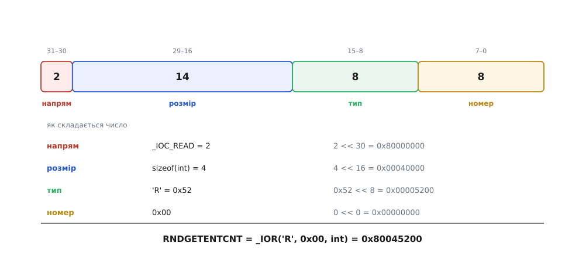

# Керуючий канал до драйвера: ioctl

<preknowlist>
- [«Усе є файлом»](root:sys-unix/everything-is-a-file) — контракт із маленького набору дієслів, на який відповідають усі джерела даних, і спільне дерево імен.
- [Файловий дескриптор](root:sys-unix/file-descriptor) — мале ціле число, яким процес називає вже відкритий об'єкт.
- [Системний виклик](root:sys-unix/syscall-mechanics) — як програма переходить межу в ядро, передає аргументи й дістає назад результат або від'ємний код помилки.
- [Ядро й простір користувача](root:sys-unix/kernel-and-userspace) — межа між адресними просторами: ядро не може просто розіменувати адресу, яку йому дав процес.
- [Файл пристрою](root:sys-unix/device-file-model) — як драйвер отримує ім'я в дереві й починає відповідати на файлові виклики.
</preknowlist>

Наберіть `ls` у широкому вікні термінала — імена стануть у кілька колонок. Звузьте вікно, наберіть ще раз — колонок поменшає. А `ls | cat` виведе по одному імені в рядок, хоч би яким було вікно.

Отже `ls` якось дізнається ширину вікна — і дізнається, що на тому кінці вже не вікно, а канал. З потоку байтів цього знання взяти нізвідки: у бік термінала `ls` тільки пише й нічого звідти не читає. Ширина — не байт у потоці. Це властивість **самої труби**, а не того, що по ній тече.

Таких властивостей у кожного пристрою повно. У послідовного порту — швидкість, кількість стопових бітів, парність. У термінала — чи віддавати введення посимвольно, чи цілими рядками, чи показувати набране на екрані. У приводу — засунути чи висунути лоток. У камери — формат кадру й роздільність. Жодну з них не дістати ні читанням, ні записом: `read` дає байти, які пристрій **передає**, а не число, яким він **налаштований**.

## Дві площини, а в контракті місце лише для однієї

Спільний інтерфейс Unix навмисно маленький: `open`, `read`, `write`, `close`, `lseek`. Він тримається на тому, що в усіх джерел даних є один спільний знаменник — послідовність байтів без внутрішньої будови. Саме **відсутність** вимог до змісту й робить його придатним усьому.

Та сама причина робить його безсилим у другій площині. Швидкість порту — не байти. Розмір вікна — не байти. У знаменнику їх немає й не буде, бо в різних пристроїв вони різні: у порту одні, у камери інші, у приводу треті. Спільного тут не знайдеться ніколи — а маленький інтерфейс живе рівно з того, що містить тільки спільне.


*Байти й налаштування рухаються різними шляхами: перші течуть крізь буфер, другі змінюють правила, за якими цей буфер працює. Один канал двох таких різних потреб не обслужить, тому поруч із дорогою даних мусить бути окрема дорога керування.*

Виходів із цієї суперечності рівно три, і варто пройти всі, бо обраний виглядає найгіршим, доки не побачиш решти.

**Додати дієслів.** Хай буде `setspeed`, `getwinsize`, `eject`. Тоді кожне нове дієслово мусить якось реалізувати **кожен** драйвер — бодай відмовою, — і кожна програма мусить знати, до кого його доречно застосувати. Кількість написаного коду знову стає добутком: скільки видів пристроїв на скільки видів налаштувань. І головне — список ніколи не закриється: наступний пристрій принесе властивість, якої в ньому немає, і його доведеться правити знову, разом із заголовками, бібліотекою C і всіма програмами.

**Сховати керування всередині потоку.** Домовитися, що певні байти — не дані, а команда. Саме так працюють escape-послідовності термінала. Ціна відома наперед: потік перестає бути прозорим. Щойно якісь байти стають особливими, усі інші доводиться екранувати — а разом із цим зникає обіцянка, що `write` донесе рівно те, що йому дали. Є й друга ціна, тонша: команда всередині потоку спрацює тоді, коли до неї дочитають, тобто **після** всіх байтів, що вже стоять у черзі. «Змінити швидкість порту після того, як допишеться буфер» — не те, чого хоче програма, яка хоче змінити швидкість зараз.

**Лишити в контракті один отвір.** Один системний виклик, зміст якого ядро не визначає взагалі: воно лише доносить його до драйвера, а що робити — вирішує сам драйвер. Дієслів більше не додається, потік лишається прозорим, а нові операції з'являються без жодної правки спільного інтерфейсу.

Unix пішов третім шляхом. У сьомій редакції (1979) з'явився виклик `ioctl` — від *input/output control* — і поглинув пару вужчих викликів `stty`/`gtty`, які вміли лише те, що стосувалося термінала: їх не викинули, а переписали як окремий випадок нового. Як саме керування терміналом переросло в універсальний отвір і чому в помилки лишилася назва про друкарську машинку, розказано окремо: [про народження ioctl](root:sys-unix/ioctl-interface/hist-from-stty-to-ioctl.md).

## Виклик, який сам по собі не означає нічого

Оголошення в просторі користувача виглядає так:

```c
int ioctl(int fd, unsigned long request, ...);
```

Три аргументи. `fd` каже, **над чим** виконати операцію. `request` — число, що називає операцію. Третій — необов'язковий і нетипізований: одне машинне слово, яке буває або самим значенням, або адресою структури в пам'яті процесу.

Ядро не тлумачить `request` і не тлумачить третій аргумент. Воно робить рівно одну річ: за дескриптором знаходить об'єкт, який стоїть за ним, бере в цього об'єкта функцію-обробник і передає їй обидва числа як є.


*Ядро тут — комутатор, а не виконавець: воно доводить число до драйвера й повертає назад те, що драйвер віддав. Сенс команди існує лише всередині драйвера, і більше ніде в системі його немає.*

Кілька команд ядро таки розбирає саме, ще до передачі вниз: `FIONBIO` (перемкнути дескриптор у неблокувальний режим), `FIOCLEX` і `FIONCLEX` (закривати чи не закривати його при `exec`). Вони стосуються не пристрою, а самого відкритого файла, тож жодному драйверові про них знати не треба. З `FIONREAD` (скільки байтів уже готові до читання) інакше: за звичайний файл відповідає саме ядро, а для термінала, сокета чи каналу виклик іде вниз, і скільки там накопичилося, каже сам драйвер. Усе інше йде вниз без розгляду.

Бік драйвера виглядає буквально як розгалуження за числом:

```c
static long uart_ioctl(struct file *f, unsigned int cmd, unsigned long arg)
{
        struct uart_dev *dev = f->private_data;
        struct uart_cfg cfg;

        switch (cmd) {
        case UART_SET_BAUD:
                if (copy_from_user(&cfg, (void __user *)arg, sizeof(cfg)))
                        return -EFAULT;
                if (cfg.baud == 0 || cfg.baud > 4000000)
                        return -EINVAL;
                return uart_apply_baud(dev, cfg.baud);

        case UART_GET_BAUD:
                memset(&cfg, 0, sizeof(cfg));
                cfg.baud = dev->baud;
                if (copy_to_user((void __user *)arg, &cfg, sizeof(cfg)))
                        return -EFAULT;
                return 0;

        default:
                return -ENOTTY;
        }
}
```

Гілка `default` — це вся відповідь системи на «такої операції тут немає». Код `ENOTTY` у ранніх системах друкувався як «Not a typewriter», бо колись єдиним, до кого зверталися з такими командами, був термінал; від 4.4BSD його друкують як «Inappropriate ioctl for device», але номер помилки лишився той самий. Це не курйоз, а корисна властивість: спробувати команду й подивитися, чи прийшло `ENOTTY`, — єдиний загальний спосіб дізнатися, чи вміє цей файл те, що ви питаєте.

Назва `unlocked_ioctl` у структурі операцій — теж слід історії. До ядра 2.6.36 існував обробник `ioctl`, який ядро викликало, взявши перед тим «велике блокування ядра» — один глобальний замок на всю систему. Це рятувало старі драйвери від гонок, але й означало, що дві програми не могли одночасно бути в ioctl-і **різних** пристроїв. Коли з ядра почали викорінювати цей замок, старий обробник прибрали, лишивши `unlocked_ioctl`: ядро більше нічого не блокує, а драйвер [дбає про власну синхронізацію](root:sys-unix/kernel-locking) сам. Сам великий замок пережив цю правку й дожив до 2.6.39.

> 🔧 **Навіщо це.** Коли програма поводиться незрозуміло з пристроєм, `strace -e trace=ioctl ./program` показує рівно ті числа, які пішли вниз, і що повернулося. Це найкоротший шлях від «камера не віддає кадри» до «драйвер відповів `−EINVAL` на команду задання формату» — бо на цьому рівні видно саму розмову з драйвером, а не її переказ бібліотекою.

## Чому команда — число, і чому не просте

Раз ядро не перевіряє змісту, вся відповідальність за те, щоб число не збіглося з чужим, лягає на домовленість. І тут є небезпека, яку легко пропустити: дескриптор може виявитися не тим. Програма помилилася змінною, відкрила не той файл — і команда «висунь лоток» приходить драйверові, у якого під тим самим числом записано «зітри вміст». Ніхто нічого не помітить: обидві сторони формально праві.

Тому в Linux номер команди не призначають вільно, а **збирають** із чотирьох полів усередині одного 32-бітного числа.



*Кожне поле відповідає на окреме питання: хто чию пам'ять читає, наскільки велика структура-аргумент, чия це підсистема і яка саме команда всередині неї. Разом вони роблять випадковий збіг номерів двох різних підсистем малоймовірним.*

**Тип** — вісім бітів, зазвичай літера: `'R'` у драйвера випадковості, `'T'` у tun/tap, `'V'` у відеопідсистемі. Це підпис підсистеми: команди різних підсистем розходяться вже за ним. **Номер** — вісім бітів, порядковий номер команди всередині своєї підсистеми. **Розмір** — чотирнадцять бітів (на кількох архітектурах тринадцять), туди макрос сам кладе `sizeof` типу аргументу. **Напрям** — два біти, і читати їх треба **з боку програми**: `_IOC_READ` означає, що дані піде читати програма, тобто ядро писатиме в її буфер.

Складається все чотирма макросами: `_IO` (аргументу немає), `_IOW` (програма передає структуру вниз), `_IOR` (програма забирає структуру нагору), `_IOWR` (в обидва боки).

**Умова: команда `RNDGETENTCNT` — «скільки ентропії лишилося в пулі» — оголошена як `_IOR('R', 0x00, int)`.**

```
напрям   _IOC_READ   = 2       →    2 << 30  =  0x80000000
розмір   sizeof(int) = 4       →    4 << 16  =  0x00040000
тип      'R'         = 0x52    → 0x52 <<  8  =  0x00005200
номер    0x00                  →    0 <<  0  =  0x00000000
                                             ─────────────
                                  RNDGETENTCNT  0x80045200
```

Саме це число й побачите в `strace`, звертаючись до [джерела випадковості](root:sys-unix/random-devices). Так само розкладається `TUNSETIFF` = `_IOW('T', 202, int)` = `0x400454ca` — команда, якою програма прив'язує щойно відкритий [tun/tap](root:sys-unix/tun-tap)-дескриптор до конкретного інтерфейсу.

Тут потрібна чесна засторога. Розмір і напрям — це **опис наміру, а не охорона**: загальний шлях у ядрі їх не звіряє й нічого на їх підставі не забороняє. Ними користуються окремі підсистеми (відео та графіка звіряють розмір, щоб пережити структури, які підросли між версіями), а решта драйверів просто отримує число, у якому ці біти лежать. Перевірити аргумент драйвер зобов'язаний сам. Повний перелік макросів, зворотних добувачів `_IOC_DIR`/`_IOC_SIZE`, кодів помилок і правил укладання структур зібрано окремо: [контракт номерів і аргументів ioctl](root:sys-unix/ioctl-interface/api-ioctl-encoding.md).

## Аргумент, про який ядро не знає нічого

Третій аргумент оголошений як `unsigned long` — просто машинне слово. Для однієї команди це значення (скільки саме мілісекунд чекати), для іншої — адреса структури в пам'яті процесу. Ядро розрізнити їх не може: воно бачить однакові біти. Що це таке, знає лише драйвер — і знає тільки з номера команди.

Звідси випливає все інше. Драйвер не має права розіменувати цю адресу напряму: вона з чужого адресного простору, вона може вказувати нікуди, а може — усередину самого ядра. Тому єдиний правильний шлях — `copy_from_user`/`copy_to_user`, які перевіряють належність адреси й повертають ненуль, коли копіювання не вдалося. Звідси й `−EFAULT` у прикладі вище.

І звідси ж найнеприємніше. Кожна команда ioctl — це, по суті, **приватний системний виклик, який автор драйвера спроєктував сам**: свій формат аргументів, свої перевірки, своя відповідальність за межі масивів і за цілі числа, що можуть переповнитися. Загального механізму, який перевірив би це за нього, немає, бо перевіряти нема за чим — ядро не знає формату. Тому обробники ioctl історично є одним із найщедріших джерел уразливостей у ядрі: пропущена перевірка меж у драйвері перетворюється на запис за довільною адресою.

Ту саму сліпоту успадковують і зовнішні захисти. [Фільтр seccomp](root:sys-unix/seccomp-filter-mechanism) бачить лише регістри виклику, тож дозволити чи заборонити команду за її **номером** він може, а зазирнути всередину структури, на яку показує аргумент, — ні. Пісочниця, що допускає ioctl до пристрою, допускає туди все, що цей пристрій уміє.

## Що коштує сам отвір

Перше — розрядність. 32-бітна програма на 64-бітному ядрі викладає структуру інакше: покажчик у ній чотири байти замість восьми, `long` теж, вирівнювання інше. Змінюється `sizeof` — а отже змінюється поле розміру — а отже змінюється **саме число команди**, і `switch` у драйвері до нього не пасує. Тому в структурі операцій є окремий `compat_ioctl`, куди потрапляють виклики від [32-бітних програм](root:sys-unix/compat-32-on-64), і тому в правилах написання нових інтерфейсів стоїть: типи фіксованої ширини (`__u32`, `__u64`), покажчик передавати як `__u64`, доповнення до вирівнювання виписувати полями явно. Тоді розкладка однакова, номер один і той самий, окремої гілки не треба.

Друге — незворотність. Щойно команда потрапила у випущене ядро й нею скористалася бодай одна програма, її номер і формат аргументів заморожені назавжди: [ядро не ламає інтерфейс простору користувача](root:sys-unix/userspace-abi-stability). Помилку в структурі виправити не можна — можна лише додати другу команду з іншим номером і носити обидві.

Третє — сліпота інструментів. Пристрій із файловим інтерфейсом можна прочитати `cat`-ом і записати `echo`. Пристрій, керований через ioctl, не вміє нічого сказати про себе: щоб дізнатися, які команди він розуміє, треба мати заголовок із їхніми номерами. `strace` показує розшифровану назву команди лише тоді, коли її номер вписано в його власні таблиці; невідома команда виглядає голим шістнадцятковим числом.

> 🔧 **Навіщо це.** Коли ви проєктуєте інтерфейс до свого драйвера, ці три ціни — і є критерій вибору. Операція складається з кількох чисел, які мусять застосуватися разом і повернути результат? Тоді ioctl, і одразу структура з полів фіксованої ширини й явним доповненням, інакше через рік доведеться писати `compat_ioctl`. Операція — одне число, яке зручно було б виставити з командного рядка? Тоді атрибут у sysfs, і жодних номерів узагалі.

## Куди пішли ті, кому це не сподобалося

Заперечення проти ioctl завжди те саме: система, яка пишається спільним простором імен, для половини своїх операцій ніяких імен не має — самі числа з заголовків. Спроби це виправити дали три відповіді.

[sysfs](root:sys-unix/sysfs-device-model) повертає керування в дерево імен: один параметр — один файл, значення читається `cat`-ом і задається `echo`. Яскравість екрана, режим живлення, швидкість вентилятора живуть саме там. Ціна теж очевидна з будови: атомарно змінити три параметри разом не вийде (три файли — три записи), структуру передати нічим, а прив'язати налаштування до **конкретного відкритого дескриптора** — тим паче, бо файл у sysfs спільний для всіх.

[netlink](root:sys-unix/netlink-protocol) пішов далі: замість числа й безформного слова — справжні повідомлення з полями, які можна додавати, не ламаючи старих читачів, ще й з розсиланням подій у зворотний бік. Мережева підсистема майже повністю переїхала туди — саме тому налаштування маршрутів і адрес сьогодні йде не через ioctl, хоч старі виклики й лишилися для сумісності. Ціна — складність: найпростіша операція вимагає скласти й розібрати повідомлення.

Plan 9, у якому ідею «усе є файлом» довели до кінця, ioctl не має взагалі — там у пристрою є окремий керуючий файл, і команда просто **записується в нього текстом**. Показово, що керуюча площина при цьому нікуди не зникла: її не прибрали, її **назвали**. Питання ніколи не стояло «керування чи потік даних» — воно стояло «керування дістане ім'я в дереві чи номер у заголовку».

І все ж нові підсистеми Linux досі беруть ioctl. [Відеозахоплення](root:sys-unix/v4l2-video-devices) описує через нього формати й черги буферів; графічна підсистема — усю роботу з відеокартою; KVM, підсистема [апаратної віртуалізації](root:hw-arch/hardware-virtualization), взагалі будує на ioctl цілий інтерфейс керування гостем, де команди ще й повертають нові дескриптори — на віртуальну машину, на кожен її процесор. Причина щоразу однакова, і вона не в інерції: коли операція мусить бути **однією неподільною дією**, узяти **структуру** аргументів, повернути **результат** і стосуватися **саме цього відкритого дескриптора** з усім його станом — жоден із названих замінників цього не вміє, а ioctl уміє все одразу й за один перехід у ядро. Як виглядає такий інтерфейс зсередини — від оголошення команд до робочого драйвера й програми, що ним керує, — розібрано на працюючому прикладі: [власний символьний драйвер із командами ioctl](root:sys-unix/ioctl-interface/proj-char-driver-ioctl.md).

Вузький інтерфейс із п'яти дієслів зробив програми переносними між пристроями — але вижив він саме тому, що поруч лишили клапан. Без ioctl тиск пішов би всередину: `read` і `write` обростали б прапорцями й режимами, доки не перестали б бути спільними для всіх. Отвір не усунув складності керування пристроями — він виніс її за межі спільного контракту, у кожен драйвер окремо. Тому й платить за неї кожен драйвер сам: власним кодом сумісності, власними перевірками аргументів і власною відсутністю інструментів. Спільний інтерфейс лишився чистим рівно тією ціною, що бруд поділили порівну між усіма, хто до нього під'єднується.
