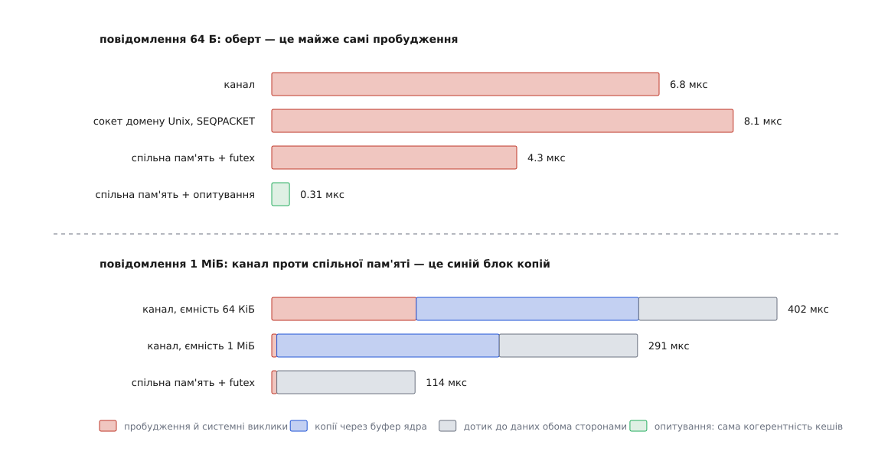

# ⚙️ Прилад: скільки коштує оберт через канал, сокет і спільну пам'ять

Одна програма на C ганяє те саме навантаження трьома способами — каналом, сокетом домену Unix у режимі `SOCK_SEQPACKET` і спільною пам'яттю з futex-сповіщенням — і друкує медіану, хвости й пропускну здатність, щоб оцінка «дві копії плюс два системні виклики» перестала бути оцінкою й стала числом з вашої машини.

Потреба в такому приладі береться з того, що оцінка мовчить про найдорожче. Порахувати байти й виклики легко, і для великих повідомлень ця арифметика справді дає правильний порядок величини. А для маленьких вона недорахує більшої частини рахунку: оберт через канал коштує тут майже семи мікросекунд, і чотири з них не пояснює ні жоден байт, ні жоден виклик. Уся різниця припадає на те, чого в арифметиці немає: приспати один процес і розбудити другий.

## Що саме міряє пінг-понг

Одну передачу зміряти важко: початок і кінець лежать у різних процесах, а щоб відняти два моменти часу, вони мають бути зняті з одного годинника. Тому міряють **оберт** — A шле повідомлення до B, B шле його назад, і обидва моменти знімає A. Половина оберту й буде оцінкою однобічної затримки, коли шлях в обидва боки симетричний.

Усередині одного оберту рівно дві **передачі даних** і дві **передачі керування**. Друге й виявляється головним. Коли B чекає на повідомлення, він спить; ядро зняло його з процесора й поклало в чергу очікування. Прихід даних означає, що ядро мусить зробити його придатним до виконання, знайти йому процесор, можливо, послати міжпроцесорне переривання, а потім перемкнути контекст. Ця робота не залежить від того, скільки байтів прийшло: однакова для шістдесяти чотирьох і для мільйона.

Звідси й розкладка виміру. Оберт складається з трьох доданків: сталого — пробудження й системні виклики; лінійного за розміром — копії через буфер ядра; і ще одного лінійного — власне дотик до даних, бо байти треба хоч колись записати й прочитати. Спільна пам'ять прибирає рівно другий доданок. Перший вона зменшує ледь-ледь, третій не чіпає взагалі. Уся суперечка про те, коли варто городити спільну ділянку, — це питання, чи виріс другий доданок до помітної частки.

## Методика, без якої числа брешуть

**Прогрів.** Перші сотні обертів платять за те, чого потім не буде: сторінкові збої на щойно відображеній пам'яті, порожні кеші, низька частота процесора, ще не населені структури ядра. Тому першу десяту частину прогону викидаємо, не записуючи.

**Прив'язка до ядер.** Це найважливіше й найчастіше пропущене. Якщо обидві сторони живуть на одному ядрі, кожна передача — це обов'язкове перемикання контексту; якщо на різних ядрах одного кристала — це міжпроцесорне переривання й перенесення рядків кеша; якщо на різних фізичних процесорах — ще й похід через міжпроцесорну шину. Числа розходяться в рази, а планувальник вибирає розкладку сам і щоразу по-новому. Отже, вибір треба **зафіксувати**, а не лишити випадку: `taskset -c` прибиває весь процес до набору ядер, але нам потрібні різні ядра для різних сторін, тож кожна прив'язує себе сама після розгалуження ([прив'язка до процесорів](root:sys-unix/cpu-affinity) — `sched_setaffinity` звужує набір ядер, на яких планувальник має право виконувати задачу).

**Медіана й хвости замість середнього.** Розподіл затримок тут різко несиметричний: майже всі оберти лягають купкою, а сотий чи тисячний утрапляє під витіснення сусідньою задачею й коштує на два порядки більше. Одне таке значення зсуває середнє по всій вибірці, і воно перестає описувати хоч що-небудь ([медіана й стійкі оцінки](root:math-probability/robust-estimators) — чому одне велике значення тягне середнє за собою, а медіану — ні). Тому пишемо медіану як типовий випадок і окремо `p99` та `p99.9` як міру того, наскільки погано буває.

**Годинник не мусить заважати.** `clock_gettime(CLOCK_MONOTONIC)` у Linux виконується без переходу в ядро — сторінка з кодом і поточними значеннями годинника відображена в кожен процес ([vDSO](root:sys-unix/vdso) — бібліотека, яку ядро підкладає в адресний простір, щоб кілька дешевих викликів обходилися без перемикання режиму). Два її виклики коштують десятки наносекунд і виміру не псують.

## Каркас

```c
/* ipcbench.c — ціна оберту через канал, сокет і спільну пам'ять.
   Збірка: cc -O2 -std=gnu11 -o ipcbench ipcbench.c
   Запуск: ./ipcbench <pipe|seqpacket|shm|spin> <байтів> <обертів> <ядро A> <ядро B> */
#define _GNU_SOURCE
#include <errno.h>
#include <fcntl.h>
#include <linux/futex.h>
#include <sched.h>
#include <stdatomic.h>
#include <stdint.h>
#include <stdio.h>
#include <stdlib.h>
#include <string.h>
#include <sys/mman.h>
#include <sys/socket.h>
#include <sys/syscall.h>
#include <sys/wait.h>
#include <time.h>
#include <unistd.h>

#define CLINE 64u

#if defined(__x86_64__) || defined(__i386__)
#define RELAX() __builtin_ia32_pause()
#elif defined(__aarch64__)
#define RELAX() __asm__ __volatile__("yield" ::: "memory")
#else
#define RELAX() ((void)0)
#endif

static uint64_t now_ns(void)
{
        struct timespec t;
        clock_gettime(CLOCK_MONOTONIC, &t);
        return (uint64_t)t.tv_sec * 1000000000ull + (uint64_t)t.tv_nsec;
}

static void pin(int cpu)
{
        cpu_set_t set;
        CPU_ZERO(&set);
        CPU_SET(cpu, &set);
        if (sched_setaffinity(0, sizeof set, &set) != 0)
                perror("sched_setaffinity");
}
```

Далі — дотик до даних, і тут захована чесність усього порівняння. Якби вимірювальна сторона просто передавала байти й не дивилася на них, спільна пам'ять «виграла» б тим, що взагалі не торкнулася сторінок: копії немає, дотику немає, лишилося саме сповіщення. Це був би вимір неіснуючої задачі. Тому обидві сторони обов'язково пишуть у буфер перед відправленням і читають його після отримання — по одному байту на рядок кеша, чого досить, щоб витягти всі рядки насправді.

```c
static volatile uint64_t sink;          /* щоб оптимізатор не викинув читання */

static void fill(volatile unsigned char *p, size_t n, uint64_t seq)
{
        for (size_t i = 0; i < n; i += CLINE)
                p[i] = (unsigned char)(seq + i);
        p[n - 1] = (unsigned char)seq;
}

static uint64_t sum(const volatile unsigned char *p, size_t n)
{
        uint64_t s = 0;
        for (size_t i = 0; i < n; i += CLINE)
                s += p[i];
        return s + p[n - 1];
}
```

## Три способи за одним інтерфейсом

Канал і сокет дають однакову пару дескрипторів «куди писати» й «звідки читати», тож обидва обслуговує один і той самий цикл вводу-виводу. Цикл потрібен через канал: він віддає потік байтів без меж повідомлень, і `read` має повне право повернути менше, ніж просили ([канали й іменовані канали](root:sys-unix/pipe-and-fifo) — кільце сторінок у ядрі, де прочитаний байт зникає назавжди).

```c
struct duplex { int tx, rx; };

static int xfer_send(int fd, const void *buf, size_t n)
{
        const char *p = buf;
        while (n) {
                ssize_t k = write(fd, p, n);
                if (k < 0) { if (errno == EINTR) continue; return -1; }
                p += k; n -= (size_t)k;
        }
        return 0;
}

static int xfer_recv(int fd, void *buf, size_t n)
{
        char *p = buf;
        while (n) {
                ssize_t k = read(fd, p, n);
                if (k <= 0) { if (k < 0 && errno == EINTR) continue; return -1; }
                p += k; n -= (size_t)k;
        }
        return 0;
}
```

Створення обох різниться лише розмірами буферів — і саме ці розміри дають найбільше несподіванок у результатах.

```c
static int open_pipe_pair(struct duplex *a, struct duplex *b, size_t n)
{
        int ab[2], ba[2];                       /* ab: A→B, ba: B→A */
        if (pipe(ab) != 0 || pipe(ba) != 0)
                return -1;
        /* Ємність каналу за замовчуванням — 16 сторінок, тобто 65536 Б
           (так від Linux 2.6.11).  Повідомлення більше за неї передається
           шматками, і КОЖЕН шматок — це засинання записувача.  Стеля
           прохання: /proc/sys/fs/pipe-max-size. */
        if (n > 65536) {
                fcntl(ab[1], F_SETPIPE_SZ, (int)n);
                fcntl(ba[1], F_SETPIPE_SZ, (int)n);
        }
        a->tx = ab[1]; a->rx = ba[0];
        b->tx = ba[1]; b->rx = ab[0];
        return 0;
}

static int open_socket_pair(struct duplex *a, struct duplex *b, size_t n)
{
        int s[2], want = (int)n;
        if (socketpair(AF_UNIX, SOCK_SEQPACKET, 0, s) != 0)
                return -1;
        /* SEQPACKET зберігає межі повідомлення — отже, воно мусить УМІСТИТИСЯ
           в буфер відправника цілком, інакше send дає EMSGSIZE.  Ядро вважає
           стелею подвоєне прохане мінус 32 Б, тож просимо рівно n — це вдвічі
           з запасом.  Саме прохання обмежене sysctl net.core.wmem_max, і на
           мегабайтовому повідомленні його доводиться піднімати.
           SO_RCVBUF для AF_UNIX не робить нічого — обмежує лише відправник. */
        for (int i = 0; i < 2; i++)
                if (setsockopt(s[i], SOL_SOCKET, SO_SNDBUF, &want, sizeof want) != 0)
                        perror("SO_SNDBUF");
        a->tx = a->rx = s[0];
        b->tx = b->rx = s[1];
        return 0;
}
```

Спільна ділянка — це два futex-слова й дані. Слова стоять у різних рядках кеша навмисно: інакше запис однієї сторони в своє слово щоразу відбирав би рядок у другої, і ви поміряли б хибне спільне використання ([когерентність кешів](root:hw-arch/cache-coherence) — чому два ядра, що пишуть у сусідні байти, платять так само, як за спільну змінну).

```c
struct chan {
        _Atomic uint32_t to_b;
        unsigned char    pad0[60];
        _Atomic uint32_t to_a;
        unsigned char    pad1[60];
        unsigned char    data[];
};

static int MODE;
enum { M_PIPE, M_SEQ, M_SHM, M_SPIN };

/* Обгортки futex() у glibc немає — тільки через syscall().  FUTEX_PRIVATE_FLAG
   тут ставити НЕ можна: слово лежить у спільному відображенні, і чергу
   очікування ядро мусить шукати за фізичною сторінкою, а не за адресою. */
static long fwait(_Atomic uint32_t *w, uint32_t expect)
{
        return syscall(SYS_futex, (uint32_t *)w, FUTEX_WAIT, expect, NULL, NULL, 0);
}

static void publish(_Atomic uint32_t *w, uint32_t v)
{
        /* Спершу дані, потім слово — і саме release не дає переставити
           їх місцями ні компілятору, ні процесору. */
        atomic_store_explicit(w, v, memory_order_release);
        if (MODE != M_SPIN)
                syscall(SYS_futex, (uint32_t *)w, FUTEX_WAKE, 1, NULL, NULL, 0);
}

static void await_val(_Atomic uint32_t *w, uint32_t v)
{
        uint32_t cur;
        if (MODE == M_SPIN) {
                while (atomic_load_explicit(w, memory_order_acquire) != v)
                        RELAX();
                return;
        }
        /* Цикл обов'язковий: FUTEX_WAIT прокидається й без причини, а якщо
           слово змінилося між читанням і викликом — повертає EAGAIN. */
        while ((cur = atomic_load_explicit(w, memory_order_acquire)) != v)
                fwait(w, cur);
}
```

## Дві сторони й вимір

```c
static size_t N;
static struct duplex ME;
static struct chan  *CH;
static uint64_t     *SAMP;

static void echo_side(unsigned char *buf, uint64_t rounds)
{
        for (uint64_t i = 1; i <= rounds; i++) {
                if (CH) {
                        await_val(&CH->to_b, (uint32_t)i);
                        sink += sum(CH->data, N);
                        fill(CH->data, N, i);
                        publish(&CH->to_a, (uint32_t)i);
                } else {
                        if (xfer_recv(ME.rx, buf, N)) return;
                        sink += sum(buf, N);
                        fill(buf, N, i);
                        if (xfer_send(ME.tx, buf, N)) return;
                }
        }
}

static void bench_side(unsigned char *buf, uint64_t warm, uint64_t iters)
{
        for (uint64_t i = 1; i <= warm + iters; i++) {
                uint64_t t0 = now_ns();

                if (CH) {
                        fill(CH->data, N, i);
                        publish(&CH->to_b, (uint32_t)i);
                        await_val(&CH->to_a, (uint32_t)i);
                        sink += sum(CH->data, N);
                } else {
                        fill(buf, N, i);
                        if (xfer_send(ME.tx, buf, N)) return;
                        if (xfer_recv(ME.rx, buf, N)) return;
                        sink += sum(buf, N);
                }

                if (i > warm)
                        SAMP[i - warm - 1] = now_ns() - t0;
        }
}
```

Одна спільна ділянка на обидва напрямки безпечна саме тому, що обмін строго почерговий: поки A не побачив своє слово, він не чіпає буфер. У справжній програмі місце цієї домовленості посідає кільцевий буфер.

```c
static int cmp_u64(const void *a, const void *b)
{
        uint64_t x = *(const uint64_t *)a, y = *(const uint64_t *)b;
        return (x > y) - (x < y);
}

static double at(uint64_t *v, size_t n, double p)       /* нс → мкс */
{
        return v[(size_t)(p * (double)(n - 1) + 0.5)] / 1000.0;
}

static void drop(struct duplex d)
{
        close(d.tx);
        if (d.rx != d.tx) close(d.rx);
}

int main(int argc, char **argv)
{
        const char *what = argc > 1 ? argv[1] : "pipe";
        uint64_t iters   = argc > 3 ? strtoull(argv[3], NULL, 10) : 200000;
        int cpu_a = argc > 4 ? atoi(argv[4]) : 2;
        int cpu_b = argc > 5 ? atoi(argv[5]) : 4;
        uint64_t warm = iters / 10 < 1000 ? 1000 : iters / 10;
        struct duplex A, B;
        unsigned char *buf = NULL;
        pid_t kid;

        N = argc > 2 ? strtoul(argv[2], NULL, 10) : 64;
        MODE = !strcmp(what, "seqpacket") ? M_SEQ :
               !strcmp(what, "shm")       ? M_SHM :
               !strcmp(what, "spin")      ? M_SPIN : M_PIPE;

        SAMP = malloc(iters * sizeof *SAMP);
        if (MODE == M_SHM || MODE == M_SPIN) {
                /* MAP_SHARED|MAP_ANONYMOUS переживає fork; для чужих
                   процесів те саме дає shm_open плюс mmap. */
                CH = mmap(NULL, sizeof *CH + N, PROT_READ | PROT_WRITE,
                          MAP_SHARED | MAP_ANONYMOUS, -1, 0);
                if (CH == MAP_FAILED) { perror("mmap"); return 1; }
        } else {
                int rc = (MODE == M_SEQ) ? open_socket_pair(&A, &B, N)
                                         : open_pipe_pair(&A, &B, N);
                if (rc != 0) { perror("канал або сокет"); return 1; }
                buf = malloc(N);
        }

        kid = fork();
        if (kid == 0) {
                pin(cpu_b);
                if (!CH) { drop(A); ME = B; }
                echo_side(buf, warm + iters);
                _exit(0);
        }
        pin(cpu_a);
        if (!CH) { drop(B); ME = A; }

        bench_side(buf, warm, iters);
        waitpid(kid, NULL, 0);

        qsort(SAMP, iters, sizeof *SAMP, cmp_u64);

        /* Пропускну здатність рахуємо теж із медіани, а не з середнього:
           хвости зсувають середнє й описували б не обмін, а витіснення. */
        double med = at(SAMP, iters, 0.5);              /* мкс на оберт */
        printf("%-10s %8zu Б   медіана %8.2f   p99 %8.2f   p99.9 %8.2f   "
               "мін %7.2f мкс   %6.2f ГБ/с\n",
               what, N, med, at(SAMP, iters, 0.99),
               at(SAMP, iters, 0.999), at(SAMP, iters, 0.0),
               2.0 * (double)N / (med * 1000.0));
        return 0;
}
```

## Що виходить

```sh
$ sudo sysctl -w net.core.wmem_max=2097152   # інакше 1 МіБ сокетом не піде
$ for m in pipe seqpacket shm spin; do ./ipcbench $m      64 200000 2 4; done
$ for m in pipe seqpacket shm;      do ./ipcbench $m 1048576  20000 2 4; done
```

```
pipe             64 Б   медіана     6.80   p99    11.42   p99.9    74.10   мін    5.91 мкс    0.02 ГБ/с
seqpacket        64 Б   медіана     8.09   p99    13.24   p99.9    88.35   мін    7.02 мкс    0.02 ГБ/с
shm              64 Б   медіана     4.31   p99     7.88   p99.9    61.20   мін    3.74 мкс    0.03 ГБ/с
spin             64 Б   медіана     0.31   p99     0.44   p99.9     2.13   мін    0.28 мкс    0.41 ГБ/с
```

```
pipe        1048576 Б   медіана   291.4    p99   448.1    p99.9   902.6    мін  268.3  мкс    7.20 ГБ/с
seqpacket   1048576 Б   медіана   277.0    p99   430.5    p99.9   861.2    мін  259.1  мкс    7.57 ГБ/с
shm         1048576 Б   медіана   114.1    p99   169.3    p99.9   402.7    мін  108.9  мкс   18.38 ГБ/с
```

Числа зняті на Ryzen 9 7900X (ядро 6.8; ядра 2 і 4 лежать на одному кристалі, тож обмін не переходить міжкристальну шину; режим `spin` займає ядро повністю). У вас будуть інші — важать не вони, а те, що з них випливає.



*Копії — єдине, що прибирає спільна пам'ять. Сірий блок лишається завжди, бо байти комусь усе одно доводиться записати й прочитати.*

Перше й найважливіше видно у верхньому рядку. На шістдесяти чотирьох байтах спільна пам'ять з futex швидша за канал усього в півтора раза, і виграш — це дві з половиною мікросекунди. Дві копії по 64 Б коштують наносекунд, тож у різницю вони не дали нічого: увесь виграш узявся з того, що шлях futex тонший — немає ні буферів, ні дескрипторів, ні перевірок, лишається саме пробудження. **Ставити спільну пам'ять заради маленьких повідомлень немає сенсу** — ви візьмете на себе кільцевий буфер, бар'єри й час життя ділянки заради двох мікросекунд.

Рядок `spin` показує, де лежить справжня межа. Триста наносекунд — це вже без жодного походу в ядро: читач крутиться на змінній і бачить зміну через затримку когерентності кешів. Різниця між ним і `shm` — чотири мікросекунди — і є повна ціна одного циклу «заснути й прокинутися». Саме її ви платите в кожному з перших трьох рядків, і саме вона робить їх такими схожими.

На мегабайті картина протилежна, і вона теж розкладається до кінця:

```
спільна пам'ять  114 мкс = 4 мкс пробудження + 110 мкс дотику до даних
                 4 МіБ / 110 мкс ≈ 38 ГБ/с — швидкість підсистеми пам'яті,
                 і то кеша: мебібайтовий буфер уміщається в L3, до DRAM
                 справа взагалі не доходить

канал            291 мкс = ті самі 114 + 177 мкс копій усередині ядра
                 4 МіБ / 177 мкс ≈ 24 ГБ/с — стільки дає copy_to_user
```

Чотири мебібайти дотику беруться так: A записує мебібайт, B його читає, B записує відповідь, A її читає. Ця робота є в обох способах і не зникає ніколи. А от копії в ядрі — ще чотири мебібайти, по дві на кожен з двох напрямків, — існують тільки в каналі й сокеті.

Байтів у цих двох частинах порівну, а часу — ні. Копія в ядрі читає всі байти з одного буфера й записує всі в другий, тобто рухає по пам'яті вдвічі більше, ніж прохід, що лише витягує ті самі рядки кеша; до цього додається робота зі сторінками користувацького буфера й перевірка меж. Тому 4 МіБ копій коштують дорожче за 4 МіБ дотику: 177 мкс проти 110 — у півтора раза. Подвоєння не виходить лише тому, що копія всередині ядра йде суцільним потоком, а наш дотик стрибає по рядках кеша й сам по собі не найшвидший.

## Де проходить межа

Прогін по розмірах відповідає на питання прямо (медіана оберту, мкс):

```
розмір     канал   спільна пам'ять   виграш
    64 Б     6.8         4.3          1.6×
     4 КіБ   7.6         4.7          1.6×
    32 КіБ  15.2         7.9          1.9×
   128 КіБ  46.0        18.5          2.5×
   512 КіБ 152          61            2.5×
     1 МіБ 291         114            2.6×
```

Виграш росте до розміру десь у сотню кілобайтів, а далі впирається в стелю близько двох з половиною разів — і ця стеля має причину. Коли обидві сторони мусять дані породити й спожити, копії в ядрі становлять рівно половину всього руху байтів. Прибрати половину роботи не можна більш ніж удвічі; трохи більше виходить лише тому, що ця половина повільніша за другу.

Отже, правило виходить не «спільна пам'ять швидша», а точніше: **виграш дорівнює тій частці часу, яку займають копії, і не більше**. До десятків кілобайтів ця частка тоне в пробудженні. Далі вона зростає до половини й там лишається. Справжній стрибок починається лише тоді, коли одна зі сторін даних узагалі не торкається: пристрій пише кадр у ділянку прямим доступом до пам'яті, а споживач читає з нього самий заголовок. Тоді зникає й сірий блок, і різниця стає десятикратною. Тому чесне питання перед тим, як городити спільну ділянку, — не «скільки в мене мегабайтів за секунду», а «чи є хоч одна сторона, яка змогла б не копіювати».

## Складність і пастки

Обчислювально тут нема нічого: `Θ(1)` системних викликів і `Θ(n)` байтів на оберт, пам'яті — один буфер плюс вибірка на `iters` чисел по вісім байтів. Цікаві натомість способи зіпсувати вимір.

**Ви поміряли планувальник, а не обмін.** Найпоширеніша пастка. Без прив'язки процеси мігрують між ядрами, і медіана гуляє в рази між прогонами того самого коду. Прив'язавши, обов'язково спробуйте кілька розкладок: два ядра одного кристала, два ядра різних кристалів, два потоки одного фізичного ядра. Останній варіант часто дає найкращі числа для `spin` і найгірші для решти — і це не помилка, а справжня властивість заліза. Хвости `p99.9` при цьому лишаються заручниками сусідів: одне витіснення чужою задачею коштує стільки, скільки їй дав планувальник ([модель планувальника](root:sys-unix/scheduler-model) — за яким правилом ядро вибирає, кому віддати процесор і на скільки).

**Ємність каналу вирішує більше за все інше.** Той самий мегабайт без `F_SETPIPE_SZ` дає 402 мкс замість 291 — на сотню мікросекунд більше з нічого. Причина в тому, що в 64-кілобайтовий канал мегабайт не влазить: записувач заповнює його, засинає, чекає, поки читач вибере, — і так шістнадцять разів на кожну передачу. Тридцять зайвих циклів «заснути-прокинутися» — ось і вся сотня мікросекунд. Той самий ефект живе в сокеті через `SO_SNDBUF`, і його так само не видно в коді.

**Забутий бар'єр у спільній ділянці.** Якщо в `publish` замість `memory_order_release` поставити звичайний запис, програма й далі працюватиме — можливо, місяцями. Компілятор має право підняти запис слова вище за заповнення буфера, а процесор — випустити його раніше в шину; тоді читач побачить нове число й старі дані. На x86 це майже не проявляється через сильну модель пам'яті, на ARM проявляється охоче ([порядок доступу до пам'яті](root:sf-tasks/memory-ordering-barriers) — які перестановки дозволені й чим саме їх забороняють). Симетрично на боці читача потрібен `acquire`: без нього дозволено прочитати дані з кеша ще до того, як побачено оновлене слово.

**Хибне спільне використання рядка кеша.** Покладіть `to_a` і `to_b` поруч — і медіана `spin` виросте вдвічі-втричі. Два ядра почнуть відбирати один рядок одне в одного на кожному кроці, хоча пишуть у різні змінні. Заповнювачі в `struct chan` стоять саме проти цього, і прибрати їх — найдешевший спосіб отримати незрозуміле уповільнення.

**Futex позначено як приватний.** `FUTEX_PRIVATE_FLAG` — звична оптимізація, і його легко скопіювати з прикладу про потоки. У спільній ділянці між процесами він ламає все: ядро шукатиме чергу очікування за адресою в межах процеса, а адреси в двох процесах різні. Той, хто чекає, не прокинеться, і виглядатиме це як випадковий вічний застій під навантаженням ([eventfd і futex](root:sys-unix/eventfd-and-futex) — дешеве очікування на спільній змінній і те, коли воно справді йде в ядро).

**Оптимізатор викинув половину роботи.** Якщо результат `sum` нікуди не подіти, компілятор має повне право не читати буфер зовсім, і спільна пам'ять раптом «прискориться» вдвічі. Змінна `sink` існує рівно для цього ([мікровимірювання](root:sf-release/microbenchmarking) — чому вимірювальний код доводиться захищати від компілятора й що ще він любить прибирати).

**Прогрів замалий.** Тисяча обертів вистачає для кешів, але не для керування частотою: воно піднімає частоту за десятки мілісекунд. Якщо медіана першої десятої частини вибірки помітно більша за медіану останньої — прогрів треба збільшити, а не пояснювати різницю шумом.
