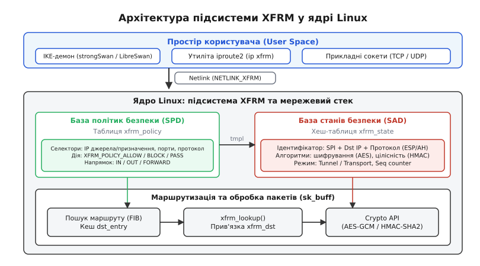
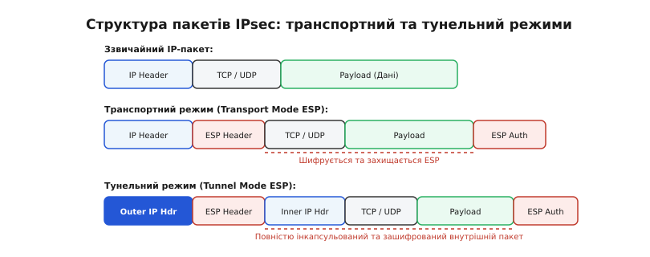
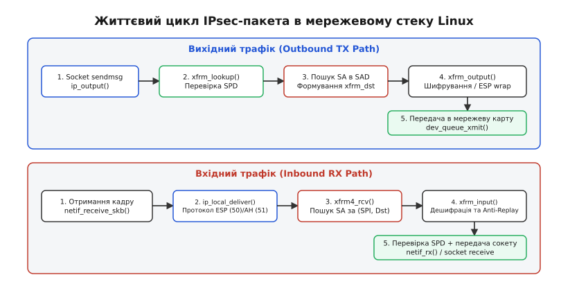

# IPsec у Linux: каркас перетворень xfrm

<preknowlist>
- [Таблиця маршрутів і рішення про маршрут](topic:sys-unix/routing-decision) — роль dst_entry, протокольних кешів та вибору вихідного мережевого інтерфейсу.
- [netfilter: ланцюги, таблиці й NAT](topic:sys-unix/netfilter-model) — точка входу хуків ядра при обробці вхідних та вихідних мережевих пакетів.
</preknowlist>

Передача мережевих пакетів через публічні або незахищені транзитні мережі виставляє вміст IP-кадрів і заголовки транспортного рівня під загрозу перехоплення та модифікації на кожному проміжному маршрутизаторі. Захист з'єднань на рівні додатків за допомогою TLS або SSH вимагає підтримки криптографії у кожній окремій програмі й не здатен захистити некомутовані протоколи на кшталт ICMP, GRE чи SCTP. Коли виникає потреба прозоро зашифрувати весь мережевий трафік між двома підмережами або хостами без перебудови прикладного ПЗ, захист переноситься безпосередньо на 3-й рівень моделі OSI. Саме для цього призначений стек протоколів IPsec (*Internet Protocol Security*).

У ядрі Linux реалізація IPsec відмовилася від концепції повільних віртуальних мережевих пристроїв на користь високопродуктивного архітектурного каркаса **XFRM** (скорочення від англійського *transform* — перетворення). XFRM інтегрує криптографічні операції безпосередньо в підсистему маршрутизації та кєш вихідних шляхів ядра, забезпечуючи мінімальні накладні витрати CPU та прозору обробку пакетів.

📜 [Історія переходу від KLIPS та FreeS/WAN до XFRM](topic:sys-unix/ipsec-xfrm/hist-freeswan-to-xfrm.md)

## 1. Архітектурне розділення: Політики (SP) проти Станів (SA)

Фундаментальним рішенням у дизайні специфікації IPsec (RFC 4301) та його реалізації XFRM у Linux є чітке розділення підсистеми на дві незалежні бази даних: базу політик безпеки (SPD — *Security Policy Database*) та базу станів безпеки (SAD — *Security Association Database*).

```
   Пакет у ядрі ──► [ Пошук у SPD ] ──(Знайдено шаблон)──► [ Пошук у SAD ] ──► [ Шифрування ESP ]
                        │                                      │
                 (Немає політики)                        (SA відсутня)
                        ▼                                      ▼
                 Пропустити як є                     Запити IKE до daemon
```

### Політика безпеки (Security Policy, SP)

Політика безпеки відповідає на запитання: **«Який саме трафік потрібно захищати і що саме з ним зробити?»**.

Політики зберігаються в базі SPD ядра Linux (`struct xfrm_policy`) і перевіряються для кожного пакета, що проходить крізь мережевий стек. Політика визначається **селектором трафіку** (*traffic selector*), до якого належать:
- IP-адреси або CIDR-підмережі джерела та призначення (наприклад, `10.0.1.0/24` -> `10.0.2.0/24`).
- Протокол транспортного рівня (TCP, UDP, ICMP або 0 для всіх протоколів).
- Порти джерела та призначення (для TCP/UDP).
- Напрямок руху пакета (`dir`): `in` (вхідний), `out` (вихідний) або `fwd` (транзитний/маршрутизований).

Кожна політика має чітко визначену дію (`action`):
- `action allow` (захистити): пакет має бути переданий підсистемі XFRM для криптографічного перетворення згідно з вказаним шаблоном (`tmpl`).
- `action block` (відкинути): пакет відкидається ядром без відправки ICMP-повідомлень.
- `action pass` (пропустити): пакет пропускається через мережевий стек у відкритому вигляді без IPsec-перетворень.

### Стан безпеки (Security Association, SA)

Стан безпеки відповідає на запитання: **«Якими ключами, алгоритмами та параметрами захищати трафік?»**.

SA є односпрямованим (*unidirectional*) криптографічним з'єднанням. Це означає, що для забезпечення двостороннього безпечного обміну між двома вузлами у ядрі завжди створюється щонайменше два стани SA — один для вихідного трафіку (TX), другий для вхідного (RX).

Об'єкти SA зберігаються у базі даних SAD ядра (`struct xfrm_state`) і унікально ідентифікуються трійкою параметрів:
1. **SPI (Security Parameter Index)**: 32-бітне число у заголовку IPsec, що слугує унікальним маркувальником криптографічного контексту.
2. **IP-адреса призначення** (Destination IP): вихідний або вхідний вузол тунелю.
3. **Протокол безпеки**: ESP (`IPPROTO_ESP`, 50) або AH (`IPPROTO_AH`, 51).

Всередині запису `struct xfrm_state` містяться:
- Симетричні ключі та назви алгоритмів шифрування (наприклад, `cbc(aes)`, `gcm(aes)`) та цілісності (наприклад, `hmac(sha256)`).
- Режим роботи (транспортний або тунельний).
- Поточні лічильники послідовних номерів пакетів (*Sequence Numbers*) та параметри вікна Anti-Replay для захисту від атак повторного відтворення.
- Обмеження часу життя SA (*lifetime*): максимальна кількість переданих байтів, пакетів або секунд дії ключа, після досягнення яких ядро генерує виклик до демона обміну ключами для проведення процедури *rekeying*.


*Архітектурне розділення між простором користувача, демонами IKE, базами даних SPD/SAD та мережевим стеком ядра Linux.*

## 2. Протоколи AH, ESP та режими інкапсуляції

Підсистема XFRM підтримує два основні протоколи специфікації IPsec, які визначають рівень криптографічного захисту кадру:

1. **AH (Authentication Header, IPproto 51)**: Забезпечує автентифікацію джерела даних та перевірку цілісності пакета за допомогою значень HMAC. Заголовок AH захищає як корисне навантаження, так і незмінні поля зовнішнього IP-заголовка. **AH не шифрує дані** — весь трафік передається у відкритому вигляді. Через те, що AH підписує поля IP-заголовка (зокрема IP-адреси), він принципово несумісний із механізмами трансляції мережевих адрес (NAT).
2. **ESP (Encapsulating Security Payload, IPproto 50)**: Забезпечує конфіденційність (шифрування), автентифікацію джерела та цілісність даних. У сучасних мережах використовується майже виключно ESP, особливо у поєднанні з суміщеними криптографічними режимами автентифікованого шифрування AEAD (*Authenticated Encryption with Associated Data*), такими як AES-GCM або ChaCha20-Poly1305.

### Транспортний та тунельний режими

Залежно від конфігурації SA, перетворення кадру XFRM виконується у транспортному або тунельному режимі.

```
Звичайний IP-пакет:
┌───────────┬───────────┬──────────────────────┐
│ IP Header │ TCP / UDP │ Payload              │
└───────────┴───────────┴──────────────────────┘

Транспортний режим (Transport Mode):
┌───────────┬────────────┬───────────┬─────────┬─────────────┬──────────┐
│ IP Header │ ESP Header │ TCP / UDP │ Payload │ ESP Trailer │ ESP Auth │
└───────────┴────────────┴───────────┴─────────┴─────────────┴──────────┘
                         └─────────────────────┘
                          Шифрується та захищається

Тунельний режим (Tunnel Mode):
┌──────────────┬────────────┬───────────┬───────────┬─────────┬─────────────┬──────────┐
│ New Outer IP │ ESP Header │ Inner IP  │ TCP / UDP │ Payload │ ESP Trailer │ ESP Auth │
└──────────────┴────────────┴───────────┴───────────┴─────────┴─────────────┴──────────┘
                            └─────────────────────────────────┘
                             Повністю інкапсульований і зашифрований
```

- **Транспортний режим (Transport Mode)**: Захищає лише корисне навантаження IP-пакета (верхній рівень TCP/UDP). Оригінальний IP-заголовок зберігається, а заголовок ESP вставляється між IP-заголовком та транспортним рівнем. Застосовується для прямого захищеного зв'язку між двома конкретними кінцевими хостами (*host-to-host*).
- **Тунельний режим (Tunnel Mode)**: Захищає весь оригінальний IP-пакет повністю. Оригінальний пакет (разом із внутрішнім IP-заголовком) зашифровується, до нього додаються причіпні поля ESP, після чого створюється **новий зовнішній IP-заголовок** (*Outer IP Header*), адреси якого відповідають кінцевим точкам IPsec-тунелю (VPN-шлюзам). Використовується для об'єднання мереж (*site-to-site*) або підключення віддалених клієнтів до корпоративної мережі (*host-to-network*).


*Розміщення заголовків ESP, внутрішніх і зовнішніх IP-пакетів у транспортному та тунельному режимах.*

## 3. Внутрішні структури ядра: xfrm_policy, xfrm_state та xfrm_dst

У вихідному коді ядра Linux підсистема XFRM реалізована в каталозі `net/xfrm/` та заголовкових файлах `<net/xfrm.h>`. Ключовими структурами даних є:

### Структура `struct xfrm_policy`

Об'єкт політики зберігається у зв'язаних списках та хеш-таблицях бази SPD, розділених за напрямками (`XFRM_POLICY_IN`, `XFRM_POLICY_OUT`, `XFRM_POLICY_FWD`):

```c
struct xfrm_policy {
    struct sibling_node     bydst;      /* Вузол хеш-таблиці за адресою призначення */
    struct hlist_node       byidx;      /* Пошуковий вузол за унікальним індексом */
    const struct net       *net;        /* Мережевий простір імен (netns) */
    u32                     index;      /* Індекс політики */
    u8                      type;       /* Тип політики (XFRM_POLICY_TYPE_MAIN) */
    u8                      action;     /* XFRM_POLICY_ALLOW / BLOCK */
    u16                     flags;      /* Прапорці конфігурації */
    u32                     priority;   /* Пріоритет (числове значення) */
    struct xfrm_selector    selector;   /* Селектор фільтрації трафіку */
    struct xfrm_lifetime_cfg lft;       /* Межі часу життя */
    struct xfrm_lifetime_cur curlft;    /* Поточна статистика */
    u16                     xfrm_nr;    /* Кількість шаблонів у ланцюжку */
    struct xfrm_tmpl        xfrm_vec[XFRM_MAX_DEPTH]; /* Шаблони необхідних SA */
};
```

Коли політика відповідає вихідному пакету, масив шаблонів `xfrm_vec` вказує ядра, які саме типи SA (наприклад, спершу IPComp для стиснення, потім ESP для шифрування) мають бути застосовані.

### Структура `struct xfrm_state`

Об'єкти станів зберігаються у хеш-таблицях SAD, індексованих за адресою призначення, SPI та протоколом:

```c
struct xfrm_state {
    possible_net_t          xs_net;
    union {
        struct hlist_node   gstate_node;
        struct hlist_node   state_hlist;
    };
    struct xfrm_id          id;         /* Dst IP, SPI, Proto */
    struct xfrm_selector    sel;        /* Селектор прив'язки */
    xfrm_address_t          saddr;      /* Src IP */
    
    struct xfrm_lifetime_cfg lft;
    struct xfrm_lifetime_cur curlft;
    struct xfrm_stats       stats;

    /* Криптографічні трансформатори Crypto API */
    struct crypto_aead     *aead;       /* Алгоритм AEAD (наприклад, AES-GCM) */
    struct crypto_ahash    *aalg;       /* Алгоритм HMAC */
    struct crypto_skcipher *ealg;       /* Алгоритм блочного шифрування */

    const struct xfrm_mode *inner_mode; /* Внутрішній режим обробки */
    const struct xfrm_mode *outer_mode; /* Зовнішній режим обробки */

    u32                     reqid;      /* Ідентифікатор зв'язку з SP */
    u32                     seq;        /* Лічильник послідовності пакета */
    struct xfrm_replay_state replay;    /* Стан захисту від повторів */
};
```

### Розширення кєшу маршрутизації: `struct xfrm_dst`

Щоб уникнути повторного пошуку політик безпеки для кожного вихідного пакета, ядро Linux розширює стандартну структуру кєшу маршрутизації `struct dst_entry` спеціальною обгорткою `struct xfrm_dst`:

```c
struct xfrm_dst {
    union {
        struct dst_entry    dst;
        struct xfrm_dst    *next;
    };
    struct dst_entry       *route;      /* Реальний вихідний маршрут фізичного пристрою */
    struct xfrm_policy     *policy;     /* Відповідна політика XFRM */
    struct xfrm_state      *xfrm_genid;
    u32                     xfrm_nr;    /* Кількість вкладених перетворень */
};
```

Поле `dst.output` у структурі `xfrm_dst` перевстановлюється на спеціальну функцію ядра `xfrm_output()`. Завдяки цьому підсистема маршрутизації викликає шифрування XFRM атомарно під час ззвичайного відправлення пакета, без додаткових викликів netfilter чи перемикання контексту.

## 4. Життєвий цикл пакета в ядрі (Egress та Ingress)

Проходження каду крізь підсистему XFRM у ядрі Linux має чітко розмежовані траєкторії для вихідного (TX) та вхідного (RX) трафіку.

```
Вихідний трафік (TX Egress):
App socket ──► ip_output() ──► xfrm_lookup() ──(SPD Match)──► xfrm_output() ──► Crypto API ──► dev_queue_xmit()

Вхідний трафік (RX Ingress):
netif_receive_skb() ──► ip_local_deliver() ──► xfrm4_rcv() ──► xfrm_input() ──► Decrypt & Replay ──► Socket delivery
```

### Траєкторія вихідного трафіку (Egress TX Path)

1. **Ініціалізація пакета**: Прикладна програма надсилає дані через сокет (наприклад, викликом `sendmsg()`). Ядро формує системний буфер пакета `sk_buff` і передає його до функції маршрутизації `ip_output()`.
2. **Консультація з SPD (`xfrm_lookup`)**: Після проведення стандартоного пошуку маршруту в таблиці FIB ядро викликає функцію `xfrm_lookup()`. Ця функція перевіряє селектори бази даних SPD (`struct xfrm_policy`).
3. **Формування `xfrm_dst`**: Якщо підхожа політика знайдена, ядро за допомогою її шаблонів знаходить відповідний запис SA у базі SAD. Створюється об'єкт `struct xfrm_dst`, який підміняє стандартний запис `dst_entry` у `sk_buff`.
4. **Обробка та шифрування (`xfrm_output`)**: Функція `ip_output()` викликає вказівник `dst->output()`, який тепер вказує на `xfrm_output()`.
5. **Інкапсуляція ESP**: Функція `xfrm_output()` дописує необхідний заголовок ESP, ініціалізує 32-бітне поле SPI та лічильник послідовності (*Sequence Number*), після чого викликає підсистему Linux Crypto API для виконання асинхронного шифрування блоків даних.
6. **Відправка у мережевий пристрій**: Після завершення шифрування та обчислення дайджесту HMAC оригінальний маршрут `xfrm_dst->route` використовується для передачі пакета драйверу реальної мережевої карти за допомогою `dev_queue_xmit()`.

### Траєкторія вхідного трафіку (Ingress RX Path)

1. **Отримання кадру**: Мережева карта отримує кадр і передає його до ядра через `netif_receive_skb()`.
2. **Визначення IPsec-протоколу**: Мережевий стек IPv4/IPv6 аналізує заголовок IP. Якщо заголовок містить номер протоколу `IPPROTO_ESP` (50) або `IPPROTO_AH` (51), стек передає буфер `sk_buff` обробнику підсистеми XFRM — функціям `xfrm4_rcv()` або `xfrm6_rcv()`.
3. **Пошук SA в SAD**: Функція `xfrm4_rcv()` зчитає 32-бітний SPI із заголовка ESP і проводить швидкий пошук у хеш-таблиці SAD за трійкою `(SPI, Dst_IP, IPPROTO_ESP)`.
4. **Дешифрація та Anti-Replay (`xfrm_input`)**: Знайдений стан `struct xfrm_state` передається функції `xfrm_input()`. Підсистема перевіряє порядковий номер пакета на належність до ковзного вікна захисту від повторів (*Anti-Replay Window*). Якщо пакет новіший за ліву межу вікна і ще не отримувався, Crypto API дешифрує payload та перевіряє підпис цілісності.
5. **Зняття заголовків та перевірка SPD**: Заголовок ESP видаляється з пакета (`skb_pull`), а внутрішній IP-пакет відновлюється. Ядро повторно перевіряє розшифрований пакет проти баз політик SPD (напрямок `dir = in`), щоб переконатися, що розшифрований вміст дійсно відповідає дозволеному селекторові політики.
6. **Передача сокету**: Очищений від криптографічних обгорток пакет повторно передається до мережевого стеку ядра для доставки прикладному сокету через `ip_local_deliver()`.


*Послідовність обробки вихідного (TX) та вхідного (RX) трафіку підсистемою XFRM.*

## 5. Захист від повторів (Anti-Replay) та розширені послідовні номери (ESN)

Одним із головних завдань IPsec є запобігання атакам повторного відтворення (*replay attacks*), у яких зловмисник перехоплює легітимний зашифрований пакет (наприклад, банківський транзакційний запит) і надсилає його в мережу повторно.

Підсистема XFRM реалізує механізм **Anti-Replay Window** у кожному записі `struct xfrm_state`. 

```
Ліва межа (seq - window_size)                        Права межа (seq_max)
───────────────┬─────────────────────────────────────────────┬─────────────►
               │       Бітова маска вікна (Bitmap)            │  Нові номери
               │   11010111 00111101 11111111 11111111      │   (Приймаються)
               └─────────────────────────────────────────────┘
  Дублікати старіші                                 Дублікати всередині вікна
  за ліву межу                                      (Перевіряються за маскою)
  (Відкидаються)
```

Механізм функціонує за такими правилами:
1. Кожен вихідний пакет отримує монотонно зростаючий 32-бітний серійний номер `seq` у заголовку ESP.
2. Приймач підтримує лічильник найвищого отриманого номера `seq_max` та бітову маску вікна розміром 32, 64 або більше бітів.
3. Якщо отриманий пакет має номер, більший за `seq_max`, він приймається, дешифрується, і вікно зсувається вправо.
4. Якщо пакет потрапляє всередину вікна, ядро перевіряє відповідний біт у масці. Якщо біт дорівнює `1` (пакет з таким номером вже приходив), пакет негайно відкидається як дублікат, а лічильник `XfrmInReplayError` у статистиці `/proc/net/xfrm_stat` збільшується.
5. Пакети, чий номер менший за ліву межу вікна, відкидаються без перевірки криптографії.

У високошвидкісних мережах (10 Gbps+) 32-бітний лічильник `seq` може переповнитися всього за декілька хвилин передачі. Для вирішення цієї проблеми підсистема XFRM підтримує **ESN (Extended Sequence Numbers)** за специфікацією RFC 4304. ESN використовує 64-бітний лічильник послідовності, де верхні 32 біти беруть участь у розрахунку підпису цілісності HMAC, але не передаються по мережі, що гарантує захист від переповнення протягом багатьох років роботи тунелю.

## 6. Практичне керування: iproute2 та сокети Netlink

Основною утилітою адміністрування підсистеми XFRM у просторі користувача є пакет `iproute2` (підкоманди `ip xfrm state` та `ip xfrm policy`).

### Перегляд та ручне налаштування станів SAD

Для перегляду поточних зареєстрованих станів безпеки виконується команда:

```bash
ip xfrm state list
```

Приклад виводу стану для ESP-тунелю:

```text
src 192.168.1.1 dst 192.168.2.1
        proto esp spi 0x00001000 reqid 100 mode tunnel
        replay-window 32 flag af-unspec
        auth-trunc hmac(sha256) 0xaa... 128
        enc cbc(aes) 0x0123456789abcdef...
        anti-replay context: seq 0x0, oseq 0x42, bitmap 0x00000000
        lifetime config:
          limit: soft (bytes=unlimited, packets=unlimited)
          limit: hard (bytes=unlimited, packets=unlimited)
```

Для створення стану вручну за допомогою `iproute2`:

```bash
ip xfrm state add src 192.168.1.1 dst 192.168.2.1 \
    proto esp spi 0x1000 reqid 100 mode tunnel \
    enc "cbc(aes)" 0x0123456789abcdef0123456789abcdef \
    auth "hmac(sha256)" 0xaaaaaaaaaaaaaaaaaaaaaaaaaaaaaaaaaaaaaaaaaaaaaaaaaaaaaaaaaaaaaaaa
```

### Створення політики в SPD

Додавання вихідної політики для захисту трафіку між підмережами `10.0.1.0/24` та `10.0.2.0/24`:

```bash
ip xfrm policy add src 10.0.1.0/24 dst 10.0.2.0/24 dir out \
    tmpl src 192.168.1.1 dst 192.168.2.1 proto esp reqid 100 mode tunnel
```

Незважаючи на зручність утиліти `ip`, у виробничих середовищах ручне створення станів не застосовується, оскільки криптографічні ключі вимагають періодичного автоматичного оновлення. Демони обміну ключами протоколу IKEv2 (такі як **strongSwan** або **LibreSwan**) взаємодіють з ядром напряму через системний бінарний інтерфейс сокетів Netlink (`NETLINK_XFRM`).

📋 [Інтерфейс сокетів Netlink XFRM](topic:sys-unix/ipsec-xfrm/api-netlink-xfrm.md)

⚙️ [Програмування станів та політик XFRM через Netlink](topic:sys-unix/ipsec-xfrm/proj-xfrm-netlink-setup.md)

## 7. Інтерфейси XFRM (xfrm0) проти класичного підходу VTI

Історично в Linux існувало два підходи до організації IPsec VPN:

1. **Policy-based IPsec (Класичний XFRM)**: Мережеві інтерфейси взагалі не створюються. Трафік маршрутизується за стандартними таблицями IP, а шифрування здійснюється прозоро, коли селектор пакета збігається з політикою SPD. Головний недолік: неможливо застосовувати класичні інструменти маршрутизації (такі як BGP/OSPF демони `frr`, політики `iptables` за іменем інтерфейсу чи правила точної маршрутизації `ip rule`).
2. **Route-based IPsec через VTI (Virtual Tunnel Interface)**: Створюється віртуальний пристрій `vti0` (`ip link add type vti ...`). Трафік явним чином спрямовується в цей інтерфейс командою `ip route add`. Пристрій VTI автоматично зв'язується з маркованими політиками XFRM. Недолік VTI: обмежена підтримка мультипротокольного трафіку (наприклад, IPv6 через IPv4 тунель вимагає окремих пристроїв `vti6`).

### Сучасний рішення: Інтерфейси XFRM (`xfrm0` / XFRM-I)

У ядрі Linux 4.19 було представлено новий тип віртуальних мережевих пристроїв — **XFRM Interfaces (XFRM-I)**. Вони поєднують переваги обох підходів:

```bash
# Створення XFRM-інтерфейсу з ідентифікатором dev_id 42
ip link add type xfrm dev xfrm0 dev-id 42
ip link set dev xfrm0 up
ip addr add 10.255.255.1/30 dev xfrm0

# Додавання політики, прив'язаної до dev-id інтерфейсу
ip xfrm policy add src 10.0.1.0/24 dst 10.0.2.0/24 dir out if_id 42 \
    tmpl src 192.168.1.1 dst 192.168.2.1 proto esp mode tunnel
```

Пристрій `xfrm0` є віртуальною обгорткою над базовим каркасом XFRM. Коли пакет надсилається у пристрій `xfrm0`, ядро автоматично присвоює йому `if_id = 42` і передає до звичайного пошуку XFRM. Це дозволяє легко налаштовувати динамічну маршрутизацію (BGP/OSPF) через IPsec-тунелі, бачити лічильники пакетів у `ifconfig`/`ip -s link`, та проводити захоплення зашифрованого та розшифрованого трафіку у `tcpdump`.

## 8. Взаємодія з Netfilter та таблицями системних лічильників

Обробка зашифрованих пакетів у мережевому стеку Linux перетинається з фільтром пакетів Netfilter (`iptables`/`nftables`). Системному розробнику важливо розуміти порядок проходження хуків:

1. **Вхідний трафік (RX)**:
   - Зовнішній зашифрований ESP-пакет спершу проходить хук Netfilter `PREROUTING`. На цьому етапі підсистема `conntrack` бачить пакет із протоколом 50 (ESP) та IP-адресами тунелю.
   - Пакет потрапляє до обробника `xfrm4_rcv()`, розшифровується, і внутрішній дешифрований IP-пакет повторно впорскується у стек.
   - Розшифрований пакет повторно проходить хук `PREROUTING` та `INPUT` (або `FORWARD`). На цьому другому проході `conntrack` і `nftables` бачать вже оригінальні адреси внутрішнього трафіку (наприклад, TCP порт 80).
2. **Аналіз статистики у `/proc/net/xfrm_stat`**:
   При появі мережевих збоїв ядро веде детальний облік лічильників відкинутих пакетів у псевдофайлі `/proc/net/xfrm_stat`:
   - `XfrmInError`: Загальна кількість помилок обробки вхідних пакетів.
   - `XfrmInStateInvalid`: Запити, для яких у SAD не знайдено валідного стану.
   - `XfrmInNoStates`: Відсутність SA у SAD для вхідного SPI.
   - `XfrmInReplayError`: Спроба повторного надсилання пакета (дублікат у вікні Anti-Replay).
   - `XfrmOutNoStates`: Спроба відправити вихідний трафік, під який політика існує, а стан SA у SAD ще не створено.

## 9. 🔧 Навіщо це в реальній розробці

Розуміння внутрішньої роботи підсистеми XFRM є критично важливим під час налагодження мережевих збоїв, оптимізації продуктивності VPN-шлюзів та створення хмарних мережевих топологій.

### 1. Налагодження збоїв за допомогою `ip xfrm monitor` та tcpdump

Типова проблема при розгортанні IPsec: пакети зникають без видимих помилок у логах демона IKE. Двома головними інструментами діагностики є:

- **Монітор подій ядра**: Команда `ip xfrm monitor` слухає події Netlink ядра і миттєво відображає зникнення станів, досягнення лічильників часу життя або помилки перевірки Anti-Replay:

```bash
ip xfrm monitor
```

- **Захоплення трафіку через tcpdump**: Слід пам'ятати, що під час звичайного захоплення на фізичному інтерфейсі `eth0` інструмент `tcpdump` бачить виключно зашифровані ESP-пакети (IPproto 50). Щоб побачити розшифрований вміст внутрішніх пакетів до шифрування та після дешифрації, у сучасних системах створюють інтерфейси `xfrm0` і виконують аналіз безпосередньо на них:

```bash
tcpdump -i xfrm0 -n icmp
```

### 2. Проблема MTU, Path MTU Discovery та MSS Clamping

Інкапсуляція ESP в тунельному режимі додає до кожного пакета значний криптографічний оверхед:
- Зовнішній IP-заголовок (20 байтів для IPv4 або 40 байтів для IPv6).
- Заголовок ESP (8 байтів: SPI + Sequence Number).
- Ініціалізаційний вектор IV (наприклад, 8 або 16 байтів для AES-GCM/AES-CBC).
- Причіпні поля ESP Trailer, вирівнювання блоків шифру та дайджест автентифікації ICV (12–16 байтів).

Загальні накладні витрати IPsec можуть становити від 52 до 72 байтів на кожен пакет. Якщо стандартне MTU мережі дорівнює 1500 байтів, максимальний розмір внутрішнього кадру скорочується приблизно до 1428 байтів.

Якщо вихідний хост надсилає IP-пакети розміром 1500 байтів із встановленим прапорцем DF (*Don't Fragment*), ядро змушене відкидати їх і повертати ICMP-повідомлення `Fragmentation Needed`. У разі наявності фаєрволів, що блокують ICMP, виникає синдром **IPsec Blackhole** (з'єднання TCP "залипає" під час передачі великих обсягів даних).

**Рішення проблеми у продакшн**:
Застосування примусового обмеження розміру TCP-сегмента (*MSS Clamping*) за допомогою `nftables` або `iptables`:

```bash
nft add rule inet filter forward oifname "xfrm0" tcp flags syn tcp option maxseg size set 1360
```

### 3. Апаратне прискорення Crypto API та XFRM Offload

На високошвидкісних каналах (10–100 Gbps) шифрування кожного пакета центральним процесором стає вузьким місцем. Підсистема XFRM підтримує два рівні прискорення:

1. **Інструкції CPU (AES-NI / ARMv8 Crypto)**: Ядро Linux автоматично обирає прискорені векторні реалізації з підсистеми Crypto API (модулі `aesni_intel`, `ghash_clmulni_intel`), зменшуючи навантаження на процесор у рази.
2. **Full SmartNIC Offload (`XFRM_OFFLOAD`)**: Сучасні мережеві карти (наприклад, Mellanox ConnectX або Intel E810) підтримують повне вивантаження криптографії IPsec в апаратні ASIC карти. У цьому випадку бази SAD і ключі передаються у драйвер мережевої карти, і шифрування/дешифрація ESP виконується безпосередньо на чіпі NIC зі швидкістю фізичної лінії (*line rate*).
