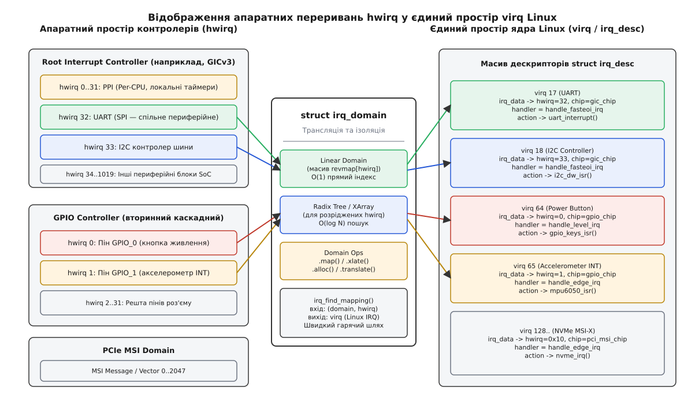
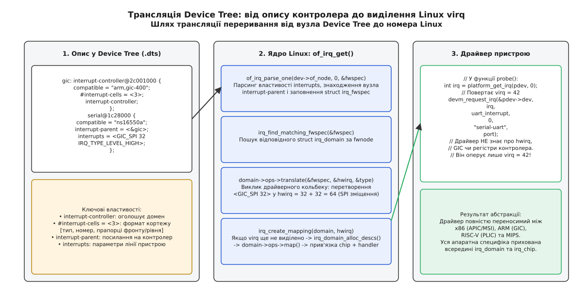
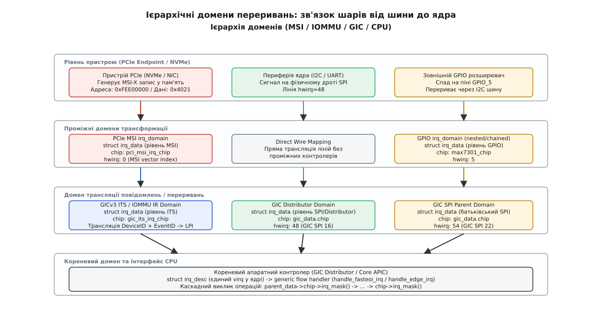
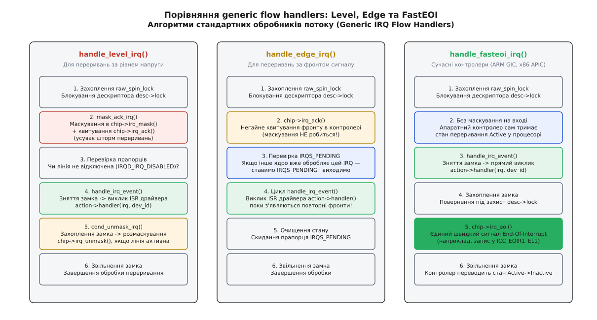

# Контролер переривань: irqchip, irq_domain і шлях від hwirq до номера Linux

<preknowlist>
* [Обробка переривань та нижні половини](root:sys-unix/interrupts-bottom-halves) — базові поняття про контекст hardirq, вектори та відкладену обробку
* [Дерево пристроїв (Device Tree)](root:sys-unix/device-tree) — опис апаратних вузлів, властивостей `#interrupt-cells` та прив'язок до контролерів
* [Таблиці та простір імен ACPI](root:sys-unix/acpi-tables-and-namespace) — статичні таблиці MADT та опис ліній GSI на платформах x86/ARM
</preknowlist>

Коли зовнішній периферійний пристрій змінює стан своєї фізичної лінії переривання або надсилає пакет транзакції на шині PCI Express, центральний процесор призупиняє виконання поточного потоку інструкцій і передає керування в ядро операційної системи. Для розробника драйвера периферійного пристрою цей складний апаратний шлях повністю схований за одним системним викликом `request_threaded_irq()`, якому передається цілочисельний номер переривання. Проте за цим простим числом стоїть багаторівнева програмно-апаратна підсистема ядра Linux, яка зв'язує фізичні електричні сигнали, контролери різної схемотехнічної складності та логічні обробники ядра.

Головними будівельними блоками цієї підсистеми є структури `struct irq_chip`, `struct irq_domain` та диспетчери потоку (*Generic IRQ Flow Handlers*). Вони забезпечують прозору трансляцію локальних апаратних адрес у глобальний номерний простір ядра Linux, повністю ізолюючи драйвери обладнання від тонкощів фізичної топології та схемотехніки процесорної платформи.

## 1. Проблема трансляції: розрив між апаратним номером (hwirq) та номером ядра Linux (virq)

Будь-який апаратний контролер переривань оперує власними локальними номерами фізичних ліній введення або номерами векторів повідомлень. Наприклад:
- Первинний контролер архітектури ARM GIC (*Generic Interrupt Controller*) розрізняє власні лінії як SPI (*Shared Peripheral Interrupt*) з апаратними номерами від 32 до 1019, локальні процесорні PPI (*Private Peripheral Interrupt*) від 16 до 31, та програмно генеровані SGI (*Software Generated Interrupt*) від 0 до 15.
- Контролер портів введення-виведення GPIO на кристалі системи на кристалі (*SoC*) нумерує власні контакти від 0 до 31.
- Мережевий адаптер або твердотільний накопичувач NVMe на шині PCI Express генерує повідомлення MSI-X (*Message Signaled Interrupts*), кожне з яких містить індекс повідомлення від 0 до 2047.

Якщо система містить кілька однакових блоків GPIO та десяток PCIe-пристроїв, апаратні номери неминуче конфліктуватимуть: пін 5 першого контролера GPIO, пін 5 другого контролера GPIO та вектор 5 мережевої карти мають абсолютно однакове апаратне число `hwirq = 5`, проте представляють фізично незалежні джерела сигналів.

```
+-------------------------------------------------------------------------+
|                       Драйвери периферійних пристроїв                   |
|           (gpio-keys, nvme, eth0) оперують лише віртуальними virq       |
+------------------------------------+------------------------------------+
                                     |
                                     v
+-------------------------------------------------------------------------+
|                  Глобальний простір номерів Linux (virq)                |
|       virq = 42                        virq = 87            virq = 104  |
+-----------+--------------------------------+---------------------+------+
            |                                |                     |
     [Linear Domain]                  [Radix Domain]        [Linear Domain]
            |                                |                     |
            v                                v                     v
+-----------------------+        +----------------------+ +---------------+
|  ARM GIC Controller   |        |  PCIe MSI Controller | |  GPIO Block 0 |
|      hwirq = 74       |        |     hwirq = 2048     | |   hwirq = 12  |
+-----------------------+        +----------------------+ +---------------+
```
*Рис. 1. Принцип розділення локальних апаратних номерів (hwirq) та єдиного простору Linux (virq)*

Для вирішення цієї фундаментальної проблеми підсистема переривань Linux чітко розмежовує два поняття:
- **`hwirq` (*Hardware IRQ Number*):** Локальний фізичний номер лінії або вектора всередині конкретного апаратного контролера переривань. Цей номер має сенс лише для низькорівневого драйвера самого контролера.
- **`virq` (*Virtual Linux IRQ Number*):** Глобальний унікальний цілочисельний ідентифікатор у просторі ядра Linux. Саме його повертає підсистема зондування пристроїв (наприклад, функція `platform_get_irq()` для вузлів Device Tree або `pci_alloc_irq_vectors()` для пристроїв PCI), і саме цей номер драйвери передають у функції `request_threaded_irq()`, `free_irq()` та `disable_irq()`.

На фізичному рівні переривання можуть передаватися двома принципово різними шляхами:
1. **Виділені електричні лінії (Line-based Interrupts):** Фізичні провідники між пристроєм і контролером переривань. На старих шинах PCI застосовувалися чотири спільні лінії `INTA#..INTD#` з відкритим колектором, що вимагало розділення однієї лінії між кількома платами розширення (*Interrupt Sharing*).
2. **Переривання у вигляді повідомлень у пам'ять (MSI / MSI-X):** Периферійний пристрій записує спеціальне 32-бітне значення (*Data Payload*) за визначеною адресою в системній пам'яті (*Message Address*). Контролер хосту або IOMMU перехоплює цей запис на системній шині і транслює його у внутрішній вектор контролера переривань процесора. Це усуває потребу у фізичних провідниках та виключає накладні витрати на спільні лінії.

Історично ядро Linux використовувало жорсткі константи та монолітні статичні масиви для відображення номерів, що стало головною перешкодою для масштабування з появою складних багатоядерних SoC та тисяч векторів MSI. Детальний аналіз переходу від статичних масивів до сучасної динамічної моделі наведено в історичній вставці [root:unix-linux/irq-chip-and-domain/hist-sparse-irq-and-domains.md](root:sys-unix/irq-chip-and-domain/hist-sparse-irq-and-domains.md).


*Архітектура відображення апаратних ліній переривань у віртуальні дескриптори ядра Linux*

## 2. Ядро підсистеми: структури struct irq_desc та struct irq_data

Центральною структурою даних для кожного віртуального номера переривання в ядрі є `struct irq_desc` (дескриптор переривання). Вона містить повний стан лінії, лічильники подій, механізми синхронізації та вказівник на зареєстровані драйверами обробники дій `struct irqaction`.

Коли вмикається опція ядра `CONFIG_SPARSE_IRQ`, ядро відмовляється від монолітного статичного масиву `irq_desc[NR_IRQS]` на користь динамічного розрідженого Radix-дерева. Дескриптори виділяються з динамічної пам'яті за вимогою, коли пристрій запитує створення відображення:

```c
struct irq_desc {
    struct irq_common_data  irq_common_data;
    struct irq_data         irq_data;
    unsigned int __percpu  *kstat_irqs;     /* Статистика спрацьовувань по ядрах */
    irq_flow_handler_t      handle_irq;     /* Диспетчер високого рівня */
    struct irqaction       *action;         /* Ланцюжок зареєстрованих обробників */
    unsigned int            status_use_accessors;
    unsigned int            core_internal_state__do_not_mess_with_it;
    unsigned int            depth;          /* Лічильник маскування лінії */
    raw_spinlock_t          lock;           /* Захист стану лінії */
    struct cpumask         *percpu_enabled;
    const char             *name;
};
```

Усередині дескриптора виділено окрему структуру `struct irq_data`, яка містить контекст низькорівневої трансляції та посилання на апаратний чіп:

```c
struct irq_data {
    u32                     mask;
    unsigned int            irq;            /* Віртуальний номер virq */
    unsigned long           hwirq;          /* Апаратний номер hwirq */
    struct irq_common_data *common;
    struct irq_chip        *chip;           /* Методи керування апаратурою */
    struct irq_domain      *domain;         /* Домен трансляції номера */
    void                   *chip_data;      /* Приватні дані драйвера контролера */
};
```

Структура `struct irq_common_data` зберігає спільний стан, доступний на всіх рівнях ієрархії:
- `state_use_accessors`: набір бітових прапорців внутрішнього стану лінії (`IRQS_AUTODETECT`, `IRQS_SPURIOUS_DISABLED`, `IRQS_POLL_CRC`).
- `affinity`: поточна маска процесорних ядер `cpumask_var_t`, на які дозволено надсилати дане переривання.

Поле `depth` відстежує стан дозволу лінії: переривання вважається активним лише тоді, коли `depth == 0`. Кожен виклик `disable_irq()` збільшує лічильник `depth`, а виклик `enable_irq()` — зменшує. Це дозволяє безпечно вкладати виклики маскування з різних незалежних підсистем ядра без ризику передчасного увімкнення апаратного переривання.

Захист дескриптора забезпечується полем `lock` типу `raw_spinlock_t`. Усі операції модифікації стану лінії (маскування, зміна чутливості, підключення нових дій `struct irqaction`) виконуються з обов'язковим захопленням цього блокування та відключенням локальних переривань поточного процесорного ядра через `raw_spin_lock_irqsave()`.

Поле `kstat_irqs` виділяється як per-CPU змінна (`unsigned int __percpu *`). Кожне процесорне ядро збільшує власний локальний лічильник під час прийому сигналу без звернення до спільного кеш-рядка пам'яті, що виключає падіння продуктивності через конфлікти кешу (*Cache-Line Bouncing*) при інтенсивному потоці переривань на багатоядерних серверах.

## 3. Апаратна абстракція: структура struct irq_chip

Структура `struct irq_chip` визначає набір низькорівневих операцій для прямої взаємодії з регістрами контролера переривань. Ядро не знає деталей реалізації конкретної мікросхеми; воно викликає відповідні функціональні вказівники, коли виникає потреба змінити стан лінії або підтвердити прийом сигналу:

```c
struct irq_chip {
    const char  *name;
    void        (*irq_mask)(struct irq_data *data);
    void        (*irq_unmask)(struct irq_data *data);
    void        (*irq_ack)(struct irq_data *data);
    void        (*irq_eoi)(struct irq_data *data);
    int         (*irq_set_affinity)(struct irq_data *data,
                                    const struct cpumask *dest, bool force);
    int         (*irq_retrigger)(struct irq_data *data);
    int         (*irq_set_type)(struct irq_data *data, unsigned int flow_type);
    int         (*irq_set_wake)(struct irq_data *data, unsigned int on);
    void        (*irq_bus_lock)(struct irq_data *data);
    void        (*irq_bus_sync_unlock)(struct irq_data *data);
    unsigned long flags;
};
```

Повний довідковий опис усіх полів, прапорців та сигнатур зворотних викликів `struct irq_chip` наведено у довідковій вставці [root:unix-linux/irq-chip-and-domain/api-irq-domain-chip.md](root:sys-unix/irq-chip-and-domain/api-irq-domain-chip.md).

### Ключова різниця між irq_ack та irq_eoi

У підсистемі переривань Linux існує принципове розмежування методів `irq_ack` та `irq_eoi`, зумовлене схемотехнікою контролерів:
- **`irq_ack` (Acknowledge):** Викликається на самому початку обробки події (зазвичай для переривань за фронтом або простих засувок статусу). Метод скидає прапорець фіксації події в регістрі контролера (наприклад, через запис 1 у регістр статусу), щоб контролер міг зафіксувати наступний вхідний імпульс, поки процесор виконує ISR.
- **`irq_eoi` (End of Interrupt):** Викликається наприкінці обробки переривання (для сучасних контролерів зі стеком пріоритетів, таких як ARM GIC, Intel APIC або RISC-V PLIC). Під час прийому сигналу контролер автоматично знижує пріоритет поточної лінії або блокує лінії з меншим пріоритетом. Виклик `irq_eoi` повідомляє апаратурі, що процесор завершив роботу з цим перериванням, і відновлює стандартний арбітраж пріоритетів.

### Робота з енергозбереженням: irq_set_wake

Метод `irq_set_wake(data, on)` налаштовує здатність апаратної лінії пробуджувати процесор із глибоких станів сну (*Sleep / Suspend-to-RAM*). Коли система готується до сну, ядро вимикає більшість периферійних переривань, проте для ліній із прапорцем пробудження викликає `irq_set_wake(..., 1)`. Драйвер контролера програмує спеціальний блок апаратного пробудження (*Wake-Up Unit*), який залишається під напругою під час сну і генерує системний сигнал відновлення тактування при активності на відповідному контакті.

### Робота з повільними шинами: irq_bus_lock та irq_bus_sync_unlock

Якщо контролер переривань підключений через повільні шини I2C або SPI (наприклад, 16-бітний розширювач портів MCP23017), запис у регістри вимагає блокування потоку на час передачі повідомлення по шині. Оскільки функції `disable_irq()` або `irq_set_type()` можуть викликатися з жорсткого контексту hardirq, прямий запис по шині I2C призведе до паніки ядра.

Для таких мікросхем драйвер реалізує пару методів:
- `irq_bus_lock`: захоплює сплячий м'ютекс контролера `mutex_lock(&chip->bus_lock)`.
- Методи `irq_mask`/`irq_unmask`: лише модифікують локальну тіньову копію конфігураційних бітів у пам'яті ядра (`chip->shadow_mask`).
- `irq_bus_sync_unlock`: виконує реальну транзакцію запису змінених конфігураційних байтів по шині I2C/SPI і відпускає сплячий м'ютекс `mutex_unlock(&chip->bus_lock)`.

## 4. Моделі відображення: struct irq_domain

Домен переривань (`struct irq_domain`) інкапсулює простір апаратних номерів одного конкретного контролера та відповідає за створення і збереження відповідності `hwirq -> virq`.

```c
struct irq_domain {
    const struct irq_domain_ops *ops;
    void                        *host_data;
    unsigned int                 flags;
    irq_hw_number_t              hwirq_max;
    
    /* Зворотне відображення для швидкого пошуку virq за hwirq */
    unsigned int                 revmap_size;
    struct radix_tree_root       revmap_tree;
    unsigned int                 linear_revmap[];
};
```

Ядро надає чотири базові моделі зворотного відображення (*Reverse Mapping*):

1. **Лінійне відображення (Linear Domain — `irq_domain_add_linear`):**
   Використовує компактний масив `linear_revmap`, розмір якого фіксується під час створення домену. Пошук `virq = domain->linear_revmap[hwirq]` виконується за один такт процесора (`O(1)`). Це стандартний та найбільш ефективний вибір для всіх контролерів із фіксованим невеликим числом входів (GPIO, прості системні контролери до 512–1024 ліній).
2. **Деревовидне відображення (Tree / Radix Domain — `irq_domain_add_tree`):**
   Зберігає зв'язки у розрідженому Radix-дереві. Застосовується тоді, коли апаратні номери можуть приймати довільні великі значення (наприклад, 32-бітні ідентифікатори подій PCIe MSI-X або ARM GIC ITS Event ID), а загальна кількість одночасно активних переривань відносно невелика.
3. **Застаріле відображення (Legacy Domain — `irq_domain_add_legacy`):**
   Використовується для підтримки старого коду архітектур x86 та ARM, де номери `virq` жорстко зафіксовані з певного базового зсуву (наприклад, перші 16 переривань контролера ISA 8259A).
4. **Пряме відображення (No-Map Domain — `irq_domain_add_nomap`):**
   Екстремальний випадок, коли `virq` завжди точно дорівнює `hwirq`. Використовується лише на деяких специфічних архітектурах PowerPC і майже не зустрічається в сучасних драйверах.

Операції домену групуються в структурі `struct irq_domain_ops`:

```c
struct irq_domain_ops {
    int (*match)(struct irq_domain *d, struct device_node *node,
                 enum irq_domain_bus_token bus_token);
    int (*map)(struct irq_domain *d, unsigned int virq, irq_hw_number_t hw);
    void (*unmap)(struct irq_domain *d, unsigned int virq);
    int (*xlate)(struct irq_domain *d, struct device_node *node,
                 const u32 *intspec, unsigned int intsize,
                 unsigned long *out_hwirq, unsigned int *out_type);
    int (*alloc)(struct irq_domain *d, unsigned int virq,
                 unsigned int nr_irqs, void *arg);
    void (*free)(struct irq_domain *d, unsigned int virq, unsigned int nr_irqs);
};
```

### Життєвий цикл відображення: створення та пошук

Коли системі потрібно перетворити апаратну лінію у віртуальний номер ядра, виконується наступний алгоритм у функції `irq_create_mapping(domain, hwirq)`:
1. Викликається `irq_find_mapping(domain, hwirq)`. Якщо запис у `linear_revmap` або Radix-дереві вже присутній, функція негайно повертає наявний `virq`.
2. Якщо відображення немає, функція `irq_domain_alloc_descs()` виділяє новий вільний номер `virq` та створює дескриптор `struct irq_desc`.
3. Викликається метод зворотного зв'язку домену `domain->ops->map(domain, virq, hwirq)`.
4. Драйвер контролера всередині методу `map` ініціалізує дескриптор: встановлює чіп `irq_set_chip_and_handler(virq, &my_chip, handle_level_irq)` та зберігає приватний вказівник через `irq_set_chip_data(virq, my_data)`.
5. Ядро заносить зв'язок у таблицю зворотного пошуку: `domain->linear_revmap[hwirq] = virq`.
6. Новий номер `virq` повертається ініціатору запиту.

Коли пристрій вивантажується, функція `irq_dispose_mapping(virq)` очищує дескриптор, видаляє запис із таблиці зворотного пошуку домену та повертає `virq` у пул вільних номерів ядра.

## 5. Інтеграція з Device Tree та парсинг переривань

В архітектурах ARM, RISC-V, MIPS та PowerPC конфігурація апаратних ліній переривань описується в дереві пристроїв (*Device Tree*).


*Послідовність парсингу вузлів Device Tree та трансляція спеціфікаторів у virq*

Вузол, що представляє контролер переривань, містить властивість `interrupt-controller` та визначає кількість комірок для адресації однієї лінії через `#interrupt-cells`:

```dts
gic: interrupt-controller@2c001000 {
    compatible = "arm,cortex-a15-gic";
    #interrupt-cells = <3>;
    interrupt-controller;
    reg = <0x2c001000 0x1000>,
          <0x2c002000 0x2000>;
};

uart0: serial@1c090000 {
    compatible = "arm,pl011", "arm,primecell";
    reg = <0x1c090000 0x1000>;
    interrupt-parent = <&gic>;
    interrupts = <0 5 4>; /* 0: SPI, 5: номер лінії (hwirq=37), 4: IRQ_TYPE_LEVEL_HIGH */
};
```

Коли ядро завантажує платформений пристрій `uart0`, воно виконує наступну послідовність кроків:
1. Знаходить батьківський контролер переривань за посиланням `interrupt-parent = <&gic>`.
2. Знаходить зареєстрований `struct irq_domain`, який асоційований із вузлом `gic` (через метод `ops->match`).
3. Викликає метод трансляції `ops->xlate()` домену GIC, передаючи масив значень `<0 5 4>`. Метод `xlate` обчислює реальний апаратний номер `hwirq = 5 + 32 = 37` та витягує прапорець чутливості лінії `IRQ_TYPE_LEVEL_HIGH`.
4. Викликає функцію `irq_create_of_mapping()`, яка перевіряє наявність створеного відображення через `irq_find_mapping(domain, 37)`.
5. Якщо відображення ще немає, ядро виділяє новий вільний `virq`, викликає `irq_domain_ops->map()`, заповнює зворотну таблицю `revmap` і повертає готовий номер `virq` драйверу послідовного порту.

Для систем із PCI Express трансляція ускладнюється механізмом перетасовки ліній (*PCI INTx Swizzling*), де на мостах PCI властивості `interrupt-map` та `interrupt-map-mask` динамічно перенаправляють лінії `INTA#..INTD#` на різні входи батьківського GIC залежно від слота PCI та функції пристрою.

## 6. Ієрархічні домени переривань (Hierarchical IRQ Domains)

Сучасні серверні та мобільні платформи мають складні багаторівневі маршрути переривань. Наприклад, мережевий контролер генерує повідомлення MSI-X на шині PCI Express. Цей сигнал проходить через контролер перепризначення переривань IOMMU (*Interrupt Remapping Unit*), транслюється в подію контролера ARM GICv3 ITS (*Interrupt Translation Service*) і лише потім потрапляє до фізичного дистриб'ютора GIC та ядра CPU.


*Багаторівнева трансляція сигналів у системі з ієрархічними доменами переривань*

Для підтримки таких апаратних ланцюгів ядро Linux надає **ієрархічні домени переривань** (*Hierarchical IRQ Domains*). Замість створення каскадних програмних обробників кожен рівень домену відповідає за свою частину апаратної конфігурації:

- Домен створюється викликом `irq_domain_create_hierarchy(parent_domain, ...)`.
- Коли драйвер виділяє групу векторів, домен верхнього рівня викликає `irq_domain_alloc_irqs_parent()`, передаючи запит батьківському домену.
- Структури `struct irq_data` формують зв'язний список: поле `irq_data->parent_data` вказує на контекст батьківського контролера.
- Під час виклику методів керування (наприклад, `irq_chip->irq_set_affinity`) метод дочірнього чіпа налаштовує свій блок і прозоро передає виклик далі: `irq_chip_set_affinity_parent(data, dest, force)`.

Розглянемо приклад виділення переривання MSI-X на архітектурі x86:
1. Драйвер пристрою викликає `pci_alloc_irq_vectors()`.
2. Домен `pci_msi_domain` виділяє номер `virq` і викликає батьківський домен `irq_domain_alloc_irqs_parent()`.
3. Домен перепризначення IOMMU (`dmar_domain`) виділяє запис у таблиці перепризначення IRTE (*Interrupt Remapping Table Entry*) і формує структуру адреси для MSI повідомлення.
4. Домен векторів процесора (`vector_domain`) виділяє вільний вектор переривання в таблиці IDT для цільового процесорного ядра (наприклад, вектор `0x52` на CPU 2).
5. Кожен рівень заповнює свою структуру `struct irq_data` та повертає керування драйверу.

Цей підхід повністю ліквідує накладні витрати на проміжні програмні демультиплексори в обробці векторів MSI/MSI-X, забезпечуючи пряме доставлення апаратних векторів до процесорних ядер.

## 7. Диспетчери потоку обробки: Generic IRQ Flow Handlers

Коли процесор фіксує переривання, він стрибає у низькорівневий вектор асемблерного коду ядра, який зберігає регістри процесора і передає керування функції `handle_domain_irq()` або `generic_handle_irq()`. Ця точка входу витягує дескриптор `struct irq_desc` і викликає призначений диспетчер потоку (`desc->handle_irq`).

Диспетчер потоку (*Flow Handler*) реалізує алгоритм коректної взаємодії з апаратурою залежно від фізичної природи сигналу:


*Алгоритми роботи диспетчерів handle_level_irq, handle_edge_irq та handle_fasteoi_irq*

### 1. handle_level_irq (Переривання за рівнем напруги)
Лінія залишається в активному стані (наприклад, низький логічний рівень 0V) до тих пір, поки драйвер пристрою не прочитає дані або не скине регістр стану в самому пристрої.
- **Алгоритм:**
  1. Захоплення блокування `raw_spin_lock(&desc->lock)`.
  2. Маскування лінії: `mask_ack_irq(desc)` (виклик `chip->irq_mask` та `chip->irq_ack`).
  3. Виклик ISR драйверів через `handle_irq_event(desc)`.
  4. Якщо лінію не було відключено драйвером: демаскування через `chip->irq_unmask`.
  5. Звільнення блокування `raw_spin_unlock(&desc->lock)`.
- **Чому потрібне маскування:** Якщо не замаскувати лінію контролера перед запуском ISR, повернення з обробника переривання призведе до миттєвого повторного виклику переривання тим самим рівнем напруги ще до того, як повільний драйвер встигне скинути біт у пристрої.

### 2. handle_edge_irq (Переривання за фронтом сигналу)
Подія фіксується як короткий перехідний імпульс (з 0 в 1 або з 1 в 0).
- **Алгоритм:**
  1. Негайне квитування: `chip->irq_ack(data)` (щоб контролер міг зловити наступний перепад).
  2. Якщо обробник для цієї лінії вже виконується на іншому ядрі CPU, встановлюється прапорець `IRQ_PENDING`, і поточне ядро виходить.
  3. Цикл обробки: послідовний запуск `handle_irq_event(desc)` до тих пір, поки активний прапорець `IRQ_PENDING`.
- **Чому не можна маскувати:** Маскування лінії за фронтом може призвести до втрати коротких імпульсів, які надійдуть у проміжку між викликами.

### 3. handle_fasteoi_irq (Сучасні швидкі контролери)
Застосовується для ARM GIC, Intel APIC та PCIe MSI.
- **Алгоритм:**
  1. Прямий виклик `handle_irq_event(desc)` без маскування лінії.
  2. Після завершення роботи всіх ISR драйверів надсилається сигнал завершення: `chip->irq_eoi(data)`.
- Це найшвидший механізм, який мінімізує кількість звернень до шини керування контролером.

### 4. handle_percpu_irq
Використовується для локальних переривань кожного ядра процесора (локальні таймери, лічильники продуктивності PMU, міжпроцесорні IPI). Оскільки лінія є індивідуальною для кожного CPU, обробка виконується без захоплення глобального спінлока `desc->lock`.

### 5. handle_nested_irq (Вкладені потокові переривання)
Застосовується для контролерів на повільних шинах (I2C/SPI GPIO розширювачі):
- Батьківське переривання запускає потік ядра.
- Потік вичитує регістри статусу по шині I2C.
- Для кожного знайденого активного піна викликається `handle_nested_irq(sub_virq)`.
- Функція `handle_nested_irq()` запускає зареєстрований обробник `action->thread_fn` прямо в контексті поточного потоку демультиплексора, без створення окремого потоку на кожен пін мікросхеми.

### 6. Потокова обробка: request_threaded_irq та IRQF_ONESHOT
Для зменшення затримок реакції системи в ядрах Linux широко використовується модель розбиття обробника на дві частини:
- **Top-half (первинний обробник `irq_handler_t`):** Виконується у жорсткому hardirq-контексті, перевіряє регістр статусу пристрою і повертає `IRQ_WAKE_THREAD`.
- **Bottom-half (потоковий обробник `irq_handler_t thread_fn`):** Виконується у виділеному потоці ядра `irq/NN-name` з пріоритетом реального часу SCHED_FIFO, де дозволено засинати, виділяти пам'ять та захоплювати м'ютекси.

Якщо для переривання за рівнем напруги реєструється потоковий обробник, обов'язковим є прапорець `IRQF_ONESHOT`. Він змушує ядро тримати апаратну лінію замаскованою до тих пір, поки потоковий обробник повністю не завершить роботу в користувацькому потоці ядра.

Повний практичний приклад написання драйвера вторинного контролера з реєстрацією власного чіпа та динамічним вибором flow-handler наведено у практичній вставці [root:unix-linux/irq-chip-and-domain/proj-gpio-irqchip-driver.md](root:sys-unix/irq-chip-and-domain/proj-gpio-irqchip-driver.md).

## 8. Маршрутизація та процесорна спорідненість (SMP IRQ Affinity)

У багатопроцесорних системах (*SMP*) продуктивність підсистеми введення-виведення залежить від того, на якому саме ядрі процесора виконується обробка апаратного переривання.

Підсистема ядра підтримує прив'язку ліній до ядер через бітову маску `cpumask_t`:
- Інтерфейс у просторі користувача: `/proc/irq/<virq>/smp_affinity` (шістнадцяткова бітова маска) та `/proc/irq/<virq>/smp_affinity_list` (список номерів ядер).
- Коли користувач або системний демон `irqbalance` записує нову маску в файл, ядро викликає метод `chip->irq_set_affinity()`.
- Контролер переривань (наприклад, ARM GICD_ITARGETSR або APIC Redirection Table) перепрограмовує апаратну таблицю маршрутизації, спрямовуючи майбутні електричні сигнали на вказані ядра CPU.

При динамічному вимкненні ядра процесора (*CPU Hotplug*) ядро автоматично мігрує всі прив'язані до нього переривання на найближчі активні ядра того ж NUMA-вузла, викликаючи внутрішню функцію `irq_migrate_all_off_this_cpu()`.

Для високопродуктивних застосунків (мережеві маршрутизатори DPDK, бази даних, системи реального часу) застосовується техніка ізоляції ядер (*CPU Isolation*): критичні переривання мережевих карт жорстко прив'язуються до окремих ядер CPU, тоді як робочі потоки додатків виконуються на ізольованих ядрах без переривань.

## 9. Трасування, діагностика та типові апаратні пастки

Для налагодження роботи підсистеми переривань інженери використовують системні інтерфейси ядра:

```bash
# Перегляд статистики спрацьовувань за всіма ядрами CPU
cat /proc/interrupts

# Діагностика зареєстрованих доменів через DebugFS
cat /sys/kernel/debug/irq/domains/summary

# Детальний стан конкретного віртуального номера переривання
cat /sys/kernel/debug/irq/irqs/42
```

За допомогою підсистеми трасування `ftrace` можна зафіксувати точний час виконання кожного обробника:

```bash
# Увімкнення трасування точок входу та виходу з обробників переривань
echo 1 > /sys/kernel/debug/tracing/events/irq/irq_handler_entry/enable
echo 1 > /sys/kernel/debug/tracing/events/irq/irq_handler_exit/enable
cat /sys/kernel/debug/tracing/trace_pipe
```

### Типові підводні камені під час розробки драйверів контролерів

1. **Шторм переривань (*Interrupt Storm*):**
   Виникає, коли для лінії з чутливістю за рівнем помилково призначено `handle_edge_irq`, або коли периферійний пристрій не скинув сигнал готовності. Центральний процесор витрачає 100% часу на безперервний виклик ISR, що призводить до повного зависання системи.
2. **Втрата фронтів (*Missed Edges*):**
   Якщо в методі `irq_ack` для фронтового переривання виконується тривала операція або встановлюється маскування, короткі імпульси, що надходять під час обробки першої події, губляться апаратурою.
3. **Несправжні переривання (*Spurious Interrupts*):**
   Виникають через електромагнітні наведення на фізичних доріжках плати. Сигнал зникає швидше, ніж процесор встигає прочитати регістр стану контролера. Для коректної обробки таких випадків ядро призначає резервний диспетчер `handle_bad_irq()`, який фіксує подію в лічильнику `spurious` без виклику драйверів пристроїв.
4. **Виклик сплячих блокувань у контексті hardirq:**
   Спроба використати `mutex_lock()` або `kmalloc(GFP_KERNEL)` всередині методів `irq_chip` призводить до негайного аварійного завершення ядра. Для захисту регістрів MMIO необхідно використовувати виключно `raw_spinlock_t`.
